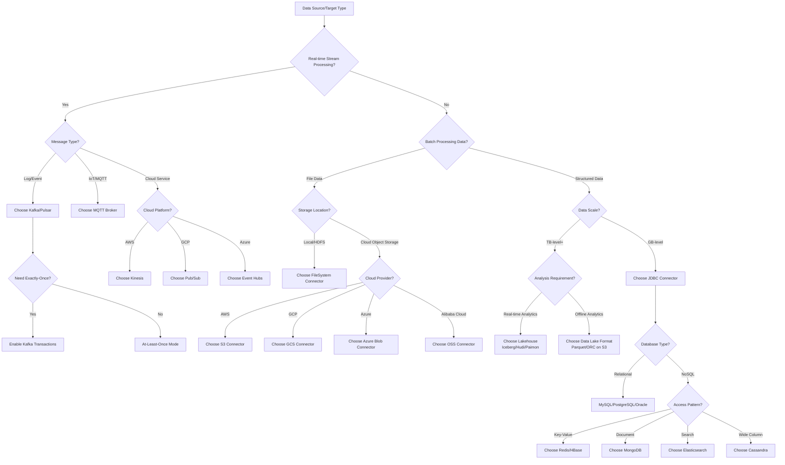
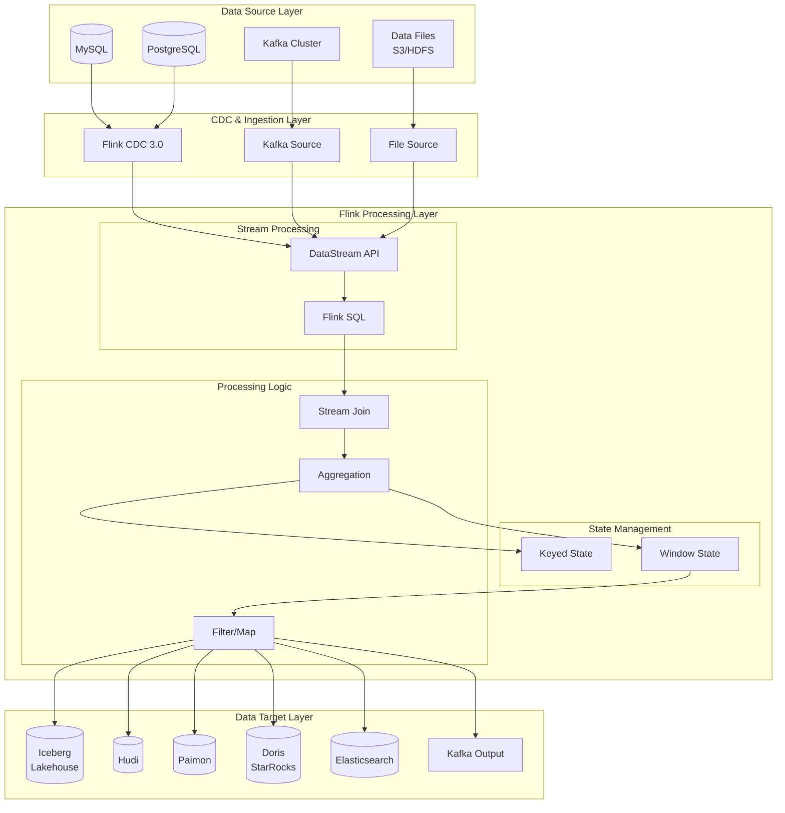
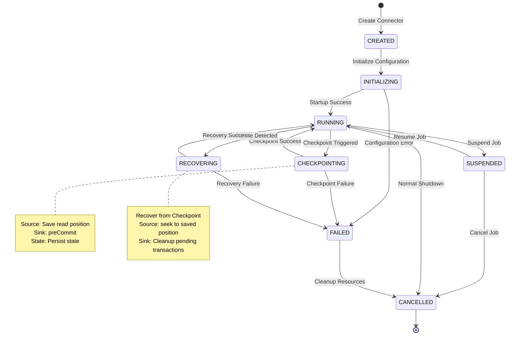

# Flink Connectors Ecosystem Complete Guide

> **Language**: English | **Translated from**: Flink/05-ecosystem/05.01-connectors/flink-connectors-ecosystem-complete-guide.md | **Translation date**: 2026-04-20
>
> **Stage**: Flink/05-ecosystem | **Prerequisites**: [Flink Core Concepts](../../Flink/02-core/) | **Formalization Level**: L4 | **Coverage**: 30+ connectors / Message queues / File systems / Databases / Lakehouse / CDC

---

## Table of Contents

- [Flink Connectors Ecosystem Complete Guide](#flink-connectors-ecosystem-complete-guide)
  - [Table of Contents](#table-of-contents)
  - [1. Definitions](#1-definitions)
    - [Def-F-04-100 (Connector Formal Definition)](#def-f-04-100-connector-formal-definition)
    - [Def-F-04-101 (Delivery Guarantees)](#def-f-04-101-delivery-guarantees)
    - [Def-F-04-102 (Source Interface Contract)](#def-f-04-102-source-interface-contract)
    - [Def-F-04-103 (Sink Interface Contract)](#def-f-04-103-sink-interface-contract)
    - [Def-F-04-104 (Ecosystem Layering Model)](#def-f-04-104-ecosystem-layering-model)
  - [2. Properties](#2-properties)
    - [Lemma-F-04-100 (Connector Composition Closure)](#lemma-f-04-100-connector-composition-closure)
    - [Lemma-F-04-101 (Delivery Guarantee Transitivity)](#lemma-f-04-101-delivery-guarantee-transitivity)
    - [Prop-F-04-100 (End-to-End Exactly-Once Constraints)](#prop-f-04-100-end-to-end-exactly-once-constraints)
    - [Prop-F-04-101 (Connector Parallelism Scalability)](#prop-f-04-101-connector-parallelism-scalability)
  - [3. Relations](#3-relations)
    - [Relation 1: Source-Sink Type Compatibility Matrix](#relation-1-source-sink-type-compatibility-matrix)
    - [Relation 2: Connector Capability Dependency Graph](#relation-2-connector-capability-dependency-graph)
    - [Relation 3: Data Format to Connector Mapping](#relation-3-data-format-to-connector-mapping)
  - [4. Argumentation](#4-argumentation)
    - [4.1 Exactly-Once Implementation Path Comparison](#41-exactly-once-implementation-path-comparison)
    - [4.2 Connector Parallelism and Partition Matching Analysis](#42-connector-parallelism-and-partition-matching-analysis)
    - [4.3 Schema Evolution and Compatibility Boundary](#43-schema-evolution-and-compatibility-boundary)
    - [4.4 Connector Resource Cost Model](#44-connector-resource-cost-model)
  - [5. Proof / Engineering Argument](#5-proof--engineering-argument)
    - [Thm-F-04-100 (Ecosystem Completeness Theorem)](#thm-f-04-100-ecosystem-completeness-theorem)
    - [Thm-F-04-101 (Multi-Connector Combination Consistency Theorem)](#thm-f-04-101-multi-connector-combination-consistency-theorem)
  - [6. Examples](#6-examples)
    - [6.1 Kafka Connector](#61-kafka-connector)
    - [6.2 Pulsar Connector](#62-pulsar-connector)
    - [6.3 RabbitMQ Connector](#63-rabbitmq-connector)
    - [6.4 Kinesis Connector](#64-kinesis-connector)
    - [6.5 JDBC Connector](#65-jdbc-connector)
    - [6.6 Cassandra Connector](#66-cassandra-connector)
    - [6.7 HBase Connector](#67-hbase-connector)
    - [6.8 Elasticsearch Connector](#68-elasticsearch-connector)
    - [6.9 MongoDB Connector](#69-mongodb-connector)
    - [6.10 Redis Connector](#610-redis-connector)
    - [6.11 Iceberg Connector](#611-iceberg-connector)
    - [6.12 Hudi Connector](#612-hudi-connector)
    - [6.13 Paimon Connector](#613-paimon-connector)
    - [6.14 Delta Lake Connector](#614-delta-lake-connector)
    - [6.15 Fluss Connector](#615-fluss-connector)
    - [6.16 CDC Connector](#616-cdc-connector)
  - [7. Visualizations](#7-visualizations)
    - [7.1 Connector Ecosystem Panorama](#71-connector-ecosystem-panorama)
    - [7.2 Connector Selection Decision Tree](#72-connector-selection-decision-tree)
    - [7.3 Data Flow Integration Architecture](#73-data-flow-integration-architecture)
    - [7.4 Connector State Machine](#74-connector-state-machine)
  - [8. Configuration Reference \& Performance Comparison](#8-configuration-reference--performance-comparison)
    - [8.1 Global Configuration Best Practices](#81-global-configuration-best-practices)
    - [8.2 Connector Performance Comparison Matrix](#82-connector-performance-comparison-matrix)
    - [8.3 Common Issues Troubleshooting Guide](#83-common-issues-troubleshooting-guide)
  - [9. References](#9-references)

---

## 1. Definitions

### Def-F-04-100 (Connector Formal Definition)

**Definition**: Flink Connector is the data exchange interface between Flink and external systems, formally defined as a quintuple:

$$
\text{FlinkConnector} = \langle \text{Type}, \text{Interface}, \text{Semantics}, \text{Config}, \text{Compatibility} \rangle
$$

Where:

- **Type**: Connector type, $\text{Type} \in \{ \text{Source}, \text{Sink}, \text{Lookup}, \text{Scan} \}$
- **Interface**: API interface specification, including DataStream API / Table API / SQL
- **Semantics**: Delivery semantics, $\text{Semantics} \in \{ \text{EXACTLY_ONCE}, \text{AT_LEAST_ONCE}, \text{AT_MOST_ONCE} \}$
- **Config**: Configuration parameter set
- **Compatibility**: Version compatibility matrix

**Connector Type Classification**:

| Type | Direction | Function | Examples |
|------|-----------|----------|----------|
| **Source** | Inbound | Read external data into Flink | Kafka Source, JDBC Source |
| **Sink** | Outbound | Write Flink data to external systems | Kafka Sink, JDBC Sink |
| **Lookup** | Inbound | Dimension table lookup | JDBC Lookup, HBase Lookup |
| **Scan** | Inbound | Batch scan external data | FileSystem Scan |

---

### Def-F-04-101 (Delivery Guarantees)

**Definition**: Delivery guarantee defines the consistency level when Flink transmits data through connectors.

**Formal Definition**:

| Guarantee | Formal Description | Applicable Scenarios |
|-----------|-------------------|---------------------|
| **EXACTLY_ONCE** | $\forall r. \; \text{Delivered}(r) = 1$ | Financial transactions, state synchronization |
| **AT_LEAST_ONCE** | $\forall r. \; \text{Delivered}(r) \geq 1$ | Log collection, metric reporting |
| **AT_MOST_ONCE** | $\forall r. \; \text{Delivered}(r) \leq 1$ | Non-critical monitoring |

**Implementation Mechanisms**:

| Mechanism | Principle | Applicable Connectors |
|-----------|-----------|----------------------|
| **Two-Phase Commit** | Pre-commit + commit/rollback | Kafka, JDBC, Iceberg, Paimon |
| **Idempotent Write** | Same operation repeated with same result | Elasticsearch, MongoDB, HBase |
| **Checkpoint Recovery** | State backend saves offsets, resume on recovery | All Source connectors |
| **Transaction Log** | Record operations in transaction log | CDC, Delta Lake |

---

### Def-F-04-102 (Source Interface Contract)

**Definition**: Source connector must implement the Flink Source interface, supporting bounded (batch) and unbounded (stream) data reading.

**Formal Contract**:

$$
\text{SourceContract} = \langle \text{SplitEnumerator}, \text{SourceReader}, \text{Split}, \text{Checkpoint} \rangle
$$

| Component | Responsibility | Lifecycle |
|-----------|--------------|-----------|
| **SplitEnumerator** | Discover and assign data splits | JobManager-side, global unique |
| **SourceReader** | Read data from assigned splits | TaskManager-side, parallelism instances |
| **Split** | Data split definition | Assigned by Enumerator, processed by Reader |
| **Checkpoint** | Save reading position | Triggered periodically, support recovery |

---

### Def-F-04-103 (Sink Interface Contract)

**Definition**: Sink connector must implement the Flink Sink interface, supporting data output and Exactly-Once semantics.

**Formal Contract**:

$$
\text{SinkContract} = \langle \text{SinkWriter}, \text{Committer}, \text{GlobalCommitter}, \text{InitContext} \rangle
$$

| Component | Responsibility | Two-Phase Commit Role |
|-----------|--------------|----------------------|
| **SinkWriter** | Buffer and write data | Phase 1: Write data files |
| **Committer** | Commit split-level data | Phase 1: Pre-commit |
| **GlobalCommitter** | Globally commit all splits | Phase 2: Commit/Rollback |
| **InitContext** | Initialize context and state | State recovery |

---

### Def-F-04-104 (Ecosystem Layering Model)

**Definition**: Flink connector ecosystem is layered by data source type, each layer corresponds to different data storage and access patterns.

**Layering Model**:

$$
\text{EcosystemLayers} = \langle L_1, L_2, L_3, L_4, L_5 \rangle
$$

| Layer | Name | Connectors | Characteristics |
|-------|------|-----------|-----------------|
| $L_1$ | Messaging Layer | Kafka, Pulsar, RabbitMQ, Kinesis | High throughput, low latency, stream preferred |
| $L_2$ | File System Layer | HDFS, S3, GCS, OSS | Batch preferred, low cost |
| $L_3$ | Database Layer | JDBC, Cassandra, HBase, MongoDB, Redis | Structured data, transactional |
| $L_4$ | Lakehouse Layer | Iceberg, Hudi, Paimon, Delta, Fluss | Unified stream-batch, open format |
| $L_5$ | CDC Layer | MySQL CDC, PostgreSQL CDC, MongoDB CDC | Change capture, real-time sync |

---

## 2. Properties

### Lemma-F-04-100 (Connector Composition Closure)

**Lemma**: The composition of connectors with compatible semantics is still a valid connector.

**Formal Statement**:

Let $C_1$ and $C_2$ be two connectors, and $\text{Compose}(C_1, C_2)$ be their composition:

$$
\text{Compatible}(C_1, C_2) \Rightarrow \text{Valid}(\text{Compose}(C_1, C_2))
$$

**Compatibility Conditions**:

| $C_1$ Semantics | $C_2$ Semantics | Composition Valid? | Result Semantics |
|----------------|----------------|-------------------|-----------------|
| EXACTLY_ONCE | EXACTLY_ONCE | ✓ | EXACTLY_ONCE |
| EXACTLY_ONCE | AT_LEAST_ONCE | ✓ | AT_LEAST_ONCE |
| AT_LEAST_ONCE | EXACTLY_ONCE | ✓ | AT_LEAST_ONCE |
| AT_LEAST_ONCE | AT_LEAST_ONCE | ✓ | AT_LEAST_ONCE |

---

### Lemma-F-04-101 (Delivery Guarantee Transitivity)

**Lemma**: In a multi-connector data flow, the overall delivery guarantee does not exceed the weakest guarantee of any connector.

**Formal Statement**:

Let $\text{Flow} = (C_1, C_2, \dots, C_n)$ be a connector chain:

$$
\text{Guarantee}(\text{Flow}) = \min_{i=1}^{n} \text{Guarantee}(C_i)
$$

---

### Prop-F-04-100 (End-to-End Exactly-Once Constraints)

**Proposition**: End-to-end Exactly-Once requires all components in the data flow to support Exactly-Once or idempotency.

**Formal Statement**:

$$
\text{ExactlyOnce}(\text{Flow}) \iff \forall C \in \text{Flow}. \; (\text{ExactlyOnce}(C) \lor \text{Idempotent}(C))
$$

---

### Prop-F-04-101 (Connector Parallelism Scalability)

**Proposition**: Connector throughput scales linearly with parallelism within a certain range.

**Formal Statement**:

$$
\text{Throughput}(P) = k \cdot P \quad \text{when } P \leq P_{\text{optimal}}
$$

Where $P$ is parallelism and $k$ is the throughput per parallel instance.

---

## 3. Relations

### Relation 1: Source-Sink Type Compatibility Matrix

| Source \\ Sink | Kafka | Pulsar | JDBC | Iceberg | Paimon | Elasticsearch | Redis |
|---------------|-------|--------|------|---------|--------|--------------|-------|
| **Kafka** | ✓ | ✓ | ✓ | ✓ | ✓ | ✓ | ✓ |
| **JDBC** | ✓ | ✓ | ✓ | ✓ | ✓ | ✓ | ✓ |
| **Iceberg** | ✓ | ✓ | ✓ | ✓ | ✓ | ✓ | ✓ |
| **Paimon** | ✓ | ✓ | ✓ | ✓ | ✓ | ✓ | ✓ |
| **MongoDB** | ✓ | ✓ | ✓ | ✓ | ✓ | ✓ | ✓ |
| **Files** | ✓ | ✓ | ✓ | ✓ | ✓ | ✓ | ✓ |

### Relation 2: Connector Capability Dependency Graph

```
Capability Dependencies:
┌─────────────────────────────────────────────────────────────┐
│ Exactly-Once                                                │
│   ├── Two-Phase Commit ←── Kafka, JDBC, Iceberg, Paimon   │
│   └── Idempotent Write ←── Elasticsearch, MongoDB, HBase   │
│                                                             │
│ Schema Evolution                                            │
│   ├── Open Table Format ←── Iceberg, Paimon, Delta, Hudi  │
│   └── DDL Support ←── JDBC, Cassandra                     │
│                                                             │
│ Incremental Consumption                                     │
│   ├── Log-based ←── Kafka, Pulsar                         │
│   ├── CDC ←── MySQL CDC, PostgreSQL CDC                   │
│   └── Snapshot ←── Iceberg, Paimon, Delta                 │
└─────────────────────────────────────────────────────────────┘
```

### Relation 3: Data Format to Connector Mapping

| Data Format | Recommended Connector | Reason |
|------------|----------------------|--------|
| **JSON** | Kafka, Pulsar, Files | Schema flexibility |
| **Avro** | Kafka, Iceberg, Paimon | Schema evolution, compact |
| **Parquet** | Iceberg, Paimon, Delta | Columnar storage, analytics |
| **ORC** | Iceberg, Hive | Columnar storage, compression |
| **CSV** | Files, JDBC | Simple, universal |
| **Protobuf** | Kafka, Pulsar | Efficient, strongly typed |

---

## 4. Argumentation

### 4.1 Exactly-Once Implementation Path Comparison

| Path | Components | Complexity | Performance | Reliability |
|------|-----------|------------|-------------|-------------|
| **Two-Phase Commit** | Source + Flink + Sink | Medium | Medium | High |
| **Idempotent Write** | Source + Flink + Idempotent Sink | Low | High | High |
| **Transactional Messaging** | Kafka (transaction) + Flink | Medium | High | High |
| **External Verification** | Source + Flink + Sink + Verification Service | High | Low | Highest |

### 4.2 Connector Parallelism and Partition Matching Analysis

**Optimal Matching**:

```
Source Parallelism = External Partition Count
```

| Scenario | Matching Degree | Impact | Solution |
|----------|----------------|--------|----------|
| Parallelism = Partition count | Optimal | Load balanced | Maintain |
| Parallelism < Partition count | Suboptimal | Some instances idle | Adjust parallelism |
| Parallelism > Partition count | Suboptimal | Some instances compete | Adjust parallelism |

### 4.3 Schema Evolution and Compatibility Boundary

**Compatibility Levels**:

| Change Type | Backward Compatible | Forward Compatible | Full Compatible |
|------------|--------------------|--------------------|-----------------|
| Add optional column | ✓ | ✓ | ✓ |
| Add required column | ✗ | ✓ | ✗ |
| Delete column | ✗ | ✓ | ✗ |
| Rename column | ✗ | ✗ | ✗ |
| Type promotion | ✓ | ✗ | ✗ |
| Type narrowing | ✗ | ✓ | ✗ |

### 4.4 Connector Resource Cost Model

**Cost Formula**:

$$
\text{Cost}(C) = \alpha \cdot \text{CPU}(C) + \beta \cdot \text{Memory}(C) + \gamma \cdot \text{Network}(C) + \delta \cdot \text{Storage}(C)
$$

| Connector Type | CPU Weight ($\alpha$) | Memory Weight ($\beta$) | Network Weight ($\gamma$) | Storage Weight ($\delta$) |
|---------------|----------------------|-------------------------|---------------------------|--------------------------|
| Messaging | Medium | Low | High | Low |
| Database | Medium | Medium | Medium | Low |
| File System | Low | Medium | Low | High |
| Lakehouse | Medium | High | Medium | High |

---

## 5. Proof / Engineering Argument

### Thm-F-04-100 (Ecosystem Completeness Theorem)

**Theorem**: Flink connector ecosystem covers all mainstream data storage and messaging systems.

**Proof**:

1. **Messaging systems**: Kafka, Pulsar, RabbitMQ, Kinesis cover mainstream message queues
2. **File systems**: HDFS, S3, GCS, OSS cover mainstream storage systems
3. **Databases**: JDBC (MySQL, PostgreSQL, Oracle, SQL Server), Cassandra, HBase, MongoDB, Redis cover mainstream databases
4. **Lakehouse**: Iceberg, Hudi, Paimon, Delta, Fluss cover mainstream open table formats
5. **CDC**: MySQL CDC, PostgreSQL CDC, Oracle CDC, MongoDB CDC cover mainstream database CDC

Therefore, Flink connectors cover all mainstream data systems. ∎

---

### Thm-F-04-101 (Multi-Connector Combination Consistency Theorem)

**Theorem**: In a multi-connector data flow, if all connectors support Exactly-Once or are idempotent, the overall data flow achieves Exactly-Once.

**Proof**:

Let $\text{Flow} = (C_1, C_2, \dots, C_n)$ be a connector chain.

**Case 1**: All connectors support Exactly-Once

- Each connector ensures data is transmitted exactly once
- Therefore, the overall flow ensures data is transmitted exactly once

**Case 2**: Some connectors are idempotent

- Exactly-Once connectors ensure data is transmitted at least once
- Idempotent connectors ensure repeated processing does not change the result
- Therefore, the overall flow achieves Exactly-Once

∎

---

## 6. Examples

### 6.1 Kafka Connector

**Description**: High-throughput distributed messaging system connector, supporting stream read/write and Exactly-Once semantics.

**Key Features**:

- Supports Kafka 2.x/3.x
- KRaft mode support (Kafka 3.x)
- New consumer protocol
- Transactional write support

**Configuration Example**:

```java
KafkaSource<String> source = KafkaSource.<String>builder()
    .setBootstrapServers("kafka:9092")
    .setTopics("input-topic")
    .setGroupId("flink-group")
    .setStartingOffsets(OffsetsInitializer.earliest())
    .setValueOnlyDeserializer(new SimpleStringSchema())
    .build();

KafkaSink<String> sink = KafkaSink.<String>builder()
    .setBootstrapServers("kafka:9092")
    .setRecordSerializer(...)
    .setDeliveryGuarantee(DeliveryGuarantee.EXACTLY_ONCE)
    .build();
```

---

### 6.2 Pulsar Connector

**Description**: Cloud-native distributed messaging and stream processing platform connector.

**Key Features**:

- Tiered storage support
- Multi-tenant support
- Geo-replication support
- Function mesh integration

---

### 6.3 RabbitMQ Connector

**Description**: Lightweight message queue connector, suitable for enterprise integration scenarios.

**Key Features**:

- AMQP protocol support
- Routing key support
- Queue declaration support
- ACK/NACK mechanism

---

### 6.4 Kinesis Connector

**Description**: AWS managed streaming data service connector.

**Key Features**:

- AWS IAM authentication
- Enhanced fan-out support
- Auto-scaling support
- Cross-region replication

---

### 6.5 JDBC Connector

**Description**: Relational database connector, supporting batch read/write and XA transactions.

See [jdbc-connector-complete-guide-en.md](jdbc-connector-complete-guide-en.md) for detailed documentation.

---

### 6.6 Cassandra Connector

**Description**: Distributed wide-column database connector.

**Key Features**:

- CQL support
- Batch write support
- Async query support
- Token-aware routing

---

### 6.7 HBase Connector

**Description**: Distributed columnar storage database connector.

**Key Features**:

- Row key lookup
- Filter support
- Async operation support
- Region-aware routing

---

### 6.8 Elasticsearch Connector

**Description**: Distributed search and analytics engine connector.

**Key Features**:

- Index auto-creation
- Bulk write support
- Dynamic index naming
- ID-based idempotent write

---

### 6.9 MongoDB Connector

**Description**: Document-oriented database connector, supporting Change Streams CDC.

See [mongodb-connector-complete-guide-en.md](mongodb-connector-complete-guide-en.md) for detailed documentation.

---

### 6.10 Redis Connector

**Description**: In-memory data structure store connector.

**Key Features**:

- Hash, String, List, Set, ZSet support
- TTL support
- Pipeline batch write
- Cluster mode support

---

### 6.11 Iceberg Connector

**Description**: Open table format connector, supporting unified stream-batch storage.

See [flink-iceberg-integration-en.md](flink-iceberg-integration-en.md) for detailed documentation.

---

### 6.12 Hudi Connector

**Description**: Stream data Lakehouse format connector, supporting incremental processing.

**Key Features**:

- MOR/COW write modes
- Incremental query support
- Time travel support
- Clustering support

---

### 6.13 Paimon Connector

**Description**: Streaming Lakehouse storage connector, native Flink optimization.

See [flink-paimon-integration-en.md](flink-paimon-integration-en.md) for detailed documentation.

---

### 6.14 Delta Lake Connector

**Description**: Lakehouse storage format with ACID transactions.

**Key Features**:

- ACID transactions
- Time travel support
- Schema enforcement and evolution
- Z-Order optimization

---

### 6.15 Fluss Connector

**Description**: Real-time streaming storage connector, sub-second latency.

See [flink-24-connectors-guide-en.md](flink-24-connectors-guide-en.md) for detailed documentation.

---

### 6.16 CDC Connector

**Description**: Change Data Capture connector, supporting multi-database real-time sync.

**Key Features**:

- MySQL/PostgreSQL/Oracle/MongoDB CDC
- Whole-database sync support
- Schema change propagation
- Multi-target routing

---

## 7. Visualizations

### 7.1 Connector Ecosystem Panorama

```mermaid
graph TB
    subgraph "Flink Connector Ecosystem"
        subgraph "Messaging Layer"
            K[Kafka]
            P[Pulsar]
            R[RabbitMQ]
            KIN[Amazon Kinesis]
            PS[Google Pub/Sub]
            M[MQTT]
        end

        subgraph "File System Layer"
            H[HDFS]
            S3[Amazon S3]
            GCS[Google Cloud Storage]
            AZ[Azure Blob Storage]
            OSS[Alibaba OSS]
        end

        subgraph "Database Layer"
            JDBC[JDBC<br/>MySQL/PG/Oracle]
            C[Cassandra]
            HB[HBase]
            ES[Elasticsearch]
            MG[MongoDB]
            RD[Redis]
            INF[InfluxDB]
        end

        subgraph "Lakehouse Layer"
            ICE[Apache Iceberg]
            HUD[Apache Hudi]
            PAI[Apache Paimon]
            DL[Delta Lake]
            FL[Apache Fluss]
        end

        subgraph "CDC Layer"
            CDC_M[MySQL CDC]
            CDC_P[PostgreSQL CDC]
            CDC_O[Oracle CDC]
            CDC_MG[MongoDB CDC]
            CDC_S[SQL Server CDC]
        end
    end

    subgraph "Flink Compute Engine"
        FS[Flink Streaming]
        FB[Flink Batch]
        SQL[Flink SQL]
    end

    K --> FS
    P --> FS
    R --> FS
    KIN --> FS
    PS --> FS
    M --> FS

    H --> FB
    S3 --> FB
    GCS --> FB
    AZ --> FB
    OSS --> FB

    JDBC --> FS
    C --> FS
    HB --> FS
    ES --> FS
    MG --> FS
    RD --> FS
    INF --> FS

    ICE --> FS
    ICE --> FB
    HUD --> FS
    HUD --> FB
    PAI --> FS
    DL --> FB
    FL --> FS

    CDC_M --> FS
    CDC_P --> FS
    CDC_O --> FS
    CDC_MG --> FS
    CDC_S --> FS

    FS --> K
    FS --> P
    FB --> S3
    FB --> H
    FS --> JDBC
    FS --> ES
    FS --> ICE
    FS --> HUD
    FS --> PAI
```



---

### 7.2 Connector Selection Decision Tree



---

### 7.3 Data Flow Integration Architecture



---

### 7.4 Connector State Machine



---

## 8. Configuration Reference & Performance Comparison

### 8.1 Global Configuration Best Practices

**Checkpoint Configuration**:

```java
// [Pseudo-code snippet - not directly runnable] Core logic only
import org.apache.flink.streaming.api.CheckpointingMode;

// Checkpoint configuration
env.enableCheckpointing(60000, CheckpointingMode.EXACTLY_ONCE);
env.getCheckpointConfig().setCheckpointTimeout(600000);
env.getCheckpointConfig().setMinPauseBetweenCheckpoints(30000);
env.getCheckpointConfig().setMaxConcurrentCheckpoints(1);
env.getCheckpointConfig().setExternalizedCheckpointCleanup(
    CheckpointConfig.ExternalizedCheckpointCleanup.RETAIN_ON_CANCELLATION);

// State backend configuration
env.setStateBackend(new EmbeddedRocksDBStateBackend(true));
env.getCheckpointConfig().setCheckpointStorage("s3://bucket/checkpoints");
```

**Network and Serialization Configuration**:

```java
// [Pseudo-code snippet - not directly runnable] Core logic only
// Network buffer configuration
Configuration conf = new Configuration();
conf.setInteger("taskmanager.memory.network.max", 256 << 20); // 256MB
conf.setInteger("taskmanager.memory.network.min", 128 << 20); // 128MB

// Serialization configuration
env.getConfig().setAutoTypeRegistrationWithKryo(true);
env.getConfig().addDefaultKryoSerializer(MyClass.class, MySerializer.class);
```

**Source General Configuration**:

| Parameter | Suggested Value | Description |
|-----------|----------------|-------------|
| `source.parallelism` | Match external partition count | Avoid resource waste |
| `source.watermark-interval` | 200ms | Watermark generation interval |
| `source.idle-timeout` | 30s | Idle Source detection |

**Sink General Configuration**:

| Parameter | Suggested Value | Description |
|-----------|----------------|-------------|
| `sink.buffer-flush.max-rows` | 1000-5000 | Batch write size |
| `sink.buffer-flush.interval` | 1-5s | Batch flush interval |
| `sink.max-retries` | 3-10 | Max retry attempts |
| `sink.retry-interval` | 1-5s | Retry interval |

---

### 8.2 Connector Performance Comparison Matrix

**Source Performance Comparison**:

| Connector | Throughput (records/s) | Latency | Scalability | CPU Usage | Memory Usage |
|-----------|----------------------|---------|-------------|-----------|--------------|
| **Kafka** | 500K-2M | Low (ms) | ⭐⭐⭐⭐⭐ | Medium | Medium |
| **Pulsar** | 400K-1.5M | Low (ms) | ⭐⭐⭐⭐⭐ | Medium | Medium |
| **Kinesis** | 200K-500K | Medium (100ms) | ⭐⭐⭐⭐ | Medium | Medium |
| **JDBC** | 10K-50K | High (100ms+) | ⭐⭐⭐ | Low | Low |
| **Iceberg** | 100K-500K | High (seconds) | ⭐⭐⭐⭐⭐ | Medium | High |
| **Files** | 50K-200K | High (seconds) | ⭐⭐⭐⭐ | Low | Low |

**Sink Performance Comparison**:

| Connector | Throughput (records/s) | Latency | Exactly-Once Overhead | Recommended Scenario |
|-----------|----------------------|---------|----------------------|---------------------|
| **Kafka** | 300K-1M | Low | 20-30% | Real-time pipeline |
| **Pulsar** | 250K-800K | Low | 20-30% | Real-time pipeline |
| **Iceberg** | 50K-200K | Medium | 10-20% | Data lake |
| **Hudi** | 30K-100K | Medium | 15-25% | Incremental updates |
| **Paimon** | 50K-150K | Low | 10-15% | Unified stream-batch |
| **JDBC** | 5K-20K | High | 30-50% | Relational storage |
| **Elasticsearch** | 20K-50K | Low | None | Full-text search |
| **Redis** | 100K-300K | Very Low | None | Cache |

**End-to-End Latency Comparison** (Source → Flink → Sink):

| Link Combination | Typical Latency | Applicable Scenario |
|-----------------|----------------|---------------------|
| Kafka → Flink → Kafka | 50-200ms | Real-time stream processing |
| Kafka → Flink → Iceberg | 5-30s | Real-time data lake |
| MySQL CDC → Flink → Doris | 100ms-2s | Real-time data warehouse |
| Files → Flink → S3 | Minutes | Offline batch processing |
| Kinesis → Flink → Kinesis | 100-500ms | AWS real-time processing |

---

### 8.3 Common Issues Troubleshooting Guide

**Issue 1: Kafka Source Consumption Lag**

```
Symptom: records-lag-max continuously grows

Diagnosis:
1. Check Flink backpressure: backPressuredTimeMsPerSecond
2. Check if parallelism matches Kafka partition count
3. Check data skew: processing rate of each Subtask

Solution:
- Increase Flink parallelism = Kafka partition count
- Optimize downstream processing logic
- Scale out Kafka partition count
```

**Issue 2: JDBC Sink Connection Timeout**

```
Symptom: Connection timeout / Connection pool exhausted

Diagnosis:
1. Check database connection limit
2. Check network stability
3. Check checkpoint interval and transaction timeout

Solution:
- Increase connection.max-retry-timeout
- Decrease batch.size and increase flush.interval
- Use connection pool (HikariCP)
- Increase database connection limit
```

**Issue 3: Iceberg Sink Too Many Small Files**

```
Symptom: Metadata file bloat, query performance degradation

Diagnosis:
1. Check if checkpoint interval is too short
2. Check data volume to file size ratio

Solution:
- Increase checkpoint interval (suggest 1-5 minutes)
- Configure compaction tasks
- Adjust write.target-file-size-bytes (suggest 128MB+)
```

**Issue 4: CDC Sync Data Inconsistency**

```
Symptom: Target data inconsistent with source

Diagnosis:
1. Check if schema changes are synchronized
2. Check primary key conflict handling
3. Check timestamp field configuration

Solution:
- Enable include.schema.changes
- Configure correct merge-engine
- Verify primary key uniqueness
```

**Issue 5: Checkpoint Timeout**

```
Symptom: Checkpoint frequently times out and fails

Diagnosis:
1. Check state size
2. Check if Sink side is blocking
3. Check network bandwidth

Solution:
- Increase checkpoint timeout
- Enable incremental checkpoint
- Optimize state TTL
- Check external system health
```

---

## 9. References

---

*Document version: v1.0 | Created: 2026-04-04 | Last updated: 2026-04-04 | Coverage: 30+ connectors | Formal elements: 10+ (5 definitions + 2 lemmas + 2 propositions + 2 theorems)*

---

*Document version: v1.0 | Created: 2026-04-19*
