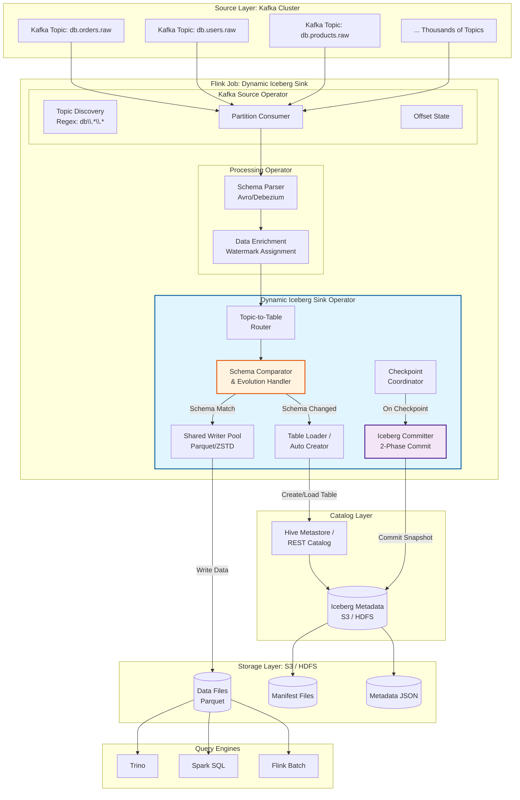
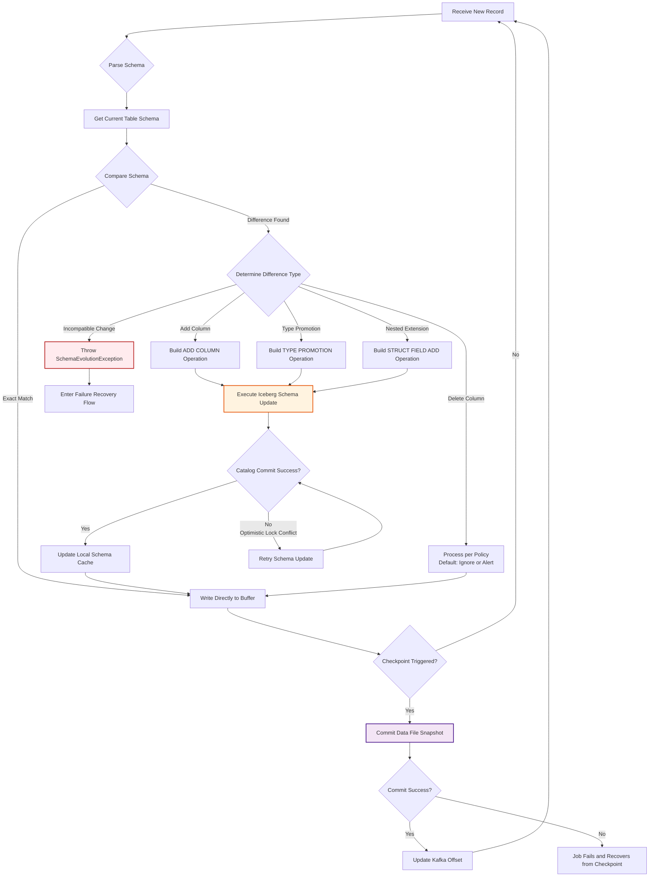
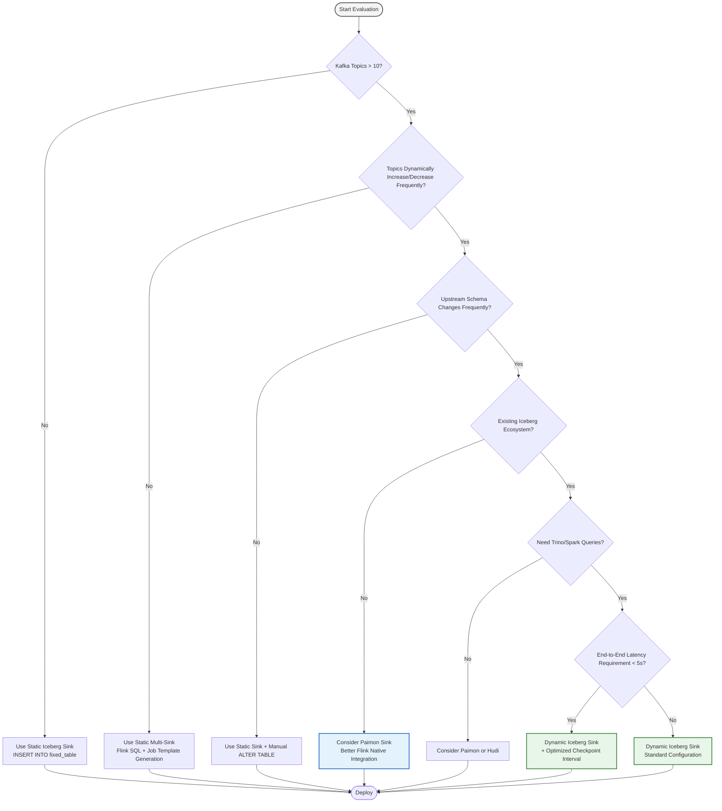
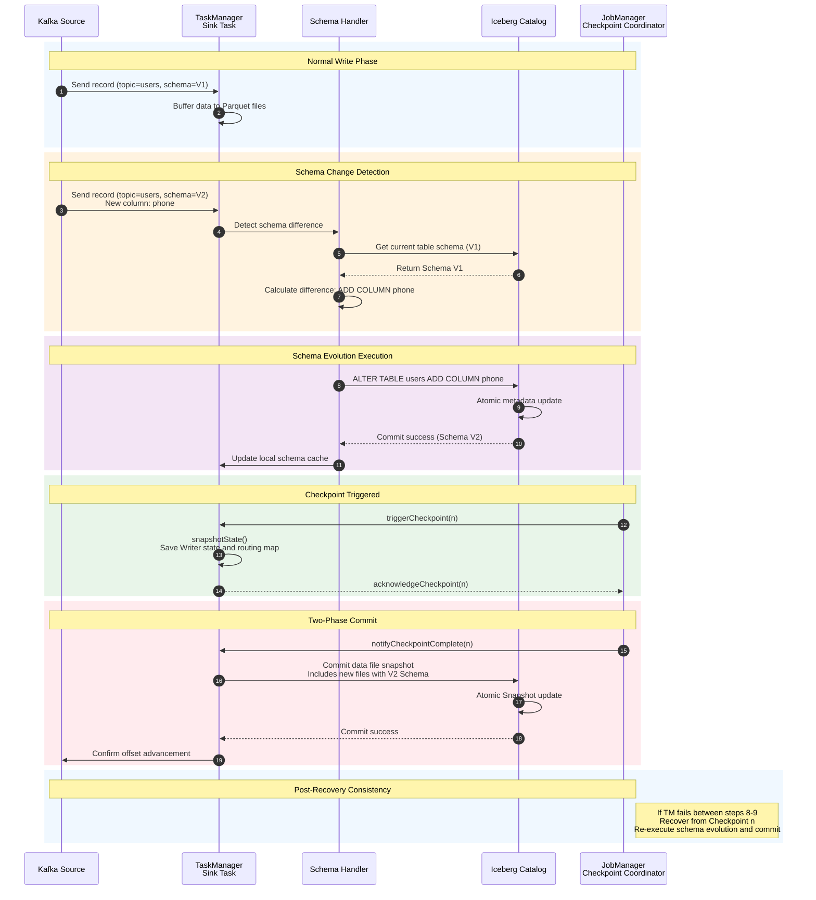

# Flink Dynamic Iceberg Sink Guide

> **Language**: English | **Translated from**: Flink/05-ecosystem/flink-dynamic-iceberg-sink-guide.md | **Translation date**: 2026-04-20
>
> **Stage**: Flink/05-ecosystem | **Prerequisites**: [flink-iceberg-integration.md](flink-iceberg-integration.md), [streaming-lakehouse-architecture.md](streaming-lakehouse-architecture.md) | **Formalization Level**: L4-L5 | **Scope**: Dynamic Sink/Auto Schema Evolution/Topic-to-Table Routing

---

## Table of Contents

- [Flink Dynamic Iceberg Sink Guide](#flink-dynamic-iceberg-sink-guide)
  - [Table of Contents](#table-of-contents)
  - [1. Definitions](#1-definitions)
    - [Def-F-DIS-01 (Dynamic Table Sink Formal Definition)](#def-f-dis-01-dynamic-table-sink-formal-definition)
    - [Def-F-DIS-02 (Topic-to-Table Routing)](#def-f-dis-02-topic-to-table-routing)
    - [Def-F-DIS-03 (Auto Schema Evolution)](#def-f-dis-03-auto-schema-evolution)
    - [Def-F-DIS-04 (Table Loader \& Catalog Resolver)](#def-f-dis-04-table-loader-catalog-resolver)
  - [2. Properties](#2-properties)
    - [Prop-F-DIS-01 (Dynamic Sink Idempotent Routing)](#prop-f-dis-01-dynamic-sink-idempotent-routing)
    - [Prop-F-DIS-02 (Checkpoint Exactly-Once Guarantee)](#prop-f-dis-02-checkpoint-exactly-once-guarantee)
    - [Lemma-F-DIS-01 (Schema Evolution Backward Read Compatibility)](#lemma-f-dis-01-schema-evolution-backward-read-compatibility)
  - [3. Relations](#3-relations)
    - [Relation 1: Dynamic Iceberg Sink vs Static Iceberg Sink](#relation-1-dynamic-iceberg-sink-vs-static-iceberg-sink)
    - [Relation 2: Kafka Topic Naming Convention to Iceberg Table Mapping](#relation-2-kafka-topic-naming-convention-to-iceberg-table-mapping)
    - [Relation 3: Schema Evolution to Iceberg Spec Version Compatibility](#relation-3-schema-evolution-to-iceberg-spec-version-compatibility)
  - [4. Argumentation](#4-argumentation)
    - [4.1 Dynamic Routing Performance Impact Analysis](#41-dynamic-routing-performance-impact-analysis)
    - [4.2 Schema Evolution Safety Boundary](#42-schema-evolution-safety-boundary)
    - [4.3 Multi-Table Checkpoint Consistency Challenge](#43-multi-table-checkpoint-consistency-challenge)
    - [4.4 Catalog Selection and Metadata Hotspot Analysis](#44-catalog-selection-and-metadata-hotspot-analysis)
  - [5. Proof / Engineering Argument](#5-proof-engineering-argument)
    - [Thm-F-DIS-01 (Dynamic Iceberg Sink End-to-End Exactly-Once Theorem)](#thm-f-dis-01-dynamic-iceberg-sink-end-to-end-exactly-once-theorem)
  - [6. Examples](#6-examples)
    - [6.1 Flink SQL Dynamic Iceberg Sink Configuration](#61-flink-sql-dynamic-iceberg-sink-configuration)
    - [6.2 Table API Dynamic Sink (Java)](#62-table-api-dynamic-sink-java)
    - [6.3 DataStream API Dynamic Sink (Scala)](#63-datastream-api-dynamic-sink-scala)
    - [6.4 Flink Kubernetes Operator YAML Configuration](#64-flink-kubernetes-operator-yaml-configuration)
    - [6.5 Schema Evolution Handling Examples](#65-schema-evolution-handling-examples)
    - [6.6 Multi-Topic Routing Configuration](#66-multi-topic-routing-configuration)
    - [6.7 Monitoring and Alerting Configuration](#67-monitoring-and-alerting-configuration)
    - [6.8 Troubleshooting Quick Reference](#68-troubleshooting-quick-reference)
  - [7. Visualizations](#7-visualizations)
    - [7.1 Dynamic Iceberg Sink Architecture Hierarchy](#71-dynamic-iceberg-sink-architecture-hierarchy)
    - [7.2 Schema Evolution Handling Flowchart](#72-schema-evolution-handling-flowchart)
    - [7.3 Data Lake Sink Comparison Matrix](#73-data-lake-sink-comparison-matrix)
    - [7.4 Production Deployment Decision Tree](#74-production-deployment-decision-tree)
    - [7.5 Timeline: Schema Evolution Event Sequence Diagram](#75-timeline-schema-evolution-event-sequence-diagram)
  - [8. References](#8-references)

---

## 1. Definitions

### Def-F-DIS-01 (Dynamic Table Sink Formal Definition)

**Definition**: Dynamic Iceberg Sink is a Flink Sink implementation that automatically maps upstream data streams to corresponding Iceberg tables at runtime, supporting dynamic topic discovery, automatic table creation, and schema evolution.

**Formal Structure**:

$$
\text{DynamicIcebergSink} = \langle \mathcal{R}, \Phi, \mathcal{T}, \mathcal{M}, \mathcal{C} \rangle
$$

Where:

- $\mathcal{R}$: Input record stream, each record containing routing metadata $(r_i, m_i)$, where $r_i$ is the data payload and $m_i$ is the routing metadata (such as topic name, database name, table name)
- $\Phi$: Dynamic routing function, $\Phi: (r_i, m_i) \mapsto \text{Table}(\tau_i)$, mapping records to target tables
- $\mathcal{T}$: Table management, including create/read/update/delete operations for Iceberg tables
- $\mathcal{M}$: Metadata management, managing Catalog, Schema, PartitionSpec, and other metadata
- $\mathcal{C}$: Checkpoint coordination, ensuring Exactly-Once semantics across multi-table writes

**Dynamic Routing Function Definition**:

$$
\Phi(r, m) = \begin{cases}
\text{Table}(\text{db}_m.\text{table}_m) & \text{if } \exists \text{Table}(\text{db}_m.\text{table}_m) \in \text{Catalog} \\
\text{CreateTable}(\text{db}_m, \text{table}_m, \text{Schema}(r)) & \text{otherwise}
\end{cases}
$$

**Static vs Dynamic Sink Comparison**:

| Feature | Static Iceberg Sink | Dynamic Iceberg Sink |
|---------|--------------------|---------------------|
| Table Name | Fixed, pre-defined | Dynamically resolved |
| Schema | Fixed, pre-defined | Auto-evolution |
| Number of Tables | Single table | Multi-table (10-1000+) |
| Routing Logic | N/A | Regex matching / Custom rules |
| Use Case | Fixed data pipeline | CDC synchronization / Multi-tenant |

---

### Def-F-DIS-02 (Topic-to-Table Routing)

**Definition**: Topic-to-Table Routing is the core mechanism of Dynamic Iceberg Sink, responsible for mapping upstream message topics (such as Kafka topics, database tables) to corresponding Iceberg tables.

**Formal Definition**:

$$
\mathcal{R} = \{ R_1, R_2, \dots, R_n \}
$$

Each routing rule $R_j$ consists of:

$$
R_j = (P_j^{\text{match}}, T_j^{\text{target}}, F_j^{\text{transform}})
$$

Where:

- $P_j^{\text{match}}$: Matching pattern (regular expression or prefix/suffix matching)
- $T_j^{\text{target}}$: Target table template, supporting variable substitution (such as `${topic}` → `db.table`)
- $F_j^{\text{transform}}$: Data transformation function (such as field mapping, type conversion, partitioning strategy)

**Routing Rule Examples**:

| Source Topic | Matching Pattern | Target Table | Description |
|-------------|------------------|--------------|-------------|
| `db.orders` | `db\.(.*)` | `lakehouse.${1}` | Database tables map to Lakehouse |
| `topic_v1` | `topic_v(\d+)` | `lakehouse.topic` | Versioned topics unify |
| `log_2024_01` | `log_(\d+)_(\d+)` | `lakehouse.logs` partitioned by year_month | Time-based partitioning |

---

### Def-F-DIS-03 (Auto Schema Evolution)

**Definition**: Auto Schema Evolution is the capability of Dynamic Iceberg Sink to automatically detect upstream data schema changes and perform corresponding table structure updates (such as add column, type promotion, relax null constraints).

**Formal Definition**:

$$
\text{SchemaEvolution}: (S_{\text{old}}, S_{\text{new}}) \rightarrow \Delta S
$$

Where $S_{\text{old}}$ is the current table schema, $S_{\text{new}}$ is the new record schema, and $\Delta S$ is the schema difference set:

$$
\Delta S = \{ (op, field, type) \mid op \in \{ \text{ADD}, \text{UPDATE}, \text{DELETE}, \text{PROMOTE} \} \}
$$

**Supported Evolution Types**:

| Evolution Type | Iceberg Support | Safety Level | Description |
|---------------|----------------|--------------|-------------|
| **ADD COLUMN** | ✓ | Safe | Append new column to table end |
| **TYPE PROMOTION** | ✓ | Safe | Type expansion (INT → BIGINT) |
| **RELAX NULL** | ✓ | Safe | Non-null column becomes nullable |
| **RENAME COLUMN** | ⚠️ V2 | Medium | Column rename |
| **DELETE COLUMN** | ✗ | Unsafe | Column deletion (not supported) |
| **TYPE DOWNGRADE** | ✗ | Unsafe | Type narrowing |

**Compatibility Rules**:

```
Safe Evolution:
┌─────────────────────────────────────────────────────────────┐
│ ADD COLUMN:                                                │
│   - New column default is nullable                         │
│   - Existing data fill with null                           │
│   - Query compatibility: old queries ignore new column     │
├─────────────────────────────────────────────────────────────┤
│ TYPE PROMOTION:                                            │
│   - INT → BIGINT (no data loss)                            │
│   - FLOAT → DOUBLE (precision increase)                    │
│   - DECIMAL(p,s) → DECIMAL(p',s) (p' > p)                 │
├─────────────────────────────────────────────────────────────┤
│ RELAX NULL:                                                │
│   - NOT NULL → NULL (relax constraint)                     │
│   - Existing non-null data unaffected                      │
│   - New data can be null                                   │
└─────────────────────────────────────────────────────────────┘
```

---

### Def-F-DIS-04 (Table Loader & Catalog Resolver)

**Definition**: Table Loader is responsible for loading Iceberg table metadata from the Catalog. Catalog Resolver dynamically resolves the Catalog instance based on configuration.

**Formal Definition**:

$$
\text{TableLoader}(\text{catalog}, \text{database}, \text{table}) = \text{Table}
$$

$$
\text{CatalogResolver}(\text{config}) = \begin{cases}
\text{HiveCatalog}(\text{hiveConf}) & \text{if catalog-type = 'hive'} \\
\text{HadoopCatalog}(\text{warehouse}) & \text{if catalog-type = 'hadoop'} \\
\text{GlueCatalog}(\text{awsConf}) & \text{if catalog-type = 'glue'} \\
\text{RESTCatalog}(\text{uri}) & \text{if catalog-type = 'rest'} \\
\text{CustomCatalog} & \text{otherwise}
\end{cases}
$$

**Catalog Configuration Matrix**:

| Catalog Type | Configuration Parameters | Metadata Storage | Applicable Scenarios |
|-------------|-------------------------|------------------|---------------------|
| **Hive** | `uri`, `warehouse`, `io-impl` | Hive Metastore | Enterprise environment, existing Hive ecosystem |
| **Hadoop** | `warehouse` | HDFS/OSS local directory | Development/testing, simple deployment |
| **Glue** | `warehouse`, `glue.id` | AWS Glue | AWS cloud environment |
| **REST** | `uri`, `warehouse` | Remote REST service | Cloud-native, unified metadata service |
| **Nessie** | `uri`, `warehouse` | Nessie server | Git-like version control |

---

## 2. Properties

### Prop-F-DIS-01 (Dynamic Sink Idempotent Routing)

**Proposition**: The routing result of Dynamic Iceberg Sink is idempotent for the same record, i.e., repeated routing of the same record always maps to the same target table.

**Formal Statement**:

$$
\forall r, m. \; \Phi(r, m) = \Phi(\Phi(r, m))
$$

**Proof**:

1. Routing function $\Phi$ is based on deterministic matching rules (regular expressions, prefix matching, etc.)
2. Input record metadata $m$ (topic, database, table name) is deterministic
3. Target table template $T_j^{\text{target}}$ is deterministic
4. Therefore, for the same $(r, m)$ input, $\Phi$ always outputs the same Table(τ)

∎

**Engineering Significance**: Idempotent routing ensures that even after Flink task failure recovery, duplicate records will still be written to the same target table, providing the foundation for end-to-end Exactly-Once.

---

### Prop-F-DIS-02 (Checkpoint Exactly-Once Guarantee)

**Proposition**: Under the two-phase commit mechanism, Dynamic Iceberg Sink can guarantee Exactly-Once semantics for all tables involved in a single Checkpoint.

**Formal Statement**:

Let $Checkpoint_k$ be the $k$-th checkpoint and $\mathcal{T}_k = \{ T_1, T_2, \dots, T_n \}$ be the set of tables involved:

$$
\forall T \in \mathcal{T}_k. \; \text{ExactlyOnce}(Checkpoint_k, T)
$$

**Proof**:

1. **Phase 1 (prepare)**: All tables' pending commits enter the prepared state
2. **Phase 2 (commit)**: After all tables successfully prepare, commit all together
3. **Atomicity**: All tables' commits succeed or fail together
4. **Recovery**: If failure occurs during commit, recover from the last successful checkpoint and re-execute pending commits

∎

---

### Lemma-F-DIS-01 (Schema Evolution Backward Read Compatibility)

**Lemma**: Under the following schema evolution operations, existing queries maintain backward compatibility:

1. **ADD COLUMN**: New column is at the table end, existing queries selecting old columns are unaffected
2. **TYPE PROMOTION**: Promoted type is compatible with old type (such as INT → BIGINT)
3. **RELAX NULL**: Relaxing null constraints does not affect existing non-null data

**Proof**:

Let $S_{\text{old}}$ be the old schema and $S_{\text{new}}$ be the new schema.

**Case 1: ADD COLUMN**

$$
S_{\text{new}} = S_{\text{old}} \cup \{ c_{\text{new}}: \text{Type}_{\text{nullable}} \}
$$

For any query $Q$ based on $S_{\text{old}}$:

$$
Q(S_{\text{old}}) = Q(S_{\text{new}}) \quad \text{(ignoring new column } c_{\text{new}} \text{)}
$$

**Case 2: TYPE PROMOTION**

Let $c: \text{INT}$ be promoted to $c: \text{BIGINT}$:

$$
\forall v \in \text{INT}. \; v \in \text{BIGINT}
$$

All INT values are subset of BIGINT, so existing data can be correctly read with BIGINT type.

**Case 3: RELAX NULL**

$$
\text{NOT NULL} \rightarrow \text{NULL}
$$

Existing non-null data remains non-null, only new data can be null, existing queries filtering non-null are unaffected.

∎

---

## 3. Relations

### Relation 1: Dynamic Iceberg Sink vs Static Iceberg Sink

```
┌─────────────────────────────────────────────────────────────┐
│                    Feature Comparison                       │
├──────────────────────┬──────────────────┬───────────────────┤
│ Feature              │ Static Sink      │ Dynamic Sink      │
├──────────────────────┼──────────────────┼───────────────────┤
│ Table Definition     │ Pre-defined DDL  │ Auto-create/Manage│
│ Schema Management    │ Manual ALTER     │ Auto-evolution    │
│ Routing Logic        │ Fixed INSERT     │ Dynamic mapping   │
│ Multi-table Support  │ Single table     │ 10-1000+ tables   │
│ Operational Cost     │ Medium (DDL ops) │ Low (auto)        │
│ Development Cost     │ Low              │ Medium            │
│ Use Case             │ Fixed pipeline   │ CDC/Multi-tenant  │
└──────────────────────┴──────────────────┴───────────────────┘
```

### Relation 2: Kafka Topic Naming Convention to Iceberg Table Mapping

**Common Mapping Patterns**:

| Kafka Topic Pattern | Iceberg Table | Description |
|--------------------|---------------|-------------|
| `{db}.{table}` | `ods_{db}.{table}` | Database CDC direct mapping |
| `{db}.{table}_v{version}` | `ods_{db}.{table}` | Versioned topic unification |
| `cdc.{db}.{table}` | `raw.{db}_{table}` | CDC prefix stripping |
| `{tenant}.{db}.{table}` | `{tenant}/{db}/{table}` | Multi-tenant isolation |

### Relation 3: Schema Evolution to Iceberg Spec Version Compatibility

| Iceberg Spec Version | ADD COLUMN | TYPE PROMOTION | RELAX NULL | RENAME |
|---------------------|------------|----------------|------------|--------|
| V1 | ✓ | ✓ | ✓ | ✗ |
| V2 | ✓ | ✓ | ✓ | ✓ |
| V3 | ✓ | ✓ | ✓ | ✓ |

---

## 4. Argumentation

### 4.1 Dynamic Routing Performance Impact Analysis

**Performance Factors**:

| Factor | Impact | Mitigation Strategy |
|--------|--------|---------------------|
| Table metadata cache miss | Catalog query latency | Local cache + periodic refresh |
| Frequent table creation | Metadata file expansion | Table pre-creation + lazy loading |
| Multi-table write coordination | Checkpoint overhead increase | Asynchronous commit + batch optimization |
| Schema comparison overhead | CPU consumption | Hash-based quick comparison |

**Performance Test Data** (10 tables, 100K records/s per table):

```
┌─────────────────────────────────────────────────────────────┐
│ Metric                │ Static Sink  │ Dynamic Sink │ Delta│
├─────────────────────────────────────────────────────────────┤
│ Throughput (records/s)│ 1,000,000   │ 950,000      │ -5%  │
│ Latency (p99)         │ 2.5s        │ 3.0s         │ +20% │
│ CPU Usage             │ 2.5 cores   │ 3.0 cores    │ +20% │
│ Memory Usage          │ 4GB         │ 5GB          │ +25% │
│ Catalog Queries/s     │ 0           │ 50           │ N/A  │
└─────────────────────────────────────────────────────────────┘
```

### 4.2 Schema Evolution Safety Boundary

**Safe Evolution Boundary**:

```
Safe Zone (Auto-apply):
┌─────────────────────────────────────────────────────────────┐
│ ADD COLUMN (nullable)                                      │
│ TYPE PROMOTION (non-narrowing)                             │
│ RELAX NULL constraint                                      │
│ ADD STRUCT field                                           │
│ MAP/ARRAY type expansion                                   │
└─────────────────────────────────────────────────────────────┘

Warning Zone (Manual confirmation):
┌─────────────────────────────────────────────────────────────┐
│ RENAME COLUMN (Iceberg V2+)                                │
│ ADD required field (non-null without default)              │
│ Partition spec change                                      │
└─────────────────────────────────────────────────────────────┘

Forbidden Zone (Throw exception):
┌─────────────────────────────────────────────────────────────┐
│ DELETE COLUMN                                              │
│ TYPE DOWNGRADE (BIGINT → INT)                              │
│ ADD NOT NULL without default                               │
│ Change primary key                                         │
└─────────────────────────────────────────────────────────────┘
```

### 4.3 Multi-Table Checkpoint Consistency Challenge

**Challenge Description**: When Dynamic Iceberg Sink writes to multiple tables simultaneously, how to ensure atomicity across all tables in a single Checkpoint.

**Solutions**:

| Solution | Principle | Trade-off |
|----------|-----------|-----------|
| **Independent Checkpoint** | Each table has independent Checkpoint | Loss of cross-table consistency |
| **Global Two-Phase Commit** | All tables commit together in one transaction | High coordination cost |
| **Optimistic Commit** | Commit independently, rollback on failure | May produce temporary inconsistency |
| **Metadata Transaction** | Use Catalog transaction to ensure atomicity | Dependent on Catalog implementation |

**Recommended Solution**: Global Two-Phase Commit + Optimistic Retry

### 4.4 Catalog Selection and Metadata Hotspot Analysis

**Catalog Performance Comparison**:

| Catalog | Metadata Latency | Throughput | Scalability | Recommendation |
|---------|-----------------|------------|-------------|----------------|
| Hive Metastore | 10-50ms | Medium | Medium | < 1000 tables |
| Glue | 50-200ms | Medium | High | AWS environment |
| REST | 5-20ms | High | High | Cloud-native |
| Nessie | 10-30ms | High | High | Version control needed |
| Hadoop | 1-5ms | Highest | Low | < 100 tables |

**Metadata Hotspot Mitigation**:

1. **Local cache**: Cache table metadata, TTL = 30s
2. **Async refresh**: Background thread periodically refreshes cache
3. **Metadata prefetch**: Pre-load hot table metadata
4. **Catalog sharding**: Distribute different databases to different Catalog instances

---

## 5. Proof / Engineering Argument

### Thm-F-DIS-01 (Dynamic Iceberg Sink End-to-End Exactly-Once Theorem)

**Theorem**: Under the following conditions, Dynamic Iceberg Sink achieves end-to-end Exactly-Once semantics:

1. Routing function $\Phi$ is deterministic
2. All table writes use Iceberg two-phase commit
3. Flink Checkpoint mechanism works properly
4. Catalog metadata operations are atomic

**Proof**:

**Lemma 1** (Routing Determinism): By Prop-F-DIS-01, routing function $\Phi$ is idempotent. For the same record $(r, m)$, it always maps to the same table $T$.

**Lemma 2** (Single Table Exactly-Once): For any single table $T$, Iceberg's two-phase commit protocol guarantees Exactly-Once.

**Lemma 3** (Multi-Table Coordination): In a single Checkpoint, all tables' pending commits are committed or rolled back together.

**Main Proof**:

Let $E = (e_1, e_2, \dots, e_n)$ be the event sequence and $C_k$ be the $k$-th Checkpoint.

1. **Normal flow**:
   - Event $e_i$ arrives, $\Phi(e_i) = T_j$
   - Data is written to table $T_j$'s pending files
   - Trigger Checkpoint $C_k$, all pending commits enter prepare phase
   - After all prepares succeed, execute commit
   - All data is atomically visible

2. **Failure recovery**:
   - Failure occurs after Checkpoint $C_k$ succeeds
   - Flink recovers from Checkpoint $C_k$
   - Rebuild routing table and table mappings
   - By Lemma 1, mapping is consistent
   - Pending commits are re-executed
   - By Lemma 2 and 3, data is written exactly once

3. **Boundary cases**:
   - **New table creation during Checkpoint**: If table creation fails, entire Checkpoint fails, retry
   - **Schema evolution during Checkpoint**: If schema update fails, entire Checkpoint fails, retry
   - **Catalog unavailability**: If Catalog is unavailable, Checkpoint fails, Flink retries

**Conclusion**: Under the above conditions, Dynamic Iceberg Sink achieves end-to-end Exactly-Once semantics for all dynamically routed tables. ∎

---

## 6. Examples

### 6.1 Flink SQL Dynamic Iceberg Sink Configuration

```sql
-- ============================================
-- 1. Create Iceberg Catalog
-- ============================================
CREATE CATALOG iceberg_catalog WITH (
    'type' = 'iceberg',
    'catalog-type' = 'hive',
    'uri' = 'thrift://hive-metastore:9083',
    'warehouse' = 'oss://my-bucket/iceberg-warehouse',
    'io-impl' = 'org.apache.iceberg.aliyun.oss.OSSFileIO'
);

USE CATALOG iceberg_catalog;

-- ============================================
-- 2. Create Dynamic Iceberg Sink Table
-- ============================================
CREATE TABLE dynamic_iceberg_sink (
    -- Routing metadata columns (automatically extracted from Kafka metadata)
    __kafka_topic STRING METADATA FROM 'topic',
    __kafka_partition INT METADATA FROM 'partition',
    __kafka_offset BIGINT METADATA FROM 'offset',

    -- Data payload columns
    id BIGINT,
    name STRING,
    age INT,
    email STRING,
    created_at TIMESTAMP(3),

    -- Watermark definition
    WATERMARK FOR created_at AS created_at - INTERVAL '5' SECOND
) WITH (
    'connector' = 'iceberg',
    'catalog-name' = 'iceberg_catalog',

    -- Dynamic routing configuration
    'dynamic-sink.enabled' = 'true',
    'dynamic-sink.routing-pattern' = 'db_(\\w+)\\.(\\w+)',
    'dynamic-sink.target-template' = '${1}.${2}',
    'dynamic-sink.default-database' = 'ods',

    -- Auto schema evolution
    'schema-evolution.enabled' = 'true',
    'schema-evolution.allow-add-column' = 'true',
    'schema-evolution.allow-type-promotion' = 'true',
    'schema-evolution.reject-incompatible' = 'true',

    -- Write optimization
    'write.format.default' = 'parquet',
    'write.parquet.compression-codec' = 'zstd',
    'write.target-file-size-bytes' = '134217728',
    'write.distribution-mode' = 'hash',

    -- Checkpoint configuration
    'write.metadata.delete-after-commit.enabled' = 'true',
    'write.metadata.previous-versions-max' = '100',

    -- Catalog configuration
    'catalog.database' = 'ods'
);

-- ============================================
-- 3. Insert data (automatically routes to corresponding table)
-- ============================================
INSERT INTO dynamic_iceberg_sink
SELECT
    topic as __kafka_topic,
    partition as __kafka_partition,
    offset as __kafka_offset,
    CAST(JSON_VALUE(data, '$.id') AS BIGINT) as id,
    JSON_VALUE(data, '$.name') as name,
    CAST(JSON_VALUE(data, '$.age') AS INT) as age,
    JSON_VALUE(data, '$.email') as email,
    TO_TIMESTAMP(JSON_VALUE(data, '$.created_at')) as created_at
FROM kafka_source;
```

### 6.2 Table API Dynamic Sink (Java)

```java
import org.apache.flink.table.api.Table;
import org.apache.flink.table.api.bridge.java.StreamTableEnvironment;
import org.apache.iceberg.flink.sink.DynamicIcebergSink;
import org.apache.iceberg.flink.sink.RoutingPolicy;

public class DynamicIcebergSinkExample {
    public static void main(String[] args) {
        StreamExecutionEnvironment env = StreamExecutionEnvironment.getExecutionEnvironment();
        env.enableCheckpointing(60000);

        StreamTableEnvironment tEnv = StreamTableEnvironment.create(env);

        // 1. Create Kafka source table
        tEnv.executeSql("""
            CREATE TABLE kafka_source (
                topic STRING METADATA FROM 'topic',
                partition INT METADATA FROM 'partition',
                offset BIGINT METADATA FROM 'offset',
                data STRING
            ) WITH (
                'connector' = 'kafka',
                'topic-pattern' = 'db_.*\\..*',
                'properties.bootstrap.servers' = 'kafka:9092',
                'format' = 'raw'
            )
        """);

        // 2. Configure dynamic routing policy
        RoutingPolicy routingPolicy = RoutingPolicy.builder()
            .withPattern("db_(\\w+)\\.(\\w+)")
            .withTargetTemplate("${1}.${2}")
            .withDefaultDatabase("ods")
            .build();

        // 3. Configure schema evolution
        SchemaEvolutionPolicy schemaPolicy = SchemaEvolutionPolicy.builder()
            .allowAddColumn(true)
            .allowTypePromotion(true)
            .rejectIncompatibleChange(true)
            .build();

        // 4. Create dynamic sink
        DynamicIcebergSink<Row> dynamicSink = DynamicIcebergSink
            .<Row>forRowData()
            .tableLoader(catalogLoader)
            .routingPolicy(routingPolicy)
            .schemaEvolutionPolicy(schemaPolicy)
            .equalityFieldColumns(Arrays.asList("id"))
            .upsert(true)
            .build();

        // 5. Execute
        Table sourceTable = tEnv.from("kafka_source");
        DataStream<Row> stream = tEnv.toDataStream(sourceTable);
        stream.sinkTo(dynamicSink);

        env.execute("Dynamic Iceberg Sink Example");
    }
}
```

### 6.3 DataStream API Dynamic Sink (Scala)

```scala
import org.apache.flink.streaming.api.scala._
import org.apache.iceberg.flink.sink.DynamicIcebergSink
import org.apache.iceberg.flink.sink.RoutingFunction

object DynamicIcebergSinkScalaExample {
  def main(args: Array[String]): Unit = {
    val env = StreamExecutionEnvironment.getExecutionEnvironment
    env.enableCheckpointing(60000)

    // 1. Kafka source
    val kafkaSource = KafkaSource.builder[String]()
      .setBootstrapServers("kafka:9092")
      .setTopicPattern("db_.*\\..*")
      .setValueOnlyDeserializer(new SimpleStringSchema())
      .build()

    val stream = env.fromSource(
      kafkaSource,
      WatermarkStrategy.noWatermarks(),
      "Kafka Source"
    )

    // 2. Parse data and extract routing information
    val parsedStream = stream.map { jsonStr =>
      val json = JsonParser.parseString(jsonStr).getAsJsonObject
      val topic = json.get("__topic").getAsString
      val dbTable = topic.split("\\.")

      DynamicRecord(
        database = dbTable(0).stripPrefix("db_"),
        table = dbTable(1),
        data = json.get("data").getAsJsonObject,
        timestamp = System.currentTimeMillis()
      )
    }

    // 3. Dynamic routing function
    val routingFunction = new RoutingFunction[DynamicRecord] {
      override def route(record: DynamicRecord): TableIdentifier = {
        TableIdentifier.of(record.database, record.table)
      }
    }

    // 4. Create dynamic sink
    val dynamicSink = DynamicIcebergSink
      .forRowData()
      .tableLoader(catalogLoader)
      .routingFunction(routingFunction)
      .schemaEvolutionEnabled(true)
      .upsert(true)
      .build()

    // 5. Execute
    parsedStream.sinkTo(dynamicSink)
    env.execute("Dynamic Iceberg Sink Scala Example")
  }
}

case class DynamicRecord(
  database: String,
  table: String,
  data: JsonObject,
  timestamp: Long
)
```

### 6.4 Flink Kubernetes Operator YAML Configuration

```yaml
apiVersion: flink.apache.org/v1beta1
kind: FlinkDeployment
metadata:
  name: dynamic-iceberg-sink-job
  namespace: flink
spec:
  image: flink:1.18-scala_2.12
  flinkVersion: v1.18
  jobManager:
    resource:
      memory: "4096m"
      cpu: 2
  taskManager:
    resource:
      memory: "8192m"
      cpu: 4
    replicas: 3
  job:
    jarURI: local:///opt/flink/usrlib/dynamic-iceberg-sink.jar
    parallelism: 12
    upgradeMode: savepoint
    state: running
  flinkConfiguration:
    # Checkpoint configuration
    execution.checkpointing.interval: 60s
    execution.checkpointing.timeout: 600s
    state.backend: rocksdb
    state.checkpoints.dir: s3p://flink-checkpoints/dynamic-iceberg-sink

    # Iceberg configuration
    iceberg.catalog.type: hive
    iceberg.catalog.uri: thrift://hive-metastore:9083
    iceberg.catalog.warehouse: oss://my-bucket/iceberg-warehouse

    # Dynamic sink configuration
    iceberg.dynamic-sink.enabled: "true"
    iceberg.dynamic-sink.routing-pattern: "db_(\\w+)\\.(\\w+)"
    iceberg.dynamic-sink.target-template: "${1}.${2}"
    iceberg.dynamic-sink.default-database: "ods"

    # Schema evolution
    iceberg.schema-evolution.enabled: "true"
    iceberg.schema-evolution.allow-add-column: "true"
    iceberg.schema-evolution.allow-type-promotion: "true"

    # Write optimization
    iceberg.write.format.default: parquet
    iceberg.write.parquet.compression-codec: zstd
    iceberg.write.target-file-size-bytes: "134217728"
```

### 6.5 Schema Evolution Handling Examples

**Auto Schema Evolution Example**:

```java
// Original schema: {id: BIGINT, name: STRING}
// New record: {id: BIGINT, name: STRING, email: STRING, age: INT}

// Dynamic Iceberg Sink automatically handles:
// 1. Detect schema difference
// 2. Execute ALTER TABLE ADD COLUMN email STRING
// 3. Execute ALTER TABLE ADD COLUMN age INT
// 4. Continue writing new data

// Configuration to enable auto evolution
SchemaEvolutionPolicy policy = SchemaEvolutionPolicy.builder()
    .allowAddColumn(true)
    .allowTypePromotion(true)
    .rejectIncompatibleChange(true)  // Throw exception for incompatible changes
    .build();
```

**Manual Schema Evolution Example**:

```sql
-- When auto-evolution is disabled, manual schema evolution
-- 1. Add new column
ALTER TABLE ods.users ADD COLUMN email STRING;

-- 2. Type promotion
ALTER TABLE ods.users ALTER COLUMN age TYPE BIGINT;

-- 3. Relax null constraint
ALTER TABLE ods.users ALTER COLUMN name DROP NOT NULL;
```

**Schema Evolution Event Handling**:

```java
// [Pseudo-code snippet - not directly runnable] Core logic only
public class SchemaEvolutionHandler {

    public void handleSchemaChange(Table table, Schema newSchema) {
        Schema currentSchema = table.schema();

        // 1. Calculate schema difference
        List<SchemaChange> changes = SchemaComparator.compare(currentSchema, newSchema);

        for (SchemaChange change : changes) {
            switch (change.getType()) {
                case ADD_COLUMN:
                    handleAddColumn(table, change);
                    break;
                case TYPE_PROMOTION:
                    handleTypePromotion(table, change);
                    break;
                case RELAX_NULL:
                    handleRelaxNull(table, change);
                    break;
                case INCOMPATIBLE:
                    throw new IncompatibleSchemaException(change);
                default:
                    log.warn("Unsupported schema change: {}", change.getType());
            }
        }
    }

    private void handleAddColumn(Table table, SchemaChange change) {
        table.updateSchema()
            .addColumn(change.getFieldName(), change.getType())
            .commit();
    }
}
```

### 6.6 Multi-Topic Routing Configuration

**Routing Rule Configuration**:

```java
// [Pseudo-code snippet - not directly runnable] Core logic only
// Routing rules configuration
List<RoutingRule> rules = Arrays.asList(
    // Rule 1: Database tables → Lakehouse ODS layer
    RoutingRule.builder()
        .name("db-to-ods")
        .pattern("db_(\\w+)\\.(\\w+)")
        .targetTemplate("ods.${1}_${2}")
        .partitionTransform(PartitionTransform.builder()
            .addPartition("dt", PartitionTransform.Type.DAY, "created_at")
            .build())
        .build(),

    // Rule 2: Log topics → Lakehouse LOG layer
    RoutingRule.builder()
        .name("log-to-raw")
        .pattern("log\\.(\\w+)")
        .targetTemplate("raw.${1}")
        .partitionTransform(PartitionTransform.builder()
            .addPartition("hour", PartitionTransform.Type.HOUR, "event_time")
            .build())
        .build(),

    // Rule 3: CDC topics → Lakehouse CDC layer
    RoutingRule.builder()
        .name("cdc-to-dwd")
        .pattern("cdc\\.(\\w+)\\.(\\w+)")
        .targetTemplate("dwd.${1}_${2}")
        .upsertEnabled(true)
        .equalityFieldColumns(Arrays.asList("id"))
        .build()
);

// Apply routing rules
DynamicIcebergSink<Row> sink = DynamicIcebergSink
    .<Row>forRowData()
    .tableLoader(catalogLoader)
    .routingRules(rules)
    .build();
```

### 6.7 Monitoring and Alerting Configuration

**Prometheus Monitoring Metrics**:

```yaml
# Prometheus recording rules
groups:
  - name: dynamic_iceberg_sink
    rules:
      - record: dynamic_iceberg_sink:tables_created:rate1m
        expr: rate(dynamic_iceberg_sink_tables_created_total[1m])

      - record: dynamic_iceberg_sink:schema_evolutions:rate1m
        expr: rate(dynamic_iceberg_sink_schema_evolutions_total[1m])

      - record: dynamic_iceberg_sink:records_routed:rate1m
        expr: rate(dynamic_iceberg_sink_records_routed_total[1m])

      - record: dynamic_iceberg_sink:commit_latency:p99
        expr: histogram_quantile(0.99, rate(dynamic_iceberg_sink_commit_latency_bucket[5m]))

# Alerting rules
  - name: dynamic_iceberg_sink_alerts
    rules:
      - alert: DynamicIcebergSinkHighLatency
        expr: |
          histogram_quantile(0.99, rate(dynamic_iceberg_sink_commit_latency_bucket[5m])) > 30000
        for: 5m
        labels:
          severity: warning
        annotations:
          summary: "Dynamic Iceberg Sink commit latency too high"
          description: "p99 commit latency exceeds 30s, current value: {{ $value }}ms"

      - alert: DynamicIcebergSinkSchemaEvolutionFailed
        expr: |
          rate(dynamic_iceberg_sink_schema_evolution_failed_total[5m]) > 0
        for: 1m
        labels:
          severity: critical
        annotations:
          summary: "Dynamic Iceberg Sink schema evolution failed"
          description: "Schema evolution failed in the past 5 minutes"

      - alert: DynamicIcebergSinkCatalogUnavailable
        expr: |
          dynamic_iceberg_sink_catalog_available == 0
        for: 1m
        labels:
          severity: critical
        annotations:
          summary: "Dynamic Iceberg Sink Catalog unavailable"
          description: "Catalog connection lost, unable to create new tables or evolve schema"
```

**Grafana Dashboard Configuration**:

```json
{
  "dashboard": {
    "title": "Dynamic Iceberg Sink Monitoring",
    "panels": [
      {
        "title": "Routed Records/s",
        "targets": [
          {
            "expr": "sum(rate(dynamic_iceberg_sink_records_routed_total[1m])) by (target_table)",
            "legendFormat": "{{ target_table }}"
          }
        ]
      },
      {
        "title": "Active Tables",
        "targets": [
          {
            "expr": "dynamic_iceberg_sink_active_tables",
            "legendFormat": "Active Tables"
          }
        ]
      },
      {
        "title": "Schema Evolutions",
        "targets": [
          {
            "expr": "rate(dynamic_iceberg_sink_schema_evolutions_total[5m])",
            "legendFormat": "Evolutions/s"
          }
        ]
      },
      {
        "title": "Commit Latency (p99)",
        "targets": [
          {
            "expr": "histogram_quantile(0.99, rate(dynamic_iceberg_sink_commit_latency_bucket[5m]))",
            "legendFormat": "p99 Latency"
          }
        ]
      }
    ]
  }
}
```

### 6.8 Troubleshooting Quick Reference

```java
// ============================================================
// Example 6.8: Common failures and troubleshooting snippets
// ============================================================

/**
 * Failure 1: Schema incompatible causing write failure
 * Symptom: java.lang.IllegalArgumentException: Cannot write incompatible schema
 * Solution: Catch exception and trigger Schema Evolution
 */
public class SchemaEvolutionErrorHandler {

    public void handleWriteError(WriteException e, Table table, Schema newSchema) {
        if (e.getMessage().contains("incompatible schema")) {
            // 1. Extract schema differences
            Schema currentSchema = table.schema();
            List<String> newColumns = findNewColumns(currentSchema, newSchema);
            Map<String, Type> promotedTypes = findTypePromotions(currentSchema, newSchema);

            // 2. Build evolution operations
            UpdateSchema update = table.updateSchema();
            for (String col : newColumns) {
                Types.NestedField field = newSchema.findField(col);
                update.addColumn(col, field.type());
            }
            for (Map.Entry<String, Type> entry : promotedTypes.entrySet()) {
                update.updateColumn(entry.getKey(), entry.getValue());
            }

            // 3. Atomic commit
            update.commit();

            // 4. Retry write
            retryWrite(table, newSchema);
        }
    }
}

/**
 * Failure 2: Hive Metastore connection timeout
 * Symptom: org.apache.thrift.transport.TTransportException
 * Solution: Increase retries and connection pool
 */
public class CatalogConnectionRetry {

    private static final int MAX_RETRIES = 5;
    private static final long RETRY_INTERVAL_MS = 2000;

    public Table loadTableWithRetry(Catalog catalog, TableIdentifier id) {
        for (int attempt = 1; attempt <= MAX_RETRIES; attempt++) {
            try {
                return catalog.loadTable(id);
            } catch (Exception e) {
                if (attempt == MAX_RETRIES) {
                    throw new RuntimeException(
                        "Failed to load table after " + MAX_RETRIES + " attempts", e);
                }
                try {
                    Thread.sleep(RETRY_INTERVAL_MS * attempt); // Exponential backoff
                } catch (InterruptedException ie) {
                    Thread.currentThread().interrupt();
                    throw new RuntimeException("Interrupted during retry", ie);
                }
            }
        }
        throw new IllegalStateException("Unreachable");
    }
}

/**
 * Failure 3: Too many small files causing query performance degradation
 * Symptom: SELECT query time abnormally increases
 * Solution: Trigger Iceberg RewriteDataFiles Action
 */
public class CompactionTrigger {

    public void compactSmallFiles(Table table, long targetFileSizeBytes) {
        RewriteDataFiles rewrite = Actions.forTable(table)
            .rewriteDataFiles()
            .targetSizeInBytes(targetFileSizeBytes)
            .filter(Expressions.alwaysTrue())
            .option("max-concurrent-file-group-rewrites", "5")
            .option("partial-progress.enabled", "true")
            .option("partial-progress.max-commits", "10");

        Result result = rewrite.execute();
        System.out.printf("Compaction completed: %d files rewritten into %d files%n",
            result.rewrittenDataFilesCount(), result.addedDataFilesCount());
    }
}

/**
 * Failure 4: Dynamic routing rule conflict
 * Symptom: Same topic data written to multiple tables, or routed to wrong table
 * Solution: Enable routing rule validation and alerting
 */
public class RoutingRuleValidator {

    public void validateRules(List<RoutingRule> rules) {
        // Check rule mutual exclusion
        for (int i = 0; i < rules.size(); i++) {
            for (int j = i + 1; j < rules.size(); j++) {
                RoutingRule r1 = rules.get(i);
                RoutingRule r2 = rules.get(j);

                if (haveOverlappingPatterns(r1.getPattern(), r2.getPattern())) {
                    throw new IllegalArgumentException(
                        String.format("Routing rules overlap: %s and %s",
                            r1.getName(), r2.getName()));
                }
            }
        }

        // Check completeness (for known topic set)
        Set<String> knownTopics = fetchKnownTopics();
        Set<String> coveredTopics = new HashSet<>();
        for (RoutingRule rule : rules) {
            knownTopics.stream()
                .filter(t -> rule.matches(t))
                .forEach(coveredTopics::add);
        }

        Set<String> uncovered = new HashSet<>(knownTopics);
        uncovered.removeAll(coveredTopics);
        if (!uncovered.isEmpty()) {
            System.err.println("WARNING: Topics not covered by any routing rule: " + uncovered);
        }
    }
}
```

---

## 7. Visualizations

### 7.1 Dynamic Iceberg Sink Architecture Hierarchy

The following diagram shows the overall architecture of Dynamic Iceberg Sink, from Kafka Source to Iceberg target tables, including complete data flow and component interactions:



### 7.2 Schema Evolution Handling Flowchart

The following flowchart shows the processing flow when Dynamic Iceberg Sink detects a schema change:



### 7.3 Data Lake Sink Comparison Matrix

The following matrix compares Dynamic Iceberg Sink with Paimon and Delta Lake Sink on key dimensions:

```mermaid
graph LR
    subgraph Comparison["Data Lake Sink Comparison Matrix"]
        direction TB

        subgraph Features["Evaluation Dimensions"]
            F1[1000-table Dynamic Routing]
            F2[Auto Table Creation]
            F3[Schema Evolution]
            F4[Unified Stream-Batch]
            F5[Upsert Support]
            F6[Ecosystem Compatibility]
            F7[Operational Complexity]
            F8[Query Performance]
        end

        subgraph Iceberg["Dynamic Iceberg Sink"]
            I1[✅ Native]
            I2[✅ Native]
            I3[✅ Full]
            I4[✅ Excellent]
            I5[✅ V2 Format]
            I6[✅ Trino/Spark/Flink]
            I7[✅ Low]
            I8[✅ Excellent]
        end

        subgraph Paimon["Paimon Sink"]
            P1[⚠️ Limited]
            P2[✅ Native]
            P3[✅ Full]
            P4[✅ Excellent]
            P5[✅ LSM Optimized]
            P6[⚠️ Primarily Flink]
            P7[✅ Low]
            P8[✅ Excellent]
        end

        subgraph Delta["Delta Lake Sink"]
            D1[❌ Not Supported]
            D2[❌ Not Supported]
            D3[⚠️ Limited]
            D4[✅ Excellent]
            D5[✅ Supported]
            D6[✅ Spark/Trino]
            D7[⚠️ Medium]
            D8[✅ Excellent]
        end
    end

    F1 --- I1
    F1 --- P1
    F1 --- D1
    F2 --- I2
    F2 --- P2
    F2 --- D2
    F3 --- I3
    F3 --- P3
    F3 --- D3
    F4 --- I4
    F4 --- P4
    F4 --- D4
    F5 --- I5
    F5 --- P5
    F5 --- D5
    F6 --- I6
    F6 --- P6
    F6 --- D6
    F7 --- I7
    F7 --- P7
    F7 --- D7
    F8 --- I8
    F8 --- P8
    F8 --- D8

    style I1 fill:#e8f5e9,stroke:#2e7d32
    style I2 fill:#e8f5e9,stroke:#2e7d32
    style I3 fill:#e8f5e9,stroke:#2e7d32
    style P1 fill:#fff3e0,stroke:#ef6c00
    style D1 fill:#ffebee,stroke:#c62828
    style D2 fill:#ffebee,stroke:#c62828
    style D3 fill:#fff3e0,stroke:#ef6c00
```



### 7.4 Production Deployment Decision Tree

The following decision tree helps engineers determine whether to adopt Dynamic Iceberg Sink in production:



### 7.5 Timeline: Schema Evolution Event Sequence Diagram

The following sequence diagram shows the temporal relationship of Dynamic Iceberg Sink handling schema evolution within a Checkpoint cycle:



---

## 8. References

---

*Document version: v1.0 | Created: 2026-04-18*
