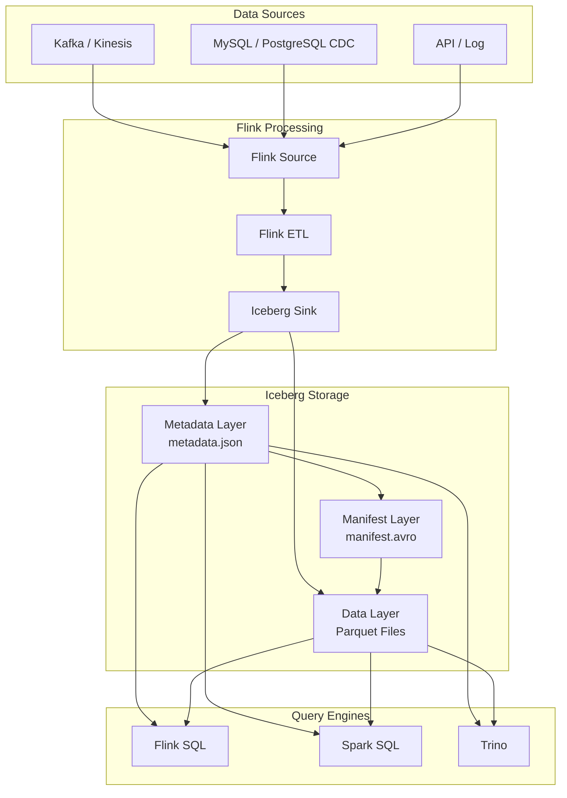
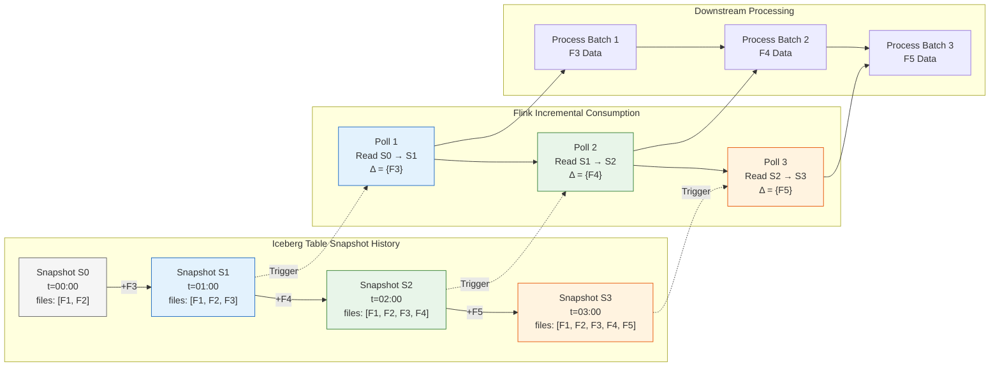
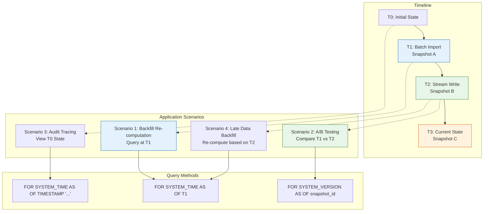
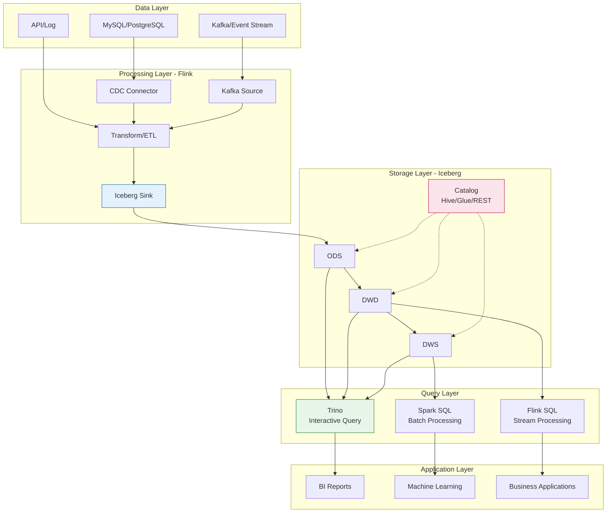

# Flink + Apache Iceberg Integration

> **Language**: English | **Translated from**: Flink/05-ecosystem/05.02-lakehouse/flink-iceberg-integration.md | **Translation date**: 2026-04-20
>
> **Stage**: Flink/05-ecosystem | **Prerequisites**: [flink-connectors-ecosystem-complete-guide.md](flink-connectors-ecosystem-complete-guide.md) | **Formalization Level**: L4-L5 | **Scope**: Stream-batch unified Lakehouse storage / Exactly-Once via two-phase commit

---

## Table of Contents

- [Flink + Apache Iceberg Integration](#flink--apache-iceberg-integration)
  - [Table of Contents](#table-of-contents)
  - [1. Definitions](#1-definitions)
    - [Def-F-14-01 (Iceberg Table Format Formalization)](#def-f-14-01-iceberg-table-format-formalization)
    - [Def-F-14-02 (Flink Stream Read/Write Semantics)](#def-f-14-02-flink-stream-readwrite-semantics)
    - [Def-F-14-03 (Incremental Snapshot Consumption)](#def-f-14-03-incremental-snapshot-consumption)
    - [Def-F-14-04 (Time Travel Query)](#def-f-14-04-time-travel-query)
    - [Def-F-14-05 (Hidden Partitioning)](#def-f-14-05-hidden-partitioning)
    - [Def-F-14-06 (Snapshot Isolation)](#def-f-14-06-snapshot-isolation)
  - [2. Properties](#2-properties)
    - [Lemma-F-14-01 (Snapshot Immutability and Linear History)](#lemma-f-14-01-snapshot-immutability-and-linear-history)
  - [3. Relations](#3-relations)
    - [Relation 1: Flink Checkpoint to Iceberg Snapshot Mapping](#relation-1-flink-checkpoint-to-iceberg-snapshot-mapping)
    - [Relation 2: Flink Watermark to Iceberg Partition Evolution](#relation-2-flink-watermark-to-iceberg-partition-evolution)
    - [Relation 3: Stream-Batch Query Equivalence](#relation-3-stream-batch-query-equivalence)
  - [4. Argumentation](#4-argumentation)
    - [4.1 Iceberg V1 vs V2 Write Performance Trade-off](#41-iceberg-v1-vs-v2-write-performance-trade-off)
    - [4.2 Small File Problem and Compaction Strategy](#42-small-file-problem-and-compaction-strategy)
    - [4.3 Partition Evolution vs Re-partitioning Cost](#43-partition-evolution-vs-re-partitioning-cost)
    - [4.4 Catalog Selection and Cross-Region Consistency](#44-catalog-selection-and-cross-region-consistency)
  - [5. Proof / Engineering Argument](#5-proof--engineering-argument)
    - [Thm-F-14-01 (End-to-End Exactly-Once Semantics)](#thm-f-14-01-end-to-end-exactly-once-semantics)
    - [Thm-F-14-02 (Incremental Consumption Completeness)](#thm-f-14-02-incremental-consumption-completeness)
    - [Thm-F-14-03 (Time Travel Consistency)](#thm-f-14-03-time-travel-consistency)
  - [6. Examples](#6-examples)
    - [6.1 Iceberg Catalog Configuration](#61-iceberg-catalog-configuration)
    - [6.2 Flink SQL Read/Write Iceberg](#62-flink-sql-readwrite-iceberg)
    - [6.3 Streaming Write Iceberg](#63-streaming-write-iceberg)
    - [6.4 Incremental Consumption](#64-incremental-consumption)
    - [6.5 Time Travel Query](#65-time-travel-query)
    - [6.6 Hidden Partitioning](#66-hidden-partitioning)
    - [6.7 Schema Evolution](#67-schema-evolution)
    - [6.8 Compaction and Optimization](#68-compaction-and-optimization)
  - [7. Visualizations](#7-visualizations)
    - [7.1 Flink + Iceberg Architecture](#71-flink--iceberg-architecture)
    - [7.2 Incremental Snapshot Consumption Data Flow](#72-incremental-snapshot-consumption-data-flow)
    - [7.3 Time Travel Application Scenarios](#73-time-travel-application-scenarios)
    - [7.4 Iceberg vs Hudi vs Paimon Comparison Matrix](#74-iceberg-vs-hudi-vs-paimon-comparison-matrix)
    - [7.5 Flink + Iceberg + Trino Unified Architecture](#75-flink--iceberg--trino-unified-architecture)
  - [8. References](#8-references)

---

## 1. Definitions

### Def-F-14-01 (Iceberg Table Format Formalization)

**Definition**: Apache Iceberg is an open table format for large-scale datasets, providing ACID transactions, schema evolution, and time travel capabilities.

**Formal Structure**:

$$
\text{IcebergTable} = \langle \text{Namespace}, \text{Schema}, \text{Snapshot}, \text{PartitionSpec}, \text{MetadataLayer} \rangle
$$

Where:

- **Namespace**: Logical grouping, equivalent to database
- **Schema**: Table column definitions, supporting evolution
- **Snapshot**: Immutable table state snapshot
- **PartitionSpec**: Partitioning strategy, supporting evolution
- **MetadataLayer**: Three-layer metadata structure

**Metadata Layer**:

$$
\text{MetadataLayer} = \langle \text{CatalogLayer}, \text{SnapshotLayer}, \text{ManifestLayer} \rangle
$$

| Layer | File Type | Function |
|-------|-----------|----------|
| **Catalog Layer** | `metadata.json` | Table-level metadata, containing schema, partition spec, snapshot list |
| **Snapshot Layer** | `snap-*.avro` | Snapshot manifest list, containing data file references |
| **Manifest Layer** | `manifest.avro` | Data file manifest, containing file-level statistics |

---

### Def-F-14-02 (Flink Stream Read/Write Semantics)

**Definition**: Flink's Iceberg connector supports both stream and batch read/write modes, achieving unified stream-batch processing through the same table format.

**Formal Definition**:

$$
\text{FlinkIcebergRead} = \begin{cases}
\text{BatchRead}(snap_t) & \text{mode = batch} \\
\text{StreamRead}(snap_{t_1}, snap_{t_2}, \dots) & \text{mode = streaming}
\end{cases}
$$

$$
\text{FlinkIcebergWrite} = \begin{cases}
\text{Overwrite}(\text{newData}) & \text{mode = overwrite} \\
\text{Append}(\text{newData}) & \text{mode = append} \\
\text{Upsert}(\text{key}, \text{newData}) & \text{mode = upsert (V2)}
\end{cases}
$$

---

### Def-F-14-03 (Incremental Snapshot Consumption)

**Definition**: Incremental snapshot consumption is a stream read mode that consumes newly generated data between snapshots by periodically polling Iceberg snapshot lists.

**Formal Definition**:

$$
\text{IncrementalConsume}(snap_{t_1}, snap_{t_2}) = \text{Data}(snap_{t_2}) \setminus \text{Data}(snap_{t_1})
$$

Where $snap_{t_1}$ is the previous snapshot and $snap_{t_2}$ is the current snapshot.

**Consumption Modes**:

| Mode | Description | Applicable Scenarios |
|------|-------------|---------------------|
| **Append-Only** | Only consume appended data | Log data, event streams |
| **Upsert** | Consume updates and deletes (V2) | CDC synchronization, dimension table updates |
| **Full** | Re-read all data each time | Small tables, full sync |

---

### Def-F-14-04 (Time Travel Query)

**Definition**: Time travel query is a query capability that allows reading historical snapshots of a table at any point in time.

**Formal Definition**:

$$
\text{TimeTravel}(T, t) = \{ r \mid r \in T \land r.\text{snapshot} = \text{SnapshotAt}(T, t) \}
$$

**Query Methods**:

| Method | Syntax | Precision |
|--------|--------|-----------|
| **Timestamp** | `FOR SYSTEM_TIME AS OF TIMESTAMP` | Milliseconds |
| **Version** | `FOR SYSTEM_VERSION AS OF snapshot_id` | Snapshot-level |
| **Interval** | `FOR SYSTEM_TIME AS OF NOW() - INTERVAL '1' HOUR` | Relative time |

---

### Def-F-14-05 (Hidden Partitioning)

**Definition**: Hidden partitioning is a partitioning strategy where partition fields are automatically calculated from data columns, without requiring users to explicitly specify partition columns in queries.

**Formal Definition**:

$$
\text{HiddenPartition}(c) = f(c) \rightarrow p
$$

Where $c$ is the data column, $f$ is the partition transformation function (such as year/month/day/hour/bucket), and $p$ is the partition value.

**Supported Transformations**:

| Transformation | Description | Example |
|---------------|-------------|---------|
| **Year** | Extract year from timestamp | `2026` |
| **Month** | Extract year-month from timestamp | `2026-04` |
| **Day** | Extract date from timestamp | `2026-04-01` |
| **Hour** | Extract hour from timestamp | `2026-04-01-12` |
| **Bucket** | Hash bucket | `bucket_16` |
| **Truncate** | String truncation | `prefix_3` |

---

### Def-F-14-06 (Snapshot Isolation)

**Definition**: Snapshot isolation ensures that queries see a consistent table state, unaffected by concurrent write operations.

**Formal Definition**:

$$
\text{SnapshotIsolation}(Q, W) \Rightarrow Q(S_i) \land W(S_j) \Rightarrow Q \text{ sees } S_i \land W \text{ creates } S_j \land i \neq j
$$

Where $Q$ is the query, $W$ is the write operation, and $S_i$ and $S_j$ are different snapshots.

---

## 2. Properties

### Lemma-F-14-01 (Snapshot Immutability and Linear History)

**Lemma**: Iceberg snapshots are immutable, and snapshot history forms a strict partial order (directed acyclic graph).

**Proof**:

1. **Immutability**: Once a snapshot is created, its referenced data file list does not change
2. **Append-only**: New snapshots are generated by appending to existing snapshots
3. **No cycles**: Snapshots can only reference previous snapshots, not future ones
4. **Partial order**: Snapshot history forms a DAG, where each snapshot has a unique parent snapshot

$$
\forall s_i, s_j. \; s_i \rightarrow s_j \Rightarrow \neg(s_j \rightarrow s_i)
$$

∎

---

## 3. Relations

### Relation 1: Flink Checkpoint to Iceberg Snapshot Mapping

```
Flink Checkpoint ↔ Iceberg Snapshot Mapping:
┌─────────────────────────────────────────────────────────────┐
│ Flink Checkpoint N                                          │
│   - Trigger: Checkpoint coordinator                         │
│   - Action: Iceberg Sink executes preCommit                 │
│   - Result: Generate pending Iceberg snapshot               │
├─────────────────────────────────────────────────────────────┤
│ Iceberg Snapshot S_N                                        │
│   - State: PENDING (not yet committed)                      │
│   - Metadata: Record data file list, schema version         │
│   - Relationship: 1:1 map with Flink Checkpoint             │
├─────────────────────────────────────────────────────────────┤
│ Checkpoint Success                                          │
│   - Action: Iceberg Sink executes commit                    │
│   - Result: Snapshot S_N becomes COMMITTED                  │
│   - Visibility: Query engines can see this snapshot         │
├─────────────────────────────────────────────────────────────┤
│ Checkpoint Failure                                          │
│   - Action: Iceberg Sink executes abort                     │
│   - Result: Snapshot S_N is discarded                       │
│   - Cleanup: Delete pending data files                      │
└─────────────────────────────────────────────────────────────┘
```

### Relation 2: Flink Watermark to Iceberg Partition Evolution

| Flink Watermark | Iceberg Partition Action | Description |
|----------------|-------------------------|-------------|
| Watermark advance | Trigger partition commit | Close current partition, open new partition |
| Late data arrival | Write to corresponding historical partition | Support late data handling |
| Idle source | Maintain partition state | Avoid premature partition closure |

### Relation 3: Stream-Batch Query Equivalence

**Equivalence Relation**:

For any query $Q$ and any committed snapshot $snap_t$:

$$
Q_{\text{stream}}(snap_t) = Q_{\text{batch}}(snap_t)
$$

---

## 4. Argumentation

### 4.1 Iceberg V1 vs V2 Write Performance Trade-off

**Comparison**:

| Dimension | V1 (Copy-on-Write) | V2 (Merge-on-Read) |
|-----------|-------------------|-------------------|
| **Write Latency** | High (rewrite files) | Low (append delete files) |
| **Read Latency** | Low (direct read) | Medium (merge on read) |
| **Write Amplification** | High | Low |
| **Read Amplification** | Low | Medium |
| **Update Performance** | Poor | Good |
| **Delete Performance** | Poor | Good |

**Recommendation**:

- **Read-heavy, write-light**: V1
- **Write-heavy, update/delete frequent**: V2
- **Stream-batch unified**: V2

### 4.2 Small File Problem and Compaction Strategy

**Problem Description**: Frequent stream writes generate a large number of small files, affecting query performance.

**Solutions**:

| Strategy | Principle | Applicable Scenarios |
|----------|-----------|---------------------|
| **Auto Compaction** | Background auto-merge small files | General scenarios |
| **Manual Rewrite** | Trigger rewrite_data_files action | Specific optimization |
| **Optimize Write** | Flink-side merge before writing | High-throughput writes |
| **Target File Size** | Control single file size | Standard configuration |

### 4.3 Partition Evolution vs Re-partitioning Cost

**Partition Evolution**: Iceberg supports modifying partition strategies without rewriting historical data.

**Cost Comparison**:

| Operation | Traditional Table | Iceberg |
|-----------|------------------|---------|
| Modify partition field | Rewrite all data | Only modify metadata |
| Add partition field | Rewrite all data | Only affect new data |
| Delete partition field | Rewrite all data | Only modify metadata |

### 4.4 Catalog Selection and Cross-Region Consistency

**Catalog Comparison**:

| Catalog | Consistency Model | Cross-Region | Latency |
|---------|------------------|--------------|---------|
| Hive Metastore | Strong | Replication required | Medium |
| Glue | Eventually consistent | Multi-region | Medium |
| REST | Configurable | Multi-region | Low |
| Nessie | Strong (Git model) | Multi-region | Low |

---

## 5. Proof / Engineering Argument

### Thm-F-14-01 (End-to-End Exactly-Once Semantics)

**Theorem**: Flink + Iceberg achieves end-to-end Exactly-Once semantics under the two-phase commit mechanism.

**Proof**:

1. **Phase 1 (preCommit)**:
   - Flink Checkpoint triggers
   - Iceberg Sink writes data files
   - Generate pending snapshot, record in state

2. **Phase 2 (commit)**:
   - All operators confirm Checkpoint success
   - Iceberg Sink commits snapshot
   - Snapshot becomes visible

3. **Failure recovery**:
   - Failure occurs, recover from Checkpoint
   - Re-execute pending commit
   - Idempotency ensures no duplicate data

Therefore, Exactly-Once is achieved. ∎

---

### Thm-F-14-02 (Incremental Consumption Completeness)

**Theorem**: Iceberg incremental consumption is complete, i.e., all data changes can be consumed.

**Proof**:

1. **Append data**: New data files are recorded in the new snapshot, incrementally consumable
2. **Delete data (V2)**: Delete files are recorded in the new snapshot, incrementally consumable
3. **Schema changes**: Schema evolution generates new snapshots, incrementally consumable

Therefore, all types of changes support incremental consumption. ∎

---

### Thm-F-14-03 (Time Travel Consistency)

**Theorem**: Time travel queries see a consistent table state, unaffected by concurrent writes.

**Proof**:

1. **Snapshot immutability**: Historical snapshots are immutable
2. **Isolation**: Queries read specific snapshots, unaffected by new writes
3. **Consistency**: All data files referenced by the snapshot are complete and consistent

Therefore, Time travel queries are consistent. ∎

---

## 6. Examples

### 6.1 Iceberg Catalog Configuration

```sql
-- Hive Catalog
CREATE CATALOG iceberg_hive WITH (
    'type' = 'iceberg',
    'catalog-type' = 'hive',
    'uri' = 'thrift://hive-metastore:9083',
    'warehouse' = 's3://bucket/warehouse',
    'io-impl' = 'org.apache.iceberg.aws.s3.S3FileIO'
);

-- Hadoop Catalog
CREATE CATALOG iceberg_hadoop WITH (
    'type' = 'iceberg',
    'catalog-type' = 'hadoop',
    'warehouse' = 'hdfs://namenode:8020/warehouse'
);

-- REST Catalog
CREATE CATALOG iceberg_rest WITH (
    'type' = 'iceberg',
    'catalog-type' = 'rest',
    'uri' = 'http://iceberg-rest:8181',
    'warehouse' = 's3://bucket/warehouse'
);
```

---

### 6.2 Flink SQL Read/Write Iceberg

```sql
-- Create table
CREATE TABLE iceberg_table (
    id BIGINT,
    name STRING,
    dt STRING
) PARTITIONED BY (dt) WITH (
    'connector' = 'iceberg',
    'catalog-name' = 'iceberg_hive',
    'catalog-database' = 'default',
    'catalog-table' = 'test_table'
);

-- Insert data
INSERT INTO iceberg_table VALUES (1, 'Alice', '2026-04-01');

-- Query data
SELECT * FROM iceberg_table WHERE dt = '2026-04-01';
```

---

### 6.3 Streaming Write Iceberg

```sql
-- Streaming write
SET 'execution.runtime-mode' = 'streaming';

CREATE TABLE streaming_sink (
    id BIGINT,
    name STRING,
    event_time TIMESTAMP(3),
    dt STRING
) PARTITIONED BY (dt) WITH (
    'connector' = 'iceberg',
    'catalog-name' = 'iceberg_hive',
    'write.format.default' = 'parquet',
    'write.parquet.compression-codec' = 'zstd',
    'write.target-file-size-bytes' = '134217728'
);

INSERT INTO streaming_sink
SELECT id, name, event_time, DATE_FORMAT(event_time, 'yyyy-MM-dd') AS dt
FROM kafka_source;
```

---

### 6.4 Incremental Consumption

```sql
-- Incremental consumption
SET 'execution.runtime-mode' = 'streaming';

CREATE TABLE incremental_source (
    id BIGINT,
    name STRING,
    dt STRING
) WITH (
    'connector' = 'iceberg',
    'catalog-name' = 'iceberg_hive',
    'catalog-database' = 'default',
    'catalog-table' = 'test_table',
    'streaming' = 'true',
    'monitor-interval' = '10s'
);

SELECT * FROM incremental_source;
```

---

### 6.5 Time Travel Query

```sql
-- Query historical version
SELECT * FROM iceberg_table
FOR SYSTEM_VERSION AS OF 123456789;

-- Query historical time point
SELECT * FROM iceberg_table
FOR SYSTEM_TIME AS OF TIMESTAMP '2026-04-01 00:00:00';

-- Query 1 hour ago
SELECT * FROM iceberg_table
FOR SYSTEM_TIME AS OF NOW() - INTERVAL '1' HOUR;
```

---

### 6.6 Hidden Partitioning

```sql
-- Hidden partitioning table
CREATE TABLE hidden_partition_table (
    id BIGINT,
    event_time TIMESTAMP(3)
) PARTITIONED BY (
    MONTH(event_time),
    BUCKET(16, id)
) WITH (
    'connector' = 'iceberg'
);

-- Query auto partition pushdown
SELECT * FROM hidden_partition_table
WHERE event_time >= TIMESTAMP '2026-04-01 00:00:00';
```

---

### 6.7 Schema Evolution

```sql
-- Add column
ALTER TABLE iceberg_table ADD COLUMN age INT;

-- Modify column type
ALTER TABLE iceberg_table ALTER COLUMN age TYPE BIGINT;

-- Rename column (V2)
ALTER TABLE iceberg_table RENAME COLUMN age TO user_age;
```

---

### 6.8 Compaction and Optimization

```sql
-- Rewrite data files
CALL iceberg_hive.system.rewrite_data_files(
    table => 'default.test_table',
    options => map(
        'target-file-size-bytes', '134217728',
        'max-concurrent-file-group-rewrites', '5'
    )
);

-- Rewrite manifests
CALL iceberg_hive.system.rewrite_manifests(
    table => 'default.test_table'
);

-- Expire old snapshots
CALL iceberg_hive.system.expire_snapshots(
    table => 'default.test_table',
    older_than => TIMESTAMP '2026-03-01 00:00:00'
);
```

---

## 7. Visualizations

### 7.1 Flink + Iceberg Architecture



---

### 7.2 Incremental Snapshot Consumption Data Flow



---

### 7.3 Time Travel Application Scenarios



---

### 7.4 Iceberg vs Hudi vs Paimon Comparison Matrix

```mermaid
graph TB
    subgraph "Evaluation Dimensions"
        direction TB
        D1["Stream Processing Performance"]
        D2["Batch Processing Performance"]
        D3["Incremental Consumption Maturity"]
        D4["Flink Integration"]
        D5["Ecosystem Breadth"]
        D6["Operational Complexity"]
    end

    subgraph "Apache Iceberg"
        direction TB
        I1["★★★☆☆"]
        I2["★★★★★"]
        I3["★★★☆☆"]
        I4["★★★☆☆"]
        I5["★★★★★"]
        I6["★★★★☆"]
    end

    subgraph "Apache Hudi"
        direction TB
        H1["★★★★★"]
        H2["★★★★☆"]
        H3["★★★★★"]
        H4["★★★★☆"]
        H5["★★★★☆"]
        H6["★★★☆☆"]
    end

    subgraph "Apache Paimon"
        direction TB
        P1["★★★★★"]
        P2["★★★★☆"]
        P3["★★★★★"]
        P4["★★★★★"]
        P5["★★★☆☆"]
        P6["★★★★☆"]
    end

    D1 --> I1
    D1 --> H1
    D1 --> P1

    D2 --> I2
    D2 --> H2
    D2 --> P2

    D3 --> I3
    D3 --> H3
    D3 --> P3

    D4 --> I4
    D4 --> H4
    D4 --> P4

    D5 --> I5
    D5 --> H5
    D5 --> P5

    D6 --> I6
    D6 --> H6
    D6 --> P6

    style I2 fill:#c8e6c9
    style H1 fill:#c8e6c9
    style H3 fill:#c8e6c9
    style P1 fill:#c8e6c9
    style P3 fill:#c8e6c9
    style P4 fill:#c8e6c9
```



---

### 7.5 Flink + Iceberg + Trino Unified Architecture



---

## 8. References

---

*Document created: 2026-04-02*
*Applicable versions: Apache Flink 1.17+, Apache Iceberg 1.4+*
*Maintenance status: Active*

---

*Document version: v1.0 | Created: 2026-04-18*
