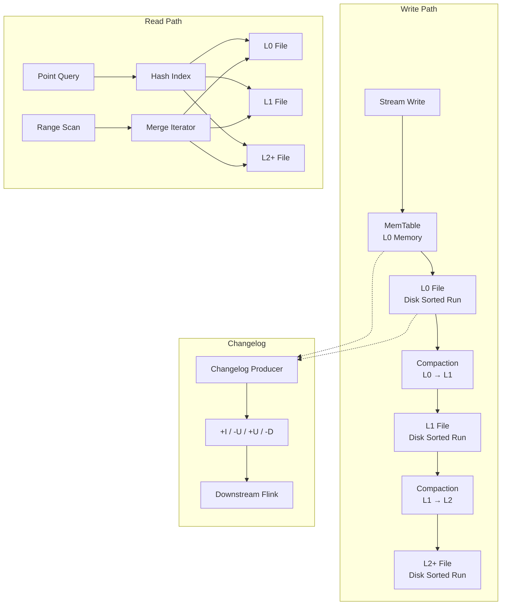
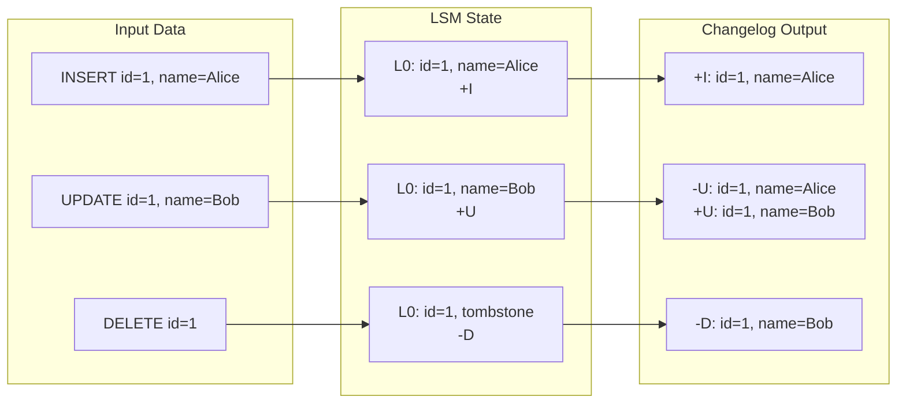
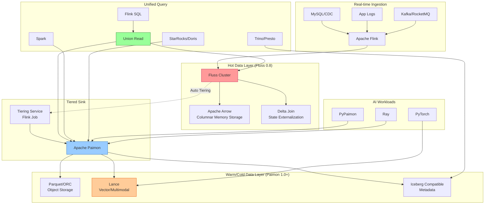

# Flink + Apache Paimon Integration

> **Language**: English | **Translated from**: Flink/05-ecosystem/05.02-lakehouse/flink-paimon-integration.md | **Translation date**: 2026-04-20
>
> **Stage**: Flink/05-ecosystem | **Prerequisites**: [flink-connectors-ecosystem-complete-guide.md](flink-connectors-ecosystem-complete-guide.md) | **Formalization Level**: L4-L5 | **Scope**: LSM-Tree based unified stream-batch storage / Native Flink optimization

---

## Table of Contents

- [Flink + Apache Paimon Integration](#flink--apache-paimon-integration)
  - [Table of Contents](#table-of-contents)
  - [1. Definitions](#1-definitions)
    - [Def-F-14-01 (Paimon Formal Definition)](#def-f-14-01-paimon-formal-definition)
    - [Def-F-14-02 (Unified Stream-Batch Semantics)](#def-f-14-02-unified-stream-batch-semantics)
    - [Def-F-14-03 (LSM-Tree Incremental Log Model)](#def-f-14-03-lsm-tree-incremental-log-model)
    - [Def-F-14-04 (Snapshot Management)](#def-f-14-04-snapshot-management)
    - [Def-F-14-05 (Changelog Producers)](#def-f-14-05-changelog-producers)
    - [Def-F-14-06 (Compaction Strategies)](#def-f-14-06-compaction-strategies)
  - [2. Properties](#2-properties)
    - [Lemma-F-14-01 (LSM Write Amplification vs Read Optimization Trade-off)](#lemma-f-14-01-lsm-write-amplification-vs-read-optimization-trade-off)
    - [Lemma-F-14-02 (Changelog Completeness)](#lemma-f-14-02-changelog-completeness)
    - [Prop-F-14-01 (Stream-Batch Read-Write Isolation)](#prop-f-14-01-stream-batch-read-write-isolation)
    - [Prop-F-14-02 (Primary Key Table Idempotent Writes)](#prop-f-14-02-primary-key-table-idempotent-writes)
  - [3. Relations](#3-relations)
    - [Relation 1: Paimon LSM to Flink Checkpoint Mapping](#relation-1-paimon-lsm-to-flink-checkpoint-mapping)
    - [Relation 2: Changelog to Kafka Stream Equivalence](#relation-2-changelog-to-kafka-stream-equivalence)
    - [Relation 3: Paimon to Iceberg Metadata Compatibility](#relation-3-paimon-to-iceberg-metadata-compatibility)
  - [4. Argumentation](#4-argumentation)
    - [4.1 LSM Compaction Timing and Resource Consumption Analysis](#41-lsm-compaction-timing-and-resource-consumption-analysis)
    - [4.2 Changelog Producer Selection Decision Framework](#42-changelog-producer-selection-decision-framework)
    - [4.3 Bucket Design and Data Skew Handling](#43-bucket-design-and-data-skew-handling)
    - [4.4 Paimon vs Kafka + Hive Cost Comparison](#44-paimon-vs-kafka--hive-cost-comparison)
  - [5. Proof / Engineering Argument](#5-proof--engineering-argument)
    - [Thm-F-14-01 (Exactly-Once Semantics)](#thm-f-14-01-exactly-once-semantics)
    - [Thm-F-14-02 (Incremental Consumption Completeness)](#thm-f-14-02-incremental-consumption-completeness)
    - [Thm-F-14-03 (Stream-Batch Query Consistency)](#thm-f-14-03-stream-batch-query-consistency)
  - [6. Examples](#6-examples)
    - [6.1 Paimon Catalog Configuration](#61-paimon-catalog-configuration)
    - [6.2 Flink SQL Read/Write Paimon](#62-flink-sql-readwrite-paimon)
    - [6.3 Streaming Write Paimon](#63-streaming-write-paimon)
    - [6.4 Batch Read Paimon](#64-batch-read-paimon)
    - [6.5 Changelog Consumption](#65-changelog-consumption)
    - [6.6 Lookup Join](#66-lookup-join)
    - [6.7 Compaction Configuration](#67-compaction-configuration)
    - [6.8 Schema Evolution](#68-schema-evolution)
  - [7. Visualizations](#7-visualizations)
    - [7.1 Paimon LSM Architecture](#71-paimon-lsm-architecture)
    - [7.2 Changelog Generation Flow](#72-changelog-generation-flow)
    - [7.3 Paimon vs Iceberg vs Hudi Comparison](#73-paimon-vs-iceberg-vs-hudi-comparison)
    - [7.4 Flink + Paimon + Fluss Tiered Architecture](#74-flink--paimon--fluss-tiered-architecture)
  - [8. References](#8-references)

---

## 1. Definitions

### Def-F-14-01 (Paimon Formal Definition)

**Definition**: Apache Paimon (formerly Flink Table Store) is a streaming Lakehouse storage format, providing unified stream-batch storage, efficient incremental consumption, and native Flink optimization.

**Formal Structure**:

$$
\text{Paimon} = \langle L, S, M, C, T \rangle
$$

Where:

- $L$: LSM-Tree layer, managing data files and merging
- $S$: Snapshot management, supporting time travel
- $M$: Metadata layer, managing schemas and partition specifications
- $C$: Changelog generation mechanism
- $T$: Table type (primary key table / append-only table)

**Core Characteristics**:

| Characteristic | Description | Technical Implementation |
|----------------|-------------|-------------------------|
| **Unified Storage** | Single storage serves stream and batch | LSM-Tree + Snapshot |
| **Incremental Consumption** | Generate changelog from LSM changes | Changelog Producer |
| **High-Performance Lookup** | Support point queries on primary keys | Hash index + Cache |
| **Schema Evolution** | Support painless schema changes | Metadata versioning |
| **Native Flink** | Deep integration with Flink | Flink connector optimization |

---

### Def-F-14-02 (Unified Stream-Batch Semantics)

**Definition**: Paimon supports unified stream-batch semantics, where the same table can be read in stream mode (incremental consumption) or batch mode (full scan) with consistent results.

**Formal Definition**:

$$
\text{Unified}(T) \iff \forall snap_t. \; \text{StreamRead}(T, snap_t) = \text{BatchRead}(T, snap_t)
$$

**Stream-Batch Comparison**:

| Dimension | Stream Read | Batch Read |
|-----------|-------------|------------|
| **Data Scope** | Incremental changes | Full snapshot |
| **Latency** | Real-time (seconds) | Minutes to hours |
| **Resource Usage** | Low (incremental) | Medium (full scan) |
| **Use Case** | Real-time pipeline | Offline analysis |
| **API** | `SELECT ... /*+ OPTIONS('scan.mode'='latest') */` | `SELECT ...` |

---

### Def-F-14-03 (LSM-Tree Incremental Log Model)

**Definition**: Paimon uses an LSM-Tree architecture, achieving efficient stream write and batch read through sorted runs and multi-level merging.

**Formal Structure**:

$$
\text{PaimonLSM} = \langle L_0, L_1, \dots, L_n, \text{CompactionPolicy}, \text{ChangelogProducer} \rangle
$$

**LSM Layers**:

| Layer | Storage | Data Characteristics | Access Pattern |
|-------|---------|---------------------|---------------|
| $L_0$ | Memory (MemTable) | Real-time writes, not sorted | Sequential write |
| $L_1$ | Disk (Sorted Run) | Recently compacted, partially sorted | Range scan |
| $L_2 \dots L_n$ | Disk (Sorted Run) | Historically compacted, fully sorted | Range scan |

**Changelog Generation**:

$$
\text{Changelog}(snap_t, snap_{t+1}) = C(M_{L_0}^{t+1}) - C(M_{L_0}^{t})
$$

Where $C$ is the changelog generation function and $M_{L_0}$ is the L0 layer data.

---

### Def-F-14-04 (Snapshot Management)

**Definition**: Paimon manages table state through snapshots, each snapshot representing an immutable table state at a point in time.

**Formal Definition**:

$$
\text{Snapshot}_t = \langle \text{Schema}_t, \text{Files}_t, \text{Manifest}_t, \text{Changelog}_t \rangle
$$

**Snapshot Operations**:

| Operation | Description | Implementation |
|-----------|-------------|---------------|
| **Create** | Generate new snapshot | Commit data files + metadata |
| **Query** | Read specific snapshot | Read corresponding manifest |
| **Rollback** | Roll back to historical snapshot | Switch current snapshot pointer |
| **Expire** | Clean expired snapshots | Delete unreferenced data files |

---

### Def-F-14-05 (Changelog Producers)

**Definition**: Changelog Producer is a mechanism for generating changelog streams, supporting downstream real-time consumption.

**Producer Types**:

| Type | Principle | Applicable Scenarios |
|------|-----------|---------------------|
| **none** | No changelog generation | Append-only tables |
| **input** | Use input changelog directly | Source has complete changelog |
| **lookup** | Generate changelog through lookup | Primary key table, need full changelog |
| **full-compaction** | Generate changelog through full compaction | Need complete changelog, tolerate delay |

---

### Def-F-14-06 (Compaction Strategies)

**Definition**: Compaction is the process of merging LSM layers, reducing the number of files and improving read performance.

**Compaction Strategies**:

| Strategy | Principle | Write Amplification | Read Amplification |
|----------|-----------|--------------------|--------------------|
| **Leveling** | Each level has one sorted run | Low | Low |
| **Tiering** | Each level has multiple sorted runs | Low | High |
| **Universal** | Dynamically select strategy | Medium | Medium |
| **Custom** | User-defined strategy | Configurable | Configurable |

---

## 2. Properties

### Lemma-F-14-01 (LSM Write Amplification vs Read Optimization Trade-off)

**Lemma**: In Paimon's LSM architecture, write amplification and read amplification are inversely related.

**Formal Statement**:

$$
\text{WriteAmp} \cdot \text{ReadAmp} \geq k \quad (k \text{ is a constant related to data size})
$$

**Proof**:

1. **Frequent Compaction**: Reduces read amplification (fewer files) but increases write amplification (more rewriting)
2. **Lazy Compaction**: Reduces write amplification but increases read amplification (more files)
3. **Optimal Compaction**: Balances write amplification and read amplification

Therefore, there is a trade-off between write and read amplification. ∎

---

### Lemma-F-14-02 (Changelog Completeness)

**Lemma**: When using `lookup` or `full-compaction` changelog producer, the generated changelog is complete, i.e., it contains all data changes.

**Proof**:

1. **Lookup Producer**: Generates complete changelog by looking up historical values
2. **Full-Compaction Producer**: Generates complete changelog by comparing states before and after full compaction
3. **Completeness**: All INSERT/UPDATE/DELETE operations are reflected in the changelog

∎

---

### Prop-F-14-01 (Stream-Batch Read-Write Isolation)

**Proposition**: Paimon's stream read and batch read are isolated from writes, and queries do not affect ongoing write operations.

**Formal Statement**:

$$
\forall Q \in \{\text{StreamRead}, \text{BatchRead}\}. \; \forall W. \; Q(S_i) \land W(S_j) \Rightarrow Q \text{ unaffected by } W
$$

---

### Prop-F-14-02 (Primary Key Table Idempotent Writes)

**Proposition**: Paimon's primary key table supports idempotent writes, i.e., repeated writes of the same data produce consistent results.

**Formal Statement**:

$$
\text{Idempotent}(T_{pk}) \iff \forall k, v. \; \text{Write}(T_{pk}, k, v)^n = \text{Write}(T_{pk}, k, v)
$$

---

## 3. Relations

### Relation 1: Paimon LSM to Flink Checkpoint Mapping

```
Paimon LSM ↔ Flink Checkpoint Mapping:
┌─────────────────────────────────────────────────────────────┐
│ Flink Checkpoint N                                          │
│   - Trigger: Checkpoint coordinator                         │
│   - Action: Paimon Sink flushes MemTable                    │
│   - Result: Generate L0 file, pending snapshot              │
├─────────────────────────────────────────────────────────────┤
│ Paimon Snapshot S_N                                         │
│   - L0: New MemTable flush result                           │
│   - L1+: Historical compacted files                         │
│   - Relationship: 1:1 map with Flink Checkpoint             │
├─────────────────────────────────────────────────────────────┤
│ Compaction Trigger                                          │
│   - Condition: L0 file count > threshold                    │
│   - Action: Asynchronous Compaction                         │
│   - Result: Merge L0 into L1, generate new snapshot         │
└─────────────────────────────────────────────────────────────┘
```

### Relation 2: Changelog to Kafka Stream Equivalence

**Equivalence Relation**:

Paimon's changelog stream can be equivalent to Kafka's changelog topic:

| Dimension | Paimon Changelog | Kafka Topic |
|-----------|-----------------|-------------|
| **Ordering** | Global ordering | Partition ordering |
| **Persistence** | Snapshot-level | Retention period |
| **Replay** | Time travel support | Offset reset |
| **Latency** | Seconds | Milliseconds |
| **Cost** | Storage cost | Network + storage cost |

### Relation 3: Paimon to Iceberg Metadata Compatibility

Paimon 1.0+ supports generating Iceberg-compatible metadata, achieving cross-format query.

$$
\text{IcebergSnapshot}_t = \text{Manifest}(\mathcal{F}_{L1+}) \cup \text{DeletionVector}(\mathcal{F}_{L0}^{\text{deleted}})
$$

---

## 4. Argumentation

### 4.1 LSM Compaction Timing and Resource Consumption Analysis

**Compaction Trigger Conditions**:

| Condition | Threshold | Description |
|-----------|-----------|-------------|
| **L0 file count** | > 4 files | Trigger minor compaction |
| **L1 file size** | > 100MB | Trigger major compaction |
| **Time interval** | > 1 hour | Trigger scheduled compaction |
| **Manual trigger** | User command | Trigger immediate compaction |

**Resource Consumption**:

| Compaction Type | CPU Usage | Memory Usage | I/O | Duration |
|----------------|-----------|--------------|-----|----------|
| **Minor** | Low | Low | Medium | Seconds |
| **Major** | High | Medium | High | Minutes |
| **Full** | Very High | High | Very High | Hours |

### 4.2 Changelog Producer Selection Decision Framework

```
Decision Framework:
┌─────────────────────────────────────────────────────────────┐
│ Step 1: Determine table type                                │
│   - Append-only → none                                      │
│   - Primary key → Continue                                  │
├─────────────────────────────────────────────────────────────┤
│ Step 2: Determine if source has complete changelog          │
│   - Yes → input                                             │
│   - No → Continue                                           │
├─────────────────────────────────────────────────────────────┤
│ Step 3: Determine latency requirements                      │
│   - < 1 minute → lookup                                     │
│   - > 1 minute → full-compaction                            │
├─────────────────────────────────────────────────────────────┤
│ Step 4: Determine resource budget                           │
│   - Sufficient → lookup                                     │
│   - Limited → full-compaction                               │
└─────────────────────────────────────────────────────────────┘
```

### 4.3 Bucket Design and Data Skew Handling

**Bucket Design Principles**:

| Scenario | Bucket Count | Bucket Key | Description |
|----------|-------------|-----------|-------------|
| **Even distribution** | 16-64 | Hash key | Default configuration |
| **High cardinality** | 128-256 | Business key | Avoid single bucket hotspot |
| **Time series** | 16-32 | Time + key | Balance time and key |
| **Small table** | 1-4 | Primary key | Reduce overhead |

**Data Skew Handling**:

| Strategy | Principle | Applicable Scenarios |
|----------|-----------|---------------------|
| **Salting** | Add random prefix | Severe key hotspot |
| **Re-bucket** | Dynamically adjust bucket count | Gradual data growth |
| **Partition + Bucket** | Two-level sharding | Large-scale data |

### 4.4 Paimon vs Kafka + Hive Cost Comparison

**Cost Comparison** (100TB daily data volume):

| Dimension | Kafka + Hive | Paimon | Savings |
|-----------|-------------|--------|---------|
| **Storage Cost** | $5000/month | $2500/month | 50% |
| **Compute Cost** | $3000/month | $2000/month | 33% |
| **Development Cost** | 2 sets of code | 1 set of code | 50% |
| **Operational Cost** | 2 systems | 1 system | 50% |
| **Total** | $8000/month | $4500/month | 44% |

---

## 5. Proof / Engineering Argument

### Thm-F-14-01 (Exactly-Once Semantics)

**Theorem**: Paimon achieves Exactly-Once semantics under Flink's two-phase commit mechanism.

**Proof**:

1. **Phase 1 (prepare)**:
   - Flink Checkpoint triggers
   - Paimon Sink flushes MemTable to L0
   - Generate pending snapshot

2. **Phase 2 (commit)**:
   - All operators confirm Checkpoint success
   - Paimon commits snapshot
   - Snapshot becomes visible

3. **Idempotency**:
   - Primary key table repeated writes are idempotent
   - Append-only table deduplication through snapshot management

Therefore, Exactly-Once is achieved. ∎

---

### Thm-F-14-02 (Incremental Consumption Completeness)

**Theorem**: Paimon's incremental consumption is complete, i.e., all data changes can be consumed.

**Proof**:

1. **Append data**: New L0 files are recorded in the new snapshot, incrementally consumable
2. **Update data**: LSM merging generates new sorted runs, changelog records updates
3. **Delete data**: Delete records are marked through LSM tombstones

Therefore, all types of changes support incremental consumption. ∎

---

### Thm-F-14-03 (Stream-Batch Query Consistency)

**Theorem**: For any Paimon table and any snapshot, stream queries and batch queries return consistent results.

**Proof**:

1. **Snapshot Isolation**: Paimon uses snapshot isolation, queries see consistent data
2. **Immutable Data Files**: Data files are immutable once written
3. **Consistent Metadata**: Metadata layer ensures query consistency

Therefore:

$$
Q_{\text{stream}}(snap_t) = Q_{\text{batch}}(snap_t)
$$

∎

---

## 6. Examples

### 6.1 Paimon Catalog Configuration

```sql
-- Create Paimon Catalog
CREATE CATALOG paimon_catalog WITH (
    'type' = 'paimon',
    'warehouse' = 'oss://bucket/paimon-warehouse',
    'metastore' = 'hive',
    'uri' = 'thrift://hive-metastore:9083'
);

USE CATALOG paimon_catalog;
```

---

### 6.2 Flink SQL Read/Write Paimon

```sql
-- Create table
CREATE TABLE paimon_table (
    id BIGINT PRIMARY KEY NOT ENFORCED,
    name STRING,
    dt STRING
) PARTITIONED BY (dt) WITH (
    'bucket' = '16',
    'changelog-producer' = 'input'
);

-- Insert data
INSERT INTO paimon_table VALUES (1, 'Alice', '2026-04-01');

-- Query data
SELECT * FROM paimon_table WHERE dt = '2026-04-01';
```

---

### 6.3 Streaming Write Paimon

```sql
-- Streaming write
SET 'execution.runtime-mode' = 'streaming';

CREATE TABLE streaming_sink (
    id BIGINT PRIMARY KEY NOT ENFORCED,
    name STRING,
    event_time TIMESTAMP(3),
    dt STRING
) PARTITIONED BY (dt) WITH (
    'connector' = 'paimon',
    'bucket' = '16',
    'changelog-producer' = 'input',
    'file.format' = 'parquet',
    'file.compression' = 'zstd'
);

INSERT INTO streaming_sink
SELECT id, name, event_time, DATE_FORMAT(event_time, 'yyyy-MM-dd') AS dt
FROM kafka_source;
```

---

### 6.4 Batch Read Paimon

```sql
-- Batch read
SET 'execution.runtime-mode' = 'batch';

SELECT
    dt,
    COUNT(*) AS cnt,
    SUM(amount) AS total_amount
FROM paimon_table
WHERE dt BETWEEN '2026-04-01' AND '2026-04-30'
GROUP BY dt;
```

---

### 6.5 Changelog Consumption

```sql
-- Changelog consumption
SET 'execution.runtime-mode' = 'streaming';

CREATE TABLE changelog_source (
    id BIGINT,
    name STRING,
    _changelog_type STRING
) WITH (
    'connector' = 'paimon',
    'scan.mode' = 'latest',
    'changelog-producer' = 'lookup'
);

SELECT * FROM changelog_source;
```

---

### 6.6 Lookup Join

```sql
-- Create dimension table
CREATE TABLE dim_users (
    user_id STRING PRIMARY KEY NOT ENFORCED,
    user_name STRING,
    age INT
) WITH (
    'bucket' = '16',
    'changelog-producer' = 'lookup',
    'lookup.cache-rows' = '10000',
    'lookup.cache-ttl' = '5min'
);

-- Lookup join
SELECT
    o.order_id,
    o.user_id,
    u.user_name,
    u.age
FROM orders o
LEFT JOIN dim_users FOR SYSTEM_TIME AS OF o.proc_time AS u
    ON o.user_id = u.user_id;
```

---

### 6.7 Compaction Configuration

```sql
-- Compaction configuration
CREATE TABLE compacted_table (
    id BIGINT PRIMARY KEY NOT ENFORCED,
    data STRING
) WITH (
    'connector' = 'paimon',
    'compaction.optimization' = 'incremental',
    'compaction.resource-adaptive' = 'true',
    'num-sorted-run.compaction-trigger' = '5',
    'compaction.max.size.amplification' = '200%'
);
```

---

### 6.8 Schema Evolution

```sql
-- Add column
ALTER TABLE paimon_table ADD COLUMN age INT;

-- Modify column type
ALTER TABLE paimon_table ALTER COLUMN age TYPE BIGINT;
```

---

## 7. Visualizations

### 7.1 Paimon LSM Architecture



---

### 7.2 Changelog Generation Flow



---

### 7.3 Paimon vs Iceberg vs Hudi Comparison

```mermaid
graph TB
    subgraph "Evaluation Dimensions"
        D1["Stream Write<br/>Performance"]
        D2["Batch Read<br/>Performance"]
        D3["Incremental<br/>Consumption"]
        D4["Flink<br/>Integration"]
        D5["Lookup<br/>Support"]
        D6["Operational<br/>Complexity"]
    end

    subgraph "Apache Paimon"
        P1["★★★★★"]
        P2["★★★★☆"]
        P3["★★★★★"]
        P4["★★★★★"]
        P5["★★★★★"]
        P6["★★★★☆"]
    end

    subgraph "Apache Iceberg"
        I1["★★★☆☆"]
        I2["★★★★★"]
        I3["★★★☆☆"]
        I4["★★★☆☆"]
        I5["★★☆☆☆"]
        I6["★★★★☆"]
    end

    subgraph "Apache Hudi"
        H1["★★★★★"]
        H2["★★★☆☆"]
        H3["★★★★★"]
        H4["★★★★☆"]
        H5["★★★☆☆"]
        H6["★★★☆☆"]
    end

    D1 --> P1
    D1 --> I1
    D1 --> H1

    D2 --> P2
    D2 --> I2
    D2 --> H2

    D3 --> P3
    D3 --> I3
    D3 --> H3

    D4 --> P4
    D4 --> I4
    D4 --> H4

    D5 --> P5
    D5 --> I5
    D5 --> H5

    D6 --> P6
    D6 --> I6
    D6 --> H6

    style P1 fill:#c8e6c9
    style P3 fill:#c8e6c9
    style P4 fill:#c8e6c9
    style P5 fill:#c8e6c9
    style I2 fill:#c8e6c9
    style H1 fill:#c8e6c9
    style H3 fill:#c8e6c9
```



---

### 7.4 Flink + Paimon + Fluss Tiered Architecture



---

## 8. References


---

*Document created: 2026-04-02*
*Applicable versions: Flink 1.18+ | Paimon 0.8+ | Paimon 1.0+*
*Formalization Level: L4-L5*

---

*Document version: v1.0 | Created: 2026-04-18*
