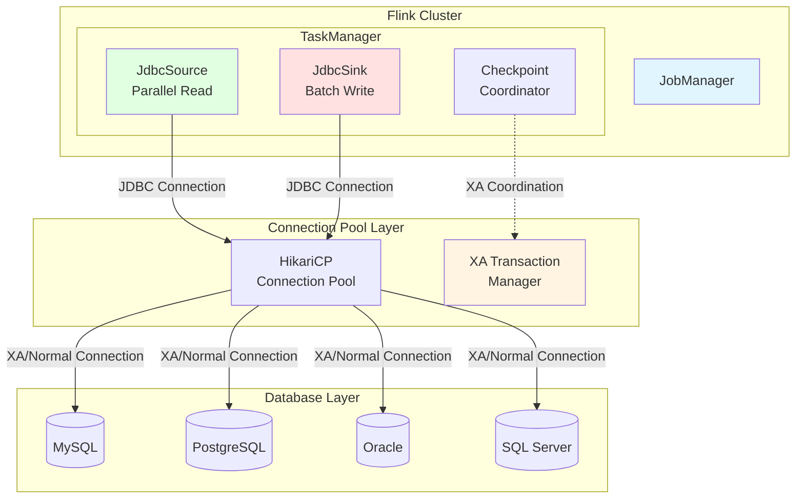
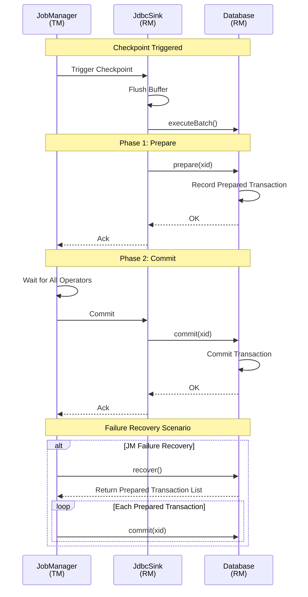
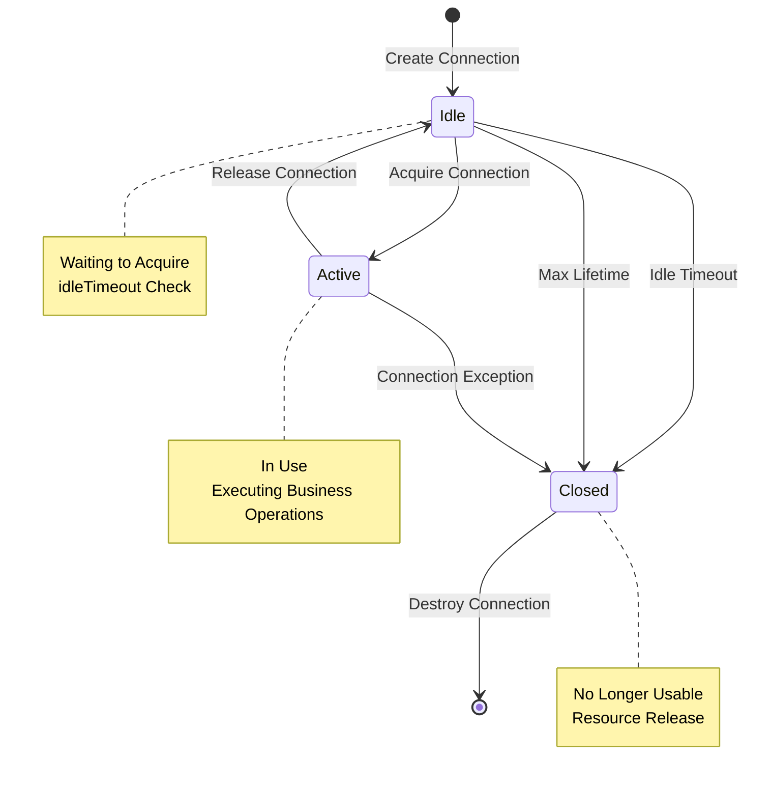

# JDBC Connector Complete Guide

> **Language**: English | **Translated from**: Flink/05-ecosystem/05.01-connectors/jdbc-connector-complete-guide.md | **Translation date**: 2026-04-20
>
> **Stage**: Flink/04-connectors | **Prerequisites**: [flink-connectors-ecosystem-complete-guide.md](flink-connectors-ecosystem-complete-guide.md) | **Formalization Level**: L4 | **Coverage**: JDBC Source/Sink/Connection Pool/Exactly-Once

---

## Table of Contents

- [JDBC Connector Complete Guide](#jdbc-connector-complete-guide)
  - [Table of Contents](#table-of-contents)
  - [1. Definitions](#1-definitions)
    - [Def-F-04-200 (JDBC Source Formal Definition)](#def-f-04-200-jdbc-source-formal-definition)
    - [Def-F-04-201 (JDBC Sink Formal Definition)](#def-f-04-201-jdbc-sink-formal-definition)
    - [Def-F-04-202 (Connection Pool Management Model)](#def-f-04-202-connection-pool-management-model)
    - [Def-F-04-203 (Exactly-Once Semantics Implementation)](#def-f-04-203-exactly-once-semantics-implementation)
  - [2. Properties](#2-properties)
    - [Lemma-F-04-200 (JDBC Connector Idempotency Lemma)](#lemma-f-04-200-jdbc-connector-idempotency-lemma)
    - [Lemma-F-04-201 (Connection Pool Resource Bounds)](#lemma-f-04-201-connection-pool-resource-bounds)
    - [Prop-F-04-200 (Batch Write Throughput Optimization)](#prop-f-04-200-batch-write-throughput-optimization)
  - [3. Relations](#3-relations)
    - [3.1 JDBC Connector and DataStream API Relation](#31-jdbc-connector-and-datastream-api-relation)
    - [3.2 JDBC Connector and Table API Relation](#32-jdbc-connector-and-table-api-relation)
    - [3.3 Database Dialect Mapping](#33-database-dialect-mapping)
  - [4. Argumentation](#4-argumentation)
    - [4.1 Partitioned Read Strategy Analysis](#41-partitioned-read-strategy-analysis)
    - [4.2 XA Transaction Implementation Mechanism](#42-xa-transaction-implementation-mechanism)
    - [4.3 Backpressure Handling](#43-backpressure-handling)
  - [5. Proof / Engineering Argument](#5-proof--engineering-argument)
    - [Thm-F-04-200 (JDBC Exactly-Once Correctness Theorem)](#thm-f-04-200-jdbc-exactly-once-correctness-theorem)
    - [Thm-F-04-201 (Connection Pool Deadlock-Free Theorem)](#thm-f-04-201-connection-pool-deadlock-free-theorem)
  - [6. Examples](#6-examples)
    - [6.1 Maven Dependency Configuration](#61-maven-dependency-configuration)
    - [6.2 JDBC Source Configuration](#62-jdbc-source-configuration)
    - [6.3 JDBC Sink Configuration](#63-jdbc-sink-configuration)
    - [6.4 Database-Specific Configurations](#64-database-specific-configurations)
  - [7. Performance Tuning](#7-performance-tuning)
    - [7.1 Batch Size Settings](#71-batch-size-settings)
    - [7.2 Connection Pool Optimization](#72-connection-pool-optimization)
    - [7.3 Timeout Configuration](#73-timeout-configuration)
    - [7.4 Retry Strategy](#74-retry-strategy)
  - [8. Troubleshooting](#8-troubleshooting)
    - [8.1 Connection Leak Handling](#81-connection-leak-handling)
    - [8.2 Large Table Read Optimization](#82-large-table-read-optimization)
    - [8.3 Transaction Timeout Handling](#83-transaction-timeout-handling)
  - [9. Visualizations](#9-visualizations)
    - [9.1 JDBC Connector Architecture](#91-jdbc-connector-architecture)
    - [9.2 XA Transaction Execution Flow](#92-xa-transaction-execution-flow)
    - [9.3 Connection Pool State Machine](#93-connection-pool-state-machine)
  - [10. References](#10-references)

---

## 1. Definitions

### Def-F-04-200 (JDBC Source Formal Definition)

**Definition**: JDBC Source is a Flink Source connector that reads data from relational databases via the JDBC protocol, supporting full read in batch mode and incremental read in streaming mode.

**Formal Structure**:

```
JDBCSource = ⟨Connection, Query, SplitStrategy, FetchSize, Parallelism⟩

Where:
- Connection: Database connection configuration ⟨url, username, password, driver⟩
- Query: Data query statement ⟨SELECT columns FROM table WHERE condition⟩
- SplitStrategy: Split strategy {PKRange, PartitionColumn, Custom}
- FetchSize: Records fetched per batch (default 1000)
- Parallelism: Parallelism ⟨min, max⟩
```

**Read Modes**:

| Mode | Description | Applicable Scenarios |
|------|-------------|---------------------|
| **Batch** | One-time read of complete result set | Offline analysis, full sync |
| **Incremental CDC** | Stream read based on change logs | Real-time sync, CDC capture |
| **Partitioned Parallel** | Parallel read by primary key range | Large table read, accelerated import |

**Data Type Mapping**:

| JDBC Type | Flink SQL Type | Java Type |
|-----------|----------------|-----------|
| `INTEGER` | `INT` | `Integer` |
| `BIGINT` | `BIGINT` | `Long` |
| `VARCHAR` | `STRING` | `String` |
| `DECIMAL` | `DECIMAL(p,s)` | `BigDecimal` |
| `TIMESTAMP` | `TIMESTAMP(3)` | `LocalDateTime` |
| `DATE` | `DATE` | `LocalDate` |
| `BLOB` | `BYTES` | `byte[]` |

---

### Def-F-04-201 (JDBC Sink Formal Definition)

**Definition**: JDBC Sink is a Flink output connector that writes data streams to relational databases via the JDBC protocol, supporting batch insertion, idempotent writes, and Exactly-Once semantics based on XA transactions.

**Formal Structure**:

```
JDBCSink = ⟨Connection, Statement, Buffer, FlushPolicy, Consistency⟩

Where:
- Connection: Database connection configuration
- Statement: DML statement type {INSERT, UPSERT, UPDATE}
- Buffer: Buffer configuration ⟨size, timeout⟩
- FlushPolicy: Flush policy ⟨batch-size, interval, max-retries⟩
- Consistency: Consistency guarantee {AT_LEAST_ONCE, EXACTLY_ONCE}
```

**Write Semantics**:

| Semantics | Implementation | Characteristics |
|-----------|----------------|-----------------|
| **INSERT** | `INSERT INTO ... VALUES (...)` | Simple insertion, may duplicate |
| **UPSERT** | `INSERT ... ON DUPLICATE KEY UPDATE` | Idempotent write, auto-update |
| **MERGE** | `MERGE INTO ... USING ...` | Standard SQL, strong generality |
| **DELETE+INSERT** | Delete first then insert | Full replacement, uniqueness guaranteed |

---

### Def-F-04-202 (Connection Pool Management Model)

**Definition**: The connection pool management model defines how the JDBC connector maintains and manages database connection lifecycles to optimize resource utilization and performance.

**Formal Definition**:

```
ConnectionPool = ⟨PoolConfig, State, Lifecycle⟩

PoolConfig = ⟨
    maxPoolSize: ℕ,           // Maximum connections
    minIdle: ℕ,               // Minimum idle connections
    maxLifetime: Duration,    // Maximum connection lifetime
    connectionTimeout: Duration,  // Connection acquisition timeout
    idleTimeout: Duration     // Idle connection timeout
⟩

State = {IDLE, ACTIVE, CLOSED}

Lifecycle = Idle → Active → (Idle | Closed)
```

**Connection Pool Parameters**:

| Parameter | Default | Description | Suggested Value |
|-----------|---------|-------------|-----------------|
| `connection.max-retry-timeout` | 60s | Connection retry timeout | Adjust based on network latency |
| `connection.check-timeout` | 10s | Connection check timeout | 5-30s |
| `connection.idle-timeout` | 10min | Idle connection timeout | 5-30min |
| `connection.max-life-time` | 30min | Maximum connection lifetime | 30-60min |

---

### Def-F-04-203 (Exactly-Once Semantics Implementation)

**Definition**: JDBC Sink achieves Exactly-Once semantics through the XA distributed transaction protocol, ensuring data is neither lost nor duplicated after failure recovery.

**Formal Definition**:

```
XAExactlyOnce = ⟨XAResource, TwoPhaseCommit, TransactionManager⟩

Two-Phase Commit Protocol:
┌─────────────────────────────────────────────────────────────┐
│ Phase 1: Prepare (Preparation Phase)                         │
│   - TM sends prepare request to all RMs                     │
│   - RM executes local transaction and records log           │
│   - RM returns OK/NO vote                                   │
├─────────────────────────────────────────────────────────────┤
│ Phase 2: Commit/Rollback (Commit Phase)                      │
│   - All RMs return OK → TM sends commit                     │
│   - Any RM returns NO → TM sends rollback                   │
│   - RM executes commit/rollback and releases resources      │
└─────────────────────────────────────────────────────────────┘

Where:
- TM (Transaction Manager): Flink JobManager
- RM (Resource Manager): Database XA connection
```

**Exactly-Once Configuration Matrix**:

| Database | XA Support | Configuration Parameter | Version Requirement |
|----------|------------|------------------------|---------------------|
| MySQL | ✓ | `useXA=true` | 5.7+ |
| PostgreSQL | ✓ | `useXA=true` | 9.5+ |
| Oracle | ✓ | `useXA=true` | 11g+ |
| SQL Server | ✓ | `useXA=true` | 2012+ |
| H2 | ✗ | - | - |

---

## 2. Properties

### Lemma-F-04-200 (JDBC Connector Idempotency Lemma)

**Lemma**: When JDBC Sink is configured in UPSERT mode, repeated execution of the same write operation is idempotent, i.e., the result of multiple executions is the same as a single execution.

**Proof**:

```
Let:
- R be a database relation table
- K be the primary key attribute set
- V be the non-primary key attribute set
- UPSERT(k, v) = INSERT(k, v) ON DUPLICATE KEY UPDATE V=v

Idempotency Proof:
┌─────────────────────────────────────────────────────────────┐
│ Case 1: Record does not exist                               │
│   UPSERT(k, v) → INSERT(k, v)                              │
│   UPSERT(k, v) executed again → primary key conflict → UPDATE V=v │
│   Final state: R(k) = v                                    │
├─────────────────────────────────────────────────────────────┤
│ Case 2: Record already exists                               │
│   UPSERT(k, v) → primary key conflict → UPDATE V=v         │
│   UPSERT(k, v) executed again → primary key conflict → UPDATE V=v │
│   Final state: R(k) = v (unchanged)                        │
└─────────────────────────────────────────────────────────────┘

Conclusion: ∀n ≥ 1: UPSERTⁿ(k, v) = UPSERT(k, v) ∎
```

---

### Lemma-F-04-201 (Connection Pool Resource Bounds)

**Lemma**: With reasonable connection pool configuration, the JDBC connector's concurrent connection count will not exceed `maxPoolSize × parallelism`.

**Proof**:

```
Let:
- P: Operator parallelism
- M: Connection pool maximum connections (maxPoolSize)
- N: Number of concurrent tasks

Resource Constraints:
┌─────────────────────────────────────────────────────────────┐
│ Each parallel instance maintains an independent connection pool│
│ Each connection pool has at most M connections              │
│ Total connections C ≤ P × M                                │
├─────────────────────────────────────────────────────────────┤
│ Constraints:                                                │
│   - M ≤ Database max connections / P                      │
│   - idleTimeout < maxLifetime                             │
│   - connectionTimeout < checkpoint interval               │
└─────────────────────────────────────────────────────────────┘

Boundary guarantee: C_bound = P × M ∎
```

---

### Prop-F-04-200 (Batch Write Throughput Optimization)

**Proposition**: In batch write mode, throughput has a sublinear growth relationship with batch size, and there exists an optimal batch size `B_opt`.

**Argument**:

```
Throughput Model:
┌─────────────────────────────────────────────────────────────┐
│ T(B) = B / (L + B × P)                                      │
│                                                             │
│ Where:                                                      │
│   - B: Batch size                                           │
│   - L: Fixed latency (network round-trip + SQL parsing)     │
│   - P: Per-record processing time                           │
├─────────────────────────────────────────────────────────────┤
│ Derivative for optimal batch size:                          │
│   dT/dB = 0 → L + B × P - B × P = L / (L + B × P)²        │
│   B_opt ≈ √(L / P)                                          │
├─────────────────────────────────────────────────────────────┤
│ Actual constraints:                                         │
│   - B ≤ maxBatchSize (default 5000)                         │
│   - B × recordSize ≤ maxPacketSize (default 4MB)            │
│   - flushInterval ≤ checkpointInterval                      │
└─────────────────────────────────────────────────────────────┘
```

**Recommended Batch Sizes**:

| Scenario | Suggested Batch Size | Description |
|----------|----------------------|-------------|
| Small records (< 1KB) | 1000-5000 | High-frequency writes, reduce network overhead |
| Medium records (1-10KB) | 500-2000 | Balance latency and throughput |
| Large records (> 10KB) | 100-500 | Avoid memory pressure and timeouts |

---

## 3. Relations

### 3.1 JDBC Connector and DataStream API Relation

```
DataStream API Integration Layers:
┌─────────────────────────────────────────────────────────────┐
│ Layer 3: DataStream API                                     │
│   env.fromSource(jdbcSource)                                │
│   dataStream.sinkTo(jdbcSink)                               │
├─────────────────────────────────────────────────────────────┤
│ Layer 2: Source/Sink API                                    │
│   JdbcSource.builder()...build()                            │
│   JdbcSink.sink(...)                                        │
├─────────────────────────────────────────────────────────────┤
│ Layer 1: JDBC Driver Layer                                  │
│   DriverManager.getConnection()                             │
│   PreparedStatement.executeBatch()                          │
├─────────────────────────────────────────────────────────────┤
│ Layer 0: Database Protocol Layer                            │
│   TCP Connection → Database Protocol                        │
└─────────────────────────────────────────────────────────────┘
```

**API Call Relations**:

| API Type | Source Call | Sink Call |
|----------|-------------|-----------|
| DataStream API | `env.fromSource(source)` | `stream.sinkTo(sink)` |
| Table API | `tEnv.createTemporaryTable()` | `INSERT INTO table` |
| SQL | `CREATE TABLE ... WITH ('connector' = 'jdbc')` | - |

---

### 3.2 JDBC Connector and Table API Relation

**Table API DDL Mapping**:

```sql
-- Source Table
CREATE TABLE mysql_source (
    id BIGINT,
    name STRING,
    create_time TIMESTAMP(3),
    PRIMARY KEY (id) NOT ENFORCED
) WITH (
    'connector' = 'jdbc',
    'url' = 'jdbc:mysql://localhost:3306/mydb',
    'table-name' = 'users',
    'username' = 'root',
    'password' = 'password'
);

-- Sink Table
CREATE TABLE mysql_sink (
    id BIGINT,
    name STRING,
    PRIMARY KEY (id) NOT ENFORCED
) WITH (
    'connector' = 'jdbc',
    'url' = 'jdbc:mysql://localhost:3306/mydb',
    'table-name' = 'output',
    'username' = 'root',
    'driver' = 'com.mysql.cj.jdbc.Driver'
);
```

**Configuration Parameter Mapping**:

| Table API Parameter | DataStream API Parameter | Description |
|---------------------|--------------------------|-------------|
| `connector` | - | Fixed value `jdbc` |
| `url` | `setUrl()` | JDBC URL |
| `table-name` | `setQuery()` | Table name or SQL |
| `username` | `setUsername()` | Username |
| `password` | `setPassword()` | Password |
| `driver` | `setDriverName()` | Driver class name |
| `scan.fetch-size` | `setFetchSize()` | Batch fetch size |
| `sink.buffer-flush.max-rows` | `setBatchSize()` | Batch size |
| `sink.buffer-flush.interval` | `setBatchIntervalMs()` | Flush interval |
| `sink.max-retries` | `setMaxRetries()` | Maximum retry attempts |
| `sink.connection.max-retry-timeout` | `setConnectionCheckTimeoutSeconds()` | Connection timeout |

---

### 3.3 Database Dialect Mapping

**Dialect Support Matrix**:

| Database | Dialect Class | UPSERT Syntax | XA Support |
|----------|---------------|---------------|------------|
| MySQL | `MySQLDialect` | `INSERT ... ON DUPLICATE KEY UPDATE` | ✓ |
| PostgreSQL | `PostgresDialect` | `INSERT ... ON CONFLICT ... DO UPDATE` | ✓ |
| Oracle | `OracleDialect` | `MERGE INTO ... USING ...` | ✓ |
| SQL Server | `SqlServerDialect` | `MERGE INTO ... USING ...` | ✓ |
| Derby | `DerbyDialect` | `MERGE INTO` | ✗ |
| H2 | `H2Dialect` | `MERGE INTO` | ✗ |

**Dialect-Specific Configurations**:

```java
// [Pseudo-code snippet - not directly runnable] Core logic only
// MySQL-specific configuration
.setProperty("useSSL", "false")
.setProperty("serverTimezone", "Asia/Shanghai")
.setProperty("rewriteBatchedStatements", "true")

// PostgreSQL-specific configuration
.setProperty("reWriteBatchedInserts", "true")
.setProperty("tcpKeepAlive", "true")

// Oracle-specific configuration
.setProperty("defaultRowPrefetch", "1000")
.setProperty("oracle.net.disableOob", "true")
```

---

## 4. Argumentation

### 4.1 Partitioned Read Strategy Analysis

**Strategy Comparison**:

| Strategy | Implementation | Advantages | Disadvantages |
|----------|----------------|------------|---------------|
| **Primary Key Range** | `WHERE id BETWEEN ? AND ?` | Even partitions, high parallelism | Requires continuous primary key |
| **Numeric Column Partition** | `WHERE hash(column) % N = i` | Applicable to non-primary keys | May be uneven |
| **Time Column Partition** | `WHERE time BETWEEN ? AND ?` | Natural time partitioning | May be skewed |
| **Custom SQL** | User-provided shard SQL | Flexible and controllable | Requires manual optimization |

**Primary Key Range Partition Algorithm**:

```
Algorithm: Primary Key Range Partition
Input: Table T, primary key column PK, parallelism P
Output: P splits {S₁, S₂, ..., Sₚ}

1. Query primary key range:
   SELECT MIN(PK), MAX(PK) FROM T
   → min_val, max_val

2. Calculate split size:
   chunk_size = (max_val - min_val) / P

3. Generate splits:
   for i = 0 to P-1:
     start = min_val + i * chunk_size
     end = (i == P-1) ? max_val : start + chunk_size
     Sᵢ = "WHERE PK BETWEEN start AND end"

4. Handle data skew:
   if count(Sᵢ) > avg_count * 1.5:
     Recursively split Sᵢ
```

---

### 4.2 XA Transaction Implementation Mechanism

**Two-Phase Commit Flow**:

```
Checkpoint Triggered:
┌─────────────────────────────────────────────────────────────┐
│ 1. Snapshot Phase                                           │
│    - JM triggers checkpoint                                 │
│    - All operators stop processing, wait for barrier        │
│    - JDBC Sink stops accepting new data                     │
├─────────────────────────────────────────────────────────────┤
│ 2. Phase 1: Prepare                                         │
│    - Sink executes current batch                            │
│    - Calls XAConnection.prepare(xid)                        │
│    - Database records prepared transaction state            │
│    - Returns prepare OK to JM                               │
├─────────────────────────────────────────────────────────────┤
│ 3. Phase 2: Commit                                          │
│    - After all operators confirm, JM notifies commit        │
│    - Sink calls XAConnection.commit(xid)                    │
│    - Database commits transaction, releases resources       │
│    - Sink resumes data processing                           │
├─────────────────────────────────────────────────────────────┤
│ 4. Recovery                                                 │
│    - During failure recovery, scan prepared transactions    │
│    - Completed checkpoint → commit                          │
│    - Incomplete checkpoint → rollback                       │
└─────────────────────────────────────────────────────────────┘
```

---

### 4.3 Backpressure Handling

**Backpressure Propagation Mechanism**:

```
Backpressure Propagation Path:
┌─────────────────────────────────────────────────────────────┐
│ Database ←→ JDBC Driver ←→ Connection Pool ←→ SinkWriter  │
│                                     ↑                       │
│                               Backpressure Signal            │
│                                     ↓                       │
│                           Flink Backpressure Mechanism      │
│                           (Credit-based Flow Control)       │
└─────────────────────────────────────────────────────────────┘
```

**Backpressure Handling Strategies**:

| Scenario | Symptom | Solution |
|----------|---------|----------|
| High database load | Write latency increases | Reduce concurrency, increase batch size |
| Network latency | Connection timeouts | Increase timeout, enable connection pool |
| Large transactions | Checkpoint timeout | Reduce batch size, increase checkpoint interval |
| Lock contention | Deadlock exceptions | Optimize indexes, adjust transaction isolation level |

---

## 5. Proof / Engineering Argument

### Thm-F-04-200 (JDBC Exactly-Once Correctness Theorem)

**Theorem**: With XA transaction configuration, JDBC Sink can guarantee Exactly-Once semantics.

**Proof**:

```
Prerequisites:
1. Database supports XA distributed transactions
2. Flink Checkpoint mechanism works properly
3. XA transaction manager is correctly configured

Proof Structure:
┌─────────────────────────────────────────────────────────────┐
│ Lemma 1: Atomicity of Prepare Phase                         │
│   - XA prepare operation is atomic                          │
│   - Database records transaction log, guarantees recovery   │
│   - All RMs either all prepare succeed or all fail          │
├─────────────────────────────────────────────────────────────┤
│ Lemma 2: Checkpoint Persistence Guarantee                   │
│   - Checkpoint success → state persisted                    │
│   - JM confirms all operators prepare succeed before commit │
│   - On failure JM notifies rollback                         │
├─────────────────────────────────────────────────────────────┤
│ Lemma 3: Failure Recovery Correctness                       │
│   - JM failure → New JM recovers from last successful checkpoint│
│   - TM failure → Transaction coordinator recovers incomplete transactions│
│   - TM+RM simultaneous failure → Database recovers prepared transactions│
├─────────────────────────────────────────────────────────────┤
│ Comprehensive Argument:                                     │
│   Case 1: Normal flow                                       │
│     - prepare → commit, data written exactly once           │
│                                                             │
│   Case 2: Checkpoint failure                                │
│     - rollback, no data written, can reprocess              │
│                                                             │
│   Case 3: Checkpoint success but failure before commit      │
│     - Recover from prepared state, continue commit          │
│     - Data finally written once                             │
│                                                             │
│   Case 4: Failure after commit but before JM notification   │
│     - Database already committed, Sink recovers from checkpoint│
│     - Possible duplicate commit (idempotency guarantees)    │
└─────────────────────────────────────────────────────────────┘

Conclusion: In all failure scenarios, data is either processed exactly once or not processed at all, satisfying the Exactly-Once semantics definition. ∎
```

---

### Thm-F-04-201 (Connection Pool Deadlock-Free Theorem)

**Theorem**: With reasonable configuration, JDBC connection pools will not deadlock.

**Proof**:

```
Deadlock Conditions (Coffman Conditions):
1. Mutual Exclusion: Connection can only be used by one task at a time
2. Hold and Wait: Task holds connection while waiting for more connections
3. No Preemption: Connection cannot be forcibly released
4. Circular Wait: Tasks form a circular wait chain

Prevention Strategies:
┌─────────────────────────────────────────────────────────────┐
│ Break Condition 2 (Hold and Wait):                          │
│   - Connection acquisition timeout mechanism                │
│   - Abandon acquired connections and retry on timeout       │
│   - Acquire all required connections at once                │
├─────────────────────────────────────────────────────────────┤
│ Break Condition 4 (Circular Wait):                          │
│   - Connections acquired in fixed order                     │
│   - Use global connection numbering, acquire in ascending order│
├─────────────────────────────────────────────────────────────┤
│ Connection Pool Configuration Constraints:                  │
│   - maxPoolSize ≥ parallelism × max connections per task    │
│   - connectionTimeout < task processing timeout             │
│   - Enable connection leak detection (leakDetectionThreshold)│
└─────────────────────────────────────────────────────────────┘

Formal Proof:
Let task Tᵢ need nᵢ connections, total connection pool size is C.
Constraint: Σnᵢ ≤ C (for all concurrent tasks)

Under this constraint, any task can acquire needed connections,
no permanent waiting occurs, hence no deadlock. ∎
```

---

## 6. Examples

### 6.1 Maven Dependency Configuration

**Core Dependencies**:

```xml
<dependencies>
    <!-- Flink JDBC Connector -->
    <dependency>
        <groupId>org.apache.flink</groupId>
        <artifactId>flink-connector-jdbc</artifactId>
        <version>3.1.2-1.18</version>
    </dependency>

    <!-- MySQL Connector/J -->
    <dependency>
        <groupId>com.mysql</groupId>
        <artifactId>mysql-connector-j</artifactId>
        <version>8.0.33</version>
    </dependency>

    <!-- PostgreSQL JDBC Driver -->
    <dependency>
        <groupId>org.postgresql</groupId>
        <artifactId>postgresql</artifactId>
        <version>42.6.0</version>
    </dependency>

    <!-- Oracle JDBC Driver (manual install to local repo required) -->
    <dependency>
        <groupId>com.oracle.database.jdbc</groupId>
        <artifactId>ojdbc11</artifactId>
        <version>23.3.0.23.09</version>
    </dependency>

    <!-- SQL Server JDBC Driver -->
    <dependency>
        <groupId>com.microsoft.sqlserver</groupId>
        <artifactId>mssql-jdbc</artifactId>
        <version>12.4.2.jre11</version>
    </dependency>
</dependencies>
```

**Version Compatibility Matrix**:

| Flink Version | JDBC Connector Version | Supported Database Versions |
|---------------|------------------------|----------------------------|
| 1.18.x | 3.1.2-1.18 | MySQL 5.7+, PostgreSQL 9.5+, Oracle 11g+ |
| 1.17.x | 3.1.1-1.17 | MySQL 5.7+, PostgreSQL 9.5+, Oracle 11g+ |
| 1.16.x | 3.0.0-1.16 | MySQL 5.7+, PostgreSQL 9.5+ |
| 1.15.x | 1.15.4 | MySQL 5.7+, PostgreSQL 9.5+ |

---

### 6.2 JDBC Source Configuration

**Basic Source Configuration**:

```java
// [Pseudo-code snippet - not directly runnable] Core logic only
import org.apache.flink.connector.jdbc.source.JdbcSource;
import org.apache.flink.connector.jdbc.source.reader.extractor.ResultExtractor;

// Define result extractor
ResultExtractor<MyRecord> extractor = (ResultSet rs) -> new MyRecord(
    rs.getLong("id"),
    rs.getString("name"),
    rs.getTimestamp("create_time")
);

// Create JDBC Source
JdbcSource<MyRecord> jdbcSource = JdbcSource.<MyRecord>builder()
    .setUrl("jdbc:mysql://localhost:3306/mydb")
    .setUsername("root")
    .setPassword("password")
    .setQuery("SELECT id, name, create_time FROM users WHERE id > ?")
    .setResultExtractor(extractor)
    .setFetchSize(1000)
    .setConnectionCheckTimeoutSeconds(60)
    .build();

// Add to stream
DataStream<MyRecord> stream = env.fromSource(
    jdbcSource,
    WatermarkStrategy.noWatermarks(),
    "JDBC Source"
);
```

**Partitioned Read Configuration**:

```java
// [Pseudo-code snippet - not directly runnable] Core logic only
// Primary key range partitioned Source
JdbcSource<MyRecord> partitionedSource = JdbcSource.<MyRecord>builder()
    .setUrl("jdbc:mysql://localhost:3306/mydb")
    .setUsername("root")
    .setPassword("password")
    .setQuery("SELECT id, name, create_time FROM users")
    .setResultExtractor(extractor)
    .setSplitGenerator(new JdbcGenericParameterValuesGenerator(
        // Generate 4 partitions
        new JdbcParameterValuesProvider() {
            @Override
            public Serializable[][] getParameterValues() {
                return new Serializable[][] {
                    {1, 250000},
                    {250001, 500000},
                    {500001, 750000},
                    {750001, 1000000}
                };
            }
        }
    ))
    .setFetchSize(5000)
    .build();

// Set parallelism to 4
DataStream<MyRecord> stream = env.fromSource(
    partitionedSource,
    WatermarkStrategy.noWatermarks(),
    "Partitioned JDBC Source"
).setParallelism(4);
```

**Incremental CDC Read**:

```java
// [Pseudo-code snippet - not directly runnable] Core logic only
// Timestamp-based incremental read
JdbcSource<MyRecord> incrementalSource = JdbcSource.<MyRecord>builder()
    .setUrl("jdbc:mysql://localhost:3306/mydb")
    .setUsername("root")
    .setPassword("password")
    .setQuery("SELECT id, name, create_time FROM users " +
              "WHERE update_time > ? AND update_time <= ?")
    .setResultExtractor(extractor)
    .setFetchSize(1000)
    // Use periodically triggered time ranges
    .setParameterProvider(new JdbcIncrementalParameterProvider(
        "update_time",
        Duration.ofSeconds(30)  // 30-second period
    ))
    .build();
```

---

### 6.3 JDBC Sink Configuration

**Basic Sink Configuration**:

```java
// [Pseudo-code snippet - not directly runnable] Core logic only
import org.apache.flink.connector.jdbc.JdbcSink;
import org.apache.flink.connector.jdbc.JdbcStatementBuilder;

// Create JDBC Sink
SinkFunction<MyRecord> jdbcSink = JdbcSink.sink(
    // SQL statement
    "INSERT INTO users (id, name, create_time) VALUES (?, ?, ?)",
    // Parameter builder
    (JdbcStatementBuilder<MyRecord>) (ps, record) -> {
        ps.setLong(1, record.getId());
        ps.setString(2, record.getName());
        ps.setTimestamp(3, Timestamp.valueOf(record.getCreateTime()));
    },
    // Execution options
    new JdbcExecutionOptions.Builder()
        .withBatchSize(1000)
        .withBatchIntervalMs(200)
        .withMaxRetries(3)
        .build(),
    // Connection options
    new JdbcConnectionOptions.JdbcConnectionOptionsBuilder()
        .withUrl("jdbc:mysql://localhost:3306/mydb")
        .withDriverName("com.mysql.cj.jdbc.Driver")
        .withUsername("root")
        .withPassword("password")
        .build()
);

// Add to stream
stream.addSink(jdbcSink);
```

**UPSERT Mode Configuration**:

```java
// [Pseudo-code snippet - not directly runnable] Core logic only
// MySQL UPSERT
SinkFunction<MyRecord> upsertSink = JdbcSink.sink(
    "INSERT INTO users (id, name, update_time) VALUES (?, ?, ?) " +
    "ON DUPLICATE KEY UPDATE name = VALUES(name), update_time = VALUES(update_time)",
    (ps, record) -> {
        ps.setLong(1, record.getId());
        ps.setString(2, record.getName());
        ps.setTimestamp(3, new Timestamp(System.currentTimeMillis()));
    },
    new JdbcExecutionOptions.Builder()
        .withBatchSize(1000)
        .withBatchIntervalMs(200)
        .build(),
    new JdbcConnectionOptions.JdbcConnectionOptionsBuilder()
        .withUrl("jdbc:mysql://localhost:3306/mydb")
        .withDriverName("com.mysql.cj.jdbc.Driver")
        .withUsername("root")
        .withPassword("password")
        .build()
);

// PostgreSQL UPSERT
SinkFunction<MyRecord> pgUpsertSink = JdbcSink.sink(
    "INSERT INTO users (id, name, update_time) VALUES (?, ?, ?) " +
    "ON CONFLICT (id) DO UPDATE SET name = EXCLUDED.name, update_time = EXCLUDED.update_time",
    // ... same as above
);
```

**Exactly-Once Configuration (XA Transaction)**:

```java
// [Pseudo-code snippet - not directly runnable] Core logic only
import org.apache.flink.connector.jdbc.JdbcExactlyOnceOptions;
import org.apache.flink.connector.jdbc.JdbcExecutionOptions;
import org.apache.flink.connector.jdbc.JdbcSink;
import org.apache.flink.connector.jdbc.JdbcStatementBuilder;

// XA DataSource configuration
XADataSource xaDataSource = new MysqlXADataSource();
xaDataSource.setUrl("jdbc:mysql://localhost:3306/mydb");
xaDataSource.setUser("root");
xaDataSource.setPassword("password");

// Exactly-Once Sink
SinkFunction<MyRecord> exactlyOnceSink = JdbcSink.exactlyOnceSink(
    "INSERT INTO users (id, name, create_time) VALUES (?, ?, ?)",
    (ps, record) -> {
        ps.setLong(1, record.getId());
        ps.setString(2, record.getName());
        ps.setTimestamp(3, Timestamp.valueOf(record.getCreateTime()));
    },
    JdbcExecutionOptions.builder()
        .withMaxRetries(0)  // XA mode retries handled by recovery mechanism
        .build(),
    JdbcExactlyOnceOptions.builder()
        .withTransactionPerConnection(true)
        .withXaDataSourceSupplier(() -> xaDataSource)
        .withRecoveryTimeout(Duration.ofMinutes(5))
        .build()
);

stream.addSink(exactlyOnceSink);
```

---

### 6.4 Database-Specific Configurations

**MySQL Optimization Configuration**:

```java
// [Pseudo-code snippet - not directly runnable] Core logic only
// MySQL connection properties
Properties props = new Properties();
props.setProperty("useSSL", "false");
props.setProperty("serverTimezone", "Asia/Shanghai");
props.setProperty("rewriteBatchedStatements", "true");  // Key optimization: enable batch rewrite
props.setProperty("useCompression", "true");
props.setProperty("cachePrepStmts", "true");
props.setProperty("prepStmtCacheSize", "250");
props.setProperty("prepStmtCacheSqlLimit", "2048");
props.setProperty("useServerPrepStmts", "true");

JdbcConnectionOptions connectionOptions = new JdbcConnectionOptions.JdbcConnectionOptionsBuilder()
    .withUrl("jdbc:mysql://localhost:3306/mydb?" + buildQueryString(props))
    .withDriverName("com.mysql.cj.jdbc.Driver")
    .withUsername("root")
    .withPassword("password")
    .build();
```

**PostgreSQL Optimization Configuration**:

```java
// [Pseudo-code snippet - not directly runnable] Core logic only
// PostgreSQL connection properties
Properties props = new Properties();
props.setProperty("reWriteBatchedInserts", "true");  // Batch insert optimization
props.setProperty("tcpKeepAlive", "true");
props.setProperty("socketTimeout", "30");
props.setProperty("loginTimeout", "30");
props.setProperty("connectTimeout", "30");

// PostgreSQL UPSERT syntax
String upsertSql = "INSERT INTO users (id, name, update_time) VALUES (?, ?, ?) " +
    "ON CONFLICT (id) DO UPDATE SET " +
    "name = EXCLUDED.name, " +
    "update_time = EXCLUDED.update_time " +
    "WHERE users.update_time < EXCLUDED.update_time";  // Conditional update avoids out-of-order
```

**Oracle Configuration**:

```java
// [Pseudo-code snippet - not directly runnable] Core logic only
// Oracle connection properties
Properties props = new Properties();
props.setProperty("defaultRowPrefetch", "1000");
props.setProperty("oracle.net.disableOob", "true");
props.setProperty("oracle.jdbc.maxCachedBufferSize", "1000000");

// Oracle MERGE syntax
String mergeSql = "MERGE INTO users t " +
    "USING (SELECT ? AS id, ? AS name, ? AS update_time FROM dual) s " +
    "ON (t.id = s.id) " +
    "WHEN MATCHED THEN UPDATE SET " +
    "  t.name = s.name, " +
    "  t.update_time = s.update_time " +
    "WHEN NOT MATCHED THEN INSERT (id, name, update_time) " +
    "  VALUES (s.id, s.name, s.update_time)";
```

**SQL Server Configuration**:

```java
// [Pseudo-code snippet - not directly runnable] Core logic only
// SQL Server connection properties
Properties props = new Properties();
props.setProperty("sendStringParametersAsUnicode", "false");  // Performance optimization
props.setProperty("applicationIntent", "ReadWrite");
props.setProperty("lockTimeout", "30000");

// SQL Server MERGE syntax
String mergeSql = "MERGE INTO users AS target " +
    "USING (VALUES (?, ?, ?)) AS source (id, name, update_time) " +
    "ON target.id = source.id " +
    "WHEN MATCHED THEN UPDATE SET " +
    "  name = source.name, " +
    "  update_time = source.update_time " +
    "WHEN NOT MATCHED THEN INSERT (id, name, update_time) " +
    "  VALUES (source.id, source.name, source.update_time);";
```

---

## 7. Performance Tuning

### 7.1 Batch Size Settings

**Batch Size Selection Matrix**:

| Record Size | Suggested Batch Size | Expected Throughput | Latency |
|-------------|----------------------|---------------------|---------|
| < 1KB | 5000-10000 | 10K-50K r/s | 200-500ms |
| 1-10KB | 1000-5000 | 5K-20K r/s | 200-500ms |
| 10-100KB | 100-1000 | 1K-5K r/s | 500ms-1s |
| > 100KB | 10-100 | 100-1000 r/s | 1-5s |

**Dynamic Batch Adjustment Strategy**:

```java
// [Pseudo-code snippet - not directly runnable] Core logic only
// Dynamically adjust batch size based on processing latency
JdbcExecutionOptions executionOptions = JdbcExecutionOptions.builder()
    .withBatchSize(1000)  // Initial batch size
    .withBatchIntervalMs(100)  // Maximum wait time
    .withMaxRetries(3)
    .build();

// Monitor metrics adjustment
// If average write latency < 50ms → increase batch size
// If average write latency > 200ms → decrease batch size
// If Checkpoint timeout → decrease batch size or increase interval
```

---

### 7.2 Connection Pool Optimization

**Connection Pool Size Calculation Formula**:

```
Theoretically optimal connections:
┌─────────────────────────────────────────────────────────────┐
│ connections = ((core_count × 2) + effective_spindle_count)  │
│                                                             │
│ Actual Flink scenario adjustment:                           │
│ maxPoolSize = min(                                         │
│     (db_max_connections / parallelism),                    │
│     (core_count × 2) + spindle_count,                      │
│     20  // Upper bound protection                          │
│ )                                                          │
└─────────────────────────────────────────────────────────────┘
```

**Connection Pool Parameter Template**:

| Parameter | Development | Production | Description |
|-----------|-------------|------------|-------------|
| `maxPoolSize` | 5 | 10-20 | Adjust based on database connection limit |
| `minIdle` | 1 | 5 | Maintain minimum idle connections |
| `connectionTimeout` | 30s | 30s | Connection acquisition timeout |
| `idleTimeout` | 10min | 10min | Idle connection reclamation |
| `maxLifetime` | 30min | 30min | Maximum connection lifetime |

---

### 7.3 Timeout Configuration

**Timeout Parameter Matrix**:

| Parameter | Default | Suggested Value | Description |
|-----------|---------|-----------------|-------------|
| `socketTimeout` | 0 (unlimited) | 30s | Network read timeout |
| `connectTimeout` | 10s | 10s | Connection establishment timeout |
| `loginTimeout` | 0 | 10s | Login timeout |
| `queryTimeout` | 0 | 60s | Query execution timeout |
| `connection.check-timeout` | 10s | 10s | Connection check timeout |

**Timeout Configuration Example**:

```java
// [Pseudo-code snippet - not directly runnable] Core logic only
// MySQL timeout configuration
String url = "jdbc:mysql://localhost:3306/mydb" +
    "?connectTimeout=10000" +           // 10s
    "&socketTimeout=30000" +            // 30s
    "&loginTimeout=10";                 // 10s

// PostgreSQL timeout configuration
String url = "jdbc:postgresql://localhost:5432/mydb" +
    "?connectTimeout=10" +              // 10s
    "&socketTimeout=30" +               // 30s
    "&loginTimeout=10";                 // 10s
```

---

### 7.4 Retry Strategy

**Retry Strategy Matrix**:

| Exception Type | Retry? | Retry Count | Backoff Strategy |
|----------------|--------|-------------|------------------|
| Connection timeout | Yes | 3 | Exponential backoff (1s, 2s, 4s) |
| Deadlock | Yes | 5 | Fixed interval 100ms |
| Primary key conflict | No | 0 | - (use UPSERT) |
| Syntax error | No | 0 | - |
| Insufficient privileges | No | 0 | - |

**Custom Retry Strategy**:

```java
// [Pseudo-code snippet - not directly runnable] Core logic only
import org.apache.flink.connector.jdbc.JdbcExecutionOptions;

// Configure retry
JdbcExecutionOptions executionOptions = JdbcExecutionOptions.builder()
    .withBatchSize(1000)
    .withBatchIntervalMs(200)
    .withMaxRetries(3)  // Maximum retry attempts
    .build();

// Custom exception handler
JdbcSink.sink(
    sql,
    statementBuilder,
    executionOptions,
    connectionOptions,
    // Custom exception handling (Flink 1.16+)
    (exception, request) -> {
        if (exception instanceof SQLTransientException) {
            // Transient exception, allow retry
            return JdbcRetryStrategy.RETRY;
        } else if (exception instanceof SQLIntegrityConstraintViolationException) {
            // Constraint violation, skip
            return JdbcRetryStrategy.SKIP;
        } else {
            // Fatal error, fail
            return JdbcRetryStrategy.FAIL;
        }
    }
);
```

---

## 8. Troubleshooting

### 8.1 Connection Leak Handling

**Symptom Recognition**:

| Symptom | Possible Cause | Check Method |
|---------|---------------|--------------|
| `ConnectionPool exhausted` | Connection leak | Check unclosed Connection/Statement |
| Connection count continuously growing | Resources not properly closed | Enable connection pool monitoring |
| Checkpoint timeout | Long-held connections | Check transaction execution time |

**Diagnostic SQL**:

```sql
-- MySQL: View current connections
SHOW PROCESSLIST;
SELECT * FROM information_schema.PROCESSLIST WHERE COMMAND != 'Sleep';

-- PostgreSQL: View current connections
SELECT * FROM pg_stat_activity WHERE state = 'active';

-- Oracle: View current sessions
SELECT sid, serial#, username, status FROM v$session WHERE type != 'BACKGROUND';
```

**Solutions**:

```java
// [Pseudo-code snippet - not directly runnable] Core logic only
// 1. Enable connection leak detection
HikariConfig config = new HikariConfig();
config.setLeakDetectionThreshold(60000);  // 60-second leak detection

// 2. Use try-with-resources to ensure closure
try (Connection conn = dataSource.getConnection();
     PreparedStatement ps = conn.prepareStatement(sql)) {
    // Execute operations
}  // Auto-close

// 3. Set reasonable connection lifetime
config.setMaxLifetime(1800000);  // 30 minutes
config.setIdleTimeout(600000);   // 10 minutes
```

---

### 8.2 Large Table Read Optimization

**Optimization Strategies**:

| Strategy | Implementation | Effect |
|----------|----------------|--------|
| Partitioned parallel read | Shard by primary key range | Linear scaling |
| Index optimization | Ensure WHERE columns are indexed | Reduce scans |
| Stream read | Use `fetchSize` cursor | Reduce memory |
| Incremental read | Based on timestamp/auto-increment ID | Avoid full table scans |

**Large Table Read Configuration**:

```java
// [Pseudo-code snippet - not directly runnable] Core logic only
// 1. Cursor read configuration (MySQL)
String url = "jdbc:mysql://localhost:3306/mydb" +
    "?useCursorFetch=true" +      // Enable cursor
    "&defaultFetchSize=1000";     // Fetch 1000 records per batch

// 2. Partitioned read
JdbcSource<MyRecord> source = JdbcSource.<MyRecord>builder()
    .setQuery("SELECT * FROM large_table WHERE id BETWEEN ? AND ?")
    .setSplitGenerator(new JdbcGenericParameterValuesGenerator(
        // Generate 10 shards based on primary key range
        generateKeyRanges(1, 10000000, 10)
    ))
    .setFetchSize(5000)
    .build();

// 3. Incremental read
String incrementalQuery = "SELECT * FROM large_table " +
    "WHERE update_time > ? AND update_time <= ? " +
    "ORDER BY update_time";
```

---

### 8.3 Transaction Timeout Handling

**Transaction Timeout Scenarios**:

| Scenario | Timeout Location | Solution |
|----------|-----------------|----------|
| Large batch write | Database transaction timeout | Reduce batch size |
| Short checkpoint interval | XA prepare phase | Increase checkpoint interval |
| Network latency | Connection acquisition timeout | Increase timeout time |
| Database lock contention | SQL execution timeout | Optimize indexes and isolation level |

**Timeout Configuration Checklist**:

```java
// [Pseudo-code snippet - not directly runnable] Core logic only
// 1. Checkpoint configuration
env.enableCheckpointing(60000);  // 1 minute, not too short
env.getCheckpointConfig().setTimeout(600000);  // 10 minute timeout

// 2. JDBC execution options
JdbcExecutionOptions.builder()
    .withBatchSize(1000)  // Moderate batch size
    .withBatchIntervalMs(5000)  // 5-second flush, not too long
    .build();

// 3. Database timeout settings (MySQL)
String url = "jdbc:mysql://localhost:3306/mydb" +
    "&innodb_lock_wait_timeout=50" +  // Lock wait 50s
    "&max_execution_time=300000";     // Query max 5 minutes

// 4. Connection pool timeout
config.setConnectionTimeout(30000);  // 30s
config.setValidationTimeout(5000);   // 5s
```

---

## 9. Visualizations

### 9.1 JDBC Connector Architecture



---

### 9.2 XA Transaction Execution Flow



---

### 9.3 Connection Pool State Machine



---

## 10. References

---

*Document version: v1.0 | Created: 2026-04-04 | Last updated: 2026-04-04*

---

*Document version: v1.0 | Created: 2026-04-19*
