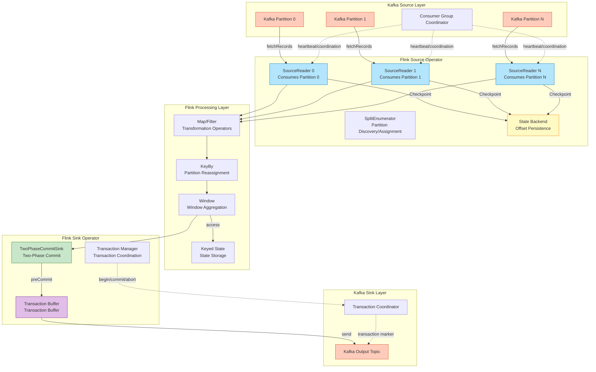
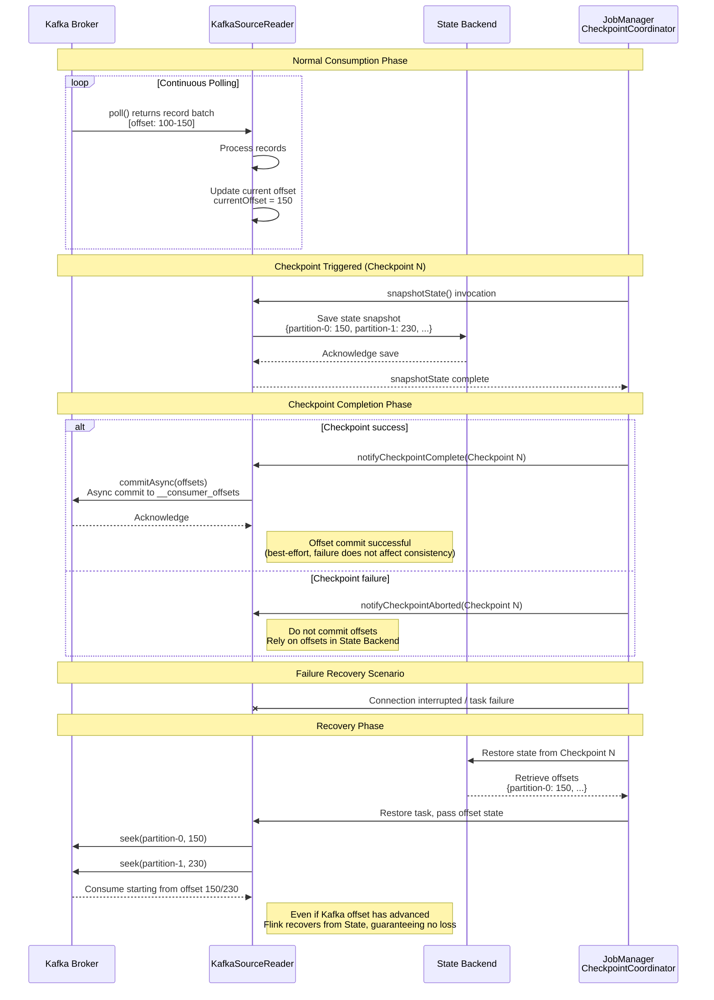
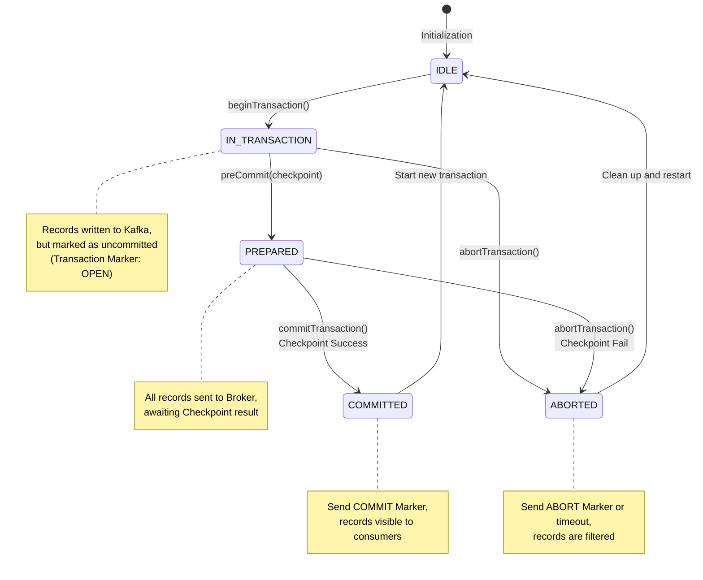
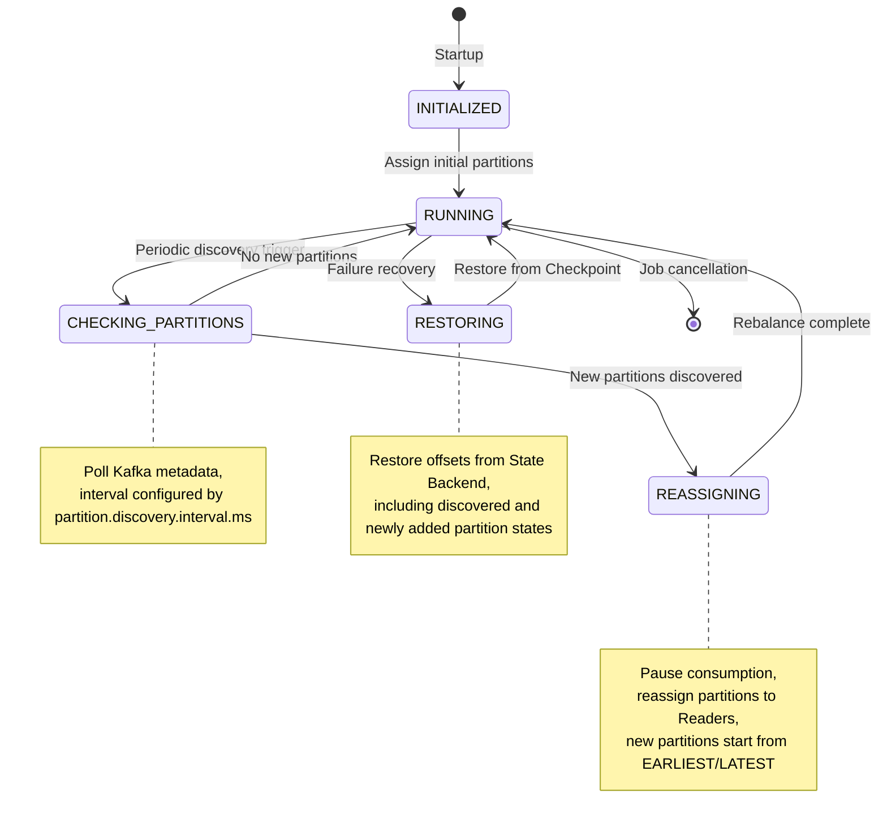

# Flink Kafka Integration Patterns

> **Stage**: Flink/04-connectors | **Prerequisites**: [../../../Struct/02-properties/02.02-consistency-hierarchy.md](../../../Struct/02-properties/02.02-consistency-hierarchy.md), [../../Flink/02-core/exactly-once-end-to-end.md](../../02-core/exactly-once-end-to-end.md) | **Formalization Level**: L4

---

## Table of Contents

- [Flink Kafka Integration Patterns](#flink-kafka-integration-patterns)
  - [Table of Contents](#table-of-contents)
  - [1. Definitions](#1-definitions)
    - [Def-F-04-01 (Kafka Source Replayability)](#def-f-04-01-kafka-source-replayability)
    - [Def-F-04-02 (Transactional Producer Semantics)](#def-f-04-02-transactional-producer-semantics)
    - [Def-F-04-03 (Idempotent Producer Semantics)](#def-f-04-03-idempotent-producer-semantics)
    - [Def-F-04-04 (Transaction Fencing)](#def-f-04-04-transaction-fencing)
    - [Def-F-04-05 (Schema Compatibility Contract)](#def-f-04-05-schema-compatibility-contract)
  - [2. Properties](#2-properties)
    - [Lemma-F-04-01 (Kafka Source Offset Binding Guarantee)](#lemma-f-04-01-kafka-source-offset-binding-guarantee)
    - [Lemma-F-04-02 (Transactional Sink Atomicity Boundary)](#lemma-f-04-02-transactional-sink-atomicity-boundary)
    - [Prop-F-04-01 (End-to-End Exactly-Once Triad Condition)](#prop-f-04-01-end-to-end-exactly-once-triad-condition)
  - [3. Relations](#3-relations)
    - [Relation 1: Kafka Transaction to Flink Checkpoint Mapping](#relation-1-kafka-transaction-to-flink-checkpoint-mapping)
    - [Relation 2: Kafka Partition to Flink Parallelism Correspondence](#relation-2-kafka-partition-to-flink-parallelism-correspondence)
    - [Relation 3: Schema Registry to Type System Encoding](#relation-3-schema-registry-to-type-system-encoding)
  - [4. Argumentation](#4-argumentation)
    - [4.1 Partition Discovery Temporal Analysis](#41-partition-discovery-temporal-analysis)
    - [4.2 Consumer Group Rebalance Impact Analysis](#42-consumer-group-rebalance-impact-analysis)
    - [4.3 Transaction Timeout and Recovery Boundary](#43-transaction-timeout-and-recovery-boundary)
    - [4.4 Idempotency vs. Transactionality Engineering Tradeoff](#44-idempotency-vs-transactionality-engineering-tradeoff)
  - [5. Proof / Engineering Argument](#5-proof-engineering-argument)
    - [Thm-F-04-01 (Kafka Source Exactly-Once Correctness)](#thm-f-04-01-kafka-source-exactly-once-correctness)
    - [Thm-F-04-02 (Kafka Sink Transactional Atomicity Guarantee)](#thm-f-04-02-kafka-sink-transactional-atomicity-guarantee)
  - [6. Examples](#6-examples)
    - [6.1 Kafka Source Basic Configuration](#61-kafka-source-basic-configuration)
    - [6.2 Kafka Sink Transactional Configuration](#62-kafka-sink-transactional-configuration)
    - [6.3 Schema Registry Integration Configuration](#63-schema-registry-integration-configuration)
    - [6.4 End-to-End Exactly-Once Complete Configuration](#64-end-to-end-exactly-once-complete-configuration)
  - [7. Visualizations](#7-visualizations)
    - [7.1 Kafka-Flink Data Flow Architecture](#71-kafka-flink-data-flow-architecture)
    - [7.2 Offset Commit Sequence Diagram](#72-offset-commit-sequence-diagram)
    - [7.3 Transaction Commit Flow Diagram](#73-transaction-commit-flow-diagram)
    - [7.4 Partition Discovery State Machine](#74-partition-discovery-state-machine)
  - [8. Configuration Reference](#8-configuration-reference)
    - [8.1 Kafka Source Configuration Options](#81-kafka-source-configuration-options)
    - [8.2 Kafka Sink Configuration Options](#82-kafka-sink-configuration-options)
    - [8.3 Exactly-Once Strategies by Kafka Version](#83-exactly-once-strategies-by-kafka-version)
  - [9. References](#9-references)

## 1. Definitions

### Def-F-04-01 (Kafka Source Replayability)

Let $K = (T, P, O, C)$ be a Kafka cluster, where $T$ is the set of Topics, $P_t = \\{p_{t,0}, p_{t,1}, \\dots, p_{t,n-1}\\}$ is the partition set of Topic $t$, $O_{t,p}$ is the offset space of partition $p$, and $C$ is the consumer group coordinator. Kafka Source replayability is defined as: for any $t \\in T$, $p \\in P_t$, and $o \\in O_{t,p}$, there exists a deterministic record sequence $S(t, p, o)$:

$$\\text{Replayable}(K) \\iff \\forall t \\in T, p \\in P_t, o \\in O_{t,p}. \\; \\exists! S(t, p, o)$$

**Intuitive Explanation**: Kafka guarantees total order and immutability of records within each partition through its append-only log. Given an offset, a consumer can always read the same record sequence. This is the foundation for achieving Exactly-Once at the Source layer—after failure recovery, the stream can be precisely "rewound" to a known position and re-read[^1][^3]. According to Def-S-08-05 in [Struct/02-properties/02.02-consistency-hierarchy.md](../../../Struct/02-properties/02.02-consistency-hierarchy.md), a replayable Source is one of the necessary conditions for end-to-end Exactly-Once.

### Def-F-04-02 (Transactional Producer Semantics)

Let $\\mathcal{T}$ be a transaction identifier and $\\mathcal{B}$ be the set of message batches in the transaction:

$$
\\text{TransactionalWrite}(\\mathcal{T}, \\mathcal{B}) = \\begin{cases}
\\text{AllCommitted} & \\text{if } \\forall b \\in \\mathcal{B}. \\; \\text{committed}(b) \\
\\text{AllAborted} & \\text{if } \\forall b \\in \\mathcal{B}. \\; \\text{aborted}(b) \\
\\text{InProgress} & \\text{otherwise}
\\end{cases}
$$

**ACID Properties of Transactions**:

| Property | Definition | Kafka Implementation |
|----------|------------|----------------------|
| **Atomicity** | All operations within a transaction either succeed or fail entirely | Transaction Marker mechanism |
| **Consistency** | After transaction completion, the system is in a valid state | Atomic commit of offsets and messages |
| **Isolation** | Concurrent transactions do not interfere with each other | `read_committed` isolation level |
| **Durability** | Results of committed transactions are permanently persisted | Replication factor + acks=all |

**Intuitive Explanation**: The transactional producer enables the Kafka Sink to participate in Flink's Two-Phase Commit (2PC) protocol. Each Flink Checkpoint cycle corresponds to one Kafka transaction; the transaction is committed when the Checkpoint succeeds and aborted when it fails, thereby guaranteeing an externally visible "exactly-once" effect[^3][^5].

### Def-F-04-03 (Idempotent Producer Semantics)

The idempotent producer guarantees that identical records are not written multiple times in scenarios of network retries or producer restarts. Let $P$ be a producer instance, $M$ be a message, and $E$ be the idempotency token (PID + Sequence Number) recorded at the Broker:

$$\\text{Idempotent}(P) \\iff \\forall M. \\; \\text{send}(P, M, n) \\Rightarrow \\text{Broker}(E) \\text{ contains } M \\text{ exactly once}$$

where $n$ is the message sequence number, monotonically increasing and unique.

**Sequence Number Mechanism**:

- **Producer ID (PID)**: A unique identifier for the producer instance, assigned by the Broker upon initialization
- **Sequence Number**: The message sequence number within each partition, monotonically increasing
- **Broker-Side Deduplication**: The Broker maintains the latest sequence number for each (PID, Partition) pair, rejecting duplicate or out-of-order messages

### Def-F-04-04 (Transaction Fencing)

Transaction fencing is Kafka's safety mechanism to prevent "zombie tasks" from writing. Let $P_{old}$ and $P_{new}$ be the old and new producer instances, respectively, and $E$ be the Producer Epoch maintained by the Broker:

$$\\text{Fence}(P_{old}, P_{new}) \\iff \\text{epoch}(P_{new}) > \\text{epoch}(P_{old}) \\Rightarrow \\forall T \\in \\text{Txns}(P_{old}). \\; \\text{abort}(T)$$

**How the Fencing Mechanism Works**:

1. When a new producer registers, the Broker increments the Epoch corresponding to that `transactional.id`
2. When the old producer attempts to write or commit a transaction, the Broker detects the expired Epoch
3. The old producer receives a `ProducerFencedException`, and the transaction is forcibly aborted

### Def-F-04-05 (Schema Compatibility Contract)

The Schema Registry defines the type contract for data serialization/deserialization. Let $S$ be a Schema and $D$ be data:

$$\\text{SchemaContract}(S) \\iff \\forall D. \\; D_S(D(E_S(D))) = D$$

**Compatibility Levels**:

| Level | Definition | Allowed Changes |
|-------|------------|-----------------|
| **BACKWARD** | New Schema can read old data | Delete fields, add optional fields |
| **FORWARD** | Old Schema can read new data | Add fields, delete optional fields |
| **FULL** | Bidirectional compatibility | Add/delete optional fields |
| **NONE** | No compatibility guarantee | Arbitrary changes |

---

## 2. Properties

### Lemma-F-04-01 (Kafka Source Offset Binding Guarantee)

**Statement**: When `setCommitOffsetsOnCheckpoints(true)` is enabled, the Flink Kafka Source guarantees atomic binding between Kafka offset commits and successful Flink Checkpoints.

**Formal Statement**: Let $C_k$ be the $k$-th Checkpoint and $o_k$ be the corresponding offset state:

$$\\text{Commit}_K(o_k) \\iff \\text{Success}(C_k)$$

**Proof**:

1. The Flink Kafka Source's `snapshotState()` saves the current consumption offsets to the state backend
2. Offset commits occur in the `notifyCheckpointComplete()` callback, triggered only after the Checkpoint completes successfully
3. If the Checkpoint fails, `notifyCheckpointAborted()` is triggered, and no offsets are committed
4. During failure recovery, the Source restores offsets from the state backend, which take precedence over offsets already committed to Kafka

Therefore, offset commits are strictly synchronized with Checkpoint success events. ∎

### Lemma-F-04-02 (Transactional Sink Atomicity Boundary)

**Statement**: The Flink Kafka transactional Sink treats all outputs within each Checkpoint cycle as an atomic unit to be committed or rolled back.

**Formal Statement**: Let $W_k$ be the set of all records written by the Sink between Checkpoint $k$ and Checkpoint $k+1$, and $T_k$ be the corresponding Kafka transaction:

$$\\forall r \\in W_k. \\; \\text{Visible}(r) \\iff \\text{Committed}(T_k)$$

**Proof**:

- `beginTransaction()`: A new transaction is opened at the start of a Checkpoint
- `preCommit()`: During the Checkpoint synchronization phase, the transaction is placed in the PREPARED state
- `commit()`: After the Checkpoint succeeds, the transaction is committed, and records become visible to consumers
- `abort()`: When the Checkpoint fails, the transaction is aborted, and records are not visible

According to the atomicity of the 2PC protocol, all records within a transaction share the same visibility state. ∎

### Prop-F-04-01 (End-to-End Exactly-Once Triad Condition)

**Statement**: Flink Kafka end-to-end Exactly-Once holds if and only if the following three conditions are simultaneously satisfied:

$$\\text{EO}(J) \\iff \\text{Replayable}(Src) \\land \\text{ConsistentCheckpoint}(Ops) \\land \\text{AtomicOutput}(Sink)$$

According to Prop-S-08-01 in [Struct/02-properties/02.02-consistency-hierarchy.md](../../../Struct/02-properties/02.02-consistency-hierarchy.md) and [Flink/02-core/exactly-once-end-to-end.md](../../02-core/exactly-once-end-to-end.md), Source replayability, engine internal consistency, and Sink atomicity must all be satisfied simultaneously.

---

## 3. Relations

### Relation 1: Kafka Transaction to Flink Checkpoint Mapping

The Flink Kafka transactional Sink implements an adapter layer that maps the Flink Checkpoint protocol to the Kafka transaction protocol:

| Flink Concept | Kafka Transaction Concept | Mapping Relation |
|---------------|---------------------------|------------------|
| CheckpointCoordinator | TransactionCoordinator | 1:1 correspondence, coordinator role |
| Checkpoint Barrier | Transaction Begin Marker | Semantic boundary alignment |
| snapshotState() | preCommit() | Preparation phase, state persistence |
| notifyCheckpointComplete() | commitTransaction() | Commit phase, results visible |
| notifyCheckpointAborted() | abortTransaction() | Rollback phase, resource cleanup |
| StateBackend offsets | __consumer_offsets | StateBackend takes precedence during recovery |

### Relation 2: Kafka Partition to Flink Parallelism Correspondence

There is a constraint relationship between the parallelism of the Flink Kafka Source and the number of Kafka Partitions. Let $P_K$ be the number of Kafka partitions and $P_F$ be the Flink parallelism:

| Scenario | Constraint | Behavior Characteristics |
|----------|------------|--------------------------|
| $P_F = P_K$ | Ideal correspondence | Each Subtask processes one partition, no data skew |
| $P_F < P_K$ | Many-to-one mapping | Some Subtasks process multiple partitions, potential load imbalance |
| $P_F > P_K$ | One-to-many idle | Excess Subtasks remain idle, wasting resources |

**Best Practice**: $\\text{OptimalParallelism} = P_K \\times n, \\quad n \\in \\{1, 2, 4, \\dots\\}$

### Relation 3: Schema Registry to Type System Encoding

The Schema Registry provides a codec bridge between data types in Kafka messages and the Flink type system:

| Flink Type | Avro Schema | Protobuf | JSON Schema |
|-----------|-------------|----------|-------------|
| `String` | `string` | `string` | `{"type": "string"}` |
| `Integer` | `int` | `int32` | `{"type": "integer"}` |
| `Long` | `long` | `int64` | `{"type": "integer"}` |
| `Double` | `double` | `double` | `{"type": "number"}` |
| `Row` | `record` | `message` | `object` |
| `Array<T>` | `array` | `repeated` | `array` |

---

## 4. Argumentation

### 4.1 Partition Discovery Temporal Analysis

The Flink Kafka Source supports dynamic discovery of newly added partitions during job execution. The timing of this mechanism is as follows:

1. **T0**: Initial state; the Source subscribes to a Topic set $T$, with partition set $P_0$
2. **T1**: A Kafka administrator increases partitions; the new partition set is $P_1 = P_0 \\cup \\{p_{new}\\}$
3. **T2**: The Flink Source detects $p_{new}$ during the next discovery polling cycle
4. **T3**: Source reinitialization is triggered, incorporating $p_{new}$ into the read scope
5. **T4**: Consumption starts from the initial offset of $p_{new}$ (default `LATEST` or `EARLIEST`)

**Data Integrity Guarantee**: Data from the newly added partitions starting from the discovery moment is consumed; combined with Checkpointing, the initial offsets of the new partitions are included in the next Checkpoint.

### 4.2 Consumer Group Rebalance Impact Analysis

**Rebalance Trigger Conditions**:

| Trigger Event | Impact Scope | Recovery Time |
|---------------|--------------|---------------|
| New consumer joins | Full group reassignment | Several seconds to tens of seconds |
| Consumer heartbeat timeout | Failed consumer partition migration | Depends on `session.timeout.ms` |
| Consumer leaves proactively | Partition reassignment | Several seconds |
| Partition count changes | Full group reassignment | Related to discovery interval |

**Flink Mitigation Strategies**: Static membership (`group.instance.id`), cooperative rebalancing (Kafka 2.4+), and disabling auto-commit.

### 4.3 Transaction Timeout and Recovery Boundary

Key constraint: $\\text{CheckpointInterval} + \\text{CheckpointTimeout} < \\text{transaction.timeout.ms}$

If the Flink job failure duration $D > \\text{transaction.timeout.ms}$, the in-progress Kafka transaction will be forcibly aborted by the Broker. After recovery, Flink restores from the last successful Checkpoint, reprocesses data after that Checkpoint, and opens a new transaction.

### 4.4 Idempotency vs. Transactionality Engineering Tradeoff

| Dimension | Idempotency Solution | Transactionality Solution |
|-----------|----------------------|---------------------------|
| **Latency** | Low (direct write) | Higher (two-phase commit) |
| **Throughput** | High (no coordination overhead) | Medium (transaction coordination overhead) |
| **External Dependencies** | No special support required | Requires transaction support (Kafka 0.11+) |
| **Cross-Partition Atomicity** | Not supported | Supported |
| **Consumer Isolation** | Weak (may read uncommitted data) | Strong (read_committed isolation) |

---

## 5. Proof / Engineering Argument

### Thm-F-04-01 (Kafka Source Exactly-Once Correctness)

**Statement**: Under the conditions of enabling `setCommitOffsetsOnCheckpoints(true)` and using a replayable Source, the Flink Kafka Source guarantees At-Least-Once semantics; combined with an idempotent/transactional Sink, end-to-end Exactly-Once can be achieved.

**Proof**:

**Prerequisites**:

1. Kafka logs are append-only, and offsets are monotonically increasing
2. Flink Checkpointing guarantees a globally consistent snapshot through Barrier alignment
3. Offset commits are bound to Checkpoint success events

**No-Loss Property (At-Least-Once)**: Let $C_n$ be the last successful Checkpoint, and its saved offset be $o_n$. During failure recovery:

1. The Source recovers its state and obtains offset $o_n$
2. The Source seeks to position $o_n$ in Kafka
3. Consumption resumes from $o_n$, and all data after $C_n$ is reprocessed

Therefore, no data loss occurs. Combined with an idempotent/transactional Sink, end-to-end Exactly-Once can be achieved. ∎

### Thm-F-04-02 (Kafka Sink Transactional Atomicity Guarantee)

**Statement**: The Flink Kafka transactional Sink uses the Two-Phase Commit protocol to guarantee that the output of each Checkpoint cycle is either entirely visible or entirely invisible.

**Proof**: Let $W$ be all records written by the Sink during a Checkpoint cycle, and $T$ be the corresponding Kafka transaction:

1. **Preparation Phase** (`preCommit`): All $w \\in W$ have been sent to the Kafka Broker but are marked as uncommitted
2. **Decision Phase**:
   - If the Checkpoint succeeds, a COMMIT Marker is sent, and all $w$ become visible to consumers
   - If the Checkpoint fails, an ABORT Marker is sent or a timeout abort occurs, and all $w$ are invisible
3. **Isolation**: Consumers using `isolation.level=read_committed` will not read uncommitted records

Therefore, the visibility of $W$ is atomic. ∎

---

## 6. Examples

### 6.1 Kafka Source Basic Configuration

```java
// [Pseudocode snippet - not runnable directly] Core logic demonstration only
import org.apache.flink.api.common.eventtime.WatermarkStrategy;
import org.apache.flink.connector.kafka.source.KafkaSource;
import org.apache.flink.connector.kafka.source.enumerator.initializer.OffsetsInitializer;

import org.apache.flink.streaming.api.datastream.DataStream;


// Build Kafka Source (Flink 1.14+ new API)
KafkaSource<Event> source = KafkaSource.<Event>builder()
    .setBootstrapServers("kafka-1:9092,kafka-2:9092")
    .setTopics("input-topic")
    .setGroupId("flink-consumer-group")
    .setStartingOffsets(OffsetsInitializer.earliest())
    .setDeserializer(KafkaRecordDeserializationSchema.of(
        new EventDeserializationSchema()))
    .setProperty("partition.discovery.interval.ms", "10000")
    .setProperty("isolation.level", "read_committed")
    .build();

DataStream<Event> stream = env.fromSource(
    source,
    WatermarkStrategy.forBoundedOutOfOrderness(Duration.ofSeconds(5)),
    "Kafka Source");
```

### 6.2 Kafka Sink Transactional Configuration

```java
// [Pseudocode snippet - not runnable directly] Core logic demonstration only
import org.apache.flink.connector.base.DeliveryGuarantee;
import org.apache.flink.connector.kafka.sink.KafkaSink;

KafkaSink<Result> sink = KafkaSink.<Result>builder()
    .setBootstrapServers("kafka-1:9092,kafka-2:9092")
    .setRecordSerializer(KafkaRecordSerializationSchema.builder()
        .setTopic("output-topic")
        .setValueSerializationSchema(new ResultSerializationSchema())
        .build())
    .setDeliveryGuarantee(DeliveryGuarantee.EXACTLY_ONCE)
    .setProperty("transaction.timeout.ms", "900000")
    .setProperty("enable.idempotence", "true")
    .setProperty("acks", "all")
    .setTransactionalIdPrefix("flink-job-" + subtaskIndex)
    .build();

stream.sinkTo(sink);
```

### 6.3 Schema Registry Integration Configuration

```java
// [Pseudocode snippet - not runnable directly] Core logic demonstration only
// Confluent Schema Registry integration
KafkaSource<UserEvent> source = KafkaSource.<UserEvent>builder()
    .setBootstrapServers("kafka:9092")
    .setTopics("user-events")
    .setGroupId("flink-avro-consumer")
    .setDeserializer(new AvroDeserializationSchema())
    .setProperty("schema.registry.url", "http://schema-registry:8081")
    .setProperty("specific.avro.reader", "true")
    .build();

// AWS Glue Schema Registry
Properties glueProps = new Properties();
glueProps.setProperty("aws.glue.schema.registry.url", "https://glue.us-east-1.amazonaws.com");
glueProps.setProperty("aws.region", "us-east-1");
```

### 6.4 End-to-End Exactly-Once Complete Configuration

```java
import org.apache.flink.streaming.api.checkpointing.CheckpointingMode;
import org.apache.flink.streaming.api.checkpointing.CheckpointConfig;

import org.apache.flink.streaming.api.environment.StreamExecutionEnvironment;
import org.apache.flink.streaming.api.datastream.DataStream;
import org.apache.flink.streaming.api.CheckpointingMode;
import org.apache.flink.streaming.api.windowing.time.Time;


public class ExactlyOnceKafkaPipeline {
    public static void main(String[] args) throws Exception {
        StreamExecutionEnvironment env =
            StreamExecutionEnvironment.getExecutionEnvironment();

        // ==================== Checkpoint Configuration ====================
        env.enableCheckpointing(60000, CheckpointingMode.EXACTLY_ONCE);
        CheckpointConfig ckptConfig = env.getCheckpointConfig();
        ckptConfig.setCheckpointTimeout(600000);
        ckptConfig.setMinPauseBetweenCheckpoints(30000);
        ckptConfig.setMaxConcurrentCheckpoints(1);
        ckptConfig.setExternalizedCheckpointCleanup(
            CheckpointConfig.ExternalizedCheckpointCleanup.RETAIN_ON_CANCELLATION);

        // State backend configuration
        env.setStateBackend(new EmbeddedRocksDBStateBackend(true));
        env.getCheckpointConfig().setCheckpointStorage("s3://bucket/flink-checkpoints");

        // ==================== Kafka Source ====================
        KafkaSource<Event> source = KafkaSource.<Event>builder()
            .setBootstrapServers("kafka-1:9092,kafka-2:9092,kafka-3:9092")
            .setTopicsPattern("input-topic-.*")
            .setGroupId("exactly-once-consumer-group")
            .setProperty("isolation.level", "read_committed")
            .setProperty("enable.auto.commit", "false")
            .setProperty("auto.offset.reset", "earliest")
            .setProperty("partition.discovery.interval.ms", "30000")
            .setProperty("group.instance.id", "flink-instance-1")
            .build();

        // ==================== Business Processing Logic ====================
        DataStream<Result> processed = env
            .fromSource(source, WatermarkStrategy.forBoundedOutOfOrderness(
                Duration.ofSeconds(30)), "Kafka Source")
            .keyBy(Event::getUserId)
            .window(TumblingEventTimeWindows.of(Time.minutes(1)))
            .aggregate(new EventAggregator())
            .map(new ResultEnricher());

        // ==================== Kafka Sink ====================
        KafkaSink<Result> sink = KafkaSink.<Result>builder()
            .setBootstrapServers("kafka-1:9092,kafka-2:9092,kafka-3:9092")
            .setRecordSerializer(KafkaRecordSerializationSchema.builder()
                .setTopicSelector((e) -> "output-topic-" + e.getCategory())
                .setValueSerializationSchema(new ResultSerializationSchema())
                .build())
            .setDeliveryGuarantee(DeliveryGuarantee.EXACTLY_ONCE)
            .setProperty("transaction.timeout.ms", "900000")
            .setProperty("enable.idempotence", "true")
            .setProperty("acks", "all")
            .setProperty("retries", Integer.MAX_VALUE)
            .setTransactionalIdPrefix("exactly-once-job-" + jobId)
            .build();

        processed.sinkTo(sink);
        env.execute("Exactly-Once Kafka Pipeline");
    }
}
```

---

## 7. Visualizations

### 7.1 Kafka-Flink Data Flow Architecture



**Diagram Description**: Orange nodes represent the Kafka Broker layer, blue represents the Flink Source, green represents the Sink, yellow represents the state backend, and purple represents the transaction buffer.

### 7.2 Offset Commit Sequence Diagram



**Diagram Description**: Committing offsets to Kafka is a best-effort optimization; true fault tolerance relies on offsets saved in the State Backend.

### 7.3 Transaction Commit Flow Diagram



### 7.4 Partition Discovery State Machine



---

## 8. Configuration Reference

### 8.1 Kafka Source Configuration Options

| Configuration Item | Type | Default Value | Description | Recommended Value |
|--------------------|------|---------------|-------------|-------------------|
| `bootstrap.servers` | String | Required | Kafka Broker address list | `kafka-1:9092,kafka-2:9092` |
| `topics` / `topicsPattern` | String | Required | Subscribed Topic or regex pattern | Specify according to business |
| `group.id` | String | Required | Consumer group ID | `flink-consumer-${job}` |
| `startingOffsets` | Enum | `COMMITTED` | Starting offset strategy | `COMMITTED` |
| `partition.discovery.interval.ms` | Long | `-1` (disabled) | Partition discovery interval | `30000` (30s) |
| `isolation.level` | String | `read_uncommitted` | Consumer isolation level | `read_committed` (EO required) |
| `enable.auto.commit` | Boolean | `true` | Auto-commit offsets | `false` (managed by Flink) |
| `auto.offset.reset` | String | `latest` | Reset policy when no offset exists | `earliest` |
| `group.instance.id` | String | null | Static membership ID | `flink-${taskId}` |
| `session.timeout.ms` | Integer | `10000` | Session timeout | `45000` |
| `heartbeat.interval.ms` | Integer | `3000` | Heartbeat interval | `15000` |
| `max.poll.records` | Integer | `500` | Max records per poll | `1000-5000` |
| `max.poll.interval.ms` | Integer | `300000` | Max interval between two polls | `300000` |

**Exactly-Once Required Configuration**:

```properties
# Consumer configuration isolation.level=read_committed
enable.auto.commit=false
auto.offset.reset=earliest

# Producer configuration (Sink)
enable.idempotence=true
acks=all
transactional.id=${uniquePrefix}-${subtaskIndex}
transaction.timeout.ms=${>checkpointInterval + checkpointTimeout}
```

### 8.2 Kafka Sink Configuration Options

| Configuration Item | Type | Default Value | Description | Recommended Value |
|--------------------|------|---------------|-------------|-------------------|
| `bootstrap.servers` | String | Required | Kafka Broker address | Same as Source |
| `delivery.guarantee` | Enum | `AT_LEAST_ONCE` | Delivery guarantee level | `EXACTLY_ONCE` |
| `transactionalIdPrefix` | String | Auto-generated | Transaction ID prefix | Explicitly specify a unique value |
| `transaction.timeout.ms` | Integer | `60000` | Transaction timeout | `900000` (15min) |
| `enable.idempotence` | Boolean | `true` | Enable idempotence | `true` |
| `acks` | String | `1` | Acknowledgment level | `all` |
| `retries` | Integer | `2147483647` | Number of retries | `Integer.MAX_VALUE` |
| `max.in.flight.requests.per.connection` | Integer | `5` | Max in-flight requests | `5` |
| `linger.ms` | Long | `0` | Send delay | `5-100` |
| `buffer.memory` | Long | `33554432` | Buffer size | `67108864` (64MB) |
| `batch.size` | Integer | `16384` | Batch size | `32768` |
| `compression.type` | String | `none` | Compression algorithm | `lz4` or `snappy` |
| `max.block.ms` | Long | `60000` | Max block time | `60000` |
| `request.timeout.ms` | Integer | `30000` | Request timeout | `30000` |

### 8.3 Exactly-Once Strategies by Kafka Version

Exactly-Once strategies supported vary across Kafka versions. The following table summarizes the capability matrix for each version:

| Feature | Kafka 0.10 | Kafka 0.11 | Kafka 1.0 | Kafka 2.0 | Kafka 2.4+ | Kafka 3.0+ |
|---------|-----------|-----------|-----------|-----------|-----------|-----------|
| **Idempotent Producer** | ❌ Not supported | ✅ Supported | ✅ Supported | ✅ Supported | ✅ Supported | ✅ Supported |
| **Transaction API** | ❌ Not supported | ✅ Supported | ✅ Supported | ✅ Supported | ✅ Supported | ✅ Supported |
| **Transaction Fencing** | ❌ Not supported | ✅ Basic support | ✅ Basic support | ✅ Improved | ✅ Improved | ✅ Improved |
| **Cooperative Rebalancing** | ❌ Not supported | ❌ Not supported | ❌ Not supported | ❌ Not supported | ✅ Supported | ✅ Supported |
| **Exactly-Once Strategy** | At-Least-Once + Deduplication | 2PC Transaction | 2PC Transaction | 2PC Transaction | 2PC + Cooperative Rebalancing | 2PC + Improved Fencing |

**Version-Specific Configuration Requirements**:

| Version | Required Configuration | Recommended Strategy |
|---------|------------------------|----------------------|
| **Kafka < 0.11** | No transaction support | At-Least-Once + application-level deduplication / idempotent Sink |
| **Kafka 0.11-1.x** | `transactional.id`, `enable.idempotence=true` | 2PC transaction, but high rebalance cost |
| **Kafka 2.0-2.3** | Same as above | 2PC transaction, improved transaction fencing |
| **Kafka 2.4+** | `partition.assignment.strategy=org.apache.kafka.clients.consumer.CooperativeStickyAssignor` | 2PC transaction + cooperative rebalancing, reduced reprocessing |
| **Kafka 3.0+** | Same as above | Improved transaction fencing, stricter zombie task detection |

**Version Compatibility Notes**:

```java
// [Pseudocode snippet - not runnable directly] Core logic demonstration only
// Kafka 2.4+ cooperative rebalancing configuration
properties.setProperty(
    "partition.assignment.strategy",
    "org.apache.kafka.clients.consumer.CooperativeStickyAssignor"
);

// Kafka 2.5+ static membership configuration
properties.setProperty("group.instance.id", "flink-instance-" + taskId);
```

---

## 9. References

[^1]: Apache Flink Documentation, "Kafka Connector", 2025. <https://nightlies.apache.org/flink/flink-docs-stable/docs/connectors/datastream/kafka/>


[^3]: Apache Kafka Documentation, "Transactions in Kafka", 2025. <https://kafka.apache.org/documentation/#transactions>


[^5]: P. Carbone et al., "State Management in Apache Flink: Consistent Stateful Distributed Stream Processing", *PVLDB*, 10(12), 2017.


---

*Document version: v1.0 | Updated: 2026-04-02 | Status: Completed*

---

*Document version: v1.0 | Created: 2026-04-19*
