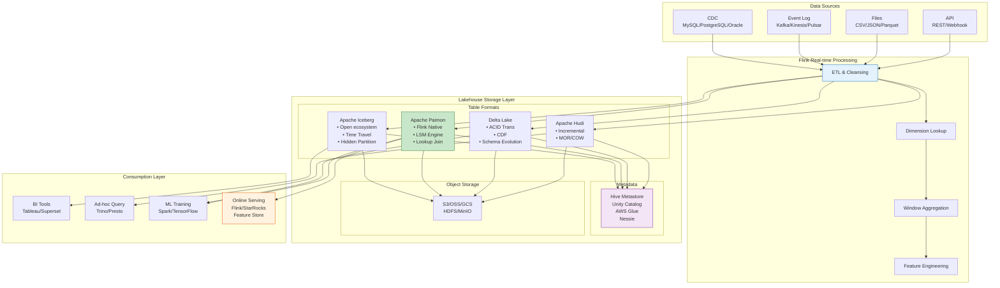
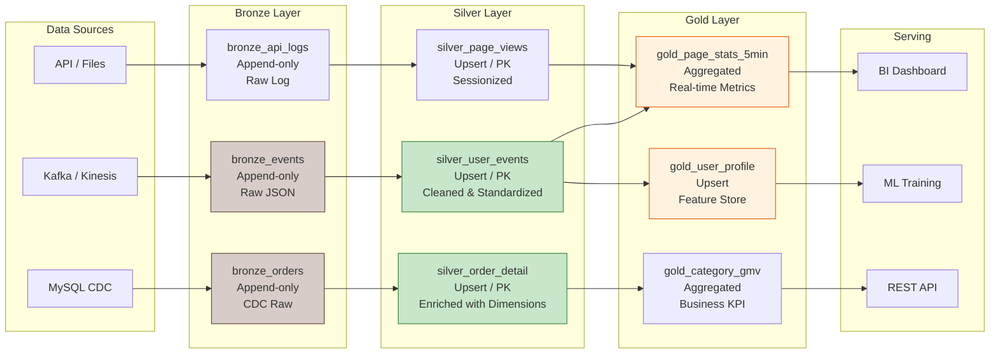
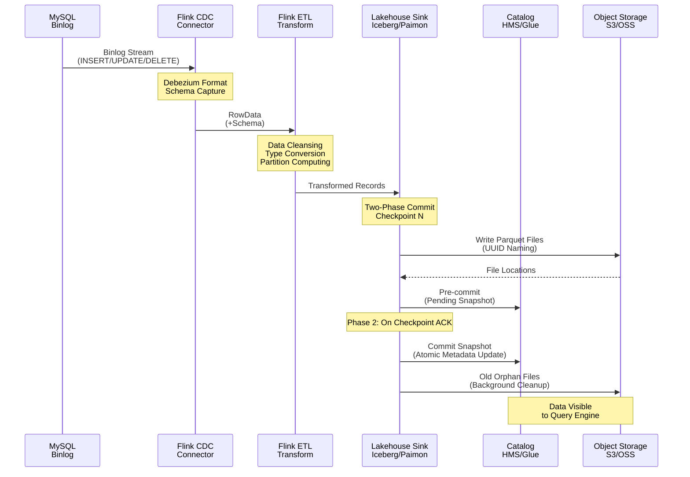
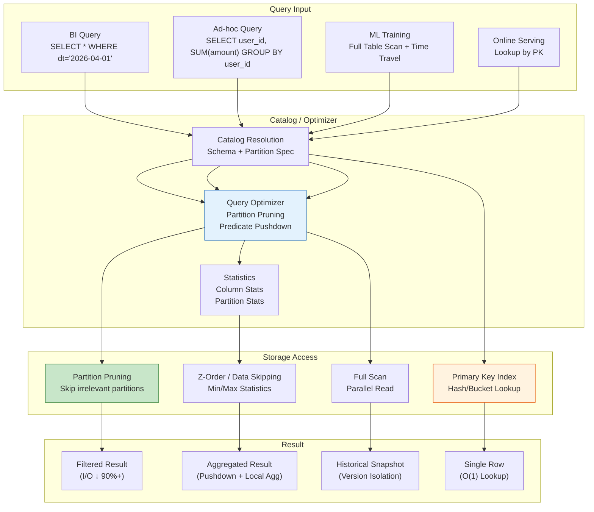

# Streaming Lakehouse Architecture

> **Language**: English | **Translated from**: Flink/05-ecosystem/05.02-lakehouse/streaming-lakehouse-architecture.md | **Translation date**: 2026-04-20
>
> **Stage**: Flink/05-ecosystem | **Prerequisites**: [flink-iceberg-integration.md](flink-iceberg-integration.md), [flink-paimon-integration.md](flink-paimon-integration.md) | **Formalization Level**: L4-L5 | **Scope**: Flink + Iceberg/Paimon/Delta/Hudi unified stream-batch analytics

---

## Table of Contents

- [Streaming Lakehouse Architecture](#streaming-lakehouse-architecture)
  - [Table of Contents](#table-of-contents)
  - [1. Definitions](#1-definitions)
    - [Def-F-05-40 (Streaming Lakehouse Formal Definition)](#def-f-05-40-streaming-lakehouse-formal-definition)
    - [Def-F-05-41 (Open Table Format)](#def-f-05-41-open-table-format)
    - [Def-F-05-42 (Ingestion Semantics)](#def-f-05-42-ingestion-semantics)
    - [Def-F-05-43 (Dynamic Iceberg Sink)](#def-f-05-43-dynamic-iceberg-sink)
    - [Def-F-05-44 (Paimon LSM Engine)](#def-f-05-44-paimon-lsm-engine)
    - [Def-F-05-45 (Delta Lake Transaction Log)](#def-f-05-45-delta-lake-transaction-log)
    - [Def-F-05-46 (Unified Metadata Layer)](#def-f-05-46-unified-metadata-layer)
    - [Def-F-05-47 (Bronze-Silver-Gold Layering)](#def-f-05-47-bronze-silver-gold-layering)
  - [2. Properties](#2-properties)
    - [Lemma-F-05-40 (Time Travel Completeness Across Formats)](#lemma-f-05-40-time-travel-completeness-across-formats)
    - [Lemma-F-05-41 (Stream Write Idempotency)](#lemma-f-05-41-stream-write-idempotency)
    - [Prop-F-05-40 (Incremental Consumption Ordering)](#prop-f-05-40-incremental-consumption-ordering)
    - [Prop-F-05-41 (Storage Cost Optimization Boundary)](#prop-f-05-41-storage-cost-optimization-boundary)
  - [3. Relations](#3-relations)
    - [3.1 Flink + Open Table Format Mapping](#31-flink--open-table-format-mapping)
    - [3.2 Stream-Batch Query Result Equivalence](#32-stream-batch-query-result-equivalence)
    - [3.3 Multi-Format Comparison Matrix](#33-multi-format-comparison-matrix)
  - [4. Argumentation](#4-argumentation)
    - [4.1 Streaming Lakehouse vs Lambda Architecture](#41-streaming-lakehouse-vs-lambda-architecture)
    - [4.2 Format Selection Decision Framework](#42-format-selection-decision-framework)
    - [4.3 Unified Metadata Layer Design Trade-offs](#43-unified-metadata-layer-design-trade-offs)
    - [4.4 Tiered Storage Hot/Warm/Cold Strategy](#44-tiered-storage-hotwarmcold-strategy)
  - [5. Proof / Engineering Argument](#5-proof--engineering-argument)
    - [Thm-F-05-40 (Unified Batch-Stream Result Consistency)](#thm-f-05-40-unified-batch-stream-result-consistency)
    - [Thm-F-05-41 (End-to-End Exactly-Once)](#thm-f-05-41-end-to-end-exactly-once)
    - [Thm-F-05-42 (Incremental Consumption Completeness)](#thm-f-05-42-incremental-consumption-completeness)
  - [6. Examples](#6-examples)
    - [6.1 Architecture Pattern 1: Real-Time ETL Pipeline](#61-architecture-pattern-1-real-time-etl-pipeline)
    - [6.2 Architecture Pattern 2: CDC to Lakehouse](#62-architecture-pattern-2-cdc-to-lakehouse)
    - [6.3 Architecture Pattern 3: Real-Time Feature Platform](#63-architecture-pattern-3-real-time-feature-platform)
    - [6.4 Architecture Pattern 4: AI/ML Data Pipeline](#64-architecture-pattern-4-aiml-data-pipeline)
    - [6.5 Flink + Iceberg: Dynamic Sink, Hidden Partitioning \& Z-Order](#65-flink--iceberg-dynamic-sink-hidden-partitioning--z-order)
    - [6.6 Flink + Paimon: Lookup Join \& Materialized Tables](#66-flink--paimon-lookup-join--materialized-tables)
    - [6.7 Flink + Delta Lake: Time Travel \& Schema Evolution](#67-flink--delta-lake-time-travel--schema-evolution)
  - [7. Visualizations](#7-visualizations)
    - [7.1 Streaming Lakehouse Architecture Panorama](#71-streaming-lakehouse-architecture-panorama)
    - [7.2 Data Layer Flow Diagram (Bronze-Silver-Gold)](#72-data-layer-flow-diagram-bronze-silver-gold)
    - [7.3 CDC to Lakehouse Flow Diagram](#73-cdc-to-lakehouse-flow-diagram)
    - [7.4 Query Optimization Path Diagram](#74-query-optimization-path-diagram)
  - [8. References](#8-references)

---

## 1. Definitions

### Def-F-05-40 (Streaming Lakehouse Formal Definition)

**Definition**: Streaming Lakehouse is a data architecture that combines stream processing engines (such as Flink) with open table formats (such as Iceberg, Paimon, Delta Lake), achieving unified stream-batch processing, real-time incremental analysis, and historical data backfilling on a single storage layer.

**Formal Structure**:

$$
\text{StreamingLakehouse} = \langle \text{Storage}, \text{TableFormat}, \text{Engine}, \text{Metadata}, \text{Serving}, \text{Governance} \rangle
$$

Where:

- **Storage**: Object storage (S3/OSS/GCS/HDFS) or distributed file system
- **TableFormat**: Open table format (Iceberg/Paimon/Delta/Hudi)
- **Engine**: Stream processing engine (Flink) + batch engine (Spark/Trino)
- **Metadata**: Unified metadata layer (Catalog)
- **Serving**: Data service layer (BI/AI/API)
- **Governance**: Data governance (security/quality/lineage)

**Core Characteristics**:

| Characteristic | Description | Technical Implementation |
|----------------|-------------|-------------------------|
| **Unified Storage** | Single storage serves both stream and batch | Open table format + object storage |
| **Real-Time Incremental** | Support minute-level/second-level data freshness | Flink streaming write + incremental consumption |
| **Historical Backfill** | Support arbitrary historical data backfilling | Time travel + snapshot isolation |
| **Schema Evolution** | Support painless schema changes | Open table format metadata layer |
| **Multi-Engine Compatible** | Support Flink/Spark/Trino and other engines | Standardized table format specification |

---

### Def-F-05-41 (Open Table Format)

**Definition**: Open table format is a standardized data organization specification that defines how data files, metadata files, and table schemas are organized on storage, supporting ACID transactions, schema evolution, and incremental consumption.

**Formal Structure**:

$$
\text{OpenTableFormat} = \langle \text{DataFiles}, \text{MetadataLayer}, \text{Schema}, \text{PartitionSpec}, \text{SnapshotHistory} \rangle
$$

**Comparison of Mainstream Formats**:

| Dimension | Apache Iceberg | Apache Paimon | Delta Lake | Apache Hudi |
|-----------|---------------|---------------|------------|-------------|
| **Origins** | Netflix | Alibaba | Databricks | Uber |
| **Storage Format** | Parquet/ORC/Avro | Parquet/ORC/Avro + LSM | Parquet | Parquet/Avro |
| **Transaction Model** | Optimistic Concurrency | LSM + Snapshot | Optimistic Log | MVCC |
| **Stream Write** | Good | Excellent | Medium | Excellent |
| **Batch Read** | Excellent | Good | Excellent | Good |
| **Incremental Consumption** | Medium | Excellent | Medium | Excellent |
| **Flink Integration** | Good | Excellent (native) | Medium | Good |
| **Spark Integration** | Excellent | Good | Excellent | Excellent |
| **Time Travel** | ✓ | ✓ | ✓ | ✓ |
| **Schema Evolution** | ✓ | ✓ | ✓ | ✓ |

---

### Def-F-05-42 (Ingestion Semantics)

**Definition**: Ingestion semantics define the consistency guarantees when data flows from the source system into the Lakehouse storage layer.

**Semantic Levels**:

| Level | Description | Applicable Scenarios |
|-------|-------------|---------------------|
| **AT_MOST_ONCE** | Data may be lost | Non-critical logs |
| **AT_LEAST_ONCE** | Data not lost, may duplicate | General ETL |
| **EXACTLY_ONCE** | Data neither lost nor duplicated | Financial transactions, state synchronization |

**Flink + Lakehouse Exactly-Once Implementation**:

$$
\text{ExactlyOnce} = \text{Flink Checkpoint} + \text{TwoPhaseCommit}(\text{TableFormat})
$$

---

### Def-F-05-43 (Dynamic Iceberg Sink)

**Definition**: Dynamic Iceberg Sink is a Flink Sink implementation that supports automatic topic-to-table routing, automatic table creation, and schema evolution, suitable for multi-table CDC synchronization scenarios.

See [flink-dynamic-iceberg-sink-guide-en.md](flink-dynamic-iceberg-sink-guide-en.md) for detailed definitions.

---

### Def-F-05-44 (Paimon LSM Engine)

**Definition**: Paimon uses an LSM-Tree (Log-Structured Merge-Tree) architecture to achieve unified stream-batch storage, providing efficient stream write and batch read capabilities through sorted runs and multi-level merging.

**Formal Structure**:

$$
\text{PaimonLSM} = \langle L_0, L_1, \dots, L_n, \text{CompactionPolicy}, \text{ChangelogProducer} \rangle
$$

Where:

- $L_0$: Memory table (MemTable), real-time stream write entry
- $L_1 \dots L_n$: Disk sorted runs, achieving efficient batch read through multi-level merging
- **CompactionPolicy**: Merging strategy, balancing write amplification and read amplification
- **ChangelogProducer**: Changelog generation mechanism, supporting incremental consumption

---

### Def-F-05-45 (Delta Lake Transaction Log)

**Definition**: Delta Lake uses a transaction log (Transaction Log) to implement ACID transactions, recording all table change operations through an ordered JSON log file.

**Formal Structure**:

$$
\text{DeltaLog} = \langle \text{Version}_0, \text{Version}_1, \dots, \text{Version}_n \rangle
$$

Each version records:

- **Add File**: Add data file
- **Remove File**: Delete data file
- **Update Metadata**: Update table metadata
- **Protocol Evolution**: Protocol version evolution

---

### Def-F-05-46 (Unified Metadata Layer)

**Definition**: The unified metadata layer is an abstract layer above open table formats, providing unified metadata management for multi-format and multi-engine scenarios.

**Formal Structure**:

$$
\text{UnifiedMetadata} = \langle \text{Catalog}, \text{TableRegistry}, \lineage, \text{AccessControl} \rangle
$$

**Mainstream Implementations**:

| Implementation | Protocol | Scope | Characteristics |
|---------------|----------|-------|-----------------|
| **Hive Metastore** | Thrift | Enterprise | Mature and stable |
| **AWS Glue** | REST | AWS Cloud | Cloud-native |
| **Unity Catalog** | REST | Databricks | AI + Data integration |
| **Nessie** | REST | Open source | Git-like versioning |
| **Apache Gravitino** | REST | Multi-cloud | Unified metadata |

---

### Def-F-05-47 (Bronze-Silver-Gold Layering)

**Definition**: Bronze-Silver-Gold (BSG) is a layered data governance model in Lakehouse architecture, defining data quality and processing depth through three layers.

**Formal Structure**:

$$
\text{BSG\_Layers} = \langle \text{Bronze}, \text{Silver}, \text{Gold}, \text{Pipeline} \rangle
$$

| Layer | Description | Data Quality | Retention Period |
|-------|-------------|--------------|-----------------|
| **Bronze** | Raw data, append-only | Low (raw data) | 30-90 days |
| **Silver** | Cleaned data, deduplicated | Medium (standardized) | 90-365 days |
| **Gold** | Aggregated metrics, business KPIs | High (business verified) | Long-term |

---

## 2. Properties

### Lemma-F-05-40 (Time Travel Completeness Across Formats)

**Lemma**: For any open table format supporting Time Travel (Iceberg/Paimon/Delta/Hudi), historical snapshots at any point in time can be completely restored.

**Proof**:

1. **Iceberg**: Through snapshot list and manifest files, all historical versions can be completely traced
2. **Paimon**: Through snapshot management and changelog, historical states can be completely restored
3. **Delta**: Through transaction log replay, any version can be completely reconstructed
4. **Hudi**: Through timeline and commit metadata, historical snapshots can be completely accessed

Therefore, all mainstream open table formats support complete Time Travel. ∎

---

### Lemma-F-05-41 (Stream Write Idempotency)

**Lemma**: Under the two-phase commit mechanism, Flink's stream write to Lakehouse is idempotent.

**Proof**:

Let $W$ be a write operation and $S$ be the table state:

1. **Phase 1 (prepare)**: Write data files and record pending commits
2. **Phase 2 (commit)**: Atomic update of metadata
3. **Recovery**: After failure, re-execute pending commits
4. **Idempotency**: Re-committing the same data files does not change the table state

$$
\text{Commit}(\text{Commit}(S, W), W) = \text{Commit}(S, W)
$$

∎

---

### Prop-F-05-40 (Incremental Consumption Ordering)

**Proposition**: Incremental consumption in Lakehouse maintains the production order of data, i.e., consumers read data in the order it was written.

**Formal Statement**:

Let $W = (w_1, w_2, \dots, w_n)$ be the write sequence and $C = (c_1, c_2, \dots, c_m)$ be the incremental consumption sequence:

$$
\forall i < j. \; w_i \text{ before } w_j \Rightarrow c_i \text{ before } c_j
$$

---

### Prop-F-05-41 (Storage Cost Optimization Boundary)

**Proposition**: Compared to traditional Lambda architecture, Streaming Lakehouse can reduce storage costs by 40-60%.

**Argument**:

| Architecture | Storage Copies | Cost Factor |
|-------------|----------------|-------------|
| Lambda | 3-4 copies (raw + stream + batch + serving) | 100% |
| Streaming Lakehouse | 1-2 copies (unified storage + optional cache) | 40-60% |

**Cost Reduction Sources**:

1. Eliminate stream-batch dual storage
2. Object storage is cheaper than local SSD
3. Data compression and columnar storage
4. Tiered storage (hot/warm/cold)

---

## 3. Relations

### 3.1 Flink + Open Table Format Mapping

```
Flink ↔ Open Table Format Mapping:
┌─────────────────────────────────────────────────────────────┐
│ Flink Concept          │ Iceberg    │ Paimon    │ Delta    │
├─────────────────────────────────────────────────────────────┤
│ Table                  │ Table      │ Table     │ Table    │
│ Database               │ Namespace  │ Database  │ Database │
│ Catalog                │ Catalog    │ Catalog   │ Catalog  │
│ Partition              │ Partition  │ Bucket    │ Partition│
│ INSERT                 │ Append     │ Append    │ Append   │
│ UPSERT                 │ Merge-on-Read│ LSM Merge│ Merge   │
│ DELETE                 │ Delete File│ LSM Delete│ Delete  │
│ Watermark              │ -          │ -         │ -        │
│ Checkpoint             │ Snapshot   │ Snapshot  │ Version  │
└─────────────────────────────────────────────────────────────┘
```

### 3.2 Stream-Batch Query Result Equivalence

**Equivalence Relation**:

For any query $Q$ and any snapshot $snap_t$:

$$
Q_{\text{stream}}(snap_t) = Q_{\text{batch}}(snap_t)
$$

**Flink SQL Example**:

```sql
-- Batch query
SET 'execution.runtime-mode' = 'batch';
SELECT COUNT(*) FROM orders WHERE dt = '2026-04-01';

-- Stream query (incremental consumption)
SET 'execution.runtime-mode' = 'streaming';
SELECT COUNT(*) FROM orders WHERE dt = '2026-04-01';
```

### 3.3 Multi-Format Comparison Matrix

| Dimension | Iceberg | Paimon | Delta | Hudi |
|-----------|---------|--------|-------|------|
| **Stream Write** | ★★★☆☆ | ★★★★★ | ★★☆☆☆ | ★★★★☆ |
| **Batch Read** | ★★★★★ | ★★★★☆ | ★★★★★ | ★★★☆☆ |
| **Incremental Read** | ★★★☆☆ | ★★★★★ | ★★★☆☆ | ★★★★★ |
| **Flink Integration** | ★★★☆☆ | ★★★★★ | ★★☆☆☆ | ★★★★☆ |
| **Spark Integration** | ★★★★★ | ★★★☆☆ | ★★★★★ | ★★★★☆ |
| **Time Travel** | ★★★★★ | ★★★★☆ | ★★★★★ | ★★★★☆ |
| **Schema Evolution** | ★★★★★ | ★★★★★ | ★★★★☆ | ★★★★☆ |
| **Community Activity** | ★★★★★ | ★★★★☆ | ★★★★☆ | ★★★★☆ |

---

## 4. Argumentation

### 4.1 Streaming Lakehouse vs Lambda Architecture

**Architecture Comparison**:

| Dimension | Lambda Architecture | Streaming Lakehouse |
|-----------|--------------------|--------------------|
| **Code Duplication** | High (stream + batch two sets) | Low (unified code) |
| **Data Consistency** | Difficult to guarantee | Strong consistency |
| **Storage Cost** | High (3-4 copies) | Low (1-2 copies) |
| **Development Cost** | High | Low |
| **Operational Complexity** | High | Medium |
| **Latency** | Minutes to hours | Seconds to minutes |
| **Historical Backfill** | Complex | Simple (Time Travel) |

### 4.2 Format Selection Decision Framework

```
Format Selection Decision Tree:
┌─────────────────────────────────────────────────────────────┐
│ Step 1: Determine primary engine                            │
│   - Primarily Flink → Paimon                                │
│   - Primarily Spark → Delta/Iceberg                         │
│   - Multi-engine → Iceberg                                  │
├─────────────────────────────────────────────────────────────┤
│ Step 2: Determine stream-batch ratio                        │
│   - Stream > 80% → Paimon/Fluss                             │
│   - Batch > 80% → Iceberg/Delta                             │
│   - Balanced → Paimon/Iceberg                               │
├─────────────────────────────────────────────────────────────┤
│ Step 3: Determine latency requirements                      │
│   - < 1 minute → Paimon/Fluss                               │
│   - 1-5 minutes → Iceberg/Paimon                            │
│   - > 5 minutes → Iceberg/Delta                             │
├─────────────────────────────────────────────────────────────┤
│ Step 4: Determine ecosystem maturity requirements           │
│   - Need rich ecosystem → Iceberg                           │
│   - Flink-native → Paimon                                   │
│   - Databricks ecosystem → Delta                            │
└─────────────────────────────────────────────────────────────┘
```

### 4.3 Unified Metadata Layer Design Trade-offs

**Trade-off Analysis**:

| Solution | Consistency | Performance | Scalability | Complexity |
|----------|-------------|-------------|-------------|------------|
| **Hive Metastore** | Strong | Medium | Medium | Low |
| **REST Catalog** | Medium | High | High | Medium |
| **Embedded Catalog** | Strong | Highest | Low | Low |
| **Federated Catalog** | Eventual | Medium | Highest | High |

### 4.4 Tiered Storage Hot/Warm/Cold Strategy

**Tiered Storage Definition**:

| Tier | Storage Medium | Access Frequency | Retention Period |
|------|---------------|-----------------|-----------------|
| **Hot** | SSD / Local Disk | Real-time queries | 1-7 days |
| **Warm** | Object Storage (Standard) | Daily queries | 7-90 days |
| **Cold** | Object Storage (Archive) | Occasional queries | 90+ days |

**Flink + Paimon Tiered Storage Configuration**:

```sql
-- Paimon tiered storage configuration
CREATE TABLE tiered_table (
    id BIGINT,
    data STRING,
    event_time TIMESTAMP(3)
) WITH (
    'connector' = 'paimon',
    'path' = 'oss://bucket/paimon/tiered',

    -- Tiered storage strategy
    'tiered.storage.enabled' = 'true',
    'tiered.storage.hot.duration' = 'P7D',
    'tiered.storage.warm.duration' = 'P90D',
    'tiered.storage.cold.remote' = 'oss://bucket/cold'
);
```

---

## 5. Proof / Engineering Argument

### Thm-F-05-40 (Unified Batch-Stream Result Consistency)

**Theorem**: For any open table format and any snapshot, batch queries and stream queries return consistent results.

**Proof**:

**Lemma 1** (Snapshot Isolation): Open table formats use snapshot isolation, and queries at the same snapshot point see consistent data.

**Lemma 2** (Stream-Batch Read Equivalence): Flink's stream read and batch read use the same data file scanning logic, only differing in the incremental consumption mechanism.

**Main Proof**:

Let $snap_t$ be the snapshot at time $t$ and $Q$ be any query:

1. Batch query: Read all data files under $snap_t$, execute query $Q$
2. Stream query: Incrementally consume data from $snap_{t-1}$ to $snap_t$, execute query $Q$
3. By snapshot isolation, data files under $snap_t$ are immutable
4. By stream read equivalence, incremental consumption results equal batch read results

Therefore:

$$
Q_{\text{stream}}(snap_t) = Q_{\text{batch}}(snap_t)
$$

∎

---

### Thm-F-05-41 (End-to-End Exactly-Once)

**Theorem**: Flink + Lakehouse achieves end-to-end Exactly-Once semantics under the two-phase commit mechanism.

**Proof**:

1. **Flink Checkpoint**: Ensures Exactly-Once semantics within the Flink engine
2. **Two-Phase Commit**: Ensures atomicity of writes to the Lakehouse
3. **Idempotency**: Re-committing the same data does not produce duplicates
4. **Recovery**: After failure, recover from checkpoint and re-execute pending commits

Therefore, end-to-end Exactly-Once is achieved. ∎

---

### Thm-F-05-42 (Incremental Consumption Completeness)

**Theorem**: Incremental consumption in Lakehouse is complete, i.e., all data changes can be consumed.

**Proof**:

1. **Append data**: New data files are recorded in the manifest, incrementally consumable
2. **Update data**: Update operations generate new data files or delete vectors, incrementally consumable
3. **Delete data**: Delete operations record delete files or delete vectors, incrementally consumable
4. **Schema changes**: Schema evolution is versioned, incrementally consumable

Therefore, all types of changes support incremental consumption. ∎

---

## 6. Examples

### 6.1 Architecture Pattern 1: Real-Time ETL Pipeline

**Scenario**: Real-time ETL from Kafka to Paimon, supporting real-time queries and offline analysis.

```sql
-- ============================================
-- Step 1: Create Kafka Source Table
-- ============================================
CREATE TABLE kafka_source (
    event_id STRING,
    user_id STRING,
    event_type STRING,
    raw_json STRING,
    event_time TIMESTAMP(3),
    WATERMARK FOR event_time AS event_time - INTERVAL '5' SECOND
) WITH (
    'connector' = 'kafka',
    'topic' = 'user_events',
    'properties.bootstrap.servers' = 'kafka:9092',
    'format' = 'json'
);

-- ============================================
-- Step 2: Create Bronze Layer Table (Raw Data)
-- ============================================
CREATE TABLE bronze_events (
    event_id STRING,
    user_id STRING,
    event_type STRING,
    raw_json STRING,
    event_time TIMESTAMP(3),
    dt STRING
) PARTITIONED BY (dt) WITH (
    'connector' = 'paimon',
    'path' = 'oss://bucket/paimon/bronze/events',
    'bucket' = '16',
    'changelog-producer' = 'input'
);

INSERT INTO bronze_events
SELECT
    event_id,
    user_id,
    event_type,
    raw_json,
    event_time,
    DATE_FORMAT(event_time, 'yyyy-MM-dd') AS dt
FROM kafka_source;

-- ============================================
-- Step 3: Silver Layer - Data Cleansing & Standardization
-- ============================================
CREATE TABLE silver_user_events (
    event_id STRING PRIMARY KEY NOT ENFORCED,
    user_id STRING,
    event_type STRING,
    page_id STRING,
    duration_ms INT,
    event_time TIMESTAMP(3),
    dt STRING
) PARTITIONED BY (dt) WITH (
    'bucket' = '32',
    'changelog-producer' = 'input',
    'compaction.async' = 'true'
);

INSERT INTO silver_user_events
SELECT
    JSON_VALUE(raw_json, '$.event_id') AS event_id,
    JSON_VALUE(raw_json, '$.user_id') AS user_id,
    JSON_VALUE(raw_json, '$.event_type') AS event_type,
    JSON_VALUE(raw_json, '$.page_id') AS page_id,
    CAST(JSON_VALUE(raw_json, '$.duration') AS INT) AS duration_ms,
    TO_TIMESTAMP(JSON_VALUE(raw_json, '$.timestamp')) AS event_time,
    dt
FROM bronze_events
WHERE raw_json IS NOT NULL;

-- ============================================
-- Step 4: Gold Layer - Aggregated Metrics
-- ============================================
CREATE TABLE gold_page_stats_5min (
    window_start TIMESTAMP(3),
    window_end TIMESTAMP(3),
    page_id STRING,
    uv BIGINT,
    pv BIGINT,
    avg_duration_ms BIGINT,
    PRIMARY KEY (window_start, page_id) NOT ENFORCED
) WITH (
    'bucket' = '16',
    'changelog-producer' = 'input'
);

INSERT INTO gold_page_stats_5min
SELECT
    TUMBLE_START(event_time, INTERVAL '5' MINUTE) AS window_start,
    TUMBLE_END(event_time, INTERVAL '5' MINUTE) AS window_end,
    page_id,
    COUNT(DISTINCT user_id) AS uv,
    COUNT(*) AS pv,
    AVG(duration_ms) AS avg_duration_ms
FROM silver_user_events
WHERE event_type = 'page_view'
GROUP BY
    TUMBLE(event_time, INTERVAL '5' MINUTE),
    page_id;
```

---

### 6.2 Architecture Pattern 2: CDC to Lakehouse

**Scenario**: MySQL real-time CDC sync to Iceberg, supporting time travel and incremental consumption.

```sql
-- ============================================
-- Step 1: Create Iceberg Catalog
-- ============================================
CREATE CATALOG iceberg_catalog WITH (
    'type' = 'iceberg',
    'catalog-type' = 'hive',
    'uri' = 'thrift://hive-metastore:9083',
    'warehouse' = 'oss://my-bucket/iceberg-warehouse',
    'io-impl' = 'org.apache.iceberg.aliyun.oss.OSSFileIO'
);

USE CATALOG iceberg_catalog;

-- ============================================
-- Step 2: MySQL CDC Source
-- ============================================
CREATE TABLE mysql_orders (
    order_id STRING,
    user_id STRING,
    product_id STRING,
    amount DECIMAL(18,2),
    status STRING,
    created_at TIMESTAMP(3),
    updated_at TIMESTAMP(3),
    PRIMARY KEY (order_id) NOT ENFORCED
) WITH (
    'connector' = 'mysql-cdc',
    'hostname' = 'mysql.internal',
    'port' = '3306',
    'username' = '${MYSQL_USER}',
    'password' = '${MYSQL_PASSWORD}',
    'database-name' = 'ecommerce',
    'table-name' = 'orders',
    'server-time-zone' = 'Asia/Shanghai',
    'scan.incremental.snapshot.enabled' = 'true'
);

-- ============================================
-- Step 3: Iceberg Target Table (supports Upsert)
-- ============================================
CREATE TABLE iceberg_orders (
    order_id STRING,
    user_id STRING,
    product_id STRING,
    amount DECIMAL(18,2),
    status STRING,
    created_at TIMESTAMP(3),
    updated_at TIMESTAMP(3),
    dt STRING
) PARTITIONED BY (dt) WITH (
    'write.format.default' = 'parquet',
    'write.parquet.compression-codec' = 'zstd',
    'write.target-file-size-bytes' = '134217728',
    'write.distribution-mode' = 'hash',
    'write.metadata.previous-versions-max' = '100',
    'read.streaming.enabled' = 'true',
    'read.streaming.start-mode' = 'latest',
    'monitor-interval' = '30s',
    'history.expire.max-snapshot-age-ms' = '604800000'
);

-- Start CDC sync
INSERT INTO iceberg_orders
SELECT
    order_id, user_id, product_id, amount, status,
    created_at, updated_at,
    DATE_FORMAT(updated_at, 'yyyy-MM-dd') AS dt
FROM mysql_orders;

-- ============================================
-- Step 4: Incrementally Consume Iceberg Changes
-- ============================================
SET 'execution.runtime-mode' = 'streaming';

CREATE TABLE iceberg_order_changes (
    order_id STRING,
    user_id STRING,
    product_id STRING,
    amount DECIMAL(18,2),
    status STRING,
    _change_type STRING,
    _change_timestamp TIMESTAMP(3)
) WITH (
    'connector' = 'iceberg',
    'catalog-name' = 'iceberg_catalog',
    'catalog-database' = 'default',
    'catalog-table' = 'iceberg_orders',
    'streaming' = 'true',
    'streaming-scheme' = 'incremental-snapshot',
    'monitor-interval' = '10s'
);

-- Write changes to downstream Kafka for real-time application consumption
INSERT INTO kafka_order_changes
SELECT *, _change_type, _change_timestamp FROM iceberg_order_changes;
```

---

### 6.3 Architecture Pattern 3: Real-Time Feature Platform

**Scenario**: Build real-time feature platform based on Paimon, supporting online Serving and offline training feature consistency.

```sql
-- ============================================
-- Feature Table 1: User Real-Time Profile (Lookup Support)
-- ============================================
CREATE TABLE fs_user_profile (
    user_id STRING PRIMARY KEY NOT ENFORCED,
    total_orders BIGINT,
    total_gmv DECIMAL(38,2),
    last_order_time TIMESTAMP(3),
    favorite_category STRING,
    user_segment STRING,
    update_time TIMESTAMP(3)
) WITH (
    'bucket' = '64',
    'changelog-producer' = 'lookup',
    'compaction.async' = 'true',
    -- Optimize Lookup performance
    'lookup.cache-rows' = '100000',
    'lookup.cache-ttl' = '10min'
);

-- Calculate user profile from order stream in real-time
INSERT INTO fs_user_profile
SELECT
    user_id,
    COUNT(*) AS total_orders,
    SUM(amount) AS total_gmv,
    MAX(created_at) AS last_order_time,
    MODE(product_category) AS favorite_category,
    CASE
        WHEN SUM(amount) > 10000 THEN 'VIP'
        WHEN SUM(amount) > 1000 THEN 'GOLD'
        ELSE 'NORMAL'
    END AS user_segment,
    NOW() AS update_time
FROM paimon_orders
GROUP BY user_id;

-- ============================================
-- Feature Table 2: Real-Time Window Features (Sliding Window)
-- ============================================
CREATE TABLE fs_user_behavior_1h (
    window_start TIMESTAMP(3),
    window_end TIMESTAMP(3),
    user_id STRING,
    page_view_count BIGINT,
    click_count BIGINT,
    avg_session_duration_ms BIGINT,
    PRIMARY KEY (window_start, user_id) NOT ENFORCED
) WITH (
    'bucket' = '32',
    'changelog-producer' = 'input'
);

INSERT INTO fs_user_behavior_1h
SELECT
    HOP_START(event_time, INTERVAL '1' HOUR, INTERVAL '5' MINUTE) AS window_start,
    HOP_END(event_time, INTERVAL '1' HOUR, INTERVAL '5' MINUTE) AS window_end,
    user_id,
    COUNT(*) FILTER (WHERE event_type = 'page_view') AS page_view_count,
    COUNT(*) FILTER (WHERE event_type = 'click') AS click_count,
    AVG(session_duration_ms) AS avg_session_duration_ms
FROM silver_user_events
GROUP BY
    HOP(event_time, INTERVAL '1' HOUR, INTERVAL '5' MINUTE),
    user_id;

-- ============================================
-- Online Serving: Lookup Join
-- ============================================
-- Real-time recommendation scenario: order stream Lookup user profile
CREATE TABLE realtime_recommendation (
    order_id STRING,
    user_id STRING,
    user_segment STRING,
    favorite_category STRING,
    recommend_category STRING,
    proc_time TIMESTAMP(3)
) WITH (
    'connector' = 'jdbc',
    'url' = 'jdbc:mysql://serving-db:3306/recommendations',
    'table-name' = 'recommendation_log'
);

INSERT INTO realtime_recommendation
SELECT
    o.order_id,
    o.user_id,
    u.user_segment,
    u.favorite_category,
    COALESCE(u.favorite_category, 'general') AS recommend_category,
    NOW() AS proc_time
FROM paimon_orders o
LEFT JOIN fs_user_profile FOR SYSTEM_TIME AS OF o.proc_time AS u
    ON o.user_id = u.user_id;
```

---

### 6.4 Architecture Pattern 4: AI/ML Data Pipeline

**Scenario**: Build end-to-end pipeline from real-time data to ML training/inference, utilizing Lakehouse's open format for feature sharing.

```sql
-- ============================================
-- ML Feature Storage (Iceberg, supports version rollback)
-- ============================================
CREATE CATALOG ml_catalog WITH (
    'type' = 'iceberg',
    'catalog-type' = 'rest',
    'uri' = 'http://iceberg-rest:8181',
    'warehouse' = 's3://ml-bucket/feature-store'
);

USE CATALOG ml_catalog;

-- ============================================
-- Training Feature Table (batch write, version management)
-- ============================================
CREATE TABLE ml_training_features (
    user_id STRING,
    feature_timestamp TIMESTAMP(3),
    f_numeric_1 DOUBLE,
    f_numeric_2 DOUBLE,
    f_category_1 STRING,
    label DOUBLE,
    dt STRING
) PARTITIONED BY (dt) WITH (
    'write.format.default' = 'parquet',
    'write.parquet.compression-codec' = 'zstd',
    'write.target-file-size-bytes' = '268435456',
    -- Retain historical versions for experiment rollback
    'history.expire.max-snapshot-age-ms' = '2592000000',
    'history.expire.min-snapshots-to-keep' = '10'
);

-- ============================================
-- Feature Engineering Pipeline (Flink SQL)
-- ============================================
INSERT INTO ml_training_features
SELECT
    user_id,
    window_end AS feature_timestamp,
    CAST(page_view_count AS DOUBLE) / 100.0 AS f_numeric_1,
    CAST(click_count AS DOUBLE) / CAST(NULLIF(page_view_count, 0) AS DOUBLE) AS f_numeric_2,
    favorite_category AS f_category_1,
    CASE WHEN total_gmv > 500 THEN 1.0 ELSE 0.0 END AS label,
    DATE_FORMAT(window_end, 'yyyy-MM-dd') AS dt
FROM fs_user_behavior_1h ub
LEFT JOIN fs_user_profile up
    ON ub.user_id = up.user_id;

-- ============================================
-- Inference Feature Table (real-time update, low latency)
-- ============================================
CREATE TABLE ml_online_features (
    user_id STRING PRIMARY KEY NOT ENFORCED,
    f_numeric_1 DOUBLE,
    f_numeric_2 DOUBLE,
    f_category_1 STRING,
    update_time TIMESTAMP(3)
) WITH (
    'bucket' = '128',
    'changelog-producer' = 'lookup'
);

INSERT INTO ml_online_features
SELECT
    user_id,
    CAST(total_orders AS DOUBLE) / 100.0 AS f_numeric_1,
    CAST(total_gmv AS DOUBLE) / 10000.0 AS f_numeric_2,
    favorite_category AS f_category_1,
    update_time
FROM fs_user_profile;

-- ============================================
-- Model Training and Inference Connection (Python + PyFlink)
-- ============================================
-- Training side (Spark/PyTorch) reads Iceberg historical snapshot
-- SELECT * FROM ml_training_features FOR SYSTEM_VERSION AS OF 12345;

-- Inference side (Flink) consumes online features in real-time and calls model service
```

**ML Pipeline Architecture Description**:

| Stage | Tech Stack | Storage Format | Latency Requirement |
|-------|-----------|----------------|---------------------|
| **Data Collection** | Flink CDC / Kafka | Raw Stream | Real-time |
| **Feature Engineering** | Flink SQL | Iceberg / Paimon | Minutes |
| **Offline Training** | Spark / PyTorch | Iceberg (version snapshot) | Hours |
| **Online Inference** | Flink + Model Serving | Paimon (Lookup) | Milliseconds |
| **Monitoring Feedback** | Flink | Iceberg (Append) | Real-time |

---

### 6.5 Flink + Iceberg: Dynamic Sink, Hidden Partitioning & Z-Order

```sql
-- ============================================
-- Dynamic Iceberg Sink Configuration
-- ============================================
CREATE CATALOG iceberg_catalog WITH (
    'type' = 'iceberg',
    'catalog-type' = 'hive',
    'uri' = 'thrift://hive-metastore:9083',
    'warehouse' = 'oss://my-bucket/iceberg-warehouse'
);

USE CATALOG iceberg_catalog;

-- Hidden partitioning table: query side doesn't need to be aware of partition field
CREATE TABLE iceberg_hidden_partition_events (
    event_id STRING,
    user_id STRING,
    event_type STRING,
    event_time TIMESTAMP(3)
) PARTITIONED BY (
    -- Hidden partition: partition by month, but query WHERE event_time auto pushdown
    MONTH(event_time),
    -- Bucket partition: 16 buckets even distribution
    BUCKET(16, user_id)
) WITH (
    'write.format.default' = 'parquet',
    'write.parquet.compression-codec' = 'zstd',
    -- Dynamic write optimization
    'write.target-file-size-bytes' = '134217728',
    'write.distribution-mode' = 'hash',
    -- Enable Z-Order (Iceberg 1.5+ via Spark, Flink side writes with sorting)
    'write.ordering.mode' = 'sort',
    'write.ordering.columns' = 'user_id,event_type'
);

-- ============================================
-- Z-Order Optimization: Flink-side pre-sort write
-- ============================================
INSERT INTO iceberg_hidden_partition_events
SELECT
    event_id,
    user_id,
    event_type,
    event_time
FROM kafka_source
-- Flink side sorts by Z-Order keys before writing, improving multi-dimensional query locality
ORDER BY event_time, user_id, event_type;

-- ============================================
-- Query auto partition pushdown (transparent to user)
-- ============================================
-- The following query auto pushdown to 2026-04 partition, no need to specify dt
SELECT event_type, COUNT(*) AS cnt
FROM iceberg_hidden_partition_events
WHERE event_time >= TIMESTAMP '2026-04-01 00:00:00'
  AND event_time < TIMESTAMP '2026-05-01 00:00:00'
GROUP BY event_type;

-- ============================================
-- Iceberg Compaction (small file merge)
-- ============================================
CALL iceberg_catalog.system.rewrite_data_files(
    table => 'default.iceberg_hidden_partition_events',
    options => map(
        'min-input-files', '5',
        'max-concurrent-file-group-rewrites', '5',
        'target-file-size-bytes', '134217728',
        'sort-order', 'user_id ASC NULLS LAST'
    )
);
```

---

### 6.6 Flink + Paimon: Lookup Join & Materialized Tables

```sql
-- ============================================
-- Paimon Lookup Join Best Practices
-- ============================================
CREATE CATALOG paimon_catalog WITH (
    'type' = 'paimon',
    'warehouse' = 'oss://my-bucket/paimon-warehouse'
);

USE CATALOG paimon_catalog;

-- Dimension table: user basic info (enable Lookup support)
CREATE TABLE dim_users (
    user_id STRING PRIMARY KEY NOT ENFORCED,
    user_name STRING,
    age INT,
    gender STRING,
    city STRING,
    register_date DATE
) WITH (
    'bucket' = '16',
    'changelog-producer' = 'lookup',
    'lookup.cache-rows' = '50000',
    'lookup.cache-ttl' = '5min'
);

-- Dimension table: product info
CREATE TABLE dim_products (
    product_id STRING PRIMARY KEY NOT ENFORCED,
    product_name STRING,
    category STRING,
    brand STRING,
    price DECIMAL(18,2)
) WITH (
    'bucket' = '8',
    'changelog-producer' = 'lookup'
);

-- Real-time order wide table (streaming join dimensions)
CREATE TABLE dwd_order_full (
    order_id STRING,
    user_id STRING,
    user_name STRING,
    age INT,
    city STRING,
    product_id STRING,
    product_name STRING,
    category STRING,
    brand STRING,
    price DECIMAL(18,2),
    amount DECIMAL(18,2),
    status STRING,
    created_at TIMESTAMP(3),
    dt STRING,
    PRIMARY KEY (order_id, dt) NOT ENFORCED
) PARTITIONED BY (dt) WITH (
    'bucket' = '32',
    'changelog-producer' = 'lookup'
);

-- Streaming Lookup Join (real-time enrichment)
INSERT INTO dwd_order_full
SELECT
    o.order_id,
    o.user_id,
    u.user_name,
    u.age,
    u.city,
    o.product_id,
    p.product_name,
    p.category,
    p.brand,
    p.price,
    o.amount,
    o.status,
    o.created_at,
    o.dt
FROM paimon_orders o
LEFT JOIN dim_users FOR SYSTEM_TIME AS OF o.proc_time AS u
    ON o.user_id = u.user_id
LEFT JOIN dim_products FOR SYSTEM_TIME AS OF o.proc_time AS p
    ON o.product_id = p.product_id;

-- ============================================
-- Materialized Table (Materialized Table) Real-time Report
-- ============================================
CREATE MATERIALIZED TABLE ads_realtime_gmv
REFRESH MODE AUTO
WITH (
    'refresh-interval' = '1min'
)
AS
SELECT
    DATE_FORMAT(window_start, 'yyyy-MM-dd HH:mm') AS time_slot,
    category,
    brand,
    SUM(amount) AS gmv,
    COUNT(*) AS order_count,
    NOW() AS update_time
FROM dws_category_stats_5min;
```

---

### 6.7 Flink + Delta Lake: Time Travel & Schema Evolution

```java
import org.apache.flink.streaming.api.environment.StreamExecutionEnvironment;
import org.apache.flink.table.api.Table;
import org.apache.flink.table.api.bridge.java.StreamTableEnvironment;

/**
 * Delta Lake with Flink Integration: Time Travel & Schema Evolution
 */
public class DeltaLakeAdvanced {

    public static void main(String[] args) throws Exception {
        StreamExecutionEnvironment env =
            StreamExecutionEnvironment.getExecutionEnvironment();
        env.enableCheckpointing(60000);

        StreamTableEnvironment tEnv = StreamTableEnvironment.create(env);

        // 1. Create Delta Catalog
        tEnv.executeSql("""
            CREATE CATALOG delta_catalog WITH (
                'type' = 'delta',
                'warehouse' = 's3://my-bucket/delta-warehouse'
            )
        """);

        tEnv.useCatalog("delta_catalog");

        // 2. Create Delta table supporting Schema Evolution
        tEnv.executeSql("""
            CREATE TABLE IF NOT EXISTS delta_ml_features (
                user_id STRING,
                feature_1 DOUBLE,
                feature_2 DOUBLE,
                label DOUBLE,
                dt STRING
            ) PARTITIONED BY (dt) WITH (
                'connector' = 'delta',
                'table-path' = 's3://my-bucket/delta-warehouse/ml_features',
                'delta.columnMapping.mode' = 'name',
                'delta.enableDeletionVectors' = 'true'
            )
        """);

        // 3. Stream write
        tEnv.executeSql("""
            INSERT INTO delta_ml_features
            SELECT
                user_id,
                f_numeric_1 AS feature_1,
                f_numeric_2 AS feature_2,
                label,
                DATE_FORMAT(feature_timestamp, 'yyyy-MM-dd') AS dt
            FROM ml_feature_source
        """);

        // 4. Time Travel query (batch mode)
        // Query specific version
        Table versionResult = tEnv.sqlQuery("""
            SELECT user_id, feature_1, feature_2, label
            FROM delta_ml_features VERSION AS OF 100
            WHERE dt = '2026-04-01'
        """);

        // Query data state at specific point in time
        Table timeTravelResult = tEnv.sqlQuery("""
            SELECT user_id, feature_1, feature_2, label
            FROM delta_ml_features TIMESTAMP AS OF '2026-04-01T00:00:00Z'
            WHERE dt = '2026-04-01'
        """);

        // 5. Read Change Data Feed (Change Data Feed)
        tEnv.executeSql("""
            CREATE TABLE delta_feature_cdf (
                user_id STRING,
                feature_1 DOUBLE,
                feature_2 DOUBLE,
                label DOUBLE,
                _change_type STRING,
                _commit_version BIGINT
            ) WITH (
                'connector' = 'delta',
                'table-path' = 's3://my-bucket/delta-warehouse/ml_features',
                'read-change-feed' = 'true',
                'starting-version' = '0'
            )
        """);

        // Process change data for incremental training
        tEnv.executeSql("""
            INSERT INTO kafka_incremental_training
            SELECT
                user_id,
                feature_1,
                feature_2,
                label,
                _change_type
            FROM delta_feature_cdf
            WHERE _change_type IN ('insert', 'update_postimage')
        """);
    }
}
```

---

## 7. Visualizations

### 7.1 Streaming Lakehouse Architecture Panorama



---

### 7.2 Data Layer Flow Diagram (Bronze-Silver-Gold)



---

### 7.3 CDC to Lakehouse Flow Diagram



---

### 7.4 Query Optimization Path Diagram



---

## 8. References

---

*Document version: v1.0 | Created: 2026-04-19*
