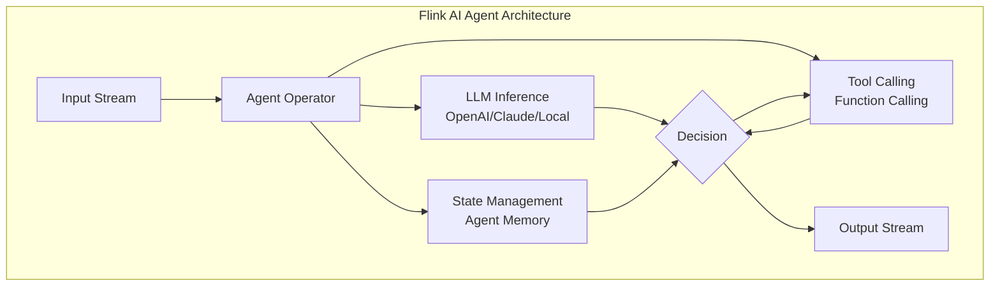
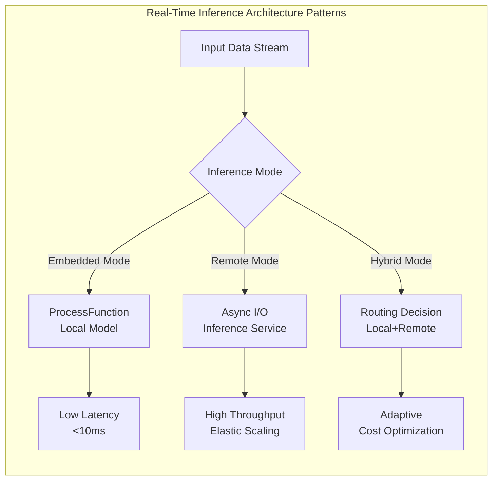
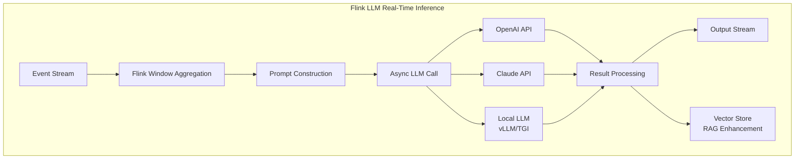
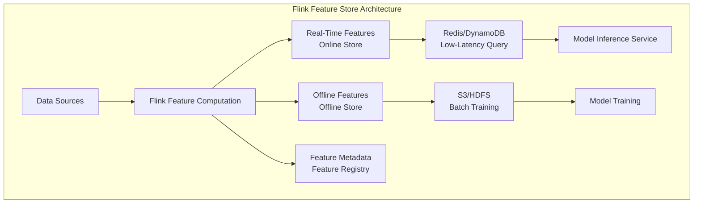
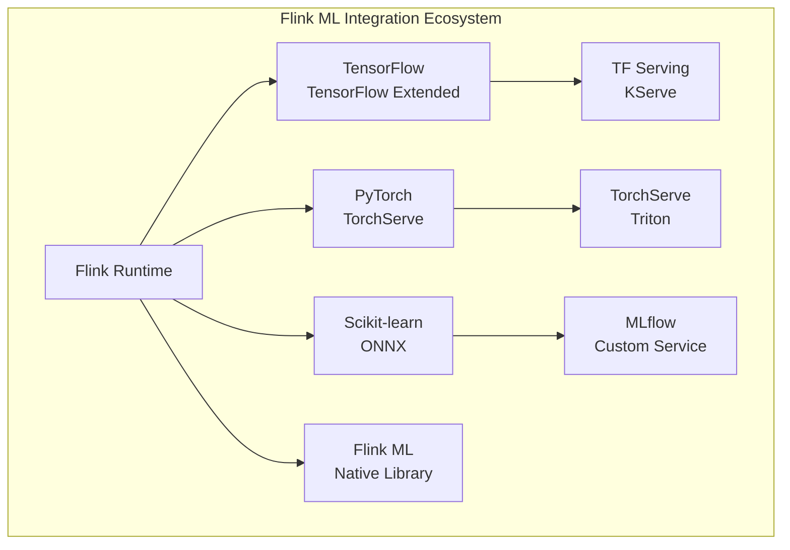
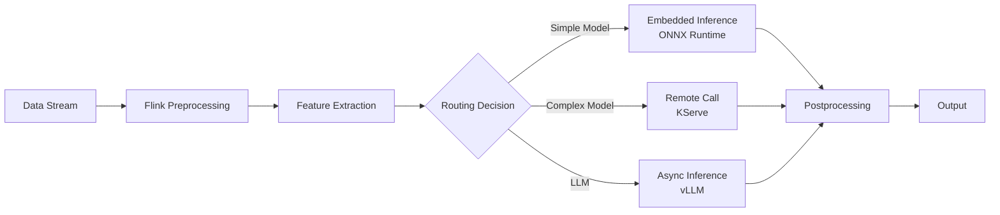
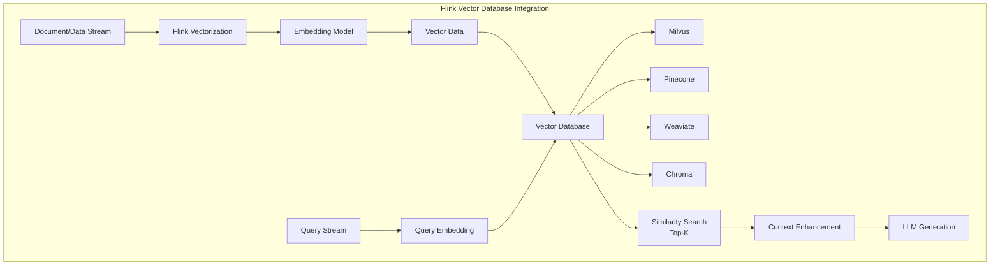
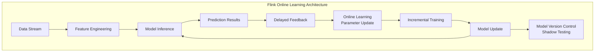
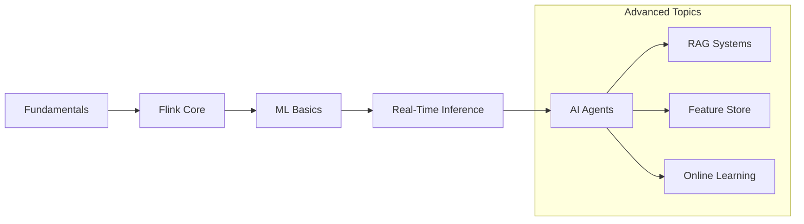
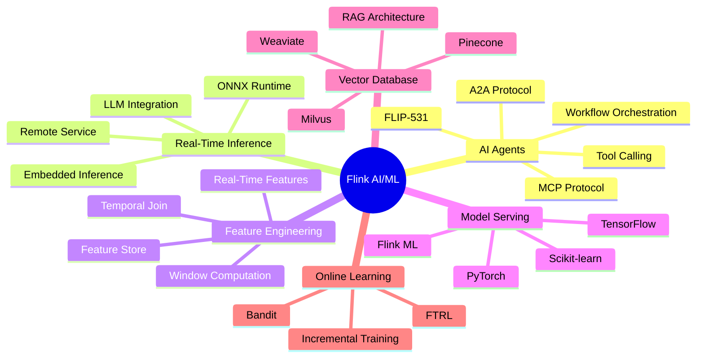

# Flink AI/ML Ecosystem Overview

> **Status**: Forward-looking | **Estimated Release**: 2026-06 | **Last Updated**: 2026-04-12
>
> ⚠️ The features described in this document are in early discussion stages and have not been officially released. Implementation details may change.

> **Stage**: Flink | **Prerequisites**: [Flink API Layer](../03-api/), [Flink Ecosystem](../05-ecosystem/) | **Formality Level**: L3

This document serves as the authoritative navigation hub for the Flink AI/ML ecosystem, comprehensively covering Flink's applications in artificial intelligence and machine learning. From FLIP-531 AI Agents to real-time inference architectures, feature engineering, integration with mainstream ML frameworks, and vector database support, this directory provides a complete technical reference for building real-time AI applications.

---

## New In-Depth Documents (2026-Q3 AI for Streaming Special)

| Document | Topic | Lines | Formal Elements |
|:---------|:------|:-----:|:---------------:|
| [llm-streaming-inference-architecture.md](./llm-streaming-inference-architecture.md) | LLM Streaming Inference Architecture | 771 | 13 |
| [streaming-rag-implementation-patterns.md](./streaming-rag-implementation-patterns.md) | Streaming RAG Implementation Patterns | 735 | 16 |
| [ai-agent-streaming-patterns.md](./ai-agent-streaming-patterns.md) | AI Agent Streaming Patterns | 987 | 20 |
| [vector-db-streaming-integration-guide.md](./vector-db-streaming-integration-guide.md) | Vector Database Streaming Integration | 327 | 10 |
| [realtime-feature-engineering-guide.md](./realtime-feature-engineering-guide.md) | Real-Time Feature Engineering Guide | 294 | 13 |
| [flink-22-data-ai-platform.md](./flink-22-data-ai-platform.md) | Flink 2.2 Data+AI Platform: ML_PREDICT/VECTOR_SEARCH/LLM Connectors | 1501 | 52 |
| [streaming-ml-libraries-landscape.md](./streaming-ml-libraries-landscape.md) | Streaming ML Libraries Landscape: River/Vowpal Wabbit/Online Learning | 2555 | 35 |
| [model-serving-frameworks-integration.md](./model-serving-frameworks-integration.md) | Model Serving Frameworks Integration: KServe/Seldon/BentoML/Triton/Ray Serve | 2648 | 32 |
| [ai-agent-frameworks-ecosystem-2025.md](./ai-agent-frameworks-ecosystem-2025.md) | AI Agent Frameworks Ecosystem 2025: Confluent/LangGraph/AutoGen/CrewAI | 1233 | 24 |

## Directory Structure Navigation

```
06-ai-ml/
├── README.md                          # This file - AI/ML Ecosystem Overview
├── flink-ai-agents-flip-531.md        # FLIP-531 AI Agents Core
├── flink-agents-architecture-deep-dive.md
├── flink-agents-patterns-catalog.md
├── flink-agents-production-checklist.md
├── flink-agents-a2a-protocol.md       # Google A2A Protocol Integration
├── flink-agents-mcp-integration.md    # MCP Protocol Integration
├── flink-llm-realtime-rag-architecture.md
├── flink-realtime-ml-inference.md
├── flink-ml-architecture.md
├── realtime-feature-engineering-feature-store.md
├── vector-database-integration.md
├── ai-ml/evolution/                   # AI/ML Evolution Topics
│   ├── ai-agent-24.md
│   ├── ai-agent-25.md
│   ├── ai-agent-30.md
│   ├── feature-store.md
│   ├── llm-integration.md
│   ├── mcp-protocol.md
│   └── vector-search.md
└── ...
```

---

## 1. Definitions

### Def-F-06-01: Flink AI/ML Ecosystem Boundary

The Flink AI/ML ecosystem defines the **set of integration capabilities** between the stream processing engine and artificial intelligence workflows:

```
┌─────────────────────────────────────────────────────────────────┐
│                 Flink AI/ML Ecosystem Architecture              │
├─────────────────────────────────────────────────────────────────┤
│                                                                 │
│  ┌─────────────────────────────────────────────────────────┐   │
│  │                    AI Agents Layer                       │   │
│  │    (FLIP-531: Agent Workflow Orchestration,             │   │
│  │     Inference, Tool Calling)                            │   │
│  └─────────────────────────────────────────────────────────┘   │
│                              │                                  │
│  ┌───────────────────────────┼─────────────────────────────┐   │
│  │                           ▼                             │   │
│  │  ┌─────────────┐  ┌─────────────┐  ┌─────────────────┐  │   │
│  │  │ Real-Time   │  │ Feature     │  │ Online          │  │   │
│  │  │ Inference   │  │ Engineering │  │ Learning        │  │   │
│  │  └──────┬──────┘  └──────┬──────┘  └────────┬────────┘  │   │
│  │         │                │                  │           │   │
│  │         └────────────────┼──────────────────┘           │   │
│  │                          ▼                              │   │
│  │              ┌─────────────────────┐                    │   │
│  │              │   ML Framework      │                    │   │
│  │              │   (TensorFlow/      │                    │   │
│  │              │    PyTorch/ONNX)    │                    │   │
│  │              └─────────────────────┘                    │   │
│  │                          │                              │   │
│  │              ┌───────────┴───────────┐                  │   │
│  │              ▼                       ▼                  │   │
│  │      ┌─────────────┐       ┌─────────────────┐          │   │
│  │      │ Vector DB   │       │ Model Registry  │          │   │
│  │      │ (Milvus/    │       │ (MLflow/        │          │   │
│  │      │  Pinecone)  │       │  KServe)        │          │   │
│  │      └─────────────┘       └─────────────────┘          │   │
│  │                                                         │   │
│  └─────────────────────────────────────────────────────────┘   │
│                              │                                  │
│  ┌───────────────────────────▼─────────────────────────────┐   │
│  │                   Flink Core Runtime                     │   │
│  └─────────────────────────────────────────────────────────┘   │
│                                                                 │
└─────────────────────────────────────────────────────────────────┘
```

### Def-F-06-02: Real-Time AI Layered Architecture

| Layer | Component | Technology Representative |
|-------|-----------|---------------------------|
| **Interaction Layer** | AI Agents | FLIP-531 Agents |
| **Inference Layer** | Real-Time Inference | TensorFlow Serving, KServe |
| **Feature Layer** | Feature Engineering | Flink Feature Store |
| **Learning Layer** | Online Learning | Flink ML, River |
| **Storage Layer** | Vector Storage | Milvus, Pinecone, Weaviate |

---

## 2. FLIP-531 AI Agents

### 2.1 FLIP-531 Overview

**FLIP-531** is the formal proposal from the Flink community for **AI Agent streaming workflows**, with the goal of establishing Flink as:

> **"The preferred stream processing engine for real-time AI applications"**

**Core Design Principles**:

- **Agent as Operator**: Model AI Agents as Flink operators
- **Stream Orchestration**: Support streaming collaboration among multiple agents
- **Inference as a Service**: Integrate LLM inference capabilities
- **Tool Calling**: Support dynamic invocation of external tools/APIs

### 2.2 AI Agent Architecture



### 2.3 Core Capability Matrix

| Capability | Status | Version | Document |
|------------|--------|---------|----------|
| **Agent Workflow Engine** | ✅ GA | 2.5+ | [Agent Workflow Engine](./flink-agent-workflow-engine.md) |
| **LLM Inference Integration** | ✅ GA | 2.5+ | [LLM Real-Time Inference Guide](./flink-llm-realtime-inference-guide.md) |
| **Tool Calling Framework** | ✅ GA | 2.5+ | [Tool Calling Patterns](./flink-agents-patterns-catalog.md) |
| **A2A Protocol** | ⚠️ Experimental | 2.5+ | [A2A Protocol Integration](./flink-agents-a2a-protocol.md) |
| **MCP Protocol** | ⚠️ Experimental | 2.6+ | [MCP Integration](./flink-agents-mcp-integration.md) |

### 2.4 Core Document Index

| Document | Topic | Depth |
|----------|-------|-------|
| 📘 [FLIP-531 AI Agents](./flink-ai-agents-flip-531.md) | Proposal Details & Roadmap | ⭐⭐⭐⭐⭐ |
| 📘 [AI Agent Deep Integration](./ai-agent-flink-deep-integration.md) | Architecture Design & Implementation | ⭐⭐⭐⭐⭐ |
| 📘 [Agent Architecture Deep Dive](./flink-agents-architecture-deep-dive.md) | Runtime Architecture | ⭐⭐⭐⭐ |
| 📘 [Agent Patterns Catalog](./flink-agents-patterns-catalog.md) | Design Patterns & Best Practices | ⭐⭐⭐⭐ |
| 📘 [Production Checklist](./flink-agents-production-checklist.md) | Pre-Launch Checklist | ⭐⭐⭐ |
| 🆕 [FLIP-531 GA Guide](./flip-531-ai-agents-ga-guide.md) | Production Deployment | ⭐⭐⭐⭐ |

### 2.5 AI Agent Evolution Roadmap

The `ai-ml/evolution/` directory records the evolution of AI Agent technologies:

| Document | Version | Core Features |
|----------|---------|---------------|
| [ai-agent-24.md](./ai-ml/evolution/ai-agent-24.md) | Flink 2.4 | Agent Operator Experiment |
| [ai-agent-25.md](./ai-ml/evolution/ai-agent-25.md) | Flink 2.5 | FLIP-531 GA, Workflow Engine |
| [ai-agent-30.md](./ai-ml/evolution/ai-agent-30.md) | Flink 3.0 | Multi-Agent Orchestration, Autonomous Agents |

---

## 3. Real-Time Inference Architecture

### 3.1 Inference Architecture Patterns

Flink supports multiple real-time inference architecture patterns to accommodate different latency and throughput requirements:



### 3.2 Inference Pattern Comparison

| Mode | Latency | Throughput | Model Complexity | Applicable Scenarios |
|------|---------|------------|------------------|----------------------|
| **Embedded Mode** | <10ms | Medium | Lightweight (ONNX) | Real-time risk control, recommendations |
| **Remote Mode** | 50-200ms | High | Arbitrary | LLM inference, complex models |
| **Batch Inference Mode** | Medium | Extremely High | Medium to Complex | Batch feature generation |
| **Edge Mode** | <5ms | Low | Micro models | IoT edge computing |

### 3.3 LLM Integration Solutions

**Flink + LLM Integration Architecture**:



**Core Documents**:

- 📘 [Flink LLM Real-Time Inference Guide](./flink-llm-realtime-inference-guide.md)
- 📘 [Flink LLM Integration Architecture](./flink-llm-integration.md)
- 📘 [RAG Streaming Architecture](./rag-streaming-architecture.md)
- 📘 [Real-Time RAG Architecture](./flink-llm-realtime-rag-architecture.md)

---

## 4. Feature Engineering & Feature Store

### 4.1 Streaming Feature Engineering

Feature engineering is a critical step in the ML pipeline, and Flink provides real-time feature computation capabilities:

| Feature Type | Computation Mode | Flink Capability |
|--------------|------------------|------------------|
| **Raw Features** | Simple Transformation | Map/FlatMap |
| **Aggregate Features** | Window Computation | Window Aggregate |
| **Temporal Features** | Sliding Window | Sliding Window |
| **Join Features** | Stream-Stream/Stream-Table Join | Temporal Join |
| **Derived Features** | UDF Computation | Python/Java UDF |

### 4.2 Feature Store Integration

**Real-Time Feature Store Architecture**:



**Core Documents**:

- 📘 [Real-Time Feature Engineering & Feature Store](./realtime-feature-engineering-feature-store.md)
- 🔗 [Feature Store Evolution](./ai-ml/evolution/feature-store.md)

### 4.3 Feature Engineering Best Practices

```python
# PyFlink feature engineering example
from pyflink.table import StreamTableEnvironment
from pyflink.table.window import Tumble

t_env = StreamTableEnvironment.create(...)

# Real-time feature computation: user behavior stats in the last hour
feature_sql = """
CREATE VIEW user_features AS
SELECT
    user_id,
    TUMBLE_START(event_time, INTERVAL '1' HOUR) as window_start,
    COUNT(*) as event_count,
    SUM(amount) as total_amount,
    COLLECT_SET(category) as categories
FROM user_events
GROUP BY
    user_id,
    TUMBLE(event_time, INTERVAL '1' HOUR)
"""
```

---

## 5. Integration with Mainstream ML Frameworks

### 5.1 Integration Architecture

Flink's integration approaches with mainstream ML frameworks:



### 5.2 Framework Integration Matrix

| Framework | Integration Method | Deployment Mode | Latency | Document |
|-----------|--------------------|-----------------|---------|----------|
| **TensorFlow** | SavedModel + TF Serving | Remote Call | Medium | [TF Integration](./flink-ml-architecture.md) |
| **PyTorch** | TorchScript + TorchServe | Remote/Embedded | Medium | [PyTorch Integration](./flink-ml-architecture.md) |
| **Scikit-learn** | ONNX Export | Embedded | Low | [ONNX Integration](./flink-ml-architecture.md) |
| **Flink ML** | Native API | Embedded | Extremely Low | [Flink ML](./flink-ml-architecture.md) |
| **Hugging Face** | Transformers + vLLM | Remote | High | [LLM Integration](./flink-llm-integration.md) |

### 5.3 Model Serving Architecture

**Model-as-a-Service (MaaS) Integration**:



**Core Documents**:

- 📘 [Flink ML Architecture](./flink-ml-architecture.md)
- 📘 [Real-Time ML Inference](./flink-realtime-ml-inference.md)
- 📘 [Model Serving Streaming](./model-serving-streaming.md)

---

## 6. Vector Database Integration

### 6.1 Vector Retrieval Architecture

Vector databases are the infrastructure for RAG (Retrieval-Augmented Generation) and semantic search:



### 6.2 Vector Database Comparison

| Database | Deployment Mode | Key Features | Flink Integration Method |
|----------|-----------------|--------------|--------------------------|
| **Milvus** | Self-hosted/Cloud | Distributed, GPU Acceleration | REST/gRPC Client |
| **Pinecone** | Fully Managed | Serverless, Auto-scaling | REST API |
| **Weaviate** | Self-hosted/Cloud | GraphQL Interface, Modular | GraphQL Client |
| **Chroma** | Embedded | Lightweight, Easy-to-use | Local Embedding |
| **pgvector** | PostgreSQL Extension | SQL Interface, Transactions | JDBC |

### 6.3 Core Documents

- 📘 [Vector Database Integration Guide](./vector-database-integration.md)
- 📘 [SQL Vector Search](./../03-api/03.02-table-sql-api/vector-search.md)
- 📘 [Vector Search & RAG](./../03-api/03.02-table-sql-api/flink-vector-search-rag.md)

---

## 7. Online Learning

### 7.1 Online Learning Architecture

Online learning allows models to be continuously updated on streaming data:



### 7.2 Online Learning Algorithms

| Algorithm Type | Applicable Scenarios | Flink Implementation |
|----------------|----------------------|----------------------|
| **Online Gradient Descent** | Linear Models, Neural Networks | Custom ProcessFunction |
| **FTRL** | Large-Scale Sparse Features | Flink ML |
| **Bandit Algorithms** | Recommendation Systems, A/B Testing | Custom Implementation |
| **Incremental Clustering** | User Segmentation, Anomaly Detection | River + Flink |

**Core Documents**:

- 📘 [Online Learning Algorithms](./online-learning-algorithms.md)
- 📘 [Online Learning in Production](./online-learning-production.md)

---

## 8. Open Protocols & Standards

### 8.1 A2A Protocol (Agent-to-Agent)

**Google A2A Protocol** is an open standard for inter-agent communication:

| Feature | Support Status | Document |
|---------|----------------|----------|
| Agent Discovery | ✅ Supported | [A2A Protocol Integration](./flink-agents-a2a-protocol.md) |
| Task Negotiation | ✅ Supported | [Flink Agents A2A](./flink-agents-a2a-protocol.md) |
| Secure Communication | ⚠️ Partial | In Development |

### 8.2 MCP Protocol (Model Context Protocol)

**Anthropic MCP Protocol** is a model context interaction standard:

| Feature | Support Status | Document |
|---------|----------------|----------|
| Tool Calling | ✅ Supported | [MCP Integration](./flink-mcp-protocol-integration.md) |
| Resource Access | ✅ Supported | [Agent MCP Integration](./flink-agents-mcp-integration.md) |
| Prompt Templates | ⚠️ Partial | In Development |

---

## 9. Quick Navigation & Selection Guide

### 9.1 Scenario-Based Navigation

| Application Scenario | Recommended Tech Stack | Key Documents |
|----------------------|------------------------|---------------|
| **Real-Time Intelligent Customer Service** | Flink + LLM + RAG | [RAG Architecture](./flink-llm-realtime-rag-architecture.md) |
| **Real-Time Recommendation System** | Flink + Feature Store + TF Serving | [Feature Engineering](./realtime-feature-engineering-feature-store.md) |
| **Real-Time Risk Control** | Flink + Embedded Inference + Rule Engine | [Real-Time Inference](./flink-realtime-ml-inference.md) |
| **Intelligent Data Analysis** | Flink + AI Agents | [FLIP-531](./flink-ai-agents-flip-531.md) |
| **Real-Time Semantic Search** | Flink + Vector Database | [Vector Integration](./vector-database-integration.md) |
| **Online Ad Bidding** | Flink + Online Learning | [Online Learning](./online-learning-algorithms.md) |

### 9.2 Learning Path



---

## 10. Visual Summary



---

## 11. Related Resources

### 11.1 Official Resources

- 🔗 [Flink ML Documentation](https://nightlies.apache.org/flink/flink-ml-docs-stable/)
- 🔗 [FLIP-531 Proposal](https://github.com/apache/flink/tree/main/flink-docs/docs/flips/)
- 🔗 [Google A2A Protocol](https://github.com/google/a2a)
- 🔗 [Anthropic MCP](https://modelcontextprotocol.io/)

### 11.2 Community Resources

- 🔗 [Flink AI Extensions Repository](https://github.com/apache/flink-ml)
- 🔗 [Ververica ML Solutions](https://archive.org/web/*/https://www.ververica.com/solutions/machine-learning)

---

## References
