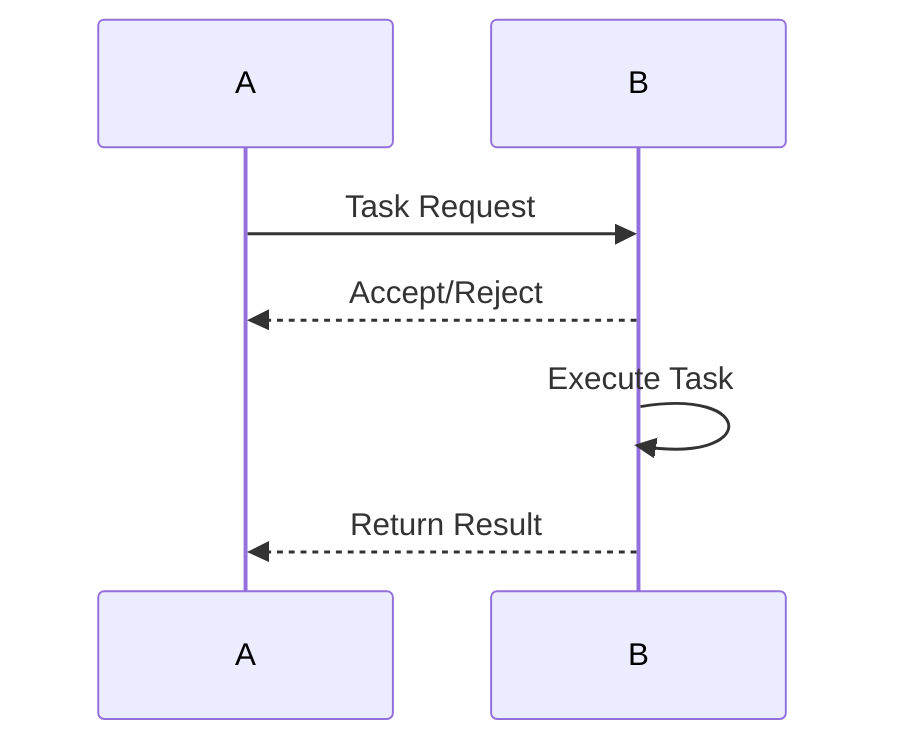

# A2A Protocol Evolution Feature Tracking

> **Stage**: Flink/ai-ml/evolution | **Prerequisites**: [A2A Protocol][^1] | **Formalization Level**: L3

## 1. Definitions

### Def-F-A2A-01: Agent-to-Agent Protocol

Agent-to-Agent protocol:
$$
\text{A2A} : \text{Agent}_1 \leftrightarrow \text{Agent}_2
$$

## 2. Properties

### Prop-F-A2A-01: Interoperability

Interoperability:
$$
\forall a_1, a_2 : \text{A2A}(a_1, a_2) = \text{Compatible}
$$

## 3. Relations

### A2A Evolution

| Version | Feature | Status |
|------|------|------|
| 2.4 | Basic Communication | GA |
| 2.5 | Task Delegation | GA |
| 3.0 | Full A2A | In Design |

## 4. Argumentation

### 4.1 A2A Capabilities

| Capability | Description |
|------|------|
| Discovery | Agent discovery |
| Tasking | Task assignment |
| Negotiation | Resource negotiation |

## 5. Formal Proof / Engineering Argument

### 5.1 A2A Message

```java
// [伪代码片段 - 不可直接运行] 仅展示核心逻辑
A2AMessage msg = A2AMessage.builder()
    .from(agent1)
    .to(agent2)
    .task(task)
    .build();
```

## 6. Examples

### 6.1 Agent Collaboration

```java
// [伪代码片段 - 不可直接运行] 仅展示核心逻辑
agent1.delegate(task, agent2);
```

## 7. Visualizations



## 8. References

[^1]: Google A2A Protocol

---

## Tracking Information

| Attribute | Value |
|------|-----|
| Version | 2.4-3.0 |
| Current Status | Evolving |
