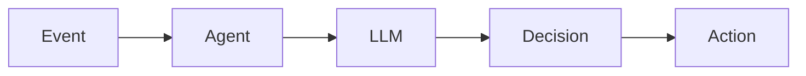

# AI Agent 2.4 Evolution Tracking

> **Status**: Forward-looking | **Estimated Release**: 2026-09 | **Last Updated**: 2026-04-12
>
> ⚠️ The features described in this document are in early discussion stages and have not been officially released. Implementation details may change.

> Stage: Flink/ai-ml/evolution | Prerequisites: [FLIP-531][^1] | Formalization Level: L3

## 1. Definitions

### Def-F-AI-24-01: AI Agent in Flink

Flink AI Agent:
$$
\text{Agent} = \langle \text{Perception}, \text{Reasoning}, \text{Action} \rangle
$$

## 2. Properties

### Prop-F-AI-24-01: State Consistency

Agent state consistency:
$$
\text{Checkpoint}(\text{AgentState})
$$

## 3. Relations

### Flink 2.4 Agent Features

| Feature | Description | Status |
|---------|-------------|--------|
| LLM Integration | OpenAI/Claude | GA |
| MCP Protocol | Tool Invocation | GA |
| State Management | Conversation Persistence | GA |

## 4. Argumentation

### 4.1 Agent Architecture

```
Input → Agent Runtime → LLM Inference → Tool Invocation → Output
```

## 5. Proof / Engineering Argument

### 5.1 Agent Implementation

```java
Agent agent = Agent.newBuilder()
    .setLLM("gpt-4")
    .addTool(new AlertTool())
    .build();
```

## 6. Examples

### 6.1 Anomaly Detection Agent

```java
stream.process(new AgentProcessFunction(agent))
    .addSink(new ActionSink());
```

## 7. Visualizations



## 8. References

[^1]: FLIP-531 AI Agents

---

## Tracking Information

| Property | Value |
|----------|-------|
| Target Version | Flink 2.4 |
| Current Status | GA |
