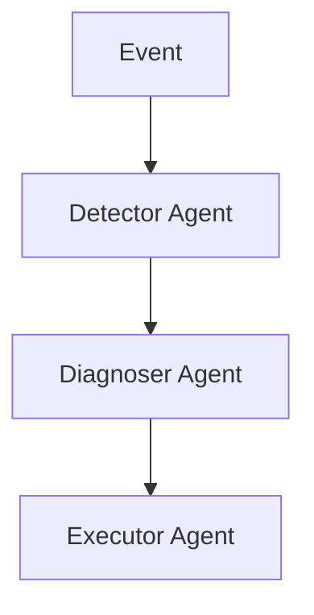

# AI Agent 2.5 Evolution Feature Tracking

> **Status**: Forward-looking | **Estimated Release**: 2026-09 | **Last Updated**: 2026-04-12
>
> ⚠️ The features described in this document are in early discussion stages and have not been officially released. Implementation details may change.

> **Stage**: Flink/ai-ml/evolution | **Prerequisites**: [AI Agent 2.4][^1] | **Formalization Level**: L3

## 1. Definitions

### Def-F-AI-25-01: Multi-Agent System

Multi-Agent system:
$$
\text{MultiAgent} = \{ \text{Agent}_1, \text{Agent}_2, ..., \text{Agent}_n \}
$$

## 2. Properties

### Prop-F-AI-25-01: Agent Coordination

Agent coordination:
$$
\text{Coordination} : \text{Agents} \to \text{GlobalGoal}
$$

## 3. Relations

### 2.5 Agent Features

| Feature | Description | Status |
|---------|-------------|--------|
| Multi-Agent | Collaborative system | GA |
| Memory Augmentation | Long-term memory | GA |
| Learning Optimization | RL fine-tuning | GA |

## 4. Argumentation

### 4.1 Multi-Agent Collaboration

| Agent Role | Responsibility |
|------------|----------------|
| Detector Agent | Anomaly discovery |
| Diagnoser Agent | Root cause analysis |
| Executor Agent | Execute remediation |

## 5. Proof / Engineering Argument

### 5.1 Agent Collaboration

```java
// [伪代码片段 - 不可直接运行] 仅展示核心逻辑
MultiAgentSystem system = MultiAgentSystem.builder()
    .addAgent("detector", detectorAgent)
    .addAgent("diagnoser", diagnoserAgent)
    .build();
```

## 6. Examples

### 6.1 Collaboration Example

```java
// [伪代码片段 - 不可直接运行] 仅展示核心逻辑
system.coordinate(event, (detector, diagnoser) -> {
    Alert alert = detector.detect(event);
    return diagnoser.diagnose(alert);
});
```

## 7. Visualizations



## 8. References

[^1]: Flink AI Agent Documentation

---

## Tracking Information

| Attribute | Value |
|-----------|-------|
| Target Version | Flink 2.5 |
| Current Status | GA |
