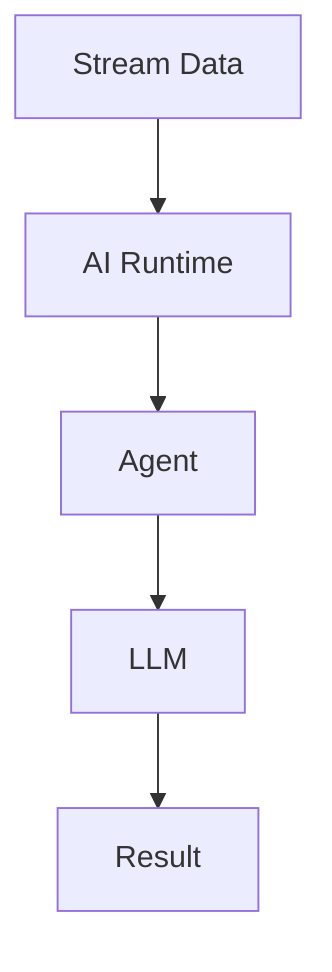

# AI Agent 3.0 Evolution Feature Tracking

> **Status**: Forward-looking | **Estimated Release**: 2027-Q1 | **Last Updated**: 2026-04-12
>
> ⚠️ The features described in this document are in early discussion stages and have not been officially released. Implementation details may change.

> **Stage**: Flink/ai-ml/evolution | **Prerequisites**: [AI Agent 2.5][^1] | **Formalization Level**: L4

## 1. Definitions

### Def-F-AI-30-01: Native AI Support

Native AI support:
$$
\text{NativeAI} = \text{FirstClassAgent} + \text{LLMRuntime} + \text{VectorStore}
$$

## 2. Properties

### Prop-F-AI-30-01: Low Latency Inference

Low-latency inference:
$$
\text{Latency} < 100ms
$$

## 3. Relations

### 3.0 Agent Features

| Feature | Description | Status |
|---------|-------------|--------|
| Native Agent | Built-in runtime | In Design |
| Streaming LLM | Incremental generation | In Design |
| Auto-Optimization | Self-adaptive Agent | In Design |

## 4. Argumentation

### 4.1 Native Agent Architecture

```
Flink Core → AI Runtime → Agent Framework → LLM Gateway
```

## 5. Proof / Engineering Argument

### 5.1 Native Agent API

```java
@Agent
public class AnomalyDetector {
    @LLM(model = "gpt-4")
    @Prompt("Detect anomaly: {data}")
    public Alert detect(String data) { }
}
```

## 6. Examples

### 6.1 Declarative Agent

```java
// [伪代码片段 - 不可直接运行] 仅展示核心逻辑
stream.processWithAgent(AnomalyDetector.class)
    .toSink(AlertSink.class);
```

## 7. Visualizations



## 8. References

[^1]: Flink AI Native Documentation

---

## Tracking Information

| Attribute | Value |
|-----------|-------|
| Target Version | Flink 3.0 |
| Current Status | In Design |
