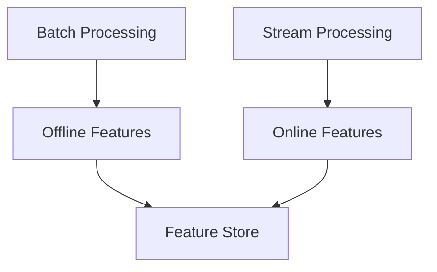

# Feature Store Integration Evolution Feature Tracking

> Stage: Flink/ai-ml/evolution | Prerequisites: [Feature Store][^1] | Formalization Level: L3

## 1. Concept Definitions (Definitions)

### Def-F-FS-01: Feature Store

Feature store:
$$
\text{FeatureStore} = \text{OfflineStore} + \text{OnlineStore}
$$

## 2. Property Derivation (Properties)

### Prop-F-FS-01: Feature Consistency

Feature consistency:
$$
\text{Offline} = \text{Online}
$$

## 3. Relation Establishment (Relations)

### Feature Store Evolution

| Version | Feature | Status |
|------|------|------|
| 2.4 | Tecton Integration | GA |
| 2.5 | Feast Integration | GA |
| 3.0 | Built-in Feature Store | In Design |

## 4. Argumentation (Argumentation)

### 4.1 Feature Types

| Type | Timeliness | Storage |
|------|--------|------|
| Offline | Batch | Data Lake |
| Online | Real-time | Redis |

## 5. Formal Proof / Engineering Argument

### 5.1 Feature Retrieval

```java
FeatureVector fv = featureStore.getOnlineFeatures(entityId, features);
```

## 6. Examples (Examples)

### 6.1 Streaming Features

```java
stream.map(event -> {
    return enrich(event, featureStore);
});
```

## 7. Visualizations (Visualizations)



## 8. References (References)

[^1]: Feature Store Documentation

---

## Tracking Information

| Property | Value |
|------|-----|
| Version | 2.4-3.0 |
| Current Status | Evolving |
