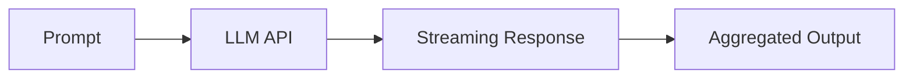

# LLM Integration Evolution Feature Tracking

> Stage: Flink/ai-ml/evolution | Prerequisites: [LLM Integration][^1] | Formalization Level: L3

## 1. Concept Definitions (Definitions)

### Def-F-LLM-01: LLM Inference

LLM inference:
$$
\text{LLM} : \text{Prompt} \to \text{Completion}
$$

### Def-F-LLM-02: Streaming Tokens

Streaming tokens:
$$
\text{Stream} : \text{Token}_1, \text{Token}_2, ...
$$

## 2. Property Derivation (Properties)

### Prop-F-LLM-01: Token Throughput

Token throughput:
$$
\text{Tokens/sec} > 1000
$$

## 3. Relation Establishment (Relations)

### LLM Integration Evolution

| Version | Feature | Status |
|------|------|------|
| 2.4 | API Call | GA |
| 2.5 | Streaming Generation | GA |
| 3.0 | Local Inference | In Design |

## 4. Argumentation (Argumentation)

### 4.1 Supported Models

| Model | Provider | Status |
|------|--------|------|
| GPT-4 | OpenAI | Integrated |
| Claude | Anthropic | Integrated |
| Llama | Meta | Local |

## 5. Formal Proof / Engineering Argument

### 5.1 Streaming LLM

```java
// [伪代码片段 - 不可直接运行] 仅展示核心逻辑
llmClient.completeStream(prompt, token -> {
    output.collect(token);
});
```

## 6. Examples (Examples)

### 6.1 Batch Prompts

```java
// [伪代码片段 - 不可直接运行] 仅展示核心逻辑
stream.map(new LLMMapFunction("gpt-4", promptTemplate));
```

## 7. Visualizations (Visualizations)



## 8. References (References)

[^1]: LLM Integration Documentation

---

## Tracking Information

| Property | Value |
|------|-----|
| Version | 2.4-3.0 |
| Current Status | Evolving |
