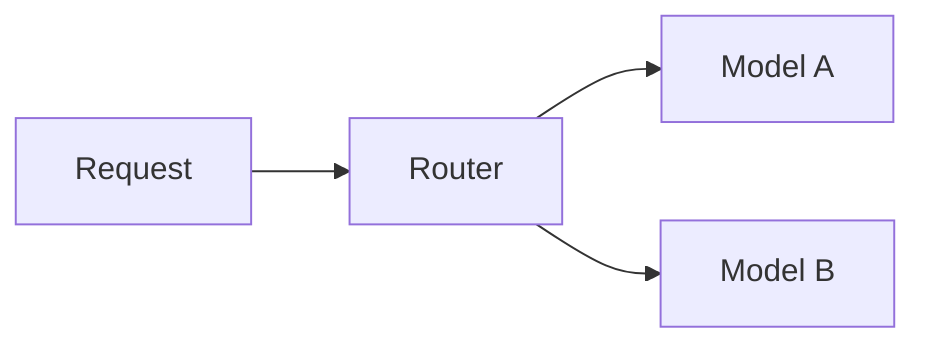

# Model Serving Integration Evolution Feature Tracking

> Stage: Flink/ai-ml/evolution | Prerequisites: [Model Serving][^1] | Formalization Level: L3

## 1. Concept Definitions (Definitions)

### Def-F-Serving-01: Model Serving

Model serving:
$$
\text{Serving} : \text{Model} \times \text{Version} \to \text{Endpoint}
$$

## 2. Property Derivation (Properties)

### Prop-F-Serving-01: A/B Testing

A/B testing:
$$
\text{Traffic} = \alpha \cdot \text{Model}_A + (1-\alpha) \cdot \text{Model}_B
$$

## 3. Relation Establishment (Relations)

### Model Serving Evolution

| Version | Feature | Status |
|------|------|------|
| 2.4 | Local Model | GA |
| 2.5 | Model Registry | GA |
| 3.0 | Full MLOps | In Design |

## 4. Argumentation (Argumentation)

### 4.1 Serving Architecture

```
Flink → Model Registry → Model Server → Inference
```

## 5. Formal Proof / Engineering Argument

### 5.1 Model Routing

```java
// [伪代码片段 - 不可直接运行] 仅展示核心逻辑
ModelRouter router = new ModelRouter()
    .addModel("v1", model1, 0.5)
    .addModel("v2", model2, 0.5);
```

## 6. Examples (Examples)

### 6.1 Dynamic Loading

```java
// [伪代码片段 - 不可直接运行] 仅展示核心逻辑
ModelVersion version = registry.getLatest("fraud-detection");
Model model = loader.load(version);
```

## 7. Visualizations (Visualizations)



## 8. References (References)

[^1]: Model Serving Documentation

---

## Tracking Information

| Property | Value |
|------|-----|
| Version | 2.4-3.0 |
| Current Status | Evolving |
