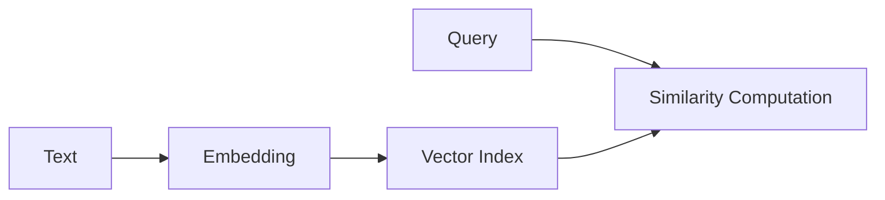

# Vector Search Evolution Tracking

> Stage: Flink/ai-ml/evolution | Prerequisites: [Vector Search][^1] | Formalization Level: L3

## 1. Definitions

### Def-F-Vector-01: Vector Embedding

Vector embedding:
$$
\text{Embedding} : \text{Text} \to \mathbb{R}^n
$$

### Def-F-Vector-02: Similarity Search

Similarity search:
$$
\text{Search} : \text{Query} \times \text{Corpus} \to \text{TopK}
$$

## 2. Properties

### Prop-F-Vector-01: Search Latency

Search latency:
$$
T_{\text{search}} < 10ms
$$

## 3. Relations

### Vector Search Evolution

| Version | Feature | Status |
|---------|---------|--------|
| 2.4 | External Integration | GA |
| 2.5 | Milvus Connector | GA |
| 3.0 | Built-in Vector Index | In Design |

## 4. Argumentation

### 4.1 Vector Databases

| Database | Type | Status |
|----------|------|--------|
| Milvus | Dedicated | Integrated |
| Pinecone | Managed | Integrated |
| PGVector | Extension | Integrated |

## 5. Proof / Engineering Argument

### 5.1 Vector Index

```java
VectorIndex index = new HNSWIndex.Builder()
    .withDimension(768)
    .withM(16)
    .build();
```

## 6. Examples

### 6.1 Vector Query

```java
List<Vector> results = index.search(queryVector, 10);
```

## 7. Visualizations



## 8. References

[^1]: Vector Search Documentation

---

## Tracking Information

| Property | Value |
|----------|-------|
| Version | 2.4-3.0 |
| Current Status | Evolving |
