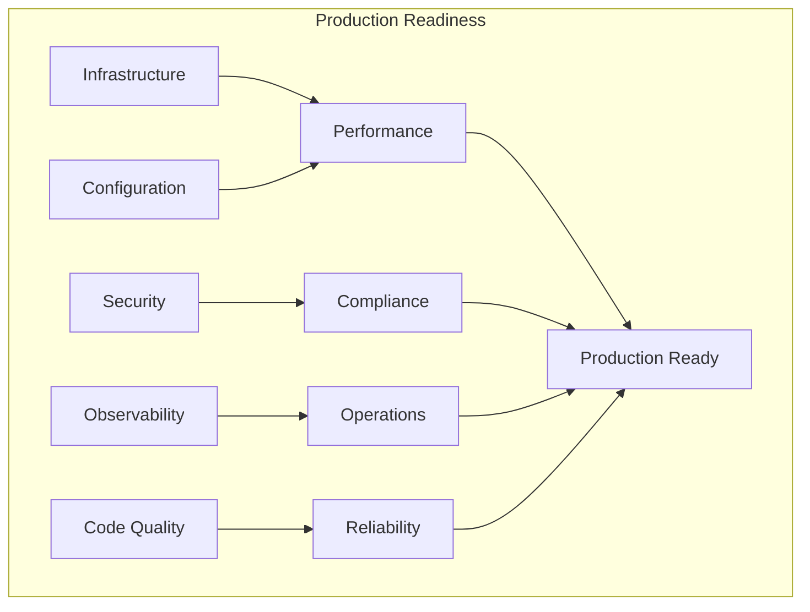
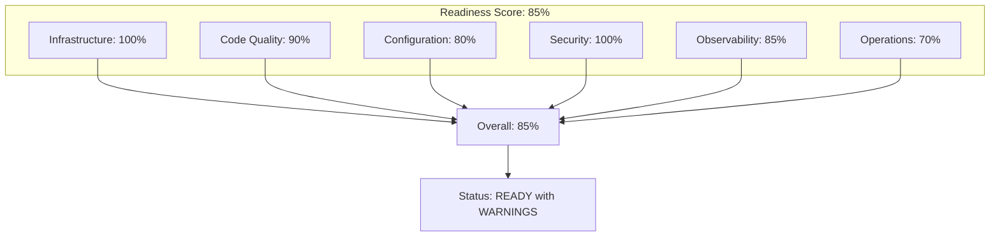
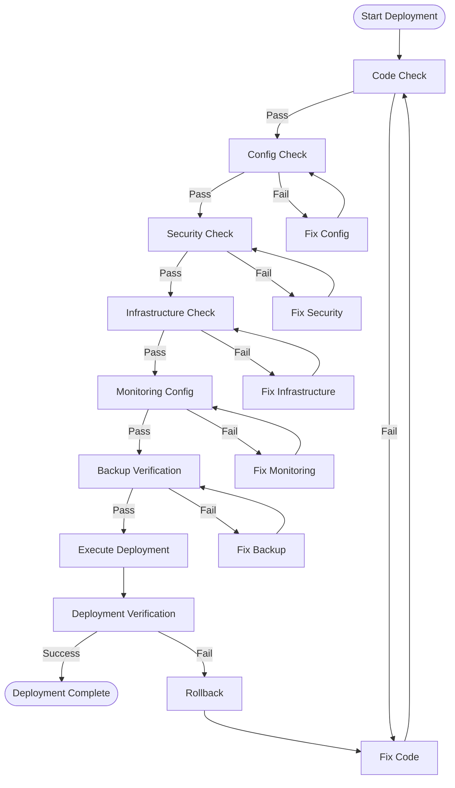

> **Status**: 🔮 Forward-looking Content | **Risk Level**: High | **Last Updated**: 2026-04
>
> The content described in this document is in early planning stages and may not match the final implementation. Please refer to official Apache Flink releases for authoritative information.
>
# Flink Agents Production Readiness Checklist

> **Stage**: Flink/06-ai-ml | **Prerequisites**: [Flink Agents Architecture Deep Dive](./flink-agents-architecture-deep-dive.md), [Flink Agents Design Patterns](./flink-agents-patterns-catalog.md) | **Formality Level**: L4 (Engineering Practice)

---

## 1. Definitions

### Def-P2-08: Production Readiness

**Production Readiness** is defined as the degree to which a system satisfies the following conditions:

$$
\mathcal{R}_{prod} = \langle \mathcal{R}_{reliability}, \mathcal{R}_{performance}, \mathcal{R}_{security}, \mathcal{R}_{observability}, \mathcal{R}_{maintainability} \rangle
$$

Where each dimension $\mathcal{R}_i \in [0, 1]$, and the overall system readiness is:

$$
\text{Readiness} = \prod_{i} \mathcal{R}_i
$$

### Def-P2-09: Checklist Item

A checklist item is defined as:

$$
\mathcal{I}_{check} = \langle \text{category}, \text{description}, \text{criteria}, \text{severity}, \text{verification} \rangle
$$

| Attribute | Description | Values |
|-----------|-------------|--------|
| category | Check category | {Infrastructure, Code, Config, Security, Operations} |
| description | Check description | Text description |
| criteria | Pass criteria | Verifiable conditions |
| severity | Severity level | {P0-Critical, P1-High, P2-Medium, P3-Low} |
| verification | Verification method | {Manual, Automated, Review} |

---

## 2. Properties

### Prop-P2-03: Checklist Completeness

**Proposition**: A complete production checklist covers all critical paths of the system:

$$
\forall p \in \text{CriticalPaths}: \exists i \in \text{Checklist}: \text{covers}(i, p)
$$

### Prop-P2-04: Checklist Effectiveness

**Proposition**: Strictly enforcing the checklist reduces production failure rates:

$$
P(\text{Failure}|\text{ChecklistPassed}) < P(\text{Failure}|\text{NoChecklist})
$$

---

## 3. Relations

### 3.1 Checklist Categories Relationship



### 3.2 Checklist vs Development Phase

| Phase | Checklist Focus | Key Items |
|-------|-----------------|-----------|
| Development | Code Quality | Linting, Testing, Documentation |
| Staging | Integration | End-to-end, Load Testing |
| Pre-Prod | Configuration | Security, Resources, Backups |
| Production | Operations | Monitoring, Alerting, Runbooks |

---

## 4. Argumentation

### 4.1 Why Production Checklists Matter

**Observation**: Agent systems in production face unique challenges:

1. **LLM Uncertainty**: Non-deterministic outputs require guardrails
2. **State Complexity**: Multi-tier memory requires persistence
3. **Tool Security**: External tool calls carry risks
4. **Cost Sensitivity**: Token consumption needs control

**Argument**: A systematic checklist is a necessary safeguard for production stability.

### 4.2 Checklist Anti-Patterns

| Anti-Pattern | Problem | Solution |
|-------------|---------|----------|
| Checklist Theater | Mechanical execution without understanding | Training + explaining each item |
| Outdated Checklist | Does not evolve with the system | Regular review and updates |
| Incomplete Coverage | Missing critical paths | Incident-driven supplementation |
| No Verification | Fake tick boxes | Automated validation + audit |

---

## 5. Proof / Engineering Argument

### Thm-P2-06: Production Safety

**Theorem**: A system that passes the complete checklist satisfies production safety requirements:

$$
\text{ChecklistPassed}(\mathcal{S}) \Rightarrow \text{SafeForProduction}(\mathcal{S})
$$

**Proof Sketch**:

1. **Completeness**: The checklist covers all known risk points
2. **Verifiability**: Each check has clear pass criteria
3. **Traceability**: Check results are auditable
4. **Iterativity**: Newly discovered issues are added to the checklist

---

## 6. Examples

---

## Production Readiness Checklist

### 6.1 Infrastructure Checks

| # | Check Item | Check Content | Pass Criteria | Severity | Verification |
|---|------------|---------------|---------------|----------|--------------|
| I-01 | Flink Cluster Version | Use a supported Flink version | ≥ 1.18 | P0 | Automated |
| I-02 | JVM Config | Heap memory, GC policy config | G1GC, heap ≤ container limit | P0 | Automated |
| I-03 | State Backend | RocksDB/ForSt configuration | Incremental Checkpoint enabled | P0 | Automated |
| I-04 | Checkpoint Config | Checkpoint interval, timeout | Interval ≤ 60s, timeout ≤ 10min | P0 | Automated |
| I-05 | High Availability | JobManager HA | At least 2 JMs | P0 | Manual |
| I-06 | Resource Reservation | TaskManager resources | CPU/memory reservation ≥ 20% | P1 | Automated |
| I-07 | Network Config | Buffer, timeout settings | Network memory ≥ 15% | P1 | Automated |
| I-08 | Disk Config | Checkpoint/Savepoint directories | Dedicated disk, sufficient capacity | P1 | Manual |
| I-09 | Secure Communication | TLS/mTLS config | Inter-cluster communication encrypted | P0 | Automated |
| I-10 | Network Isolation | Namespace/security groups | Access control on demand | P1 | Manual |

**Configuration Template**:

```yaml
# infrastructure-config.yaml
flink:
  version: "1.20.0"

  jobmanager:
    memory:
      process:
        size: 4096m
    high-availability: zookeeper
    high-availability.zookeeper.quorum: zk-1:2181,zk-2:2181,zk-3:2181

  taskmanager:
    memory:
      process:
        size: 8192m
      managed:
        fraction: 0.4
    numberOfTaskSlots: 4

  state:
    backend: rocksdb
    checkpoint-storage: filesystem
    checkpoints:
      dir: hdfs:///flink/checkpoints
    savepoints:
      dir: hdfs:///flink/savepoints

  execution:
    checkpointing:
      interval: 30s
      min-pause-between-checkpoints: 10s
      timeout: 10min
      max-concurrent-checkpoints: 1
      unaligned: true
      incremental: true

  security:
    ssl:
      enabled: true
      truststore: /etc/flink/ssl/truststore.jks
      keystore: /etc/flink/ssl/keystore.jks
```

---

### 6.2 Agent Code Checks

| # | Check Item | Check Content | Pass Criteria | Severity | Verification |
|---|------------|---------------|---------------|----------|--------------|
| C-01 | Error Handling | Exception catching and handling | All exceptions caught and logged | P0 | Automated |
| C-02 | Resource Management | Connections, streams properly closed | try-with-resources | P0 | Automated |
| C-03 | State Access | State thread safety | Access only through KeyedContext | P0 | Automated |
| C-04 | Serialization | State classes serializable | Implement Serializable/Kryo | P0 | Automated |
| C-05 | Logging Standards | Log level, format | Structured logs, no sensitive info | P1 | Automated |
| C-06 | Metrics | Key metrics exposed | Latency, throughput, error rate | P1 | Automated |
| C-07 | Timeout Settings | External call timeouts | All blocking calls have timeouts | P0 | Automated |
| C-08 | Retry Logic | Failure retry policy | Exponential backoff, max retry limit | P1 | Code Review |
| C-09 | Input Validation | Parameter validation | All inputs validated | P0 | Automated |
| C-10 | Sensitive Data Handling | PII handling | Masking/encrypted storage | P0 | Code Review |

**Code Checklist Example (Java)**:

```java
// ✅ Correct: comprehensive error handling and resource management

import org.apache.flink.api.common.state.ValueState;
import org.apache.flink.api.common.state.ValueStateDescriptor;

public class ProductionReadyAgent extends KeyedProcessFunction<String, Event, Result> {

    private static final Logger LOG = LoggerFactory.getLogger(ProductionReadyAgent.class);
    private static final Duration TIMEOUT = Duration.ofSeconds(30);
    private static final int MAX_RETRIES = 3;

    private transient ValueState<AgentState> state;
    private transient LLMClient llmClient;

    @Override
    public void open(Configuration parameters) {
        // State declaration
        StateTtlConfig ttlConfig = StateTtlConfig.newBuilder(Duration.ofHours(24))
            .setUpdateType(OnCreateAndWrite)
            .setStateVisibility(NeverReturnExpired)
            .cleanupIncrementally(10, true)
            .build();

        ValueStateDescriptor<AgentState> descriptor =
            new ValueStateDescriptor<>("agent-state", AgentState.class);
        descriptor.enableTimeToLive(ttlConfig);
        state = getRuntimeContext().getState(descriptor);

        // Client initialization
        llmClient = LLMClient.builder()
            .withTimeout(TIMEOUT)
            .withRetryPolicy(RetryPolicy.exponentialBackoff(MAX_RETRIES))
            .build();
    }

    @Override
    public void processElement(Event event, Context ctx, Collector<Result> out) {
        try {
            // Input validation
            if (!isValid(event)) {
                LOG.warn("Invalid event received: {}", event.getId());
                metrics.counter("events.invalid").inc();
                return;
            }

            // Processing logic
            AgentState currentState = state.value();
            if (currentState == null) {
                currentState = new AgentState(event.getAgentId());
            }

            // External call with timeout
            Result result = processWithTimeout(event, currentState);

            // Update state
            currentState.update(result);
            state.update(currentState);

            // Output result
            out.collect(result);

            // Record metrics
            metrics.histogram("processing.latency").update(
                System.currentTimeMillis() - ctx.timestamp()
            );

        } catch (ValidationException e) {
            LOG.error("Validation failed for event {}", event.getId(), e);
            metrics.counter("errors.validation").inc();
            // Send to dead letter queue
            ctx.output(DEAD_LETTER_TAG, new DeadLetter(event, e));

        } catch (LLMException e) {
            LOG.error("LLM call failed for event {}", event.getId(), e);
            metrics.counter("errors.llm").inc();
            // Limited retry
            if (shouldRetry(event)) {
                retryLater(event, ctx);
            } else {
                ctx.output(DEAD_LETTER_TAG, new DeadLetter(event, e));
            }

        } catch (Exception e) {
            LOG.error("Unexpected error processing event {}", event.getId(), e);
            metrics.counter("errors.unexpected").inc();
            throw e; // Let Flink decide handling strategy
        }
    }

    private boolean isValid(Event event) {
        return event != null
            && event.getId() != null
            && event.getAgentId() != null
            && event.getPayload() != null
            && event.getPayload().length() < MAX_PAYLOAD_SIZE;
    }

    private Result processWithTimeout(Event event, AgentState state)
        throws TimeoutException {
        return CompletableFuture.supplyAsync(() -> process(event, state))
            .orTimeout(TIMEOUT.getSeconds(), TimeUnit.SECONDS)
            .join();
    }
}
```

---

### 6.3 LLM & Agent Configuration Checks

| # | Check Item | Check Content | Pass Criteria | Severity | Verification |
|---|------------|---------------|---------------|----------|--------------|
| L-01 | Model Config | LLM model selection | Production-grade model, fixed version | P0 | Manual |
| L-02 | Token Limit | Context window setting | Within model limits | P0 | Automated |
| L-03 | Temperature | Temperature setting | Matched to task type | P1 | Manual |
| L-04 | Retry Policy | API failure retry | Exponential backoff, max delay | P0 | Automated |
| L-05 | Connection Pool | HTTP connection pool | Connection reuse, reasonable pool size | P1 | Automated |
| L-06 | Timeout Config | API call timeout | Set according to SLA | P0 | Automated |
| L-07 | Cost Monitoring | Token consumption tracking | Statistics by Agent/task | P1 | Automated |
| L-08 | Cache Config | Response caching | Cache similar queries | P2 | Manual |
| L-09 | Guardrails Config | Input/output filtering | Harmful content detection | P0 | Automated |
| L-10 | Fallback Strategy | Model failure fallback | Backup model/degradation policy | P0 | Manual |

**LLM Configuration Template**:

```yaml
# llm-production-config.yaml
llm:
  # Primary model configuration
  primary:
    provider: openai
    model: gpt-4-turbo-preview
    api_key: ${OPENAI_API_KEY}  # Read from environment variable

    # Generation parameters
    temperature: 0.7
    max_tokens: 4096
    top_p: 1.0
    frequency_penalty: 0.0
    presence_penalty: 0.0

    # Connection configuration
    base_url: https://api.openai.com/v1
    timeout: 30s
    connect_timeout: 10s

    # Retry configuration
    retry:
      max_attempts: 3
      backoff_strategy: exponential
      initial_delay: 1s
      max_delay: 30s

    # Connection pool
    connection_pool:
      max_total: 50
      max_per_route: 20

  # Fallback model
  fallback:
    provider: anthropic
    model: claude-3-opus-20240229
    api_key: ${ANTHROPIC_API_KEY}

    # Simplified parameter config
    temperature: 0.7
    max_tokens: 4096
    timeout: 60s

  # Cost monitoring
  cost_tracking:
    enabled: true
    metrics_enabled: true
    alert_threshold_usd: 1000  # Daily budget alert

  # Cache configuration
  cache:
    enabled: true
    type: redis
    redis:
      host: ${REDIS_HOST}
      port: 6379
      ttl: 3600  # 1 hour
    similarity_threshold: 0.95

  # Guardrails configuration
  guardrails:
    input:
      toxicity_detection: true
      prompt_injection_detection: true
      max_input_tokens: 8000

    output:
      toxicity_detection: true
      pii_detection: true
      max_output_tokens: 4096

    rate_limiting:
      requests_per_minute: 100
      tokens_per_minute: 100000
```

---

### 6.4 MCP Tool Integration Checks

| # | Check Item | Check Content | Pass Criteria | Severity | Verification |
|---|------------|---------------|---------------|----------|--------------|
| M-01 | Tool Registration | MCP Server configuration | All tools registered | P0 | Automated |
| M-02 | Schema Validation | Tool input/output definitions | JSON Schema complete | P0 | Automated |
| M-03 | Timeout Config | Tool call timeout | Independent timeout per tool | P0 | Automated |
| M-04 | Error Handling | Tool failure handling | Graceful degradation | P0 | Automated |
| M-05 | Access Control | Tool access permissions | RBAC configured | P0 | Manual |
| M-06 | Audit Logs | Tool call records | Full parameters and results logged | P1 | Automated |
| M-07 | Rate Limiting | Tool call throttling | Prevent overload | P1 | Automated |
| M-08 | Health Checks | MCP Server health | Periodic probing | P1 | Automated |
| M-09 | Circuit Breaker | Fault circuit breaking | Triggered by error rate threshold | P1 | Automated |
| M-10 | Resource Isolation | Tool execution isolation | Sandbox/container isolation | P2 | Manual |

**MCP Security Configuration Template**:

```yaml
# mcp-security-config.yaml
mcp:
  servers:
    - name: analytics-server
      endpoint: https://mcp-analytics.internal:8080
      auth:
        type: mTLS
        cert_path: /etc/certs/mcp-client.crt
        key_path: /etc/certs/mcp-client.key

      # Tool permissions
      tools:
        - name: query_database
          allowed_roles: [analyst, admin]
          rate_limit: 100/hour
          timeout: 30s

        - name: delete_data
          allowed_roles: [admin]
          require_approval: true
          audit_required: true

        - name: export_report
          allowed_roles: [analyst, admin, viewer]
          rate_limit: 10/hour
          max_file_size: 100MB

  # Security policies
  security:
    # Input validation
    validation:
      enabled: true
      max_query_length: 10000
      forbidden_keywords: ["DROP", "DELETE", "TRUNCATE"]

    # Audit logs
    audit:
      enabled: true
      log_requests: true
      log_responses: false  # Avoid logging sensitive data
      retention_days: 90
      sink: kafka
      kafka:
        bootstrap_servers: kafka:9092
        topic: mcp-audit-logs

    # Circuit breaker
    circuit_breaker:
      enabled: true
      failure_rate_threshold: 50  # Trigger at 50% error rate
      wait_duration_in_open_state: 60s
      permitted_calls_in_half_open: 5
```

---

### 6.5 Monitoring & Alerting Checks

| # | Check Item | Check Content | Pass Criteria | Severity | Verification |
|---|------------|---------------|---------------|----------|--------------|
| O-01 | Metrics Exposure | Prometheus metrics | /metrics endpoint available | P0 | Automated |
| O-02 | Log Aggregation | Log collection configuration | Structured JSON logs | P0 | Automated |
| O-03 | Distributed Tracing | OpenTelemetry | End-to-end tracing | P1 | Automated |
| O-04 | Health Checks | Liveness/readiness probes | Kubernetes probes configured | P0 | Automated |
| O-05 | Alert Rules | Critical metric alerts | CPU/memory/latency alerts | P0 | Manual |
| O-06 | Dashboard | Grafana dashboards | Business metric visualization | P1 | Manual |
| O-07 | Error Tracking | Sentry/similar tools | Exceptions automatically reported | P1 | Automated |
| O-08 | Cost Monitoring | Token consumption monitoring | Statistics by dimension | P2 | Automated |
| O-09 | SLA Monitoring | Service-level indicators | Availability, latency SLO | P0 | Manual |
| O-10 | Alert Routing | Alert notification config | Tiered notification strategy | P0 | Manual |

**Monitoring Configuration Template**:

```yaml
# monitoring-config.yaml
monitoring:
  # Prometheus metrics
  metrics:
    enabled: true
    port: 9249
    path: /metrics

    # Custom metrics
    custom_metrics:
      - name: agent_processing_latency
        type: histogram
        labels: [agent_type, status]
        buckets: [10, 50, 100, 500, 1000, 5000]

      - name: llm_token_usage
        type: counter
        labels: [model, agent_id]

      - name: tool_call_duration
        type: histogram
        labels: [tool_name, status]

      - name: agent_state_size
        type: gauge
        labels: [agent_id, state_type]

  # Logging configuration
  logging:
    format: json
    level: INFO
    structured: true
    fields:
      - timestamp
      - level
      - logger
      - message
      - agent_id
      - trace_id
      - span_id

  # Distributed tracing
  tracing:
    enabled: true
    exporter: otlp
    otlp:
      endpoint: http://otel-collector:4317
    sampler:
      type: probabilistic
      rate: 0.1  # 10% sampling

  # Alert rules
  alerts:
    - name: HighProcessingLatency
      expr: histogram_quantile(0.99, agent_processing_latency_bucket) > 5000
      for: 5m
      severity: warning
      annotations:
        summary: "Agent processing latency is high"

    - name: LLMRateLimit
      expr: rate(llm_errors_total{reason="rate_limit"}[5m]) > 0
      for: 1m
      severity: critical
      annotations:
        summary: "LLM API rate limit hit"

    - name: HighErrorRate
      expr: rate(agent_errors_total[5m]) / rate(agent_events_total[5m]) > 0.05
      for: 5m
      severity: critical
      annotations:
        summary: "Agent error rate exceeds 5%"

    - name: StateSizeGrowing
      expr: agent_state_size > 1000000000  # 1GB
      for: 10m
      severity: warning
      annotations:
        summary: "Agent state size exceeds 1GB"
```

---

### 6.6 Security & Compliance Checks

| # | Check Item | Check Content | Pass Criteria | Severity | Verification |
|---|------------|---------------|---------------|----------|--------------|
| S-01 | Secret Management | API Key storage | Vault/Secret Manager | P0 | Manual |
| S-02 | Encryption in Transit | Data encrypted in transit | TLS 1.3 | P0 | Automated |
| S-03 | Encryption at Rest | State data encryption | Disk encryption | P1 | Manual |
| S-04 | Access Control | Identity authentication | OAuth2/mTLS | P0 | Manual |
| S-05 | Authorization Policy | Least privilege | RBAC configured | P0 | Manual |
| S-06 | PII Handling | Personal data processing | Masking/anonymization | P0 | Code Review |
| S-07 | Audit Logs | Security event logging | Complete audit trail | P0 | Automated |
| S-08 | Data Retention | Data lifecycle | Automatic cleanup policy | P1 | Manual |
| S-09 | Compliance Certification | SOC2/GDPR | Certifications valid | P1 | Manual |
| S-10 | Vulnerability Scanning | Dependency security checks | No high-severity vulnerabilities | P0 | Automated |

---

### 6.7 Backup & Recovery Checks

| # | Check Item | Check Content | Pass Criteria | Severity | Verification |
|---|------------|---------------|---------------|----------|--------------|
| B-01 | Checkpoint Backup | Automatic backup config | Regular Checkpoints | P0 | Automated |
| B-02 | Savepoint Policy | Release Savepoint before upgrade | Created before upgrade | P0 | Manual |
| B-03 | Backup Validation | Backup recoverability | Regular recovery drills | P0 | Manual |
| B-04 | Recovery RTO | Recovery time objective | RTO ≤ 5 minutes | P0 | Drill |
| B-05 | Recovery RPO | Recovery point objective | RPO ≤ 1 minute | P0 | Drill |
| B-06 | Cross-Region Backup | Offsite backup | Multi-region replication | P1 | Manual |
| B-07 | Backup Encryption | Backup data encryption | Encrypted storage | P1 | Automated |
| B-08 | Retention Policy | Backup retention period | 30 days default | P1 | Manual |

---

## 7. Visualizations

### 7.1 Production Readiness Dashboard



### 7.2 Deployment Checklist Flow



---

## 8. References
