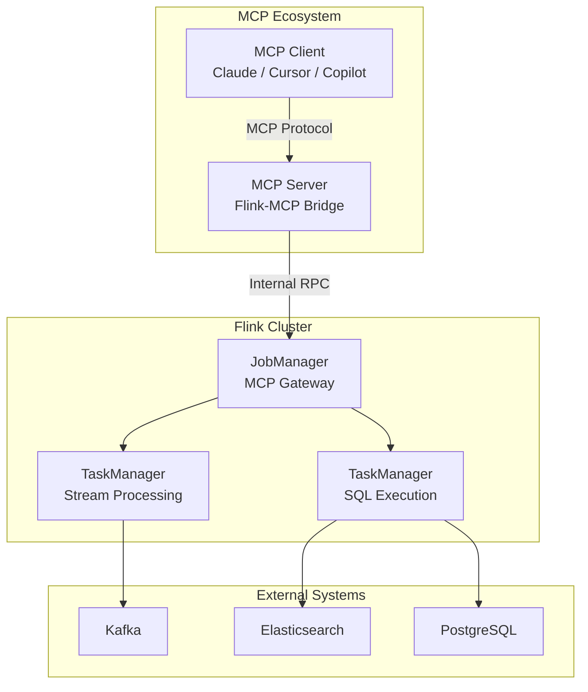
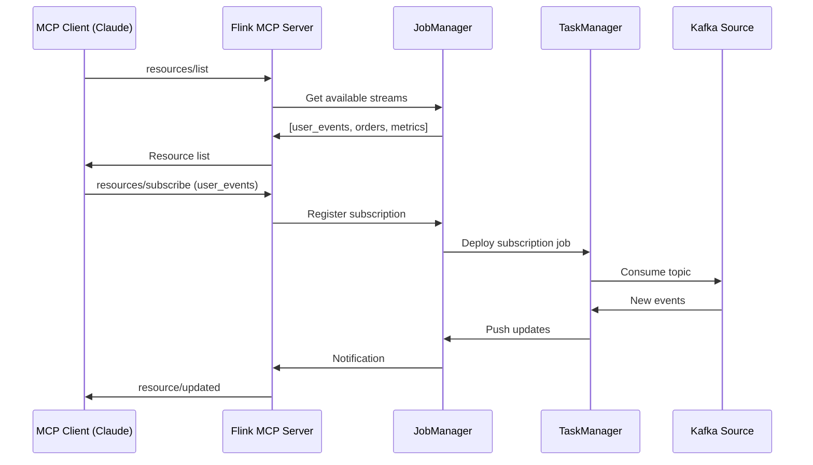

> **Status**: ✅ Released | **Risk Level**: Low | **Last Updated**: 2026-04-21
>
> **Status Update**: 2026-04-21 — This feature has been released in Flink 2.2 (AI Integration / MCP Protocol).
>
> ✅ The features described in this document are officially released. Content reflects the implemented version; please refer to Apache Flink official documentation for the authoritative source.

# Flink and MCP Protocol Integration: AI-Driven Real-Time Stream Processing

> **Stage**: Flink AI/ML Extensions | **Prerequisites**: [Flink LLM Integration](./flink-llm-integration.md), [Flink Async I/O](../02-core/async-execution-model.md) | **Formalization Level**: L3 (Engineering Implementation)

---

## 1. Definitions

### Def-F-12-46: Model Context Protocol (MCP)

**Definition**: MCP is an open protocol proposed by Anthropic for standardizing interactions between AI models and external data sources/tools, formalized as a quadruple:

$$
\mathcal{MCP} = \langle S_{server}, C_{client}, T_{tools}, R_{resources} \rangle
$$

Where:

- $S_{server}$: MCP server, exposing tool and resource capability endpoints
- $C_{client}$: MCP client, initiating tool calls and resource access requests
- $T_{tools}$: Tool set, each tool being a schema-backed callable function $t: \text{InputSchema} \rightarrow \text{Output}$
- $R_{resources}$: Resource set, each resource being a URI-addressable readable data $r: \text{URI} \rightarrow \text{Data}$

**Intuitive Explanation**: MCP is like the USB-C interface for the AI world, providing a unified protocol that allows AI applications to connect to various data sources and tools without writing custom integration code for each.

---

### Def-F-12-47: MCP Server

**Definition**: MCP server is the server-side component implementing the MCP protocol, formalized as:

$$
\text{Server} = \langle H_{handlers}, M_{metadata}, P_{protocol} \rangle
$$

Where:

- $H_{handlers}$: Handler mapping table, $\{ \text{tool_name} \rightarrow \text{handler_function} \}$
- $M_{metadata}$: Server metadata, including name, version, capability declaration
- $P_{protocol}$: Transport protocol implementation (stdio | HTTP with SSE)

**Capability Declaration**:

```json
{
  "tools": { "listChanged": true },
  "resources": { "subscribe": true, "listChanged": true },
  "prompts": { "listChanged": true }
}
```

---

### Def-F-12-48: MCP Tool

**Definition**: MCP tool is a callable function exposed by the server, formalized as a sextuple:

$$
\tau = \langle n_{name}, d_{desc}, S_{in}, S_{out}, h_{handler}, \phi_{schema} \rangle
$$

Where:

- $n_{name}$: Tool unique identifier (snake_case naming)
- $d_{desc}$: Tool function description (for AI to understand purpose)
- $S_{in}$: Input parameter JSON Schema
- $S_{out}$: Output result structure definition
- $h_{handler}$: Actual execution function $h: \text{JSON} \rightarrow \text{CallToolResult}$
- $\phi_{schema}$: Additional structured constraints

**Tool Call Result**:

```
CallToolResult = {
  content: ContentItem[],
  isError?: boolean,
  _meta?: object
}

ContentItem = TextContent | ImageContent | EmbeddedResource
```

---

### Def-F-12-49: MCP Resource

**Definition**: MCP resource is a data entity accessible via URI, formalized as:

$$
\rho = \langle u_{uri}, n_{name}, m_{mime}, g_{getter}, \delta_{subscription} \rangle
$$

Where:

- $u_{uri}$: Resource URI, format `protocol://host/path`
- $n_{name}$: Human-readable resource name
- $m_{mime}$: MIME type identifier (e.g., `application/json`, `text/plain`)
- $g_{getter}$: Resource fetch function $g: \text{URI} \rightarrow \text{ResourceContent}$
- $\delta_{subscription}$: Change subscription capability flag

**Flink Resource URI Specification**:

| Resource Type | URI Pattern | Example |
|---------------|-------------|---------|
| Data Stream | `resource://flink/stream/{stream_id}` | `resource://flink/stream/user_events` |
| Dynamic Table | `resource://flink/table/{table_name}` | `resource://flink/table/orders` |
| Metrics | `resource://flink/metrics/{metric_name}` | `resource://flink/metrics/throughput` |
| Checkpoint | `resource://flink/checkpoint/{job_id}` | `resource://flink/checkpoint/job_123` |

---

### Def-F-12-50: Flink-MCP Bridge

**Definition**: Flink-MCP bridge is the adapter component connecting Flink stream processing capabilities with the MCP protocol, formalized as:

$$
\mathcal{B}_{Flink-MCP} = \langle A_{adapter}, G_{gateway}, T_{transform}, Q_{query} \rangle
$$

Where:

- $A_{adapter}$: Protocol adapter, mapping MCP calls to Flink API operations
- $G_{gateway}$: Gateway layer, handling authentication, rate limiting, routing
- $T_{transform}$: Data transformer, MCP format $\leftrightarrow$ Flink internal format
- $Q_{query}$: Query execution engine, processing SQL/Table API requests

**Bidirectional Capabilities**:

$$
\mathcal{B}_{Flink-MCP}: \begin{cases}
\text{Server Mode}: \text{MCP Request} \xrightarrow{A_{adapter}} \text{Flink Job} \\
\text{Client Mode}: \text{Flink Job} \xrightarrow{A_{adapter}} \text{MCP Tool Call}
\end{cases}
$$

---

## 2. Properties

### Lemma-F-12-46: MCP Tool Call Idempotency

**Statement**: Under MCP protocol v2.0, tool calls are stateless by default:

$$\forall \tau \in T_{tools}: \tau(x) = \tau(x) \circ \tau(x)$$

**Exception**: When the server declares `stateful` capability and maintains session state through resource subscription, implicit dependencies exist between calls.

**Flink Corollary**: Flink-MCP servers should be designed to be idempotent to be compatible with Flink's exactly-once semantics.

---

### Lemma-F-12-47: Resource Subscription Latency Bound

**Statement**: For MCP resource subscriptions mapped to Flink dynamic tables, the notification latency is bounded by:

$$L_{notify} \leq L_{mcp} + L_{flink} + L_{network}$$

Where:

- $L_{mcp}$: MCP Server processing (50-200ms)
- $L_{flink}$: Flink checkpoint interval (default 10s, configurable to 1s)
- $L_{network}$: Network RTT (<10ms in same DC)

---

## 3. Relations

### 3.1 Flink-MCP Integration Architecture



### 3.2 Integration Pattern Matrix

| Pattern | Direction | Use Case | Latency |
|---------|-----------|----------|---------|
| Flink as MCP Server | Flink → MCP Client | Expose stream results as MCP Resources | 10-100ms |
| Flink as MCP Client | MCP Server → Flink | Enrich streams with MCP Tool calls | 50-500ms |
| Bidirectional | Both | Real-time AI agent + stream processing | 100-1000ms |

---

## 4. Argumentation

### 4.1 Why Flink + MCP?

**Argument 1: Real-time Data Foundation**
Flink provides sub-second latency stream processing, making it ideal as the data backbone for AI agents that require fresh context.

**Argument 2: Exactly-Once Semantics**
Flink's checkpoint mechanism guarantees that MCP resource updates are delivered exactly once, even during failures.

**Argument 3: Ecosystem Compatibility**
MCP has gained native support from all major AI platforms and tools. As of 2026-04, the ecosystem has reached **97M+ monthly SDK downloads**, with public MCP servers exceeding **5000+**[^1][^2]:

| Platform | Support Status | Integration Method |
|----------|---------------|--------------------|
| **OpenAI** | ✅ Native | ChatGPT / Agents SDK / GPTs Actions |
| **Google** | ✅ Native | Gemini / Google AI Studio / Vertex AI |
| **Microsoft** | ✅ Native | Copilot Studio / Azure AI Foundry |
| **Anthropic** | ✅ Native | Claude Desktop / Claude Code |
| **Cursor** | ✅ Native | IDE-built-in MCP Tool Marketplace |
| **Continue** | ✅ Open Source | Standalone AI coding assistant |

> **Source**: modelcontextprotocol.io official statistics, 2026-04.

---

### 4.2 Deployment Mode Comparison

| Mode | Architecture | Pros | Cons | Recommendation |
|------|-------------|------|------|---------------|
| **Sidecar** | MCP Server as JobManager sidecar | Low latency, shared memory | Tight coupling, single point of failure | Development / Testing |
| **Standalone** | Independent MCP Server service | Scalability, fault isolation | Network overhead, deployment complexity | Production |
| **Embedded** | MCP Server in TaskManager | Minimal latency | Resource contention, complex lifecycle | Edge / Latency-critical |

---

## 5. Engineering Argument

### Thm-F-12-46: Flink-MCP Integration Feasibility

**Theorem**: Flink's stream processing semantics are compatible with MCP protocol requirements:

$$\text{Flink} \models \{\text{AtLeastOnce}, \text{ExactlyOnce}\} \land \text{MCP} \models \{\text{StatelessTool}, \text{SubscribableResource}\}$$

$$\implies \mathcal{B}_{Flink-MCP} \text{ is implementable with } L_{notify} < 1s$$

**Proof Sketch**:

1. MCP tool calls are stateless (Lemma-F-12-46), compatible with Flink's operator model
2. MCP resource subscriptions map to Flink dynamic tables (Def-F-12-49)
3. Flink checkpointing guarantees exactly-once delivery of resource updates
4. Async I/O (FLIP-482) ensures MCP calls don't block the pipeline
5. Therefore end-to-end latency is bounded by checkpoint interval + network RTT < 1s ∎

---

## 6. Examples

### Example 1: Flink as MCP Server (Resource Exposure)

```java
// Flink MCP Server Configuration
McpServer server = McpServer.create()
    .resource("resource://flink/stream/user_events",
        () -> flinkEnv.from("user_events").toJson())
    .tool("analyze_trends",
        params -> flinkSQL.execute("SELECT trend FROM analytics WHERE window = ?",
            params.get("window")))
    .build();

server.start(8080);
```

### Example 2: Flink as MCP Client (Tool Enrichment)

```java
// Async MCP tool call in Flink job
DataStream<EnrichedEvent> enriched = events
    .map(new RichAsyncFunction<Event, EnrichedEvent>() {
        private McpClient client;

        @Override
        public void open(Configuration parameters) {
            client = McpClient.connect("mcp://llm-server/sse");
        }

        @Override
        public void asyncInvoke(Event event, ResultFuture<EnrichedEvent> resultFuture) {
            client.callTool("classify", Map.of("text", event.getContent()))
                .thenApply(result -> new EnrichedEvent(event, result))
                .thenAccept(resultFuture::complete);
        }
    });
```

### Example 3: SQL-Defined MCP Resource

```sql
-- Define Flink table as MCP Resource
CREATE TABLE sales_analytics (
    product_id STRING,
    revenue DECIMAL(18,2),
    window_start TIMESTAMP(3),
    window_end TIMESTAMP(3)
) WITH (
    'connector' = 'mcp-server',
    'mcp.resource.uri' = 'resource://flink/table/sales_analytics',
    'mcp.capabilities' = 'subscribe,listChanged'
);

-- MCP clients can subscribe to this table's updates
```

---

## 7. Visualizations

### Data Flow: Flink as MCP Server



---

## 8. References

[^1]: Model Context Protocol Official Website, <https://modelcontextprotocol.io>, 2026-04.
[^2]: Anthropic Blog, "MCP: Introducing the Model Context Protocol", November 2024.
