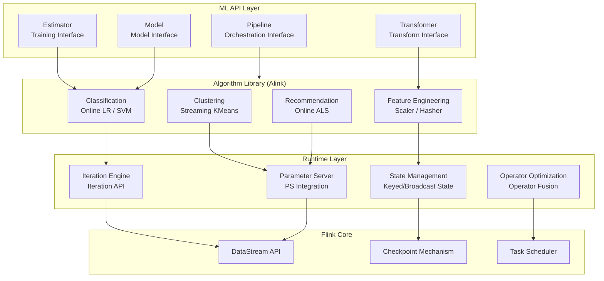
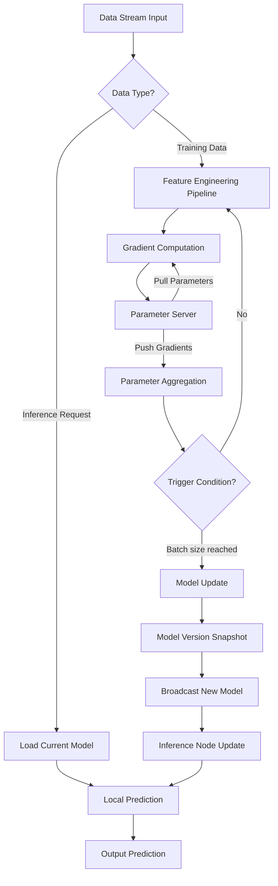
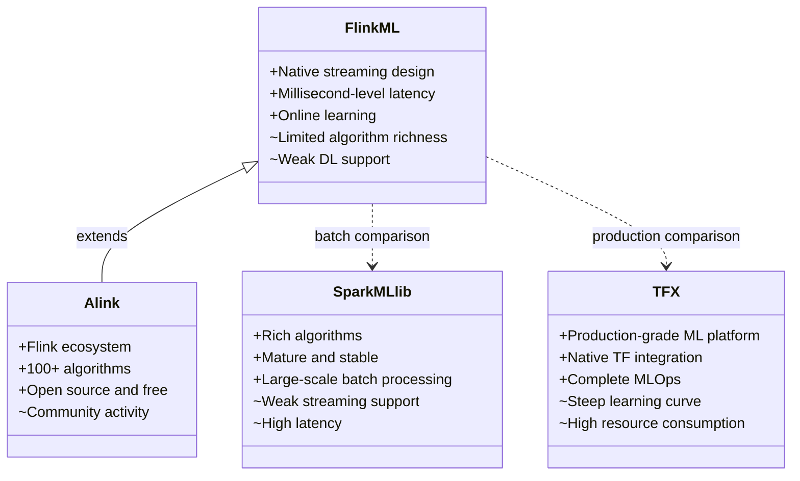

# Flink ML - Streaming Machine Learning Architecture

> Stage: Flink/ | Prerequisites: [Flink DataStream API](../02-core/flink-state-management-complete-guide.md) | Formalization Level: L3

## 1. Definitions

### Def-F-12-01: Flink ML Architecture

**Definition**: The Flink ML architecture is a layered streaming machine learning framework defined by the following triple:

$$
\text{FlinkML} = \langle \text{API}, \text{Algo}, \text{Runtime} \rangle
$$

Where:

- **API Layer** $(\text{API})$: Provides type-safe ML operator interfaces, including three core abstractions: `Transformer`, `Estimator`, `Model`
- **Algorithm Library** $(\text{Algo})$: A collection of algorithms implemented on top of the API layer (including Alink extensions), satisfying $\text{Algo} \subseteq \text{API}^*$
- **Runtime** $(\text{Runtime})$: Flink DataStream-based execution engine providing iterative computation and parameter synchronization mechanisms

**Intuitive Explanation**: Flink ML extends traditional batch ML to streaming scenarios through a unified API abstraction, allowing algorithm developers to ignore underlying stream processing details while leveraging Flink's distributed capabilities for large-scale online learning.

---

### Def-F-12-02: Iterative Computation

**Definition**: Iterative computation in Flink ML is a quintuple:

$$
\text{Iteration} = \langle S_0, \delta, \tau, \theta, \phi \rangle
$$

Where:

- $S_0$: Initial state (model parameters or training data partitions)
- $\delta: S \times D \to S$: State transition function, processing data batch $D$ and updating state
- $\tau: S \to \mathbb{B}$: Termination condition judgment function
- $\theta$: Maximum iteration count limit
- $\phi$: Iteration strategy (`BULK_ITERATION` or `DELTA_ITERATION`)

**Execution Semantics**: Iteration operators are implemented via Flink's `Iterate` and `IterateDelta` operators, supporting both bounded (batch training) and unbounded (online learning) data stream modes.

---

### Def-F-12-03: Parameter Server Integration

**Definition**: Parameter Server (PS) integration is a distributed parameter synchronization protocol:

$$
\text{PS-Integration} = \langle P, W, R, \mathcal{C}, \mathcal{S} \rangle
$$

Where:

- $P = \{p_1, p_2, ..., p_m\}$: Set of parameter partitions
- $W = \{w_1, w_2, ..., w_n\}$: Set of Worker nodes executing gradient computation
- $R = \{r_1, r_2, ..., r_k\}$: Set of PS nodes storing parameter partitions
- $\mathcal{C}: W \times R \to \mathbb{R}^d$: Communication function for Workers pulling parameters from PS
- $\mathcal{S}: W \times R \times \Delta \to \mathbb{B}$: Synchronization function for Workers pushing gradient updates to PS

**Synchronization Modes**:

- **BSP** (Bulk Synchronous Parallel): Strict synchronization, $\forall w_i \in W: \text{barrier}(w_i)$
- **ASP** (Asynchronous Parallel): No barrier asynchronous, $\mathcal{S}$ takes effect immediately
- **SSP** (Stale Synchronous Parallel): Allows staleness boundary $\sigma$, $|t_{local} - t_{global}| \leq \sigma$

---

## 2. Properties

### Prop-F-12-01: Real-Time Guarantee of Streaming ML

**Proposition**: Under the Flink ML architecture, single inference latency $L_{infer}$ satisfies:

$$
L_{infer} \leq L_{network} + L_{feature} + L_{compute} + L_{serialize}
$$

Feature engineering latency $L_{feature}$ can be reduced to sub-millisecond level through precomputation and state reuse.

**Key Arguments**:

- DataStream pipeline execution avoids materializing intermediate results
- Feature transformation operators execute inline via `ProcessFunction`
- Model parameters are locally cached through Broadcast State

---

### Prop-F-12-02: Convergence of Iterative Computation

**Proposition**: For objective functions $f(\theta)$ satisfying Lipschitz continuity, iterative computation using BSP synchronization converges in finite steps:

$$
\exists T < \theta: \|\nabla f(\theta_T)\| < \epsilon
$$

**Engineering Constraint**: In production systems, a trade-off between convergence speed and communication overhead is needed; SSP mode typically achieves optimal throughput when $\sigma \in [5, 20]$.

---

### Lemma-F-12-01: Parameter Consistency Boundary

**Lemma**: In ASP mode, the staleness between parameter version $v_i$ read by Worker $w_i$ and the global latest version $v_{global}$ satisfies:

$$
\mathbb{E}[v_{global} - v_i] \leq \frac{\lambda}{\mu} \cdot \frac{n_{worker}}{n_{ps}}
$$

Where $\lambda$ is the update arrival rate and $\mu$ is the PS processing capacity.

---

## 3. Relations

### Relationship with Flink Core Components

| Flink ML Component | Dependent Flink Features | Relationship Type |
|--------------------|--------------------------|-------------------|
| ML Pipeline API | Table API / DataStream API | Extension |
| Iterative Computation | Iteration API | Specialized Wrapper |
| Parameter Server | Broadcast State + Queryable State | Composition |
| Real-Time Features | ProcessFunction + State | Native Integration |

### Integration Patterns with External ML Frameworks

```
┌─────────────────────────────────────────────────────────────┐
│                    Flink ML Integration Map                  │
├─────────────────────────────────────────────────────────────┤
│                                                             │
│   ┌──────────────┐     ┌──────────────┐     ┌─────────────┐ │
│   │ TensorFlow   │◄────┤ SavedModel   ├────►│ Flink ML    │ │
│   │ (Training)   │     │ (Model Format)│    │ (Inference)  │ │
│   └──────────────┘     └──────────────┘     └─────────────┘ │
│          ▲                                           │      │
│          │              ┌──────────────┐            │      │
│          └──────────────┤ ONNX Runtime ├────────────┘      │
│                         │ (Cross-Framework Inference)│      │
│                         └──────────────┘                   │
│                                                             │
│   ┌──────────────┐     ┌──────────────┐                     │
│   │ PyTorch      │◄────┤ TorchScript  ├────►┌─────────────┐│
│   │ (Training)   │     │ (Serialization)│   │ Flink ML    ││
│   └──────────────┘     └──────────────┘     │ (Streaming)  ││
│                                              └─────────────┘│
└─────────────────────────────────────────────────────────────┘
```

---

## 4. Argumentation

### 4.1 System Challenges of Online Learning

Online learning requires models to be continuously updated with data streams. Core challenges include:

1. **Concept Drift**: Data distribution $P(X, y)$ changes over time, requiring adaptive learning rate strategies
2. **Catastrophic Forgetting**: New data overwrites old knowledge, requiring regularization terms or experience replay
3. **Real-Time Constraints**: Model updates and inference must complete within data freshness windows

### 4.2 Architecture Design Decisions

**Decision 1**: Why choose a layered architecture over an end-to-end framework?

- Decouples algorithm research and engineering optimization, allowing independent evolution
- API layer stability ensures backward compatibility, while Runtime layer can upgrade with Flink

**Decision 2**: Why build a custom PS instead of using an external system directly?

- Deep integration with Flink Checkpoint mechanism guarantees Exactly-Once semantics
- Leverages Flink's task scheduling for colocation optimization

### 4.3 Boundary Discussion

| Scenario | Flink ML Suitability | Alternative |
|----------|----------------------|-------------|
| Real-time recommendation ranking (p99<50ms) | ✓ Highly Suitable | - |
| Large-scale offline training (TB-level) | △ Moderately Suitable | Spark MLlib |
| Deep neural network training | ✗ Not Suitable | TensorFlow/PyTorch |
| Federated Learning | △ Requires Extension | TFF/FATE |

---

## 5. Engineering Argument

### 5.1 Architecture Layer Argument

#### ML API Layer Design

```java
// Core abstraction: Estimator-Transformer-Model pattern
public interface Estimator<T extends Model<T>> extends PipelineStage {
    T fit(Table... inputs);  // Train to obtain model
}

public interface Transformer extends PipelineStage {
    Table[] transform(Table... inputs);  // Feature transformation
}

public interface Model<T extends Model<T>> extends Transformer {
    T setModelData(Table... inputs);  // Load model parameters
}
```

**Design Rationale**: Follows the scikit-learn fit-transform paradigm, reducing learning cost for algorithm developers.

#### Algorithm Library (Alink) Extension

Alink, as an algorithm extension to Flink ML, provides 100+ out-of-the-box algorithms:

| Category | Representative Algorithm | Streaming Adaptation Feature |
|----------|--------------------------|------------------------------|
| Classification | OnlineLogisticRegression | Incremental gradient updates |
| Clustering | StreamingKMeans | Micro-batch centroid updates |
| Features | FeatureHasher | Stateless row-by-row processing |
| Evaluation | BinaryClassificationEvaluator | Sliding window metric computation |

#### Runtime Optimization Strategies

1. **Operator Fusion**: Merges consecutive Transformers into a single ProcessFunction, reducing serialization overhead
2. **Broadcast State**: Model parameters distributed via broadcast stream, locally cached at inference nodes
3. **Mini-batch Iteration**: Accumulates gradients within iteration boundaries, balancing convergence speed and throughput

### 5.2 Key Feature Implementations

#### Online Learning Support

```java
// [伪代码片段 - 不可直接运行] 仅展示核心逻辑
import org.apache.flink.streaming.api.environment.StreamExecutionEnvironment;
import org.apache.flink.streaming.api.datastream.DataStream;
import org.apache.flink.table.api.TableEnvironment;

// Online learning pipeline example
StreamExecutionEnvironment env = ...;
StreamTableEnvironment tEnv = ...;

// Define online learner
OnlineLogisticRegression learner = new OnlineLogisticRegression()
    .setLearningRate(0.01)
    .setRegularization(0.1);

// Continuous training stream
DataStream<Row> trainingStream = ...;
tableEnv.createTemporaryView("training", trainingStream);

// Trigger model update every 1000 samples
learner.fit(tEnv.from("training"));
```

#### Real-Time Feature Engineering

| Feature Type | Implementation Mechanism | State Type |
|--------------|--------------------------|------------|
| Statistical features (mean/variance) | Incremental aggregation operator | ValueState |
| Sequence features (last N items) | Sliding window + ListState | ListState |
| Cross features | Broadcast connected stream | MapState |

#### Model Version Management

```
Model Version Lifecycle:
┌──────────┐    ┌──────────┐    ┌──────────┐    ┌──────────┐
│ Training │───►│ Staging  │───►│  Canary  │───►│Production│
│          │    │(Validation)│  │ (1% Traffic)│ │(100% Traffic)│
└──────────┘    └──────────┘    └──────────┘    └──────────┘
                                      │
                                      ▼
                               ┌──────────┐
                               │Rollback  │
                               │(Rollback Policy)│
                               └──────────┘
```

**Implementation**: Uses Flink's Savepoint mechanism for model version snapshots, and Queryable State for version query interface.

#### A/B Testing Framework

```java
// Traffic splitting and model routing
import org.apache.flink.api.common.state.ValueState;

public class ModelRouter extends ProcessFunction<Features, Prediction> {
    private ValueState<ModelVersion> modelState;

    @Override
    public void processElement(Features features, Context ctx,
                               Collector<Prediction> out) {
        // Split by user ID hash
        int bucket = features.userId.hashCode() % 100;
        ModelVersion version = bucket < 10 ? ModelVersion.V2 : ModelVersion.V1;

        modelState.value(version).predict(features);

        // Output prediction with experiment label
        out.collect(new Prediction(result, version));
    }
}
```

---

## 6. Examples

### 6.1 Complete Online Learning Pipeline

```java
import org.apache.flink.ml.classification.logisticregression.*;
import org.apache.flink.ml.feature.standardscaler.*;
import org.apache.flink.ml.pipeline.*;
import org.apache.flink.streaming.api.environment.StreamExecutionEnvironment;
import org.apache.flink.table.api.TableEnvironment;

public class OnlineLearningExample {
    public static void main(String[] args) {
        StreamExecutionEnvironment env =
            StreamExecutionEnvironment.getExecutionEnvironment();
        StreamTableEnvironment tEnv =
            StreamTableEnvironment.create(env);

        // 1. Build feature engineering pipeline
        Pipeline featurePipeline = new Pipeline()
            .addStage("scaler", new StandardScaler())
            .addStage("hasher", new FeatureHasher().setNumFeatures(1000));

        // 2. Define online learning model
        OnlineLogisticRegression classifier = new OnlineLogisticRegression()
            .setLearningRate(0.01)
            .setGlobalBatchSize(100)  // Update every 100 records
            .setMaxIter(1000);

        // 3. Compose complete pipeline
        Pipeline modelPipeline = new Pipeline()
            .addStages(featurePipeline)
            .addStage("classifier", classifier);

        // 4. Training and inference
        Table trainingData = tEnv.fromDataStream(
            env.addSource(new UserBehaviorSource()));

        // Continuous online training
        modelPipeline.fit(trainingData);

        // Real-time inference service
        Table inferenceData = tEnv.fromDataStream(
            env.addSource(new InferenceRequestSource()));
        Table predictions = modelPipeline.transform(inferenceData)[0];

        env.execute("Online Learning Pipeline");
    }
}
```

### 6.2 Parameter Server Configuration Example

```yaml
# flink-conf.yaml - PS related configurations

# Number of parameter server partitions
flink.ml.ps.partition-num: 4

# Sync mode: BSP / ASP / SSP
flink.ml.ps.sync-mode: SSP
flink.ml.ps.staleness: 10

# RPC timeout
flink.ml.ps.rpc-timeout: 30s

# Parameter memory limit
flink.ml.ps.memory.limit: 2g
```

---

## 7. Visualizations

### 7.1 Flink ML Architecture Layer Diagram



### 7.2 Online Learning Execution Flowchart



### 7.3 Flink ML vs Mainstream Frameworks Comparison Matrix



---

## 8. Comparisons

### 8.1 Flink ML vs Spark MLlib

| Dimension | Flink ML | Spark MLlib |
|-----------|----------|-------------|
| **Processing Mode** | Native streaming, supports batch | Batch-first, Structured Streaming supplement |
| **Latency** | Millisecond-level (p99<50ms) | Second-level to minute-level |
| **Online Learning** | Native incremental update support | Requires Spark Streaming coordination |
| **Algorithm Count** | Fewer (relies on Alink extension) | Rich (mature Spark ecosystem) |
| **Applicable Scenarios** | Real-time recommendation, online risk control | Offline training, batch prediction |
| **Checkpoint** | Native Exactly-Once | Requires additional WAL configuration |

**Selection Recommendation**: Choose Flink ML if the business requires real-time model updates (e.g., real-time CTR estimation); choose Spark MLlib for periodic batch training (e.g., daily user profiling).

### 8.2 Flink ML vs TensorFlow Extended (TFX)

| Dimension | Flink ML | TFX |
|-----------|----------|-----|
| **Positioning** | Streaming ML engine | End-to-end ML platform |
| **Deep Learning** | Not supported | Native TensorFlow support |
| **MLOps** | Self-built Pipeline required | Complete CI/CD, model management |
| **Feature Platform** | Real-time feature engineering | Feast and other feature store integrations |
| **Service Deployment** | Requires Flink cluster integration | TensorFlow Serving |
| **Complexity** | Medium | High |

**Integration Solution**: Typical production environments adopt a hybrid architecture:

- Training phase: TFX + TensorFlow (for complex models)
- Inference phase: Flink ML (loads TF SavedModel, streaming inference)

```
┌─────────────────────────────────────────────────────────────┐
│                    Hybrid Architecture Example               │
├─────────────────────────────────────────────────────────────┤
│                                                             │
│   Training Phase                Inference Phase             │
│   ┌──────────────┐             ┌──────────────┐             │
│   │  TFX Pipeline │             │  Flink Cluster│             │
│   │  ┌──────────┐ │             │  ┌──────────┐ │             │
│   │  │Transform │ │             │  │  Source  │ │             │
│   │  │(Feature Eng)│◄───────────►│  │(Real-time)│ │             │
│   │  └──────────┘ │             │  └────┬─────┘ │             │
│   │  ┌──────────┐ │             │  ┌────▼─────┐ │             │
│   │  │ Trainer  │ │  SavedModel │  │Transform │ │             │
│   │  │(TF Train)│◄─────────────►│  │(Same as training)│       │
│   │  └──────────┘ │             │  └────┬─────┘ │             │
│   │  ┌──────────┐ │             │  ┌────▼─────┐ │             │
│   │  │  Tuner   │ │             │  │  TF Model│ │             │
│   │  │(HPO)     │ │             │  │ (Load)   │ │             │
│   │  └──────────┘ │             │  └────┬─────┘ │             │
│   │  ┌──────────┐ │             │  ┌────▼─────┐ │             │
│   │  │  Pusher  │ │             │  │  Sink    │ │             │
│   │  │(Deploy)  │◄─────────────►│  │(Output)  │ │             │
│   │  └──────────┘ │             │  └──────────┘ │             │
│   └──────────────┘             └──────────────┘             │
│                                                             │
└─────────────────────────────────────────────────────────────┘
```

---

## 9. References
