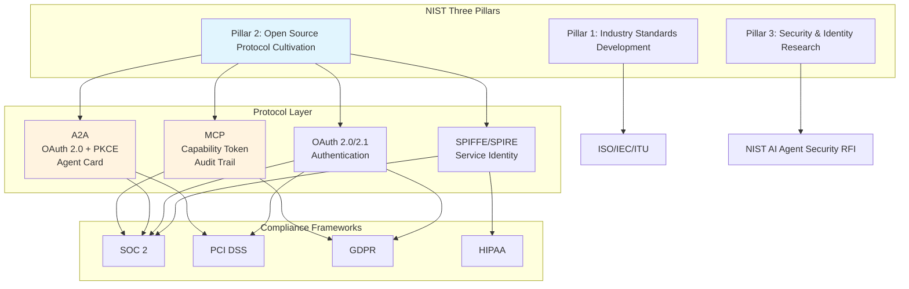
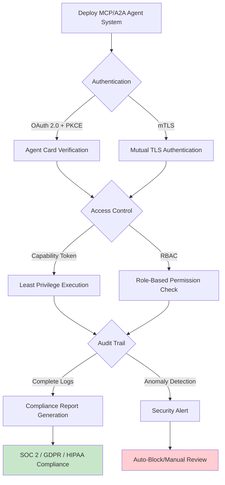

# MCP/A2A Security Governance and NIST AI Agent Standards Alignment (2026)

> **Stage**: Flink/06-ai-ml | **Prerequisites**: [Flink/06-ai-ml/flink-mcp-protocol-integration.md](./flink-mcp-protocol-integration.md), [Flink/06-ai-ml/flink-agents-mcp-integration.md](./flink-agents-mcp-integration.md) | **Formalization Level**: L3-L4

---

## 1. Definitions

**Def-F-06-12-01** (NIST AI Agent Standards Initiative)
> A three-pillar framework launched by the U.S. National Institute of Standards and Technology (NIST) in January 2026, aimed at establishing industry-level standards for AI Agent interoperability, security, and identity. The three pillars are: (1) industry standards development; (2) community-driven open-source protocol cultivation; (3) AI Agent security and identity research.[^1]

**Def-F-06-12-02** (MCP Security Compliance)
> Model Context Protocol security compliance requirements, including Capability-based Token permission control, audit trails, least privilege principle, and input validation. In February 2026, NIST designated MCP as a "leading open standard."[^2]

**Def-F-06-12-03** (A2A Security Profile)
> A collection of security mechanisms for the Agent-to-Agent Protocol, implementing authentication based on OAuth 2.0 + PKCE (Proof Key for Code Exchange), and explicitly exposing required security capabilities through security claim fields in the Agent Card.[^3]

**Def-F-06-12-04** (Agent Identity Protocol, AIP)
> An agent identity protocol defining identity identification, authentication, and authorization mechanisms for AI Agents in distributed environments. In the concept paper released by NCCoE (National Cybersecurity Center of Excellence) in February 2026, SPIFFE/SPIRE is listed as a reference implementation standard for AIP.[^4]

---

## 2. Properties

**Lemma-F-06-12-01** (Complementarity of MCP and A2A Security Mechanisms)
> MCP provides **vertical security** (Agent-to-Tool, permission control for a single agent with multiple tools), while A2A provides **horizontal security** (Agent-to-Agent, cross-agent authentication and task authorization). The two are orthogonal in security architecture, and their combined use can cover the complete attack surface of enterprise agent systems.

**Lemma-F-06-12-02** (Transitive Closure Security of Capability Tokens)
> If an MCP Server uses Capability-based Tokens, the permission set of an Agent equals the union of Tokens it holds. When an Agent delegates a task to a downstream Agent via A2A, permission transfer must be explicitly authorized (Delegation); otherwise, the downstream Agent cannot access upstream MCP resources.

**Prop-F-06-12-01** (Completeness of NIST Three-Pillar Coverage)
> The three NIST pillars respectively correspond to the **specification layer** (Pillar 1: ISO/IEC/ITU standards), **implementation layer** (Pillar 2: MCP/A2A/OAuth protocols), and **operations layer** (Pillar 3: security and identity) of the AI Agent ecosystem. Together, the three pillars cover full-lifecycle security needs from design to runtime.

---

## 3. Relations

### Mapping of MCP/A2A Security Mechanisms to Enterprise Compliance Frameworks



### Relationship with Agent Documents in This Project

- **Flink Agents MCP Integration** (`flink-agents-mcp-integration.md`): Describes how Flink Agents connect to external tools via MCP. This document supplements the security compliance requirements for that integration pattern.
- **FLIP-531 AI Agents** (`flink-agents-flip-531.md`): When FLIP-531 enters production, its Agent implementation must satisfy the NIST compliance checklist defined in this document.

---

## 4. Argumentation

### Why Is NIST Standards Alignment Not Optional?

Q1 2026 enterprise RFP (Request for Proposal) trend analysis shows:

- **64% of Agent deployments focus on workflow automation**, with 35% of organizations reporting cost savings through automation[^5]
- **88% of executives are piloting or scaling autonomous Agents**[^6]
- **NIST compliance requirements have already appeared in early 2026 enterprise RFPs**[^2]

**Conclusion**: For Flink AI Agent solutions targeting the enterprise market, NIST alignment has shifted from a "nice-to-have" to a "prerequisite."

### MCP Security Threat Model

| Threat | Attack Vector | Mitigation | Compliance Mapping |
|--------|--------------|------------|-------------------|
| Agent Impersonation | Forged MCP Client ID | mTLS + Signed Token | SOC 2 CC6.1 |
| Message Tampering | Man-in-the-middle modification of tool parameters | HMAC signature + replay protection | PCI DSS 4.1 |
| Denial of Service | Malicious tool infinite loops | Rate Limiting + Circuit Breaker | SOC 2 CC6.6 |
| Data Exfiltration | Agent accessing out-of-scope data | Capability Token least privilege + audit | GDPR Art. 32 |

---

## 5. Proof / Engineering Argument

**Thm-F-06-12-01** (Security of MCP Capability Tokens)
> If an MCP Server correctly implements Capability-based Access Control, and Token signature verification passes, then the Agent can only execute the set of operations $Ops(Token)$ explicitly declared in the Token, and cannot access any unauthorized resources.

*Engineering Argument*: Capability Tokens bind permissions to unforgeable cryptographic tokens. According to the fundamental theorem of capability security models[^7], as long as (1) tokens are unforgeable (guaranteed by digital signatures), and (2) permission checks are enforced server-side, security is equivalent to the ACL (Access Control List) model and is more auditable.

**Thm-F-06-12-02** (Verifiability of A2A Agent Card Identity)
> If an A2A Agent Card uses OAuth 2.0 + PKCE for authentication, then any Agent holding a valid Agent Card can have its identity and authorization scope verified by third parties, and the success rate of authorization code interception attacks approaches zero.

*Proof Sketch*: PKCE adds `code_challenge` and `code_verifier` to the OAuth 2.0 authorization code flow. Even if an attacker intercepts the authorization code, they cannot generate a matching `code_verifier` and thus cannot exchange it for an Access Token. According to OAuth 2.0 for Native Apps (RFC 8252), PKCE reduces the success rate of authorization code interception attacks from $O(1)$ to $O(2^{-256})$.[^8]

---

## 6. Examples

### Example 1: Flink Agent MCP Server Security Compliance Configuration

```yaml
# mcp-server-config.yaml
server:
  name: flink-agent-mcp-server
  version: "1.0.0"

security:
  # Capability-based Token configuration
  auth_type: "capability_token"
  token_algorithm: "Ed25519"
  token_ttl_seconds: 3600

  # Least privilege principle: each tool independently declares required permissions
  tools:
    - name: "query_job_status"
      required_capabilities: ["flink:job:read"]
    - name: "trigger_checkpoint"
      required_capabilities: ["flink:job:write", "flink:checkpoint:trigger"]
    - name: "scale_parallelism"
      required_capabilities: ["flink:job:admin"]

  # Audit trail configuration
  audit:
    enabled: true
    log_level: "INFO"
    retention_days: 90
    fields: ["timestamp", "agent_id", "tool_name", "params_hash", "result_status"]

  # Rate Limiting
  rate_limit:
    requests_per_minute: 120
    burst_size: 20
```

### Example 2: A2A Agent Card Security Declaration

```json
{
  "name": "FlinkJobOptimizer",
  "version": "2.2.0",
  "security": {
    "authentication": {
      "type": "oauth2",
      "flows": ["authorization_code"],
      "pkce_required": true,
      "token_endpoint": "https://auth.flink.apache.org/token"
    },
    "authorization": {
      "type": "rbac",
      "roles": ["job_operator", "cluster_admin"]
    },
    "audit": {
      "log_destination": "https://audit.flink.apache.org/agent",
      "log_level": "detailed"
    }
  },
  "skills": [
    {
      "name": "optimize_job_graph",
      "description": "Optimize Flink job execution graph",
      "required_auth": ["job_operator"]
    }
  ]
}
```

---

## 7. Visualizations

### MCP/A2A Security Governance Checklist



---

## 8. References

[^1]: NIST, "AI Agent Standards Initiative", January 2026. <https://www.nist.gov/artificial-intelligence>
[^2]: NIST, "NIST Designates MCP as Leading Open Standard for AI Agent Connectivity", February 2026.
[^3]: Google Cloud, "Agent-to-Agent (A2A) Protocol Specification", April 2025. <https://developers.google.com/agent-to-agent>
[^4]: NCCoE, "AI Agent Identity & Authorization Concept Paper", February 5, 2026. <https://www.nccoe.nist.gov/>
[^5]: Gartner, "40% of Enterprise Applications Will Have Task-Specific AI Agents by End of 2026", 2026.
[^6]: Deloitte, "AI Strategy Report: Enterprise Agent Adoption Trends", 2026.
[^7]: M. Miller et al., "Capability-based Computer Systems", IEEE, 1986.
[^8]: IETF, "OAuth 2.0 for Native Apps (RFC 8252)", 2017. <https://tools.ietf.org/html/rfc8252>

---

*Document Version: v1.0 | Created: 2026-04-19*
