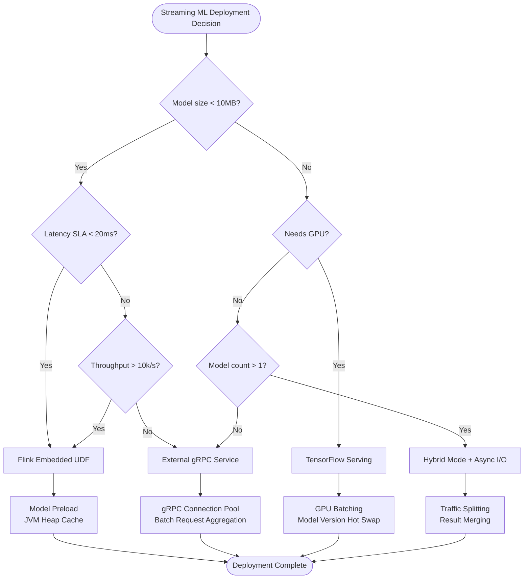
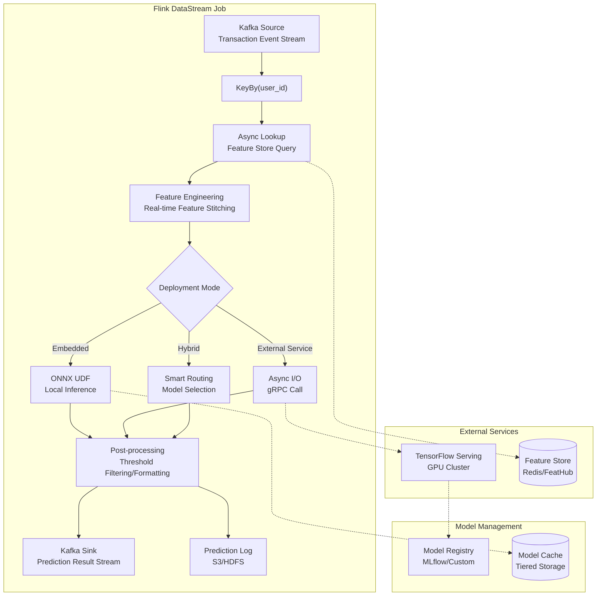
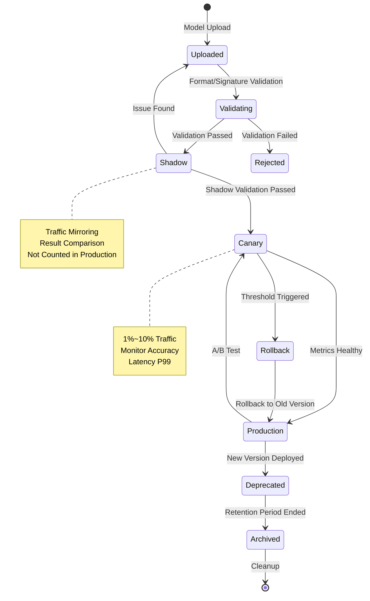
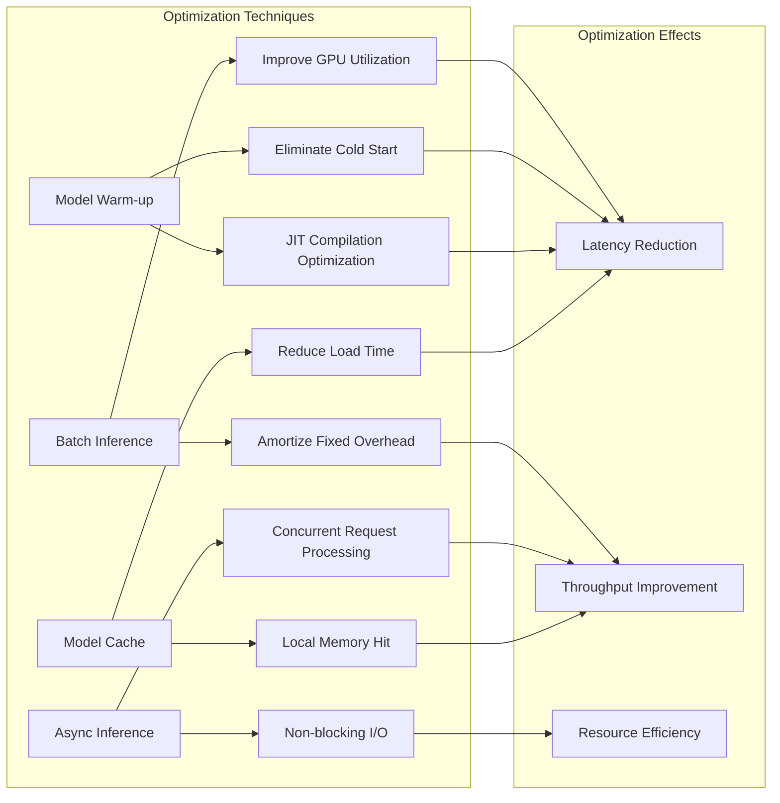

# Model Serving as a Service - Streaming ML Model Deployment

> Stage: Flink | Prerequisites: [Flink/11-feature-engineering/feature-engineering-patterns.md](./realtime-feature-engineering-feature-store.md) | Formalization Level: L3

## 1. Definitions

### Def-F-12-07: Model Serving

**Definition**: Model serving is the process of deploying a trained machine learning model as a production-grade inference service accessible via network protocols.

$$\text{ModelServing} = (M, API, S, Q)$$

Where:

- $M$: Model instance, $M = (f_\theta, \mathcal{X}, \mathcal{Y})$, containing the parameterized prediction function, input space, and output space
- $API$: Service interface, supporting gRPC/REST protocols
- $S$: Service runtime, containing model loader, execution engine, and resource scheduler
- $Q$: Service quality constraints, $Q = (latency_{SLA}, throughput_{target}, availability_{SLO})$

**Model Version Identifier**: $M^{(v)}$, where $v = (major, minor, patch, timestamp)$

---

### Def-F-12-08: Real-time Inference Pipeline

**Definition**: A real-time inference pipeline is a computational graph that continuously processes data streams through three stages: feature transformation, model inference, and post-processing.

$$\mathcal{P}_{inference} = (G_{feat}, G_{model}, G_{post}, \mathcal{D}_{stream})$$

Where:

- $G_{feat}$: Feature engineering subgraph, mapping raw event $e$ to feature vector $\mathbf{x}$
- $G_{model}$: Model inference subgraph, executing $\hat{y} = f_\theta(\mathbf{x})$
- $G_{post}$: Post-processing subgraph, converting $\hat{y}$ to business output
- $\mathcal{D}_{stream}$: Data stream definition, containing Schema and Watermark strategy

**End-to-End Latency Constraint**:
$$\mathcal{L}_{total} = \mathcal{L}_{feat} + \mathcal{L}_{inference} + \mathcal{L}_{post} \leq \mathcal{L}_{SLA}$$

---

### Def-F-12-09: Model Version Management

**Definition**: Model version management is the lifecycle control of multi-version models in production environments, including deployment, routing, rollback, and decommissioning.

$$\mathcal{V}_{mgmt} = (\mathcal{M}_{versions}, \pi_{routing}, \mathcal{T}_{lifecycle})$$

Where:

- $\mathcal{M}_{versions} = \{M^{(v_1)}, M^{(v_2)}, ..., M^{(v_n)}\}$: Version set
- $\pi_{routing}: Request \to M^{(v)}$: Version routing policy
- $\mathcal{T}_{lifecycle}$: State transition system, $State \in \{Canary, Shadow, Production, Deprecated\}$

**Blue-Green Deployment Switch Condition**:
$$\text{Promote}(M^{(v_{new})}) \iff accuracy_{canary} \geq accuracy_{production} \land error\_rate_{canary} < \theta_{error}$$

## 2. Properties

### Lemma-F-12-03: Inference Latency Decomposition

**Lemma**: In a streaming inference pipeline, end-to-end latency can be decomposed into deterministic and stochastic components.

$$\mathcal{L}_{inference} = \underbrace{\mathcal{L}_{load} + \mathcal{L}_{preprocess}}_{\text{deterministic}} + \underbrace{\mathcal{L}_{compute} + \mathcal{L}_{serialize}}_{\text{stochastic}}$$

**Proof Sketch**:

1. $\mathcal{L}_{load}$: Model loaded from storage to memory, IO-bound, approximately constant
2. $\mathcal{L}_{preprocess}$: Input normalization/encoding, CPU-bound, linearly related to input size
3. $\mathcal{L}_{compute}$: Neural network forward propagation, affected by GPU/CPU scheduling, follows a distribution
4. $\mathcal{L}_{serialize}$: Result serialization, related to output complexity

---

### Lemma-F-12-04: Batch Inference Throughput Gain

**Lemma**: For models supporting batching, batch inference throughput improvement exhibits diminishing marginal returns.

$$Throughput(B) = \frac{B}{\mathcal{L}_{fixed} + B \cdot \mathcal{L}_{per\_sample} + \mathcal{L}_{batch\_overhead}}$$

As $B \to \infty$, $Throughput(B) \to \frac{1}{\mathcal{L}_{per\_sample}}$

**Optimal Batch Derivation**:
$$B^* = \arg\max_B Throughput(B) \text{ s.t. } \mathcal{L}_{batch}(B) \leq \mathcal{L}_{SLA}$$

---

### Prop-F-12-04: External Service Call Availability Constraint

**Proposition**: When adopting external inference services, end-to-end availability is jointly constrained by Flink and external service availability.

$$Availability_{total} = Availability_{Flink} \times Availability_{Service} \times (1 - P_{timeout\_cascade})$$

Where $P_{timeout\_cascade}$ is the timeout cascade failure probability.

## 3. Relations

### Relation to Feature Engineering

Real-time inference pipelines and feature engineering form a tightly coupled production chain:

```
Raw Event Stream → [Feature Engineering] → Feature Vector → [Model Inference] → Prediction Result → Business Action
                    ↑                              ↓
            Feature Store (Online/Offline) ← Prediction Log (Feedback)
```

**Key Mapping**: Training-time feature engineering logic must be precisely reproduced at inference time, otherwise training-inference skew occurs.

---

### Relation to Checkpoint Mechanism

Model state participates in Checkpoint as part of Flink state:

$$Checkpoint_{inference} = (OperatorState_{pipeline}, ModelState_{version}, Buffer_{inflight})$$

**Consistency Levels**:

- **Exactly-Once**: Inference results bound to Checkpoint, replayed upon failure
- **At-Least-Once**: Allows duplicate inference, handled idempotently at the business layer

---

### Deployment Mode Comparison Matrix

| Mode | Latency | Throughput | Resource Isolation | Operational Complexity | Applicable Scenario |
|------|------|--------|----------|------------|----------|
| Embedded (UDF) | < 10ms | High | Low | Low | Simple models, low latency |
| External gRPC | 20-50ms | Medium | High | Medium | Complex models, GPU acceleration |
| External REST | 50-100ms | Medium-Low | High | Medium | Cross-language, team separation |
| Hybrid Mode | Adaptive | High | High | High | Heterogeneous models, A/B testing |

## 4. Argumentation

### Deployment Mode Selection Argumentation

**Scenario 1: Real-time Fraud Detection Scoring**

- Model: XGBoost, < 1MB
- Latency SLA: 20ms P99
- Decision: Embedded UDF
- Rationale: Small model, strict latency requirement, avoids network overhead

**Scenario 2: Image Classification Service**

- Model: ResNet50, ~100MB
- Requires GPU inference
- Decision: External TensorFlow Serving
- Rationale: Large model, needs GPU, resource isolation from Flink

**Scenario 3: Recommender System Multi-Model Fusion**

- Model A: Collaborative Filtering (Flink UDF)
- Model B: Deep Learning Ranking (External Service)
- Decision: Hybrid Mode + Async I/O
- Rationale: Heterogeneous models, maximizing resource efficiency

---

### Version Switch Risk Boundary

**Canary Release Mathematical Model**:

Let the traffic allocation ratio be $\alpha$ to the new version, then risk exposure is:

$$Risk_{exposure} = \alpha \cdot E[loss|M^{(v_{new})} \text{ defective}] + (1-\alpha) \cdot 0$$

**Optimal Canary Ratio**:
$$\alpha^* = \min\left(\frac{Risk_{budget}}{E[loss]}, \alpha_{statistical\_significance}\right)$$

---

### Cache Strategy Design

**Model Cache Hierarchy**:

```
L1: JVM Heap (Hot Model) - Hit latency < 1μs
L2: Off-Heap Memory (Warm Model) - Hit latency < 10μs
L3: Local SSD (Cold Model) - Hit latency ~10ms
L4: Remote Storage (Archive) - Hit latency > 100ms
```

**Cache Invalidation Strategy**:

- TTL: Based on model version release cycle
- LRU: Based on model access frequency
- Explicit: Proactive invalidation upon version switch

## 5. Engineering Argument

### Thm-F-12-02: Streaming Inference Architecture Correctness

**Theorem**: A hybrid inference architecture based on Flink Async I/O satisfies maximum throughput under real-time constraints.

**Argumentation Framework**:

Let:

- $\lambda$: Event arrival rate (events/s)
- $N$: Parallelism
- $C$: External service capacity (req/s)
- $T_{async}$: Async wait timeout

**Constraints**:

1. **Capacity Constraint**: $\frac{\lambda}{N} \leq C$ (Single TaskManager not overloaded)
2. **Latency Constraint**: $\mathcal{L}_{queue} + \mathcal{L}_{network} + \mathcal{L}_{service} \leq \mathcal{L}_{SLA}$
3. **Resource Constraint**: $Memory_{buffer} = N \cdot T_{async} \cdot \frac{\lambda}{N} \cdot Size_{event} \leq Memory_{available}$

**Optimization Objective**:
$$\max \lambda \text{ s.t. Constraints 1,2,3 are satisfied}$$

**Optimal Solution Derivation**:
$$N^* = \left\lceil \frac{\lambda}{C \cdot (1 - \epsilon_{safety})} \right\rceil$$

Where $\epsilon_{safety}$ is the safety margin factor.

---

### Batch Inference Optimization Argumentation

**Technical Principle**: GPU/TPU has significant acceleration for batch matrix operations.

$$Speedup(B) = \frac{B \cdot T_{sequential}}{T_{batch}(B)} \approx \frac{B \cdot T_{compute}}{T_{fixed} + \frac{B}{GPU\_utilization} \cdot T_{compute}}$$

**Engineering Trade-offs**:

- Larger batch → Higher throughput, but higher latency
- There exists a Pareto frontier, selection depends on business requirements

**Micro-batch Accumulation Strategy**:

- Time trigger: Wait until $T_{max}$ or batch reaches $B_{max}$
- Count trigger: Accumulate $B_{target}$ records and send immediately
- Hybrid trigger: Trigger when either condition is first met

---

### Model Warm-up Strategy

**Cold Start Problem**: JVM + DL framework first inference latency is 10-100x higher than steady state.

**Warm-up Scheme Comparison**:

| Scheme | Implementation Complexity | Warm-up Effect | Resource Overhead |
|------|------------|----------|----------|
| Dummy warm-up requests | Low | Medium | Low |
| Model serialization cache | Medium | High | Medium |
| JIT warm-up + model cache | High | Extremely high | High |
| Resident warm pool | High | Highest | High |

**Recommended Scheme**: Send warm-up requests to external services when Flink TaskManager starts; for embedded models, execute dummy forward in `open()`.

## 6. Examples

### Example 1: TensorFlow Serving + Flink Async I/O

```java
// Define external model service invocation

import org.apache.flink.streaming.api.datastream.DataStream;
import org.apache.flink.streaming.api.windowing.time.Time;

public class TFServingAsyncFunction
    extends RichAsyncFunction<FeatureVector, Prediction> {

    private transient ManagedChannel channel;
    private transient PredictionServiceGrpc.PredictionServiceBlockingStub stub;

    @Override
    public void open(Configuration parameters) {
        // Establish gRPC connection
        channel = ManagedChannelBuilder
            .forAddress("tf-serving", 8501)
            .usePlaintext()
            .build();
        stub = PredictionServiceGrpc.newBlockingStub(channel);
    }

    @Override
    public void asyncInvoke(FeatureVector input,
                           ResultFuture<Prediction> resultFuture) {
        CompletableFuture.supplyAsync(() -> {
            // Construct TF Serving request
            ModelSpec modelSpec = ModelSpec.newBuilder()
                .setName("recommendation")
                .setVersionLabel("stable")
                .build();

            PredictRequest request = PredictRequest.newBuilder()
                .setModelSpec(modelSpec)
                .putInputs("input", toTensorProto(input))
                .build();

            return stub.predict(request);
        }).thenAccept(response -> {
            Prediction pred = fromTensorProto(
                response.getOutputsOrThrow("output"));
            resultFuture.complete(Collections.singletonList(pred));
        });
    }
}

// Use in DataStream
DataStream<Prediction> predictions = featureStream
    .keyBy(FeatureVector::getUserId)
    .asyncWaitFor(
        new TFServingAsyncFunction(),
        Time.milliseconds(100),  // Timeout
        100                      // Concurrency capacity
    );
```

---

### Example 2: Embedded ONNX Runtime UDF

```java
@FunctionHint(
    input = @DataTypeHint("ROW<feature1 FLOAT, feature2 FLOAT, feature3 FLOAT>"),
    output = @DataTypeHint("ROW<score FLOAT, label STRING>")
)
public class OnnxScoringUdf extends TableFunction<Row> {

    private transient OrtEnvironment env;
    private transient OrtSession session;
    private final String modelPath;

    public OnnxScoringUdf(String modelPath) {
        this.modelPath = modelPath;
    }

    @Override
    public void open(RuntimeContext ctx) throws OrtException {
        env = OrtEnvironment.getEnvironment();
        OrtSession.SessionOptions opts = new OrtSession.SessionOptions();
        opts.setInterOpNumThreads(2);
        opts.setIntraOpNumThreads(4);
        // GPU acceleration
        opts.addCUDA(0);

        // Load model
        session = env.createSession(modelPath, opts);

        // Warm-up
        warmup();
    }

    public void eval(@DataTypeHint("FLOAT") Float f1,
                     @DataTypeHint("FLOAT") Float f2,
                     @DataTypeHint("FLOAT") Float f3) throws OrtException {

        // Construct input tensor
        float[] inputData = new float[]{f1, f2, f3};
        long[] inputShape = new long[]{1, 3};
        OnnxTensor inputTensor = OnnxTensor.createTensor(
            env, FloatBuffer.wrap(inputData), inputShape);

        // Inference
        OrtSession.Result results = session.run(
            Collections.singletonMap("input", inputTensor));

        // Parse output
        float[][] output = (float[][]) results.get(0).getValue();
        float score = output[0][0];
        String label = score > 0.5 ? "positive" : "negative";

        collect(Row.of(score, label));
    }

    private void warmup() throws OrtException {
        // Execute dummy inference to warm up JVM + ONNX Runtime
        for (int i = 0; i < 10; i++) {
            float[] dummy = new float[]{0.0f, 0.0f, 0.0f};
            OnnxTensor t = OnnxTensor.createTensor(env,
                FloatBuffer.wrap(dummy), new long[]{1, 3});
            session.run(Collections.singletonMap("input", t));
        }
    }
}
```

---

### Example 3: Model Version Routing Configuration

```yaml
# model-routing-config.yaml
model_registry:
  models:
    - name: fraud_detection
      versions:
        - version: "2.1.0"
          path: "s3://models/fraud/v2.1.0/"
          state: production
          traffic_weight: 0.9
        - version: "2.2.0-rc1"
          path: "s3://models/fraud/v2.2.0-rc1/"
          state: canary
          traffic_weight: 0.1
          rollback_threshold:
            error_rate: 0.01
            latency_p99: 50ms

    - name: recommendation
      versions:
        - version: "1.5.0"
          path: "hdfs://models/rec/v1.5.0/"
          state: production
          traffic_weight: 1.0

routing_strategy:
  type: weighted_random
  sticky_session: true
  session_ttl: 300s
```

---

### Example 4: Batch Inference Optimization

```java
import org.apache.flink.streaming.api.functions.KeyedProcessFunction;

import org.apache.flink.api.common.state.ValueState;
import org.apache.flink.api.common.state.ValueStateDescriptor;


// Batch accumulation + batch inference
public class BatchInferenceFunction
    extends KeyedProcessFunction<String, FeatureVector, Prediction> {

    private ListState<FeatureVector> bufferState;
    private ValueState<Long> timerState;

    private static final int BATCH_SIZE = 32;
    private static final long TIMEOUT_MS = 50;

    @Override
    public void open(Configuration parameters) {
        bufferState = getRuntimeContext().getListState(
            new ListStateDescriptor<>("buffer", FeatureVector.class));
        timerState = getRuntimeContext().getState(
            new ValueStateDescriptor<>("timer", Long.class));
    }

    @Override
    public void processElement(FeatureVector value, Context ctx,
                               Collector<Prediction> out) throws Exception {
        bufferState.add(value);

        // Register timeout timer
        if (timerState.value() == null) {
            long timer = ctx.timerService().currentProcessingTime() + TIMEOUT_MS;
            ctx.timerService().registerProcessingTimeTimer(timer);
            timerState.update(timer);
        }

        // Trigger immediately when batch size is reached
        Iterable<FeatureVector> buffer = bufferState.get();
        int count = 0;
        for (FeatureVector ignored : buffer) count++;

        if (count >= BATCH_SIZE) {
            ctx.timerService().registerProcessingTimeTimer(
                ctx.timerService().currentProcessingTime());
        }
    }

    @Override
    public void onTimer(long timestamp, OnTimerContext ctx,
                       Collector<Prediction> out) throws Exception {
        // Batch inference
        List<FeatureVector> batch = new ArrayList<>();
        bufferState.get().forEach(batch::add);

        if (!batch.isEmpty()) {
            float[][] inputs = new float[batch.size()][];
            for (int i = 0; i < batch.size(); i++) {
                inputs[i] = batch.get(i).toArray();
            }

            // Single batch inference call
            float[][] outputs = model.batchPredict(inputs);

            for (int i = 0; i < batch.size(); i++) {
                out.collect(new Prediction(batch.get(i).getId(), outputs[i]));
            }
        }

        bufferState.clear();
        timerState.clear();
    }
}
```

## 7. Visualizations

### Deployment Mode Decision Tree

Streaming ML model deployment requires comprehensive consideration of latency, throughput, resource isolation, and operational complexity. Embedded mode suits simple models and low-latency scenarios; external service invocation mode suits complex models and GPU acceleration needs; hybrid mode provides maximum flexibility.



### Real-time Inference Pipeline Architecture

The real-time inference pipeline chains feature engineering, model inference, and post-processing into a unified stream processing job. The feature store provides online feature queries, and prediction logs are used for monitoring and feedback. External model services are integrated via Async I/O to avoid blocking the data stream.



### Model Version Lifecycle State Diagram

Model versions go through a complete lifecycle from development, testing to production deployment. Canary releases allow validation of new versions on small traffic; blue-green deployment achieves zero-downtime switching; shadow mode enables safe validation without affecting production traffic.



### Inference Latency Optimization Technique Comparison Matrix



## 8. References

---

*Document Version: v1.0 | Created: 2026-04-02 | Formalization Level: L3*
