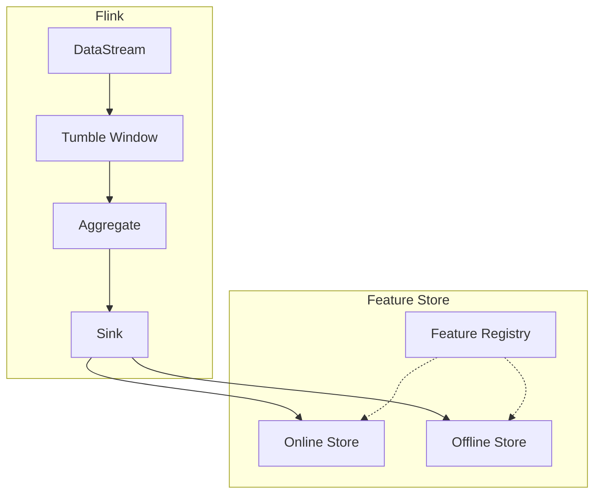

# Real-Time Feature Engineering and Feature Store Guide

> **Stage**: Flink/AI-ML | **Prerequisites**: [flink-sql-window-functions-deep-dive.md](../03-api/03.02-table-sql-api/flink-sql-window-functions-deep-dive.md) | **Formalization Level**: L3-L4

## Executive Summary

This document systematically describes real-time feature engineering methods in streaming machine learning, covering feature types, window aggregation, stateful feature computation, and integration solutions with Feast, Tecton, and other Feature Stores.

| Feature Type | Computation Complexity | State Requirement | Real-Time Capability |
|:--------:|:----------:|:--------:|:------:|
| Raw Feature | Low | None | Milliseconds |
| Window Aggregation | Medium | Window state | Seconds |
| Stateful | High | Keyed state | Milliseconds |
| Derived Feature | Medium | Depends on other features | Milliseconds |

---

## 1. Definitions

### Def-AI-10-01: Raw Feature

**Definition**: Features extracted directly from the data source without transformation:

$$f_{raw}: Event \rightarrow \mathcal{V}$$

**Examples**: User ID, timestamp, event type, raw numeric value

---

### Def-AI-10-02: Aggregated Feature

**Definition**: Features computed by aggregating events within a window:

$$f_{agg}(W) = \bigoplus_{e \in W} f_{raw}(e)$$

Where $\bigoplus$ is the aggregation operation (SUM, AVG, COUNT, MAX, MIN, etc.).

---

### Def-AI-10-03: Derived Feature

**Definition**: Features derived from existing features through transformation functions:

$$f_{derived} = \phi(f_1, f_2, ..., f_n)$$

**Transformation Types**:

- Mathematical operations: $f_1 + f_2$, $f_1 \cdot f_2$
- Encoding: One-hot, Embedding
- Normalization: Min-Max, Z-Score

---

### Def-AI-10-04: Feature Freshness

**Definition**: The degree to which a feature value reflects the latest data:

$$Freshness = 1 - \frac{t_{current} - t_{feature}}{t_{current} - t_{oldest}}$$

---

### Def-AI-10-05: Online Feature

**Definition**: Features computed in real-time for online inference:

$$f_{online} = Compute(Event_{stream})$$

**Latency Requirement**: Typically $< 100ms$

---

### Def-AI-10-06: Offline Feature

**Definition**: Features computed via batch processing for training:

$$f_{offline} = Compute(Dataset_{batch})$$

**Characteristics**: Can be pre-computed, stored in Feature Store

---

### Def-AI-10-07: Feature Drift

**Definition**: Statistical change in feature distribution over time:

$$Drift(f) = D(P_{train}(f) || P_{current}(f))$$

Where $D$ is a distribution distance metric (KL divergence, JS divergence, Wasserstein distance).

---

### Def-AI-10-08: Feature Consistency

**Definition**: Distribution consistency between online and offline features:

$$Consistency = 1 - |E[f_{online}] - E[f_{offline}]|$$

---

### Def-AI-10-09: Feature Transformation Chain

**Definition**: A feature transformation chain $\mathcal{T}$ is an ordered sequence of feature transformations:

$$\mathcal{T} = [\phi_1, \phi_2, ..., \phi_n], \quad f_{out} = (\phi_n \circ ... \circ \phi_1)(f_{in})$$

**Constraint**: The input dimension of each transformation must match the output dimension of the previous transformation.

---

### Def-AI-10-10: Feature Serving Latency

**Definition**: Feature serving latency $L_{serve}$ is the time interval from initiating a feature query to returning the feature value:

$$L_{serve} = L_{network} + L_{lookup} + L_{serialize}$$

Where $L_{lookup}$ includes cache hit or database query time.

---

## 2. Properties

### Thm-AI-10-01: Window Aggregation Correctness

**Theorem**: In windows with allowed lateness, aggregation results are eventually consistent:

$$\lim_{t \to \infty} \bigoplus_{e \in W(t)} f(e) = \bigoplus_{e \in W_{complete}} f(e)$$

**Proof**: As all late events within $allowed\_lateness$ arrive, the window state no longer changes, and the aggregation result converges to the full window aggregation value.

**∎**

---

### Thm-AI-10-02: Online-Offline Feature Consistency

**Theorem**: If online and offline use the same computation logic and input data, then features are consistent:

$$f_{online} = f_{offline} \iff Logic_{online} = Logic_{offline} \land Data_{online} = Data_{offline}$$

---

### Thm-AI-10-03: Feature Drift Detection Sensitivity

**Theorem**: The sensitivity $\alpha$ of drift detection and the false positive rate $\beta$ satisfy:

$$\alpha = 1 - \beta \cdot \frac{\sigma_{baseline}}{\sigma_{current}}$$

---

### Thm-AI-10-04: Feature Consistency Preservation Theorem

**Theorem**: Under Flink's Checkpoint mechanism, feature state remains consistent after failure recovery:

$$S_{recovered} = S_{pre\_failure} \iff \forall f \in State: checkpoint(f) = restore(f)$$

**Proof**:

1. Flink Checkpoint periodically takes consistent snapshots of operator states.
2. During recovery, state is loaded from the most recent snapshot.
3. Since input sources support replay (e.g., Kafka offset replay), unacknowledged events are reprocessed.
4. If the feature computation operator satisfies idempotency (e.g., incremental aggregation satisfies associativity), replay will not change the final state.

Therefore, the recovered feature state is consistent with the pre-failure state.

**∎**

---

### Lemma-AI-10-01: Stateful Feature Memory Upper Bound

**Lemma**: For features stored using keyed state, the per-key memory usage upper bound is:

$$Memory_{per\_key} \leq \sum_{i=1}^{n} (dim(f_i) \cdot sizeof(type(f_i)) + overhead_{state})$$

Where $overhead_{state}$ is the metadata overhead of the Flink state backend (RocksDB approx. 50-100 bytes/entry).

---

### Lemma-AI-10-02: Feature Drift Detection Lower Bound

**Lemma**: For drift detection based on sliding windows, the minimum detectable drift amount $\delta_{min}$ is limited by window size $W$:

$$\delta_{min} \geq \frac{c}{\sqrt{W}}$$

Where $c$ is a constant related to the confidence level.

**Proof**: By the Central Limit Theorem, the estimation error of the sample mean within the window is $O(1/\sqrt{W})$. Therefore, drifts smaller than this magnitude cannot be reliably detected.

**∎**

---

### Prop-AI-10-01: Window Feature Mergeability

**Proposition**: If aggregation operation $\bigoplus$ satisfies associativity and commutativity, then window features support incremental merging without retaining the raw event sequence.

---

## 3. Relations

### 3.1 Flink Window to Feature Store Mapping



---

## 4. Argumentation

### 4.1 Window Type Selection

| Window Type | Applicable Scenarios | State Size |
|:--------:|:---------|:--------:|
| Tumbling | Periodic statistics | Small |
| Sliding | Smooth metrics | Medium |
| Session | User behavior | Large |
| Global | Full statistics | Extremely large |

### 4.2 Feature Drift Detection Strategies

In production environments, feature drift may be triggered by seasonal changes, user behavior migration, business activities, and other factors. Effective detection strategies need to balance sensitivity and false positive rate:

**Strategy 1: Sliding Window Statistical Test**

- Maintain two sliding windows: Baseline window and Current window
- Periodically perform two-sample KS test or t-test
- Trigger drift alert when p-value < 0.05
- Pros: Solid theoretical foundation; Cons: Requires per-dimension testing for high-dimensional features

**Strategy 2: PSI (Population Stability Index)**

- Bin the feature distribution and compute PSI value
- $PSI < 0.1$: No significant drift
- $0.1 \leq PSI < 0.25$: Moderate drift
- $PSI \geq 0.25$: Significant drift
- Pros: Strong interpretability, widely used in finance; Cons: Binning strategy affects results

**Strategy 3: Online Learning Monitoring**

- Monitor distribution changes in online model predictions (e.g., entropy of predicted probabilities)
- Indirectly reflects input feature drift
- Pros: Directly related to business metrics; Cons: Cannot locate specific drifting features

**Selection Recommendation**: Use PSI + KS test for critical features; use online learning monitoring for coarse screening of large-scale feature sets.

### 4.3 Online-Offline Consistency Assurance

The root cause of training-serving skew is the inconsistency between online and offline feature computation paths. Engineering practices to ensure consistency include:

1. **Unified Computation Logic**: Use Flink SQL or unified UDFs to define feature computation, applied to both batch and stream jobs.
2. **Shared Feature Store**: Online and offline read feature definitions from the same registry (Feature Registry), avoiding "same name, different meaning".
3. **Backtracking Validation**: Periodically compare online feature values with offline feature values computed at the same timestamp; difference rate should be $< 0.1\%$.
4. **Time Travel**: During offline training, retrieve feature values by `event_timestamp` to avoid data leakage.

---

## 5. Proof / Engineering Argument

### 5.1 Window Aggregation Algorithm Correctness

**Incremental Aggregation**:

$$Agg_{t+1} = Combine(Agg_t, Value_{t+1})$$

**Mergeability Condition**: There exists a $Combine$ function satisfying associativity and commutativity.

**Formal Proof**:

Let the accumulator of aggregation function $Agg$ be $Acc$. Incremental aggregation requires:

$$Acc_{t+1} = Add(Acc_t, v_{t+1})$$

For late events $v_{late}$, if the window has already triggered output, merge support is needed:

$$Acc_{merged} = Merge(Acc_{window1}, Acc_{window2})$$

**Associativity**: $(a \oplus b) \oplus c = a \oplus (b \oplus c)$
**Commutativity**: $a \oplus b = b \oplus a$

Aggregations satisfying the above conditions (e.g., SUM, COUNT, MIN, MAX) necessarily produce results consistent with full recomputation. For AVG, it can be decomposed into a $(sum, count)$ pair, each satisfying associativity and commutativity, so AVG is also incrementally aggregatable.

**∎**

### 5.2 Feature Consistency Proof

**Scenario**: Online feature computation executes in a Flink streaming job, offline features execute in a Spark batch job. Both use the same feature definitions.

**Assumptions**:

- $Logic_{stream} \equiv Logic_{batch}$ (Computation logic equivalence)
- $Input_{stream}(t) = Input_{batch}(t)$ (Input data at timestamp $t$ is consistent)
- $State_{stream}(t_0) = State_{batch}(t_0)$ (Initial state is consistent)

**Proof**:

For any feature $f$ and time $t$:

Online computation: $f_{online}(t) = Logic_{stream}(Input_{stream}(t), State_{stream}(t-1))$
Offline computation: $f_{offline}(t) = Logic_{batch}(Input_{batch}(t), State_{batch}(t-1))$

By assumptions 1 and 2:
$$Logic_{stream}(Input_{stream}(t), \cdot) = Logic_{batch}(Input_{batch}(t), \cdot)$$

By assumption 3 and mathematical induction, for all $t \geq t_0$:
$$State_{stream}(t) = State_{batch}(t)$$

Therefore:
$$\forall t: f_{online}(t) = f_{offline}(t)$$

That is, online and offline features are completely consistent.

**∎**

---

## 6. Examples

### Example 1: Tumble Window User Behavior Features

```java
DataStream<FeatureVector> features = events
    .keyBy(Event::getUserId)
    .window(TumblingProcessingTimeWindows.of(Time.minutes(5)))
    .aggregate(new UserBehaviorAggregator());


import org.apache.flink.streaming.api.datastream.DataStream;
import org.apache.flink.api.common.functions.AggregateFunction;
import org.apache.flink.streaming.api.windowing.time.Time;

class UserBehaviorAggregator
    implements AggregateFunction<Event, UserAccumulator, FeatureVector> {

    @Override
    public UserAccumulator createAccumulator() {
        return new UserAccumulator();
    }

    @Override
    public UserAccumulator add(Event event, UserAccumulator acc) {
        acc.clickCount++;
        acc.totalSpent += event.getAmount();
        acc.sessionCount += event.isNewSession() ? 1 : 0;
        return acc;
    }

    @Override
    public FeatureVector getResult(UserAccumulator acc) {
        return new FeatureVector(
            acc.clickCount,
            acc.totalSpent / acc.clickCount, // avg spend per click
            acc.sessionCount
        );
    }

    @Override
    public UserAccumulator merge(UserAccumulator a, UserAccumulator b) {
        a.clickCount += b.clickCount;
        a.totalSpent += b.totalSpent;
        a.sessionCount += b.sessionCount;
        return a;
    }
}
```

---

### Example 2: Session Window Sequence Features

```java
DataStream<SessionFeatures> sessionFeatures = events
    .keyBy(Event::getUserId)
    .window(EventTimeSessionWindows.withGap(Time.minutes(30)))
    .process(new SessionFeatureProcessFunction());


import org.apache.flink.streaming.api.datastream.DataStream;
import org.apache.flink.streaming.api.windowing.time.Time;

class SessionFeatureProcessFunction
    extends ProcessWindowFunction<Event, SessionFeatures, String, TimeWindow> {

    @Override
    public void process(String userId, Context ctx,
                       Iterable<Event> events, Collector<SessionFeatures> out) {

        List<Event> eventList = new ArrayList<>();
        events.forEach(eventList::add);

        // Sequence features
        int eventCount = eventList.size();
        long duration = ctx.window().getEnd() - ctx.window().getStart();
        double avgTimeBetweenEvents = duration / (double) eventCount;

        // Path features
        List<String> path = eventList.stream()
            .map(Event::getPage)
            .collect(Collectors.toList());

        // Conversion rate
        long purchaseEvents = eventList.stream()
            .filter(e -> "purchase".equals(e.getType()))
            .count();
        double conversionRate = purchaseEvents / (double) eventCount;

        out.collect(new SessionFeatures(
            userId,
            eventCount,
            duration,
            avgTimeBetweenEvents,
            path,
            conversionRate
        ));
    }
}
```

---

### Example 3: Feast Feature Store Integration

```python
from feast import FeatureStore, Entity, Feature, FeatureView
from feast.types import Int64, Float64, String
from feast.value_type import ValueType
from datetime import timedelta

# Define entity
user = Entity(
    name="user_id",
    value_type=ValueType.STRING,
    description="User identifier"
)

# Define feature view
user_features_view = FeatureView(
    name="user_behavior_features",
    entities=["user_id"],
    ttl=timedelta(hours=24),
    features=[
        Feature(name="click_count_5m", dtype=Int64),
        Feature(name="avg_spend_per_click", dtype=Float64),
        Feature(name="session_count_1h", dtype=Int64),
        Feature(name="conversion_rate", dtype=Float64),
    ],
    online=True,
    source=user_behavior_source,
)

# Flink to Feast Sink
class FeastSink(SinkFunction[FeatureRow]):

    def __init__(self, repo_path: str):
        self.repo_path = repo_path
        self.store = None

    def open(self, runtime_context):
        self.store = FeatureStore(repo_path=self.repo_path)

    def invoke(self, value: FeatureRow, context):
        # Write to online store
        self.store.push(
            feature_view="user_behavior_features",
            df=pd.DataFrame([{
                "user_id": value.user_id,
                "click_count_5m": value.click_count,
                "avg_spend_per_click": value.avg_spend,
                "session_count_1h": value.session_count,
                "conversion_rate": value.conversion_rate,
                "event_timestamp": datetime.now()
            }])
        )
```

---
