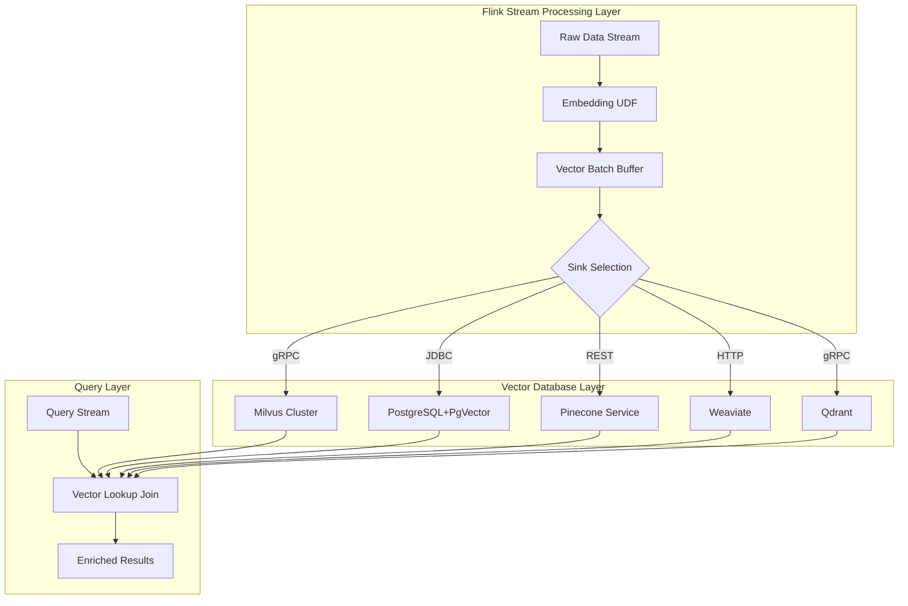
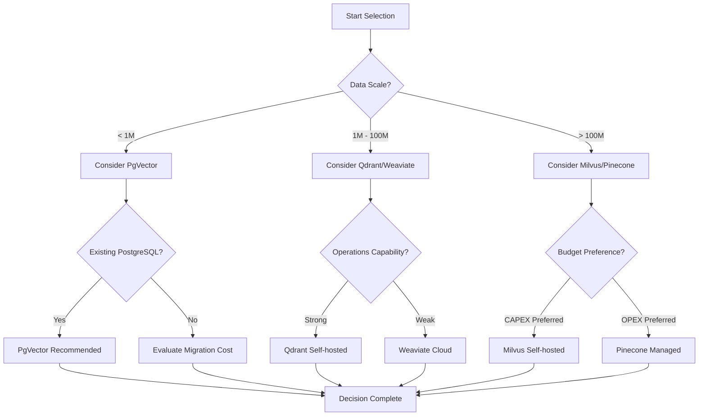
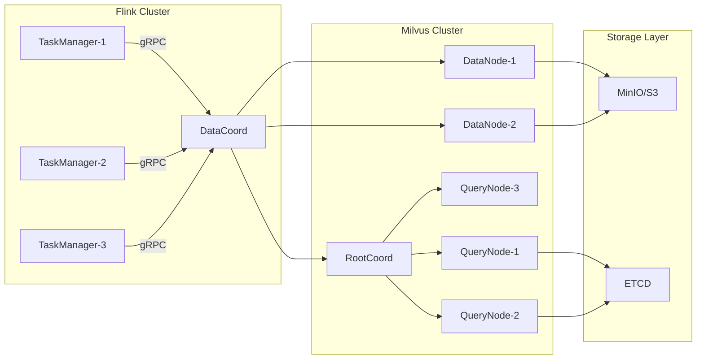
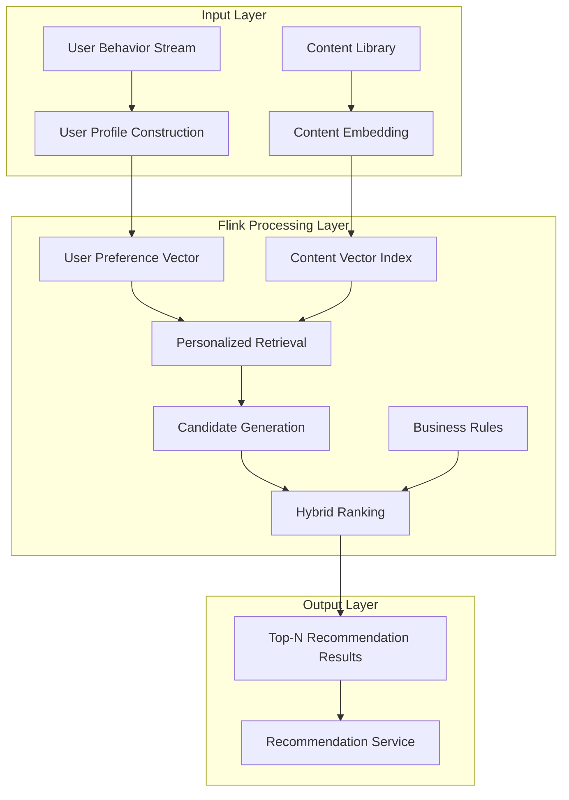
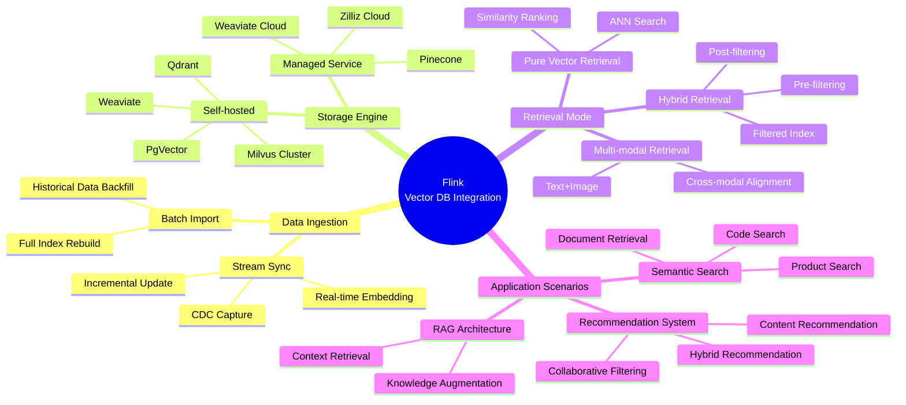
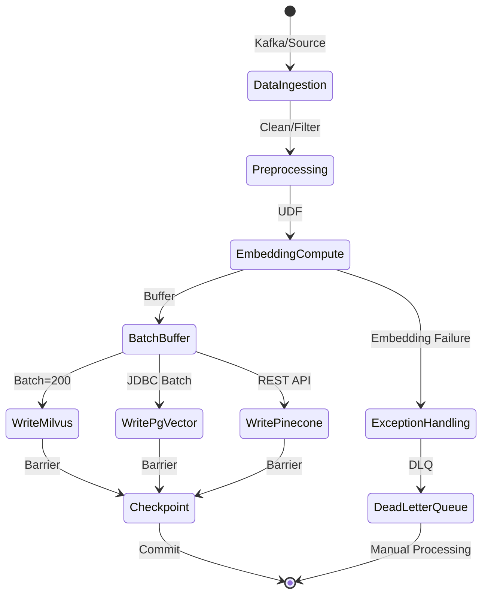
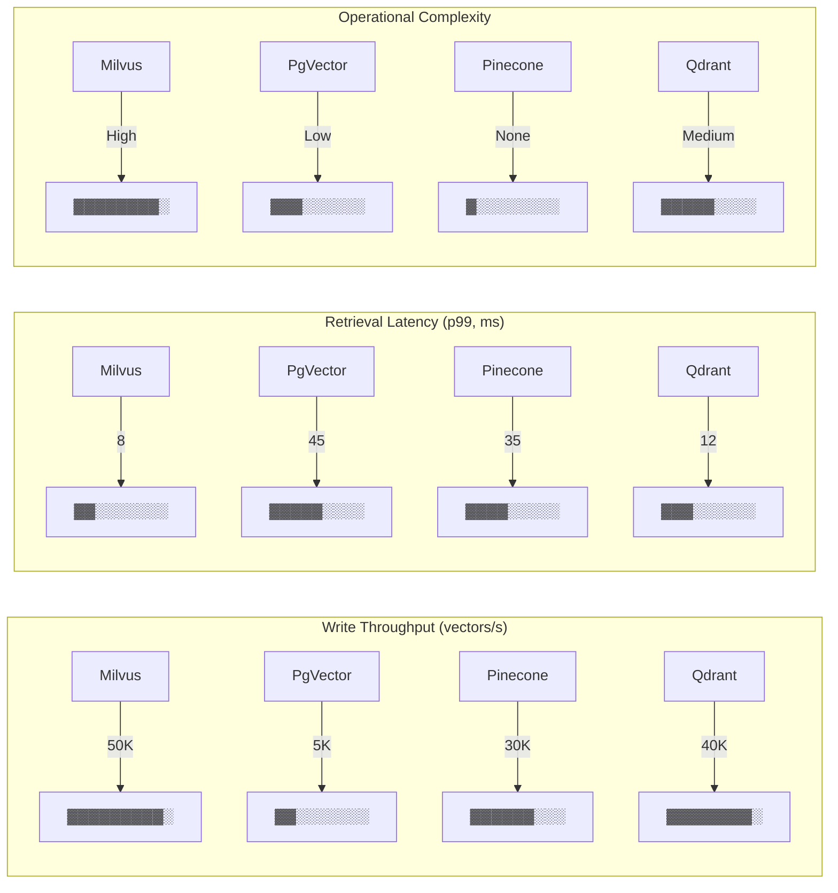

# Flink and Vector Database Integration - Milvus/PgVector/Pinecone

> Stage: Flink | Prerequisites: [11.4-flink-ml-inference.md](./flink-realtime-ml-inference.md), [JDBC Connector](../05-ecosystem/05.01-connectors/jdbc-connector-complete-guide.md) | Formalization Level: L3

## 1. Concept Definitions

### Def-F-12-10: Vector Database Connector

A vector database connector is a bidirectional data exchange abstraction between Flink and vector database systems, supporting streaming writes of high-dimensional vector data and similarity retrieval.

**Formal Definition:**

Let the vector database be $\mathcal{VDB}$, and the Flink data stream be $\mathcal{D}_F$. Then connector $C_{vdb}$ satisfies:

$$C_{vdb}: \mathcal{D}_F \times \mathbb{N}^d \rightarrow \mathcal{VDB} \times \mathbb{R}^{k \times d}$$

Where:

- $d$: vector dimension
- $k$: number of Top-K results returned by retrieval
- Input: Flink data stream + embedding vector $\mathbf{v} \in \mathbb{R}^d$
- Output: vector database write acknowledgment + similarity search results

**Interface Specification:**

```java
// [伪代码片段 - 不可直接运行] 仅展示核心逻辑
// Vector write interface
interface VectorSink<T> extends RichSinkFunction<T> {
    void write(VectorRecord<T> record);
    void flushBatch(List<VectorRecord<T>> batch);
}

// Vector retrieval interface
interface VectorLookupFunction extends TableFunction<Row> {
    @DataTypeHint("ROW<id STRING, vector ARRAY<FLOAT>, score FLOAT>")
    void eval(@DataTypeHint("ARRAY<FLOAT>") float[] queryVector, int topK);
}
```

---

### Def-F-12-11: Embedding Stream Synchronization

Embedding stream synchronization is the real-time conversion of structured data into vector representations through an embedding model, while guaranteeing transactional consistency with the original data stream.

**Formal Definition:**

Let the original data stream be $S_{raw}$, and the embedding model be $\mathcal{E}: \mathcal{X} \rightarrow \mathbb{R}^d$. Then the synchronization operator $\mathcal{S}_{emb}$ is defined as:

$$\mathcal{S}_{emb}: S_{raw} \rightarrow S_{vector} \text{ where } S_{vector}(t) = \langle id, \mathcal{E}(x_t), metadata_t, timestamp_t \rangle$$

**Consistency Guarantees:**

$$\forall t: commit(S_{raw}, t) \Rightarrow commit(S_{vector}, t) \text{ (At-Least-Once)}$$

$$\forall t: exactly\_once(S_{raw}, t) \Leftrightarrow exactly\_once(S_{vector}, t) \text{ (Exactly-Once)}$$

**Key Components:**

| Component | Responsibility | Implementation Example |
|------|------|----------|
| Embedding UDF | Feature vectorization | `EmbeddingFunction` |
| Checkpoint Barrier | Consistency marker | Flink Checkpoint |
| Idempotent Writer | Idempotent write | UPSERT based on `id` |

---

### Def-F-12-12: Similarity Search Sink

Similarity Search Sink is a Flink output endpoint that supports real-time vector retrieval queries, exposing the ANN (Approximate Nearest Neighbor) capability of the vector database as a stream processing operator.

**Formal Definition:**

Let the query vector be $\mathbf{q} \in \mathbb{R}^d$, and the distance metric be $\delta: \mathbb{R}^d \times \mathbb{R}^d \rightarrow \mathbb{R}_+$. Then search Sink $\mathcal{K}$:

$$\mathcal{K}(\mathbf{q}, k) = \{ (\mathbf{v}_i, \delta(\mathbf{q}, \mathbf{v}_i)) \mid \mathbf{v}_i \in \mathcal{VDB}, \delta(\mathbf{q}, \mathbf{v}_i) \leq \delta(\mathbf{q}, \mathbf{v}_{k+1}) \}$$

**Supported Similarity Metrics:**

| Metric | Formula | Use Cases |
|------|------|----------|
| Euclidean Distance (L2) | $\|\mathbf{q} - \mathbf{v}\|_2$ | Geometric space similarity |
| Cosine Similarity | $\frac{\mathbf{q} \cdot \mathbf{v}}{\|\mathbf{q}\| \|\mathbf{v}\|}$ | Directional consistency |
| Inner Product (IP) | $\mathbf{q} \cdot \mathbf{v}$ | Semantic relevance |

---

## 2. Property Derivations

### Prop-F-12-01: Batch Write Throughput Optimization

**Proposition:** The throughput $T$ of a vector database connector has a sublinear relationship with batch size $B$.

$$T(B) = \frac{B}{L_{net} + B \cdot L_{proc}} \cdot \frac{1}{1 + \alpha \cdot e^{-\beta B}}$$

Where:

- $L_{net}$: network latency
- $L_{proc}$: per-record processing latency
- $\alpha, \beta$: batch processing efficiency coefficients

**Optimal Batch Derivation:**

$$\frac{dT}{dB} = 0 \Rightarrow B_{opt} \approx \sqrt{\frac{L_{net}}{L_{proc} \cdot \beta}}$$

**Engineering Significance:** For high-dimensional vectors ($d \geq 768$), the typical optimal batch size is 100-500 records.

---

### Lemma-F-12-01: Relationship Between Vector Dimension and Retrieval Accuracy

**Lemma:** Under a given index budget, the recall rate $R$ of approximate nearest neighbor retrieval satisfies:

$$R(d) = R_0 \cdot \left(1 - \gamma \cdot \frac{d - d_0}{d_{max}}\right)$$

Where $\gamma$ is an index-type-related constant, and HNSW index $\gamma_{HNSW} < \gamma_{IVF}$.

**Proof Sketch:**

1. In high-dimensional spaces, distances between points tend to concentrate (curse of dimensionality)
2. HNSW alleviates this effect by maintaining local connectivity through hierarchical graph structures
3. Increasing dimension reduces index partitioning granularity, leading to decreased recall

---

### Prop-F-12-02: Hybrid Query Latency Lower Bound

**Proposition:** The end-to-end latency $L_{hybrid}$ of vector + structured hybrid queries satisfies:

$$L_{hybrid} \geq \max(L_{vector}, L_{filter}) + L_{merge}$$

**Implementation Strategy Comparison:**

| Strategy | Latency | Use Cases |
|------|------|----------|
| Vector first, filter later | $L_{vector} + L_{filter}^{small}$ | High-selectivity vector retrieval |
| Filter first, vector later | $L_{filter} + L_{vector}^{small}$ | High-selectivity structured filtering |
| Joint index | $\approx L_{vector}$ | Frequent hybrid queries |

---

## 3. Relationship Establishment

### 3.1 Vector Database Ecosystem Mapping

**Mainstream Solution Comparison Matrix:**

| Feature | Milvus | PgVector | Pinecone | Weaviate | Qdrant |
|------|--------|----------|----------|----------|--------|
| **Deployment Mode** | Self-hosted/K8s | PostgreSQL Extension | Fully Managed | Self-hosted/Cloud | Self-hosted/Cloud |
| **Max Dimension** | 32,768 | 16,000 | 20,000+ | 65,536 | 65,536 |
| **Index Types** | IVF/HNSW/FLAT | HNSW/ivfflat | Auto-optimized | HNSW | HNSW |
| **Flink Integration** | Native Connector | JDBC + SQL | REST API | HTTP/gRPC | gRPC |
| **Hybrid Query** | Full Support | Native SQL | Limited | GraphQL | Full Support |
| **Typical Latency** | <10ms | <50ms | <50ms | <20ms | <10ms |
| **Scale** | Billion-level | Million-level | Billion-level | Hundred-million-level | Hundred-million-level |

### 3.2 Flink and Vector Database Integration Architecture



### 3.3 Relationship with Flink Ecosystem

| Related Module | Relationship Type | Description |
|----------|----------|------|
| Flink ML | Upstream Dependency | Provides embedding model inference |
| JDBC Connector | Implementation Foundation | PgVector integration is based on this |
| Async I/O | Performance Optimization | Vector retrieval parallelization |
| Table API/SQL | User Interface | Declarative vector operations |
| Checkpoint | Consistency Guarantee | Exactly-Once write |

---

## 4. Argumentation

### 4.1 Vector Database Selection Decision Tree



### 4.2 Index Type Selection Analysis

**HNSW vs IVF Comparison Argument:**

| Dimension | HNSW (Hierarchical NSW) | IVF (Inverted File) |
|------|-------------------------|---------------------|
| **Build Cost** | $O(n \log n)$, higher | $O(n)$, lower |
| **Memory Usage** | High (graph structure) | Medium (cluster centers) |
| **Retrieval Speed** | Fast, $O(\log n)$ | Medium, depends on $nprobe$ |
| **Dynamic Update** | Supports incremental | Requires rebuild |
| **Recall Rate** | >95% @ef=128 | 85-95% @nprobe=128 |

**Selection Recommendations:**

- **HNSW**: Real-time write scenarios, recall-sensitive, sufficient memory
- **IVF**: Batch import scenarios, memory-constrained, periodic rebuild acceptable

### 4.3 Hybrid Query Implementation Strategy Argumentation

**Scenario:** Retrieve similar product vectors related to the "electronics" category.

**Strategy A - Pre-filtering:**

```sql
-- PgVector example
SELECT * FROM products
WHERE category = 'electronics'
ORDER BY embedding <-> ?
LIMIT 10;
```

- Pros: Precise filtering, no redundant computation
- Cons: Vector index becomes ineffective when category data is sparse

**Strategy B - Post-filtering:**

```java
// [伪代码片段 - 不可直接运行] 仅展示核心逻辑
// Milvus example
// 1. Execute ANN search first
List<VectorRecord> candidates = milvus.search(queryVector, topK=100);
// 2. In-memory filtering
candidates.stream()
    .filter(r -> r.getCategory().equals("electronics"))
    .limit(10)
    .collect();
```

- Pros: High vector retrieval efficiency
- Cons: May return fewer than k results

**Strategy C - Filtered Index:**

```python
# Milvus partition key
milvus.create_partition("products_electronics")
milvus.load_partition("products_electronics")
```

- Pros: Combines advantages of both approaches
- Cons: Increased storage overhead

---

## 5. Engineering Argument

### 5.1 Flink→Milvus Integration Solution

**Architecture Argument:**

Milvus's distributed architecture naturally aligns with Flink stream processing:



**Key Parameter Argument:**

| Parameter | Recommended Value | Argument Basis |
|------|--------|----------|
| `writeBufferSize` | 10MB | Balance memory and throughput |
| `batchSize` | 200-500 | See Prop-F-12-01 |
| `flushInterval` | 5s | Latency vs persistence tradeoff |
| `indexType` | HNSW | Optimal for real-time scenarios |
| `M` | 16 | HNSW layer count control |
| `efConstruction` | 128 | Build quality vs speed |

### 5.2 PgVector and Flink JDBC Integration

**Feasibility Argument:**

PgVector, as a PostgreSQL extension, can directly leverage the Flink JDBC Connector:

```java
// [伪代码片段 - 不可直接运行] 仅展示核心逻辑
// Table definition mapping
CREATE TABLE vector_items (
    id STRING,
    embedding ARRAY<FLOAT>,  -- mapped to vector type
    metadata MAP<STRING, STRING>,
    PRIMARY KEY (id) NOT ENFORCED
) WITH (
    'connector' = 'jdbc',
    'url' = 'jdbc:postgresql://host/db?stringtype=unspecified',
    'table-name' = 'items',
    'driver' = 'org.postgresql.Driver'
);
```

**Performance Boundaries:**

- **Write Throughput**: ~5,000 vectors/s (single PgVector instance)
- **Retrieval Latency**: <50ms (million-level data, HNSW index)
- **Recommended Scale**: <10M vectors, dimension <1536

### 5.3 Pinecone Managed Service Integration

**Architecture Argument:**

Pinecone's serverless architecture simplifies Flink integration, but introduces network latency considerations:

```
Flink TaskManager → Internet → Pinecone API Gateway → Vector Index
          ↓                                          ↓
    Latency: 10-50ms                          Latency: <5ms
```

**Optimization Strategies:**

1. **Batch Writing**: Aggregate to reduce API call frequency
2. **Async Retrieval**: Use Flink Async I/O to reduce blocking
3. **Regional Deployment**: Deploy Flink and Pinecone in the same region

---

## 6. Examples

### 6.1 Flink→Milvus Real-time Sync Pipeline

```java
import org.apache.flink.streaming.api.datastream.DataStream;
import org.apache.flink.streaming.connectors.milvus.*;

import org.apache.flink.streaming.api.environment.StreamExecutionEnvironment;


public class MilvusSyncPipeline {
    public static void main(String[] args) throws Exception {
        StreamExecutionEnvironment env =
            StreamExecutionEnvironment.getExecutionEnvironment();

        // Source data stream: product descriptions
        DataStream<ProductDocument> source = env
            .addSource(new KafkaSource<>())
            .map(new EmbeddingUDF("text-embedding-3-small"));

        // Milvus Sink configuration
        MilvusSinkConfig config = MilvusSinkConfig.builder()
            .withHost("milvus-cluster.default.svc")
            .withPort(19530)
            .withCollection("product_vectors")
            .withBatchSize(200)
            .withFlushInterval(Duration.ofSeconds(5))
            .build();

        // Embedding transformation + batch write
        source
            .map(doc -> VectorRecord.builder()
                .id(doc.getId())
                .vector(doc.getEmbedding())  // float[1536]
                .field("name", doc.getName())
                .field("category", doc.getCategory())
                .field("price", doc.getPrice())
                .build())
            .addSink(new MilvusSink<>(config))
            .name("Milvus Vector Sink");

        env.execute("Product Vector Sync");
    }
}

// Embedding UDF implementation
class EmbeddingUDF extends RichMapFunction<String, ProductDocument> {
    private transient EmbeddingClient client;

    @Override
    public void open(Configuration params) {
        client = EmbeddingClient.create("text-embedding-3-small");
    }

    @Override
    public ProductDocument map(String description) {
        float[] embedding = client.embed(description);
        return new ProductDocument(description, embedding);
    }
}
```

---

### 6.2 Real-time Semantic Search Pipeline

**Scenario:** User inputs a query, and similar documents are returned in real time.

```java
// Vector retrieval Lookup Join
TableResult result = tEnv.sqlQuery("""
    SELECT
        q.query_id,
        d.doc_id,
        d.title,
        d.content,
        similarity_score
    FROM query_stream q
    JOIN LATERAL TABLE(
        milvus_lookup(
            q.query_embedding,  -- query vector
            'doc_vectors',      -- collection name
            10,                 -- topK
            'COSINE'            -- similarity metric
        )
    ) AS d(doc_id, embedding, title, content, similarity_score)
    ON TRUE
    WHERE similarity_score > 0.85
""");

// Lookup Function implementation
class MilvusLookupFunction extends TableFunction<Row> {
    private MilvusClient client;

    public void eval(float[] queryVector, String collection,
                     int topK, String metric) {
        SearchResults results = client.search(
            SearchParam.newBuilder()
                .withCollectionName(collection)
                .withVectors(Collections.singletonList(queryVector))
                .withTopK(topK)
                .withMetricType(MetricType.valueOf(metric))
                .build()
        );

        for (SearchResult result : results.getResults()) {
            collect(Row.of(
                result.getId(),
                result.getVector(),
                result.getField("title"),
                result.getField("content"),
                result.getScore()
            ));
        }
    }
}
```

---

### 6.3 Hybrid Recommendation System

**Scenario:** Combining user profiles (structured) + content similarity (vectors) for recommendations.



```java

// [伪代码片段 - 不可直接运行] 仅展示核心逻辑
import org.apache.flink.streaming.api.datastream.DataStream;
import org.apache.flink.streaming.api.windowing.time.Time;

// Hybrid recommendation implementation
DataStream<Recommendation> recommendations =
    userBehaviorStream
        // 1. Build real-time user interest vector
        .keyBy(UserBehavior::getUserId)
        .window(TumblingEventTimeWindows.of(Time.minutes(5)))
        .aggregate(new InterestVectorAggregate())

        // 2. Vector retrieval to get candidates
        .flatMap(new AsyncFunction<UserVector, Candidate>() {
            @Override
            public void asyncInvoke(UserVector userVec,
                                   ResultFuture<Candidate> resultFuture) {
                // Async call to Milvus
                milvusAsync.search(
                    userVec.getInterestVector(),
                    topK = 100,
                    filter = "status = 'active'"  // structured filter
                ).thenAccept(results ->
                    resultFuture.complete(results.stream()
                        .map(r -> new Candidate(r.getId(), r.getScore()))
                        .collect(Collectors.toList()))
                );
            }
        })

        // 3. Fine ranking (real-time feature joining)
        .keyBy(Candidate::getItemId)
        .connect(itemFeatureStream)
        .process(new RankingProcessFunction())

        // 4. Diversity post-processing
        .keyBy(Rec::getUserId)
        .process(new DiversityRerankFunction(topN = 20));
```

---

## 7. Visualizations

### 7.1 Vector Database Integration Panorama



### 7.2 Vector Write Pipeline Execution Tree



### 7.3 Performance Comparison Matrix



---

## 8. References
