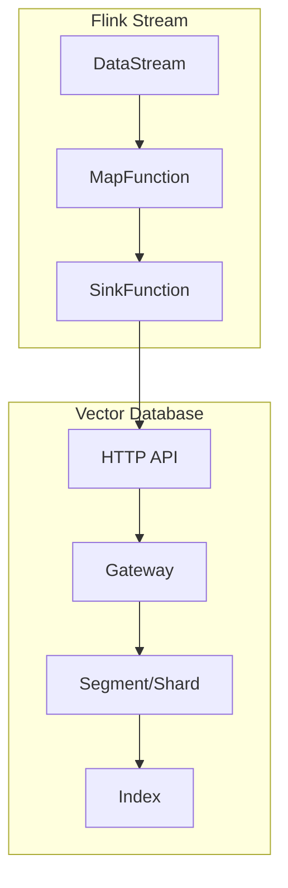
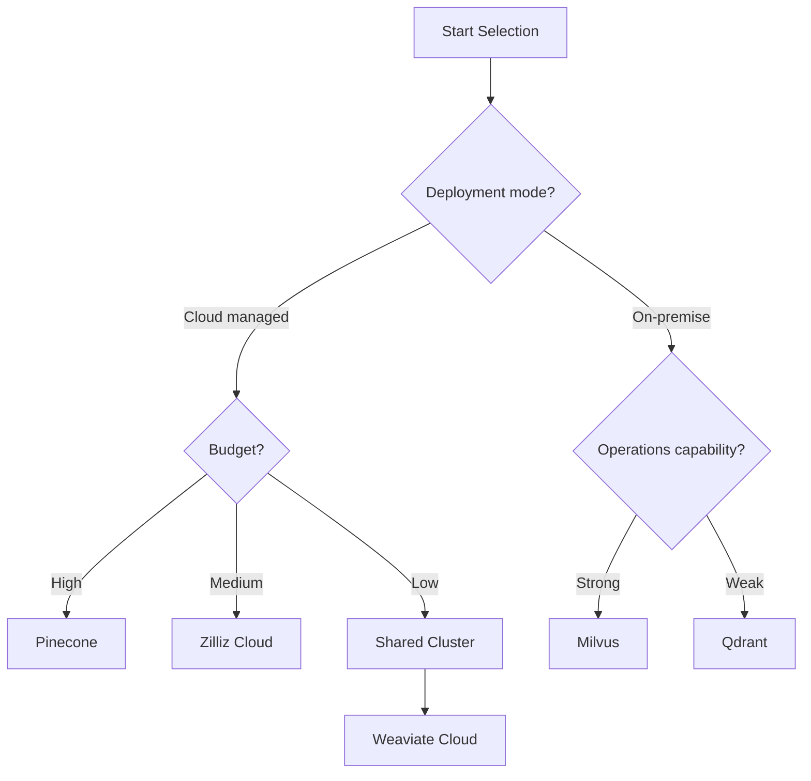
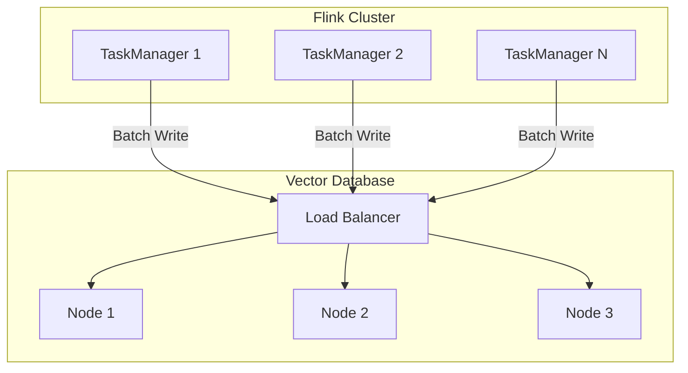
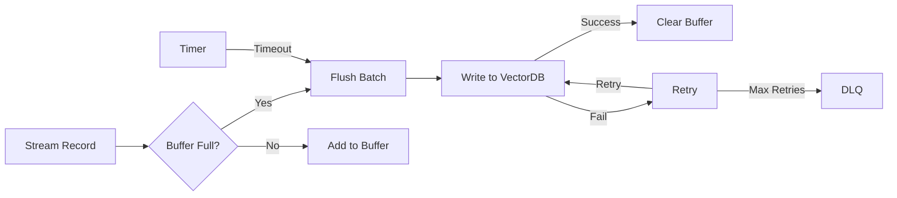

# Vector Database Streaming Integration Guide

> **Stage**: Flink/AI-ML | **Prerequisites**: [Vector Database Basics](./vector-database-integration.md) | **Formalization Level**: L3-L4

## Executive Summary

This document elaborates on integration solutions for mainstream vector databases in streaming scenarios, covering streaming write optimization, batching strategies, consistency model comparison, and selection recommendations for Milvus, Pinecone, Weaviate, and Qdrant.

| Vector Database | Streaming Write | Incremental Update | Batch Optimization | Cloud-Native |
|:----------:|:--------:|:--------:|:--------:|:------:|
| Milvus | ✅ Excellent | ✅ Supported | ✅ Auto | ✅ Yes |
| Pinecone | ✅ Excellent | ✅ Supported | ✅ Managed | ✅ Fully Managed |
| Weaviate | ✅ Good | ✅ Supported | ⚠️ Manual | ✅ Yes |
| Qdrant | ✅ Good | ✅ Supported | ✅ Auto | ⚠️ Semi-Managed |
| Chroma | ⚠️ Limited | ⚠️ Limited | ❌ Weak | ❌ No |

---

## 1. Concept Definitions (Definitions)

### Def-AI-09-01: Streaming Vector Index

**Definition**: A streaming vector index is a vector storage mechanism that supports continuous data inflow:

$$I_{stream} = \{(v_i, m_i, t_i) | v_i \in \mathbb{R}^d, m_i \in \mathcal{M}, t_i \in \mathbb{T}\}$$

Where:

- $v_i$: Vector
- $m_i$: Metadata
- $t_i$: Timestamp

---

### Def-AI-09-02: Incremental Index Update

**Definition**: Incremental index update modifies only local parts of the index rather than rebuilding it entirely:

$$\Delta I = I_{t+1} \ominus I_t = \{add(V^+), remove(V^-), update(V^\pm)\}$$

**Operational Complexity**: $O(|\Delta I|)$ vs $O(|I|)$ for full rebuild

---

### Def-AI-09-03: Batch Write Strategy

**Definition**: A batch write strategy determines how streaming data is accumulated into batches for writing:

$$B^* = \arg\min_B \left( \frac{|B|}{Throughput(B)} + \lambda \cdot Latency(B) \right)$$

**Strategy Types**:

- Fixed size: $|B| = const$
- Fixed time: $\Delta t = const$
- Hybrid strategy: $\min(|B|, \Delta t)$

---

### Def-AI-09-04: Index Consistency

**Definition**: The index consistency model defines when write operations become visible to queries:

$$Visibility(write_{t}, query_{t'}) = \begin{cases} immediate & t' > t \\ eventual & \exists \delta: t' > t + \delta \\ session & same\_session(t', t) \end{cases}$$

---

### Def-AI-09-05: Approximate Nearest Neighbor

**Definition**: ANN accelerates vector search under acceptable precision loss:

$$ANN(q, I, \epsilon) = \{v | dist(q, v) \leq (1 + \epsilon) \cdot dist(q, v^*)\}$$

Where $v^*$ is the exact nearest neighbor.

---

### Def-AI-09-06: Vector Dimension and Index Efficiency

**Definition**: The impact of vector dimension $d$ on index efficiency:

$$Efficiency(d) = \frac{1}{\alpha \cdot d + \beta \cdot \log |I|}$$

High-dimensional vectors ($d > 1000$) usually require dimensionality reduction or special index structures.

---

## 2. Property Derivation (Properties)

### Thm-AI-09-01: Optimal Batch Write Size

**Theorem**: The optimal batch write size $B^*$ satisfies:

$$B^* = \sqrt{\frac{2 \cdot L_{fixed} \cdot \lambda}{L_{variable}}}$$

Where:

- $L_{fixed}$: Fixed overhead (connection establishment, transaction)
- $L_{variable}$: Per-vector variable overhead
- $\lambda$: Latency weight factor

---

### Thm-AI-09-02: Index Eventual Consistency

**Theorem**: In asynchronous write mode, the upper bound of index eventual consistency time is:

$$T_{consistent} \leq T_{flush} + T_{propagate} + T_{merge}$$

**Proof**: Obtained by accumulating flush latency, propagation latency, and merge latency.

---

### Thm-AI-09-03: Query Latency vs Recall Trade-off

**Theorem**: ANN query latency $L$ and recall $R$ satisfy:

$$L \propto \frac{1}{1 - R}$$

That is, improving recall necessarily increases query latency.

---

### Thm-AI-09-04: Streaming Write Throughput Upper Bound

**Theorem**: Streaming write throughput $\Theta$ is limited by:

$$\Theta \leq \min(\Theta_{network}, \Theta_{index}, \Theta_{storage})$$

---

## 3. Relations Establishment (Relations)

### 3.1 Vector Database to Flink Sink Mapping



### 3.2 Selection Decision Matrix

| Requirement | Recommendation | Rationale |
|:-----|:-----|:-----|
| High-throughput streaming writes | Milvus/Qdrant | Excellent batch writing |
| Fully managed cloud service | Pinecone | Zero operations |
| Complex metadata filtering | Weaviate | GraphQL support |
| Edge deployment | Qdrant | Lightweight |
| Cost-sensitive | Milvus self-hosted | Open source and free |

---

## 4. Argumentation Process (Argumentation)

### 4.1 Vector Database Selection Decision Tree



---

## 5. Formal Proof / Engineering Argument (Proof)

### 5.1 Batch Write Throughput Analysis

**Model**: M/G/1 queuing model

**Parameters**:

- Arrival rate: $\lambda$
- Service rate: $\mu = \frac{B}{L_{batch}}$

**Stability condition**: $\lambda < \mu$

**Optimal batch**: $B^* = \frac{\lambda \cdot L_{fixed}}{1 - \rho}$, where $\rho = \lambda / \mu$

---

## 6. Example Verification (Examples)

### Example 1: Milvus Streaming Integration

```java
import io.milvus.client.MilvusServiceClient;
import io.milvus.param.dml.*;

public class MilvusStreamingSink extends RichSinkFunction<Embedding> {

    private MilvusServiceClient client;
    private List<InsertParam.Field> batchBuffer;
    private static final int BATCH_SIZE = 100;

    @Override
    public void open(Configuration parameters) {
        client = new MilvusServiceClient(
            ConnectParam.newBuilder()
                .withHost("localhost")
                .withPort(19530)
                .build()
        );
        batchBuffer = new ArrayList<>();
    }

    @Override
    public void invoke(Embedding value, Context context) {
        batchBuffer.add(buildField(value));

        if (batchBuffer.size() >= BATCH_SIZE) {
            flush();
        }
    }

    private void flush() {
        InsertParam insertParam = InsertParam.newBuilder()
            .withCollectionName("embeddings")
            .withFields(batchBuffer)
            .build();

        client.insert(insertParam);
        batchBuffer.clear();
    }
}
```

---

### Example 2: Pinecone Batch Write Optimization

```java
public class PineconeBatchSink extends RichSinkFunction<VectorRecord> {

    private PineconeClient client;
    private List<Vector> upsertBuffer;
    private static final int BATCH_SIZE = 100;
    private static final int MAX_RETRIES = 3;

    @Override
    public void open(Configuration parameters) {
        client = new PineconeClient.Builder()
            .withApiKey(System.getenv("PINECONE_API_KEY"))
            .withEnvironment("us-west1-gcp")
            .build();
        upsertBuffer = new ArrayList<>();
    }

    @Override
    public void invoke(VectorRecord record, Context context) {
        upsertBuffer.add(Vector.newBuilder()
            .setId(record.getId())
            .addAllValues(floatArrayToList(record.getValues()))
            .setMetadata(structFromMap(record.getMetadata()))
            .build());

        if (upsertBuffer.size() >= BATCH_SIZE) {
            flushWithRetry();
        }
    }

    private void flushWithRetry() {
        int attempts = 0;
        while (attempts < MAX_RETRIES) {
            try {
                UpsertRequest request = UpsertRequest.newBuilder()
                    .setNamespace("default")
                    .addAllVectors(upsertBuffer)
                    .build();

                client.getAsyncConnection().upsert(request).get();
                upsertBuffer.clear();
                return;
            } catch (Exception e) {
                attempts++;
                if (attempts >= MAX_RETRIES) {
                    throw new RuntimeException("Failed after retries", e);
                }
                Thread.sleep(1000 * attempts); // Exponential backoff
            }
        }
    }
}
```

---

### Example 3: Custom VectorDB Sink

```java
public abstract class VectorDBSink<T> extends RichSinkFunction<T> {

    protected List<T> buffer;
    protected int batchSize;
    protected long flushIntervalMs;
    private transient ScheduledExecutorService scheduler;

    public VectorDBSink(int batchSize, long flushIntervalMs) {
        this.batchSize = batchSize;
        this.flushIntervalMs = flushIntervalMs;
    }

    @Override
    public void open(Configuration parameters) {
        buffer = new ArrayList<>();
        scheduler = Executors.newScheduledThreadPool(1);
        scheduler.scheduleAtFixedRate(
            this::flush,
            flushIntervalMs,
            flushIntervalMs,
            TimeUnit.MILLISECONDS
        );
    }

    @Override
    public void invoke(T value, Context context) {
        synchronized (buffer) {
            buffer.add(value);
            if (buffer.size() >= batchSize) {
                flush();
            }
        }
    }

    protected abstract void writeBatch(List<T> batch);

    private void flush() {
        synchronized (buffer) {
            if (!buffer.isEmpty()) {
                List<T> batch = new ArrayList<>(buffer);
                buffer.clear();
                writeBatch(batch);
            }
        }
    }

    @Override
    public void close() {
        scheduler.shutdown();
        flush();
    }
}
```

---

## 7. Visualizations (Visualizations)

### Vector Database Integration Architecture Diagram



### Batch Write Flowchart



---

## 8. References (References)
