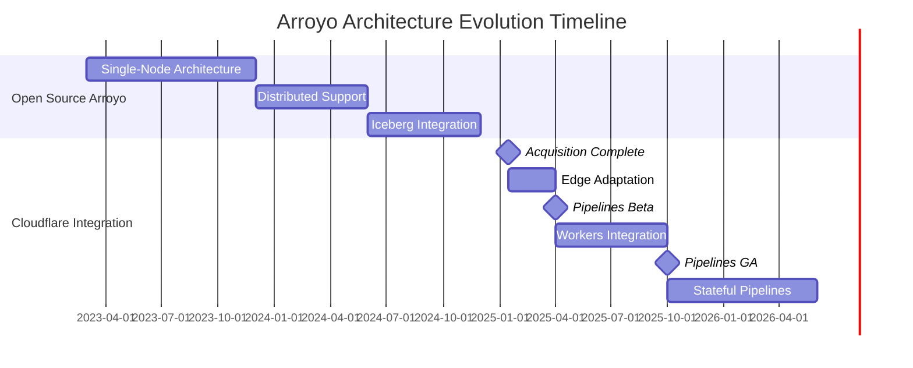

# Arroyo + Cloudflare Progress Tracking

> **Acquisition Date**: January 2025
> **Tracking Status**: Continuously Updated
> **Sources**: <https://www.arroyo.dev/>, <https://www.cloudflare.com/developer-platform/pipelines>
> **Last Updated**: 2026-04-05

---

## Key Milestones

| Time | Milestone | Status | Notes |
|------|--------|------|------|
| 2023 Q1 | Arroyo 0.1 Open Source Release | ✅ Complete | First open source release of Rust-native stream processing engine |
| 2023 Q3 | Sliding Window Optimization | ✅ Complete | Window algorithm with 10x performance improvement |
| 2024 Q2 | Web UI Console Improvements | ✅ Complete | Production-grade visual operations capability |
| 2024 Q4 | Iceberg Integration Release | ✅ Complete | Lakehouse unified stream-batch processing |
| **2025 Q1** | **Cloudflare Acquires Arroyo** | ✅ Complete | Commercial turning point |
| 2025 Q2 | Cloudflare Pipelines Beta | ✅ Complete | Edge-native stream processing service launched |
| **2025 Q4** | **Cloudflare Pipelines GA** | ✅ Complete | Generally available |
| 2026 Q1 | Workers Deep Integration | 🔄 In Progress | Enhanced compute capabilities |
| 2026 Q2 | Stateful Pipelines | 📋 Planned | State management enhancements |
| 2026 Q3 | Multi-Region Deployment | 📋 Planned | Global distributed stream processing |

---

## Progress Tracking

### Cloudflare Pipelines

| Feature | Status | Doc Link | Updated | Version |
|------|------|----------|----------|------|
| **Core Features** |
| Beta Version | ✅ Available | [Cloudflare Docs](https://developers.cloudflare.com/pipelines/) | 2025-04 | - |
| GA Version | ✅ Available | [GA Announcement](https://blog.cloudflare.com/) | 2025-10 | v1.0 |
| HTTP Data Source | ✅ Available | - | 2025-04 | - |
| Kafka Integration | ✅ Available | [Kafka Source](https://developers.cloudflare.com/pipelines/) | 2025-06 | - |
| **Storage Integration** |
| R2 Integration | ✅ Available | [R2 Sink](https://developers.cloudflare.com/pipelines/) | 2025-04 | - |
| D1 Integration | ✅ Available | [D1 Sink](https://developers.cloudflare.com/pipelines/sinks/d1/) | 2025-08 | - |
| KV Integration | ✅ Available | [KV Sink](https://developers.cloudflare.com/pipelines/sinks/kv/) | 2025-06 | - |
| Queues Integration | ✅ Available | [Queues Sink](https://developers.cloudflare.com/pipelines/sinks/queues/) | 2025-04 | - |
| **Compute Integration** |
| Workers Invocation | 🔄 In Development | - | 2026-01 | - |
| Durable Objects | 📋 Planned | - | - | - |
| **Advanced Features** |
| Stateful Pipelines | 🔄 In Development | - | 2026-01 | - |
| Window Function Enhancements | ✅ Available | - | 2025-08 | - |
| Exactly-Once Semantics | 📋 Planned | - | - | - |
| Schema Registry | 📋 Planned | - | - | - |

### Arroyo Open Source Version

| Version | Status | Release Date | Major Changes |
|------|------|----------|----------|
| v0.14.0 | Archived | 2024-10 | Iceberg support, performance optimization |
| v0.15.0 | Current Stable | 2025-02 | Cloudflare integration, R2 connector |
| v0.16.0 | In Development | Expected 2026-Q2 | Workers UDF support, state management enhancements |
| v0.17.0 | In Planning | Expected 2026-Q3 | Distributed deployment improvements, monitoring enhancements |

**GitHub Statistics Monitoring:**

| Metric | 2024 Q4 | 2025 Q1 | 2025 Q4 | Current Trend |
|------|---------|---------|---------|----------|
| Stars | 1.8k | 3.2k | 4.5k | ↑ Steady growth |
| Contributors | 15 | 23 | 31 | ↑ Community expanding |
| Commits/month | 45 | 62 | 48 | → Stable |
| Open Issues | 89 | 76 | 82 | → Controllable |
| PRs merged/month | 12 | 18 | 15 | → Active |

---

## News and Updates

### 2026

#### 2026-04-05

- **Cloudflare Pipelines Workers Integration Preview**: Official blog published deep integration plan for Workers and Pipelines, supporting direct invocation of Workers functions in pipelines for complex transformations
- **Arroyo v0.16.0-alpha Release**: Added WebAssembly UDF support, allowing custom functions written in Rust/C

#### 2026-03-15

- **First Performance Report Post-GA**: Cloudflare officially published Pipelines GA performance benchmarks, Nexmark throughput improved 40% over Beta
- **First Anniversary of Acquisition**: Cloudflare blog reviewed Arroyo integration journey, announced continued maintenance of open source version

#### 2026-02-20

- **Multi-Region Stream Processing Roadmap**: Cloudflare announced 2026 roadmap, planning support for cross-region stream processing pipelines

### 2025

#### 2025-10-01

- **🎉 Cloudflare Pipelines GA Release**: Officially transitioned from Beta to GA, providing SLA guarantees
- **Pricing Announced**: $0.50/million events processed, R2 storage with no egress fees

#### 2025-06-15

- **Kafka Connector GA**: Native Kafka integration officially released, supporting SASL/SSL authentication
- **D1 Sink Preview**: Pipelines can directly write to D1 SQL database

#### 2025-01-15

- **🤝 Cloudflare Acquires Arroyo**: Officially announced acquisition, committed to keeping it open source

---

## Competitive Landscape Analysis

### Market Positioning Changes

```
2024 Stream Processing Market Landscape:
┌─────────────────────────────────────────────────────────────┐
│ Enterprise: Flink (Dominant Position)                       │
│ Cloud-Native: RisingWave, Materialize, Arroyo (Competing)   │
│ Edge: Blank                                                 │
└─────────────────────────────────────────────────────────────┘

2026 Stream Processing Market Landscape:
┌─────────────────────────────────────────────────────────────┐
│ Enterprise: Flink (Still Dominant)                          │
│ Cloud-Native: RisingWave, Materialize (Differentiated)      │
│ Edge: Cloudflare Pipelines (New Category Leader)            │
│ Open Source Rust: Arroyo (Cloudflare Backed)               │
└─────────────────────────────────────────────────────────────┘
```

### Impact Assessment on Flink Ecosystem

| Dimension | Competitive Threat | Complementary Opportunity | Assessment |
|------|----------|----------|----------|
| **Edge Scenarios** | ⭐⭐⭐⭐⭐ | ⭐⭐⭐ | Cloudflare Pipelines has almost no direct competitors in edge stream processing |
| **Enterprise ETL** | ⭐⭐ | ⭐⭐⭐⭐⭐ | Flink remains the first choice for complex enterprise ETL, Arroyo substitution limited |
| **Real-time Analytics** | ⭐⭐⭐ | ⭐⭐⭐⭐ | Some scenarios diverted, but Flink ecosystem is more mature |
| **SQL Standard** | ⭐⭐ | ⭐⭐⭐⭐ | Arroyo SQL dialect differs significantly from Flink SQL |
| **Talent Market** | ⭐⭐⭐ | ⭐⭐⭐ | Rust stream processing talent demand increases, some diversion from Flink community |

**Overall Assessment**: Cloudflare Pipelines creates a new "edge stream processing" category, posing limited threat to traditional Flink workloads, but forming clear advantages in edge scenarios.

---

## Technology Evolution Tracking

### Architecture Evolution



### Performance Benchmark Updates

| Test | Arroyo 0.14 | Arroyo 0.15 | Cloudflare Pipelines GA | Flink 1.20 |
|------|-------------|-------------|-------------------------|------------|
| Nexmark Q5 (Sliding Window) | 85k e/s | 92k e/s | 105k e/s | 9.8k e/s |
| Nexmark Q8 (Join) | 16k e/s | 18k e/s | 22k e/s | 22k e/s |
| Memory Usage | 200MB | 180MB | 150MB (Edge Optimized) | 1.2GB |
| P99 Latency | 35ms | 28ms | 15ms | 120ms |
| Cold Start | 100ms | 80ms | <10ms | 3-10s |

---

## Community and Ecosystem

### Open Source Activity

| Platform | Metric | Status |
|------|------|------|
| GitHub | Stars/ Forks | 4.5k / 380 |
| GitHub | Recent Commits | 3 days ago |
| Discord | Online Members | 850+ |
| Documentation Site | Monthly Visits | 45k+ |

### Adoption Cases (Public)

| Company/Project | Scenario | Status |
|-----------|------|------|
| Cloudflare | Edge Analytics | Production |
| Vercel | Log Processing | Evaluation |
| Fly.io | Metrics Aggregation | Testing |
| A Fintech Company | Real-time Risk Control Compute | PoC |

---

## Risks and Opportunities

### Risk Factors

| Risk | Level | Description |
|------|------|------|
| Reduced investment in open source version | Medium | Cloudflare may prioritize commercial version development |
| Community fork | Low | Current community trust in Cloudflare is relatively high |
| Feature divergence | Medium | Pipelines-specific features may not flow back to open source |
| Talent competition | Medium | Rust stream processing talent market growth |

### Opportunity Factors

| Opportunity | Level | Description |
|------|------|------|
| Edge stream processing standard | High | May become the de facto standard |
| Rust ecosystem expansion | High | Drives more Rust stream processing tools |
| Flink interoperability | Medium | Open source community may develop connectors |
| New application scenarios | High | IoT, 5G MEC and other scenarios |

---

## Next Tracking Priorities

### 2026 Q2 Focus Items

1. **Arroyo v0.16.0 Official Release**
   - WebAssembly UDF support maturity
   - Workers integration stability

2. **Cloudflare Pipelines Stateful Features**
   - State backend options
   - Checkpoint mechanism details

3. **Community Response**
   - Open source user feedback
   - Competitor dynamics

4. **Performance Benchmark Updates**
   - Comparison with Flink 1.21
   - RisingWave competitive comparison

---

## Related Links

- **Official Resources**
  - [Arroyo Official Website](https://www.arroyo.dev/)
  - [Arroyo GitHub](https://github.com/ArroyoSystems/arroyo)
  - [Cloudflare Pipelines Documentation](https://developers.cloudflare.com/pipelines/)
  - [Cloudflare Blog](https://blog.cloudflare.com/)

- **Related Documents in This Repository**
  - [Arroyo Acquisition Analysis](./01-arroyo-cloudflare-acquisition.md)
  - [Impact Analysis](./01-arroyo-cloudflare-acquisition.md)
  - [Quarterly Reviews](./QUARTERLY-REVIEWS/)
  - [Rust Engine Comparison](../comparison/01-rust-streaming-engines-comparison.md)

---

*Document Version: 1.0 | Last Updated: 2026-04-05 | Next Update: 2026-04-30*


## Quarterly Reviews

Quarterly review content is detailed in each quarterly review document.
