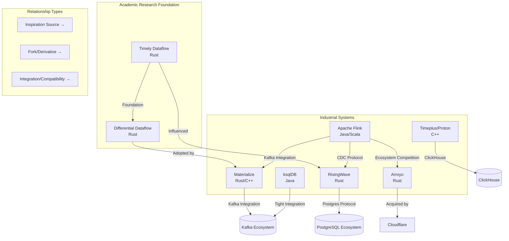
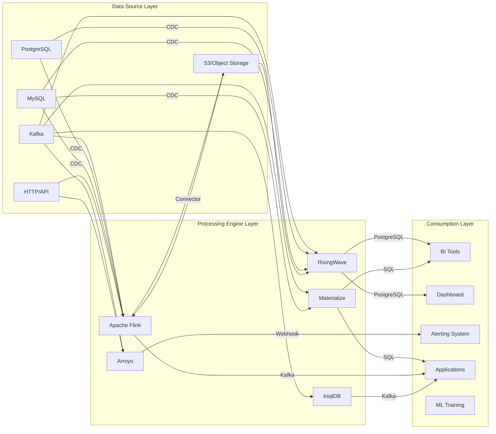
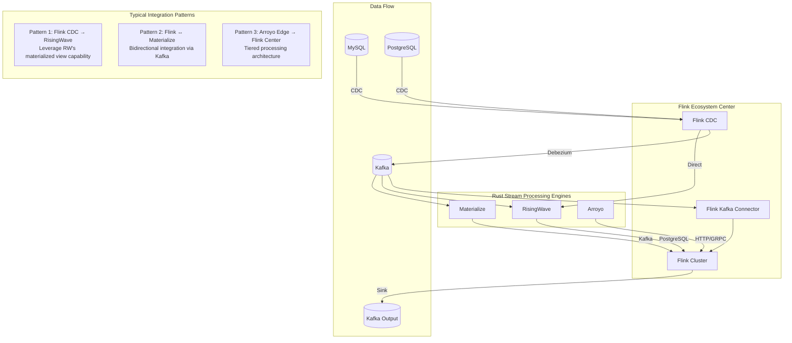

# Comprehensive Comparison Matrix of Rust Stream Processing Engine Ecosystem

> Stage: Flink/ | Prerequisites: [Flink Architecture Docs](../../01-concepts/deployment-architectures.md), [Dataflow Model Theory](../../../Struct/) | Formality Level: L4

## 1. Concept Definitions (Definitions)

### Def-COMP-01: Formal Definition of Stream Processing Engine

A stream processing engine $\text{SE}$ can be formalized as a septuple:

$$
\text{SE} = \langle \mathcal{I}, \mathcal{O}, \mathcal{S}, \mathcal{T}, \mathcal{C}, \mathcal{Q}, \mathcal{F} \rangle
$$

Where each component is:

| Symbol | Meaning | Formal Description |
|--------|---------|--------------------|
| $\mathcal{I}$ | Input space | Ordered event stream $\{e_1, e_2, ...\}$, $e_i = (k_i, v_i, t_i)$, containing key, value, timestamp |
| $\mathcal{O}$ | Output space | Derived streams or materialized view sets |
| $\mathcal{S}$ | State space | Key-value state storage $\mathcal{K} \times \mathcal{V} \to \mathcal{V}$ |
| $\mathcal{T}$ | Time semantics | $\{ \text{Processing}, \text{Event}, \text{Ingestion} \}$ |
| $\mathcal{C}$ | Consistency model | $\{ \text{ALO}, \text{AMO}, \text{EO}, \text{SC} \}$ (see Def-COMP-02) |
| $\mathcal{Q}$ | Query capability | Combination of $\{ \text{SQL}, \text{DSL}, \text{API} \}$ |
| $\mathcal{F}$ | Fault tolerance mechanism | Checkpoint / WAL / Replication strategy |

### Def-COMP-02: Consistency Hierarchy

The consistency models of stream processing systems form a strict partial order:

$$
\text{ALO} \prec \text{AMO} \prec \text{EO} \prec \text{SC}
$$

Where:

- **ALO** (At-Least-Once): $\forall e \in \text{Input}, P(\text{processed}(e)) \geq 1$
- **AMO** (At-Most-Once): $\forall e \in \text{Input}, P(\text{processed}(e)) \leq 1$
- **EO** (Exactly-Once): $\forall e \in \text{Input}, P(\text{processed}(e)) = 1$
- **SC** (Strong Consistency): Linear consistency $\land$ serializable isolation level

### Def-COMP-03: Stream Processing Engine Taxonomy

Based on architectural characteristics, stream processing engines can be divided into four categories:

```
Stream Processing Engines
├── Stream Processing Framework
│   ├── Representatives: Apache Flink, Timely Dataflow
│   └── Characteristics: Programming API-centric, flexible but requires development
├── Streaming Database
│   ├── Representatives: RisingWave, Materialize, Timeplus
│   └── Characteristics: Materialized views native, SQL-first
├── Streaming Analytics Service
│   ├── Representatives: Arroyo, ksqlDB
│   └── Characteristics: Simplified deployment, quick to get started
└── Stream Compute Library
    ├── Representatives: Tokio Streams, async-stream
    └── Characteristics: Embedded, in-application use
```

### Def-COMP-04: Rust Stream Processing Engine Definition

A Rust-native stream processing engine $\text{RS}$ is defined as an engine satisfying the following conditions:

$$
\text{RS} \iff \text{CoreRuntime} \in \text{Rust} \land \text{MemorySafety} = \text{CompileTimeGuaranteed}
$$

Key characteristics:

- Zero-cost abstraction: high-level APIs compile without runtime overhead
- Fearless concurrency: borrow checker guarantees thread safety
- Predictable performance: no GC pauses, suitable for sub-millisecond latency scenarios

---

## 2. Property Derivations (Properties)

### Lemma-COMP-01: Common Advantages of Rust Implementations

**Proposition**: Rust stream processing engines share the following engineering advantages:

1. **Memory Efficiency**: Typical memory overhead is 2-5x lower compared to Java implementations
2. **Startup Speed**: Cold start times are usually in the millisecond range (vs. JVM second-level)
3. **Deployment Density**: More task instances can be deployed on a single node
4. **Predictable Latency**: No GC pauses, P99 latency is more stable

**Proof Sketch**:

- Rust ownership system enables compile-time memory management, eliminating runtime GC
- LLVM optimization backend generates efficient machine code
- Standard library `std::collections` is optimized for cache friendliness ∎

### Lemma-COMP-02: Consistency-Performance Trade-off

**Proposition**: In stream processing engines, consistency strength and throughput-latency exhibit a trade-off relationship:

$$
\text{Throughput} \propto \frac{1}{\text{ConsistencyLevel}} \quad \text{(under fixed resources)}
$$

**Intuitive Explanation**:

- SC (Materialize): Requires coordination and version management, lower throughput
- EO (Flink, RisingWave): Requires Barrier synchronization, medium throughput
- ALO (Highest performance): No coordination overhead, but may duplicate processing

### Prop-COMP-01: SQL Compatibility Spectrum

Stream processing SQL support presents a spectrum distribution:

| Level | Characteristics | Representative Systems |
|-------|-----------------|------------------------|
| L1 - Dialect | Custom syntax, limited compatibility | Arroyo, ksqlDB |
| L2 - Subset | ANSI SQL subset | Flink SQL |
| L3 - PostgreSQL | Protocol-level compatibility | RisingWave |
| L4 - Standard + Extensions | ANSI + stream extensions (EMIT) | Materialize |

---

## 3. Relations Establishment (Relations)

### Inter-System Relationship Map



### Technical Pedigree Matrix

| System | Academic Foundation | Industrial Pedigree | Core Technology |
|--------|---------------------|---------------------|-----------------|
| Flink | Dataflow Model [^1] | Apache Foundation | Chandy-Lamport Checkpoint |
| Materialize | Differential Dataflow [^2] | Ex-CockroachDB Team | Arrangement, Trace |
| RisingWave | Self-developed | Ex-AWS Redshift Team | Hummock Storage Engine |
| Arroyo | Self-developed | Ex-Stripe/Heap | Micro-batching + Pipelining |
| Timely | Naiad [^3] | MSR | Timely Data Parallelism |

---

## 4. Argumentation Process (Argumentation)

### 4.1 Maturity Assessment Methodology

Maturity scoring adopts a multi-dimensional weighted model:

$$
\text{Maturity} = 0.3 \times \text{DevelopmentYears} + 0.25 \times \text{ProductionUsers} + 0.25 \times \text{CommunitySize} + 0.2 \times \text{EnterpriseAdoption}
$$

Assessment of each system:

| System | Development Years | Production Users | Community Size | Enterprise Adoption | Overall Score |
|--------|-------------------|------------------|----------------|---------------------|---------------|
| Flink | 10+ years | 1000+ | Very Large | Widespread | ⭐⭐⭐⭐⭐ |
| Materialize | 6 years | 100+ | Medium | Growing | ⭐⭐⭐⭐ |
| RisingWave | 4 years | 100+ | Medium | Growing | ⭐⭐⭐⭐ |
| Arroyo | 3 years | Unknown | Small | Cloudflare | ⭐⭐⭐ |
| Timeplus | 3 years | Unknown | Small | Startup | ⭐⭐⭐ |
| ksqlDB | 7 years | 1000+ | Large | Kafka Users | ⭐⭐⭐⭐ |

### 4.2 Technology Selection Decision Framework

**Thm-COMP-01: Selection Decision Theorem**

Given a business requirement vector $\vec{R} = (r_1, r_2, ..., r_n)$ and a system capability matrix $\mathbf{C}$, the optimal choice is:

$$
\text{Optimal} = \arg\max_{i} \sum_{j} w_j \cdot \text{match}(C_{ij}, R_j)
$$

Where $w_j$ are requirement weights and $\text{match}$ is the matching function.

---

## 5. Engineering Argument / Formal Proof (Engineering Argument)

### 5.1 Comprehensive Comparison Matrix

#### 5.1.1 Technical Dimension Comparison

| Dimension | Apache Flink | Arroyo | RisingWave | Materialize | Timeplus/Proton | ksqlDB |
|-----------|--------------|--------|------------|-------------|-----------------|--------|
| **Implementation Language** | Java/Scala | Rust | Rust | Rust/C++ | C++ | Java |
| **First Release** | 2011 | 2022 | 2022 | 2019 | 2022 | 2017 |
| **Current Version** | 1.20 | 0.14 | 2.1 | 0.130 | 2.6 | 0.29 |
| **SQL Level** | L2-Subset | L1-Dialect | L3-PostgreSQL | L4-Standard+Ext | L2-Subset | L1-Dialect |
| **Consistency Model** | EO / ALO | ALO | EO | SC | ALO | ALO |
| **State Storage** | RocksDB/Memory | Memory | Hummock | SQLite/RocksDB | Custom | RocksDB |
| **Time Semantics** | Event/Proc/Ingest | Event/Proc | Event/Proc | Event | Event/Proc | Event |
| **Deployment Mode** | K8s/Yarn/Standalone | K8s/Docker | K8s/Docker/Cloud | K8s/Docker/Cloud | K8s/Docker | Kafka Connect |

#### 5.1.2 Performance Dimension Comparison

| Metric | Flink | Arroyo | RisingWave | Materialize | Timeplus | ksqlDB |
|--------|-------|--------|------------|-------------|----------|--------|
| **Nexmark QPS** (Reference) [^4] | 1M+ | 500K+ | 800K+ | 200K+ | 400K+ | 300K+ |
| **End-to-End Latency** | 10-100ms | <10ms | 1-100ms | 1-10ms | 10-50ms | 10-100ms |
| **Horizontal Scaling** | Excellent | Good | Excellent | Good | Good | Limited |
| **Vertical Scaling** | Good | Excellent | Excellent | Good | Good | Good |
| **Memory Efficiency** | Medium | High | High | High | High | Medium |
| **Cold Start** | Seconds | Milliseconds | Seconds | Seconds | Seconds | Seconds |

*Note: Performance data are approximate values, actual results depend on specific configuration and queries*

#### 5.1.3 Ecosystem Dimension Comparison

| Dimension | Flink | Arroyo | RisingWave | Materialize | Timeplus | ksqlDB |
|-----------|-------|--------|------------|-------------|----------|--------|
| **Source Connectors** | 50+ | 10+ | 30+ | 15+ | 20+ | Kafka-only |
| **Sink Connectors** | 50+ | 10+ | 30+ | 15+ | 20+ | Kafka-only |
| **CDC Support** | Excellent | Good | Excellent | Good | Good | Via Kafka |
| **Kafka Integration** | Native | Good | Native | Native | Native | Native |
| **UDF Support** | Java/Python/Scala | Rust/SQL | Rust/Python/Java | SQL/Rust | SQL | Java |
| **Monitoring Metrics** | Prometheus | Prometheus | Prometheus | Prometheus | Prometheus | JMX |

### 5.2 License and Business Model

| System | License | Managed Service | Enterprise Edition |
|--------|---------|-----------------|--------------------|
| Flink | Apache 2.0 | Confluent/Alibaba/Ververica | Ververica |
| Arroyo | Apache 2.0 | Cloudflare (Internal) | None |
| RisingWave | Apache 2.0 | RisingWave Cloud | None |
| Materialize | BSL 1.1 [^5] | Materialize Cloud | Yes |
| Timeplus/Proton | Apache 2.0 (Proton) | Timeplus Cloud | Yes |
| ksqlDB | Confluent Community | Confluent Cloud | Yes |

*Note: BSL (Business Source License) converts to Apache 2.0 after a specific period*

---

## 6. Example Verification (Examples)

### 6.1 Real-World Scenario Selection Cases

#### Case 1: Real-Time Data Warehouse Construction

**Background**: An e-commerce platform needs to build a real-time data warehouse supporting:

- Real-time order aggregation (minute-level)
- User behavior analysis (second-level)
- Integration with existing PostgreSQL BI tools

**Candidate Systems**: RisingWave vs Materialize vs Flink

**Analysis**:

| Requirement | RisingWave | Materialize | Flink |
|-------------|------------|-------------|-------|
| Materialized views | ✅ Native | ✅ Native | ⚠️ Requires Table Store |
| PG Protocol | ✅ Compatible | ⚠️ Partial | ❌ Not compatible |
| SQL complexity | ✅ Supports complex JOINs | ✅ Supports complex JOINs | ✅ Supported |
| License | Apache 2.0 | BSL (4 years) | Apache 2.0 |
| Cost | Controllable | Higher | Controllable |

**Decision**: RisingWave

- Reason: PostgreSQL protocol compatibility allows direct integration with existing BI tools, Apache 2.0 license has no commercial risk

#### Case 2: High-Frequency Trading Risk Control

**Background**: A fintech company needs:

- Sub-millisecond latency (< 5ms)
- Complex event processing (CEP)
- Exactly-Once processing

**Candidate Systems**: Flink vs Arroyo

**Analysis**:

| Requirement | Flink | Arroyo |
|-------------|-------|--------|
| CEP support | ✅ Native | ⚠️ Limited |
| EO semantics | ✅ Supported | ❌ ALO |
| Latency | < 10ms | < 5ms |
| Maturity | 10+ years production-proven | Relatively new |

**Decision**: Flink

- Reason: Exactly-Once is a hard requirement for risk control scenarios, CEP library is mature

#### Case 3: Log Real-Time Analysis

**Background**: A cloud service provider needs at edge nodes:

- Low resource footprint (< 512MB memory)
- Simple aggregation queries
- Fast deployment

**Candidate Systems**: Arroyo vs Timeplus

**Analysis**:

| Requirement | Arroyo | Timeplus |
|-------------|--------|----------|
| Resource footprint | Extremely low | Low |
| Deployment complexity | Single binary | Docker |
| Cloudflare integration | ✅ Native | ❌ |

**Decision**: Arroyo

- Reason: Cloudflare acquisition brings ecosystem integration advantages, edge-deployment-friendly

### 6.2 Code Example Comparison

#### Window Aggregation Query

**Flink SQL**:

```sql
SELECT
    TUMBLE_START(event_time, INTERVAL '5' MINUTE) as window_start,
    user_id,
    COUNT(*) as event_count
FROM user_events
GROUP BY
    TUMBLE(event_time, INTERVAL '5' MINUTE),
    user_id;
```

**RisingWave SQL**:

```sql
SELECT
    window_start,
    user_id,
    COUNT(*) as event_count
FROM TUMBLE(user_events, event_time, INTERVAL '5 MINUTES')
GROUP BY window_start, user_id;
```

**Materialize SQL**:

```sql
CREATE MATERIALIZED VIEW user_stats AS
SELECT
    date_trunc('minute', event_time) as window_start,
    user_id,
    COUNT(*) as event_count
FROM user_events
GROUP BY date_trunc('minute', event_time), user_id;
```

**Arroyo SQL**:

```sql
SELECT
    window.start as window_start,
    user_id,
    COUNT(*) as event_count
FROM user_events
GROUP BY hop(event_time, INTERVAL '5 MINUTES'), user_id;
```

---

## 7. Visualizations (Visualizations)

### 7.1 Technology Selection Decision Tree

```mermaid
flowchart TD
    Start([Start Selection]) --> Q1{Is materialized view<br/>a core requirement?}

    Q1 -->|Yes| Q2{Is PostgreSQL protocol<br/>compatibility needed?}
    Q1 -->|No| Q3{Is it a Kafka-centric<br/>architecture?}

    Q2 -->|Yes| RisingWave[RisingWave<br/>⭐⭐⭐⭐<br/>Streaming Database]
    Q2 -->|No| Q4{Is strong consistency (SC)<br/>required?}

    Q4 -->|Yes| Materialize[Materialize<br/>⭐⭐⭐⭐<br/>Strongly Consistent Streaming DB]
    Q4 -->|No| Q5{Latency requirement<br/>< 10ms?}

    Q5 -->|Yes| Arroyo[Arroyo<br/>⭐⭐⭐<br/>Cloudflare Ecosystem]
    Q5 -->|No| RisingWave2[RisingWave]

    Q3 -->|Yes| Q6{Is complex event<br/>processing (CEP) needed?}
    Q3 -->|No| Q7{Enterprise-grade<br/>complex scenarios?}

    Q6 -->|Yes| Flink[Flink<br/>⭐⭐⭐⭐⭐<br/>Enterprise Standard]
    Q6 -->|No| ksqlDB[ksqlDB<br/>⭐⭐⭐⭐<br/>Kafka Native]

    Q7 -->|Yes| Flink2[Flink]
    Q7 -->|No| Q8{Academic research<br/>or experimentation?}

    Q8 -->|Yes| Timely[Timely Dataflow<br/>⭐⭐<br/>Academic Research]
    Q8 -->|No| Timeplus[Timeplus<br/>⭐⭐⭐<br/>Hybrid Analytics]
```

### 7.2 Capability Radar Chart (Text Representation)

```
                    SQL Compatibility
                         5
                         │
                         │
           Ecosystem 4 ──┼── 4 Performance
                         │
      3 ─────────────────┼──────────────── 3
                         │
           Maturity 2 ───┼─── 2 Ease of Use
                         │
                         1
                    Enterprise Features

Apache Flink:  ████████████████████  [5,4,5,3,4]
RisingWave:    ████████████████░░░░  [4,4,3,4,4]
Materialize:   ███████████████░░░░░  [4,3,3,3,5]
Arroyo:        ███████████░░░░░░░░░  [2,4,2,5,3]
ksqlDB:        ████████████░░░░░░░░  [2,3,4,3,2]
Timeplus:      ██████████░░░░░░░░░░  [3,3,2,3,3]
```

### 7.3 Performance-Consistency Trade-off Chart

```mermaid
quadrantChart
    title Stream Processing Engines: Throughput vs. Consistency Strength
    x-axis Low Consistency (ALO) --> High Consistency (SC)
    y-axis Low Throughput --> High Throughput

    quadrant-1 High Throughput + Low Consistency: Performance First
    quadrant-2 Ideal Zone: High Throughput + Strong Consistency
    quadrant-3 Low Performance Zone: Low Throughput + Low Consistency
    quadrant-4 Strong Consistency First: Accuracy First

    Flink: [0.7, 0.8]
    RisingWave: [0.7, 0.7]
    Materialize: [0.9, 0.4]
    Arroyo: [0.3, 0.6]
    ksqlDB: [0.3, 0.5]
    Timeplus: [0.4, 0.5]
```

### 7.4 Technology Stack Mapping Diagram



### 7.5 Integration Architecture with Flink



---

## 8. References (References)

[^1]: T. Akidau et al., "The Dataflow Model: A Practical Approach to Balancing Correctness, Latency, and Cost in Massive-Scale, Unbounded, Out-of-Order Data Processing", PVLDB, 8(12), 2015. <https://www.vldb.org/pvldb/vol8/p1792-Akidau.pdf>

[^2]: F. McSherry et al., "Differential Dataflow", CIDR 2013. <https://arxiv.org/abs/1803.04071>

[^3]: D. G. Murray et al., "Naiad: A Timely Dataflow System", SOSP 2013. <https://dl.acm.org/doi/10.1145/2517349.2522738>

[^4]: Nexmark Benchmark, <https://github.com/nexmark/nexmark>

[^5]: Materialize BSL License, <https://github.com/MaterializeInc/materialize/blob/main/LICENSE>

---

## Appendix: Quick Selection Reference Card

| Scenario | Recommended System | Reason |
|----------|--------------------|--------|
| Enterprise complex ETL | Flink | Most mature, most comprehensive features |
| PG ecosystem materialized views | RisingWave | Protocol compatible, cost controllable |
| Strong consistency financial scenarios | Materialize | Linear consistency guarantee |
| Edge/low-latency scenarios | Arroyo | Cloudflare ecosystem, low resource footprint |
| Kafka-native stream processing | ksqlDB | Deeply integrated with Kafka |
| Academic research/experimentation | Timely | Solid theoretical foundation |
| Hybrid stream-batch analytics | Timeplus | Unified historical + real-time queries |

---

*Document version: 1.0 | Last updated: 2026-04-05 | Status: Complete*

---

## Related Resources

- [Arroyo Progress Tracking](../arroyo-update/PROGRESS-TRACKING.md) - Latest updates on Arroyo + Cloudflare Pipelines
- [Arroyo Impact Analysis](../arroyo-update/IMPACT-ANALYSIS.md) - Impact assessment on the Flink ecosystem
- [Arroyo Quarterly Reviews](../arroyo-update/QUARTERLY-REVIEWS/)
