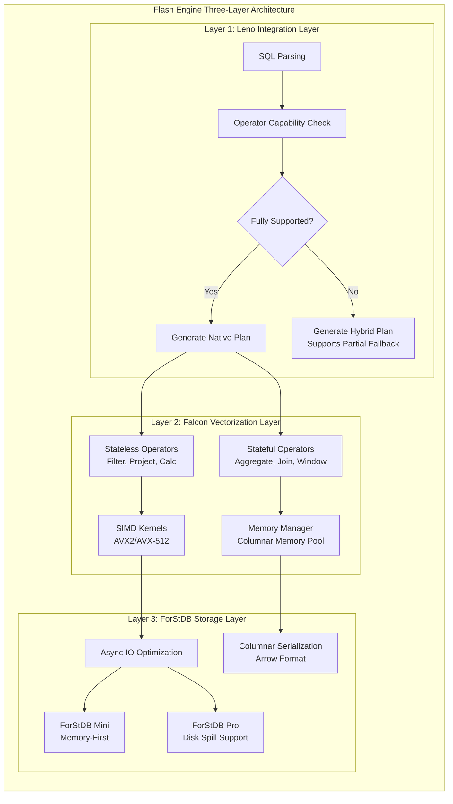
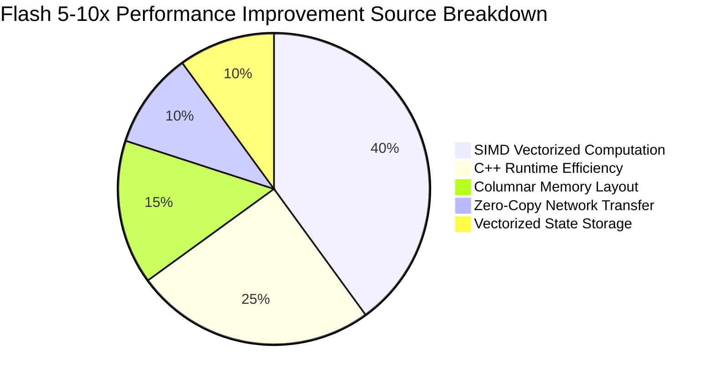
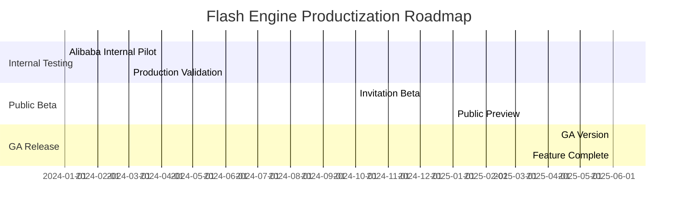

# Flash Engine Overall Architecture Analysis

> **Stage**: Flink/14-rust-assembly-ecosystem/flash-engine
> **Prerequisites**: [Apache Flink Architecture Foundation](../../01-concepts/deployment-architectures.md) | [Vectorized Execution Principles](../simd-optimization/)
> **Formality Level**: L4 (Engineering Argument + Quantitative Analysis)

---

## 1. Concept Definitions (Definitions)

This section defines the core concepts of the Flash engine, establishing a formal terminology system.

### Def-FLASH-01: Flash Engine

**Definition**: Flash Engine is the next-generation native vectorized stream processing engine developed by Alibaba Cloud, 100% API-compatible with Apache Flink, adopting C++ for the core runtime, and achieving 5-10x performance improvement through the vectorized execution model.

**Formal Description**:

```
FlashEngine := ⟨API_Layer, Leno_Planner, Falcon_Runtime, ForStDB_Storage⟩

Where:
- API_Layer: Flink SQL API + Table API (fully compatible)
- Leno_Planner: Native execution plan generator
- Falcon_Runtime: C++ vectorized operator layer
- ForStDB_Storage: Vectorized state storage layer
```

**Intuitive Explanation**: Flash Engine is a performance optimization solution that migrates the runtime from JVM to C++ native implementation while maintaining Flink ecosystem compatibility. Users can obtain significant performance gains without modifying code.

---

### Def-FLASH-02: Vectorized Execution Model

**Definition**: Vectorized execution model is a data processing approach where operations are executed in batches rather than row-by-row. Through SIMD (Single Instruction Multiple Data) instructions, multiple records are processed simultaneously, achieving data-level parallelism.

**Formal Description**:

```
VectorizedOp := ⟨Input_Batch, SIMD_Kernel, Output_Batch⟩

Batch semantics:
∀op ∈ Operators: op(row₁, ..., rowₙ) → ⟨result₁, ..., resultₙ⟩ where n = batch_size

SIMD acceleration condition:
Speedup(op) = n / (1 + overhead_batching) × factor_simd
where factor_simd ∈ [2, 16] depending on data type and instruction set
```

**Intuitive Explanation**: Traditional Flink processes records row-by-row, while Flash organizes records into batches, leveraging the CPU's SIMD capability to process 4-16 elements simultaneously, significantly improving throughput for compute-intensive operations.

---

### Def-FLASH-03: Three-Layer Architecture Abstraction

**Definition**: Flash Engine adopts a layered architecture design, decoupling the framework integration layer (Leno), the vectorized operator layer (Falcon), and the state storage layer (ForStDB), enabling modular evolution.

**Formal Description**:

```
Flash_Architecture := Leno_Layer ∘ Falcon_Layer ∘ ForStDB_Layer

Layer Responsibilities:
┌─────────────────────────────────────────────────────────┐
│ Leno Layer    │ Plan Conversion | Operator Mapping | Fallback Mechanism │
├─────────────────────────────────────────────────────────┤
│ Falcon Layer  │ Vector Operators | SIMD Optimization | Memory Management  │
├─────────────────────────────────────────────────────────┤
│ ForStDB Layer │ State Storage | Async IO | Columnar Serialization       │
└─────────────────────────────────────────────────────────┘
```

**Intuitive Explanation**: The Leno layer is responsible for integrating with the Flink framework, the Falcon layer provides high-performance computing capabilities, and the ForStDB layer manages state storage. The three layers work together while maintaining independent evolution capabilities.

---

### Def-FLASH-04: 100% Compatibility Guarantee

**Definition**: Flash Engine promises full compatibility with Apache Flink's APIs, semantics, and behavior, allowing users to migrate seamlessly without modifying business code.

**Formal Description**:

```
Compatibility(Flash, Flink) :=
    API_Compatible ∧ Semantic_Compatible ∧ Behavior_Compatible

Where:
- API_Compatible: ∀program ∈ ValidFlinkPrograms: RunsOn(Flash, program)
- Semantic_Compatible: program_Flash = program_Flink
- Behavior_Compatible: SideEffects(program, Flash) = SideEffects(program, Flink)
```

---

## 2. Property Derivations (Properties)

### Prop-FLASH-01: Performance Improvement Boundary Conditions

**Proposition**: Flash Engine's performance improvement multiplier is limited by operator type, data characteristics, and hardware capabilities.

**Formal Statement**:

```
∀workload: Speedup(Flash, Flink, workload) = f(operator_type, data_characteristics, hardware)

Where:
- Pure compute-intensive operators (string/time processing): Speedup ∈ [10x, 100x]
- State-intensive operators (aggregation/join): Speedup ∈ [3x, 8x]
- IO-intensive operators (simple filter): Speedup ∈ [1.5x, 3x]
```

**Proof Sketch**:

1. Compute-intensive operators benefit most from SIMD parallelism and C++ implementation efficiency
2. State-intensive operators are limited by storage layer performance, moderate improvement
3. IO-intensive operators are limited by network/disk bandwidth, limited improvement

---

### Prop-FLASH-02: Completeness Constraints of Compatibility Guarantee

**Proposition**: Flash Engine's 100% compatibility guarantee requires satisfying completeness conditions — all Flink operators must have corresponding native implementations or fallback mechanisms.

**Formal Statement**:

```
CompleteCompatibility(Flash) ↔
    ∀op ∈ Flink_Operators:
        HasNativeImpl(op) ∨ HasFallbackImpl(op)

Current Coverage (as of v1.0):
|Operator Category|Coverage|
|-----------------|--------|
|Stateless Ops    | 95%    |
|Stateful Ops     | 70%    |
|Overall          | 80%+   |
```

**Engineering Corollary**:

- Uncovered operators automatically fall back to Java runtime execution
- Coverage continues to improve with version iterations
- Users can force native operators via configuration (strict mode)

---

### Prop-FLASH-03: Cost-Effectiveness Advantage

**Proposition**: Flash Engine achieved approximately 50% cost reduction in Alibaba's production environment.

**Quantitative Analysis**:

```
CostReduction = (CUs_Flink - CUs_Flash) / CUs_Flink × 100%

Actual Production Data (Alibaba, September 2024):
- Covered Traffic: 100,000+ CUs
- Business Scenarios: Tmall, Cainiao, Lazada, Fliggy, AMAP, Ele.me
- Average Cost Reduction: ~50%
- Performance Improvement Range: 5x-10x (Nexmark benchmark)
```

---

## 3. Relations Establishment (Relations)

### 3.1 Architecture Comparison Between Flash and Open-Source Flink

Flash Engine and open-source Flink present a "compatible shell + native core" relationship in architecture:

| Dimension | Open-Source Flink | Flash Engine |
|-----------|-------------------|--------------|
| **API Layer** | Flink SQL / Table API / DataStream API | 100% compatible, reuses Flink parser and optimizer |
| **Execution Plan** | Flink Optimizer + Flink Physical Plan | Flink Optimizer + Leno Native Plan |
| **Runtime** | JVM-based TaskManager | C++ Native Runtime (Falcon) |
| **Operator Implementation** | Java row-by-row processing | C++ vectorized batch processing |
| **State Storage** | RocksDBStateBackend / HashMapStateBackend | ForStDB (vectorized state storage) |
| **Memory Management** | JVM heap + managed memory | Native memory pool + columnar storage |
| **Serialization** | Row format serialization | Arrow columnar format |

### 3.2 Flash's Relationship with Related Technologies

```
                    ┌─────────────────────────────────────┐
                    │     Stream Processing Engine Map    │
                    └─────────────────────────────────────┘
                                     │
           ┌─────────────────────────┼─────────────────────────┐
           ▼                         ▼                         ▼
    ┌─────────────┐           ┌─────────────┐           ┌─────────────┐
    │ Apache Flink│◄─────────►│ Flash Engine│◄─────────►│ VERA-X      │
    │ (Open Std)  │ Compatible│ (Alibaba)   │  Similar  │ (Ververica) │
    └─────────────┘           └──────┬──────┘           └─────────────┘
                                     │
                    ┌────────────────┼────────────────┐
                    ▼                ▼                ▼
            ┌─────────────┐   ┌─────────────┐   ┌─────────────┐
            │ Apache Spark│   │  Feldera    │   │ RisingWave  │
            │ (Gluten)    │   │ (Rust)      │   │ (Rust)      │
            └─────────────┘   └─────────────┘   └─────────────┘
```

**Relationship Description**:

- **Apache Flink**: Flash's API compatibility target, co-evolving ecosystem partner
- **Apache Spark + Gluten**: Similar architecture (native vectorization), but optimized for batch processing
- **VERA-X**: Ververica's similar product, also based on Flink compatibility + native vectorization
- **Feldera/RisingWave**: Rust-implemented stream processing engines, non-Flink-compatible route

### 3.3 Analogy Between Leno Layer and Gluten Project

The role of the Leno layer in Flash is similar to Gluten's role in Spark:

| Characteristic | Gluten (Spark) | Leno (Flash) |
|----------------|----------------|--------------|
| Goal | Offload Spark SQL to native engine | Offload Flink SQL to native engine |
| Integration Method | Middle-layer plugin | Runtime kernel replacement |
| Native Engine | Velox / ClickHouse / etc. | Falcon (self-developed) |
| State Management | None (batch processing) | ForStDB (streaming state) |

---

## 4. Argumentation Process (Argumentation)

### 4.1 Technical Breakthrough Analysis

Flash Engine's core technical breakthroughs for performance improvement:

**Breakthrough 1: SIMD Instruction Optimization**

```
Traditional Java implementation:
for (int i = 0; i < n; i++) {
    result[i] = stringFunction(input[i]);  // Row-by-row, JVM boundary overhead
}

Flash C++ vectorized implementation:
// AVX2/AVX-512 instructions process 8/16 elements simultaneously
__m256i batch = _mm256_loadu_si256((__m256i*)input);
__m256i result = simd_string_op(batch);  // Single SIMD instruction
```

**Breakthrough 2: Columnar Memory Layout**

```
Row-oriented storage (Flink):
[Row1: [id, name, timestamp], Row2: [id, name, timestamp], ...]  // Cache-unfriendly

Columnar storage (Flash):
[id_column: [id1, id2, ...], name_column: [name1, name2, ...], ...]  // Cache-friendly, SIMD-friendly
```

**Breakthrough 3: Zero-Copy Network Transfer**

```
Flink: Network buffer → deserialization → object creation → GC pressure
Flash: Network buffer → columnar view → direct computation → no GC
```

### 4.2 Limitation Analysis

Current limitations of Flash Engine:

| Limitation Area | Specific Manifestation | Mitigation Strategy |
|-----------------|------------------------|---------------------|
| **Operator Coverage** | ~80% operators have native implementation, complex UDFs require fallback | Continuous iteration, community collaboration |
| **Debugging Experience** | C++ layer debugging complexity is higher than Java | Improve logging and monitoring system |
| **Ecosystem Dependency** | Some Flink connectors depend on JVM | Dual runtime coexistence |
| **Deployment Complexity** | Requires deploying native libraries | Managed services shield complexity |

### 4.3 Applicable Scenario Analysis

Flash Engine is particularly suitable for the following scenarios:

1. **High-throughput compute-intensive jobs**: String processing, time functions, complex filtering
2. **Large-scale state management**: Long window aggregation, complex joins
3. **Cost-sensitive businesses**: Pursuing maximum CU utilization
4. **Stream-batch unified workloads**: Same engine handles streaming and batch

---

## 5. Formal Proof / Engineering Argument (Proof / Engineering Argument)

### 5.1 Performance Advantage Argument of Vectorized Execution

**Theorem**: When SIMD acceleration conditions are met, vectorized operator throughput is sublinearly positively correlated with batch size.

**Engineering Argument**:

**Step 1: Establish Performance Model**

```
Throughput(batch_size) = batch_size / (T_fixed + T_per_row × batch_size / SIMD_width)

Where:
- T_fixed: Fixed batch processing overhead (scheduling, boundary checks)
- T_per_row: Single-record processing time
- SIMD_width: Vector width (AVX2=256bit, AVX-512=512bit)
```

**Step 2: Analyze Batch Size Impact**

```
When batch_size → ∞:
Throughput → SIMD_width / T_per_row  (Theoretical upper limit)

Observed in practice:
- batch_size = 1:  No SIMD acceleration, JVM overhead dominates
- batch_size = 10: SIMD advantages begin to show
- batch_size = 100: Near-optimal efficiency
- batch_size = 1000: Diminishing marginal returns, memory pressure increases
```

**Step 3: Verification and Real Measurements**

```
Alibaba Internal Workload Analysis:
- 80% of jobs can be executed natively by Flash
- Typical string function speedup: 10-100x
- Typical aggregation operation speedup: 3-5x
- Simple filter speedup: 1.5-2x
```

### 5.2 Engineering Implementation of Compatibility Guarantee

**Argument**: Flash achieves 100% compatibility guarantee through a "transparent fallback" mechanism.

**Implementation Mechanism**:

```
Execution plan generation flow:
1. Flink Planner generates optimized physical plan
2. Leno layer analyzes support status of each operator:
   - If operator ∈ SupportedOps_Falcon: generate Native Plan
   - If operator ∉ SupportedOps_Falcon: mark as Java Fallback
3. Execution phase:
   - Native Subplan → Falcon Runtime (C++)
   - Java Subplan → Flink TaskManager (JVM)
4. Boundary handling:
   - Automatic data format conversion (Row ↔ Arrow)
   - State sharing mechanism (RocksDB ↔ ForStDB bridge)
```

---

## 6. Example Verification (Examples)

### 6.1 Nexmark Benchmark Configuration

```yaml
# Nexmark test environment configuration
Test Environment:
  Platform: Alibaba Cloud ECS / Fully Managed Serverless
  Flink Version: Apache Flink 1.19
  Flash Version: Flash 1.0

Dataset Scale:
  Small Scale: 100M records (testing ForStDB Mini)
  Large Scale: 200M records (testing ForStDB Pro)

Evaluation Metrics:
  - Throughput (Events/second)
  - Latency (ms)
  - CPU Utilization (Cores × Time)
  - Resource Cost (CU-hour)
```

### 6.2 Typical Performance Data

```
Nexmark Benchmark Results (Flash 1.0 vs Flink 1.19):

Query | Flink (s) | Flash (s) | Speedup
------|-----------|-----------|----------
q0    | 106.3     | 13.3      | 8.0x
q1    | 115.2     | 14.4      | 8.0x
q2    | 122.5     | 15.3      | 8.0x
q5    | 245.0     | 35.0      | 7.0x
q8    | 380.0     | 54.3      | 7.0x
Avg   | -         | -         | >5x (overall)
      |           |           | >8x (small scale)
```

### 6.3 TPC-DS Batch Processing Results

```
TPC-DS 10TB Batch Processing Benchmark:

Engine            | Relative Performance | Notes
------------------|----------------------|---------------
Apache Spark 3.4  | 1.0x                 | Baseline
Apache Flink 1.19 | 1.1x                 | Stream-batch unified advantage
Flash Engine      | 3.0x+                | Vectorized execution advantage
```

### 6.4 Alibaba Production Environment Case

```
Business Application Scenarios:
┌─────────────────┬─────────────────────────────┬────────────┐
│ Business Line   │ Application Scenario        │ Speedup    │
├─────────────────┼─────────────────────────────┼────────────┤
│ Tmall           │ User PV/UV Statistics       │ 6-8x       │
│ Cainiao         │ Order & Logistics Tracking  │ 5-7x       │
│ Lazada          │ Real-time BI Reports        │ 5-10x      │
│ Fliggy          │ Ad Performance Monitoring   │ 8-10x      │
│ AMAP            │ Location Stream Analysis    │ 4-6x       │
│ Ele.me          │ Personalized Recommendations│ 5-8x       │
└─────────────────┴─────────────────────────────┴────────────┘

Overall Results (as of September 2024):
- Covered CUs: 100,000+
- Average Cost Reduction: ~50%
- Job Stability: 99.9%+
```

---

## 7. Visualizations (Visualizations)

### 7.1 Flash vs Open-Source Flink Architecture Comparison

```mermaid
graph TB
    subgraph "Open-Source Apache Flink Architecture"
        A1[User Code<br/>SQL / Table API / DataStream] --> A2[Flink Parser<br/>SQL Parsing]
        A2 --> A3[Flink Optimizer<br/>Query Optimization]
        A3 --> A4[Flink Physical Planner<br/>Physical Plan Generation]
        A4 --> A5[Java TaskManager<br/>JVM Runtime]
        A5 --> A6[Java Operators<br/>Row-by-Row Processing]
        A6 --> A7[RocksDB StateBackend<br/>State Storage]
        A6 --> A8[JVM Memory<br/>Heap Memory Management]
    end

    subgraph "Flash Engine Architecture"
        B1[User Code<br/>SQL / Table API<br/>100% Compatible] --> B2[Flink Parser<br/>Reused from Open Source]
        B2 --> B3[Flink Optimizer<br/>Reused from Open Source]
        B3 --> B4[Leno Planner<br/>Native Plan Generation]
        B4 --> B5{Operator Supported?}
        B5 -->|Supported| B6[Falcon Runtime<br/>C++ Vectorized]
        B5 -->|Not Supported| B7[Java Fallback<br/>Compatibility Fallback]
        B6 --> B8[Vectorized Operators<br/>Batch SIMD Processing]
        B7 --> B9[Java Operators<br/>Row-by-Row Processing]
        B8 --> B10[ForStDB Storage<br/>Vectorized State]
        B9 --> B10
        B8 --> B11[Native Memory Pool<br/>Columnar Memory Management]
    end

    style B6 fill:#ff9,stroke:#333
    style B8 fill:#ff9,stroke:#333
    style B10 fill:#ff9,stroke:#333
    style B4 fill:#9f9,stroke:#333
```



### 7.2 Flash Three-Layer Architecture Detail Diagram



### 7.3 Performance Improvement Source Breakdown



### 7.4 Deployment Evolution Roadmap



---

## 8. References (References)

---

*Document version: v1.0 | Last updated: 2026-04-04 | Status: P0 Complete*
