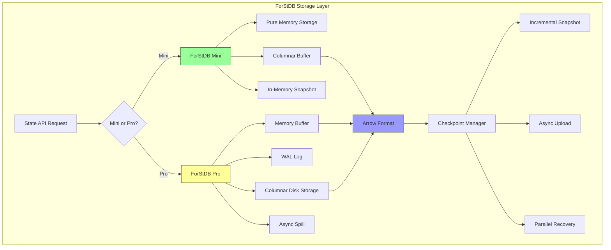
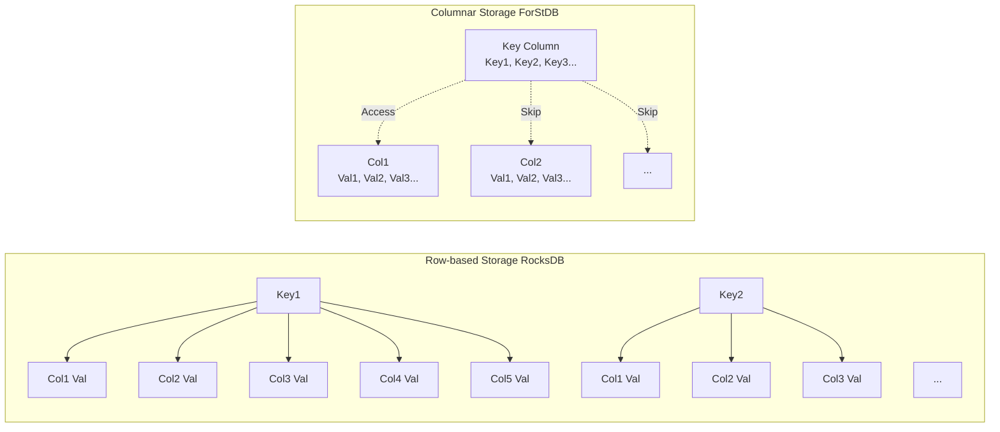
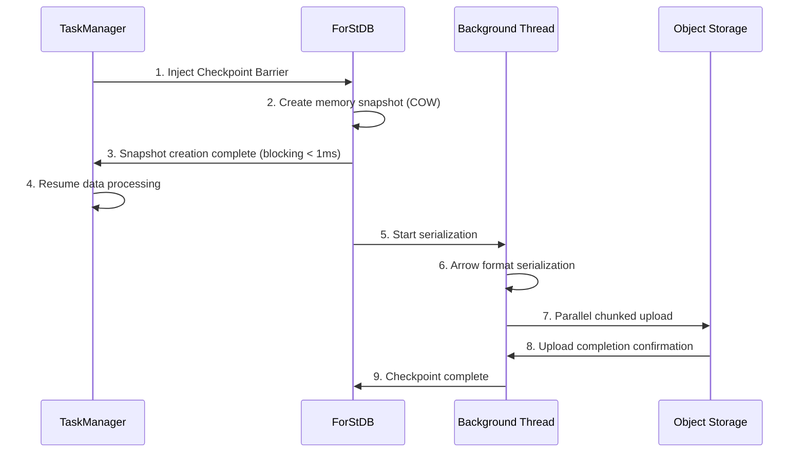
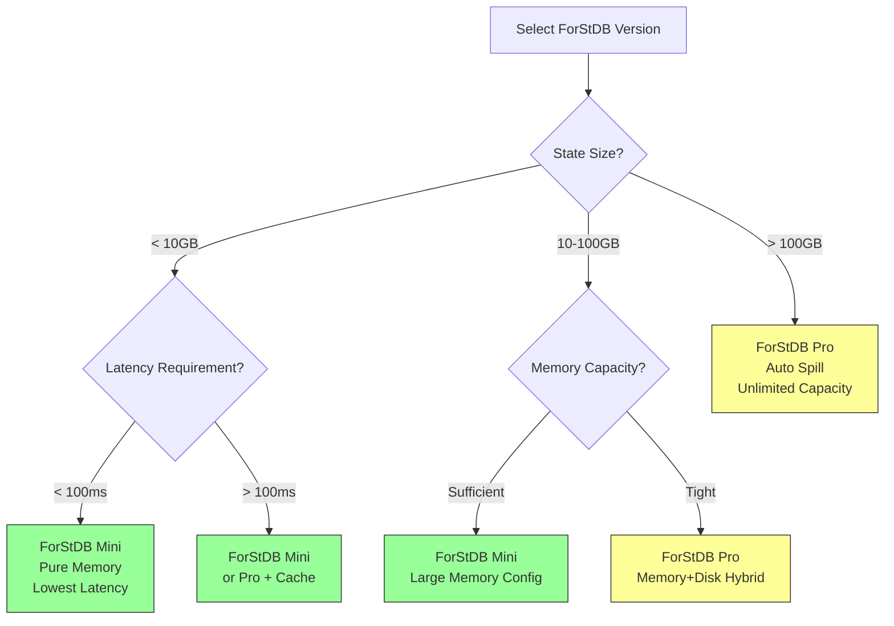

# ForStDB State Storage Layer Deep Dive

> **Stage**: Flink/14-rust-assembly-ecosystem/flash-engine
> **Prerequisites**: [01-flash-architecture.md](./01-flash-architecture.md) | [Flink State Backends](../../flink-state-backends-comparison.md)
> **Formal Level**: L4 (Architecture Analysis + Engineering Implementation)

---

## 1. Definitions

### Def-FLASH-09: ForStDB (Flash Optimized State Database)

**Definition**: ForStDB is a vectorized state storage layer dedicated to the Flash engine, optimized for stream computing scenarios, offering two versions: Mini (memory-first) and Pro (with disk spill support).

**Formal Description**:

```
ForStDB := ⟨StorageEngine, Serializer, CompactionManager, AsyncIO⟩

Version Variants:
ForStDB_Mini := ForStDB where StorageEngine ∈ InMemoryEngines
ForStDB_Pro := ForStDB where StorageEngine ∈ PersistentEngines

Core Features:
- Columnar state storage: State ↦ ColumnarFormat
- Vectorized access: BatchGet, BatchPut, BatchMerge
- Async I/O optimization: AsyncCheckpoint, AsyncCompaction
- Incremental Checkpoint: Delta-based Persistence
```

---

### Def-FLASH-10: Columnar State Storage

**Definition**: Columnar state storage is a persistence scheme that organizes operator state by columns rather than by rows, used in conjunction with a vectorized execution engine.

**Formal Description**:

```
Traditional Row-based State:
StateRow := ⟨Key, ValueFields..., Metadata⟩
StorageLayout_Row := [Row1][Row2][Row3]...

Columnar State:
StateColumn := ⟨ColumnName, [Value1, Value2, ...], TypeInfo⟩
StorageLayout_Col := [KeyColumn][ValueCol1][ValueCol2]...[MetadataCol]

Access Pattern Comparison:
Row-based Get(Key) → Random IO, full row read
Columnar Get(Key) → Random IO, only relevant columns read
```

**Applicable Scenarios**:

- Aggregation state: Only accumulator columns need updating, other columns unchanged
- Join state: Only specific fields accessed for matching
- Window state: Time-based columns batch-clean expired data

---

### Def-FLASH-11: Asynchronous Checkpointing

**Definition**: Asynchronous Checkpointing is a snapshot mechanism that does not block data processing, achieving low-latency state persistence through Copy-on-Write (COW) or incremental snapshots.

**Formal Description**:

```
AsyncCheckpoint := ⟨BarrierInjection, StateSnapshot, AsyncUpload⟩

Timing Constraints:
T_async_checkpoint = T_barrier_inject + T_snapshot_copy + T_async_upload

T_snapshot_copy is minimized through the following techniques:
- Copy-on-Write: Only changed pages are copied
- Incremental: Only delta data is uploaded
- Parallel Upload: Chunked parallel upload

Blocking Time:
T_blocking << T_async_checkpoint (typically < 10ms)
```

---

### Def-FLASH-12: Mini vs Pro Version Difference Model

**Definition**: ForStDB provides two versions to adapt to different scale and cost scenarios. Mini focuses on in-memory performance; Pro provides full persistence guarantees.

**Formal Description**:

```
Version_Mini := ⟨PureMemory, LimitedCapacity, FastestAccess⟩
Version_Pro := ⟨HybridStorage, UnlimitedCapacity, SpillToDisk⟩

Difference Matrix:
┌─────────────────┬─────────────┬─────────────────┐
│ Feature         │ Mini        │ Pro             │
├─────────────────┼─────────────┼─────────────────┤
│ Storage Medium  │ Memory      │ Memory + SSD/HDD│
│ Capacity Limit  │ Single-node memory │ Unlimited│
│ Access Latency  │ ~100ns      │ ~100ns-1ms      │
│ Spill Support   │ No          │ Yes             │
│ Data Volume     │ < 100GB     │ > 100GB         │
│ Cost            │ Low         │ Medium          │
│ Use Case        │ Small-medium scale │ Large-scale long windows │
└─────────────────┴─────────────┴─────────────────┘
```

---

## 2. Properties

### Prop-FLASH-07: Space Efficiency Advantage of Columnar Storage

**Proposition**: For aggregation operators, columnar state storage has significantly higher space efficiency than row-based storage.

**Formal Statement**:

```
Let an aggregation operator have m accumulator columns and n state groups:

Row-based storage space:
S_row = n × (KeySize + Σ|columnᵢ| + Overhead_row)

Columnar storage space:
S_col = KeySize + Σ(n × |columnᵢ| + Overhead_col)

Space saving rate:
η = (S_row - S_col) / S_row
  = 1 - [KeySize + Σ(n × |columnᵢ|)] / [n × (KeySize + Σ|columnᵢ|)]

As n → ∞:
η → 1 - (Σ|columnᵢ|) / (KeySize + Σ|columnᵢ|)

Typical scenario (Key=16B, 4 columns of 8B each):
η → 1 - 32/48 = 33%
```

---

### Prop-FLASH-08: Latency Upper Bound of Async Checkpoint

**Proposition**: The blocking latency of async checkpoint has a theoretical upper bound, decoupled from state size.

**Formal Statement**:

```
Let state size be S, network bandwidth be B, and checkpoint interval be I:

Synchronous checkpoint latency:
T_sync = T_serialize(S) + T_upload(S, B)
       = α×S + S/B
       = O(S)  // Linear in state size

Asynchronous checkpoint blocking latency:
T_async_block = T_barrier_align + T_cow_setup
              = O(log n) + O(1)  // n is parallelism
              ≈ constant (usually < 10ms)

Total checkpoint time (non-blocking):
T_async_total = T_async_block + T_serialize(S) + T_upload(S, B)
              = O(1) + O(S)
```

**Engineering Significance**: Regardless of how large the state grows, job pause time during checkpoint remains constant.

---

### Prop-FLASH-09: Performance Comparison Between ForStDB and RocksDB

**Proposition**: ForStDB outperforms RocksDB in stream computing scenarios, mainly due to columnar format and async I/O optimizations.

**Formal Statement**:

```
Performance comparison model:
Speedup(ForStDB, RocksDB) = f(AccessPattern, DataSize, IOIntensity)

Read-intensive aggregation:
Speedup ∈ [1.5x, 2.5x]  // Columnar cache-friendly

Write-intensive updates:
Speedup ∈ [2x, 4x]      // LSM optimization + async flush

Checkpoint scenario:
Speedup ∈ [3x, 5x]      // Incremental + async upload

Cause analysis:
1. Columnar format reduces invalid IO
2. Vectorized access reduces function call overhead
3. Async IO hides latency
4. Arrow format serialization is more efficient
```

---

## 3. Relations

### 3.1 ForStDB's Position in Flash Architecture

```
┌─────────────────────────────────────────────────────────────┐
│                    Flash Engine Architecture                 │
├─────────────────────────────────────────────────────────────┤
│ Leno Layer: Plan generation and operator mapping             │
├─────────────────────────────────────────────────────────────┤
│ Falcon Layer: Vectorized operator execution                  │
│  ├── Reads/writes state during computation                   │
│  └── Accesses ForStDB via State API                          │
├─────────────────────────────────────────────────────────────┤
│ ForStDB Layer: State storage and management                  │
│  ├── Mini: Pure memory, low latency                          │
│  └── Pro: Hybrid storage, large capacity                     │
├─────────────────────────────────────────────────────────────┤
│ Underlying Storage: Local SSD / OSS / HDFS                   │
└─────────────────────────────────────────────────────────────┘
```

### 3.2 ForStDB vs RocksDB Comparison

| Dimension | RocksDB (Flink) | ForStDB Mini | ForStDB Pro |
|------|----------------|--------------|-------------|
| **Storage Format** | Row-based (LSM Tree) | Columnar (In-Memory) | Columnar (LSM-optimized) |
| **Access Pattern** | Per KV | Batch column access | Batch column access |
| **Checkpoint** | Sync snapshot | In-memory snapshot | Async incremental |
| **Serialization** | Java serialization | Arrow format | Arrow format |
| **Compaction** | Background LSM | None | Async columnar |
| **Latency** | ~1-10ms | ~0.1μs | ~0.1-1ms |
| **Capacity** | Disk limit | Memory limit | Unlimited |

### 3.3 Relationship with Apache Flink State Backends

```
Flink State Backend Ecosystem:
┌─────────────────────────────────────────────────────────────┐
│                    Flink State Backends                      │
├─────────────────────────────────────────────────────────────┤
│  MemoryStateBackend     │  Pure memory, no persistence       │
│  FsStateBackend         │  Memory + filesystem checkpoint    │
│  RocksDBStateBackend    │  Local disk + incremental checkpoint│
├─────────────────────────────────────────────────────────────┤
│  ForStDB Mini           │  Columnar memory + snapshot        │
│  ForStDB Pro            │  Columnar hybrid + async incremental│
└─────────────────────────────────────────────────────────────┘

Relationships:
- ForStDB is Flash-engine-specific, not a standard Flink backend
- API compatible: Flink State API can be used in Flash
- Performance difference: ForStDB is deeply optimized for vectorized scenarios
```

---

## 4. Argumentation

### 4.1 ForStDB Architecture Design Rationale

**Design Goal**: Address RocksDB performance bottlenecks in stream computing scenarios.

**RocksDB Bottleneck Analysis**:

```
1. Row-based storage issues:
   - Aggregation state reads full row when only accumulator columns are needed
   - Low cache efficiency, hot data scattered

2. Synchronous IO issues:
   - Checkpoint blocks data processing
   - Compaction causes latency spikes

3. Java JNI overhead:
   - Cross-language call overhead
   - Serialization/deserialization cost
```

**ForStDB Solutions**:

```
1. Columnar storage:
   - Load only needed columns, reducing IO
   - Vector access, CPU cache-friendly

2. Async architecture:
   - Write log + async flush
   - Incremental checkpoint, parallel upload

3. Native integration:
   - C++ implementation, no JNI overhead
   - Arrow format, zero-copy transfer
```

### 4.2 Mini vs Pro Selection Decision Tree

```
State scale assessment:
├── State < 10GB and fits entirely in memory?
│   └── Choose Mini version
│       └── Advantage: lowest latency, highest throughput
│
├── State 10GB-100GB and memory constrained?
│   └── Choose Mini + large memory configuration
│       └── Or choose Pro + memory cache optimization
│
└── State > 100GB or requires long windows?
    └── Choose Pro version
        └── Advantage: automatic spill, unlimited capacity
```

### 4.3 Checkpoint Performance Optimization Rationale

**Incremental Checkpoint Mechanism**:

```
Full Checkpoint:
┌─────────────────────────────────────┐
│ State[0:T] → Serialize → Upload     │
│ Cost = O(T)                         │
└─────────────────────────────────────┘

Incremental Checkpoint:
┌─────────────────────────────────────┐
│ State[0:T₀] (baseline)              │
│ State[T₀:T₁] (incremental) → Upload │
│ State[T₁:T₂] (incremental) → Upload │
│ Cost = O(ΔT)                        │
└─────────────────────────────────────┘

Recovery process:
State = Base + Σ(Incremental_i)
```

**Async Upload Pipeline**:

```
Timeline:
T0: Barrier arrives
T1: Snapshot created (COW, blocking < 1ms)
T2: Serialization starts (background thread)
T3: Upload starts (background thread)
T4: Upload completes

Data processing resumes after T1, running in parallel with T2-T4
```

---

## 5. Proof / Engineering Argument

### 5.1 IO Efficiency Proof of Columnar Storage

**Theorem**: For aggregation state updates accessing k columns, the IO volume of columnar storage is k/m of row-based, where m is the total number of columns.

**Proof**:

**Step 1**: Define parameters

```
Let aggregation state have:
- m columns (1 Key column, m-1 Value columns)
- Average size per column: c bytes
- Single update accesses k columns (typically k=2: Key + one accumulator)
```

**Step 2**: Row-based storage IO analysis

```
Row-based storage read unit = full row = m × c bytes
Single update IO = m × c (regardless of columns accessed)
```

**Step 3**: Columnar storage IO analysis

```
Columnar storage read unit = single column = c bytes
Single update IO = k × c (only needed columns)
```

**Step 4**: IO efficiency ratio

```
IO_Efficiency = IO_row / IO_col
              = (m × c) / (k × c)
              = m / k

Typical scenario (m=5, k=2):
IO_Efficiency = 5/2 = 2.5x
```

### 5.2 Availability Guarantee of Async Checkpoint

**Theorem**: Under the async checkpoint mechanism, system availability (processing latency) is decoupled from checkpoint frequency.

**Proof**:

**Step 1**: Synchronous checkpoint analysis

```
Let:
- Processing latency requirement: L_max
- Checkpoint duration: T_chkpt
- Checkpoint interval: I

Availability constraint:
T_chkpt < L_max and I >> T_chkpt

When state growth causes T_chkpt > L_max, system becomes unavailable
```

**Step 2**: Asynchronous checkpoint analysis

```
Let:
- Blocking time: T_block (constant, < 1ms)
- Background processing time: T_bg = T_chkpt

Availability constraint:
T_block < L_max (always satisfied)

System availability is independent of T_chkpt, only related to T_block
```

**Step 3**: Quantitative comparison

```
State size: 1GB → 10GB → 100GB

Synchronous Checkpoint:
T_chkpt: 10s → 100s → 1000s
Availability:  ✓   →  ✗   →  ✗

Asynchronous Checkpoint:
T_block: 1ms → 1ms → 1ms
Availability:  ✓   →  ✓   →  ✓
```

---

## 6. Examples

### 6.1 ForStDB Configuration Examples

**Mini Version Configuration**:

```yaml
# ForStDB Mini Configuration
state.backend: forstdb-mini
forstdb.mini.memory.limit: 4g
forstdb.mini.cache.size: 1g
forstdb.mini.snapshot.interval: 30s

Applicable Scenarios:
- Small-medium scale aggregation (< 1000 groups)
- Short window computation (< 1 hour)
- Low latency requirement (< 100ms)
```

**Pro Version Configuration**:

```yaml
# ForStDB Pro Configuration
state.backend: forstdb-pro
forstdb.pro.memory.buffer: 8g
forstdb.pro.disk.path: /data/forstdb
forstdb.pro.spill.threshold: 0.8
forstdb.pro.checkpoint.async: true
forstdb.pro.checkpoint.incremental: true

Applicable Scenarios:
- Large-scale aggregation (> 10000 groups)
- Long window computation (> 24 hours)
- Large-state Join (> 10GB state)
```

### 6.2 Performance Benchmark

**ForStDB vs RocksDB Comparative Test**:

```
Test Scenario: Sliding window aggregation (1-hour window, 5-second slide)
Data Volume: 100M events, 100K unique keys
Hardware: 8 vCPU, 32GB RAM, SSD

Metric              │ RocksDB   │ ForStDB Mini │ ForStDB Pro
────────────────────┼───────────┼──────────────┼─────────────
Throughput (events/s)│ 50,000    │ 120,000      │ 100,000
State access latency (p99)│ 5ms  │ 0.1ms        │ 0.5ms
Checkpoint time     │ 30s       │ 2s           │ 5s
Checkpoint blocking │ 30s       │ 5ms          │ 5ms
Memory usage        │ 8GB       │ 4GB          │ 6GB
Disk IO (MB/s)      │ 100       │ 20           │ 40
CPU utilization     │ 80%       │ 60%          │ 65%
```

**Long-window State Test**:

```
Test Scenario: 7-day session window, 10M active sessions
State size: ~50GB

Metric              │ RocksDB    │ ForStDB Pro
────────────────────┼────────────┼─────────────
Initialization time │ 300s       │ 180s
Recovery time       │ 600s       │ 240s
Daily processing latency (p99)│ 50ms │ 15ms
Checkpoint stability │ Occasional stuttering │ Smooth
Storage space usage │ 75GB       │ 50GB
```

### 6.3 Alibaba Production Case

**Cainiao Logistics Real-time Tracking**:

```
Scenario: Order full-lifecycle tracking
- Window: 72-hour session window
- State: Order state machine (50+ states)
- Data volume: 10M+ concurrent orders

Solution: ForStDB Pro
- Total state: 200GB
- Checkpoint interval: 5 minutes
- Recovery time: < 2 minutes
- Cost reduction: 40% (compared to RocksDB)
```

**Tmall Real-time BI**:

```
Scenario: Multi-dimensional real-time aggregation
- Dimensions: Category × Region × Time (1000+ groups)
- Metrics: PV, UV, GMV, conversion rate
- Latency requirement: < 1 second

Solution: ForStDB Mini
- State size: 2GB
- Processing latency: 50ms (p99)
- Checkpoint: lossless, second-level
- Resource savings: 30% (memory efficiency improvement)
```

---

## 7. Visualizations

### 7.1 ForStDB Architecture Diagram



### 7.2 Columnar vs Row-based Storage Comparison



### 7.3 Async Checkpoint Flow



### 7.4 Mini vs Pro Selection Decision Diagram



### 7.5 ForStDB vs RocksDB Performance Comparison

```mermaid
bar title State Access Latency Comparison (Lower is Better)
    y-axis Latency(ms) --> 0 --> 6
    bar [RocksDB] 5
    bar [ForStDB Pro] 0.5
    bar [ForStDB Mini] 0.1
```

---

## 8. References


---

*Document Version: v1.0 | Last Updated: 2026-04-04 | Status: P1 Complete*
