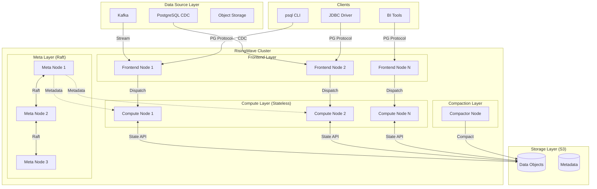
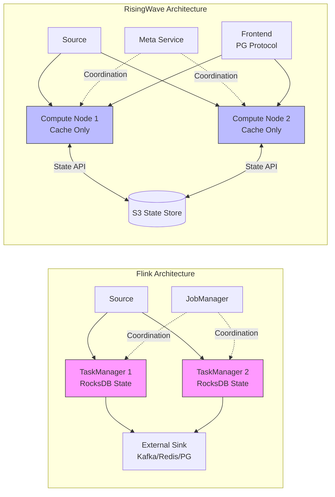
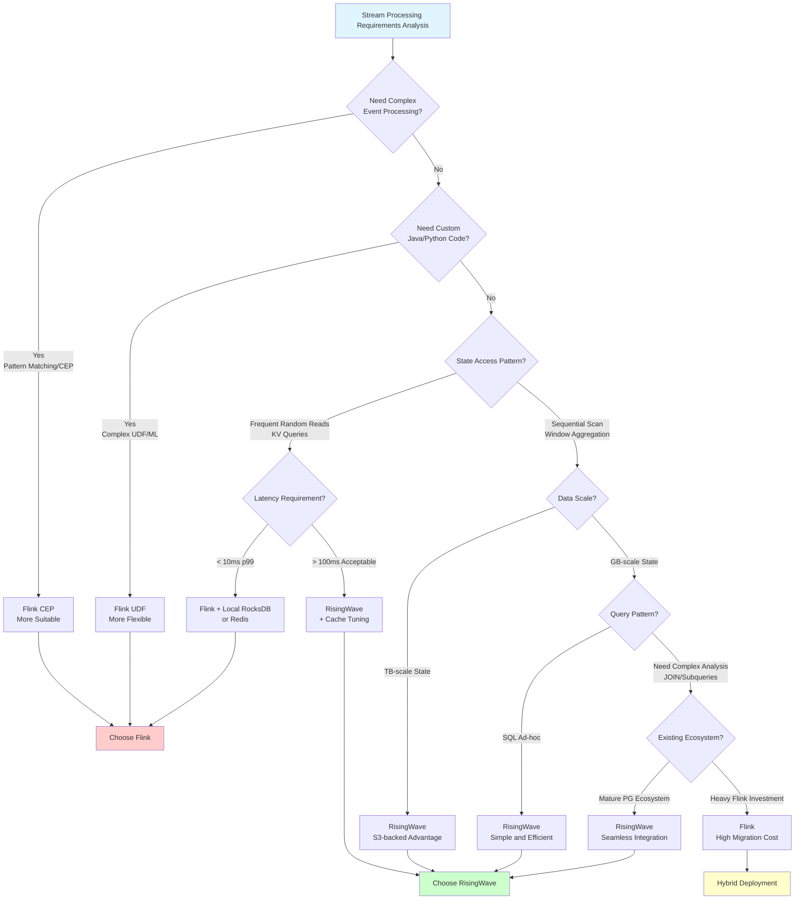
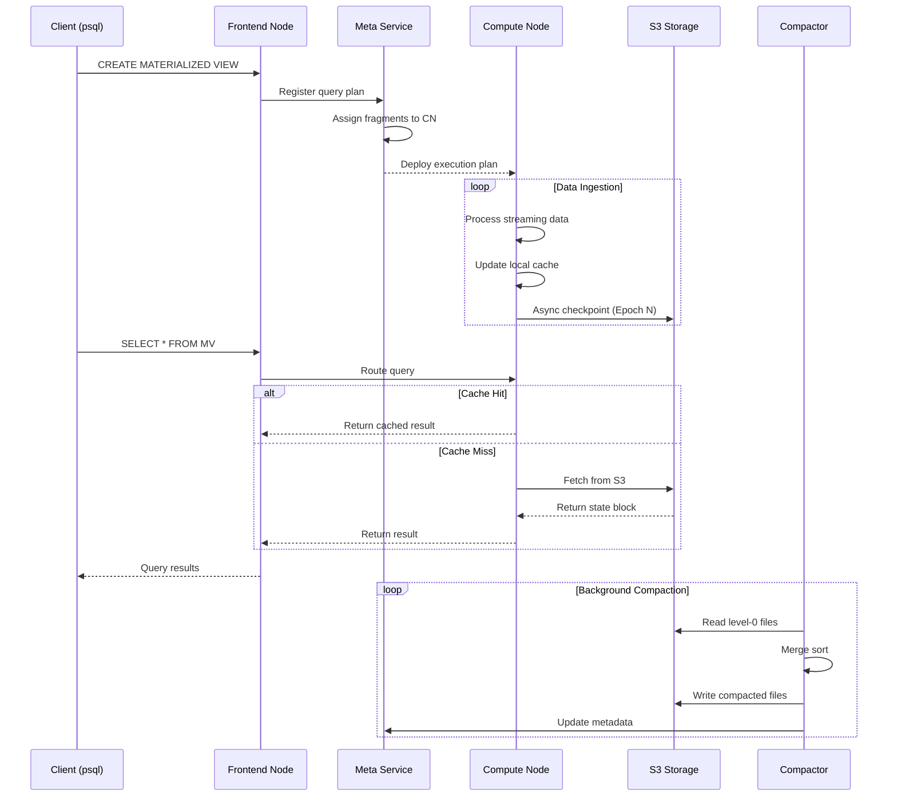

# RisingWave Architecture Deep Dive

> **Stage**: Flink/ | **Prerequisites**: [Flink Core Architecture Documentation] | **Formality Level**: L4 (Engineering Argumentation)
>
> **Document ID**: D1 | **Version**: v1.0 | **Date**: 2026-04-04

---

## 1. Definitions

### Def-RW-01: Streaming Database

**Definition**: A streaming database is a database system that deeply couples a **stream processing engine** with **materialized view storage**, satisfying the following formal characteristics:

$$
\text{StreamingDB} = \langle \mathcal{S}, \mathcal{Q}, \mathcal{M}, \mathcal{T} \rangle
$$

Where:

- $\mathcal{S}$: The set of unbounded stream data sources, $\mathcal{S} = \{s_1, s_2, ..., s_n\}$, where each $s_i$ is a time-series data stream
- $\mathcal{Q}$: The set of continuous queries, supporting standard relational algebra operations with SQL semantics
- $\mathcal{M}$: The materialized view manager, maintaining incremental updates of query results
- $\mathcal{T}$: The transaction consistency layer, ensuring serializability of read and write operations

**Intuitive Explanation**: Unlike the traditional Lambda architecture of "stream processing engine + external storage," a streaming database unifies computation and storage within a single system. Users execute SQL queries directly against materialized views without managing external storage systems.

---

### Def-RW-02: Compute-Storage Separation Architecture

**Definition**: Compute-storage separation is a cloud-native architecture pattern that decouples **stateless compute nodes** from **elastic remote storage**:

$$
\text{SepArch} = \langle \mathcal{C}, \mathcal{P}, \mathcal{I}, \mathcal{R} \rangle
$$

Where:

- $\mathcal{C} = \{c_1, ..., c_m\}$: The set of compute nodes, where $c_i$ is a stateless, horizontally scalable compute unit
- $\mathcal{P}$: The persistent storage layer (typically object storage, such as S3)
- $\mathcal{I}: \mathcal{C} \times \mathcal{P} \to \{0,1\}$: The access interface function between compute nodes and storage
- $\mathcal{R}: \mathcal{C} \times [0,1] \to \mathbb{N}$: The resource elasticity function, dynamically adjusting the number of compute nodes based on load

**Key Constraints**:

1. Compute nodes do not maintain persistent state locally
2. State Checkpoints are written directly to remote storage
3. Compute node failures can be migrated arbitrarily without data redistribution

---

### Def-RW-03: Unbounded Stream Materialized View

**Definition**: Let stream data source $S$ be an infinite sequence $S = \langle e_1, e_2, e_3, ... \rangle$, where each event $e_i = (t_i, k_i, v_i)$ contains a timestamp, key, and value. The materialized view $MV_Q$ for query $Q$ is formally defined as:

$$
MV_Q(t) = Q(S_{\leq t})
$$

Where $S_{\leq t} = \{e_i \in S \mid t_i \leq t\}$ represents all events prior to time $t$.

**Incremental Maintenance**: When a new event $e_{new}$ arrives, the materialized view update follows:

$$
MV_Q(t + \Delta t) = \mathcal{U}(MV_Q(t), e_{new}, Q)
$$

Where $\mathcal{U}$ is the query-specific incremental update operator, satisfying:

$$
\mathcal{U}(MV_Q(t), e_{new}, Q) = Q(S_{\leq t} \cup \{e_{new}\})
$$

**Intuitive Explanation**: A materialized view is a snapshot of query results at a given point in time. The system maintains its consistency through incremental computation rather than full recomputation, thereby enabling real-time query capabilities.

---

### Def-RW-04: PostgreSQL Protocol Compatibility Layer

**Definition**: The PostgreSQL protocol compatibility layer is a protocol translation layer $L_{pg}$ that implements bidirectional mapping between RisingWave's internal protocol and the PostgreSQL wire protocol:

$$
L_{pg} = \langle \mathcal{M}_{msg}, \mathcal{M}_{type}, \mathcal{M}_{auth} \rangle
$$

Where:

- $\mathcal{M}_{msg}$: Message format mapping, translating PG messages (Query, Parse, Bind, Execute) into internal commands
- $\mathcal{M}_{type}$: Type system mapping, supporting PG native types (INT4, INT8, VARCHAR, TIMESTAMP, JSONB, etc.)
- $\mathcal{M}_{auth}$: Authentication mechanism mapping, supporting MD5, SCRAM-SHA-256, and other authentication methods

---

## 2. Properties

### Prop-RW-01: Statelessness of Compute Nodes

**Proposition**: Under the compute-storage separation architecture, compute node $c \in \mathcal{C}$ is **stateless**, meaning that for any two time points $t_1, t_2$, the node state satisfies:

$$
\forall c \in \mathcal{C}, \forall t_1, t_2: \text{State}(c, t_1) = \text{State}(c, t_2) \oplus \Delta_{[t_1, t_2]}
$$

Where $\Delta_{[t_1, t_2]}$ is only temporary cached data that can be rebuilt from remote storage.

**Proof Sketch**:

1. All operator states are written to remote object storage (S3-compatible) via the State Store API
2. Checkpoint frequency is configurable (default 1-10 seconds), ensuring state persistence
3. When a node fails, the new node recovers state by reading the latest Checkpoint
4. Therefore, compute nodes only retain rebuildable temporary cache locally $\square$

---

### Prop-RW-02: Linear Speedup Under Horizontal Scaling

**Proposition**: For partition-friendly queries $Q$, let parallelism scale from $p$ to $kp$ ($k > 1$). System throughput satisfies:

$$
\text{Throughput}(Q, kp) \geq \alpha \cdot k \cdot \text{Throughput}(Q, p)
$$

Where $\alpha \in (0.7, 1.0]$ is the scaling efficiency coefficient, depending on data skew and shuffle overhead.

**Corollary**: When the query is a pure local aggregation (no shuffle), $\alpha \to 1$, achieving near-ideal linear scaling.

---

### Prop-RW-03: S3 State Access Latency Lower Bound

**Proposition**: Let $T_{s3}$ be the average latency of reading a state block from S3, and $T_{local}$ be the local SSD read latency. Then:

$$
T_{s3} \geq T_{local} + T_{network} + T_{s3\_processing}
$$

Where:

- $T_{local} \approx 50\mu s$ (NVMe SSD 4KB random read)
- $T_{s3} \approx 50-200ms$ (depending on region and network)

**Engineering Corollary**: Directly accessing S3 state is **1000-4000x slower** than local RocksDB. Therefore, RisingWave must rely on a **local cache layer** (such as Hummock Cache) to mitigate this gap.

---

## 3. Relations

### 3.1 RisingWave vs. Flink Architecture Mapping

| Architecture Component | RisingWave | Apache Flink | Relationship Description |
|------------------------|------------|--------------|--------------------------|
| **Compute Layer** | Compute Node (Rust) | TaskManager (JVM) | Language difference: Rust vs. Java |
| **State Storage** | Hummock (S3-backed) | RocksDB (Local) | Storage location: Remote vs. Local |
| **Coordination Service** | Meta Service | JobManager | Functional parity, both based on Raft |
| **SQL Layer** | Frontend (PG Protocol) | SQL Gateway / Table API | Protocol: PG vs. Custom |
| **Data Source** | Source Connector | Source Function | Conceptually equivalent, different APIs |
| **Fault Tolerance** | Epoch-based Checkpoint | Chandy-Lamport | Semantically equivalent, different implementations |
| **Scaling Method** | Compute-storage separation scaling | Independent TM/JM scaling | RW offers finer-grained elasticity |

### 3.2 Design Philosophy Comparison

**RisingWave: "Stream-as-a-Database"**

```
User Perspective: SQL -> Materialized View <- Stream Data Source
                          |
                    Real-time Query Results
System Implementation: Incremental Computation + S3 State + Local Cache
```

**Flink: "Stream-as-a-Process"**

```
User Perspective: DataStream API -> Operator Chain -> External Storage (Kafka/Redis/PG)
                          |
                    Application Code Processing
System Implementation: Exactly-Once Semantics + Local State + Checkpoint to External Storage
```

### 3.3 State Consistency Model

| Dimension | RisingWave | Flink |
|-----------|------------|-------|
| **Consistency Level** | Internal strong consistency (Serializability) | Operator-level Exactly-Once |
| **Checkpoint Interval** | 1-10 seconds (configurable) | Default 10 minutes (configurable) |
| **State Access** | Via Hummock API | Direct RocksDB access |
| **Failure Recovery** | Replay Epoch logs | Recover from Checkpoint |
| **State Size Limit** | Theoretically unbounded (S3) | Limited by TM local disk |

---

## 4. Argumentation

### 4.1 Why Choose Rust?

**Argumentation**: RisingWave's choice of Rust as the implementation language is based on the following technical trade-offs:

| Factor | Rust Advantage | Significance for RisingWave |
|--------|----------------|----------------------------|
| **Zero-Cost Abstractions** | Compile-time optimization, no runtime GC | Low-latency stream processing (< 100ms p99) |
| **Memory Safety** | Ownership system eliminates data races | Reliable concurrent state management |
| **Performance** | Near C++ runtime performance | High-throughput stream computation |
| **Ecosystem** | Rich async/concurrency libraries (Tokio) | Efficient I/O processing |
| **Cloud-Native** | Static linking, small binary size | Container-friendly deployment |

**Comparative Analysis**: Flink's JVM implementation, while possessing a mature ecosystem, is constrained by:

1. GC pauses affecting low-latency scenarios
2. JNI call overhead limiting vectorization performance
3. Higher memory footprint (JVM heap + off-heap)

### 4.2 S3-Backed State Management Engineering Trade-offs

**Advantages Argumentation**:

1. **Cost Efficiency**: S3 storage costs approximately $0.023/GB/month, far lower than EBS at $0.10/GB/month
2. **Unbounded Scaling**: Not limited by single-node disk capacity; state size is only constrained by budget
3. **Elastic Scaling**: Compute nodes can be scaled independently without data redistribution

**Limitations Argumentation**:

1. **Latency Sensitivity**: S3 access latency is 50-200ms, unsuitable for frequent random reads
2. **Cache Consistency**: Multi-node shared state requires complex cache invalidation strategies
3. **Cost Trap**: Frequent S3 API calls (List/Get) generate significant costs

**Mitigation Strategies**:

```
┌─────────────────────────────────────────────────────────┐
│              RisingWave State Tiering                   │
├─────────────────────────────────────────────────────────┤
│  L1: Operator Cache (Memory)  - Hot data, microsecond   │
│  L2: Block Cache (Local SSD)  - Warm data, millisecond  │
│  L3: S3 Object Store          - Cold data, ~100ms       │
└─────────────────────────────────────────────────────────┘
```

### 4.3 Strategic Significance of PostgreSQL Protocol Compatibility

**Argumentation**: RisingWave's choice of the PG protocol over a custom protocol is based on the following considerations:

1. **Ecosystem Compatibility**: Direct use of PG clients (psql, JDBC, psycopg2, etc.)
2. **BI Tool Integration**: Tableau, Metabase, Superset work out of the box
3. **Learning Curve**: Lowers user migration cost without requiring learning a new API
4. **Transaction Semantics**: Reuses PG's mature transaction model

**Limitations**: The PG protocol was originally designed for OLTP and does not fully match stream processing semantics:

- Streaming result sets require special push mechanisms
- Window operations require extended SQL syntax

---

## 5. Formal Proof / Engineering Argument

### 5.1 Architecture Correctness Argumentation

**Theorem (Thm-RW-01)**: RisingWave's compute-storage separation architecture guarantees exactly-once semantics under the following conditions:

**Prerequisites**:

1. Checkpoint barriers propagate in order (Epoch monotonically increasing)
2. State writes to S3 are atomic (S3 PutObject semantics)
3. The metadata service (Meta Service) uses Raft to guarantee consistency

**Proof**:

Let the data stream be an event sequence $E = \{e_1, e_2, ...\}$, and Checkpoint barriers be $B_k$ marking Epoch $k$.

**Step 1**: When an operator receives $B_k$, it asynchronously writes the current state $S_k$ to S3:
$$
\text{async\_write}(S_k) \to \text{S3://bucket/state/epoch\_}k
$$

**Step 2**: The metadata service records Checkpoint metadata:
$$
\text{Meta}.\text{commit}(k, \text{object\_ids}) \text{ with Raft consensus}
$$

**Step 3**: During failure recovery, recover from the maximum committed Epoch $k_{max}$:
$$
S_{recover} = \text{S3}.\text{read}(\text{Meta}.\text{get\_checkpoint}(k_{max}))
$$

**Step 4**: Since S3 writes are atomic and metadata uses Raft, the recovered state $S_{recover}$ is consistent with the pre-failure state $S_{k_{max}}$.

**Step 5**: Event replay starts from the offset after $k_{max}$, ensuring no duplicate processing.

Therefore, exactly-once semantics is proven $\square$

---

### 5.2 Performance Engineering Argumentation

**Proposition (Prop-RW-04)**: In the Nexmark Q5 (window aggregation) test, RisingWave's 2-500x performance advantage over Flink stems from the following factors:

**Factor Analysis Matrix**:

| Factor | RisingWave | Flink | Impact Multiplier |
|--------|------------|-------|-------------------|
| **Language Runtime** | Rust zero-cost abstraction | JVM + GC | 1.5-2x |
| **Serialization** | Native memory layout | Java serialization | 2-3x |
| **State Access** | Local cache hit | RocksDB local access | Comparable |
| **Vectorized Execution** | Automatic vectorization | Depends on Blink Planner | 2-5x |
| **Architecture Coupling** | Built-in materialized views | Requires external storage | 10-100x |
| **Query Optimization** | Stream-specialized optimizer | General batch-stream optimizer | 2-5x |

**Combined Effect**: The multiplicative effect of these factors leads to an overall performance gap in the 2-500x range, depending on query type and data characteristics.

---

## 6. Examples

### 6.1 Materialized View Creation Example

```sql
-- RisingWave: Create source table (reading from Kafka)
CREATE SOURCE user_events (
    user_id INT,
    event_type VARCHAR,
    amount DECIMAL,
    event_time TIMESTAMP
) WITH (
    connector = 'kafka',
    topic = 'user_events',
    properties.bootstrap.server = 'kafka:9092'
) FORMAT PLAIN ENCODE JSON;

-- Create materialized view (real-time aggregation)
CREATE MATERIALIZED VIEW hourly_stats AS
SELECT
    TUMBLE(event_time, INTERVAL '1 HOUR') as window_start,
    event_type,
    COUNT(*) as event_count,
    SUM(amount) as total_amount,
    AVG(amount) as avg_amount
FROM user_events
GROUP BY
    TUMBLE(event_time, INTERVAL '1 HOUR'),
    event_type;

-- Query materialized view directly (millisecond-level response)
SELECT * FROM hourly_stats
WHERE window_start >= NOW() - INTERVAL '1 DAY';
```

**Flink Equivalent Implementation**:

```java

// [伪代码片段 - 不可直接运行] 仅展示核心逻辑
import org.apache.flink.streaming.api.datastream.DataStream;
import org.apache.flink.streaming.api.windowing.time.Time;

// Flink: Requires external storage (e.g., Redis/MySQL) for results
DataStream<Event> events = env
    .fromSource(kafkaSource, WatermarkStrategy.forMonotonousTimestamps(), "Kafka")
    .keyBy(e -> e.eventType)
    .window(TumblingEventTimeWindows.of(Time.hours(1)))
    .aggregate(new StatsAggregate())
    .addSink(new RedisSink<>());  // Requires managing external storage

// Queries require accessing Redis, non-SQL interface
```

### 6.2 Architecture Deployment Example

**RisingWave Cloud-Native Deployment** (Kubernetes):

```yaml
# risingwave-compute.yaml
apiVersion: apps/v1
kind: Deployment
metadata:
  name: risingwave-compute
spec:
  replicas: 3  # Compute nodes, independently scalable
  template:
    spec:
      containers:
      - name: compute-node
        image: risingwavelabs/risingwave:v1.7.0
        command: ["compute-node"]
        env:
        - name: RW_STATE_STORE
          value: "hummock+s3://risingwave-state"
        resources:
          requests:
            memory: "8Gi"
            cpu: "4"
---
# risingwave-meta.yaml - Metadata service
apiVersion: apps/v1
kind: StatefulSet
metadata:
  name: risingwave-meta
spec:
  replicas: 3  # Raft cluster
  serviceName: risingwave-meta
  template:
    spec:
      containers:
      - name: meta-node
        image: risingwavelabs/risingwave:v1.7.0
        command: ["meta-node"]
        args: ["--listen-addr", "0.0.0.0:5690"]
```

---

## 7. Visualizations

### 7.1 RisingWave Overall Architecture Diagram



### 7.2 Flink vs RisingWave Architecture Comparison Matrix



### 7.3 RisingWave Limitations and Use Case Decision Tree



### 7.4 RisingWave Component Data Flow Diagram



---

## 8. References


---

## Appendix A: Objective Analysis of RisingWave Limitations

### A.1 Current Limitations

| Limitation Area | Specific Description | Impact Level | Mitigation |
|-----------------|---------------------|--------------|------------|
| **Latency-Sensitive Scenarios** | S3 access latency 50-200ms, unsuitable for < 10ms p99 scenarios | ⚠️ High | Increase memory/SSD cache, or use Flink |
| **Complex Event Processing** | No built-in CEP library, weak pattern matching | ⚠️ Medium | Integrate external CEP engine |
| **UDF Language Support** | Mainly supports Rust/Python UDFs, limited Java UDF | ⚠️ Medium | Use Python UDF or external service |
| **Ecosystem Maturity** | Smaller community compared to Flink, limited third-party connectors | ⚠️ Medium | Use Kafka/PG protocol bridging |
| **Cloud Vendor Lock-in** | Deeply optimized for S3 API, multi-cloud deployment requires adaptation | ⚠️ Low | Supports MinIO and other S3-compatible storage |

### A.2 Unsuitable Scenarios

1. **High-Frequency Trading (HFT)**: Financial trading requiring microsecond-level latency
2. **Complex Pattern Matching**: Fraud detection scenarios requiring CEP
3. **Legacy System Integration**: Old systems dependent on specific Flink Connectors
4. **Strong Consistency Transactions**: OLTP scenarios requiring cross-table ACID transactions

---

## Appendix B: Terminology Cross-Reference

| RisingWave Term | Flink Term | General Concept |
|-----------------|------------|-----------------|
| Materialized View | No direct equivalent | Pre-computed query results |
| Compute Node | TaskManager | Stream processing execution unit |
| Meta Service | JobManager | Cluster coordination service |
| Hummock | RocksDB (State Backend) | State storage engine |
| Epoch | Checkpoint Barrier | Consistent snapshot marker |
| Compactor | No direct equivalent | Background data compaction service |
| Source | Source | Data input |

---

*Document Status: ✅ Completed (D1/4) | Next: 02-nexmark-head-to-head.md*
