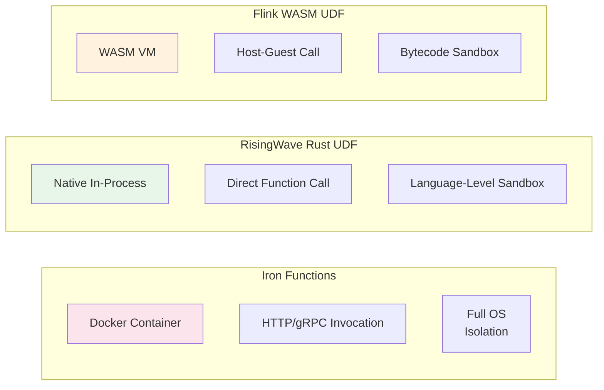
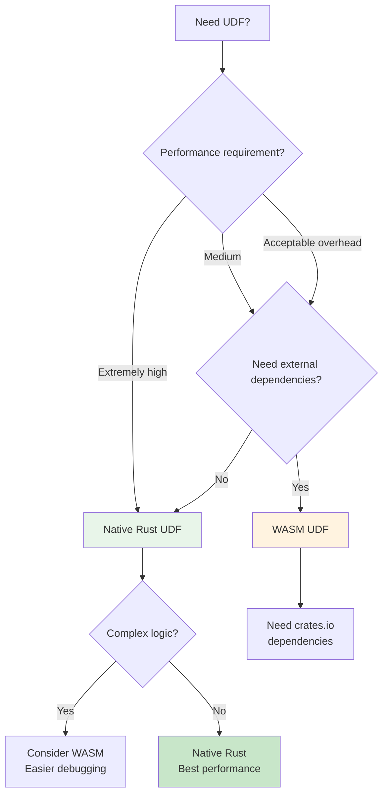
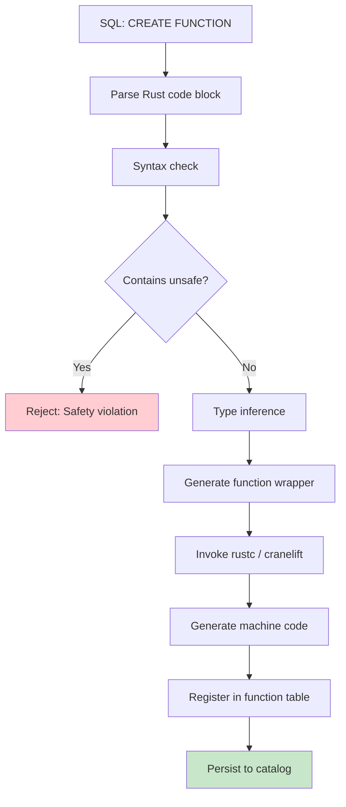
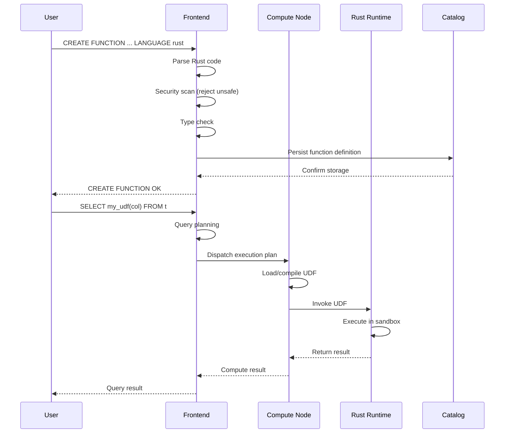

# RisingWave Native Rust UDF Technical Guide

> **Stage**: Flink/Rust Ecosystem Comparison | **Prerequisites**: [Flink WASM UDF Guide](../../03-api/09-language-foundations/flink-25-wasm-udf-ga.md) | **Formalization Level**: L3

---

## 1. Definitions

### 1.1 RisingWave Native Rust UDF Model

**Def-RW-RUST-01: RisingWave Native Rust UDF**

A RisingWave native Rust UDF refers to a user-defined function declared directly in the RisingWave database using `LANGUAGE rust`, whose function body is embedded in the SQL statement as Rust source code, compiled and executed directly by RisingWave's internal Rust runtime without going through a WebAssembly intermediate layer.

```sql
CREATE FUNCTION gcd(INT, INT) RETURNS INT
LANGUAGE rust
AS $$
    fn gcd(a: i32, b: i32) -> i32 {
        if b == 0 { a } else { gcd(b, a % b) }
    }
$$;
```

### 1.2 Core Architecture Components

```mermaid
graph TB
    subgraph "SQL Layer"
        A[CREATE FUNCTION<br/>LANGUAGE rust]
        B[Function Call<br/>SELECT gcd(a, b)]
    end

    subgraph "RisingWave Kernel"
        C[SQL Parser]
        D[Function Registry]
        E[Rust Expression Runtime]
        F[JIT Compiler]
        G[Execution Engine]
    end

    subgraph "Storage Layer"
        H[Metadata Storage<br/>pg_catalog]
    end

    A --> C
    C --> D
    D --> H
    B --> E
    E --> F
    F --> G

    style A fill:#e1f5fe
    style E fill:#fff3e0
    style F fill:#e8f5e9
```

### 1.3 Table Function Iterator Contract

**Def-RW-RUST-02: Table Function Iterator Contract**

A table function (Table Function / UDTF) must return a type implementing `Iterator<Item = T>`, where `T` corresponds to the row type of the returned table. RisingWave generates the result set row by row by polling this iterator.

```rust
// Table function signature example
fn series(start: i32, stop: i32) -> impl Iterator<Item = (i32,)> {
    (start..=stop).map(|i| (i,))
}
```

---

## 2. Properties

### 2.1 Type Safety Properties

**Lemma-RW-RUST-01: Compile-Time Type Safety**

RisingWave Rust UDF performs compilation checks at function creation time, ensuring:

- Parameter types match the SQL declaration
- Return type matches the SQL declaration
- All code paths return a compatible type

**Lemma-RW-RUST-02: Zero-Cost Abstraction**

Native Rust UDFs are directly compiled into machine code for execution, without going through a WASM VM interpretation layer, possessing the zero-cost abstraction characteristic.

### 2.2 Performance Properties

**Prop-RW-RUST-01: Native vs WASM Performance Trade-offs**

| Performance Metric | LANGUAGE rust | LANGUAGE wasm | Reason for Difference |
|--------------------|---------------|---------------|-----------------------|
| Cold-start latency | < 1ms | 10-100ms | No WASM instantiation needed |
| Execution throughput | 100% | 85-95% | No VM boundary overhead |
| Memory footprint | Low | Medium | WASM linear memory allocation |
| Compilation time | Depends on local toolchain | Precompiled .wasm | Slower on first creation |

### 2.3 Security Sandbox Properties

**Lemma-RW-RUST-03: Execution Isolation**

RisingWave guarantees the safety of native Rust UDFs through the following mechanisms:

1. **Unsafe code prohibited**: The compiler rejects functions containing `unsafe` blocks
2. **Standard library whitelist**: Only a safe subset of the standard library is allowed
3. **Network/file disabled**: I/O operations are prohibited at runtime
4. **Timeout mechanism**: Single function execution exceeding the threshold is automatically terminated

```rust
// ✅ Allowed: pure computation
fn allowed(x: i32) -> i32 { x * x }

// ❌ Rejected: contains unsafe
fn rejected() -> i32 {
    unsafe { std::ptr::read_volatile(0x0 as *const i32) }
}

// ❌ Rejected: system call
fn rejected_io() {
    std::fs::read("/etc/passwd"); // Rejected at compile or runtime
}
```

---

## 3. Relations

### 3.1 Comparison with Flink WASM UDF

| Feature | RisingWave<br/>LANGUAGE rust | Flink<br/>LANGUAGE wasm |
|---------|------------------------------|------------------------|
| **Execution Model** | Native machine code | WASM bytecode + VM |
| **Performance** | Higher (no VM overhead) | Medium (VM interpretation/JIT) |
| **Dependency Support** | Limited (whitelist stdlib) | Full (Cargo + WASI) |
| **Cold Start** | < 1ms | Slower (instantiation) |
| **Ecosystem** | Restricted | Rich (crates.io) |
| **Debugging Experience** | Native stack traces | WASM source maps |
| **Deployment** | SQL inline | External .wasm file |
| **Version Management** | Function-level | Module-level |

### 3.2 Comparison with Iron Functions



### 3.3 Technology Selection Decision Tree



---

## 4. Argumentation

### 4.1 When to Choose Native Rust UDF?

**Scenario 1: High-Frequency Scalar Computation**

```rust
-- Financial real-time risk control: millions of price calculations per second
CREATE FUNCTION calc_volatility(prices FLOAT[]) RETURNS FLOAT
LANGUAGE rust
AS $$
    fn calc_volatility(prices: &[f64]) -> f64 {
        let n = prices.len() as f64;
        let mean = prices.iter().sum::<f64>() / n;
        let variance = prices.iter()
            .map(|p| (p - mean).powi(2))
            .sum::<f64>() / n;
        variance.sqrt()
    }
$$;
```

**Rationale**: No I/O, pure mathematical computation, requires ultimate performance.

**Scenario 2: Stateless Transformation**

```rust
-- Log parsing: JSON field extraction
CREATE FUNCTION extract_trace_id(log_line VARCHAR) RETURNS VARCHAR
LANGUAGE rust
AS $$
    fn extract_trace_id(log_line: &str) -> &str {
        log_line.split("trace_id=")
            .nth(1)
            .and_then(|s| s.split_whitespace().next())
            .unwrap_or("")
    }
$$;
```

**Scenario 3: Table Function Generating Sequences**

```sql
-- Time series expansion
CREATE FUNCTION generate_timestamps(
    start_ts TIMESTAMP,
    interval_ms INT,
    count INT
) RETURNS TABLE (ts TIMESTAMP)
LANGUAGE rust
AS $$
    fn generate_timestamps(
        start: i64,
        interval: i32,
        count: i32
    ) -> impl Iterator<Item = (i64,)> {
        (0..count).map(move |i| {
            (start + (i as i64) * (interval as i64),)
        })
    }
$$;
```

### 4.2 When to Choose WASM UDF?

**Scenario 1: Need External Crates**

```toml
# Cargo.toml - WASM UDF can use full dependencies
[dependencies]
serde_json = "1.0"
regex = "1.10"
chrono = "0.4"
```

**Scenario 2: Complex Business Logic**

Requires full Rust ecosystem support, such as:

- Regular expression engine (`regex` crate)
- Complex serialization (`serde`)
- Mathematical computation libraries (`nalgebra`, `rust-ml`)

**Scenario 3: Cross-Platform Reuse**

WASM modules can be reused across RisingWave, Flink, and other WASM runtimes.

---

## 5. Engineering Argument

### 5.1 Data Type Mapping Specification

**Def-RW-RUST-03: SQL-Rust Type Mapping**

| SQL Type | Rust Type | Description |
|----------|-----------|-------------|
| `BOOLEAN` | `bool` | Direct mapping |
| `INT2` | `i16` | 16-bit signed integer |
| `INT4` / `INT` | `i32` | 32-bit signed integer |
| `INT8` / `BIGINT` | `i64` | 64-bit signed integer |
| `FLOAT4` / `REAL` | `f32` | 32-bit floating point |
| `FLOAT8` / `DOUBLE` | `f64` | 64-bit floating point |
| `VARCHAR` / `STRING` | `&str` | UTF-8 string slice |
| `BYTEA` | `&[u8]` | Byte slice |
| `DATE` | `i32` | Days since Unix epoch |
| `TIME` | `i64` | Microseconds |
| `TIMESTAMP` | `i64` | Microsecond timestamp |
| `INTERVAL` | `Interval` | Dedicated struct |
| `DECIMAL` | `RustDecimal` | Exact decimal |
| `STRUCT<T...>` | `#[derive(StructType)]` | Derive macro |
| `ARRAY<T>` | `&[T]` | Slice reference |

### 5.2 Build Process Detailed



### 5.3 Engineering Optimization Tips

**Tip 1: Avoid Unnecessary Memory Allocation**

```rust
-- ❌ Inefficient: allocates a new String every time
fn slow(name: &str) -> String {
    format!("Hello, {}", name)  // Heap allocation
}

-- ✅ Efficient: return &str or Cow
fn fast<'a>(name: &'a str) -> std::borrow::Cow<'a, str> {
    if name.is_empty() {
        "Anonymous".into()
    } else {
        format!("Hello, {}", name).into()
    }
}
```

**Tip 2: Use Iterators to Avoid Intermediate Collections**

```rust
-- ❌ Inefficient: creates intermediate Vec
fn slow_sum_squares(nums: &[i32]) -> i32 {
    nums.iter()
        .map(|x| x * x)
        .collect::<Vec<_>>()  // Unnecessary allocation
        .iter()
        .sum()
}

-- ✅ Efficient: direct iterator sum
fn fast_sum_squares(nums: &[i32]) -> i32 {
    nums.iter()
        .map(|x| x * x)
        .sum()  // No intermediate allocation
}
```

**Tip 3: Use Generator Pattern for Table Functions**

```rust
-- ✅ Efficient: lazy evaluation, memory-friendly
fn parse_csv_row(row: &str) -> impl Iterator<Item = (&str, &str)> + '_ {
    row.split(',')
        .filter_map(|field| {
            let mut parts = field.splitn(2, '=');
            Some((parts.next()?, parts.next()?))
        })
}
```

---

## 6. Examples

### 6.1 Scalar Function: GCD (Greatest Common Divisor)

```sql
-- Create GCD function
CREATE FUNCTION gcd(a INT, b INT) RETURNS INT
LANGUAGE rust
AS $$
    fn gcd(a: i32, b: i32) -> i32 {
        let mut a = a.abs();
        let mut b = b.abs();

        while b != 0 {
            let temp = b;
            b = a % b;
            a = temp;
        }

        a
    }
$$;

-- Usage examples
SELECT gcd(48, 18);  -- Returns 6
SELECT gcd(100, 35); -- Returns 5

-- Use in stream computation
CREATE MATERIALIZED VIEW normalized_ratios AS
SELECT
    id,
    value_a / gcd(value_a, value_b) as num,
    value_b / gcd(value_a, value_b) as den
FROM measurements;
```

### 6.2 Table Function: Generate Series

```sql
-- Create series generation function
CREATE FUNCTION series(start INT, stop INT)
RETURNS TABLE (n INT)
LANGUAGE rust
AS $$
    fn series(start: i32, stop: i32) -> impl Iterator<Item = (i32,)> {
        (start..=stop).map(|i| (i,))
    }
$$;

-- Usage example: generate sequence from 1 to 5
SELECT * FROM series(1, 5);
-- Result:
-- n
-- ---
-- 1
-- 2
-- 3
-- 4
-- 5

-- Use in JOIN (expand array to rows)
CREATE MATERIALIZED VIEW expanded_events AS
SELECT
    e.id,
    e.timestamp,
    n as position,
    e.items[n] as item
FROM events e,
LATERAL series(1, array_length(e.items)) as t(n);
```

### 6.3 Structured Type: Key-Value Parsing

```sql
-- Define structured return type
CREATE TYPE key_value_pair AS (
    key VARCHAR,
    value VARCHAR,
    is_numeric BOOLEAN
);

-- Create parsing function
CREATE FUNCTION parse_query_string(query VARCHAR)
RETURNS TABLE (key_value key_value_pair)
LANGUAGE rust
AS $$
    // Use derive macro to automatically implement StructType
    #[derive(StructType)]
    struct KeyValuePair {
        key: String,
        value: String,
        is_numeric: bool,
    }

    fn parse_query_string(query: &str) -> impl Iterator<Item = (KeyValuePair,)> {
        query.split('&')
            .filter_map(|pair| {
                let mut parts = pair.splitn(2, '=');
                let key = parts.next()?;
                let value = parts.next().unwrap_or("");

                Some((KeyValuePair {
                    key: key.to_string(),
                    value: value.to_string(),
                    is_numeric: value.parse::<f64>().is_ok(),
                },))
            })
            .collect::<Vec<_>>()
            .into_iter()
    }
$$;

-- Usage example
SELECT * FROM parse_query_string('name=John&age=30&city=NYC');
-- Result:
-- key    | value | is_numeric
-- --------|-------|------------
-- name   | John  | false
-- age    | 30    | true
-- city   | NYC   | false
```

### 6.4 Aggregate Function Example (Pseudocode)

```sql
-- Note: As of 2024, RisingWave native Rust UDF aggregate function support is still evolving
-- The following is expected syntax (based on community discussions)

CREATE AGGREGATE FUNCTION geometric_mean(FLOAT8)
RETURNS FLOAT8
LANGUAGE rust
AS $$
    // Aggregation state structure
    struct GeometricMeanState {
        product: f64,
        count: i64,
    }

    // State creation
    fn state_create() -> GeometricMeanState {
        GeometricMeanState { product: 1.0, count: 0 }
    }

    // Accumulate
    fn state_accumulate(
        state: &mut GeometricMeanState,
        value: f64
    ) {
        state.product *= value;
        state.count += 1;
    }

    // Merge (for distributed aggregation)
    fn state_merge(
        state1: &mut GeometricMeanState,
        state2: &GeometricMeanState
    ) {
        state1.product *= state2.product;
        state1.count += state2.count;
    }

    // Final result
    fn state_finish(state: &GeometricMeanState) -> f64 {
        if state.count == 0 {
            0.0
        } else {
            state.product.powf(1.0 / state.count as f64)
        }
    }
$$;
```

---

## 7. Visualizations

### 7.1 RisingWave Rust UDF Architecture Panorama

```mermaid
graph TB
    subgraph "Client"
        Client[psql / JDBC / Python]
    end

    subgraph "RisingWave Frontend"
        Frontend[Frontend Node]
        SQLParser[SQL Parser]
        Planner[Query Planner]
        FuncRegistry[Function Registry]
    end

    subgraph "RisingWave Compute Layer"
        Compute[Compute Node]
        StreamEngine[Stream Execution Engine]
        BatchEngine[Batch Execution Engine]
        RustRuntime[Rust UDF Runtime]

        subgraph "UDF Sandbox"
            Compiler[Restricted Compiler]
            ExecEnv[Execution Environment]
            MemLimit[Memory Limiter]
            Timeout[Timeout Monitor]
        end
    end

    subgraph "Storage Layer"
        Meta[Meta Service]
        Catalog[pg_catalog]
        StateStore[Hummock / S3]
    end

    Client --> Frontend
    Frontend --> SQLParser
    SQLParser --> Planner
    Planner --> FuncRegistry
    FuncRegistry --> Catalog

    Planner --> Compute
    Compute --> StreamEngine
    Compute --> BatchEngine

    StreamEngine --> RustRuntime
    BatchEngine --> RustRuntime

    RustRuntime --> Compiler
    RustRuntime --> ExecEnv
    ExecEnv --> MemLimit
    ExecEnv --> Timeout

    style RustRuntime fill:#fff3e0
    style UDF fill:#e8f5e9
```

### 7.2 UDF Execution Flow Sequence Diagram



### 7.3 Type System Mapping Diagram

```mermaid
graph LR
    subgraph "SQL Type System"
        SQL_INT[INT / INT4]
        SQL_BIGINT[INT8 / BIGINT]
        SQL_TEXT[VARCHAR / TEXT]
        SQL_STRUCT[STRUCT<...>]
        SQL_ARRAY[ARRAY<T>]
    end

    subgraph "Rust Type System"
        RUST_I32[i32]
        RUST_I64[i64]
        RUST_STR[&str]
        RUST_STRUCT[#[derive(StructType)]
struct MyStruct]
        RUST_SLICE[&[T]]
    end

    SQL_INT --> RUST_I32
    SQL_BIGINT --> RUST_I64
    SQL_TEXT --> RUST_STR
    SQL_STRUCT --> RUST_STRUCT
    SQL_ARRAY --> RUST_SLICE
```

---

## 8. References

---

## Appendix A: Full Syntax Reference

### A.1 CREATE FUNCTION Syntax

```sql
CREATE FUNCTION function_name (
    [ arg_name arg_type [, ...] ]
)
[
    RETURNS return_type
    | RETURNS TABLE ( column_name column_type [, ...] )
]
LANGUAGE rust
AS [ $$ function_body $$ | 'function_body' ];
```

### A.2 Supported Return Modes

| Mode | Syntax | Rust Return Type |
|------|--------|------------------|
| Scalar | `RETURNS type` | `T` |
| Table | `RETURNS TABLE(...)` | `impl Iterator<Item = (T1, T2, ...)>` |
| Set | `RETURNS SETOF type` | `impl Iterator<Item = T>` |

### A.3 Function Management Commands

```sql
-- View function definition
SELECT * FROM pg_proc WHERE proname = 'gcd';

-- Drop function
DROP FUNCTION gcd(INT, INT);

-- View all UDFs
SELECT proname, prosrc
FROM pg_proc p
JOIN pg_namespace n ON p.pronamespace = n.oid
WHERE n.nspname = 'public';
```

---

## Appendix B: Troubleshooting

### B.1 Common Errors

| Error Message | Cause | Solution |
|---------------|-------|----------|
| `unsafe code is not allowed` | Code contains unsafe blocks | Remove all unsafe code |
| `type mismatch` | Rust type does not match SQL declaration | Check type mapping table |
| `std::fs not found` | Used a prohibited module | Only use whitelisted standard library |
| `compilation timeout` | Code too complex | Simplify code or split functions |

### B.2 Debugging Tips

```sql
-- 1. Test a simple version first
CREATE FUNCTION test_add(INT, INT) RETURNS INT
LANGUAGE rust AS 'fn test_add(a: i32, b: i32) -> i32 { a + b }';

-- 2. Gradually increase complexity
-- 3. Use EXPLAIN to view execution plan
EXPLAIN SELECT my_udf(col) FROM my_table;
```

---

*Document Version: v1.0 | Last Updated: 2026-04-05 | Status: Completed*
