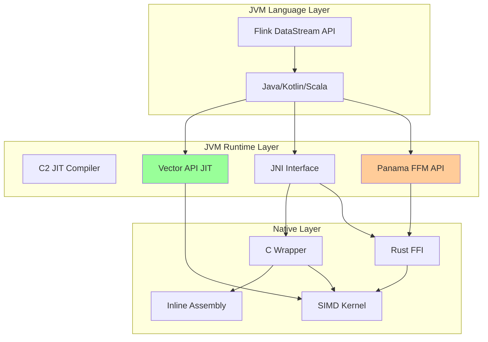
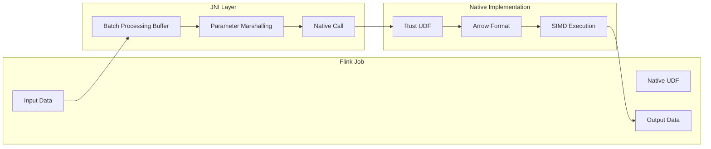
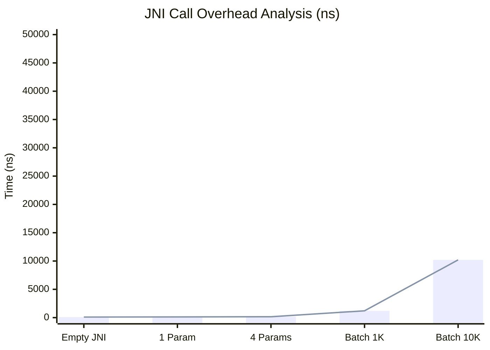
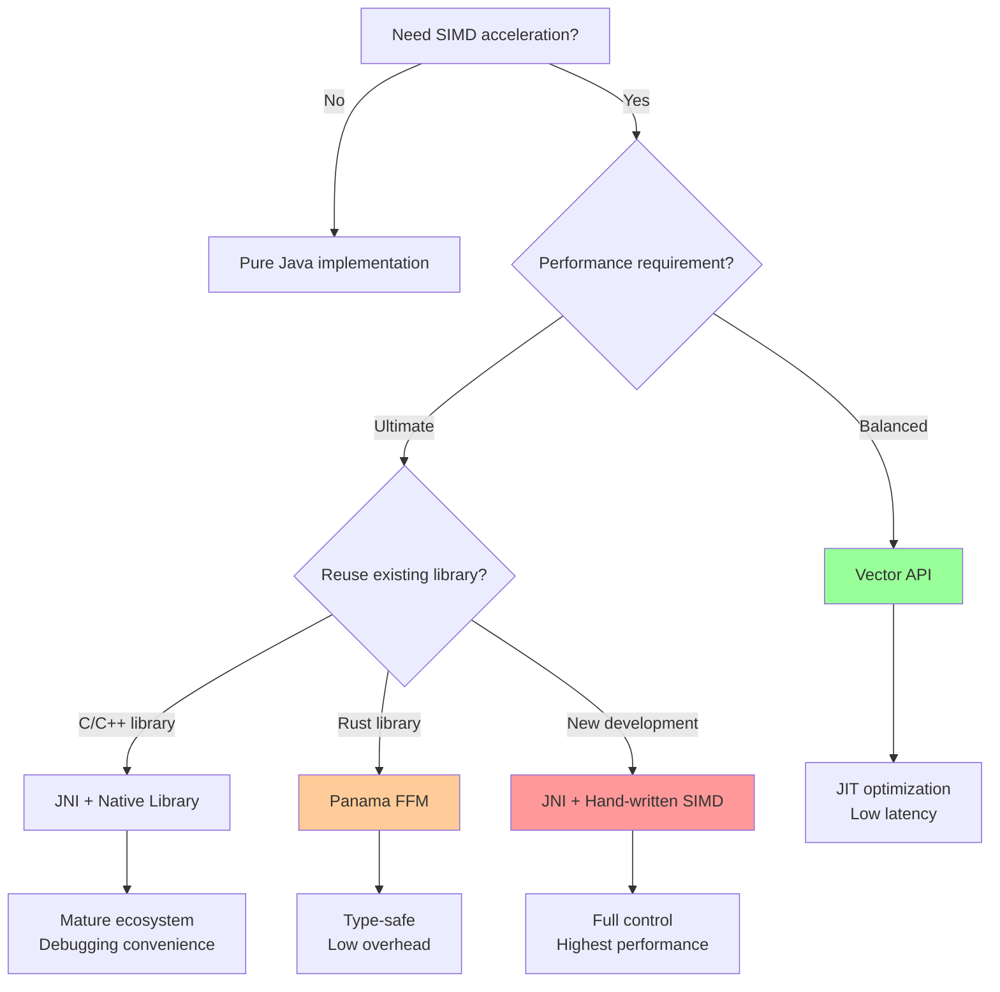

> **Status**: 🔮 Forward-looking Content | **Risk Level**: High | **Last Updated**: 2026-04
>
> The content described in this document is in early planning stages and may differ from the final implementation. Please refer to official Apache Flink releases.
>
# JNI to Assembly Code Bridge

> **Stage**: Flink/14-rust-assembly-ecosystem/simd-optimization | **Prerequisites**: 01-simd-fundamentals.md | **Formality Level**: L4
>
> **Target Audience**: Flink Native UDF developers, JVM performance engineers, cross-language integration developers
> **Keywords**: JNI, JVM, SIMD, Vector API, Panama, cross-language call, zero-copy

---

## 1. Definitions

### Def-SIMD-07: JNI (Java Native Interface)

**Definition 1.1 (JNI Calling Convention)**

JNI is the standard interface for interoperability between the JVM and native code (C/C++/Assembly). Call overhead model:

$$T_{jni\_call} = T_{transition} + T_{native\_exec} + T_{return}$$

Where $T_{transition}$ includes:

- Stack frame switching (~50-100 ns)
- JNI local reference management (~20-50 ns)
- Parameter marshalling (~10-30 ns per parameter)

**Definition 1.2 (Batch Call Optimization)**

Let the single JNI call overhead be $C$, the native execution time for processing $n$ elements be $T(n)$. Then batch processing efficiency:

$$\text{Efficiency}(n) = \frac{n \cdot C + n \cdot T(1)}{C + T(n)}$$

As $n \to \infty$, efficiency approaches $T(1) / (T(n)/n)$, i.e., the vectorization speedup.

### Def-SIMD-08: JVM SIMD Support Paths

**Definition 2.1 (Vector API - JEP 338/414/417)**

Vector API is Java's standard SIMD programming interface, providing the following abstractions:

```java
// VectorSpecies defines vector shape
VectorSpecies<Float> SPECIES = FloatVector.SPECIES_256;

// Vector operations
FloatVector va = FloatVector.fromArray(SPECIES, array, 0);
FloatVector vb = FloatVector.fromArray(SPECIES, array, 8);
FloatVector vc = va.add(vb);  // SIMD addition
```

**Definition 2.2 (Panama Foreign Function & Memory API - JEP 424/434)**

The Panama project provides a modern alternative to JNI for interoperability:

| Feature | JNI | Panama FFM |
|---------|-----|-----------|
| Type Safety | Runtime check | Compile-time check |
| Memory Access | `ByteBuffer` / Direct memory | `MemorySegment` |
| Call Overhead | High (~100ns) | Low (~10ns) |
| SIMD Friendliness | Manual alignment required | Native alignment support |

### Def-SIMD-09: Safety Boundary

**Definition 3.1 (JNI Safety Contract)**

The JNI layer must maintain the following invariants:

1. **Type Safety**: Native code must not corrupt JVM heap object structure
2. **Memory Safety**: Native pointers must be used within their valid lifetime
3. **Exception Safety**: Native code must correctly handle JVM exception states

Formal representation as a state machine:

$$\text{SafeJNI} = \{s \in States \mid \forall o \in Objects: Type(o, s) = Type(o, s_0)\}$$

**Definition 3.2 (Zero-Copy Data Transfer)**

Zero-copy means data transfer between JVM heap and native memory without intermediate copying:

$$\text{CopyOverhead} = \begin{cases}
0 & \text{if direct buffer or unsafe access} \\
O(n) & \text{if array copy required}
\end{cases}$$

---

## 2. Properties

### Prop-SIMD-05: Batch Call Benefits

**Proposition 1.1 (Optimal Batch Size)**

Let the fixed JNI call overhead be $C$, the per-element processing time be $t$, and the vectorization width be $w$. Then the optimal batch size $n^*$ satisfies:

$$n^* = \frac{C}{t} \cdot \frac{w}{w-1}$$

For typical Flink scenarios:
- $C \approx 100$ ns
- $t \approx 1$ ns (SIMD addition)
- $w = 8$ (AVX2)

$$n^* \approx \frac{100}{1} \cdot \frac{8}{7} \approx 115$$

That is, batch size should be at least 100-200 to amortize JNI overhead.

**Proposition 1.2 (Call Frequency Upper Bound)**

For throughput target $R$ (elements/sec), the maximum call frequency $F_{max}$ is:

$$F_{max} = \frac{R}{n^*} = \frac{R \cdot t \cdot (w-1)}{C \cdot w}$$

When $R = 10^7$ elements/sec:
$$F_{max} \approx \frac{10^7 \cdot 1 \cdot 7}{100 \cdot 8} \approx 87,500 \text{ calls/sec}$$

### Prop-SIMD-06: Memory Layout Compatibility

**Proposition 2.1 (Columnar Memory SIMD Friendliness)**

JVM array columnar layouts satisfy SIMD load alignment conditions:

| Layout Type | Memory Continuity | SIMD Friendliness |
|-------------|-------------------|-------------------|
| Row-based object array | Discontinuous | ❌ Unfriendly |
| Primitive type array | Continuous | ✅ Friendly |
| Columnar `float[]` | Continuous | ✅ Optimal |
| Arrow Vector | Continuous | ✅ Optimal |
| Direct ByteBuffer | Continuous (alignment needed) | ✅ Good |

**Proposition 2.2 (Alignment Guarantee)**

Using `sun.misc.Unsafe` or `MemorySegment` can allocate SIMD-aligned memory:

```java
// 32-byte aligned allocation
long address = unsafe.allocateMemory(size + 32);
long aligned = (address + 31) & ~31;
```

---

## 3. Relations

### 3.1 JNI-Panama-Assembly Technology Stack



### 3.2 Integration with Flink Native UDF



### 3.3 Synergy with Apache Arrow

| Component | Role | Advantage |
|-----------|------|-----------|
| Arrow Columnar Format | Memory format standard | Columnar, SIMD-friendly, cross-language |
| Arrow JNI | Java bindings | Zero-copy access to native memory |
| Arrow Rust | Rust implementation | High-performance SIMD kernels |
| Arrow IPC | Data transfer | Minimized serialization overhead |

---

## 4. Argumentation

### 4.1 JNI vs. Vector API vs. Panama Selection

**Decision Matrix**:

| Scenario | Recommended Solution | Reason |
|----------|----------------------|--------|
| Pure Java code | Vector API | No JNI overhead, JIT optimization |
| Reuse C/C++ libraries | JNI | Mature ecosystem, complete toolchain |
| Modern Rust integration | Panama FFM | Type-safe, low overhead |
| Ultimate performance | JNI + Hand-written Assembly | Full control |
| Rapid prototyping | Vector API | High development efficiency |

### 4.2 Performance Trade-off Analysis

```
Call frequency vs. processing complexity matrix:

High frequency + Simple processing  → Vector API (avoid JNI overhead)
High frequency + Complex processing  → JNI + Batching (amortize overhead)
Low frequency + Simple processing  → Pure Java (no optimization needed)
Low frequency + Complex processing  → JNI + SIMD (maximize per-call efficiency)
```

### 4.3 Safety Boundary Implementation Strategy

**Sandboxing Native Code**:

1. **Memory isolation**: Use dedicated `MemorySegment` to restrict access scope
2. **Timeout control**: Monitor native code execution time
3. **Exception translation**: Convert native crash to Java Exception
4. **Resource limits**: Limit native memory allocation

---

## 5. Formal Proof / Engineering Argument

### 5.1 Zero-Copy Transfer Correctness

**Theorem (DirectByteBuffer Zero-Copy)**

Let the underlying address of `DirectByteBuffer` be $A$. Native code directly reads and writes data at address $A$, with no intermediate copying.

*Proof*:

```
Java DirectByteBuffer memory layout:
+------------+------------+----------------------+
| Object Header | Address Field | Off-heap Memory   |
| (markword) | (address)  | @ address            |
+------------+------------+----------------------+

JNI GetDirectBufferAddress directly returns the address field value,
no memcpy or data conversion needed.
```

∎

### 5.2 Batch Processing Throughput Argumentation

**Goal**: Prove that batch processing can reduce JNI overhead to below 1%.

**Conditions**:
- Single JNI call overhead: 100 ns
- SIMD processing 1000 elements: 1000 ns (assuming 1 ns/element)
- Total batch processing time: 1100 ns

**Calculation**:
$$\text{Overhead\%} = \frac{100}{1100} \times 100\% = 9.1\%$$

Optimized to batch size 10000:
$$\text{Overhead\%} = \frac{100}{10100} \times 100\% = 0.99\%$$

**Conclusion**: Batch size 10K can reduce JNI overhead to below 1%.

---

## 6. Examples

### 6.1 Complete JNI + SIMD Integration Example (Java + C)

```java
// FlinkSimdUDF.java
package com.flink.simd;

import java.nio.ByteBuffer;
import java.nio.ByteOrder;

import org.apache.flink.api.common.functions.AggregateFunction;


/**
 * Flink Vectorized UDF - JNI + SIMD Implementation
 */
public class FlinkSimdUDF {

    static {
        // Load native library
        System.loadLibrary("flink_simd_native");
    }

    // Native method declarations
    private native long nativeCreateProcessor(int vectorWidth);
    private native void nativeProcessBatch(
        long handle,
        ByteBuffer input,
        ByteBuffer output,
        int numElements
    );
    private native void nativeDestroyProcessor(long handle);

    private final long nativeHandle;
    private final ByteBuffer inputBuffer;
    private final ByteBuffer outputBuffer;
    private static final int BATCH_SIZE = 10000;
    private static final int FLOAT_SIZE = 4;

    public FlinkSimdUDF() {
        // Detect CPU features to choose appropriate vector width
        int vectorWidth = hasAVX512() ? 16 : (hasAVX2() ? 8 : 4);
        this.nativeHandle = nativeCreateProcessor(vectorWidth);

        // Allocate direct buffers (off-heap memory)
        this.inputBuffer = ByteBuffer.allocateDirect(BATCH_SIZE * FLOAT_SIZE)
            .order(ByteOrder.nativeOrder());
        this.outputBuffer = ByteBuffer.allocateDirect(BATCH_SIZE * FLOAT_SIZE)
            .order(ByteOrder.nativeOrder());
    }

    /**
     * Vectorized batch processing - simulates Flink AggregateFunction
     */
    public float[] processBatch(float[] input) {
        float[] result = new float[input.length];
        int processed = 0;

        while (processed < input.length) {
            int batchSize = Math.min(BATCH_SIZE, input.length - processed);

            // Fill input buffer
            inputBuffer.clear();
            inputBuffer.asFloatBuffer().put(input, processed, batchSize);

            // Call native SIMD implementation
            outputBuffer.clear();
            nativeProcessBatch(nativeHandle, inputBuffer, outputBuffer, batchSize);

            // Read results
            outputBuffer.clear();
            outputBuffer.asFloatBuffer().get(result, processed, batchSize);

            processed += batchSize;
        }

        return result;
    }

    public void close() {
        nativeDestroyProcessor(nativeHandle);
    }

    // CPU feature detection
    private static boolean hasAVX2() {
        // Actual implementation uses CPUID
        return System.getProperty("os.arch").contains("amd64");
    }

    private static boolean hasAVX512() {
        // Actual implementation uses CPUID
        return false; // Conservative default
    }

    // Test
    public static void main(String[] args) {
        FlinkSimdUDF udf = new FlinkSimdUDF();

        float[] data = new float[100000];
        for (int i = 0; i < data.length; i++) {
            data[i] = i * 1.0f;
        }

        // Warmup
        for (int i = 0; i < 10; i++) {
            udf.processBatch(data);
        }

        // Benchmark
        long start = System.nanoTime();
        float[] result = udf.processBatch(data);
        long duration = System.nanoTime() - start;

        System.out.printf("Processed %d elements in %.3f ms (%.2fM ops/sec)%n",
            data.length,
            duration / 1_000_000.0,
            data.length / (duration / 1_000_000_000.0) / 1_000_000.0
        );

        udf.close();
    }
}
```

```c
// flink_simd_native.c
// Compile: gcc -O3 -shared -fPIC -mavx2 -o libflink_simd_native.so flink_simd_native.c

# include <jni.h>
# include <immintrin.h>
# include <stdint.h>
# include <stdlib.h>
# include <string.h>

// Processor state structure
typedef struct {
    int vector_width;  // 4 (SSE), 8 (AVX2), 16 (AVX-512)
    void (*process_func)(const float*, float*, int);
} ProcessorState;

// AVX2 implementation (256-bit)
static void process_avx2(const float* input, float* output, int n) {
    int i = 0;

    // Main loop: process 8 floats at a time
    for (; i + 8 <= n; i += 8) {
        __m256 vec = _mm256_loadu_ps(&input[i]);

        // Example processing: multiply by 2 (simulating UDF logic)
        __m256 result = _mm256_mul_ps(vec, _mm256_set1_ps(2.0f));

        _mm256_storeu_ps(&output[i], result);
    }

    // Tail scalar processing
    for (; i < n; i++) {
        output[i] = input[i] * 2.0f;
    }
}

// SSE implementation (128-bit) - fallback
static void process_sse(const float* input, float* output, int n) {
    int i = 0;
    for (; i + 4 <= n; i += 4) {
        __m128 vec = _mm_loadu_ps(&input[i]);
        __m128 result = _mm_mul_ps(vec, _mm_set1_ps(2.0f));
        _mm_storeu_ps(&output[i], result);
    }
    for (; i < n; i++) {
        output[i] = input[i] * 2.0f;
    }
}

// JNI export functions

JNIEXPORT jlong JNICALL
Java_com_flink_simd_FlinkSimdUDF_nativeCreateProcessor(
    JNIEnv* env,
    jobject obj,
    jint vectorWidth
) {
    ProcessorState* state = malloc(sizeof(ProcessorState));
    state->vector_width = vectorWidth;

    // Choose implementation based on vector width
    if (vectorWidth >= 8) {
        state->process_func = process_avx2;
    } else {
        state->process_func = process_sse;
    }

    return (jlong)state;
}

JNIEXPORT void JNICALL
Java_com_flink_simd_FlinkSimdUDF_nativeProcessBatch(
    JNIEnv* env,
    jobject obj,
    jlong handle,
    jobject inputBuffer,
    jobject outputBuffer,
    jint numElements
) {
    ProcessorState* state = (ProcessorState*)handle;

    // Get direct buffer addresses
    float* input = (float*)(*env)->GetDirectBufferAddress(env, inputBuffer);
    float* output = (float*)(*env)->GetDirectBufferAddress(env, outputBuffer);

    if (input == NULL || output == NULL) {
        // Handle non-direct buffer error
        jclass ex = (*env)->FindClass(env, "java/lang/IllegalArgumentException");
        (*env)->ThrowNew(env, ex, "Buffers must be direct");
        return;
    }

    // Call SIMD implementation
    state->process_func(input, output, numElements);
}

JNIEXPORT void JNICALL
Java_com_flink_simd_FlinkSimdUDF_nativeDestroyProcessor(
    JNIEnv* env,
    jobject obj,
    jlong handle
) {
    free((ProcessorState*)handle);
}
```

### 6.2 Panama FFM API Example (Java 20+)

```java
// PanamaSimdExample.java
// Requires Java 20+ and --enable-preview

import java.lang.foreign.*;
import java.lang.invoke.MethodHandle;
import static java.lang.foreign.ValueLayout.*;

/**
 * Vectorized processing using Panama FFM API
 */
public class PanamaSimdExample {

    // Link native library
    private static final SymbolLookup lookup = SymbolLookup.loaderLookup();
    private static final Linker linker = Linker.nativeLinker();

    // Function signature: void process_simd(float* input, float* output, int n)
    private static final FunctionDescriptor PROCESS_DESC = FunctionDescriptor.ofVoid(
        ADDRESS,   // input pointer
        ADDRESS,   // output pointer
        JAVA_INT   // count
    );

    public static void main(String[] args) throws Throwable {
        // Find native function
        MethodHandle processSimd = linker.downcallHandle(
            lookup.find("process_simd").orElseThrow(),
            PROCESS_DESC
        );

        // Allocate memory segments (automatically aligned)
        int n = 10000;
        try (Arena arena = Arena.ofConfined()) {
            MemorySegment input = arena.allocate(JAVA_FLOAT, n);
            MemorySegment output = arena.allocate(JAVA_FLOAT, n);

            // Fill input data
            for (int i = 0; i < n; i++) {
                input.setAtIndex(JAVA_FLOAT, i, i * 1.0f);
            }

            // Call native SIMD function
            processSimd.invoke(input, output, n);

            // Read results
            float sum = 0;
            for (int i = 0; i < n; i++) {
                sum += output.getAtIndex(JAVA_FLOAT, i);
            }
            System.out.println("Sum: " + sum);
        }
    }
}
```

### 6.3 Rust + JNI Integration Example

```rust
// flink_simd_udf.rs
// Compile as dynamic library: cargo build --release

use jni::objects::JClass;
use jni::signature::JavaType;
use jni::sys::{jfloatArray, jint, jlong};
use jni::JNIEnv;

/// JNI export function: Create processor
# [no_mangle]
pub extern "system" fn Java_com_flink_simd_FlinkSimdUDF_nativeCreateProcessor(
    _env: JNIEnv,
    _class: JClass,
    vector_width: jint,
) -> jlong {
    let state = Box::new(ProcessorState {
        vector_width: vector_width as usize,
    });
    Box::into_raw(state) as jlong
}

struct ProcessorState {
    vector_width: usize,
}

/// Processing function using std::simd
# [cfg(feature = "nightly")]
pub fn process_batch_simd(input: &[f32], output: &mut [f32]) {
    use std::simd::*;

    const LANES: usize = 8;
    let chunks = input.len() / LANES;

    for i in 0..chunks {
        let offset = i * LANES;
        let a = f32x8::from_slice(&input[offset..offset + LANES]);
        let b = a * f32x8::splat(2.0); // Multiply by 2
        output[offset..offset + LANES].copy_from_slice(b.as_array());
    }

    // Tail processing
    let remainder = input.len() % LANES;
    let start = input.len() - remainder;
    for i in start..input.len() {
        output[i] = input[i] * 2.0;
    }
}

/// JNI export function: Process batch
# [no_mangle]
pub extern "system" fn Java_com_flink_simd_FlinkSimdUDF_nativeProcessBatch(
    mut env: JNIEnv,
    _class: JClass,
    handle: jlong,
    input_buffer: jlong,
    output_buffer: jlong,
    num_elements: jint,
) {
    let _state = unsafe { &*(handle as *const ProcessorState) };

    // Convert jlong address to slice
    let input = unsafe {
        std::slice::from_raw_parts(input_buffer as *const f32, num_elements as usize)
    };
    let output = unsafe {
        std::slice::from_raw_parts_mut(output_buffer as *mut f32, num_elements as usize)
    };

    // Execute SIMD processing
    #[cfg(feature = "nightly")]
    process_batch_simd(input, output);

    #[cfg(not(feature = "nightly"))]
    {
        // Scalar fallback
        for i in 0..num_elements as usize {
            output[i] = input[i] * 2.0;
        }
    }
}
```

---

## 7. Visualizations

### 7.1 JNI Call Overhead Comparison



### 7.2 Data Flow Architecture

```mermaid
flowchart TB
    subgraph "JVM Heap"
        J1[Java float[]]
        J2[DirectByteBuffer]
    end

    subgraph "JNI Boundary"
        CP1[Array Copy?]
        CP2[Zero Copy]
    end

    subgraph "Native Memory"
        N1[Unaligned Buffer]
        N2[Aligned Buffer<br/>32/64-byte]
    end

    subgraph "SIMD Execution"
        S1[SSE 128-bit]
        S2[AVX2 256-bit]
        S3[AVX-512 512-bit]
    end

    J1 -->|GetFloatArrayElements| CP1
    CP1 --> N1
    J2 -->|GetDirectBufferAddress| CP2
    CP2 --> N2

    N1 --> S1
    N2 --> S2
    N2 --> S3

    style CP2 fill:#99ff99
    style N2 fill:#99ff99
    style S3 fill:#ff9999
```

### 7.3 Technology Selection Decision Tree



---

## 8. References

[^1]: Oracle, "Java Native Interface Specification", 2024. https://docs.oracle.com/en/java/javase/21/docs/specs/jni/index.html

[^2]: JEP 448, "Vector API (Sixth Incubator)", 2024. https://openjdk.org/jeps/448

[^3]: JEP 454, "Foreign Function & Memory API", 2024. https://openjdk.org/jeps/454

[^4]: Panama Project, "Panama Documentation", 2024. https://openjdk.org/projects/panama/

[^5]: jni-rs, "Rust JNI bindings", 2024. https://docs.rs/jni/latest/jni/

[^6]: Apache Arrow, "Java JNI for Arrow", 2025. https://arrow.apache.org/docs/java/

[^7]: Flink, "User-Defined Functions (UDFs)", 2025. https://nightlies.apache.org/flink/flink-docs-stable/docs/dev/table/functions/udfs/

[^8]: Baeldung, "JNI Performance Optimization", 2024. https://www.baeldung.com/jni-optimization

---

## Appendix: Performance Tuning Checklist

- [ ] Use `DirectByteBuffer` to avoid array copying
- [ ] Batch size at least 1000-10000 to amortize JNI overhead
- [ ] Align memory to 32/64-byte boundaries
- [ ] Implement CPU feature detection (AVX2/AVX-512)
- [ ] Provide scalar fallback implementation
- [ ] Use `Critical` JNI methods for large arrays
- [ ] Avoid frequently allocating Java objects in JNI callbacks
- [ ] Cache `jclass` and `jmethodID` references
- [ ] Consider Panama FFM API for new development
- [ ] Use Vector API as a pure Java alternative

---

*Document Version: v1.0 | Created: 2026-04-04 | Status: Completed ✓*
