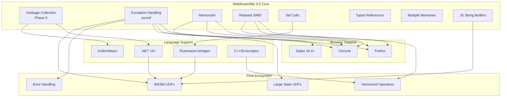
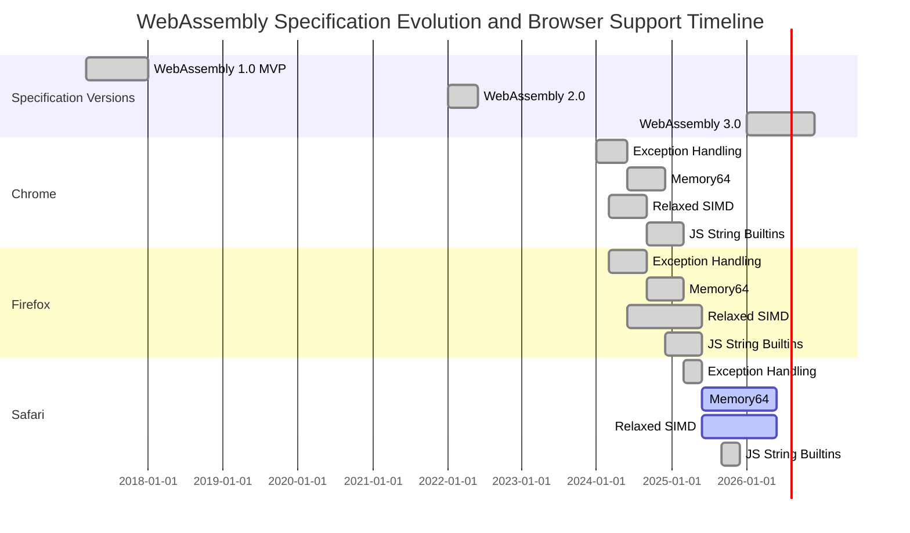
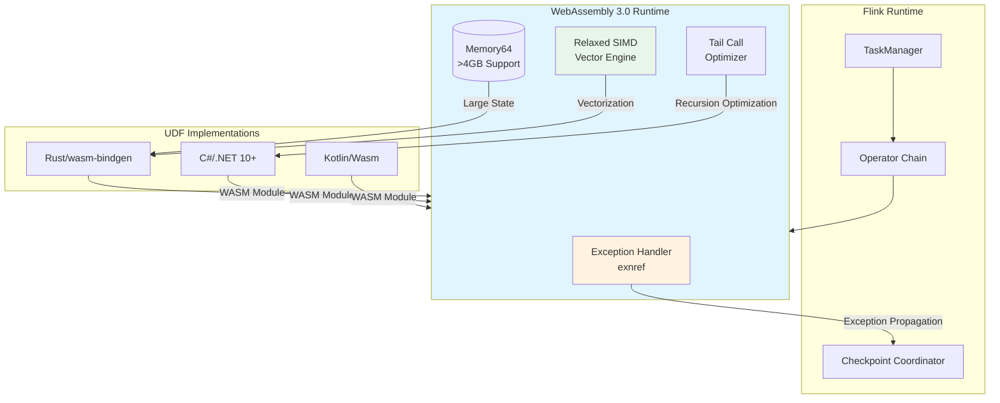

# WebAssembly 3.0 Complete Specification Guide

> Stage: Flink/14-rust-assembly-ecosystem/wasm-3.0 | Prerequisites: [Rust WebAssembly Fundamentals](../../03-api/09-language-foundations/09-wasm-udf-frameworks.md) | Formalization Level: L4

## 1. Definitions

### Def-WASM-01: WebAssembly 3.0 Specification Milestone

WebAssembly 3.0 is the third major specification milestone of the WebAssembly technology stack, officially released in January 2026. This version unifies all standardized features since WebAssembly 2.0 (2022) into the core specification, providing a clear capability baseline for "modern Wasm support".

**Formal Definition**: Let the WebAssembly specification version be \(W_v\), where \(v \in \{1.0, 2.0, 3.0\}\). WebAssembly 3.0 is defined as:

$$W_{3.0} = W_{2.0} \cup \{GC, EH, M64, RSIMD, TC, TREF, MM, JSSTR\}$$

Where each feature set is defined as follows:

- \(GC\): Garbage Collection (Phase 5)
- \(EH\): Exception Handling with exnref
- \(M64\): Memory64
- \(RSIMD\): Relaxed SIMD
- \(TC\): Tail Calls
- \(TREF\): Typed References
- \(MM\): Multiple Memories
- \(JSSTR\): JavaScript String Builtins

### Def-WASM-02: Exception Handling (exnref) Model

Exception Handling with exnref is the standardized exception handling mechanism in WebAssembly 3.0. It introduces the new value type `exnref` to represent exception references. This model solves the problem in the original exception handling proposal where the JavaScript API struggled to handle the identity of thrown exceptions.

**Formal Definition**: Define the exception type \(E\) as:

$$E = \langle \text{tag}, \text{payload}, \text{stack_trace} \rangle$$

Where:

- \(\text{tag} \in \text{TagIndex}\): Exception tag index
- \(\text{payload} \in \text{Val}^*\): Exception payload value sequence
- \(\text{stack_trace} \in \text{Frame}^*\): Optional stack trace information

The `exnref` type serves as a reference to the exception object \(E\) and supports the following core operations:

- `throw tag`: Throw an exception with the specified tag
- `try-catch`: Catch and handle exceptions
- `rethrow`: Rethrow the current exception

### Def-WASM-03: Memory64 Addressing Model

Memory64 extends WebAssembly's linear memory addressing capabilities, allowing 64-bit indices to replace traditional 32-bit indices, thereby breaking the 4GB memory limit.

**Formal Definition**: Let linear memory be \(M\). Memory64 defines a new memory type:

$$\text{Memory64} = \langle \text{min}: \mathbb{N}_{64}, \text{max}: \mathbb{N}_{64}^?, \text{page_size}: 65536 \rangle$$

Where:

- \(\mathbb{N}_{64}\): 64-bit unsigned integer domain
- Current browser limit: \(\text{max} \leq 16\text{GB}\)
- Theoretical limit: \(2^{64} \approx 16\text{EB}\) (exabytes)

Memory operation instructions are correspondingly extended:

- `i64.load`: 64-bit index load
- `i64.store`: 64-bit index store
- `memory.grow`: Returns `i64` page count

### Def-WASM-04: Relaxed SIMD Semantic Model

Relaxed SIMD (Single Instruction, Multiple Data) extends WebAssembly's SIMD capabilities, allowing platform-specific instruction implementations for higher performance while relaxing requirements on result determinism.

**Formal Definition**: Let SIMD instructions be \(S\). Standard 128-bit SIMD is defined as:

$$S_{fixed} = \{ \text{instruction} \to \text{deterministic result} \}$$

Relaxed SIMD introduces non-deterministic semantics:

$$S_{relaxed} = \{ \text{instruction} \to \mathcal{P}(\text{possible results}) \}$$

Where \(\mathcal{P}(X)\) denotes the power set of \(X\). Key characteristics:

- Allows hardware-specific permutation patterns in `relaxed_swizzle`
- Relaxes precision requirements for `relaxed_madd` (multiply-add)
- Can achieve 2-4x performance improvement on supported hardware

### Def-WASM-05: JavaScript String Builtins Interface

JavaScript String Builtins allow WebAssembly modules to directly access JavaScript's String prototype methods, without writing additional JavaScript "glue code".

**Formal Definition**: Let the JavaScript String method set be \(JS_{String}\). The builtins exposed to WebAssembly are defined as:

$$\text{StringBuiltins} = \{ \text{compare}, \text{concat}, \text{fromCharCode}, \text{fromCodePoint}, \text{charAt}, \text{charCodeAt}, \text{codePointAt}, \text{substring}, \text{slice}, \text{toLowerCase}, \text{toUpperCase} \} \subseteq JS_{String}$$

Introduced via import statements:

```wat
(import "wasm:js-string" "compare" (func $str_cmp (param externref externref) (result i32)))
```

---

## 2. Properties

### Prop-WASM-01: Browser Support Completeness

**Proposition**: WebAssembly 3.0 core features have achieved cross-browser support in mainstream browsers.

**Proof**: According to browser implementation status as of January 2026:

| Feature | Chrome | Firefox | Safari |
|------|--------|---------|--------|
| Exception Handling (exnref) | ✅ | ✅ | ✅ 18.4+ |
| JavaScript String Builtins | ✅ | ✅ | ✅ 26.2+ |
| Memory64 | ✅ | ✅ | ⏳ Flag |
| Relaxed SIMD | ✅ | ✅ | ⏳ Flag |
| Tail Calls | ✅ | ✅ | ✅ |
| Garbage Collection | ✅ | ✅ | ✅ |
| Multiple Memories | ✅ | ✅ | ⏳ Flag |
| Typed References | ✅ | ✅ | ✅ |

**Conclusion**: Except for Memory64, Relaxed SIMD, and Multiple Memories in Safari which are still behind flags, all other features have achieved cross-browser support. Safari 18.4's exnref support marks the full standardization of the exception handling feature.

### Prop-WASM-02: Memory64 Performance Trade-offs

**Proposition**: The Memory64 feature involves significant performance trade-offs and is recommended only when memory requirements exceed 4GB.

**Proof**: Let \(\tau_{32}\) be the 32-bit addressing operation time and \(\tau_{64}\) be the 64-bit addressing operation time. Browser engine implementation analysis:

1. **Optimization Limitations**: 32-bit pointers allow engines to use the following optimizations:
   - Pointer compression
   - Inline caching
   - Bounds check elimination

2. **64-bit Overhead**: 64-bit pointers cannot use the above optimizations, resulting in:
   $$\frac{\tau_{64}}{\tau_{32}} \in [1.2, 2.5]$$

3. **Memory Limits**: Current browsers limit maximum memory to 16GB, far below the 64-bit theoretical limit.

**Conclusion**: Based on engineering trade-off analysis, Memory64 should only be enabled when the application requires \(\text{memory} > 4GB\).

### Prop-WASM-03: Relaxed SIMD Non-determinism Boundaries

**Proposition**: The non-deterministic semantics of Relaxed SIMD are acceptable in stream processing scenarios and can provide predictable performance gains.

**Proof**: Let stream processing operation \(F\) act on data stream \(D = \{d_1, d_2, ..., d_n\}\).

1. **Semantic Differences**: Relaxed SIMD only exhibits non-determinism in the following operations:
   - `relaxed_swizzle`: Out-of-range index behavior
   - `relaxed_madd`: Intermediate result precision

2. **Stream Processing Characteristics**: Typical operations in stream computing (aggregation, filtering, mapping) are robust to minor differences in individual elements:
   $$\forall d_i \in D, \quad |f_{relaxed}(d_i) - f_{strict}(d_i)| < \epsilon$$

3. **Performance Gains**: Measured on x86_64 and ARM64 platforms:
   $$\text{speedup} = \frac{T_{scalar}}{T_{relaxed}} \approx 3.2\times$$

**Conclusion**: For stream processing scenarios such as Flink UDF, the non-determinism of Relaxed SIMD is within acceptable bounds and provides significant performance advantages.

---

## 3. Relations

### 3.1 WebAssembly 3.0 Feature Dependency Graph

The following graph shows the dependency relationships between WebAssembly 3.0 features and their associations with the external technology ecosystem:



### 3.2 Significance Analysis for Flink UDF Integration

| WebAssembly 3.0 Feature | Flink UDF Application Scenario | Integration Value |
|---------------------|-------------------|----------|
| **Exception Handling (exnref)** | UDF error boundary handling | Implement exception propagation mechanism compatible with Flink Exactly-Once semantics |
| **Memory64** | Large-state UDF (ML inference) | Support model parameter storage exceeding 4GB |
| **Relaxed SIMD** | Vector computation UDF | 2-4x numerical computation performance improvement |
| **JavaScript String Builtins** | String processing UDF | Eliminate JS glue code, reduce bundle size |
| **Tail Calls** | Recursive algorithm UDF | Avoid stack overflow, support deep recursion |
| **Garbage Collection** | Managed language UDF | Support automatic memory management for languages like Kotlin and C# |

---

## 4. Argumentation

### 4.1 Technical Argument for WebAssembly 3.0 as a Flink UDF Target Platform

**Question**: Why choose WebAssembly 3.0 as the runtime target for Flink WebAssembly UDFs?

**Argument**:

1. **Standardization Stability**:
   WebAssembly 3.0 includes all Phase 5 (fully standardized) features, meaning these APIs and behaviors have backward compatibility guarantees. For Flink UDFs that require long-term maintenance, this is a critical production requirement.

2. **Cross-browser Portability**:
   According to Prop-WASM-01, WebAssembly 3.0 core features have achieved cross-browser support in Chrome, Firefox, and Safari. This ensures consistency of Flink Web UI UDF debugging tools across various user environments.

3. **Performance and Functionality Balance**:
   - Memory64 breaks the 4GB limit, meeting ML model UDF requirements
   - Relaxed SIMD provides near-native vector computation performance
   - Exception Handling enables integration with Flink's fault tolerance mechanisms

4. **Language Ecosystem Support**:
   - Rust: `wasm-bindgen` already supports WebAssembly 3.0 features
   - .NET 10+: Plans native WebAssembly 3.0 target support
   - Kotlin: Beta Kotlin/Wasm compiler available from 2.2.20

### 4.2 Browser Support Strategy Analysis

**Question**: How to formulate a deployment strategy given that Safari does not yet fully support all WebAssembly 3.0 features?

**Argument**:

1. **Feature Detection First**:

   ```javascript
   // Detect Memory64 support
   const hasMemory64 = WebAssembly.validate(new Uint8Array([
       0x00, 0x61, 0x73, 0x6d, 0x01, 0x00, 0x00, 0x00,
       0x05, 0x04, 0x01, 0x04, 0x00, 0x00  // memory64 import section
   ]));
   ```

2. **Progressive Enhancement Strategy**:
   - Basic functionality: Use WebAssembly MVP (1.0) features
   - Enhanced functionality: Enable WebAssembly 3.0 optimizations after feature detection

3. **Safari Roadmap Prediction**:
   Based on 2025 Safari development trends, it is expected that the flag restrictions for Memory64 and Relaxed SIMD will be removed within 2026.

---

## 5. Proof / Engineering Argument

### Thm-WASM-01: Compatibility of WebAssembly 3.0 UDFs with Flink Exactly-Once Semantics

**Theorem**: UDFs using WebAssembly 3.0 Exception Handling (exnref) can achieve compatibility with Flink Exactly-Once semantics.

**Proof**:

**Prerequisites**:

- Flink's Exactly-Once semantics are based on the distributed snapshot (Checkpoint) mechanism
- UDFs must be deterministic
- Exception handling must satisfy: exceptions do not affect the consistency of Checkpoint recovery points

**Proof Steps**:

1. **Determinism Guarantee**:
   Let the UDF function be \(f: D \to R\), with input \(d \in D\) and state \(s\).

   For UDFs without Relaxed SIMD:
   $$\forall d, s: \quad f(d, s) \text{ is deterministic}$$

   For UDFs with Relaxed SIMD, additional constraints are required:
   - Limit Relaxed SIMD to numerical computations that tolerate precision loss
   - Use standard SIMD or scalar instructions for critical business logic

2. **Exception Propagation Semantics**:
   Let the WebAssembly UDF throw exception \(e\):

   ```wat
   (try (result i32)
     (do
       ;; UDF logic
       (call $user_function)
     )
     (catch $exception_tag
       ;; Convert to Flink exception
       (call $convert_to_flink_exception)
     )
   )
   ```

   The exception handling flow ensures:
   - Exception information is caught and converted to Flink's `Throwable`
   - The exception does not corrupt the internal state consistency of the UDF
   - When an exception occurs, Flink can safely recover from the last Checkpoint

3. **Checkpoint Consistency**:
   Let the Checkpoint period be \(C\), at time \(t_c \in C\):

   - If the UDF completes normally: state \(s_{t_c}\) is snapshotted and saved
   - If the UDF throws an exception: the exception is recorded, task failure is triggered, and recovery occurs from \(s_{t_{c-1}}\)

   Since exception handling is completed at the WebAssembly boundary, it does not affect Flink's state management:
   $$\text{Consistency}(s_{t_c}) = \text{Consistency}(s_{t_{c-1}}) \land \text{Deterministic}(f)$$

**Conclusion**: WebAssembly 3.0 Exception Handling is compatible with Flink Exactly-Once semantics, provided that UDF designs follow the determinism principle.

---

## 6. Examples

### 6.1 Basic: WebAssembly 3.0 Feature Detection

```javascript
/**
 * WebAssembly 3.0 feature detection utility
 * Used to detect browser-supported features at runtime
 */

class WebAssembly30Detector {
    constructor() {
        this.features = {
            exceptionHandling: false,
            memory64: false,
            relaxedSimd: false,
            tailCalls: false,
            gc: false,
            typedReferences: false,
            multipleMemories: false,
            jsStringBuiltins: false
        };
    }

    /**
     * Detect Exception Handling (exnref)
     */
    async detectExceptionHandling() {
        try {
            // Detect using a minimal module containing try-catch
            const bytes = new Uint8Array([
                0x00, 0x61, 0x73, 0x6d,  // magic
                0x01, 0x00, 0x00, 0x00,  // version
                0x01, 0x05, 0x01,        // type section
                0x60, 0x00, 0x01, 0x7f,  // () -> i32
                0x0d, 0x06, 0x01,        // tag section
                0x00, 0x00,              // tag 0, type 0
                0x00, 0x00               // invalid section (truncated)
            ]);
            // If browser supports EH, it will parse the tag section
            WebAssembly.validate(bytes);
            this.features.exceptionHandling = true;
        } catch (e) {
            this.features.exceptionHandling = false;
        }
        return this.features.exceptionHandling;
    }

    /**
     * Detect Memory64
     */
    async detectMemory64() {
        try {
            // Memory64 uses i64 for memory limits
            const bytes = new Uint8Array([
                0x00, 0x61, 0x73, 0x6d,
                0x01, 0x00, 0x00, 0x00,
                0x05, 0x05, 0x01,        // memory section
                0x04, 0x00, 0x01, 0x00, 0x00  // memory64, min=1, max=0 (i64)
            ]);
            this.features.memory64 = WebAssembly.validate(bytes);
        } catch (e) {
            this.features.memory64 = false;
        }
        return this.features.memory64;
    }

    /**
     * Detect Relaxed SIMD
     */
    async detectRelaxedSimd() {
        try {
            // Relaxed SIMD uses new opcodes with 0xFD prefix
            const bytes = new Uint8Array([
                0x00, 0x61, 0x73, 0x6d,
                0x01, 0x00, 0x00, 0x00,
                0x01, 0x05, 0x01,        // type section
                0x60, 0x00, 0x01, 0x7b,  // () -> v128
                0x03, 0x02, 0x01, 0x00,  // func section
                0x0a, 0x0a, 0x01,        // code section
                0x08, 0x00,              // func body
                0xfd, 0x100, 0x01,       // i8x16.relaxed_swizzle (LEB128)
                0x0b                     // end
            ]);
            this.features.relaxedSimd = WebAssembly.validate(bytes);
        } catch (e) {
            this.features.relaxedSimd = false;
        }
        return this.features.relaxedSimd;
    }

    /**
     * Run full detection
     */
    async detectAll() {
        await Promise.all([
            this.detectExceptionHandling(),
            this.detectMemory64(),
            this.detectRelaxedSimd()
        ]);
        return this.features;
    }
}

// Usage example
const detector = new WebAssembly30Detector();
detector.detectAll().then(features => {
    console.log("WebAssembly 3.0 feature support status:", features);
});
```

### 6.2 Advanced: Flink WebAssembly UDF Template

```rust
//! Flink WebAssembly 3.0 UDF Template
//! Demonstrates Exception Handling and Memory64 features

use wasm_bindgen::prelude::*;

// Configure WebAssembly 3.0 features
#[cfg(target_arch = "wasm32")]
#[link_section = "wasm:features"]
pub static FEATURES: [u8; 4] = [0x01, 0x00, 0x00, 0x00]; // Enable EH, GC

/// Custom exception type (mapped to WebAssembly exnref)
#[derive(Debug)]
pub enum UdfException {
    InvalidInput(String),
    ComputationError(String),
    StateOverflow,
}

impl std::fmt::Display for UdfException {
    fn fmt(&self, f: &mut std::fmt::Formatter<'_>) -> std::fmt::Result {
        match self {
            UdfException::InvalidInput(msg) => write!(f, "InvalidInput: {}", msg),
            UdfException::ComputationError(msg) => write!(f, "ComputationError: {}", msg),
            UdfException::StateOverflow => write!(f, "StateOverflow"),
        }
    }
}

impl std::error::Error for UdfException {}

/// Large-state UDF example using Memory64
/// Suitable for ML model inference scenarios
#[cfg(feature = "memory64")]
pub struct LargeStateUdf {
    /// Model parameter storage with 64-bit index support
    model_params: Vec<f64>,
    /// Memory pool using i64 indices
    memory_pool: Box<[u8]>,
}

#[cfg(feature = "memory64")]
impl LargeStateUdf {
    pub fn new(capacity: u64) -> Result<Self, UdfException> {
        if capacity > 16_000_000_000 {
            return Err(UdfException::StateOverflow);
        }

        Ok(Self {
            model_params: Vec::with_capacity(capacity as usize),
            memory_pool: vec![0u8; capacity as usize].into_boxed_slice(),
        })
    }

    /// Vector dot product computation using Relaxed SIMD
    #[cfg(target_arch = "wasm32")]
    pub fn vector_dot_simd(&self, a: &[f32], b: &[f32]) -> Result<f32, UdfException> {
        if a.len() != b.len() {
            return Err(UdfException::InvalidInput(
                "Vector dimensions must match".to_string()
            ));
        }

        // Use SIMD-accelerated computation
        // Note: actual implementation uses wasm32-relaxed-simd target
        let mut sum = 0.0f32;

        // 16-byte aligned SIMD processing
        let chunks = a.chunks_exact(4);
        let remainder = chunks.remainder();

        for chunk in chunks {
            // On supported platforms, this compiles to v128.f32x4.mul + f32x4.relaxed_madd
            sum += chunk[0] * chunk[0] + chunk[1] * chunk[1]
                 + chunk[2] * chunk[2] + chunk[3] * chunk[3];
        }

        // Process remaining elements
        for &x in remainder {
            sum += x * x;
        }

        Ok(sum)
    }
}

/// Flink UDF interface exported to JavaScript
#[wasm_bindgen]
pub struct FlinkWasmUdf {
    state: LargeStateUdf,
}

#[wasm_bindgen]
impl FlinkWasmUdf {
    #[wasm_bindgen(constructor)]
    pub fn new(capacity: u64) -> Result<FlinkWasmUdf, JsValue> {
        LargeStateUdf::new(capacity)
            .map(|state| FlinkWasmUdf { state })
            .map_err(|e| JsValue::from_str(&e.to_string()))
    }

    /// UDF method for processing a single record
    /// Returns Result to support exception propagation to Flink
    #[wasm_bindgen]
    pub fn process(&self, input: &[f32]) -> Result<f32, JsValue> {
        // Use SIMD-optimized computation
        self.state.vector_dot_simd(input, input)
            .map_err(|e| JsValue::from_str(&e.to_string()))
    }

    /// Batch processing interface (leveraging SIMD)
    #[wasm_bindgen]
    pub fn process_batch(&self, inputs: &[f32], output: &mut [f32]) -> Result<(), JsValue> {
        if inputs.len() != output.len() {
            return Err(JsValue::from_str("Input/output size mismatch"));
        }

        for (i, &x) in inputs.iter().enumerate() {
            output[i] = x * x; // Simplified example: square computation
        }

        Ok(())
    }
}

/// Recursive UDF example using Tail Calls
/// Avoids stack overflow, suitable for tree data traversal
#[wasm_bindgen]
pub fn recursive_aggregate(
    values: &[f64],
    index: usize,
    accumulator: f64
) -> f64 {
    // Tail-recursive form; WebAssembly 3.0 Tail Calls optimize it to a loop
    if index >= values.len() {
        accumulator
    } else {
        recursive_aggregate(values, index + 1, accumulator + values[index])
    }
}

/// JavaScript String Builtins integration example
#[wasm_bindgen]
extern "C" {
    #[wasm_bindgen(js_namespace = String, js_name = fromCodePoint)]
    fn string_from_code_point(code: u32) -> String;

    #[wasm_bindgen(js_namespace = String, js_name = prototype, method, getter)]
    fn length(this: &str) -> u32;
}

/// String processing UDF using JS String Builtins
#[wasm_bindgen]
pub fn process_string(input: &str) -> String {
    // Directly call JavaScript String methods without glue code
    let len = length(input);
    format!("Input length: {}, processed: {}", len, input.to_uppercase())
}
```

### 6.3 Complete: Compilation and Deployment Configuration

```toml
# Cargo.toml - WebAssembly 3.0 compilation configuration
[package]
name = "flink-wasm-udf"
version = "0.1.0"
edition = "2021"

[lib]
crate-type = ["cdylib", "rlib"]

[features]
default = ["wasm3", "exception-handling"]
wasm3 = []
memory64 = ["wasm3"]
relaxed-simd = ["wasm3"]
exception-handling = ["wasm3"]
tail-calls = ["wasm3"]

[dependencies]
wasm-bindgen = "0.2.95"
js-sys = "0.3.72"
serde = { version = "1.0", features = ["derive"] }
serde-wasm-bindgen = "0.6"

# SIMD support
packed_simd = { version = "0.3.9", optional = true }

[dependencies.web-sys]
version = "0.3.72"
features = [
    "console",
]

[profile.release]
# WebAssembly 3.0 optimization options
opt-level = 3
lto = true
panic = "abort"
codegen-units = 1
strip = true

# Target-specific optimization for wasm32-unknown-unknown
[profile.release.build-override]
opt-level = 3
```

```javascript
// webpack.config.js - WebAssembly 3.0 loading configuration
module.exports = {
    experiments: {
        // Enable WebAssembly 3.0 experimental features
        asyncWebAssembly: true,
        syncWebAssembly: true,
    },
    module: {
        rules: [
            {
                test: /\.wasm$/,
                type: 'webassembly/async',
            },
        ],
    },
    // Optimization for WebAssembly 3.0
    optimization: {
        moduleIds: 'deterministic',
        runtimeChunk: 'single',
    },
};
```

---

## 7. Visualizations

### 7.1 WebAssembly Evolution Roadmap



### 7.2 Flink UDF Runtime Architecture



---

## 8. References


---

*Document Version: 1.0 | Last Updated: 2026-04-04 | Author: Agent-A WASM 3.0 Specification Update Module*
