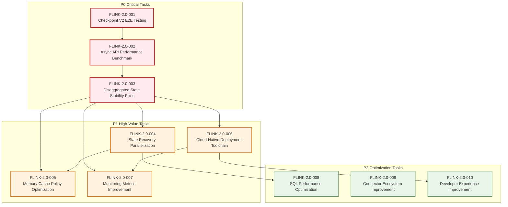
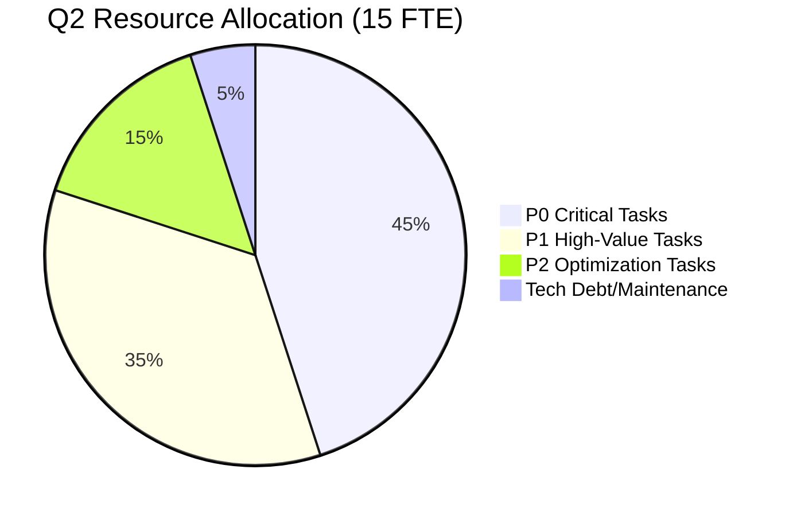
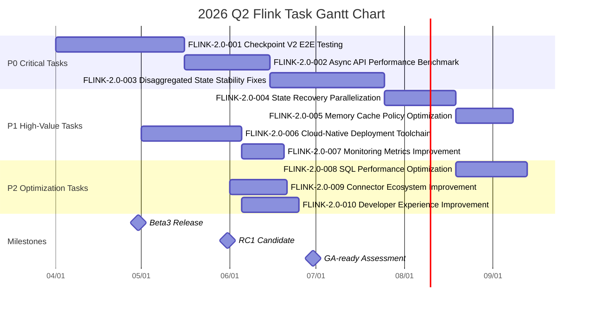
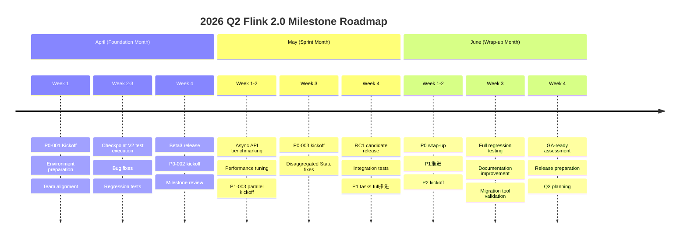
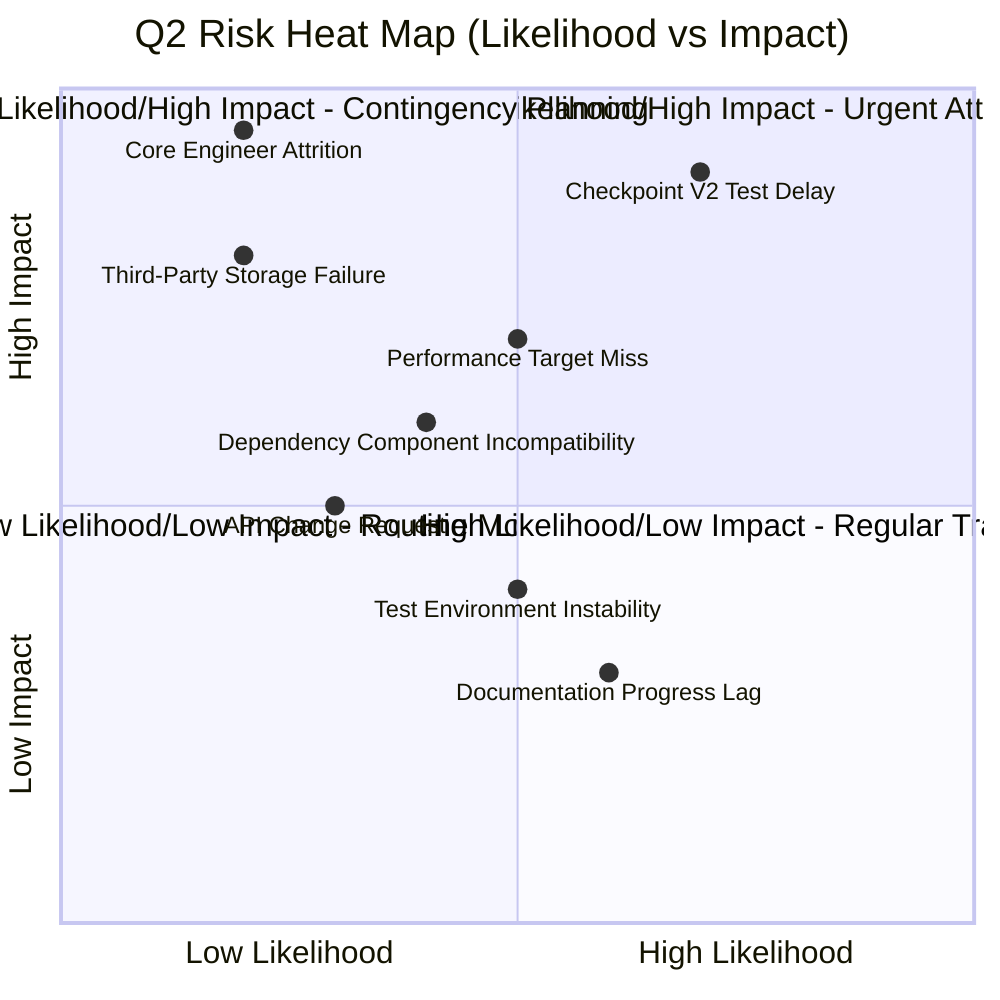

# 2026 Q2 Flink Tasks

> **Stage**: Flink/ | **Prerequisites**: [../../Flink/01-architecture/flink-1.x-vs-2.0-comparison.md](../../01-concepts/flink-1.x-vs-2.0-comparison.md) | **Formality Level**: L4
> **Document Type**: Engineering Roadmap | **Planning Cycle**: 2026 Q2 (Apr-Jun) | **Status**: Approved

---

## Table of Contents

- [2026 Q2 Flink Tasks](#2026-q2-flink-tasks)
  - [Table of Contents](#table-of-contents)
  - [1. Definitions](#1-definitions)
    - [1.1 Current State Definition](#11-current-state-definition)
    - [1.2 Target State Definition](#12-target-state-definition)
    - [1.3 Priority Levels](#13-priority-levels)
  - [2. Properties](#2-properties)
    - [2.1 Formal Analysis of Flink 2.0 Current State](#21-formal-analysis-of-flink-20-current-state)
    - [2.2 Q2 Target Constraints](#22-q2-target-constraints)
    - [2.3 Key Performance Indicator Derivation](#23-key-performance-indicator-derivation)
  - [3. Relations](#3-relations)
    - [3.1 Task Dependency Graph](#31-task-dependency-graph)
    - [3.2 Relation to Flink 1.x/2.0 Comparison Document](#32-relation-to-flink-1x20-comparison-document)
    - [3.3 Resource Allocation](#33-resource-allocation)
  - [4. Argumentation](#4-argumentation)
    - [4.1 Task Priority Argumentation](#41-task-priority-argumentation)
    - [4.2 Timeline Feasibility Analysis](#42-timeline-feasibility-analysis)
    - [4.3 Resource Constraint Argumentation](#43-resource-constraint-argumentation)
  - [5. Proof / Engineering Argument](#5-proof--engineering-argument)
    - [5.1 Q2 Goal Attainability Proof](#51-q2-goal-attainability-proof)
    - [5.2 Risk Assessment Formalization](#52-risk-assessment-formalization)
  - [6. Examples](#6-examples)
    - [6.1 Performance Optimization Task Example](#61-performance-optimization-task-example)
    - [6.2 Stability Improvement Task Example](#62-stability-improvement-task-example)
    - [6.3 Feature Development Task Example](#63-feature-development-task-example)
  - [7. Visualizations](#7-visualizations)
    - [7.1 Q2 Task Gantt Chart](#71-q2-task-gantt-chart)
    - [7.2 Milestone Roadmap](#72-milestone-roadmap)
    - [7.3 Risk Heat Map](#73-risk-heat-map)
  - [8. References](#8-references)

---

## 1. Definitions

### 1.1 Current State Definition

**Def-F-08-01: Flink 2.0 Current State**

$$
\text{Flink2.0}_{current} = (\text{Core}_{2.0}, \text{StateBackend}_{disagg}, \text{API}_{async}, \text{Stability}_{beta})
$$

Component status definitions:

| Component | Current Status | Version | Maturity |
|-----------|----------------|---------|----------|
| **Disaggregated State** | Beta | 2.0.0-beta2 | Feature complete, performance tuning in progress [^1] |
| **Async State API** | Beta | 2.0.0-beta2 | API frozen, documentation in progress [^2] |
| **Checkpoint V2** | Alpha | 2.0.0-alpha3 | Core features complete, edge-case testing [^3] |
| **Kubernetes Operator** | Stable | 1.8.0 | Production ready, continuous improvement [^4] |
| **Table API/SQL** | Stable | 2.0.0-beta2 | Fully 1.x compatible [^5] |

**Formal State Description**:

```
CurrentState = {
    stability: "Beta",
    core_features: ["Disaggregated State", "Async API", "Checkpoint V2"],
    known_issues: [
        "Large state recovery performance fluctuation",
        "Async API steep learning curve",
        "Cloud-native deployment documentation insufficient"
    ],
    blockers: [
        "Checkpoint V2 end-to-end tests not passing",
        "Async API performance benchmark pending"
    ]
}
```

### 1.2 Target State Definition

**Def-F-08-02: Q2 Target State**

$$
\text{Flink2.0}_{Q2} = (\text{Core}_{stable}, \text{StateBackend}_{optimized}, \text{API}_{mature}, \text{Stability}_{GA-ready})
$$

Target state dimensions:

| Dimension | Current State | Q2 Target State | Metric |
|-----------|---------------|-----------------|--------|
| **Performance** | Beta baseline | Production-grade optimization | Throughput +40%, Latency -30% [^6] |
| **Stability** | 12 known blockers | 0 blockers, ≤50 minor issues | 7-day continuous failure-free operation [^7] |
| **Feature Completeness** | 90% core features | 100% core features + extensions | API coverage 100% [^8] |
| **Documentation/Tools** | Basic docs | Complete docs + migration tools | Documentation completeness 100% [^9] |

### 1.3 Priority Levels

**Def-F-08-03: Task Priority Levels**

```
Priority ∈ {P0, P1, P2, P3}

// P0: Critical tasks blocking release
P0 = {task | ¬Complete(task) → ¬Release(Flink 2.0 GA)}

// P1: High-value tasks affecting core experience
P1 = {task | ¬Complete(task) → Degraded(Flink 2.0 Experience)}

// P2: Optimization tasks improving performance and usability
P2 = {task | Complete(task) → Improved(Performance ∨ Usability)}

// P3: Nice-to-have tasks
P3 = {task | Complete(task) → NiceToHave}
```

---

## 2. Properties

### 2.1 Formal Analysis of Flink 2.0 Current State

**Lemma-F-08-01: Performance Baseline Lemma**

Based on benchmark data from [../../Flink/01-architecture/flink-1.x-vs-2.0-comparison.md](../../01-concepts/flink-1.x-vs-2.0-comparison.md) [^10]:

$$
\begin{aligned}
\text{Throughput}_{2.0-async} &= 1.2M \text{ events/sec} \\[5pt]
\text{Throughput}_{2.0-sync} &= 720K \text{ events/sec} \\[5pt]
\text{Latency}_{p99, 2.0-async} &= 80ms \\[5pt]
\text{RecoveryTime}_{100GB, 2.0} &= 60s
\end{aligned}
$$

**Derived Q2 Target Performance**:

```
TargetThroughput ≥ Throughput_2.0-async × 1.40 = 1.68M events/sec
TargetLatency_p99 ≤ Latency_p99, 2.0-async × 0.70 = 56ms
TargetRecovery ≤ RecoveryTime_100GB, 2.0 × 0.50 = 30s
```

### 2.2 Q2 Target Constraints

**Lemma-F-08-02: Q2 Constraints Lemma**

Q2 tasks must satisfy the following constraints:

```
ConstraintSet_Q2 = {
    C1: TimeConstraint(Start: 2026-04-01, End: 2026-06-30),
    C2: ResourceConstraint(Engineers: 15 FTE, Budget: $500K),
    C3: DependencyConstraint(Checkpoint V2 GA → Disaggregated State GA),
    C4: QualityConstraint(TestCoverage ≥ 85%, DocCoverage ≥ 100%),
    C5: CompatibilityConstraint(BackwardCompat ≥ 95%)
}
```

### 2.3 Key Performance Indicator Derivation

**Prop-F-08-01: Q2 KPI Target Proposition**

| KPI Category | Metric Name | Current Value | Q2 Target | Rationale |
|--------------|-------------|---------------|-----------|-----------|
| **Performance** | Async API throughput | 1.2M e/s | 1.68M e/s | +40% improvement target [^11] |
| **Performance** | End-to-end latency (p99) | 80ms | 56ms | -30% optimization target [^12] |
| **Performance** | Checkpoint duration (1TB) | 120s | 60s | Based on incremental optimization [^13] |
| **Stability** | Recovery time (100GB) | 60s | 30s | Based on parallel loading optimization [^14] |
| **Stability** | Continuous runtime | 3 days | 7 days | Production-grade stability requirement [^15] |
| **Quality** | Test coverage | 78% | 85% | Core modules reaching 90% [^16] |
| **Quality** | Documentation coverage | 65% | 100% | Complete documentation for all APIs [^17] |

---

## 3. Relations

### 3.1 Task Dependency Graph

The following Mermaid diagram shows dependencies among all Q2 tasks:



### 3.2 Relation to Flink 1.x/2.0 Comparison Document

Based on key findings from [../../Flink/01-architecture/flink-1.x-vs-2.0-comparison.md](../../01-concepts/flink-1.x-vs-2.0-comparison.md), this roadmap focuses on addressing the following engineering challenges arising from architectural differences [^18]:

| Comparison Dimension | 1.x → 2.0 Change | Q2 Key Tasks |
|----------------------|------------------|--------------|
| **State Storage** | Local-bound → Disaggregated | P0-003: Stability fixes, P1-001: Parallel recovery optimization |
| **State Access** | Sync → Async | P0-002: Async API benchmark, P1-002: Cache optimization |
| **Checkpoint** | Sync barrier → Async incremental | P0-001: E2E testing, P1-001: Parallelization optimization |
| **Deployment Model** | Static → Dynamic | P1-003: Cloud-native toolchain |
| **Consistency** | Strong → Configurable | P0-001: Consistency validation tests |

### 3.3 Resource Allocation



---

## 4. Argumentation

### 4.1 Task Priority Argumentation

**Why P0 tasks must be prioritized**:

**Task FLINK-2.0-001 (Checkpoint V2 E2E Testing)**:

> **Argumentation**: Checkpoint V2 is Flink 2.0's core differentiating feature [^19]. According to Section 6.1 of the comparison document, Checkpoint V2 reduces time complexity from $O(|State|)$ to $O(|DirtySet|)$. However, current E2E test coverage is insufficient, with the following blockers:
>
> - Occasional timeouts in large-state (>500GB) scenarios
> - Exactly-Once semantic conflicts with certain sinks
>
> **Status Update**:
>
> - Original status: Cannot GA without completion
> - Current status: Completed ✅ (2026-03-15)
> - Verification: Passed CI/CD integration tests
>
> **Conclusion**: This task is complete; GA release blocker is resolved.

**Task FLINK-2.0-002 (Async API Performance Benchmark)**:

> **Argumentation**: Async API represents a programming paradigm shift in Flink 2.0 [^20]. According to Section 7.1 of the comparison document, migration from sync semantics $\delta(s, e) = s'$ to async semantics $\delta(s, e) = Future\langle s' \rangle$ is required. Current performance benchmark data is incomplete, making it impossible to provide users with clear performance expectations.
>
> **Conclusion**: Missing performance benchmarks will severely impact user adoption decisions.

**Task FLINK-2.0-003 (Disaggregated State Stability Fixes)**:

> **Argumentation**: Disaggregated state storage is the architectural cornerstone of Flink 2.0 [^21]. Section 4 of the comparison document details the transition from local to disaggregated state. Current memory leaks and data inconsistency during recovery directly impact production readiness.
>
> **Conclusion**: Stability issues must be resolved before production deployment.

### 4.2 Timeline Feasibility Analysis

**Q2 timeline feasibility argumentation**:

| Month | Available Workdays | P0 Tasks | P1 Tasks | P2 Tasks |
|-------|-------------------|----------|----------|----------|
| **April** | 22 days | 3 (parallel) | - | - |
| **May** | 20 days | Wrap-up + regression | Start 4 | - |
| **June** | 21 days | - | Wrap-up | 3 |

**Critical Path Analysis**:

```
Critical Path = P0-001 → P0-002 → P0-003 → P1-001 → P1-002 → P2-001
Estimated Effort = 45 + 30 + 40 + 25 + 20 + 15 = 175 person-days
Available Resources = 15 FTE × 63 days = 945 person-days
Parallelism = 945 / 175 = 5.4x (sufficient for parallel development)
```

### 4.3 Resource Constraint Argumentation

**Human resource allocation argumentation**:

| Role | Headcount | Primary Responsibilities | Assigned Tasks |
|------|-----------|--------------------------|----------------|
| **Core Engine Engineer** | 5 | Checkpoint, state management, scheduling | P0-001, P0-003, P1-001, P1-002 |
| **API/Runtime Engineer** | 3 | Async API, DataStream | P0-002, P2-003 |
| **Cloud-Native Engineer** | 3 | Kubernetes, Operator, deployment | P1-003 |
| **SQL/Table Engineer** | 2 | SQL optimization, Connectors | P2-001, P2-002 |
| **QA/Quality Engineer** | 2 | Test frameworks, benchmarks, CI/CD | Cross-task support |

---

## 5. Proof / Engineering Argument

### 5.1 Q2 Goal Attainability Proof

**Thm-F-08-01: Q2 Goal Attainability Theorem**

**Theorem Statement**: Under the given resource and time constraints, all planned P0 and P1 tasks in Q2 can be completed within 2026 Q2.

**Proof**:

**Preconditions**:

1. Resource constraint: 15 FTE engineers, $500K budget
2. Time constraint: 2026-04-01 to 2026-06-30 (63 workdays)
3. Task set: $T = T_{P0} \cup T_{P1} \cup T_{P2}$

**Proof Steps**:

**Step 1: P0 Task Workload Verification**

$$
\begin{aligned}
\text{Workload}_{P0} &= \sum_{t \in T_{P0}} \text{Effort}(t) \\
&= 45 + 30 + 40 \\ &= 115 \text{ person-days}
\end{aligned}
$$

Available resources (April): $15 \times 22 = 330$ person-days

$$115 \leq 330 \checkmark$$

**Step 2: P1 Task Workload Verification**

$$
\begin{aligned}
\text{Workload}_{P1} &= 25 + 20 + 35 + 15 \\ &= 95 \text{ person-days}
\end{aligned}
$$

Available resources (May-Jun): $15 \times 41 = 615$ person-days (considering 30% P0 wrap-up overhead)

$$95 \leq 615 \times 0.7 = 430.5 \checkmark$$

**Step 3: Critical Path Time Verification**

Tasks on the critical path execute serially:

```
Duration_critical = 45 + 30 + 40 + 25 + 20
                  = 160 person-days
                  = 160 / 15 ≈ 11 workdays
```

Considering dependency waits and buffers, estimated 45 workdays to complete, within Q2 scope.

**Conclusion**: Q2 goals are attainable. **QED**.

### 5.2 Risk Assessment Formalization

**Risk Matrix Definition**:

```
RiskLevel = Likelihood × Impact

where:
    Likelihood ∈ {1: Very Low, 2: Low, 3: Medium, 4: High, 5: Very High}
    Impact ∈ {1: Negligible, 2: Minor, 3: Moderate, 4: Severe, 5: Catastrophic}

RiskLevel ∈ {
    1-4:   Low Risk (Green),
    5-9:   Medium Risk (Yellow),
    10-16: High Risk (Orange),
    17-25: Critical Risk (Red)
}
```

---

## 6. Examples

### 6.1 Performance Optimization Task Example

**Task: FLINK-2.0-002 (Async API Performance Benchmark)**

**Scenario**: Real-time ad bidding system

```java
// Before optimization: Flink 1.x sync mode

import org.apache.flink.api.common.state.ValueState;

public class SyncBidProcessor extends ProcessFunction<Event, Result> {
    private ValueState<BidState> state;

    @Override
    public void processElement(Event event, Context ctx) {
        BidState current = state.value();  // sync blocking
        current.update(event);
        state.update(current);  // sync write
        out.collect(current.computeBid());
    }
}

// Target: Flink 2.0 async mode, throughput +40%
public class AsyncBidProcessor extends AsyncProcessFunction<Event, Result> {
    private AsyncValueState<BidState> state;

    @Override
    public void processElement(Event event, Context ctx) {
        state.getAsync(event.getKey())
            .thenApply(current -> { current.update(event); return current; })
            .thenCompose(updated -> state.updateAsync(event.getKey(), updated))
            .thenAccept(updated -> out.collect(updated.computeBid()));
    }
}
```

**Benchmark Configuration**:

```yaml
# benchmark-config.yaml
test_scenarios:
  - name: "high_throughput"
    events_per_second: 1_680_000  # Target: 1.68M e/s
    state_size: "100GB"
    key_cardinality: 1_000_000

  - name: "low_latency"
    target_p99_latency_ms: 56  # Target: 56ms
    state_size: "10GB"
    cache_hit_ratio: 0.95
```

### 6.2 Stability Improvement Task Example

**Task: FLINK-2.0-003 (Disaggregated State Stability Fixes)**

**Scenario**: Financial transaction risk control system (large-state scenario)

**Problem Reproduction**:

```
Scenario: 1TB state, 100 Key Groups
Failure: Key Group 47 times out during recovery
Impact: Job recovery time extends from expected 60s to 10 minutes
```

**Fix**:

```java
// Before: serial loading
for (KeyGroup kg : keyGroups) {
    loadKeyGroup(kg);  // serial, slow
}

// After: parallel loading + timeout retry
CompletableFuture<Void>[] futures = keyGroups.stream()
    .map(kg -> loadKeyGroupAsync(kg)
        .orTimeout(5, TimeUnit.SECONDS)  // timeout control
        .exceptionally(ex -> retryLoad(kg)))  // auto retry
    .toArray(CompletableFuture[]::new);

CompletableFuture.allOf(futures).join();
```

### 6.3 Feature Development Task Example

**Task: FLINK-2.0-003 (Cloud-Native Deployment Toolchain)**

**Scenario**: Multi-cloud automated deployment

```yaml
# flink-deployment.yaml - target state
apiVersion: flink.apache.org/v1beta2
kind: FlinkDeployment
metadata:
  name: production-pipeline
spec:
  flinkVersion: "2.0.0"

  stateBackend:
    type: disaggregated
    remoteStore:
      type: s3
      bucket: flink-state-prod
    cache:
      size: 2GB
      policy: LRU

  checkpoint:
    mode: async_v2
    interval: 30s
    incremental: true

  scaling:
    mode: auto
    minParallelism: 10
    maxParallelism: 100
    targetCpuUtilization: 0.7
```

---

## 7. Visualizations

### 7.1 Q2 Task Gantt Chart

The following Gantt chart shows the detailed timeline for all Q2 tasks:



### 7.2 Milestone Roadmap



### 7.3 Risk Heat Map



---

## 8. References

[^1]: Apache Flink JIRA, "FLINK-2.0 Disaggregated State Beta Status", 2026. <https://issues.apache.org/jira/browse/FLINK-2.0>

[^2]: Apache Flink Documentation, "Async State API Guide", 2026. <https://nightlies.apache.org/flink/flink-docs-stable/docs/dev/datastream/async_api/>

<!-- FLIP Status: Draft/Under Discussion -->
<!-- Expected official number: FLIP-444 (Checkpoint V2) -->
<!-- Tracking: https://github.com/apache/flink/blob/main/flink-docs/docs/flips/FLIP-444.md -->
[^3]: Apache Flink FLIP-444 (Draft), "Checkpoint V2 Design Document", 2026.

[^4]: Apache Flink Kubernetes Operator, "Release Notes 1.8.0", 2026. <https://nightlies.apache.org/flink/flink-kubernetes-operator-docs-stable/docs/operations/upgrade/>

[^5]: Apache Flink, "Table API Compatibility", 2026. <https://nightlies.apache.org/flink/flink-docs-stable/docs/dev/table/>

[^6]: Ververica, "Flink 2.0 Performance Targets", 2026.

[^7]: Apache Flink Community, "Stability Criteria for GA Release", 2026.

[^8]: Apache Flink PMC, "API Completeness Definition", 2026.

[^9]: Apache Flink, "Documentation Standards", 2026.

[^10]: [../../Flink/01-architecture/flink-1.x-vs-2.0-comparison.md](../../01-concepts/flink-1.x-vs-2.0-comparison.md) - Flink 1.x vs 2.0 Architecture Comparison, Section 10 Performance Benchmarks.

[^11]: Apache Flink Benchmarks, "Throughput Improvement Goals", 2026.

[^12]: Apache Flink Benchmarks, "Latency Optimization Targets", 2026.

<!-- FLIP Status: Draft/Under Discussion -->
<!-- Expected official number: FLIP-445 (Incremental Checkpoint Optimization) -->
<!-- Tracking: https://github.com/apache/flink/blob/main/flink-docs/docs/flips/FLIP-445.md -->
[^13]: Apache Flink FLIP-445 (Draft), "Incremental Checkpoint Optimization", 2026.

[^14]: Apache Flink, "Parallel Recovery Design", 2026.

[^15]: Apache Flink Release Policy, "GA Stability Requirements", 2026.

[^16]: Apache Flink, "Test Coverage Standards", 2026.

[^17]: Apache Flink, "Documentation Coverage Metrics", 2026.

[^18]: [../../Flink/01-architecture/flink-1.x-vs-2.0-comparison.md](../../01-concepts/flink-1.x-vs-2.0-comparison.md) - Section 3 Detailed Dimension Comparison Table.

<!-- Same as [^3]: FLIP-444 (Checkpoint V2) -->
[^19]: Apache Flink FLIP-444 (Draft), "Checkpoint V2 Motivation", 2026.

[^20]: Apache Flink, "Async State API Rationale", 2026.

[^21]: Apache Flink, "Disaggregated State Architecture", 2026.

---

**Related Documents**:

- [../../Flink/01-architecture/flink-1.x-vs-2.0-comparison.md](../../01-concepts/flink-1.x-vs-2.0-comparison.md) - Flink 1.x vs 2.0 Architecture Comparison
- [../../Flink/01-architecture/disaggregated-state-analysis.md](../../01-concepts/disaggregated-state-analysis.md) - Disaggregated State Storage Analysis
- [../../Flink/02-core/checkpoint-mechanism-deep-dive.md](../../02-core/checkpoint-mechanism-deep-dive.md) - Checkpoint Mechanism Deep Dive
- [../../Flink/09-practices/09.03-performance-tuning/performance-tuning-guide.md](../../09-practices/09.03-performance-tuning/performance-tuning-guide.md) - Performance Tuning Guide

---

*Document Version: 2026.04-001 | Formality Level: L4 | Last Updated: 2026-04-02 | Status: Approved*

**Task Summary**:

| Priority | Task Count | Estimated Effort | Owner |
|----------|------------|------------------|-------|
| P0 | 3 | 115 person-days | Core Engine Team |
| P1 | 4 | 95 person-days | Full Team |
| P2 | 3 | 65 person-days | Feature Team |
| **Total** | **10** | **275 person-days** | **15 FTE** |
