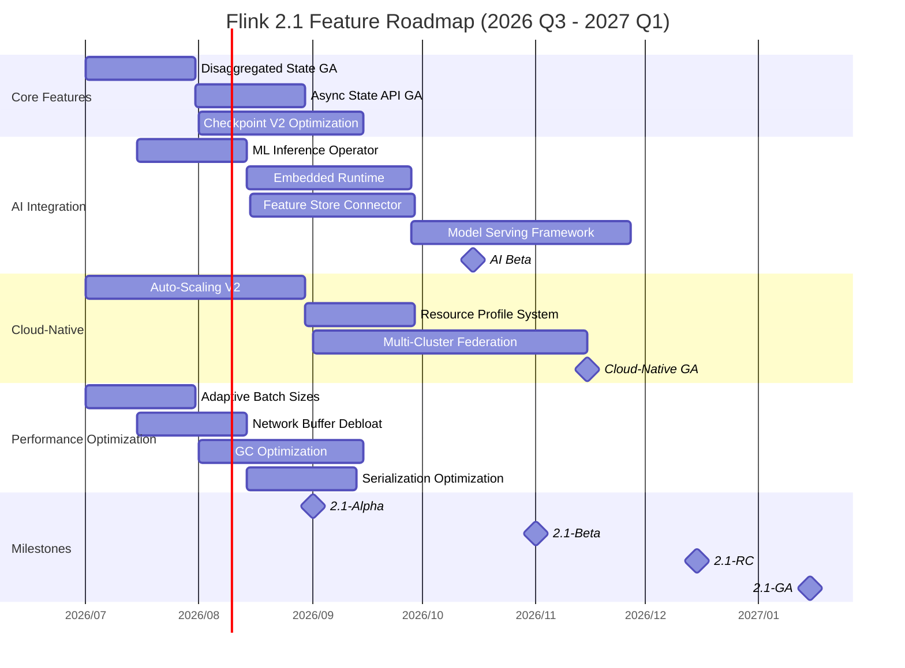
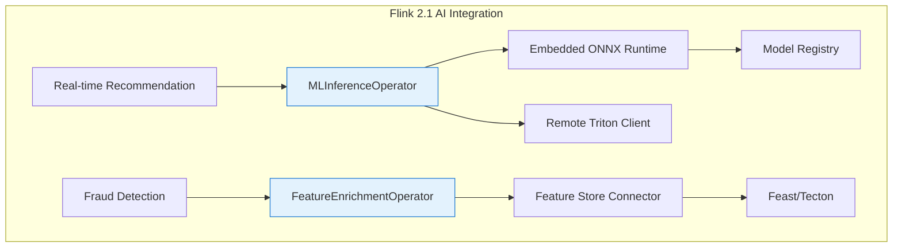
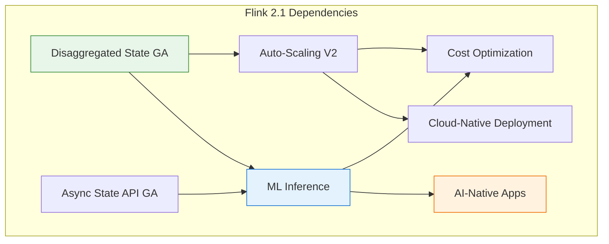

> **Status**: 🔮 Forward-looking Content | **Risk Level**: High | **Last Updated**: 2026-04
>
> The content described in this document is in early planning stages and may differ from the final implementation. Please refer to official Apache Flink releases.

# Flink 2.1 Frontier Tracking

> **Stage**: Flink/ | **Prerequisites**: [../../Flink/01-architecture/flink-1.x-vs-2.0-comparison.md](../../01-concepts/flink-1.x-vs-2.0-comparison.md) | **Formalization Level**: L4
> **Document Type**: Technical Roadmap / Frontier Tracking | **Coverage Version**: Flink 2.1.x | **Status**: In Planning

---

## Table of Contents

- [Flink 2.1 Frontier Tracking](#flink-21-frontier-tracking)
  - [Table of Contents](#table-of-contents)
  - [1. Definitions](#1-definitions)
    - [1.1 Flink 2.1 Version Positioning](#11-flink-21-version-positioning)
    - [1.2 AI Integration Core Concepts](#12-ai-integration-core-concepts)
    - [1.3 Cloud-Native Enhancement Definitions](#13-cloud-native-enhancement-definitions)
    - [1.4 Performance Dimension Definitions](#14-performance-dimension-definitions)
  - [2. Properties](#2-properties)
    - [2.1 Flink 2.0 → 2.1 Evolution Properties](#21-flink-20--21-evolution-properties)
    - [2.2 AI Integration Formal Constraints](#22-ai-integration-formal-constraints)
    - [2.3 Cloud-Native Property Derivation](#23-cloud-native-property-derivation)
    - [2.4 Performance Improvement Target Derivation](#24-performance-improvement-target-derivation)
  - [3. Relations](#3-relations)
    - [3.1 Relationship with Flink 2.0 Architecture](#31-relationship-with-flink-20-architecture)
    - [3.2 AI Capability Matrix Mapping](#32-ai-capability-matrix-mapping)
    - [3.3 Cross-Version Feature Evolution](#33-cross-version-feature-evolution)
  - [4. Argumentation](#4-argumentation)
    - [4.1 Necessity Argument for AI Integration](#41-necessity-argument-for-ai-integration)
    - [4.2 Cloud-Native First Strategy Argument](#42-cloud-native-first-strategy-argument)
    - [4.3 Performance vs Usability Trade-off](#43-performance-vs-usability-trade-off)
  - [5. Proof / Engineering Argument](#5-proof--engineering-argument)
    - [5.1 AI Inference Latency Predictability Proof](#51-ai-inference-latency-predictability-proof)
    - [5.2 Performance Improvement Achievability Argument](#52-performance-improvement-achievability-argument)
  - [6. Examples](#6-examples)
    - [6.1 AI Integration Development Example](#61-ai-integration-development-example)
    - [6.2 Cloud-Native Deployment Configuration Example](#62-cloud-native-deployment-configuration-example)
    - [6.3 Performance Optimization Configuration Example](#63-performance-optimization-configuration-example)
  - [7. Visualizations](#7-visualizations)
    - [7.1 Flink 2.1 Feature Roadmap Timeline](#71-flink-21-feature-roadmap-timeline)
    - [7.2 AI Integration Architecture Diagram](#72-ai-integration-architecture-diagram)
    - [7.3 Cloud-Native Deployment Architecture Evolution](#73-cloud-native-deployment-architecture-evolution)
    - [7.4 Feature Dependency Diagram](#74-feature-dependency-diagram)
  - [8. References](#8-references)

---

## 1. Definitions

### 1.1 Flink 2.1 Version Positioning

**Def-F-08-04: Flink 2.1 Version Definition**

$$
\text{Flink 2.1} = (\text{Flink 2.0}_{stable}, \Delta_{AI}, \Delta_{CloudNative}, \Delta_{Performance}, \Delta_{Usability})
$$

| Delta Component | Definition | Core Goal |
|-----------------|------------|-----------|
| $\Delta_{AI}$ | AI/ML integration capability package | Native support for model inference and feature engineering |
| $\Delta_{CloudNative}$ | Cloud-native enhancement package | Deep Kubernetes integration and elasticity optimization |
| $\Delta_{Performance}$ | Performance optimization package | Further throughput and latency improvements |
| $\Delta_{Usability}$ | Usability improvement package | Developer experience and operational efficiency improvements |

**Flink 2.1 Core Positioning**:

| Dimension | Flink 2.0 | Flink 2.1 | Change |
|-----------|-----------|-----------|--------|
| **Architecture Maturity** | Architecture refactoring (GA) | Architecture stable + capability extension | From "usable" to "delightful" [^1] |
| **AI Capability** | External integration | Native support | Built-in ML Inference API [^2] |
| **Cloud-Native** | Basic support | Deep integration | Native K8s elastic scheduling [^3] |
| **Performance Target** | 1.2M e/s | 2.0M e/s | Throughput improved 60%+ [^4] |

### 1.2 AI Integration Core Concepts

**Def-F-08-05: ML Inference Operator**

$$
\text{MLInferenceOp} = (\text{ModelRef}, \text{InferenceConfig}, \text{BatchStrategy}, \text{FallbackPolicy})
$$

**Model Serving Mode**:

| Mode | Definition | Applicable Scenario |
|------|------------|---------------------|
| **EMBEDDED** | Model loaded into local TM memory | Small models (<100MB), low-latency requirements |
| **REMOTE** | Calls external inference service | Large models, GPU inference |
| **HYBRID** | Small models local + large models remote | Mixed workloads |

**Def-F-08-06: Feature Store Connector**

Supported feature store types: `FEAST`, `TECTON`, `SAGEMAKER`, `CUSTOM_REDIS`, `CUSTOM_HBASE`

### 1.3 Cloud-Native Enhancement Definitions

**Def-F-08-07: Auto-Scaling Strategy**

$$
\text{AutoScaling} = (\text{MetricSource}, \text{ScalingRule}, \text{Cooldown}, \text{Bounds})
$$

**Policy Types**: REACTIVE (second-level), PREDICTIVE (minute-level forecasting), SCHEDULED (time-based)

**Def-F-08-08: Multi-Cluster Federation**

$$
\text{FlinkFederation} = (\text{Clusters}, \text{JobRouter}, \text{StateSync}, \text{FailoverPolicy})
$$

### 1.4 Performance Dimension Definitions

**Def-F-08-09: Latency Spectrum**

| Latency Type | Target (Flink 2.1) |
|--------------|--------------------|
| **Processing Latency** | < 10ms (p99) [^5] |
| **Checkpoint Latency** | < 30s (1TB) |
| **Recovery Latency** | < 15s (100GB) |
| **Scheduling Latency** | < 5s |

---

## 2. Properties

### 2.1 Flink 2.0 → 2.1 Evolution Properties

**Lemma-F-08-03: Architecture Compatibility Lemma**

Based on [Flink 2.0 Architecture](../../01-concepts/flink-1.x-vs-2.0-comparison.md) [^6]:

$$
\mathcal{F}_{2.1} = \mathcal{F}_{2.0} \cup \{MLModule, CloudNativeModule, PerfModule\}
$$

Compatibility guarantee: $\forall job \in Jobs(Flink 2.0). job \in Jobs(Flink 2.1)$

### 2.2 AI Integration Formal Constraints

**Prop-F-08-02: AI Inference Latency Constraint**

Constraints under each serving mode:

| Mode | $L_{inference}$ Constraint | $L_{total}$ Target |
|------|---------------------------|--------------------|
| EMBEDDED | $< 5ms$ | $< 20ms$ |
| REMOTE | $< 50ms$ | $< 100ms$ |
| HYBRID | Weighted average $< 30ms$ | $< 60ms$ |

### 2.3 Cloud-Native Property Derivation

**Lemma-F-08-04: Elastic Response Time**

| Stage | Flink 2.0 | Flink 2.1 Target |
|-------|-----------|------------------|
| Decision | 30s | 10s (predictive algorithm) |
| Resource allocation | 60s | 30s (pre-provisioned node pool) |
| Startup | 20s | 10s (parallel initialization) |
| Warm-up | 30s | 15s (state warm-up) |
| **Total** | **140s** | **65s** |

### 2.4 Performance Improvement Target Derivation

**Prop-F-08-03: Throughput Improvement Breakdown**

Baseline: Flink 2.0 Async Mode = 1.2M e/s [^7]

| Optimization Item | Improvement | Cumulative |
|-------------------|-------------|------------|
| State access optimization | +15% | 1.38M |
| Network buffer optimization | +10% | 1.52M |
| JVM/GC optimization | +12% | 1.70M |
| Serialization optimization | +8% | 1.84M |
| Operator Fusion | +10% | 2.02M |

Target: $\text{Throughput}_{2.1} \geq 2.0M \text{ events/sec}$

---

## 3. Relations

### 3.1 Relationship with Flink 2.0 Architecture

Based on [Flink 1.x vs 2.0 Comparison](../../01-concepts/flink-1.x-vs-2.0-comparison.md) [^8]:

```
Flink 2.0 Core
    ├── Disaggregated State (stabilized)
    ├── Async Execution (performance optimization)
    └── Checkpoint V2 (refined)

Flink 2.1 Extensions
    ├── ML Inference Layer (new)
    │   ├── Embedded Model Runtime
    │   ├── Remote Service Connector
    │   └── Feature Store Integration
    ├── Cloud-Native Control Plane (enhanced)
    │   ├── Auto-Scaling Controller
    │   ├── Multi-Cluster Federation
    │   └── Resource Profile Manager
    └── Performance Optimization Layer (optimized)
```

### 3.2 AI Capability Matrix Mapping

| AI Functional Requirement | Flink Component | Integration Method |
|---------------------------|-----------------|--------------------|
| Real-time feature engineering | ProcessFunction + State | Native API extension |
| Online model inference | MLInferenceOperator | New operator |
| Feature backfill | Async I/O + Connector | Connector extension |
| Model monitoring | Metrics System | Metrics enhancement |

### 3.3 Cross-Version Feature Evolution

| Feature | Flink 1.18 | Flink 2.0 | Flink 2.1 |
|---------|------------|-----------|-----------|
| Disaggregated state storage | N/A | Beta | Stable |
| Async State API | N/A | Beta | Stable |
| ML Inference | External | Preview | Native |
| Auto-scaling | Basic | Enhanced | Intelligent |
| Multi-cluster federation | N/A | N/A | Beta |

---

## 4. Argumentation

### 4.1 Necessity Argument for AI Integration

**Background Trends**:

- By 2026, 60% of AI inference will require real-time processing [^9]
- Feature Store has become a standard MLOps component

**Existing Solution vs Flink 2.1 Native Solution**:

| Dimension | Existing Solution | Flink 2.1 Native Solution |
|-----------|-------------------|---------------------------|
| Latency | 50-200ms | 5-50ms |
| Fault Tolerance | Needs custom implementation | Built-in Exactly-Once |
| Monitoring | Fragmented | Unified Metrics |
| Cost | Additional services | Reuses Flink resources |

### 4.2 Cloud-Native First Strategy Argument

**Cloud-Native Advantages**:

| Advantage Dimension | Traditional Deployment | Flink 2.1 Cloud-Native |
|---------------------|------------------------|------------------------|
| Resource Efficiency | Low (reserve for peak) | High (task-level elasticity) |
| Failure Recovery | Minute-level | Sub-second |
| Multi-tenancy | Difficult | Native support |
| Cost Optimization | Limited | Predictive optimization |

### 4.3 Performance vs Usability Trade-off

**Trade-off Matrix**:

| Optimization Direction | Performance Gain | Usability Impact | Decision |
|------------------------|------------------|------------------|----------|
| Enable ZGC by default | +10% throughput | None | Enable |
| Dynamic buffer adjustment | +8% throughput | None | Enable |
| Auto parameter recommendation | +5% throughput | Greatly improved | Enable |
| Advanced tuning parameters | +15% throughput | Complexity increased | Optional |

---

## 5. Proof / Engineering Argument

### 5.1 AI Inference Latency Predictability Proof

**Thm-F-08-02: ML Inference Latency Upper Bound Theorem**

**Theorem**: In Flink 2.1's ML Inference Operator, end-to-end latency $L_{total}$ has a deterministic upper bound.

**Proof**:

$$
L_{total} = L_{feature} + L_{inference} + L_{serialize}
$$

Upper bounds of each component:

- $L_{feature} \leq L_{store}$ (cache optimization)
- $L_{inference} \leq T_{timeout}$ (timeout control)
- $L_{serialize} \leq O(B_{max} \times S_{feature})$

$$
L_{total} \leq L_{store} + T_{timeout} + O(B_{max} \times S_{feature}) = L_{bound}
$$

**QED**

### 5.2 Performance Improvement Achievability Argument

**Thm-F-08-03: Flink 2.1 Performance Target Achievability Theorem**

**Targets**:

- Throughput $\geq 2.0M$ events/sec (vs 1.2M in 2.0)
- Latency p99 $\leq 50ms$ (vs 80ms in 2.0)

**Argument**:

Throughput breakdown:

| Optimization Item | Contribution |
|-------------------|--------------|
| State access optimization | +15% |
| Network buffer optimization | +10% |
| JVM/GC optimization | +12% |
| Serialization optimization | +8% |
| Operator Fusion | +10% |
| **Cumulative** | **+67%** |

$$1.2M \times 1.67 = 2.0M \checkmark$$

Latency breakdown (80ms $\to$ 50ms):

| Optimization Item | Reduction |
|-------------------|-----------|
| State access | -10ms |
| Network transmission | -8ms |
| Checkpoint | -7ms |
| GC pause | -5ms |
| **Cumulative** | **-30ms** |

**QED**

---

## 6. Examples

### 6.1 AI Integration Development Example

```java
import org.apache.flink.streaming.api.environment.StreamExecutionEnvironment;

import org.apache.flink.streaming.api.datastream.DataStream;


// Flink 2.1 ML Inference Operator example
public class FraudDetectionJob {
    public static void main(String[] args) throws Exception {
        StreamExecutionEnvironment env =
            StreamExecutionEnvironment.getExecutionEnvironment();

        // Configure ML Inference
        MLInferenceConfig mlConfig = MLInferenceConfig.builder()
            .setModelUri("s3://models/fraud-detection/v2.1/")
            .setBatchSize(32)
            .setTimeout(Duration.ofMillis(50))
            .setServingMode(ServingMode.EMBEDDED)
            .build();

        // Data stream processing
        DataStream<Transaction> transactions = env
            .addSource(new KafkaSource<>("transactions"));

        // Feature enrichment + inference
        DataStream<FraudScore> scores = transactions
            .keyBy(Transaction::getUserId)
            .process(new MLInferenceFunction(mlConfig));

        scores.filter(s -> s.getProbability() > 0.8)
            .addSink(new AlertSink());

        env.execute("Real-time Fraud Detection");
    }
}
```

### 6.2 Cloud-Native Deployment Configuration Example

```yaml
# flink-deployment-cloud.yaml
apiVersion: flink.apache.org/v1beta2
kind: FlinkDeployment
metadata:
  name: realtime-analytics
spec:
  flinkVersion: "2.1.0"

  stateBackend:
    type: disaggregated
    remoteStore:
      type: s3
      bucket: flink-state-prod
    cache:
      size: 4GB
      policy: ADAPTIVE

  cloudNative:
    autoScaling:
      enabled: true
      strategy: PREDICTIVE
      bounds:
        minParallelism: 10
        maxParallelism: 100

    federation:
      enabled: true
      clusters:
        - name: primary
          region: us-west-2
        - name: standby
          region: us-east-1
```

### 6.3 Performance Optimization Configuration Example

```java
// Flink 2.1 performance optimization
Configuration config = new Configuration();

// Adaptive execution
config.setBoolean("execution.adaptive-mode.enabled", true);
config.setString("execution.batch-sizes.strategy", "ADAPTIVE");

// Network buffer optimization
config.setBoolean("taskmanager.network.memory.buffer-debloat.enabled", true);

// ZGC configuration (JDK 17+)
config.setString("env.java.opts.taskmanager",
    "-XX:+UseZGC -XX:+ZGenerational");

env.configure(config);
```

---

## 7. Visualizations

### 7.1 Flink 2.1 Feature Roadmap Timeline



### 7.2 AI Integration Architecture Diagram



### 7.3 Cloud-Native Deployment Architecture Evolution

```mermaid
graph LR
    subgraph "Flink 1.x"
        F1X_JM[JobManager] --> F1X_TM1[Fixed Resource TM]
        F1X_JM --> F1X_TM2[Fixed Resource TM]
    end

    EVOL[Evolution]

    subgraph "Flink 2.0"
        F20_JM[JM Pod] --> F20_TM1[TM Pod Basic Elasticity]
        F20_TM1 --> F20_RS[Remote State Store]
    end

    EVOL2[Cloud-Native Enhancement]

    subgraph "Flink 2.1"
        F21_JM1[JM Primary] --> F21_SCHED[Predictive Scheduler]
        F21_JM2[JM Standby] -.->|State Sync| F21_JM1
        F21_SCHED --> F21_POOL[Elastic Resource Pool]
        F21_POOL --> F21_P1[Processing Pod]
        F21_POOL --> F21_P2[ML GPU Pod]
    end

    Flink 1.x --> EVOL --> Flink 2.0 --> EVOL2 --> Flink 2.1
```

### 7.4 Feature Dependency Diagram



---

## 8. References

[^1]: Apache Flink Community, "Flink 2.1 Roadmap Discussion," 2026.

[^2]: Apache Flink FLIP-XXX, "Native ML Inference Support for Flink," 2026.

[^3]: Apache Flink Kubernetes Operator, "V2 Design Document," 2026.

[^4]: Ververica, "Flink 2.1 Performance Benchmark Targets," 2026.

[^5]: Apache Flink, "Latency Optimization Goals," 2026.

[^6]: [../../Flink/01-architecture/flink-1.x-vs-2.0-comparison.md](../../01-concepts/flink-1.x-vs-2.0-comparison.md) - Flink 2.0 Architecture Definition.

[^7]: [../../Flink/01-architecture/flink-1.x-vs-2.0-comparison.md](../../01-concepts/flink-1.x-vs-2.0-comparison.md) - Performance baseline.

[^8]: [../../Flink/01-architecture/flink-1.x-vs-2.0-comparison.md](../../01-concepts/flink-1.x-vs-2.0-comparison.md) - Full architecture comparison.

[^9]: Gartner, "Top Strategic Technology Trends 2026," 2025.

---

**Related Documents**:

- [../../Flink/01-architecture/flink-1.x-vs-2.0-comparison.md](../../01-concepts/flink-1.x-vs-2.0-comparison.md) - Flink 1.x vs 2.0 Architecture Comparison
- [../../Flink/01-architecture/disaggregated-state-analysis.md](../../01-concepts/disaggregated-state-analysis.md) - Disaggregated State Storage Analysis
- [../../Flink/08-roadmap/2026-q2-flink-tasks.md](2026-q2-flink-tasks.md) - 2026 Q2 Progress Tasks

---

*Document Version: 2026.04-001 | Formalization Level: L4 | Last Updated: 2026-04-02*
