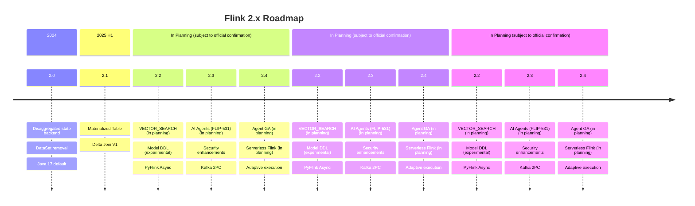
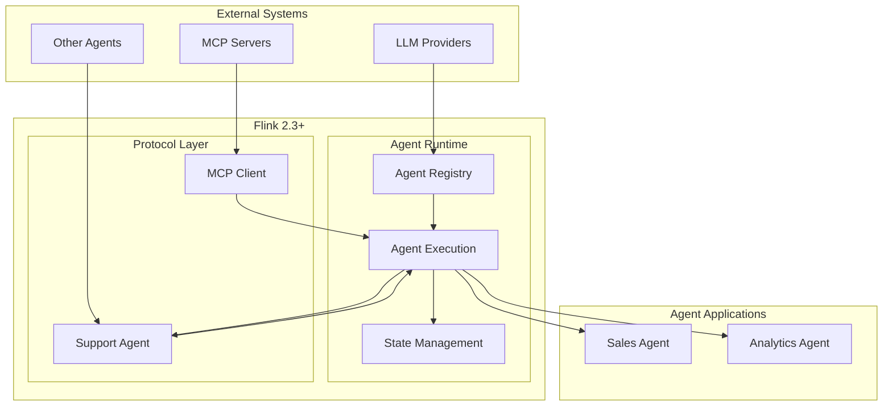

# Flink 2.3/2.4 Roadmap and New Features Explained

> **Status**: Forward-looking | **Estimated Release**: 2026-Q3 | **Last Updated**: 2026-04-12
>
> ⚠️ Features described in this document are in early discussion stages and have not been officially released. Implementation details may change.

> **Stage**: Flink/08-roadmap | **Prerequisites**: [Flink 2.2 Frontier Features](../../02-core/flink-2.2-frontier-features.md) | **Formality Level**: L3

## 1. Definitions

### Def-F-08-40: Flink 2.3 Release Scope

**Flink 2.3** is an important version scheduled for release in 2026 Q1-Q2, focusing on:

```
Release cycle: Estimated release time (subject to official announcement)
Main themes: AI Agent support, security enhancements, performance optimizations
```

**Key Improvement Areas**:

1. **AI/ML Native Support** (FLIP-531): Agent runtime
2. **Security Enhancements**: TLS cipher suite updates, SSL configuration
3. **Connector Ecosystem**: Kafka 2PC improvements, new sources/sinks
4. **SQL Enhancements**: JSON functions, hints optimization
5. **Operations Improvements**: Diagnostic tools, error handling

### Def-F-08-41: FLIP-531 Flink AI Agents

**FLIP-531** introduces native AI Agent support:

```yaml
FLIP-531: "Building and Running AI Agents in Flink"
Status: MVP design completed (Q2 2025) → MVP implementation (Q3 2025)
Goal: Provide an enterprise-grade Agentic AI runtime
Core capabilities:
  - Event-driven long-running Agents
  - Native MCP protocol integration
  - A2A (Agent-to-Agent) communication
  - State management as Agent memory
  - Full replayability
API support:
  - Java: Agent API / DataStream
  - Python: PyFlink Agent API
  - SQL: ~~CREATE AGENT~~ / ~~CREATE TOOL~~ (future possible syntax, conceptual design stage, not yet supported)
```

**Roadmap Milestones**:

| Phase | Time | Milestone |
|-------|------|-----------|
| MVP Design | Q2 2025 | Design documents, API prototypes |
| MVP Release | Q3 2025 | Model support, tool invocation, replayability |
| Multi-Agent | Q4 2025 | A2A communication, example agents |
| GA | Late 2025 | GA release, community extensions |

### Def-F-08-42: Security SSL Enhancement

**Security Enhancement** (FLINK-39022):

```
Change: security.ssl.algorithms default value updated
Reason: JDK update disables TLS_RSA_* cipher suites (RFC 9325)
New default: TLS_ECDHE_RSA_WITH_AES_128_GCM_SHA256,TLS_ECDHE_RSA_WITH_AES_256_GCM_SHA384
Impact: Supports JDK 11.0.30+, 17.0.18+, 21.0.10+, 24+
```

**Compatibility**:

- Old JDK: Automatic fallback compatibility
- New JDK: Enforced forward secrecy

### Def-F-08-43: Kafka 2PC Integration

**Kafka Two-Phase Commit Improvement** (FLIP-319):

```
Background: KIP-939 (Kafka 2PC support)
Goal: Improve exactly-once semantics for Flink Kafka Sink

Current issues:
  - Relies on Java reflection to adjust transaction handling
  - Kafka transaction timeouts pose data loss risks

Improvement plan:
  - Native support for Kafka 2PC participation
  - Eliminate reflection calls
  - Better maintainability
```

### Def-F-08-44: Flink 2.4 Preview

**Flink 2.4 Expected Features** (Based on roadmap):

```
Estimated time: 2026 H2
Core themes:
  1. AI Agent GA (FLIP-531 completion)
  2. Cloud-native enhancements:
     - Serverless Flink (scale-to-zero on demand)
     - Better Kubernetes integration
  3. Performance optimizations:
     - Adaptive execution engine
     - Smarter checkpoint strategies
  4. SQL standard compatibility:
     - ANSI SQL 2023
     - More standard functions
```

## 2. Properties

### Prop-F-08-40: Agent Runtime Scalability

**Proposition**: Flink Agent supports horizontal scaling to thousands of Agent instances:

$$
\text{Throughput} = n \cdot T_{single} \cdot (1 - \alpha)
$$

Where $n$ is the number of TaskManagers, and $\alpha$ is the coordination overhead (~5%).

### Prop-F-08-41: SSL Upgrade Compatibility

**Proposition**: The SSL configuration update maintains backward compatibility:

$$
\text{Compatible}(config_{old}, config_{new}) = \text{true}, \quad \forall JDK < 11.0.30
$$

### Lemma-F-08-40: Kafka 2PC Latency Improvement

**Lemma**: Native 2PC support reduces end-to-end latency:

$$
L_{new} \leq L_{old} - L_{reflection} - L_{retry}
$$

Expected latency reduction: 50-100ms.

## 3. Relations

### 3.1 Flink Version Evolution

```
Flink 1.x (2015-2024)
  ├── 1.17: Incremental checkpoint improvements
  ├── 1.18: Java 17 support, adaptive scheduling
  └── 1.19: Final 1.x release

Flink 2.x (2024+)
  ├── 2.0: Disaggregated state backend, DataSet removal, Java 17 default
  ├── 2.1: Materialized tables, Delta Join
  ├── 2.2: VECTOR_SEARCH, Model DDL, PyFlink Async
  ├── 2.3: AI Agents (FLIP-531), security enhancements, Kafka 2PC
  └── 2.4: Agent GA, Serverless, adaptive execution [Expected]
```

### 3.2 AI Ecosystem Integration

```
┌─────────────────────────────────────────────────────────────────┐
│                    AI Integration Landscape                     │
├─────────────────────────────────────────────────────────────────┤
│  Model Providers                                                │
│  ├── OpenAI (GPT-4/o1/o3)                                       │
│  ├── Anthropic (Claude)                                         │
│  ├── Google (Gemini)                                            │
│  └── Local Models (Llama/Qwen)                                  │
├─────────────────────────────────────────────────────────────────┤
│  Protocols                                                      │
│  ├── MCP (Model Context Protocol)                               │
│  ├── A2A (Agent-to-Agent)                                       │
│  └── Function Calling                                           │
├─────────────────────────────────────────────────────────────────┤
│  Flink Integration (2.3+)                                       │
│  ├── FLIP-531: Agent Runtime                                    │
│  ├── ML_PREDICT: SQL inference                                  │
│  ├── VECTOR_SEARCH: Vector search                               │
│  └── Async I/O: LLM invocation                                  │
└─────────────────────────────────────────────────────────────────┘
```

## 4. Argumentation

### 4.1 Why Does Flink Need Native Agent Support?

**Limitations of Existing Solutions**:

1. **LangChain**: Single-process, no distributed state
2. **Ray Serve**: Disjoint from Flink ecosystem
3. **Custom Services**: Need to build own fault tolerance and scaling

**Flink Agent Advantages**:

1. **Distributed State**: RocksDB/ForSt persistent memory
2. **Event-Driven**: Millisecond-level response latency
3. **Horizontal Scaling**: Automatic load balancing
4. **Fault Tolerance Guarantee**: Exactly-once semantics
5. **Ecosystem Integration**: Seamless Flink SQL/DataStream integration

### 4.2 Considerations for Migrating to Flink 2.3

**Upgrade Checklist**:

```yaml
Compatibility checks:
  - JDK version: Ensure >= 11.0.30 or < 11.0.30 with custom SSL config
  - Kafka version: If using 2PC, requires Kafka >= 3.0 (KIP-939)

New feature adoption:
  - AI Agents: Requires model API keys, MCP Server configuration
  - SQL Hints: Optional, for performance tuning

Deprecated feature checks:
  - DataSet API: Removed in 2.x, migrate to DataStream
  - Queryable State: Removed in 2.x, use remote state queries
```

## 5. Proof / Engineering Argument

### Thm-F-08-40: Agent Replayability Theorem

**Theorem**: Flink Agent execution is fully replayable:

$$
\forall \text{Agent}, t_1, t_2: \text{Replay}(\text{Agent}, t_1, t_2) \equiv \text{Original}(t_1, t_2)
$$

**Guarantees**:

- Checkpoint contains complete state
- Input events are replayable (Kafka offsets)
- LLM responses can be mocked
- Tool invocations can be stubbed

### Thm-F-08-41: SSL Forward Secrecy Theorem

**Theorem**: The new SSL configuration satisfies forward secrecy:

$$
\forall t: \text{Compromise}(key_t) \not\Rightarrow \text{Compromise}(traffic_{<t})
$$

**Implementation**: TLS_ECDHE_* uses ephemeral Diffie-Hellman key exchange

## 6. Examples

### 6.1 Flink 2.3 Upgrade Configuration

```yaml
# flink-conf.yaml upgrade configuration

# SSL security update (required)
security.ssl.algorithms: TLS_ECDHE_RSA_WITH_AES_128_GCM_SHA256,TLS_ECDHE_RSA_WITH_AES_256_GCM_SHA384

# For compatibility with old JDK, explicitly add old suites
# security.ssl.algorithms: TLS_RSA_WITH_AES_128_GCM_SHA256,TLS_ECDHE_RSA_WITH_AES_128_GCM_SHA256

# AI Agent configuration (optional)
# Note: The following are future configuration parameters (conceptual), not yet officially implemented
# Note: The following configurations are predictive/planned, actual versions may differ
# ai.agent.enabled: true  (not yet determined)
ai.agent.model.provider: openai
ai.agent.model.endpoint: https://api.openai.com/v1
ai.agent.state.backend: rocksdb
ai.agent.checkpoint.interval: 60000

# Kafka 2PC configuration (optional)
sink.kafka.2pc.enabled: true
sink.kafka.transaction.timeout.ms: 900000
```

### 6.2 Maven Dependency Update

```xml
<!-- Flink 2.3 BOM -->
<dependencyManagement>
    <dependencies>
        <dependency>
            <groupId>org.apache.flink</groupId>
            <artifactId>flink-bom</artifactId>
            <version>2.3.0</version>
            <type>pom</type>
            <scope>import</scope>
        </dependency>
    </dependencies>
</dependencyManagement>

<!-- AI Agent dependency -->
<dependency>
    <groupId>org.apache.flink</groupId>
    <!-- Note: The following is a potentially future module (design stage), not yet officially released -->
<!-- Note: The following dependency is predictive/planned, actual version may differ -->
    <!-- <artifactId>flink-ai-agent</artifactId> (not yet determined) -->
</dependency>

<!-- MCP protocol support -->
<dependency>
    <groupId>org.apache.flink</groupId>
    <!-- MCP connector (in planning) -->
<artifactId>flink-mcp-connector</artifactId>
</dependency>

<!-- Update Kafka connector -->
<dependency>
    <groupId>org.apache.flink</groupId>
    <artifactId>flink-connector-kafka</artifactId>
    <version>3.4.0</version>  <!-- 2PC support version -->
</dependency>
```

### 6.3 Docker Compose Deployment (2.3)

```yaml
version: '3.8'

services:
  jobmanager:
    image: flink:2.3.0-scala_2.12-java11
    ports:
      - "8081:8081"
    environment:
      - JOB_MANAGER_RPC_ADDRESS=jobmanager
      - FLINK_PROPERTIES=
          # Note: Future configuration parameters (conceptual)
# Note: The following configurations are predictive/planned, actual versions may differ
# ai.agent.enabled=true  (not yet determined)
          ai.agent.model.provider=openai
          ai.agent.model.api.key=${OPENAI_API_KEY}
    command: jobmanager

  taskmanager:
    image: flink:2.3.0-scala_2.12-java11
    depends_on:
      - jobmanager
    environment:
      - JOB_MANAGER_RPC_ADDRESS=jobmanager
      - FLINK_PROPERTIES=
          taskmanager.memory.network.fraction=0.2
          ai.agent.state.backend=rocksdb
    command: taskmanager
    volumes:
      - ./rocksdb-state:/opt/flink/state

  # MCP Server example
  mcp-database:
    image: mcp/postgres-server:latest
    environment:
      - DATABASE_URL=postgresql://db:5432/analytics
    ports:
      - "3001:3000"
```

## 7. Visualizations

### 7.1 Flink 2.x Roadmap



### 7.2 FLIP-531 Architecture



## 8. References
