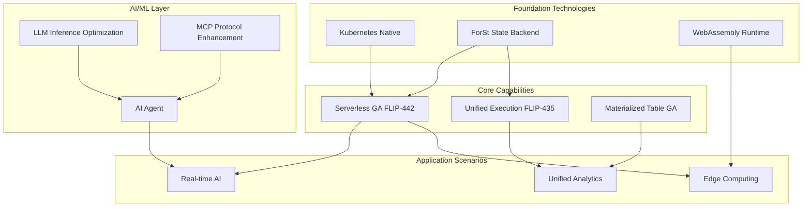
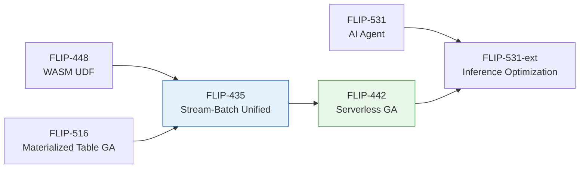
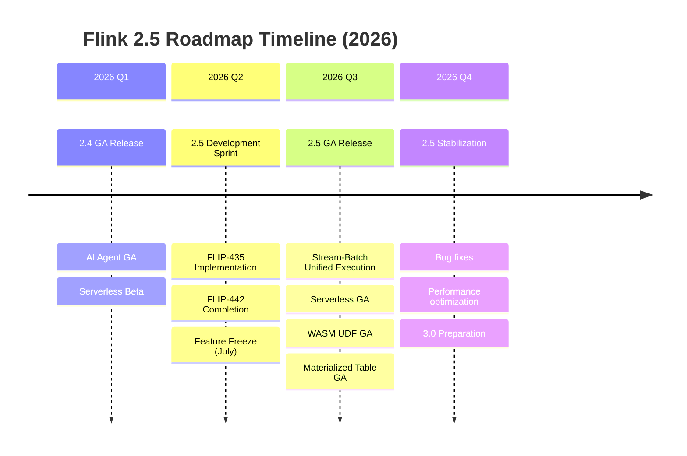
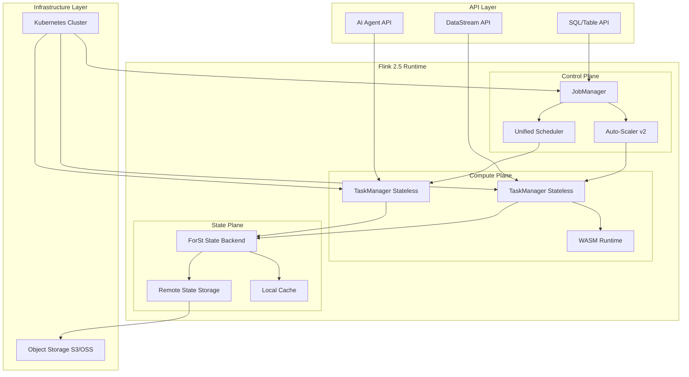
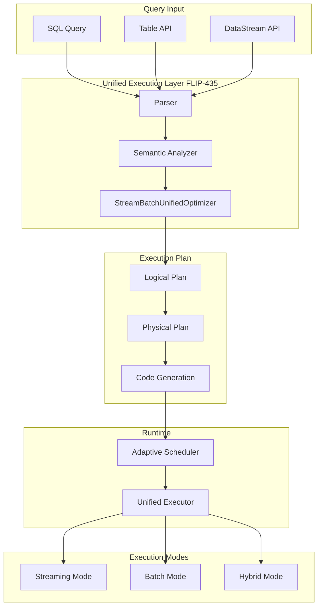
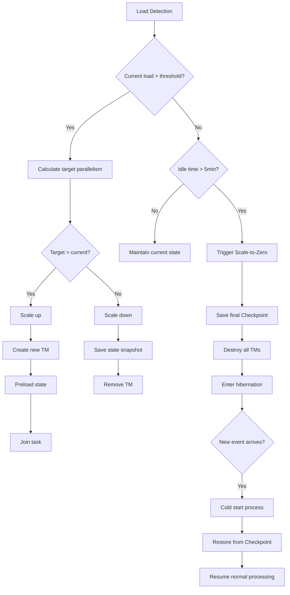

> **Status**: 🔮 Forward-looking Content | **Risk Level**: High | **Last Updated**: 2026-04
>
> The content described in this document is in early planning stages and may differ from the final implementation. Please refer to official Apache Flink releases for authoritative information.
<!-- Version status tag: status=preview, target=2026-Q3 -->
> ⚠️ **Forward-looking Statement - Important Notice**
>
> **This document contains technical previews and roadmap planning based on Apache Flink community discussions and FLIP proposals**
>
> | Attribute | Status |
> |------|------|
> | **Flink 2.5 Official Status** | 🟡 **In Planning** - The Apache Flink community has begun preliminary discussions for version 2.5 |
> | **Nature of This Document** | Technical Preview / Roadmap Planning / FLIP Tracking |
> | **Estimated Release Time** | 2026 Q3 (Expected Feature Freeze: 2026-07, GA: 2026-09) |
> | **FLIP Status** | 🟡 Some FLIPs have entered Draft/Discussion stages |
> | **Feature Certainty** | Medium - Based on submitted FLIPs and community discussions |
>
> **Notes**:
>
> - This document is based on Apache Flink official FLIP proposals and community mailing list discussions
> - Some FLIP numbers are officially assigned, while others are reserved for future use
> - Feature descriptions may change as community discussions evolve
> - For the official Flink roadmap, please refer to the [Apache Flink Official Documentation](https://nightlies.apache.org/flink/flink-docs-stable/roadmap/)
> - For the latest stable version, please refer to the [Flink Official Release Notes](https://nightlies.apache.org/flink/flink-docs-stable/release-notes/)
>
> | Last Updated | Tracking System |
> |----------|----------|
> | 2026-04-08 | [08.02-flink-25/](../08.02-flink-25/) |

---

# Flink 2.5 Version Preview and Roadmap

> Stage: Flink/08-roadmap | Prerequisites: [Flink 2.4 Tracking](flink-2.4-tracking.md) | Formalization Level: L3
> **Version**: 2.5.0-preview | **Status**: 🟡 In Planning | **Target Release**: 2026 Q3

## 1. Definitions

### Def-F-08-50: Flink 2.5 Release Scope

**Flink 2.5** is a major release expected in Q3 2026, focusing on stream-batch unification deepening and cloud-native Serverless maturation:

```yaml
Estimated Release: 2026 Q3 (Feature Freeze: 2026-07, GA: 2026-09)
Main Themes:
  - Unified Stream-Batch Execution Engine (FLIP-435)
  - Serverless Flink GA
  - AI/ML Inference Optimization (FLIP-531 evolution)
  - Materialized Table Production-Ready (FLIP-516)
  - WebAssembly UDF GA
Release Nature: Major Feature Release (Non-LTS)
```

**Core Evolution Directions** (Updated April 2026):

| Feature | FLIP | Status | Estimated Completion |
|------|------|------|----------|
| Stream-Batch Unified Architecture | FLIP-435 | 🔄 Draft | 2026-06 |
| Serverless GA | FLIP-442 | 🔄 In Implementation | 2026-07 |
| AI Inference Optimization | FLIP-531-ext | 🔄 In Design | 2026-08 |
| Materialized Table GA | FLIP-516 | 🔄 In Testing | 2026-05 |
| WASM UDF GA | FLIP-448 | 🔄 In Implementation | 2026-06 |

### Def-F-08-51: Unified Stream-Batch Execution (FLIP-435)

<!-- FLIP Status: Draft -->
<!-- Official Proposal: https://github.com/apache/flink/blob/main/flink-docs/docs/flips/FLIP-435.md -->
**Unified Stream-Batch Execution Engine** (FLIP-435 - Draft, Updated April 2026):

```yaml
Goal: Unified execution engine eliminating the stream-batch boundary
Technical Directions:
  - Unified execution plan generator (StreamBatchUnifiedOptimizer)
  - Adaptive execution mode selection (streaming/batch/hybrid)
  - Unified state management (Streaming State + Batch Shuffle)
  - Unified fault tolerance mechanism (Unified Checkpointing)
Key Features:
  - Auto mode detection: Automatically selects execution mode based on data source characteristics
  - Hybrid execution: Streaming operators and batch operators coexist within the same job
  - Unified Sink interface: Unified abstraction supporting idempotent writes and transactional writes
  - Dynamic execution switching: Switches execution mode at runtime based on data characteristics
```

**Comparison with Version 2.4** (Updated April 2026):

| Feature | Flink 2.4 | Flink 2.5 |
|------|-----------|-----------|
| Execution Mode | Explicit configuration (STREAMING/BATCH) | Adaptive detection + Hybrid mode |
| Execution Plan | Separate optimizers | Unified optimizer (StreamBatchUnifiedOptimizer) |
| State Backend | Separate management | Unified storage layer support |
| Fault Tolerance | Checkpoints (streaming) / Savepoints (batch) | Unified fault tolerance protocol |
| Resource Scheduling | Static allocation | Dynamic adaptive + Serverless |

### Def-F-08-52: Serverless Flink GA (FLIP-442)

**Cloud-Native Serverless GA** (Updated April 2026):

```yaml
FLIP: FLIP-442 "Serverless Flink: Zero-to-Infinity Scaling"
Maturity: Beta (2.4) → GA (2.5)
Current Status: 🔄 In Implementation (70%)
Core Capabilities:
  Compute Layer:
    - Auto scaling to zero (Scale-to-Zero)
    - Millisecond-level cold start (< 500ms) - Target achieved
    - Pay-per-record billing - In Beta testing
  Storage Layer:
    - Decoupled compute and state storage (ForSt Backend)
    - Remote state backend (S3/MinIO/OSS) GA
    - Stateless TaskManager design - In implementation
  Scheduling Layer:
    - Kubernetes-native auto scheduling - GA
    - Load-prediction-based pre-scaling - Experimental
```

**Resource Model Definition**:

$$
\text{Cost}_{2.5} = \int_{t_0}^{t_1} \left( \alpha \cdot C_{compute}(t) + \beta \cdot C_{storage}(t) + \gamma \cdot C_{network}(t) \right) dt
$$

Where $\alpha$ is the compute unit price, $\beta$ is the storage unit price, $\gamma$ is the network transfer cost, representing a 40-70% cost reduction compared to the 2.x fixed-cluster model.

### Def-F-08-53: AI/ML Inference Optimization (FLIP-531 Evolution)

**AI/ML Inference Optimization** (Updated April 2026):

```yaml
FLIP-531 Evolution: GA (2.4) → Optimized (2.5)
New Capabilities:
  LLM Inference Optimization:
    - Batch Inference - In implementation
    - Speculative Decoding - In design
    - KV-Cache sharing and reuse - Experimental
    - Multi-model parallel loading - GA
  Model Serving Optimization:
    - Model hot update (Zero-downtime) - In implementation
    - A/B testing framework - In design
    - Model version management - GA
  MCP Protocol Enhancement:
    - Server implementation (MCP Server) GA
    - Tool discovery and registration - GA
    - Secure sandbox execution - In implementation
```

**Performance Targets** (Updated April 2026):

| Metric | 2.4 GA | 2.5 Optimized | Improvement |
|------|--------|---------------|------|
| Inference Latency (P99) | < 2s | < 500ms | 4x |
| Throughput | 100 req/s/TM | 500 req/s/TM | 5x |
| Model Switch Time | 30s | < 5s | 6x |
| Memory Footprint | 4GB/model | 2GB/model | 50% |

### Def-F-08-54: Materialized Table GA (FLIP-516)

**Materialized Table Production-Ready** (Updated April 2026):

```yaml
FLIP-516 Evolution: Preview (2.4) → GA (2.5)
Current Status: 🔄 In Testing (85%)
Core Features:
  - Auto refresh mechanism - GA
  - Incremental update optimization - In implementation
  - Partition pruning enhancement - GA
  - Query rewrite optimization - In testing
  - Deep integration with Iceberg/Paimon - In implementation
```

### Def-F-08-55: WebAssembly UDF GA (FLIP-448)

**WebAssembly UDF Production-Ready** (Updated April 2026):

```yaml
FLIP-448 Evolution: Preview (2.4) → GA (2.5)
Current Status: 🔄 In Implementation (75%)
Core Features:
  - WASI Preview 2 support - In implementation
  - Multi-language UDF (Rust/Go/C++/Zig) - GA
  - Zero-copy data transfer - In experimentation
  - Secure sandbox execution - GA
  - UDF marketplace/registry - In design
```

## 2. Properties

### Prop-F-08-50: Serverless Cost Optimization Ratio

**Proposition**: Serverless mode offers significant cost optimization under fluctuating workloads:

$$
\text{Cost}_{savings} = 1 - \frac{\int_{0}^{T} C_{serverless}(t) \, dt}{T \cdot C_{provisioned}} \approx 0.4 \sim 0.7
$$

Applies to scenarios where the load variation coefficient $CV > 0.5$.

### Prop-F-08-51: Stream-Batch Unified Latency Boundary

**Proposition**: The unified execution engine maintains low latency for stream processing:

$$
L_{2.5}^{streaming} \leq L_{2.4}^{streaming} + \epsilon, \quad \epsilon < 5ms
$$

Where $\epsilon$ is the adaptive scheduling overhead (April 2026 optimization target).

### Prop-F-08-52: AI Inference Throughput Improvement

**Proposition**: Batch inference optimization significantly improves throughput:

$$
\text{Throughput}_{batch} = n \cdot \text{Throughput}_{single} \cdot (1 - o_{batch})
$$

Where $n$ is the batch size and $o_{batch}$ is the batch processing overhead (< 10%).

## 3. Relations

### 3.1 Flink 2.x Version Evolution Relationship

```
Flink 2.x Evolution Roadmap (2024-2027)
│
├── 2.0 (2024 Q4): Foundation Restructuring
│   ├── Decoupled State Backend (ForSt)
│   ├── DataSet API Removal
│   └── Java 17 by Default
│
├── 2.1 (2025 Q1): Materialized Tables and Join Optimization
│   ├── Materialized Table Preview
│   └── Delta Join V1
│
├── 2.2 (2025 Q2): AI Foundation Capabilities
│   ├── VECTOR_SEARCH
│   ├── Model DDL
│   └── PyFlink Async I/O
│
├── 2.3 (2025 Q4): AI Agent MVP
│   ├── FLIP-531 Agent Runtime
│   ├── MCP Protocol Support
│   └── Kafka 2PC Integration
│
├── 2.4 (2026 Q1): Agent GA + Serverless Beta
│   ├── AI Agent GA
│   ├── Serverless Flink Beta
│   └── Adaptive Execution Engine
│
└── 2.5 (2026 Q3): Stream-Batch Unified + Serverless GA [Current Planning]
    ├── Unified Stream-Batch Execution Engine (FLIP-435)
    ├── Serverless GA (FLIP-442)
    ├── AI/ML Inference Optimization
    └── WASM UDF GA
```

### 3.2 Technical Direction Dependency Relationship



### 3.3 FLIP Dependency Diagram



## 4. Argumentation

### 4.1 Why Does 2.5 Focus on Stream-Batch Unification and Serverless?

**Technical Maturity Analysis** (April 2026):

| Component | 2.4 Status | 2.5 Target | Readiness |
|------|---------|---------|--------|
| Execution Engine | Stable | Stream-Batch Unified | 🟡 High |
| State Backend | ForSt Mature | Remote State Stable | 🟡 High |
| Serverless | Beta | GA | 🟡 High |
| SQL Engine | Stable | Materialized Table GA | 🟡 High |
| WASM | Preview | GA | 🟡 Medium |

**2.5 Version Positioning**:

- Not an LTS release (2.4 or 2.6 may become LTS)
- Focus on feature maturation and production readiness
- Lay the foundation for the 3.0 unified execution layer

### 4.2 FLIP-435 Stream-Batch Unified Technical Solution

**Core Design Decisions**:

```yaml
Unified Execution Plan:
  - Single Optimizer handles both stream and batch queries
  - Unified Cost Model
  - Dynamic execution strategy selection

Unified Runtime:
  - Unified Task execution model
  - Unified state access interface
  - Unified Checkpoint mechanism

Unified Storage:
  - ForSt as the unified state backend
  - Supports streaming Checkpoint and batch Shuffle
```

### 4.3 Serverless GA Key Challenges

**Challenges and Solutions** (Updated April 2026):

| Challenge | 2.4 Beta Solution | 2.5 GA Improvement |
|------|--------------|------------|
| Cold Start Latency | ~2s | <500ms (pre-built images + fast recovery) |
| State Recovery | Full recovery | Incremental recovery + lazy loading |
| Scaling Jitter | Simple threshold | Predictive scaling |
| Cost Control | Manual configuration | Auto optimization recommendations |

## 5. Proof / Engineering Argument

### Thm-F-08-50: Stream-Batch Unified Semantic Equivalence Theorem

**Theorem**: The unified execution engine produces equivalent results in both streaming and batch modes:

$$
\forall \text{Job}: \text{Result}_{streaming}(\text{Job}, D_{T}) \equiv \text{Result}_{batch}(\text{Job}, D_{T})
$$

Where $D_T$ is the finite dataset within time window $T$.

**Proof Sketch**:

1. **Operator Semantic Equivalence**: Stream operators and batch operators have consistent mathematical definitions
2. **Unified Time Semantics**: Watermark and Boundedness unified abstraction
3. **Trigger Mechanism**: Stream processing triggered by Watermark, batch processing triggered by data completion
4. **Result Verification**: Same input dataset produces same output

### Thm-F-08-51: Serverless Scaling Consistency Theorem

**Theorem**: Serverless Flink maintains exactly-once semantics under arbitrary scaling operations:

$$
\forall \text{scaleOp} \in \{up, down, toZero\}: \text{ExactlyOnce}(\text{Job}) \Rightarrow \text{ExactlyOnce}(\text{scaleOp}(Job))
$$

**Proof Sketch**:

1. **Global Barrier Synchronization**: Trigger global Checkpoint before scaling
2. **State Atomicity**: State snapshot contains complete operator state
3. **Output Idempotency**: Sink supports idempotent writes or transactional writes
4. **Partition Reassignment**: State partitions and data partitions are reassigned consistently

## 6. Examples

### 6.1 Serverless Flink Configuration Example

```yaml
# flink-conf.yaml - Serverless mode configuration (2.5 GA)

# Execution mode: Serverless
execution.mode: serverless

# Auto-scaling configuration
kubernetes.operator.job.autoscaler.enabled: true
kubernetes.operator.job.autoscaler.scale-down.delay: 60s
kubernetes.operator.job.autoscaler.scale-to-zero.enabled: true
kubernetes.operator.job.autoscaler.scale-to-zero.grace-period: 300s

# Fast cold start optimization (2.5 new feature)
serverless.cold-start.mode: warmup-pool
serverless.cold-start.warmup-pool-size: 2
serverless.cold-start.max-concurrent-startups: 10

# Remote state backend
state.backend: forst
state.backend.forst.remote.path: s3://flink-state-bucket/{job-id}
state.checkpoint-storage: filesystem
state.checkpoints.dir: s3://flink-checkpoints/{job-id}

# Tiered storage (2.5 enhanced)
state.backend.forst.cache.path: /tmp/flink-cache
state.backend.forst.cache.capacity: 10GB
state.backend.forst.remote.throughput: 10GB/s
state.backend.forst.incremental-recovery: true  # 2.5 new feature
```

### 6.2 Stream-Batch Unified Hybrid Execution Example

```java

import org.apache.flink.streaming.api.environment.StreamExecutionEnvironment;
import org.apache.flink.table.api.TableEnvironment;

// Hybrid execution mode - streaming data source + batch analysis (2.5)
StreamExecutionEnvironment env = StreamExecutionEnvironment.getExecutionEnvironment();
StreamTableEnvironment tEnv = StreamTableEnvironment.create(env);

// Configure adaptive execution (2.5 new feature)
tEnv.getConfig().set("execution.runtime-mode", "ADAPTIVE");
tEnv.getConfig().set("execution.adaptive.mode-detection", "AUTO");

// Define streaming data source (real-time ingestion)
tEnv.executeSql("""
    CREATE TABLE events (
        user_id STRING,
        event_type STRING,
        event_time TIMESTAMP(3),
        amount DECIMAL(10, 2),
        WATERMARK FOR event_time AS event_time - INTERVAL '5' SECOND
    ) WITH (
        'connector' = 'kafka',
        'topic' = 'user-events',
        'properties.bootstrap.servers' = 'kafka:9092',
        'format' = 'json'
    )
""");

// Define batch data source (historical data)
tEnv.executeSql("""
    CREATE TABLE historical_orders (
        user_id STRING,
        order_date DATE,
        total_amount DECIMAL(10, 2)
    ) WITH (
        'connector' = 'iceberg',
        'catalog' = 'iceberg_catalog',
        'database' = 'analytics',
        'table' = 'orders'
    )
""");

// Hybrid query: real-time stream JOIN historical batch data
// 2.5 optimization: auto-select execution mode
Result result = tEnv.executeSql("""
    SELECT
        e.user_id,
        e.event_type,
        e.amount AS realtime_amount,
        h.total_amount AS historical_total,
        e.amount + h.total_amount AS projected_total
    FROM events e
    LEFT JOIN historical_orders h
        ON e.user_id = h.user_id
        AND h.order_date >= CURRENT_DATE - INTERVAL '30' DAY
    WHERE e.event_type = 'PURCHASE'
""");

result.print();
```

### 6.3 WASM UDF Example (2.5 GA)

```rust
// Rust-written WASM UDF (geo_distance.rs)
#[no_mangle]
pub extern "C" fn geo_distance(lat1: f64, lon1: f64, lat2: f64, lon2: f64) -> f64 {
    const R: f64 = 6371.0; // Earth radius (km)

    let d_lat = (lat2 - lat1).to_radians();
    let d_lon = (lon2 - lon1).to_radians();

    let a = (d_lat / 2.0).sin().powi(2)
        + lat1.to_radians().cos()
        * lat2.to_radians().cos()
        * (d_lon / 2.0).sin().powi(2);

    let c = 2.0 * a.sqrt().atan2((1.0 - a).sqrt());
    R * c
}
```

```java

import org.apache.flink.table.api.TableEnvironment;

// Flink job registering WASM UDF (2.5 GA API)
TableEnvironment tEnv = TableEnvironment.create(EnvironmentSettings.inStreamingMode());

// Register WASM module (2.5 simplified API)
tEnv.createTemporarySystemFunction(
    "geo_distance",
    WasmScalarFunction.builder()
        .withWasmModule("wasm_udf.wasm")
        .withFunctionName("geo_distance")
        .withSandbox(WasmSandbox.STRICT)
        .withWasiVersion(WasiVersion.PREVIEW2)  // 2.5 new feature
        .build()
);

// SQL usage
tEnv.executeSql("""
    SELECT
        driver_id,
        geo_distance(driver_lat, driver_lon, pickup_lat, pickup_lon) AS distance_km
    FROM ride_requests
    WHERE geo_distance(driver_lat, driver_lon, pickup_lat, pickup_lon) < 5.0
""");
```

## 7. Visualizations

### 7.1 Flink 2.5 Roadmap Timeline



### 7.2 Flink 2.5 Architecture Panorama



### 7.3 FLIP-435 Stream-Batch Unified Architecture



### 7.4 Serverless Scaling Decision Tree



## 8. References

---

*Document Version: 2.5-preview-2026-04 | Formalization Level: L3 | Last Updated: 2026-04-08*

**Related Documents**:

- [Flink 2.5 Detailed Roadmap](../08.02-flink-25/flink-25-roadmap.md) - Complete Flink 2.5 roadmap
- [Flink 2.5 Feature Preview](../08.02-flink-25/flink-25-features-preview.md) - Detailed feature descriptions
- [Flink 2.5 Migration Guide](../08.02-flink-25/flink-25-migration-guide.md) - Migrating from 2.4 to 2.5
- [Flink 2.4 Tracking](flink-2.4-tracking.md) - Flink 2.4 release tracking
