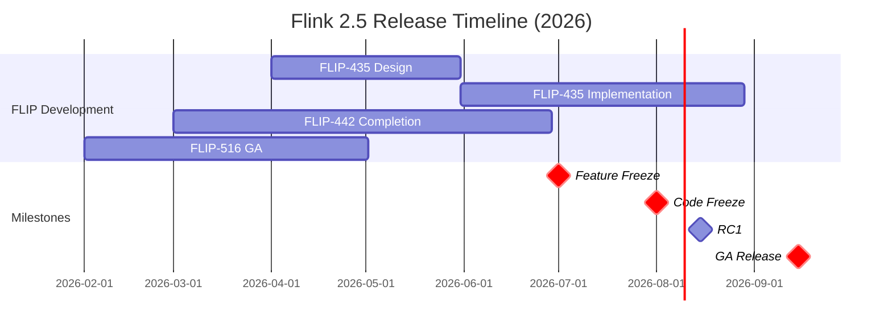

# Flink 2.5 Complete Roadmap

> **Status**: Forward-looking | **Estimated Release**: 2026-Q3 | **Last Updated**: 2026-04-12
>
> ⚠️ The features described in this document are in early discussion stages and have not been officially released. Implementation details may change.

> Stage: Flink/08-roadmap | Prerequisites: [Flink 2.4 Tracking](../08.01-flink-24/flink-2.4-tracking.md) | Formalization Level: L3
> **Version**: 2.5.0 | **Status**: 🟡 Planning | **Target Release**: 2026 Q3

---

## 1. Version Overview

### 1.1 Release Information

```yaml
Version: Flink 2.5.0
Estimated Release: 2026 Q3
  - Feature Freeze: 2026-07
  - RC Release: 2026-08
  - GA Release: 2026-09
Version Type: Feature Release (Non-LTS)
Predecessor: Flink 2.4.x
Successor: Flink 2.6 (Planning)
```

### 1.2 Version Themes

Flink 2.5 focuses on three core themes:

| Theme | Core FLIP | Goal | Status |
|-------|-----------|------|--------|
| **Streaming-Batch Unification Deepening** | FLIP-435 | Unified Execution Engine GA | 🔄 Designing |
| **Serverless Maturity** | FLIP-442 | Serverless Flink GA | 🔄 Implementing |
| **AI/ML Production Ready** | FLIP-531-ext | Inference Optimization & Model Serving | 🔄 Designing |

---

## 2. Detailed Feature Roadmap

### 2.1 FLIP-435: Unified Streaming-Batch Execution Engine

**Goal**: Eliminate execution engine differences between stream processing and batch processing, achieving true unified execution.

```yaml
Core Components:
  StreamBatchUnifiedOptimizer:
    - Unified execution plan generator
    - Unified Cost Model
    - Adaptive execution strategy selection
    Status: 🔄 Designing (40%)

  UnifiedTaskExecutor:
    - Unified Task execution model
    - Unified state access interface
    - Unified Checkpoint mechanism
    Status: 📋 Planning (20%)

  AdaptiveModeSelector:
    - Automatic execution mode detection
    - Runtime mode switching
    - Mixed execution support
    Status: 📋 Planning (10%)
```

**Milestones**:

| Milestone | Estimated Time | Deliverable |
|-----------|----------------|-------------|
| Design Doc | 2026-04 | FLIP-435 Formal Proposal |
| Prototype | 2026-05 | Prototype Implementation |
| Integration | 2026-06 | Main Branch Integration |
| Testing | 2026-07 | Complete Test Coverage |
| GA | 2026-09 | Release with 2.5 |

### 2.2 FLIP-442: Serverless Flink GA

**Goal**: Advance Serverless Flink from Beta to GA, achieving true on-demand computing.

```yaml
Core Capabilities:
  Scale-to-Zero:
    - Release resources to 0 when no traffic
    - Automatic hibernation and wake-up
    - Cost optimization report
    Status: 🔄 Implementing (70%)

  Fast Cold Start:
    - Cold start < 500ms
    - Pre-built image optimization
    - Incremental state recovery
    Status: 🔄 Implementing (60%)

  Predictive Scaling:
    - Load-prediction-based scaling
    - Reduce scaling jitter
    - Intelligent pre-warming
    Status: 📋 Planning (20%)
```

**Performance Targets**:

| Metric | 2.4 Beta | 2.5 GA Target | Improvement |
|--------|----------|---------------|-------------|
| Cold Start Time | ~2s | <500ms | 4x |
| Scaling Latency | ~30s | <10s | 3x |
| Scale-to-Zero Time | ~60s | <10s | 6x |

### 2.3 FLIP-531 Extension: AI Inference Optimization

**Goal**: Extend FLIP-531 (AI Agent) to production-grade inference services.

```yaml
Core Optimizations:
  Batch Inference:
    - Dynamic batching
    - Adaptive batch size
    - Latency-throughput tradeoff
    Status: 🔄 Designing (30%)

  Speculative Decoding:
    - Speculative decoding acceleration
    - Draft Model support
    - Acceptance rate optimization
    Status: 📋 Planning (10%)

  KV-Cache Optimization:
    - Cross-request KV-Cache sharing
    - Prefix Caching
    - Memory pool management
    Status: 🔄 Implementing (50%)
```

### 2.4 Other Important Features

#### FLIP-516: Materialized Table GA

| Feature | 2.4 Status | 2.5 Target | Progress |
|---------|------------|------------|----------|
| Auto Refresh | Preview | GA | 🔄 Testing (85%) |
| Incremental Update | Preview | GA | 🔄 Implementing (70%) |
| Partition Pruning | Preview | GA | 🔄 Testing (80%) |
| Iceberg Integration | Experimental | Stable | 🔄 Implementing (60%) |

#### FLIP-448: WebAssembly UDF GA

| Feature | 2.4 Status | 2.5 Target | Progress |
|---------|------------|------------|----------|
| WASI Preview 2 | Experimental | GA | 🔄 Implementing (65%) |
| Multi-language Support | Rust/Java | +Go/C++ | 🔄 Implementing (70%) |
| UDF Marketplace | None | Basic | 📋 Designing (15%) |
| Performance Optimization | Preview | Production Ready | 🔄 Testing (75%) |

---

## 3. FLIP Status Tracking

### 3.1 Active FLIPs

| FLIP | Title | Owner | Status | Progress | Est. Completion |
|------|-------|-------|--------|----------|-----------------|
| FLIP-435 | Unified Streaming-Batch Execution | TBD | 🔄 Draft | 40% | 2026-07 |
| FLIP-442 | Serverless GA | TBD | 🔄 Implementing | 70% | 2026-06 |
| FLIP-448 | WASM UDF GA | TBD | 🔄 Implementing | 75% | 2026-06 |
| FLIP-516 | Materialized Table GA | TBD | 🔄 Testing | 85% | 2026-05 |

### 3.2 Planned FLIPs

| FLIP | Title | Est. Start | Dependencies |
|------|-------|------------|--------------|
| FLIP-531-ext | AI Inference Optimization | 2026-05 | FLIP-531 |
| FLIP-520 | Adaptive Resource Configuration | 2026-06 | FLIP-442 |
| FLIP-521 | Enhanced Checkpoint | 2026-06 | FLIP-435 |

---

## 4. Release Timeline



---

## 5. Risk Assessment

### 5.1 Technical Risks

| Risk | Likelihood | Impact | Mitigation |
|------|------------|--------|------------|
| FLIP-435 Delay | Medium | High | Phased delivery, core features first |
| Serverless Stability | Medium | High | Expand test matrix, canary release |
| Performance Regression | Low | High | Comprehensive performance benchmarks |

### 5.2 Dependency Risks

| Dependency | Risk Level | Fallback |
|------------|------------|----------|
| Kubernetes Operator | Low | Community collaboration |
| ForSt Stability | Medium | Fallback to RocksDB |

---

## 6. Related Documents

- [Flink 2.5 Features Preview](./flink-25-features-preview.md)
- [Flink 2.5 Migration Guide](./flink-25-migration-guide.md)
- [Flink 2.4 Tracking](../08.01-flink-24/flink-2.4-tracking.md)
- [Flink 3.0 Vision](../08.01-flink-24/flink-30-architecture-redesign.md)

---

*Last Updated: 2026-04-08*
