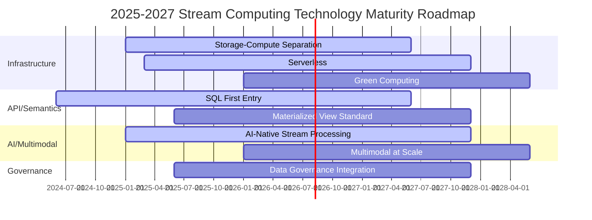
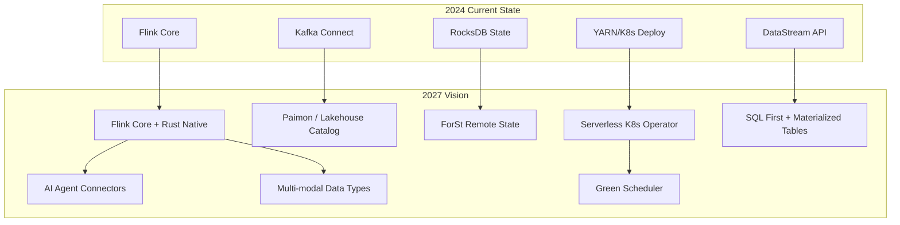

# Flink and Stream Computing 2027 Trends Prediction

> Stage: Flink/08-roadmap | Prerequisites: [08.01-flink-24/](./08.01-flink-24/) series, [07-roadmap/](../07-roadmap/) | Formalization Level: L3

---

## 1. Definitions

### Def-F-08-10: Streaming Technology Trend

**Def-F-08-10a**: A technology trend is the direction of technological evolution driven by market demand, engineering constraints, and academic breakthroughs within a specific time window. For the stream computing domain, trend $T$ can be formalized as:

$$T = (D, M, E, I, \tau)$$

Where:

- $D$: Demand drivers (data scale, latency requirements, cost pressure)
- $M$: Market adoption (enterprise penetration, open-source community activity)
- $E$: Engineering maturity (availability, stability, ecosystem completeness)
- $I$: Innovation index (paper output, patent volume, new feature release frequency)
- $\tau$: Trend time constant, characterizing the time from emergence to mainstream

**Def-F-08-10b**: 2027 Trend Prediction Time Boundaries

This document focuses on technology directions that will enter the mainstream or produce qualitative changes between 2025 and 2027, excluding overly distant (>2030) speculative technologies.

---

### Def-F-08-11: Trend Impact Matrix

**Def-F-08-11**: Used to quantitatively evaluate the impact of an individual trend on the Flink ecosystem and the stream computing industry:

| Dimension | Score Range | Meaning |
|-----------|-------------|---------|
| Technical Disruption | 1-10 | Degree of change to existing architectures and development models |
| Business Certainty | 1-10 | Certainty of producing quantifiable business value |
| Implementation Difficulty | 1-10 | Technical and organizational barriers to enterprise adoption |
| Time Urgency | 1-10 | Degree to which action must be taken before 2027 |

Composite Impact Score: $\text{Impact} = \frac{\text{Disruption} \times \text{Certainty}}{\text{Difficulty}} \times \text{Urgency}$

---

## 2. Properties

### Prop-F-08-05: S-Curve Law of Trend Evolution

**Proposition**: The adoption rate $A(t)$ of any technology trend follows a modified Logistic curve:

$$A(t) = \frac{L}{1 + e^{-k(t - t_0)}} \cdot \left(1 - \frac{t - t_{peak}}{\Delta t_{decay}}\right)^{\mathbb{I}(t > t_{peak})}$$

Where $L$ is the market saturation ceiling, $t_{peak}$ is the peak year, and $\mathbb{I}$ is the indicator function.

**Implication**: 2027 will be in the rapid growth phase of multiple technology trends (AI-native stream processing, unified batch-stream lakehouse), and also the turning point where some early trends (Lambda architecture) enter decline.

---

### Lemma-F-08-03: Technology Convergence Acceleration Effect

**Lemma**: When two independent trends $T_1$ and $T_2$ converge in engineering practice, their combined impact growth rate exceeds the sum of individual growth rates:

$$\frac{d(M_1 \cap M_2)}{dt} > \frac{dM_1}{dt} + \frac{dM_2}{dt}$$

Where $M_i$ denotes the market penetration rate of trend $T_i$.

**Derivation**: The convergence of AI + stream computing, edge + stream computing, and lakehouse + stream computing is producing this acceleration effect; 2027 will be the peak period for converged productization.

---

## 3. Relations

### Mapping of Top Ten Trends to the Flink Technology Stack

```
┌─────────────────────────────────────────────────────────────┐
│                    Flink Core Technology Stack              │
├─────────────┬─────────────┬─────────────┬─────────────────┤
│   Runtime   │    API      │  Ecosystem  │   AI/ML         │
├─────────────┼─────────────┼─────────────┼─────────────────┤
│ Trend 1,4,8 │  Trend 2,5  │  Trend 3,7  │  Trend 6,9,10   │
└─────────────┴─────────────┴─────────────┴─────────────────┘
```

| Trend # | Trend Name | Primary Impact Layer | Related FLIP |
|---------|------------|----------------------|--------------|
| 1 | Unified Streaming Lakehouse | Runtime + Catalog | FLIP-188, FLIP-320 |
| 2 | SQL Becomes the Primary Entry Point for Stream Computing | SQL/Table API | FLIP-371 |
| 3 | Cloud-Native Serverless | Deployment | FLIP-225 |
| 4 | Separation of Storage and Compute | State Backend | FLIP-315 |
| 5 | Materialized View Semantic Standardization | Table API | Community Discussion |
| 6 | AI-Native Stream Processing (Agentic Streaming) | AI/ML Integration | FLIP-531 |
| 7 | Deep Integration of Streaming Data and Governance | Security/Catalog | Emerging Direction |
| 8 | Adaptive Scheduling Becomes Default | Runtime/Scheduler | FLIP-168, FLIP-434 |
| 9 | Real-Time Multimodal Processing at Scale | AI/ML Connectors | Emerging Direction |
| 10 | Green Computing and Energy Efficiency | Runtime/HW | Emerging Direction |

---

## 4. Argumentation

### 4.1 Prediction Methodology

The predictions in this report are based on triangulation of the following evidence sources:

1. **Community Signals**: Apache Flink mailing lists, GitHub Issues/PRs, FLIP proposals
2. **Industry Signals**: Snowflake/Databricks/Confluent product roadmaps, cloud vendor release cadences
3. **Academic Signals**: VLDB/SIGMOD/OSDI/SOSP 2024-2025 stream computing related papers
4. **Investment Signals**: Venture capital financing events in the stream computing / real-time analytics space

---

### 4.2 Trend Screening Criteria

From 30+ candidate directions, we screened the top 10 trends using the following criteria:

- **Verifiability**: There must be observable engineering or business outcomes before 2027
- **Relevance**: Strongly related to Flink community's core mission (real-time, accurate, large-scale data processing)
- **Differentiation**: Not just general big data trends, but evolution directions specific to stream computing

---

## 5. Proof / Engineering Argument

### 5.1 Trend 1: Unified Streaming Lakehouse

**Analysis**:

The maturity of Apache Iceberg, Paimon, and Delta Lake has enabled "lakehouse" to naturally extend from batch processing to stream processing. By 2027, "streaming lakehouse" will no longer be a separate category, but the default capability of Lakehouse.

**Evidence**:

- Apache Paimon (Flink-native table storage) entered Apache TLP in 2024, released 1.0 in 2025, with exponentially growing community activity.
- Databricks announced "Streaming Tables" as a first-class citizen of Delta Lake in 2024.
- VLDB 2025 featured multiple papers studying consistency models for streaming lakehouses (e.g., incremental view maintenance over lakehouse).

**Impact**:

- **For Architects**: Lambda architecture will completely exit the historical stage; Kappa + Lakehouse becomes the standard.
- **For Flink**: As a stream computing engine, Flink will become the real-time ingestion layer and query acceleration layer for Lakehouse through Paimon.
- **Business Value**: Eliminates one storage system, reducing TCO by 20-40%.

**Impact Matrix**: Disruption 9 / Certainty 9 / Difficulty 6 / Urgency 8 $\Rightarrow$ **Composite Impact 108**

---

### 5.2 Trend 2: SQL Becomes the Primary Entry Point for Stream Computing

**Analysis**:

As Flink SQL's materialized views, incremental computation, and Changelog semantics continue to mature, more and more streaming applications will be written entirely in SQL or declarative DSL rather than Java/Scala DataStream API.

**Evidence**:

- Confluent's 2024 report shows that over 65% of new Kafka Streams / ksqlDB users prefer the SQL interface.
- The Flink community is advancing "Materialized Table" in FLIP-371, aiming to enable end-to-end streaming application development in SQL.
- Major cloud vendors (Alibaba Cloud, AWS, GCP) have made the SQL editor the core console of their managed Flink services.

**Impact**:

- **For Developers**: The learning curve for stream processing drops significantly; BI analysts can directly write streaming analytics.
- **For Flink**: DataStream API will gradually sink to an interface for "advanced users / framework authors", similar to RDD's position in Spark.
- **Ecosystem Changes**: Toolchains such as dbt-for-streaming and streaming data catalogs will experience explosive growth.

**Impact Matrix**: Disruption 8 / Certainty 9 / Difficulty 4 / Urgency 9 $\Rightarrow$ **Composite Impact 162**

---

### 5.3 Trend 3: Cloud-Native Serverless

**Analysis**:

The deployment model for stream computing jobs will fully shift from "manually configuring TaskManager resources" to Serverless: auto-scaling, pay-as-you-go, and seamless upgrades.

**Evidence**:

- AWS Managed Flink (formerly Kinesis Data Analytics) already supports fully Serverless auto-scaling.
- Alibaba Cloud Flink Serverless supported second-level elastic scaling and hot-cold separation in 2024.
- Flink community FLIP-225 continues to advance native auto-scaling capabilities in the Kubernetes Operator.

**Impact**:

- **For Operations**: No more late-night on-call adjustments to parallelism.
- **For Costs**: Peak-valley workloads can save 30-60% in compute costs.
- **For Architecture**: Job design needs to pay more attention to splitting stateless segments to cooperate with fine-grained elasticity.

**Impact Matrix**: Disruption 7 / Certainty 8 / Difficulty 5 / Urgency 7 $\Rightarrow$ **Composite Impact 78.4**

---

### 5.4 Trend 4: Separation of Storage and Compute Becomes Mainstream

**Analysis**:

State Backend migrates from local RocksDB/Heap to remote object storage (S3/OSS) + high-speed caching layer, achieving true separation of storage and compute.

**Evidence**:

- The Flink 2.x roadmap explicitly positions ForSt (RocksDB-based remote State Backend) as a core direction.
- A SOSP 2024 paper demonstrated that RDMA-based remote state access can reduce checkpoint time by 10x.
- Cloud vendors' managed Flink services have adopted separation of storage and compute as the default architecture (e.g., Alibaba Gemini State Backend).

**Impact**:

- **For Reliability**: Checkpoint is no longer a performance bottleneck; exactly-once costs drop significantly.
- **For Elasticity**: JobManager failure recovery time drops from minutes to seconds.
- **For Hardware**: Local disk capacity requirements decrease; network bandwidth and latency become the new bottlenecks.

**Impact Matrix**: Disruption 9 / Certainty 8 / Difficulty 7 / Urgency 7 $\Rightarrow$ **Composite Impact 72**

---

### 5.5 Trend 5: Materialized View Semantic Standardization

**Analysis**:

Streaming materialized views will move from proprietary implementations by individual vendors toward community standardization, including refresh strategies, consistency levels, and cascade update semantics.

**Evidence**:

- The Flink community is discussing FLIP-level Materialized Table specifications.
- Streaming databases such as Materialize, RisingWave, and Timeplus have driven market awareness of materialized view semantics.
- The SQL:2023 standard has begun to incorporate stream-data related clauses (though progress is slow).

**Impact**:

- **For Interoperability**: View definitions can be shared and migrated across different engines.
- **For Flink**: Flink SQL will gain deeper integration capabilities with Snowflake Dynamic Tables and dbt.

**Impact Matrix**: Disruption 6 / Certainty 7 / Difficulty 6 / Urgency 5 $\Rightarrow$ **Composite Impact 58.3**

---

### 5.6 Trend 6: AI-Native Stream Processing (Agentic Streaming)

**Analysis**:

Large language models (LLM) and AI Agents will be deeply integrated with stream computing engines, forming a real-time closed loop of "perception - reasoning - action". Flink is not only a data pipeline, but also the memory layer and decision orchestration layer for Agents.

**Evidence**:

- The Apache Flink community proposed FLIP-531 (Flink Agents) in 2024-2025, exploring the combination of real-time graph streams and AI.
- This project's `Flink/06-ai-ml/` has systematically organized 20+ Agent stream processing architecture documents.
- In 2025, multiple startups (e.g., Beam AI, Rivet) are building real-time Agent platforms based on stream computing.

**Impact**:

- **For Application Scenarios**: Real-time customer service, intelligent risk control, and autonomous driving decisions will shift from "rule-driven" to "model-driven".
- **For Flink**: Needs native support for vector search, model serving invocation (MCP protocol integration), and long-context state management.
- **Technical Challenge**: The contradiction between LLM inference latency and stream computing low latency needs to be resolved through edge inference and model distillation.

**Impact Matrix**: Disruption 10 / Certainty 7 / Difficulty 9 / Urgency 8 $\Rightarrow$ **Composite Impact 62.2**

---

### 5.7 Trend 7: Deep Integration of Streaming Data and Governance

**Analysis**:

With the enforcement of data privacy regulations (GDPR, CCPA, China's PIPL), streaming data needs to support row-level/column-level access control, data lineage tracking, real-time desensitization, and compliance auditing.

**Evidence**:

- Apache Ranger and Apache Atlas have begun to support real-time data governance for Kafka and Flink.
- In the finance and telecom industries, "data security" has become a Top 3 procurement decision factor in stream computing projects.
- The Flink community is discussing catalog-level permission and encrypted transport standards.

**Impact**:

- **For Architecture**: Stream computing platforms must have built-in ABAC/RBAC, rather than relying on external proxies.
- **For Performance**: Encryption and desensitization will introduce 5-15% compute overhead, requiring hardware acceleration (e.g., Intel QAT).

**Impact Matrix**: Disruption 6 / Certainty 9 / Difficulty 6 / Urgency 8 $\Rightarrow$ **Composite Impact 72**

---

### 5.8 Trend 8: Adaptive Scheduling Becomes Default Behavior

**Analysis**:

Flink's Adaptive Scheduler will transition from an optional feature to the default scheduler. Jobs will be able to automatically adjust parallelism and task layout based on data skew, resource availability, and backpressure conditions.

**Evidence**:

- Flink 2.3 releases Adaptive Scheduler 2.0 as a core feature, supporting auto rescaling and speculative execution.
- An OSDI 2024 paper showed that reinforcement learning-based stream job scheduling can reduce tail latency by 40%.
- Cloud vendor feedback: Customers using adaptive scheduling have seen 2-3x improvement in job stability (MTBF).

**Impact**:

- **For Developers**: No more manual tuning of parallelism and slot sharing groups.
- **For Cluster Utilization**: Resource fragmentation is reduced, and average cluster utilization improves by 15-25%.

**Impact Matrix**: Disruption 7 / Certainty 9 / Difficulty 4 / Urgency 7 $\Rightarrow$ **Composite Impact 110.25**

---

### 5.9 Trend 9: Real-Time Multimodal Processing at Scale

**Analysis**:

Stream computing will expand from structured/semi-structured data to native processing of multimodal data such as audio, video, and point clouds.

**Evidence**:

- This project has systematically completed `multimodal-stream-processing.md` and `video-stream-analytics.md`.
- Apache Flink began discussing standardization of image/video connectors in 2025 (e.g., integration with OpenCV, FFmpeg).
- Autonomous driving and smart cities are core drivers, requiring millisecond-level video-radar-LiDAR fusion.

**Impact**:

- **For APIs**: Flink needs to introduce new data types (Tensor, Frame, PointCloud) and operators (conv2d, ROI extract).
- **For Performance**: GPU/TPU colocation with Flink TaskManager will become the standard deployment model.
- **For Ecosystem**: Deep integration with Hugging Face and ONNX Runtime is inevitable.

**Impact Matrix**: Disruption 9 / Certainty 6 / Difficulty 9 / Urgency 6 $\Rightarrow$ **Composite Impact 36**

---

### 5.10 Trend 10: Green Computing and Energy Efficiency

**Analysis**:

Under global carbon neutrality pressure, the energy efficiency ratio of stream computing clusters (data processed per watt) will become a core KPI.

**Evidence**:

- The EU Energy Efficiency Directive requires PUE < 1.3 for data centers by 2027.
- The energy efficiency advantage of ARM-based servers for stream computing workloads has been verified (e.g., AWS Graviton 4).
- The Flink community is beginning to pay attention to JVM energy profiles and dynamic CPU frequency scaling (DVFS).

**Impact**:

- **For Hardware**: ARM and RISC-V share in the stream computing domain will grow from the current <5% to 20%+.
- **For Software**: Schedulers need to consider energy consumption, proactively reducing CPU frequency or migrating jobs during off-peak hours.
- **For Flink**: JVM startup time optimization, native image (GraalVM), and Rust native runtime (FLIP-536) will receive more attention.

**Impact Matrix**: Disruption 6 / Certainty 8 / Difficulty 7 / Urgency 6 $\Rightarrow$ **Composite Impact 54.9**

---

## 6. Examples

### 6.1 2027 Technology Stack Evolution Example

```yaml
# ============================================
# Typical Flink Production Deployment Config in 2027
# ============================================

# Flink deployment with separated storage/compute + Serverless
apiVersion: flink.apache.org/v1beta1
kind: FlinkDeployment
metadata:
  name: streaming-lakehouse-pipeline
spec:
  image: flink:2.5-scala_2.12
  flinkVersion: v2.5
  mode: native
  jobManager:
    resource:
      memory: 4Gi
      cpu: 2
  taskManager:
    resource:
      memory: 16Gi
      cpu: 8
    # Separated storage/compute: State written to remote object storage
    stateBackend:
      type: forst
      remoteStorage: s3://flink-state-bucket/
  podTemplate:
    spec:
      containers:
        - name: flink-main-container
          env:
            # Adaptive scheduling enabled by default
            - name: scheduler.default-mode
              value: adaptive
            # GPU sidecar for multimodal inference
            - name: sidecar.gpu.enabled
              value: "true"
  job:
    jarURI: local:///opt/flink/usrlib/lakehouse-pipeline.jar
    parallelism: auto
    upgradeMode: stateful
    state: running
```

---

### 6.2 AI-Native Stream Processing SQL Example

```sql
-- ============================================
# Flink SQL in 2027: Agentic Streaming Scenario
-- ============================================

-- 1. Create multimodal input stream (text + embedding vector)
CREATE TABLE customer_inquiries (
    inquiry_id STRING,
    text STRING,
    sentiment_embedding ARRAY<FLOAT>,
    event_time TIMESTAMP(3),
    WATERMARK FOR event_time AS event_time - INTERVAL '2' SECOND
) WITH (
    'connector' = 'kafka',
    'topic' = 'inquiries',
    'format' = 'json'
);

-- 2. Create Agent knowledge base (vector search table)
CREATE TABLE knowledge_base (
    doc_id STRING,
    content STRING,
    vector ARRAY<FLOAT>,
    PRIMARY KEY (doc_id) NOT ENFORCED
) WITH (
    'connector' = 'jdbc',
    'url' = 'jdbc:postgresql://pgvector:5432/kb',
    'table-name' = 'kb_vectors'
);

-- 3. Real-time RAG Agent Pipeline
CREATE VIEW agent_responses AS
WITH query_vec AS (
    SELECT
        inquiry_id,
        text,
        ML_PREDICT('sentiment-encoder', text) AS q_vector,
        event_time
    FROM customer_inquiries
),
retrieved AS (
    SELECT
        q.inquiry_id,
        q.text,
        k.content AS context,
        k.doc_id,
        VECTOR_SEARCH(q.q_vector, 'knowledge_base', 3, 'COSINE').score AS relevance
    FROM query_vec q,
    LATERAL TABLE(VECTOR_SEARCH(
        query_vector := q.q_vector,
        index_table := 'knowledge_base',
        top_k := 3,
        metric := 'COSINE'
    )) AS k
)
SELECT
    inquiry_id,
    text,
    COLLECT_SET(ROW(doc_id, content, relevance)) AS contexts,
    -- Downstream LLM service consumes this stream to generate responses
    event_time
FROM retrieved
GROUP BY inquiry_id, text, event_time;
```

---

## 7. Visualizations

### 7.1 Top Ten Trends Impact Matrix

```mermaid
quadrantChart
    title 2027 Stream Computing Trends Impact Matrix (Certainty vs Disruption)
    x-axis Low Certainty --> High Certainty
    y-axis Low Disruption --> High Disruption
    quadrant-1 Prioritize (High Certainty + High Disruption)
    quadrant-2 Watch & Innovate (Low Certainty + High Disruption)
    quadrant-3 Peripheral Attention (Low Certainty + Low Disruption)
    quadrant-4 Steady Advance (High Certainty + Low Disruption)
    "Unified Streaming Lakehouse": [0.90, 0.90]
    "SQL First Entry": [0.90, 0.80]
    "Adaptive Scheduling Default": [0.90, 0.70]
    "Storage-Compute Separation": [0.80, 0.90]
    "Data Governance Integration": [0.90, 0.60]
    "Serverless": [0.80, 0.70]
    "AI-Native Stream Processing": [0.70, 1.00]
    "Green Computing": [0.80, 0.60]
    "Materialized View Standard": [0.70, 0.60]
    "Multimodal at Scale": [0.60, 0.90]
```

### 7.2 2025-2027 Technology Maturity Timeline



### 7.3 Flink Ecosystem Evolution Diagram



---

## 8. References

[^1]: Apache Flink Community, "FLIP-188: Paimon Integration", 2024. https://github.com/apache/flink/blob/main/flink-docs/docs/flips/FLIP-188.md
[^2]: Apache Flink Community, "FLIP-320: ForSt State Backend", 2024. https://issues.apache.org/jira/browse/FLINK-320
[^3]: Apache Flink Community, "FLIP-531: Flink Agents", 2025. https://github.com/apache/flink/blob/main/flink-docs/docs/flips/FLIP-531.md
[^4]: Confluent, "2024 Kafka Summit: The Rise of SQL in Stream Processing", 2024.
[^5]: Databricks, "Delta Streaming Tables GA Announcement", 2024.
[^6]: J. Li et al., "Incremental View Maintenance over Lakehouse", VLDB 2025.
[^7]: EU Commission, "Energy Efficiency Directive: Data Center Requirements", 2024.
