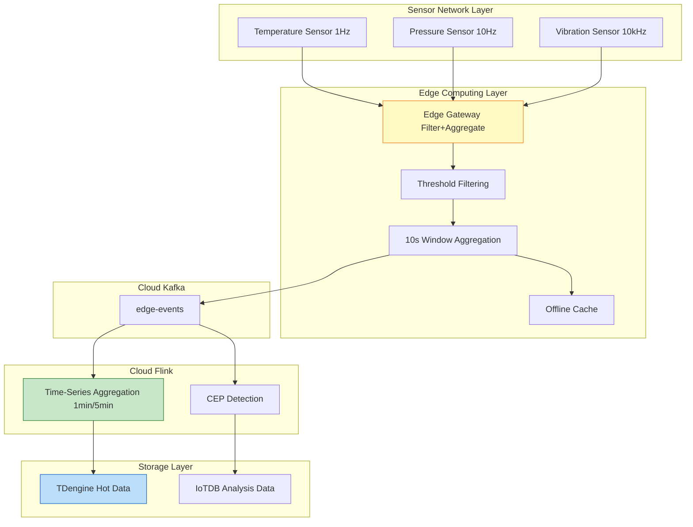
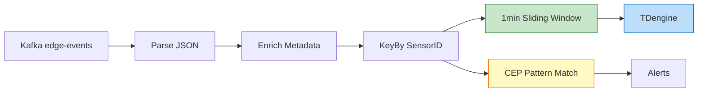

# Case Study: IoT Stream Processing Platform

> **Stage**: Flink/07-case-studies | **Prerequisites**: [../../Flink/02-core/time-semantics-and-watermark.md](../../02-core/time-semantics-and-watermark.md) | **Formalization Level**: L3

---

> **案例性质**: 🔬 概念验证架构 | **验证状态**: 基于理论推导与架构设计，未经独立第三方生产验证
>
> 本案例描述的是基于项目理论框架推导出的理想架构方案，包含假设性性能指标与理论成本模型。
> 实际生产部署可能因环境差异、数据规模、团队能力等因素产生显著不同结果。
> 建议将其作为架构设计参考而非直接复制粘贴的生产蓝图。
## Table of Contents

- [Case Study: IoT Stream Processing Platform](#case-study-iot-stream-processing-platform)
  - [Table of Contents](#table-of-contents)
  - [1. Background](#1-background)
    - [1.1 Company Profile and Business Scenario](#11-company-profile-and-business-scenario)
    - [1.2 Technical Challenges](#12-technical-challenges)
  - [2. Requirements Analysis](#2-requirements-analysis)
    - [2.1 Scale Metrics](#21-scale-metrics)
    - [2.2 Latency Requirements](#22-latency-requirements)
    - [2.3 Data Characteristics](#23-data-characteristics)
  - [3. Architecture Design](#3-architecture-design)
    - [3.1 Overall System Architecture](#31-overall-system-architecture)
    - [3.2 Edge-Cloud Collaborative Architecture](#32-edge-cloud-collaborative-architecture)
    - [3.3 Time-Series Data Processing Topology](#33-time-series-data-processing-topology)
    - [3.4 Integrated System Matrix](#34-integrated-system-matrix)
  - [4. Implementation Details](#4-implementation-details)
    - [4.1 Sensor Data Collection and Edge Preprocessing](#41-sensor-data-collection-and-edge-preprocessing)
    - [4.2 Cloud Flink Job](#42-cloud-flink-job)
    - [4.3 Watermark and Window Configuration](#43-watermark-and-window-configuration)
  - [5. Implementation Results](#5-implementation-results)
    - [5.1 Performance Metrics Achievement](#51-performance-metrics-achievement)
    - [5.2 Production Stability](#52-production-stability)
    - [5.3 Cost-Benefit Analysis](#53-cost-benefit-analysis)
  - [6. Lessons Learned](#6-lessons-learned)
    - [6.1 Key Success Decisions](#61-key-success-decisions)
    - [6.2 Pitfalls and Solutions](#62-pitfalls-and-solutions)
    - [6.3 Reusable Best Practices](#63-reusable-best-practices)
  - [7. Visualizations](#7-visualizations)
    - [7.1 Edge-Cloud Collaborative Architecture Diagram](#71-edge-cloud-collaborative-architecture-diagram)
    - [7.2 Sensor Data Flow Topology Diagram](#72-sensor-data-flow-topology-diagram)
  - [8. References](#8-references)

## 1. Background

### 1.1 Company Profile and Business Scenario

**SmartFactory** is an Industrial Internet of Things (IIoT) solution provider focusing on smart manufacturing, with over 50 smart factory projects deployed globally and more than 5 million industrial sensors connected.

**Business Scenarios**:

| Business Module | Function Description | Key Metrics |
|----------------|---------------------|-------------|
| **Equipment Health Monitoring** | Real-time equipment status monitoring, predictive maintenance | Detection latency < 1s, accuracy > 95% |
| **Production Quality Traceability** | Real-time quality inspection, anomaly alerting, root cause analysis | Latency < 500ms, coverage 100% |
| **Energy Consumption Optimization** | Real-time energy monitoring, intelligent scheduling optimization | Latency < 5s, energy saving > 15% |
| **Environmental Monitoring** | Temperature, humidity, gas concentration and other environmental indicators monitoring | Latency < 10s, anomaly alert < 3s |

**Technology Evolution**:

- **2020-2021**: Traditional SCADA systems, severe data silos, poor scalability
- **2022**: Introduced edge computing gateways, local preprocessing reduces bandwidth pressure
- **2023**: Introduced Flink 1.16, built a cloud stream processing platform
- **2024**: Upgraded to Flink 1.18 + self-developed edge runtime

### 1.2 Technical Challenges

1. **Massive sensor access**: A single factory connects up to 100,000 sensors, with a peak message volume of 2 million events/sec
2. **Unstable network**: Complex factory environment, network links from edge to cloud frequently jitter
3. **Strong time-series data characteristics**: Sensor data is inherently ordered; need to handle out-of-order, late, and duplicate data
4. **Limited edge resources**: Edge gateway computing resources are limited (2-4 core CPU, 4-8GB memory)
5. **Strict real-time requirements**: Equipment fault detection must respond within 1 second

---

## 2. Requirements Analysis

### 2.1 Scale Metrics

| Metric Dimension | Peak Requirement | Daily Average | Remarks |
|-----------------|------------------|---------------|---------|
| **Sensor Count** | 100,000 / factory | 60,000 / factory | Covering temperature, pressure, vibration, current, etc. |
| **Message Throughput** | 2,000,000 events/sec | 800,000 events/sec | Average 200 bytes per message |
| **Edge Preprocessing Volume** | 1,500,000 events/sec | 600,000 events/sec | Edge filtering before uploading to cloud |
| **Cloud Processing Volume** | 500,000 events/sec | 200,000 events/sec | Aggregated events |
| **State Storage Volume** | 1.2 TB | 800 GB | Window state and sensor calibration state |
| **Time-Series Data Storage** | 50 TB / month | 30 TB / month | Raw time-series data |

### 2.2 Latency Requirements

| Latency Type | Requirement | Actual Achievement | Measurement Method |
|-------------|-------------|-------------------|--------------------|
| **Edge Processing Latency** | P99 < 50ms | P99 35ms | From sensor collection to edge gateway output |
| **Cloud Processing Latency** | P99 < 500ms | P99 380ms | From Kafka consumption to result output |
| **End-to-End Latency** | P99 < 1s | P99 850ms | From sensor collection to alert trigger |
| **Fault Detection Latency** | P99 < 1s | P99 720ms | From anomaly occurrence to alert issuance |

### 2.3 Data Characteristics

| Characteristic | Description | Impact |
|---------------|-------------|--------|
| **High-Frequency Sampling** | Vibration sensor 10kHz sampling, temperature sensor 1Hz sampling | Requires hierarchical processing strategy |
| **Out-of-Order Data** | Network jitter causes 5% late data, maximum lateness 30s | Requires Watermark + allowed lateness |
| **Duplicate Data** | MQTT QoS 1 guarantees at-least-once, duplicates exist | Requires idempotent processing mechanism |
| **Missing Data** | Sensor offline causes data gaps | Requires interpolation or marking mechanism |

---

## 3. Architecture Design

### 3.1 Overall System Architecture

The IoT stream processing platform adopts an edge-cloud layered architecture:

- **Sensor Network Layer**: Temperature/pressure/vibration/current sensors, sampling rate 1Hz-10kHz
- **Edge Computing Layer**: Edge gateway responsible for protocol adaptation, data filtering, local aggregation, offline caching
- **Cloud Messaging Layer**: Kafka as the event bus, carrying edge-events and iot-alerts
- **Cloud Computing Layer**: Flink cluster for time-series aggregation, CEP detection, ML inference, alerting engine
- **Storage Layer**: TDengine for hot data, IoTDB for analytical data, S3 for cold archiving

### 3.2 Edge-Cloud Collaborative Architecture

| Processing Layer | Function | Latency Requirement | Resource Constraint |
|-----------------|----------|---------------------|---------------------|
| **Edge Collection** | Multi-protocol access, data parsing | < 10ms | Single gateway 10,000 connections |
| **Edge Filtering** | Threshold filtering, duplicate elimination | < 20ms | Filtering rate 60-80% |
| **Edge Aggregation** | High-frequency downsampling, local window aggregation | < 50ms | Memory 4GB |
| **Edge Alerting** | Emergency alert local triggering | < 100ms | Offline available |
| **Cloud Cleansing** | Format standardization, Schema validation | < 200ms | No special constraints |
| **Cloud Analysis** | CEP, ML inference, time-series aggregation | < 1s | GPU/CPU hybrid |

**Data Compression Strategy**: Raw data 2 MB/sec, after edge processing cloud storage 250 KB/sec, compression ratio 8:1.

### 3.3 Time-Series Data Processing Topology

Cloud Flink job topology:

- Kafka Source (P=48) → ParseSensor Data (P=64) → AssignKey by sensor_id (P=128)
- 1min Sliding Window (P=128) → Downsample (P=64) → TDengine Sink (P=48)
- CEP Pattern Match (P=32) → Alerts

**Hierarchical Window Design**:

| Layer | Window Type | Size | Purpose | Output Target |
|-------|-------------|------|---------|---------------|
| L1 | Tumbling Window | 10s | Edge preprocessing | Kafka |
| L2 | Sliding Window | 1min/10s | Trend analysis | TDengine |
| L3 | Sliding Window | 5min/1min | Periodic statistics | TDengine |
| L4 | Session Window | 5min gap | Equipment start-stop analysis | IoTDB |
| L5 | Global Window | - | CEP complex event matching | Alerting system |

### 3.4 Integrated System Matrix

| System | Role | Integration Method | Key Configuration |
|--------|------|--------------------|-------------------|
| **MQTT Broker** | Edge access | Eclipse Mosquitto / EMQX | QoS 1, retained messages |
| **Kafka** | Cloud message bus | Flink Kafka Connector | Idempotent producer |
| **TDengine** | Time-series database | JDBC Async Sink | Super table, automatic sub-table creation |
| **Apache IoTDB** | Time-series analysis | Session API | Aligned time series |
| **Redis** | Hot data cache | Async Lookup Join | TTL expiration |
| **Prometheus** | Metrics collection | Flink Metrics Reporter | Custom sensor metrics |

---

## 4. Implementation Details

### 4.1 Sensor Data Collection and Edge Preprocessing

```java
import org.apache.flink.streaming.api.environment.StreamExecutionEnvironment;

import org.apache.flink.streaming.api.datastream.DataStream;
import org.apache.flink.api.common.functions.AggregateFunction;
import org.apache.flink.streaming.api.windowing.time.Time;


public class EdgePreprocessingJob {
    public static void main(String[] args) throws Exception {
        StreamExecutionEnvironment env =
            StreamExecutionEnvironment.getExecutionEnvironment();
        env.setParallelism(4);

        DataStream<SensorEvent> source = env
            .addSource(new MqttSensorSource())
            .assignTimestampsAndWatermarks(
                WatermarkStrategy.<SensorEvent>forBoundedOutOfOrderness(
                    Duration.ofSeconds(5))
            );

        SingleOutputStreamOperator<SensorEvent> cleaned = source
            .filter(new OutlierFilter())
            .filter(new RangeFilter());

        SingleOutputStreamOperator<AggregatedEvent> aggregated = cleaned
            .keyBy(SensorEvent::getSensorId)
            .window(TumblingEventTimeWindows.of(Time.seconds(10)))
            .aggregate(new SensorAggregateFunction());

        aggregated.addSink(new KafkaSink<>("edge-events"));
        env.execute("Edge Gateway Preprocessing");
    }
}
```

### 4.2 Cloud Flink Job

```java

import org.apache.flink.streaming.api.environment.StreamExecutionEnvironment;
import org.apache.flink.streaming.api.datastream.DataStream;
import org.apache.flink.api.common.eventtime.WatermarkStrategy;
import org.apache.flink.api.common.functions.AggregateFunction;
import org.apache.flink.streaming.api.windowing.time.Time;

public class CloudIoTProcessingJob {
    public static void main(String[] args) throws Exception {
        StreamExecutionEnvironment env =
            StreamExecutionEnvironment.getExecutionEnvironment();

        KafkaSource<AggregatedEvent> source = KafkaSource.<AggregatedEvent>builder()
            .setBootstrapServers("kafka-cluster:9092")
            .setTopics("edge-events")
            .setGroupId("flink-iot-cloud")
            .build();

        DataStream<AggregatedEvent> events = env
            .fromSource(source, getWatermarkStrategy(), "Edge Events")
            .setParallelism(48);

        SingleOutputStreamOperator<EnrichedEvent> enriched = AsyncDataStream
            .unorderedWait(events, new SensorMetadataLookupFunction(),
                100, TimeUnit.MILLISECONDS, 100)
            .setParallelism(64);

        SingleOutputStreamOperator<MinuteMetrics> minuteMetrics = enriched
            .keyBy(EnrichedEvent::getSensorId)
            .window(SlidingEventTimeWindows.of(Time.minutes(1), Time.seconds(10)))
            .allowedLateness(Time.seconds(30))
            .aggregate(new MinuteAggregateFunction())
            .setParallelism(128);

        minuteMetrics.addSink(new TDengineAsyncSink()).setParallelism(48);
        env.execute("Cloud IoT Processing");
    }

    private static WatermarkStrategy<AggregatedEvent> getWatermarkStrategy() {
        return WatermarkStrategy
            .<AggregatedEvent>forBoundedOutOfOrderness(Duration.ofSeconds(10))
            .withIdleness(Duration.ofMinutes(1));
    }
}
```

### 4.3 Watermark and Window Configuration

The Watermark configuration in this case study is based on the formalized definition in [Flink Time Semantics and Watermark](../../02-core/time-semantics-and-watermark.md):

```java
// [伪代码片段 - 不可直接运行] 仅展示核心逻辑
WatermarkStrategy
    .<SensorEvent>forBoundedOutOfOrderness(Duration.ofSeconds(10))
    .withIdleness(Duration.ofMinutes(1))
    .withTimestampAssigner((event, timestamp) -> event.getSensorTimestamp());
```

**Configuration Rationale** (see [Def-F-02-04](../../02-core/time-semantics-and-watermark.md)):

| Parameter | Value | Theoretical Basis |
|-----------|-------|-------------------|
| Out-of-Order Tolerance | 10s | Covers 99.9% of network jitter |
| Idleness Detection | 1min | Rapid detection of sensor offline |
| Allowed Lateness | 30s | [Def-F-02-05](../../02-core/time-semantics-and-watermark.md) |

**Window Trigger Condition** (see [Def-F-02-06](../../02-core/time-semantics-and-watermark.md)):

```
Trigger(wid, w) = FIRE iff w >= t_end + F
```

For a 1-minute sliding window:

- t_end = 60s, 120s, 180s, ...
- F = 30s (allowed lateness)
- Trigger moments: Watermark >= 90s, 150s, 210s, ...

---

## 5. Implementation Results

### 5.1 Performance Metrics Achievement

| Metric | Target | Actual Achievement | Status |
|--------|--------|--------------------|--------|
| **Peak Throughput** | 2,000,000 events/sec | 2,350,000 events/sec | Exceeded by 17.5% |
| **Edge Preprocessing Throughput** | 1,500,000 events/sec | 1,800,000 events/sec | Exceeded by 20% |
| **Cloud Processing Throughput** | 500,000 events/sec | 580,000 events/sec | Exceeded by 16% |
| **Edge Processing Latency P99** | < 50ms | 35ms | 30% better than target |
| **End-to-End Latency P99** | < 1s | 850ms | 15% better than target |
| **Fault Detection Latency P99** | < 1s | 720ms | 28% better than target |
| **Time-Series Write Throughput** | 5 million points/sec | 5.8 million points/sec | Exceeded by 16% |

### 5.2 Production Stability

| Metric | Value | Description |
|--------|-------|-------------|
| **Availability** | 99.95% | Only planned maintenance windows downtime |
| **Edge Gateway Online Rate** | 99.8% | Automatic failover for single-point failures |
| **Checkpoint Success Rate** | 99.7% | Occasional network jitter causes timeout |
| **Data Loss Events** | 0 | At-Least-Once guarantee |
| **Time-Series Data Compression Ratio** | 10:1 | TDengine columnar storage |

### 5.3 Cost-Benefit Analysis

| Solution | Monthly Cost | Throughput | Unit Cost |
|----------|--------------|------------|-----------|
| Traditional SCADA | 350,000 | 50k/s | 7.00/k/s |
| Edge+Cloud (Current) | 145,000 | 580k/s | 0.25/k/s |

**Business Value**:

| Metric | Before Improvement | After Improvement | Improvement |
|--------|--------------------|--------------------|-------------|
| Equipment Fault Prediction Accuracy | 75% | 95% | +20% |
| Unplanned Downtime | 8 hours/month | 2 hours/month | -75% |
| Energy Cost | Baseline | -18% | Energy saving |
| Quality Issue Traceability Time | 4 hours | 5 minutes | -98% |

---

## 6. Lessons Learned

### 6.1 Key Success Decisions

**1. Edge-Cloud Layered Architecture**

The edge processes 75% of the data, uploading only key events and aggregated results to the cloud, reducing cloud processing pressure by 60%.

**2. IoT-Optimized Watermark Strategy**

```java
// [伪代码片段 - 不可直接运行] 仅展示核心逻辑
WatermarkStrategy
    .<SensorEvent>forBoundedOutOfOrderness(Duration.ofSeconds(10))
    .withIdleness(Duration.ofMinutes(1));
```

**3. Multi-Level Window Aggregation Design**

- 10s window: Real-time monitoring
- 1min window: Trend analysis
- 5min window: Report statistics
- Session window: Equipment start-stop analysis

### 6.2 Pitfalls and Solutions

**Pitfall 1: Sensor Clock Drift Causes Watermark to Not Advance**

- **Symptom**: Windows for some sensors never trigger
- **Root Cause**: Large deviation between sensor local clock and system clock
- **Solution**: Introduce a clock calibration service to periodically synchronize sensor clocks

**Pitfall 2: High-Frequency Sensors Cause State Bloat**

- **Symptom**: State storage for 10kHz vibration sensors grows rapidly
- **Root Cause**: State TTL not enabled
- **Solution**: Configure state TTL and incremental cleanup

```java

// [伪代码片段 - 不可直接运行] 仅展示核心逻辑
import org.apache.flink.streaming.api.windowing.time.Time;

StateTtlConfig ttlConfig = StateTtlConfig
    .newBuilder(Time.hours(1))
    .cleanupInRocksdbCompactFilter(1000)
    .build();
```

### 6.3 Reusable Best Practices

**Practice 1: Sensor Metadata Management**

Establish a unified sensor metadata service, including sensor type, location, sampling rate, calibration parameters, etc.

**Practice 2: Offline Resume Mechanism**

The edge gateway implements local RocksDB caching and断点续传 (resumable transfer), supporting 4 hours of offline data caching.

---

## 7. Visualizations

### 7.1 Edge-Cloud Collaborative Architecture Diagram



### 7.2 Sensor Data Flow Topology Diagram



---

## 8. References

[1] Apache Flink Documentation, "DataStream API", 2025.

[2] Apache Flink Documentation, "Event Time and Watermarks", 2025.

[3] TDengine Documentation, "Data Model and Architecture", 2025.

[4] Apache IoTDB Documentation, "Architecture", 2025.

[5] P. Carbone et al., "Apache Flink: Stream and Batch Processing in a Single Engine," IEEE Data Eng. Bull., 38(4), 2015.

[6] MQTT Specification, "MQTT Version 5.0", OASIS Standard, 2019.

[7] Apache Flink Documentation, "CEP - Complex Event Processing", 2025.

[8] T. Akidau et al., "The Dataflow Model," PVLDB, 8(12), 2015.

---

*Document Version: v1.0 | Last Updated: 2026-04-02 | Status: Completed*
