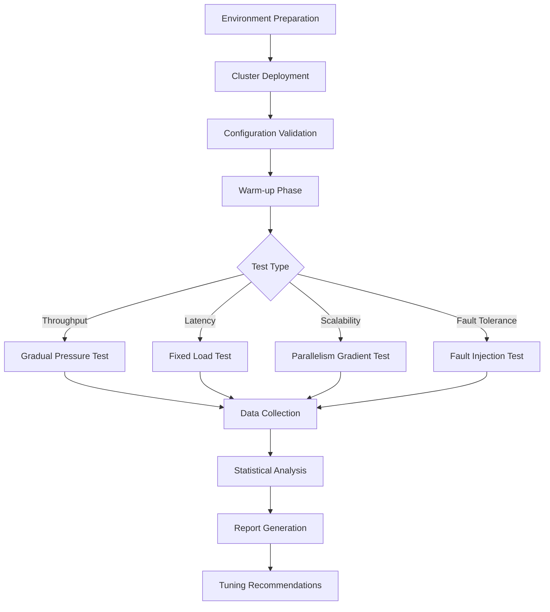
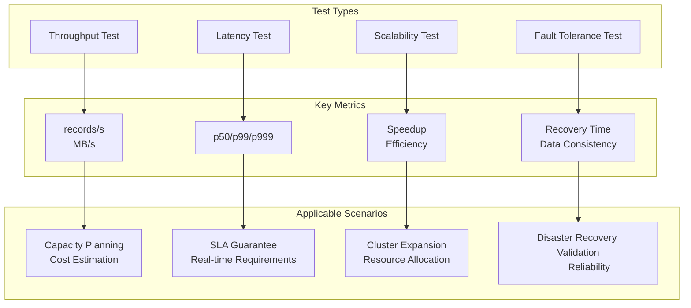
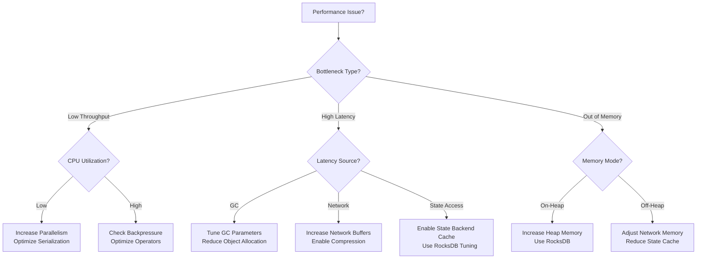

# Flink Performance Benchmarking Complete Guide

> Stage: Flink/ | Prerequisites: [Flink Core Mechanisms](../../02-core/checkpoint-mechanism-deep-dive.md) | Formalization Level: L3

---

## 1. Definitions

### Def-F-11-01: Benchmarking

**Definition**: Benchmarking is a **repeatable**, **comparable** quantitative evaluation process of system performance through standardized workloads and measurement methods.

$$B = \langle W, E, M, R \rangle$$

Where:

- $W$: Workload - Standardized test jobs
- $E$: Execution Environment - Hardware, software, configuration
- $M$: Metrics - Throughput, latency, resource utilization
- $R$: Results - Statistical analysis and visualization reports

### Def-F-11-02: Throughput

**Definition**: The amount of data successfully processed by the system per unit time, typically expressed in **records/second** or **MB/second**.

$$T = \frac{\sum_{i=1}^{n} |D_i|}{t_{end} - t_{start}}$$

### Def-F-11-03: End-to-End Latency

**Definition**: The maximum time span from event generation time to processing completion time, including:

- Queueing Delay
- Processing Delay
- Network Delay

$$L_{e2e} = \max_{e \in E}(t_{out}(e) - t_{in}(e))$$

### Def-F-11-04: Percentile Latency

**Definition**: The value at the corresponding percentile after sorting latency samples, used to describe the latency distribution:

- **p50**: Median latency
- **p99**: Upper bound for 99% of requests
- **p999**: Upper bound for 99.9% of requests

---

## 2. Properties

### Lemma-F-11-01: Throughput-Latency Trade-off

**Lemma**: Under resource constraints, the system exhibits a throughput-latency trade-off curve, expressed as $T \propto \frac{1}{L_{avg}}$.

**Engineering Explanation**:

- High-throughput strategy: Batching, asynchronous execution → Increased buffering latency
- Low-latency strategy: Micro-batching, synchronous execution → Reduced throughput

### Lemma-F-11-02: Scalability Linear Boundary

**Lemma**: Ideally, throughput scales linearly with parallelism: $T(p) = p \cdot T(1)$.

**Practical Constraints**:

- Network bandwidth bottleneck: $\lim_{p \to \infty} T(p) = B_{network}$
- State backend synchronization overhead: $T(p) = p \cdot T(1) - O(p \cdot \log p)$

### Prop-F-11-01: Checkpoint Interval Performance Impact

**Proposition**: The relationship between Checkpoint interval $\Delta t_{cp}$ and throughput is:

$$T(\Delta t_{cp}) = T_0 - \frac{C_{cp}}{\Delta t_{cp}}$$

Where $C_{cp}$ is the cost of a single Checkpoint, and $T_0$ is the baseline throughput without Checkpoints.

---

## 3. Relations

### Benchmarking Ecosystem Mapping

| Test Type | Evaluation Goal | Key Metrics | Applicable Scenario |
|---------|---------|---------|---------|
| Throughput Test | Maximum processing capacity | records/s, MB/s | Capacity planning |
| Latency Test | Response time guarantee | p50, p99, p999 | Real-time applications |
| Scalability Test | Horizontal scaling capability | Speedup, efficiency | Cluster expansion |
| Fault Tolerance Test | Recovery time overhead | Recovery time, data loss | SLA validation |

### Standard Benchmark to Business Scenario Mapping

```
┌─────────────────────┬──────────────────────────────┐
│ Standard Benchmark  │ Business Scenario            │
├─────────────────────┼──────────────────────────────┤
│ WordCount           │ Log analysis, ETL statistics │
│ TPC-H/TPC-DS        │ Real-time reporting, BI queries│
│ Yahoo Streaming     │ Ad clickstream, recommender systems│
│ NEXMark             │ Real-time auction, CEP       │
└─────────────────────┴──────────────────────────────┘
```

---

## 4. Argumentation

### 4.1 Test Environment Preparation

#### Hardware Specifications

**Minimum Recommended Configuration (Development/Testing)**:

| Component | Spec | Notes |
|-----|------|------|
| CPU | 8 cores+ | Modern x86_64 architecture |
| Memory | 32 GB+ | Reserve 50% for Flink |
| Disk | SSD 100 GB+ | Checkpoint storage |
| Network | 1 Gbps | Inter-node communication |

**Production Benchmark Configuration**:

| Component | Spec | Notes |
|-----|------|------|
| CPU | 16-64 cores | High-frequency multi-core processor |
| Memory | 128-512 GB | DDR4/DDR5 ECC |
| Disk | NVMe SSD 500 GB+ | High IOPS |
| Network | 10-25 Gbps | RDMA preferred |

#### Cluster Configuration Recommendations

**Standalone Mode Baseline Configuration**:

```yaml
# flink-conf.yaml
jobmanager.memory.process.size: 4096m
taskmanager.memory.process.size: 16384m
taskmanager.numberOfTaskSlots: 8
parallelism.default: 16

# Checkpoint configuration
execution.checkpointing.interval: 10s
execution.checkpointing.min-pause: 5s
state.backend.incremental: true
```

**Kubernetes Mode Baseline Configuration**:

```yaml
apiVersion: flink.apache.org/v1beta1
kind: FlinkDeployment
spec:
  jobManager:
    resource:
      memory: "4Gi"
      cpu: 2
  taskManager:
    resource:
      memory: "16Gi"
      cpu: 8
    replicas: 4
```

#### Network Configuration Optimization

```properties
# Network buffer optimization
taskmanager.memory.network.fraction: 0.15
taskmanager.memory.network.min: 128mb
taskmanager.memory.network.max: 512mb

# TCP parameters
akka.ask.timeout: 30s
akka.lookup.timeout: 30s
```

### 4.2 Benchmark Types

#### Throughput Test

**Goal**: Measure the maximum sustainable processing capacity of the system.

**Test Method**:

1. Gradually increase data source rate
2. Monitor whether the system experiences backpressure
3. Record the maximum sustainable rate

**Decision Criteria**:

```
IF backpressure_ratio < 5% AND out_rate ≈ in_rate
THEN throughput = current_rate
```

#### Latency Test

**Goal**: Measure the end-to-end processing latency distribution.

**Test Method**:

1. Inject timestamped Watermarks at the source
2. Calculate event time differences at the Sink
3. Collect at least 10^6 samples for statistical analysis

**Metrics**:

- Minimum latency: $\min(L_i)$
- Median latency: $P_{50}(L)$
- Tail latency: $P_{99}(L)$, $P_{999}(L)$

#### Scalability Test

**Goal**: Verify horizontal scaling efficiency.

**Strong Scaling Test (Fixed problem size)**:

- Parallelism increases from $p$ to $kp$
- Expected execution time becomes $1/k$
- Speedup: $S(p) = \frac{T(1)}{T(p)}$

**Weak Scaling Test (Fixed load per node)**:

- Parallelism and data scale increase proportionally
- Expected execution time remains constant

#### Fault Tolerance Test

**Goal**: Measure fault recovery time and data consistency guarantees.

**Test Scenarios**:

1. **TaskManager Failure**: Simulated with kill -9
2. **JobManager Failure**: HA failover time
3. **Network Partition**: Simulated with firewall rules

**Metrics**:

- Detection Time
- Recovery Time
- Data Loss

---

## 5. Proof / Engineering Argument

### 5.3 Standard Test Jobs

#### WordCount Benchmark

**Job Definition**:

```java

// [伪代码片段 - 不可直接运行] 仅展示核心逻辑
import org.apache.flink.streaming.api.datastream.DataStream;

// Standard WordCount implementation
DataStream<String> source = env.addSource(new WordSource())
    .setParallelism(parallelism);

DataStream<Tuple2<String, Integer>> wordCounts = source
    .flatMap(new Tokenizer())
    .keyBy(value -> value.f0)
    .sum(1);

wordCounts.addSink(new DiscardingSink<>());
```

**Characteristics**:

- Compute-intensive: Tokenization + aggregation
- State scale: Vocabulary size
- Typical throughput: 100K-1M records/s

#### TPC-H/TPC-DS Streaming Adaptation

**Adaptation Strategy**:

- Convert tables to streams (CDC or append)
- Rewrite batch queries as window queries
- Use Lookup Join to simulate dimension tables

**Typical Queries**:

| TPC-H Query | Streaming Adaptation | Key Characteristics |
|-----------|---------|---------|
| Q1 | Time-window aggregation | Low state, high compute |
| Q5 | Multi-stream Join | High state, complex Join |
| Q22 | Customer aggregation | Large state, incremental compute |

#### Yahoo Streaming Benchmark

**Workload Characteristics**:

- Events: Ad clickstream (JSON)
- Operations: Filter → Projection → Join → Window Aggregation
- Data scale: 100 events/s - 10M events/s

**Flink Implementation Key Points**:

```java

// [伪代码片段 - 不可直接运行] 仅展示核心逻辑
import org.apache.flink.streaming.api.datastream.DataStream;
import org.apache.flink.streaming.api.windowing.time.Time;

// Ad event processing pipeline
DataStream<Event> events = env.addSource(new KafkaSource<>())
    .filter(event -> event.eventType.equals("view"))
    .map(event -> new CampaignEvent(event))
    .keyBy(CampaignEvent::getCampaignId)
    .window(TumblingEventTimeWindows.of(Time.minutes(1)))
    .aggregate(new CountAggregate());
```

#### NEXMark Benchmark

**Auction Scenario Model**:

- **Person Stream**: User information updates
- **Auction Stream**: Auction creation events
- **Bid Stream**: Bid events

**Query Complexity Grading**:

| Query | Description | State Requirements |
|-----|------|---------|
| Q1-3 | Simple filter/projection | Stateless |
| Q4-6 | Window aggregation | Window state |
| Q7-9 | Multi-stream Join | Large state |
| Q10-12 | Complex pattern matching | Pattern state |

---

## 6. Examples

### 6.4 Test Methodology

#### Warm-up Phase Setup

**Necessity Proof**:

- JVM JIT compilation requires warm-up
- Network buffers need to be filled
- State backend needs to reach steady state

**Recommended Warm-up Strategy**:

```
┌─────────────────────────────────────────────┐
│  Phase      │  Duration  │  Target State   │
├─────────────────────────────────────────────┤
│  JVM Warmup │  2 min     │  C2 compilation complete │
│  State Warmup│  5 min    │  State scale reached     │
│  Steady State│  3 min    │  Metric fluctuation < 5% │
│  Formal Test │  10+ min  │  Data collection         │
└─────────────────────────────────────────────┘
```

#### Data Collection Methods

**JMX Metrics Collection**:

```java
// [伪代码片段 - 不可直接运行] 仅展示核心逻辑
// Expose custom metrics via JMX
MetricGroup metricGroup = getRuntimeContext()
    .getMetricGroup()
    .addGroup("custom");

Counter eventCounter = metricGroup.counter("eventsProcessed");
Histogram latencyHistogram = metricGroup.histogram("eventLatency",
    new DropwizardHistogramWrapper(
        new com.codahale.metrics.Histogram(
            new SlidingWindowReservoir(5000))));
```

**Prometheus Integration**:

```yaml
# Enable Prometheus reporter
metrics.reporters: prometheus
metrics.reporter.prometheus.port: 9249
```

#### Statistical Analysis Methods

**Confidence Interval Calculation**:

Given samples $x_1, x_2, ..., x_n$, the 95% confidence interval:

$$CI = \bar{x} \pm t_{0.025, n-1} \cdot \frac{s}{\sqrt{n}}$$

Where $s$ is the sample standard deviation.

**Outlier Handling**:

- IQR method: Remove data below $Q_1 - 1.5 \cdot IQR$ and above $Q_3 + 1.5 \cdot IQR$

#### Result Visualization

**Throughput Trend Chart**:

```python
# Python visualization example
import matplotlib.pyplot as plt
import pandas as pd

df = pd.read_csv('throughput_metrics.csv')
df['timestamp'] = pd.to_datetime(df['timestamp'])

plt.figure(figsize=(12, 6))
plt.plot(df['timestamp'], df['throughput_rps'], label='Throughput (r/s)')
plt.axhline(y=df['throughput_rps'].mean(), color='r',
            linestyle='--', label=f'Mean: {df["throughput_rps"].mean():.0f}')
plt.fill_between(df['timestamp'],
                 df['throughput_rps'].mean() - df['throughput_rps'].std(),
                 df['throughput_rps'].mean() + df['throughput_rps'].std(),
                 alpha=0.2, color='r')
plt.xlabel('Time')
plt.ylabel('Throughput (records/s)')
plt.title('Flink Throughput Benchmark')
plt.legend()
plt.grid(True, alpha=0.3)
```

---

## 7. Visualizations

### Overall Benchmarking Process



### Test Type Comparison Matrix



### Performance Tuning Decision Tree



### Benchmark Timeline

```mermaid
gantt
    title Flink Performance Benchmark Execution Timeline
    dateFormat  HH:mm
    axisFormat %H:%M

    section Preparation
    Environment Check    :a1, 00:00, 15m
    Cluster Startup      :a2, after a1, 10m
    Config Validation    :a3, after a2, 5m

    section Warm-up
    JVM Warmup          :b1, after a3, 10m
    State Warmup        :b2, after b1, 15m
    Steady State Check  :b3, after b2, 10m

    section Testing
    Throughput Test     :c1, after b3, 30m
    Latency Test        :c2, after c1, 20m
    Scalability Test    :c3, after c2, 40m
    Fault Tolerance Test:c4, after c3, 20m

    section Wrap-up
    Data Collection     :d1, after c4, 10m
    Cluster Cleanup     :d2, after d1, 5m
```



---

## 8. Performance Tuning Reference

### 8.5 Throughput Optimization Parameters

| Parameter | Recommended Value | Notes |
|-----|--------|------|
| `parallelism.default` | CPU cores × 2 | Fully utilize CPU |
| `taskmanager.numberOfTaskSlots` | Equal to CPU cores | Avoid hyper-threading contention |
| `execution.buffer-timeout` | 0-50ms | Balance latency and throughput |
| `pipeline.object-reuse` | true | Reduce object allocation |
| `state.backend.incremental` | true | Reduce Checkpoint time |

### 8.6 Latency Optimization Parameters

| Parameter | Recommended Value | Notes |
|-----|--------|------|
| `execution.buffer-timeout` | 0 | Send data immediately |
| `pipeline.async-snapshot` | true | Async snapshot |
| `state.backend.rocksdb.predefined-options` | FLASH_SSD_OPTIMIZED | SSD optimized |
| `table.exec.mini-batch.enabled` | false | Disable mini-batch |
| `table.exec.mini-batch.allow-latency` | 0 | Zero latency processing |

### 8.7 Memory Optimization Parameters

| Parameter | Recommended Value | Notes |
|-----|--------|------|
| `taskmanager.memory.process.size` | Total memory - system reserve | Container total memory |
| `taskmanager.memory.managed.fraction` | 0.4 | Managed memory fraction |
| `taskmanager.memory.network.fraction` | 0.15 | Network memory fraction |
| `state.backend.rocksdb.memory.managed` | true | RocksDB uses managed memory |
| `state.backend.rocksdb.memory.fixed-per-slot` | 256mb | Fixed memory per slot |

---

## 9. Common Performance Problem Diagnosis

### 9.8 Data Skew Detection

**Detection Metrics**:

```
# Observe via Web UI
- Are records received/sent balanced across subtasks?
- Is backpressure consistent across subtasks?
```

**Diagnostic Command**:

```bash
# Use Flink SQL to analyze data distribution
SELECT key, COUNT(*) as cnt
FROM source_table
GROUP BY key
ORDER BY cnt DESC LIMIT 20;
```

**Solutions**:

1. **Two-Phase Aggregation**:

```java
// [伪代码片段 - 不可直接运行] 仅展示核心逻辑
// Local aggregation first, then global aggregation
stream.keyBy(key)
    .window(...)  // Phase 1
    .aggregate(localAgg)
    .keyBy(key)
    .window(...)  // Phase 2
    .aggregate(globalAgg);
```

1. **Random Prefix**:

```java
// [伪代码片段 - 不可直接运行] 仅展示核心逻辑
// Add random prefix for hot keys
stream.map(event -> {
    if (isHotKey(event.getKey())) {
        event.setKey(event.getKey() + "_" + random.nextInt(100));
    }
    return event;
});
```

### 9.9 Backpressure Identification

**Identification Method**:


In Flink Web UI:

- **OK**: Green - Normal
- **LOW**: Blue - Mild backpressure
- **HIGH**: Red - Severe backpressure

**Root Cause Analysis**:

| Symptom | Possible Cause | Solution |
|-----|---------|---------|
| Only Sink backpressure | Slow downstream consumption | Increase Sink parallelism, batch writes |
| Window backpressure | Window state too large | Reduce window size, incremental aggregation |
| Join backpressure | Large table join | Use Interval Join, Lookup Join |
| Full pipeline backpressure | Insufficient resources | Scale cluster, optimize operators |

### 9.10 GC Optimization

**GC Log Analysis**:

```bash
# Enable GC logs
-XX:+PrintGCDetails
-XX:+PrintGCDateStamps
-XX:+PrintGCTimeStamps
-Xloggc:gc.log
```

**G1 GC Tuning Parameters**:

```bash
# Recommended configuration
-XX:+UseG1GC
-XX:MaxGCPauseMillis=100
-XX:G1HeapRegionSize=16m
-XX:InitiatingHeapOccupancyPercent=35
```

**GC Problem Diagnosis Matrix**:

| GC Behavior | Cause | Tuning Direction |
|--------|------|---------|
| Frequent Young GC | Excessive object creation | Object reuse, reduce temporary objects |
| Frequent Full GC | Old generation insufficient | Increase heap memory, check for memory leaks |
| Long GC time | Large heap/fragmentation | Adjust G1 region size, reduce heap |
| OOM | Insufficient memory/leak | Increase memory, check RocksDB config |

### 9.11 Network Bottleneck

**Diagnostic Metrics**:

- `numRecordsInPerSecond` vs `numRecordsOutPerSecond`
- `outputQueueLength` - Output buffer queue length
- `backPressuredTimeMsPerSecond` - Backpressure time ratio

**Optimization Strategy**:

```yaml
# flink-conf.yaml network optimization
# Increase network buffers
taskmanager.memory.network.fraction: 0.2
taskmanager.memory.network.min: 256mb

# Enable network compression
taskmanager.network.memory.buffer-debloat.enabled: true
taskmanager.network.memory.buffer-debloat.target: 1000
```

**Network Topology Optimization**:

```
┌─────────────────────────────────────────┐
│           JobManager                    │
│    (Coordination, no data processing)   │
└─────────────────────────────────────────┘
                    │
    ┌───────────────┼───────────────┐
    ▼               ▼               ▼
┌───────┐      ┌───────┐      ┌───────┐
│ TM-1  │◄────►│ TM-2  │◄────►│ TM-3  │
│ (Slots│      │ (Slots│      │ (Slots│
│  0-3) │      │  4-7) │      │  8-11)│
└───────┘      └───────┘      └───────┘
    ▲               ▲               ▲
    └───────────────┴───────────────┘
           High-speed Network
           (10Gbps+)
```

---

## 10. Best Practices Checklist

### Pre-Test Checklist

- [ ] Hardware configuration matches target test specifications
- [ ] OS parameters optimized (ulimit, swap, THP)
- [ ] JVM parameters tuned (GC, heap memory)
- [ ] Flink configuration validated (parallelism, network parameters)
- [ ] Monitoring and logging systems ready

### During-Test Checklist

- [ ] Warm-up phase completed and metrics stable
- [ ] Data collection covers complete test cycle
- [ ] Resource utilization monitoring normal (CPU, memory, network)
- [ ] Checkpoint success rate and duration normal
- [ ] No abnormal errors or warning logs

### Post-Test Checklist

- [ ] Data exported and backed up
- [ ] Statistical results validated through confidence intervals
- [ ] Bottleneck analysis completed
- [ ] Tuning recommendations recorded
- [ ] Test report generated

---

## 11. References

---

*Document Version: v1.0 | Created: 2026-04-04 | Formalization Level: L3*
