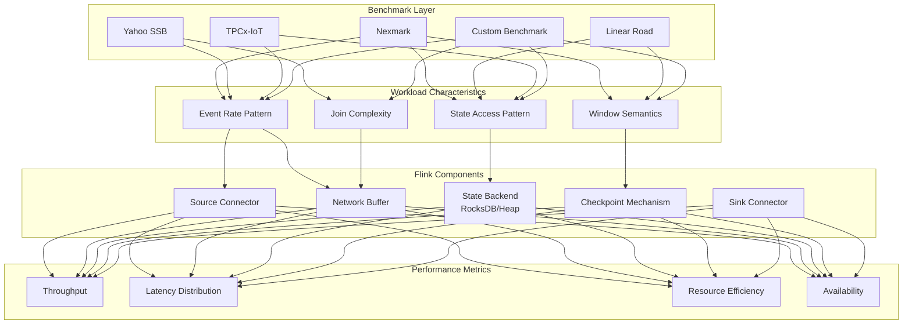
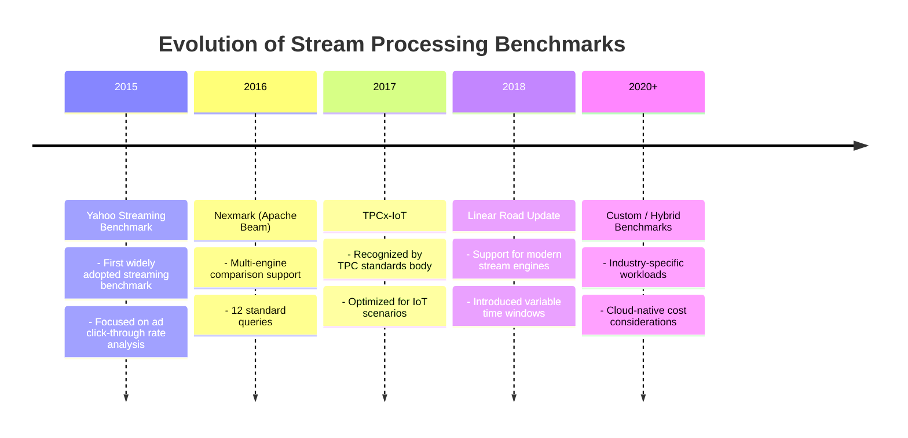
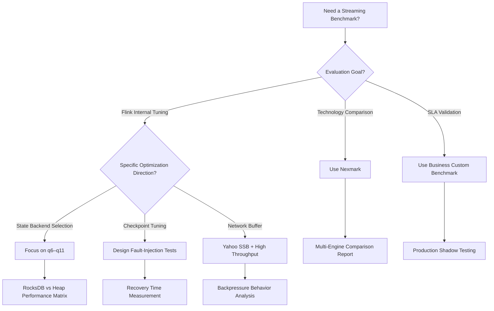
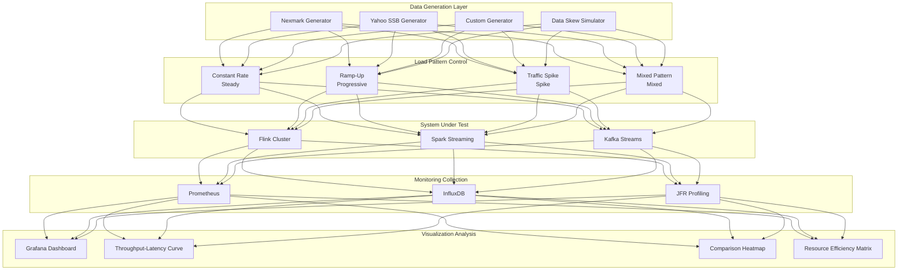
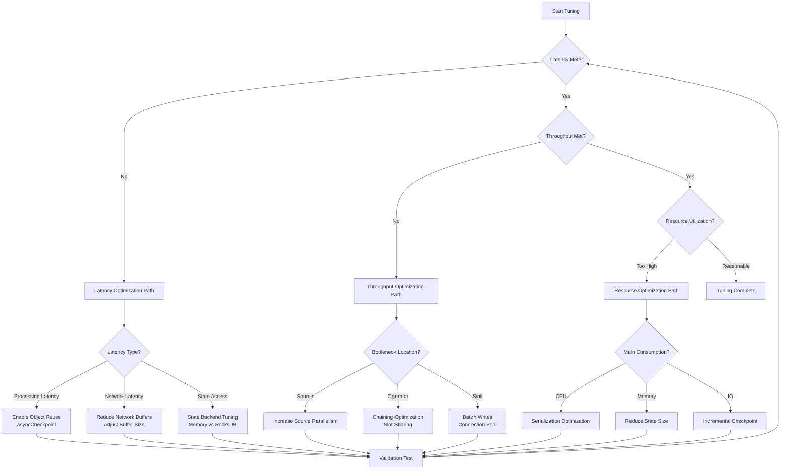
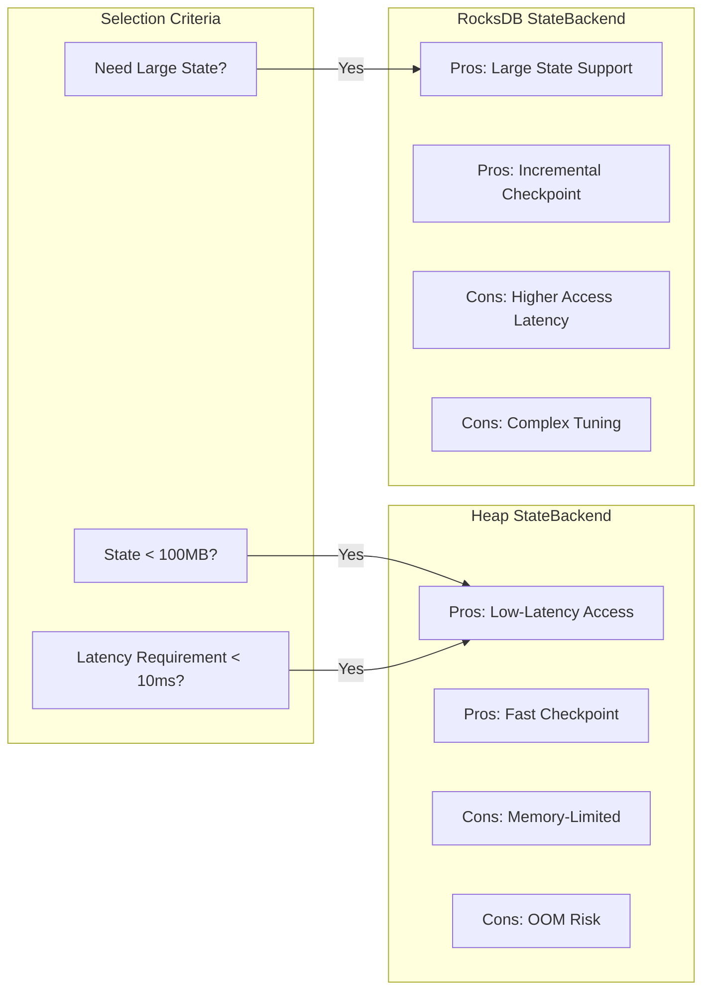

# Streaming Benchmark System - Performance Evaluation Methodology

> **Stage**: Flink/ | **Prerequisites**: [Flink Core Mechanisms](../../../Struct/00-INDEX.md) | **Formalization Level**: L3

## 1. Definitions

### Def-F-11-01: Streaming Benchmark

**Formal Definition**: A streaming benchmark is a quintuple $B = \langle W, D, G, M, T \rangle$, where:

- $W$: Set of workloads, containing one or more query / job definitions
- $D$: Data schema definition, including event types, fields, and timestamp semantics
- $G$: Data generator, capable of producing event streams at a specified rate
- $M$: Set of measurement metrics used to quantify system performance
- $T$: Test protocol defining the standardized execution procedure

**Intuitive Explanation**: A benchmark is a **standardized experimental framework** for evaluating stream-processing system performance. By controlling inputs, measuring outputs, and comparing baselines, it provides quantitative grounds for technology selection and tuning.

### Def-F-11-02: Throughput vs Latency Trade-off

**Formal Definition**: For a given stream-processing system $S$ and workload $W$, define:

- **Throughput** $\Theta(S, W) = \lim_{t \to \infty} \frac{N(t)}{t}$, where $N(t)$ is the total number of events processed within time $t$
- **Latency** $\Lambda(S, W, p)$: The $p$-th percentile event-processing latency, i.e., the interval from event generation to result emission

**Trade-off Relationship**: There exists a function $f$ such that $\Lambda_{p99} = f(\Theta)$, and $f$ is typically monotonically increasing. The **effective operating region** of a system is defined as:

$$\text{Eff}(S, W) = \{ (\Theta, \Lambda) \mid \Lambda_{p99} \leq \Lambda_{\text{SLA}} \}$$

Where $\Lambda_{\text{SLA}}$ is the maximum acceptable latency specified by the service-level agreement.

**Intuitive Explanation**: As a system approaches its maximum processing capacity, internal buffering queues grow, causing latency to rise. Understanding and quantifying this trade-off is central to performance tuning.

### Def-F-11-03: Reference Workload

**Formal Definition**: A reference workload is a triple $\langle Q, R, C \rangle$:

- $Q$: Set of queries / operators representing typical data-processing patterns
- $R$: Data arrival rate function $r(t)$, describing how the event arrival pattern varies over time
- $C$: Computational complexity metric, usually expressed as CPU cycles per event or operations per event

**Classification Dimensions**:

| Dimension | Type | Description |
|-----------|------|-------------|
| State Access | Stateless / Stateful | Whether historical data is required |
| Window Type | Tumble / Slide / Session | Time-window semantics |
| Join Operation | Stream-Stream / Stream-Dim | Data-source combination mode |
| Complexity | O(1) / O(log n) / O(n) | Per-event processing complexity |

---

## 2. Properties

### Prop-F-11-01: Benchmark Reproducibility Conditions

**Proposition**: Sufficient conditions for benchmark-result reproducibility are controlling the following variables:

1. **Hardware Environment**: Fixed CPU, memory, network, and storage specifications
2. **Software Version**: Stream-processing engine version, JVM version, OS version
3. **Data Generation**: Use a deterministic pseudo-random seed
4. **Test Duration**: Warm-up + stable measurement period + observation window of at least 30 minutes

**Engineering Corollary**: Production-environment benchmarks must be executed on isolated dedicated clusters; shared environments introduce uncontrollable noise.

### Prop-F-11-02: Metric Monotonicity Constraints

**Proposition**: For a stream-processing system with fixed configuration and sufficient resources:

- Throughput $\Theta$ is monotonically non-decreasing with parallelism $P$ (ideally linearly scalable)
- Latency $\Lambda_{p99}$ is monotonically non-decreasing with data-skew degree $S$
- Resource utilization $U$ is monotonically increasing with input rate $\lambda$ until saturation

**Saturation Point**: When $\frac{d\Theta}{d\lambda} < \epsilon$ (threshold), the system enters saturation, at which point latency begins to grow exponentially.

### Prop-F-11-03: Fault-Recovery Time Bound

**Proposition**: For a system with Checkpoint enabled, the fault-recovery time $T_{rec}$ satisfies:

$$T_{rec} \leq T_{detect} + T_{restart} + T_{restore}$$

Where:

- $T_{detect}$: Fault-detection time (usually determined by heartbeat timeout, default 10 seconds)
- $T_{restart}$: Task rescheduling time (depends on the resource manager)
- $T_{restore}$: State-recovery time = $\frac{\text{StateSize}}{\text{ReadThroughput}}$

---

## 3. Relations

### 3.1 Mapping Between Benchmark and Flink Architecture



### 3.2 Mainstream Benchmark Comparison Matrix

| Benchmark | Scenario Type | Query Count | State Scale | Time Sensitivity | Industry Adoption |
|-----------|---------------|-------------|-------------|------------------|-------------------|
| Nexmark | Auction Bidding | 12 | Medium | High | ★★★★★ |
| Yahoo SSB | Ad Analytics | 1 | Small | Medium | ★★★★☆ |
| Linear Road | Traffic Monitoring | Many variants | Large | Extremely High | ★★★☆☆ |
| TPCx-IoT | IoT Sensors | 12+ | Large | High | ★★★☆☆ |
| Custom | Business-specific | On demand | Variable | On demand | ★★★★☆ |

### 3.3 Benchmark Evolution Relationship



---

## 4. Argumentation

### 4.1 Design Rationale of Nexmark's 12 Queries

Nexmark's design follows the **progressive complexity** principle, covering typical stream-processing patterns from simple to complex:

| Query ID | Core Pattern | Test Objective |
|----------|--------------|----------------|
| q0–q2 | Filter, projection, simple aggregation | Basic throughput capability |
| q3–q5 | Stream–Dimension Join | State access efficiency |
| q6–q8 | Stream–Stream Join | Window-management performance |
| q9–q11 | Complex pattern matching | Advanced state operations |
| q12 | Custom window | Extensibility verification |

**Design Insight**: Query q8 (monitor new users) is the **golden test case** for Flink tuning because it simultaneously tests:

- State-backend random-read performance
- Timer-management efficiency
- Resource contention between Checkpoint and normal processing

### 4.2 Benchmark Selection Decision Tree



### 4.3 Impact of Data Skew on Benchmarks

**Problem**: Standard benchmarks usually assume uniform distribution, yet data skew is pervasive in production.

**Argument**:

1. Under uniform distribution, Flink's parallel scaling is nearly linear
2. After introducing Zipf distribution (skew coefficient 1.5), the following are observed:
   - p99 latency increases 3–5×
   - **Local key aggregation** optimization must be enabled
   - LSM-tree compaction pressure on the RocksDB state backend increases

**Conclusion**: An effective benchmark must include a skewed-data generator.

---

## 5. Formal Proof / Engineering Argument

### 5.1 Engineering Measurement Method for Throughput–Latency Curve

**Measurement Protocol**:

1. **System Warm-up** (5–10 minutes): Let the JVM reach a steady state and let code hot spots be compiled
2. **Progressive Load** (Ramp-up): Start from a low input rate and gradually increase
3. **Steady-State Sampling** (≥30 minutes): Maintain each rate point long enough to collect statistically significant latency samples
4. **Saturation Identification**: Determine the maximum sustainable throughput when latency begins to rise sharply

**Mathematical Expression**:

$$\Theta_{max} = \max \{ \lambda \mid \Lambda_{p99}(\lambda) \leq \Lambda_{target} \}$$

### 5.2 Flink Checkpoint Performance Bound Argument

**Objective**: Prove the relationship between Checkpoint interval $T_c$ and processing latency.

**Model Assumptions**:

- State size: $S$ bytes
- State mutation rate: $r$ bytes/second
- Checkpoint write throughput: $w$ bytes/second
- Incremental Checkpoint threshold: $\delta$

**Argument**:

Full Checkpoint time: $T_{full} = \frac{S}{w}$

Incremental Checkpoint time: $T_{inc} = \frac{r \cdot T_c}{w}$

To ensure Checkpoint success (completing before the next Checkpoint):

$$T_c > T_{inc} \Rightarrow T_c > \frac{r \cdot T_c}{w} \Rightarrow w > r$$

**Engineering Corollary**:

- The state mutation rate $r$ must be less than the storage write throughput $w$
- For RocksDB, $w$ is limited by disk IOPS and compaction policy
- It is recommended that $T_c \geq 3 \times T_{inc}^{expected}$ to leave margin

### 5.3 Resource Utilization and Cost Efficiency Argument

**Definition**: Cost per million events ($C_{pm}$) is a key business metric.

$$C_{pm} = \frac{\text{Hourly infrastructure cost} \times 1000}{\Theta \times 3600}$$

**Optimization Strategy Comparison**:

| Strategy | Throughput Impact | Latency Impact | Cost Impact |
|----------|-------------------|----------------|-------------|
| Increase Parallelism | + | = | + |
| Optimize Serialization | ++ | = | = |
| RocksDB Tuning | + | – | = |
| Async Checkpoint | = | + | = |

**Conclusion**: The optimal path for cost optimization is to first reduce serialization overhead, and only then scale horizontally.

---

## 6. Examples

### 6.1 Nexmark Flink Implementation Configuration

```java

import org.apache.flink.streaming.api.environment.StreamExecutionEnvironment;

// Nexmark q8: Monitor New Users
// Tests state backend and timer performance

StreamExecutionEnvironment env =
    StreamExecutionEnvironment.getExecutionEnvironment();

env.setStateBackend(new EmbeddedRocksDBStateBackend(true));
env.enableCheckpointing(60000); // 1-minute interval
env.getCheckpointConfig().setCheckpointTimeout(300000);
env.getCheckpointConfig().setMinPauseBetweenCheckpoints(30000);

// Data generator configuration
NexmarkConfiguration config = new NexmarkConfiguration();
config.numEventGenerators = 4;
config.numEvents = 0; // infinite stream
config.rateShape = RateShape.SINE; // sinusoidal load pattern
config.firstEventRate = 10000; // 10K events/sec
config.nextEventRate = 100000; // peak 100K
```

### 6.2 Custom IoT Workload Generator

```java
/**
 * Simulates sensor data stream, supports data skew
 */
public class SensorDataGenerator implements SourceFunction<SensorEvent> {

    private final long eventsPerSecond;
    private final double skewFactor; // Zipf distribution parameter
    private final int sensorCount;

    @Override
    public void run(SourceContext<SensorEvent> ctx) {
        Random random = new Random(42); // deterministic seed
        ZipfDistribution zipf = new ZipfDistribution(sensorCount, skewFactor);

        long nextEventTime = System.currentTimeMillis();
        long intervalMs = 1000 / eventsPerSecond;

        while (running) {
            int sensorId = zipf.sample(); // skewed sensor ID distribution
            SensorEvent event = new SensorEvent(
                sensorId,
                nextEventTime,
                generateMetrics(random)
            );

            ctx.collectWithTimestamp(event, nextEventTime);

            nextEventTime += intervalMs;
            long waitTime = nextEventTime - System.currentTimeMillis();
            if (waitTime > 0) {
                Thread.sleep(waitTime);
            }
        }
    }
}
```

### 6.3 Prometheus + Grafana Monitoring Configuration

```yaml
# prometheus.yml scrape configuration
scrape_configs:
  - job_name: 'flink-jobmanager'
    static_configs:
      - targets: ['jobmanager:9249']
    metrics_path: /metrics

  - job_name: 'flink-taskmanager'
    static_configs:
      - targets: ['taskmanager:9249']
    metrics_path: /metrics
```

# Key Grafana Queries

```promql
# Throughput
rate(flink_taskmanager_job_task_numRecordsIn[1m])

# Latency (Operator-level)
histogram_quantile(0.99,
  rate(flink_taskmanager_job_latency_histogram_latency[5m])
)

# Checkpoint duration
flink_jobmanager_job_checkpoint_duration_time
```

### 6.4 Performance Test Report Template

```markdown
## Flink v1.18 Nexmark q8 Performance Test Report

### Test Environment
- CPU: 16 vCPU (8 cores × 2 hyper-threads)
- Memory: 64 GB
- Disk: NVMe SSD (5,000 MB/s sequential read)
- Flink Config: 8 TaskManagers × 2 slots

### Test Results
| Metric | Value | Note |
|--------|-------|------|
| Max Throughput | 85K events/sec | p99 latency < 1s |
| p50 Latency | 45 ms | Steady state |
| p99 Latency | 320 ms | Includes GC impact |
| Checkpoint Duration | 15–25 s | Incremental, 2 GB state |
| CPU Utilization | 75% | Average |

### Bottleneck Analysis
1. RocksDB compaction triggers during high-write periods, causing latency spikes
2. Recommendation: Adjust `state.backend.rocksdb.threads.threads-number` from 4 to 8
```

---

## 7. Visualizations

### 7.1 Complete Streaming Benchmark Architecture



### 7.2 Throughput–Latency Trade-off Curve

```mermaid
xychart-beta
    title "Throughput-Latency Trade-off Curve (Nexmark q8)"
    x-axis ["20K", "40K", "60K", "80K", "100K", "120K"]
    y-axis "p99 Latency (ms)" 0 --> 5000
    line [45, 65, 120, 280, 1200, 4500]

    annotation 3.5, 280 "Recommended Operating Point"
    annotation 5, 4500 "Saturation Region"
```

### 7.3 Flink Tuning Decision Tree



### 7.4 State Backend Performance Comparison Matrix



---

## 8. References
