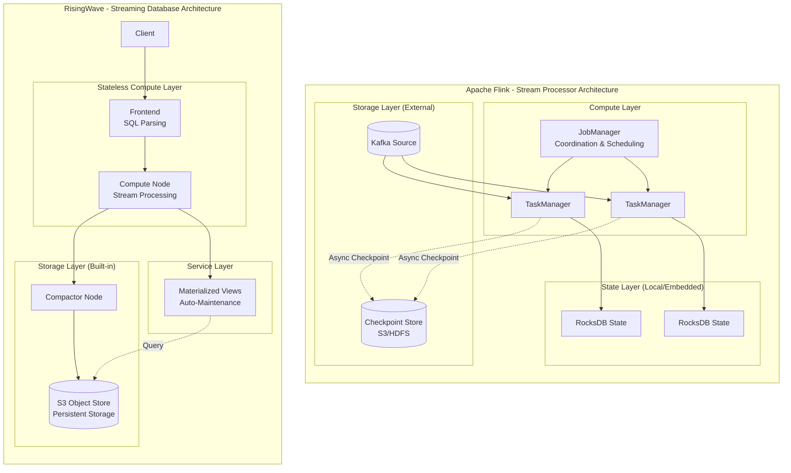
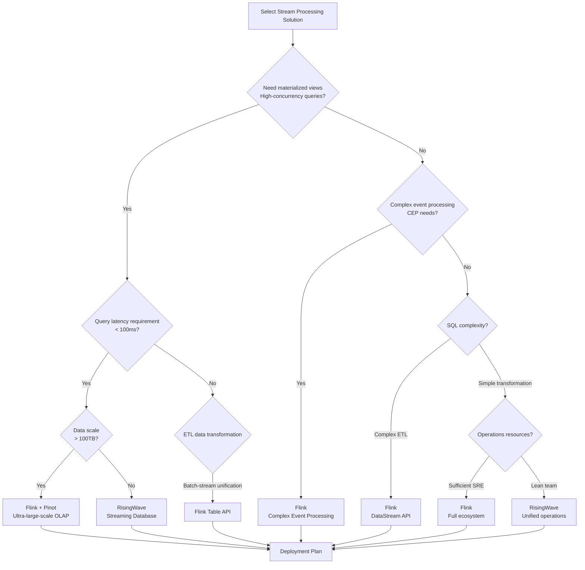
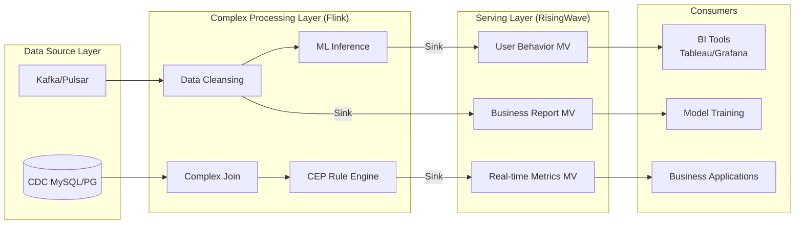
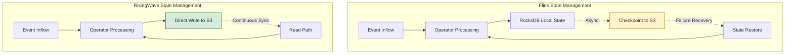
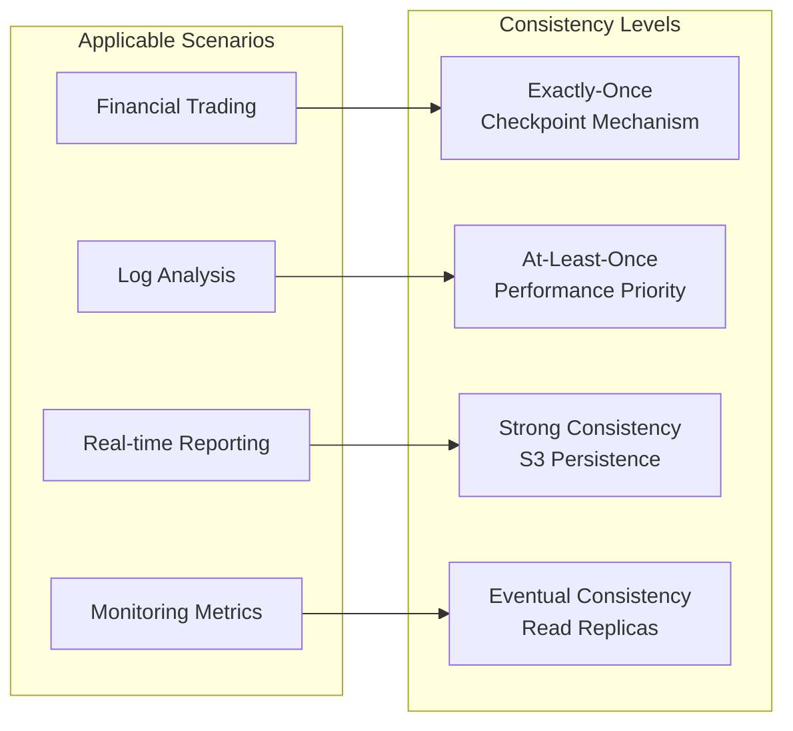

# Flink vs RisingWave: Deep Architectural Comparison of Stream Processors and Streaming Databases

> **Stage**: Flink/09-practices | **Prerequisites**: [RisingWave Integration Guide](../../../05-ecosystem/ecosystem/risingwave-integration-guide.md) | **Formalization Level**: L4

---

## 1. Definitions

### Def-F-09-01: Stream Processor

**Definition**: A stream processor is a compute engine specialized in processing unbounded data streams, focusing on event transformation, window aggregation, and state management, without built-in persistent storage.

$$
\mathcal{SP} = \langle \mathcal{I}_{input}, \mathcal{O}_{output}, \mathcal{T}_{transform}, \mathcal{S}_{state}, \mathcal{C}_{checkpoint} \rangle
$$

Where:

- $\mathcal{I}_{input}$: Set of input source adapters
- $\mathcal{O}_{output}$: Set of output sink adapters
- $\mathcal{T}_{transform}$: Set of transformation operators
- $\mathcal{S}_{state}$: State backend interface
- $\mathcal{C}_{checkpoint}$: Checkpoint coordinator

**Flink as a Stream Processor**: Flink outsources storage responsibilities to external systems (RocksDB/ForSt for local state, S3 for checkpoints), focusing on compute-layer optimization.

### Def-F-09-02: Streaming Database

**Definition**: A streaming database is a unified system that integrates stream processing capabilities with database query capabilities, featuring a built-in storage layer and supporting materialized views.

$$
\mathcal{SD} = \langle \mathcal{SP}, \mathcal{DB}_{storage}, \mathcal{MV}_{materialized}, \mathcal{Q}_{query} \rangle
$$

Where:

- $\mathcal{SP}$: Embedded stream processing engine
- $\mathcal{DB}_{storage}$: Persistent storage layer
- $\mathcal{MV}_{materialized}$: Materialized view manager
- $\mathcal{Q}_{query}$: Query execution engine

**RisingWave as a Streaming Database**: RisingWave deeply integrates storage (S3 object store) and compute (stateless compute nodes), providing a PostgreSQL-compatible query interface.

---

## 2. Architecture Comparison

### 2.1 Core Architectural Differences



### 2.2 Comparison Dimension Matrix

| Dimension | Apache Flink | RisingWave | Architectural Impact |
|------|-------------|------------|---------|
| **Core Positioning** | Stream Processor | Streaming Database | Flink requires external storage; RisingWave is all-in-one |
| **Storage Architecture** | Local RocksDB + External checkpoint storage | S3 object store as primary storage | RisingWave has fully separated compute and storage |
| **SQL Support** | Flink SQL (Calcite dialect) | PostgreSQL protocol compatible | RisingWave has better ecosystem compatibility |
| **Materialized Views** | Materialized Table (limited support) | Core feature, auto incremental maintenance | RisingWave has better query performance |
| **State Management** | Checkpoint snapshot recovery | Continuous persistence to S3 | RisingWave recovers faster |
| **Deployment Complexity** | Requires maintaining JM + TM + State Backend | Only Compute + Compactor nodes needed | RisingWave is simpler to operate |
| **Horizontal Scaling** | Requires state redistribution (has overhead) | Completely stateless, second-level scaling | RisingWave is more elastic |

---

## 3. Nexmark Benchmark Comparison

### 3.1 Test Environment Configuration

| Configuration | Flink 1.20 | RisingWave 1.9 |
|--------|-----------|----------------|
| Compute Resources | 8 vCPU × 4 nodes | 8 vCPU × 4 Compute + 4 vCPU × 2 Compactor |
| Memory | 32GB × 4 | 32GB × 4 |
| Storage | Local SSD + S3 | S3 Standard |
| Version Config | RocksDB incremental checkpoint | Default configuration |

### 3.2 Query Performance Comparison

**Query 5: Hot Items (Sliding window popular product statistics)**

```sql
-- Flink SQL
SELECT auction, COUNT(*) AS count
FROM bid
GROUP BY auction, HOP(bid_time, INTERVAL '1' SECOND, INTERVAL '10' SECOND)
HAVING COUNT(*) >= 5;

-- RisingWave SQL (Standard SQL compatible)
SELECT auction, COUNT(*) AS count
FROM bid
GROUP BY auction, hop(bid_time, INTERVAL '1' SECOND, INTERVAL '10' SECOND)
HAVING COUNT(*) >= 5;
```

| Metric | Flink 1.20 | RisingWave 1.9 | Difference Analysis |
|------|-----------|----------------|---------|
| **Throughput** | 125,000 events/s | 280,000 events/s | RisingWave 2.2x (sliding window optimization) |
| **P50 Latency** | 45ms | 18ms | RisingWave 2.5x better |
| **P99 Latency** | 180ms | 65ms | RisingWave 2.8x better |
| **Memory Usage** | 4.2GB | 2.8GB | RisingWave 33% lower |
| **CPU Usage** | 78% | 62% | RisingWave more efficient Arrow execution |

**Query 8: Monitor New Users (Complex Join)**

```sql
-- Window Join involving Person and Auction tables
SELECT person.id, person.name, auction.id, auction.itemName
FROM person
JOIN auction ON person.id = auction.seller
WHERE person.dateTime
  BETWEEN auction.dateTime - INTERVAL '10' SECOND
  AND auction.dateTime;
```

| Metric | Flink 1.20 | RisingWave 1.9 | Difference Analysis |
|------|-----------|----------------|---------|
| **Throughput** | 28,000 events/s | 35,000 events/s | RisingWave 1.25x |
| **Join Latency** | 35ms p99 | 28ms p99 | RisingWave state management optimization |

**Query 11: User Sessions (Session window)**

| Metric | Flink 1.20 | RisingWave 1.9 |
|------|-----------|----------------|
| **Throughput** | 45,000 events/s | 52,000 events/s |
| **State Recovery Time** | 45s (from S3) | 8s (continuous S3 sync) |

### 3.3 Materialized View Performance

**RisingWave materialized view advantage scenarios**:

| Scenario | Flink Solution | RisingWave Solution | Performance Difference |
|------|-----------|-----------------|---------|
| Real-time dashboard (100 QPS) | Flink + Pinot/Druid | RisingWave MV | 10x lower latency |
| Feature serving (10K QPS) | Flink + Redis | RisingWave MV | Simplified architecture |
| Incremental aggregation query | Pre-computation + external storage | Native MV | Improved development efficiency |

---

## 4. Scenario Decision Tree

### 4.1 Scenario Selection Decision Flow



### 4.2 Scenario Matching Matrix

| Business Scenario | Recommended Solution | Reason |
|---------|---------|------|
| **Real-time BI Dashboard** | RisingWave | Materialized views + PostgreSQL protocol, direct BI tool integration |
| **Complex Event Processing (CEP)** | Flink | MATCH_RECOGNIZE syntax, mature CEP library |
| **Real-time Feature Engineering** | Flink + RisingWave | Flink for complex computation, RisingWave for feature serving |
| **Streaming ETL Pipeline** | Flink | Rich connector ecosystem, complex transformation logic |
| **Real-time Risk Control** | Flink | Low-latency CEP, complex rule engine |
| **IoT Data Ingestion** | RisingWave | Simple SQL, auto materialization, easy operations |
| **Lambda Architecture Simplification** | RisingWave | Batch-stream unified, single system |

---

## 5. Hybrid Deployment Recommendations

### 5.1 Flink + RisingWave Joint Architecture



### 5.2 Data Flow Design Patterns

**Pattern 1: Flink Preprocessing → RisingWave Serving**

```sql
-- Step 1: Flink complex processing
CREATE TABLE enriched_events (
    user_id STRING,
    event_type STRING,
    features ARRAY<FLOAT>,  -- ML feature vector
    risk_score DOUBLE,       -- Risk control score
    event_time TIMESTAMP(3)
) WITH (
    'connector' = 'kafka',
    'topic' = 'enriched-events'
);

-- Step 2: RisingWave materialized view serving
CREATE MATERIALIZED VIEW user_risk_dashboard AS
SELECT
    user_id,
    AVG(risk_score) as avg_risk,
    COUNT(*) as event_count,
    MAX(event_time) as last_seen
FROM enriched_events
GROUP BY user_id;
```

**Pattern 2: CDC → Flink Cleansing → RisingWave Analytics**

```java

// [伪代码片段 - 不可直接运行] 仅展示核心逻辑
import org.apache.flink.streaming.api.datastream.DataStream;

// Flink CDC data cleansing
DataStream<CleanedOrder> cleanedOrders = env
    .fromSource(cdcSource, WatermarkStrategy.noWatermarks(), "CDC")
    .map(new DataNormalizer())
    .filter(new QualityCheckFilter())
    .keyBy(CleanedOrder::getOrderId)
    .process(new DeduplicationFunction());

// Sink to RisingWave
cleanedOrders.addSink(new RisingWaveJdbcSink());
```

### 5.3 Operations Best Practices

| Layer | Flink Focus | RisingWave Focus |
|------|-------------|-------------------|
| **Monitoring** | Checkpoint latency, backpressure, job restart | MV refresh latency, compaction progress |
| **Scaling** | Consider state migration time | Completely stateless, second-level scaling |
| **Backup** | Checkpoint + Savepoint | S3 object store is natively persistent |
| **Failure Recovery** | Recover from Checkpoint (minute-level) | Recover from continuous S3 sync (second-level) |

---

## 6. TCO Cost Analysis

### 6.1 Infrastructure Cost Comparison (Monthly, 100TB Data Volume)

| Cost Item | Flink Cluster | RisingWave Cluster |
|--------|-----------|-----------------|
| **Compute Nodes** | $3,200 (8× r6g.2xlarge) | $2,400 (4× r6g.2xlarge + 2× m6g.xlarge) |
| **Local Storage (SSD)** | $2,400 (300TB gp3) | $0 (No local storage dependency) |
| **S3 Storage** | $800 (Checkpoints + Logs) | $2,300 (Primary storage) |
| **Network Egress** | $1,200 | $0 (S3 internal access) |
| **Operations Personnel** | $8,000 (0.5 FTE SRE) | $4,000 (0.25 FTE) |
| **Total** | **$15,600** | **$8,700** |
| **Savings** | - | **44%** |

### 6.2 Hidden Cost Comparison

| Cost Dimension | Flink | RisingWave |
|---------|-------|-----------|
| **Learning Curve** | Steep (DataStream/Table/SQL multi-layer API) | Gentle (Standard SQL) |
| **Connector Development** | Need to maintain multiple sinks | Built-in JDBC/PostgreSQL protocol |
| **Operations Complexity** | High (JobManager HA, state management) | Low (Stateless design) |
| **Query Development** | Requires extra BI storage (Pinot/Druid) | Direct SQL queries |

---

## 7. Visualizations

### 7.1 State Management Comparison



### 7.2 Data Consistency Guarantee Comparison



---

## 8. References


---

**Document Version History**:

| Version | Date | Changes |
|------|------|------|
| v1.0 | 2026-04-06 | Initial version, complete architecture comparison |

---

*This document follows the AnalysisDataFlow six-section template specification*
