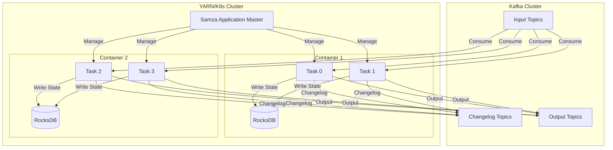
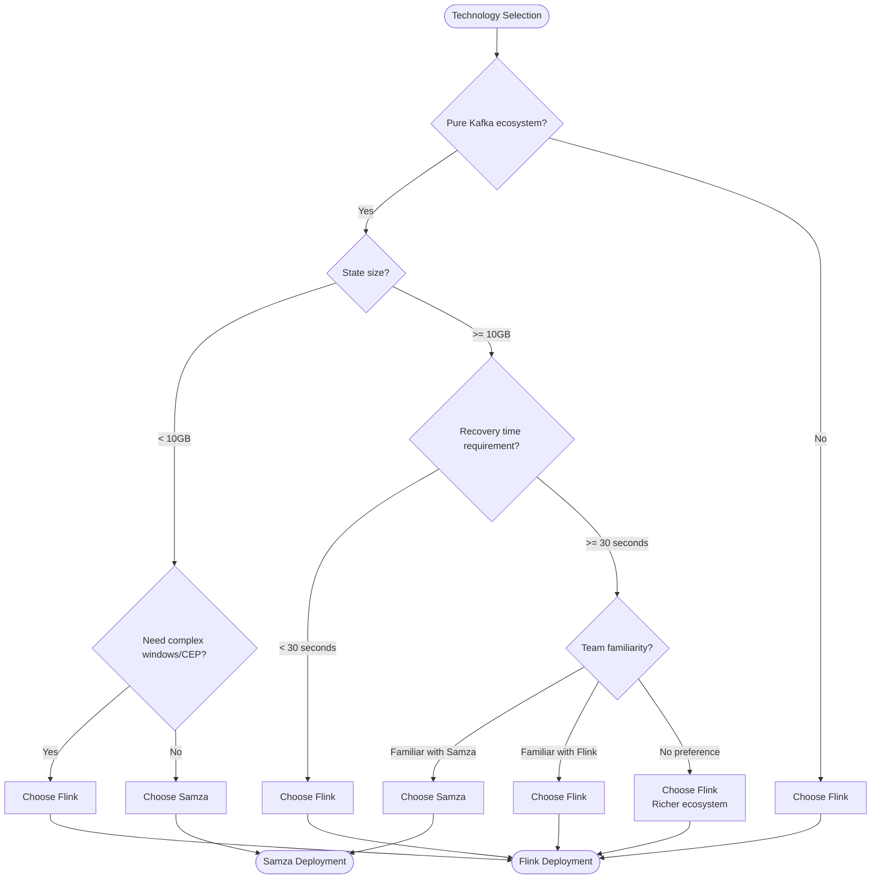
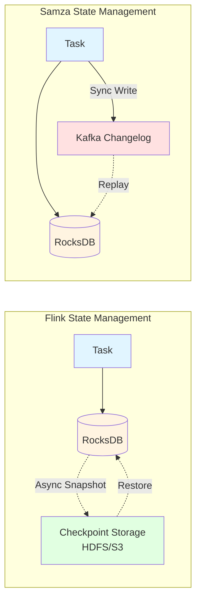
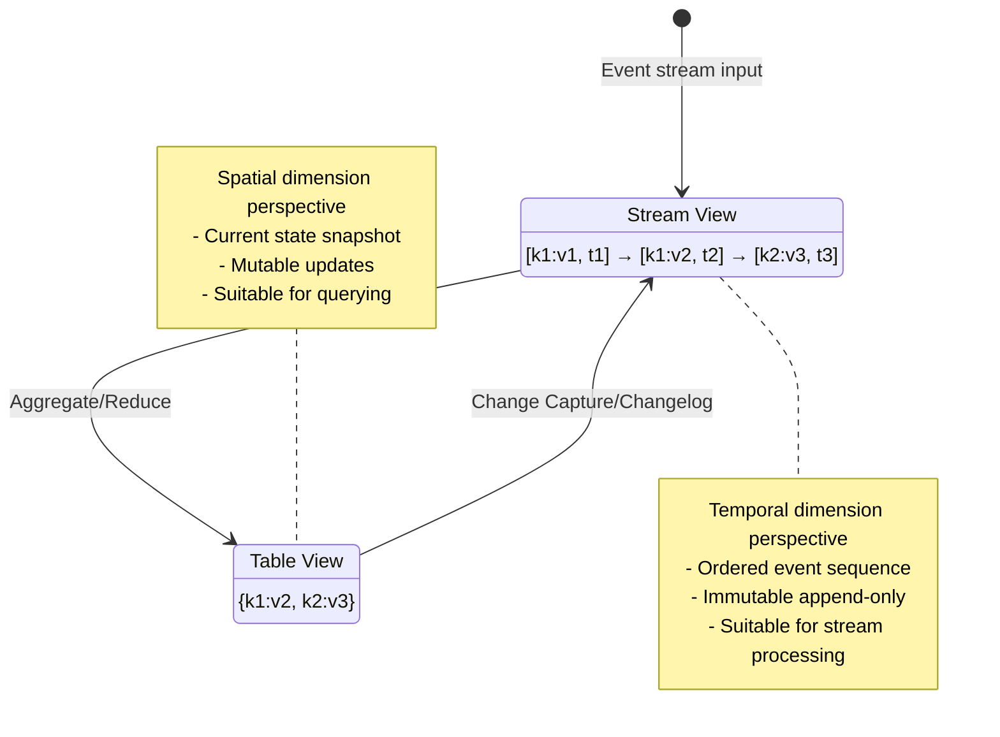

# LinkedIn Samza Deep Dive

> **Stage**: Flink/ | **Prerequisites**: [Flink Architecture Deep Dive](../../../01-concepts/deployment-architectures.md), [Competitor Comparison](./flink-vs-spark-streaming.md) | **Formality Level**: L3

## 1. Definitions

### Def-F-05-03: Samza Architecture Model

**Samza (Streaming Application Manager for ZooKeeper Architecture)** is a distributed stream processing framework open-sourced by LinkedIn. Its architecture model consists of three core abstraction layers:

$$
\text{Samza} = \langle \text{Stream}, \text{Job}, \text{Container} \rangle
$$

Where:

| Component | Definition | Responsibility |
|-----------|------------|----------------|
| **Stream** | Partitioned, ordered, immutable, replayable message sequence | Data abstraction, usually provided by Kafka |
| **Job** | Execution unit of user logic, containing input/output streams and task logic | Computation abstraction |
| **Container** | Process-level resource allocation unit, hosting multiple Tasks | Resource abstraction |

Samza adopts a **Single-layer Processing Model**:

```
┌─────────────────────────────────────────────┐
│              Samza Application              │
├─────────────────────────────────────────────┤
│  Task 0  │  Task 1  │  ...  │  Task N-1    │  ← Thread-level parallelism
├─────────────────────────────────────────────┤
│         Samza Container (JVM Process)       │
├─────────────────────────────────────────────┤
│    Kafka Consumer    │    RocksDB State     │
└─────────────────────────────────────────────┘
```

**Key Characteristic**: Samza does not implement its own stream storage, but completely relies on Kafka as the message queue and persistence layer.

---

### Def-F-05-04: Local State and Kafka Logs

Samza's state management adopts a **local state + remote log** hybrid architecture:

**Def-F-05-04-a: State Storage Hierarchy**

$$
\text{State}_{\text{Samza}} = \langle \text{LocalStore}, \text{Changelog}, \text{Snapshot} \rangle
$$

1. **LocalStore**: Embedded RocksDB instance, providing low-latency key-value access
2. **Changelog**: Each state change is written to a Kafka changelog topic, achieving persistence
3. **Snapshot**: Periodically backs up RocksDB state to remote storage such as HDFS/S3

**Def-F-05-04-b: Stream-Table Duality**

Samza supports viewing Stream and Table as two views of the same abstraction:

```
Stream View:  [event1] → [event2] → [event3] → ...  (Time series)
                ↓         ↓         ↓
Table View:   {k1:v1}   {k2:v2}   {k3:v3}  ...  (Current state)
```

Formal statement:

- **Table to Stream**: Table change operations (INSERT/UPDATE/DELETE) produce a Changelog Stream
- **Stream to Table**: A stream aggregated by key yields the current state, i.e., the table view

---

### Def-F-05-05: YARN and Kubernetes Deployment

Samza supports two resource manager deployment modes:

**Def-F-05-05-a: YARN Deployment Mode**

```
┌──────────────────────────────────────────────────────────┐
│                        YARN RM                           │
├──────────────────────────────────────────────────────────┤
│  ┌─────────────┐  ┌─────────────┐  ┌─────────────────┐  │
│  │  NM Node 1  │  │  NM Node 2  │  │   NM Node N     │  │
│  │ ┌─────────┐ │  │ ┌─────────┐ │  │ ┌─────────────┐ │  │
│  │ │Samza AM │ │  │ │Container│ │  │ │  Container  │ │  │
│  │ │(Job Mgmt)│ │  │ │ Task 0,1│ │  │ │ Task N-2,N-1│ │  │
│  │ └─────────┘ │  │ └─────────┘ │  │ └─────────────┘ │  │
│  │  Kafka +    │  │  Kafka +    │  │   Kafka +       │  │
│  │  RocksDB    │  │  RocksDB    │  │   RocksDB       │  │
│  └─────────────┘  └─────────────┘  └─────────────────┘  │
└──────────────────────────────────────────────────────────┘
```

**Def-F-05-05-b: Kubernetes Deployment Mode (Samza 1.5+)**

```yaml
apiVersion: samza.apache.org/v1
kind: SamzaJob
metadata:
  name: stream-processing-job
spec:
  jobCoordinator:
    replicas: 1
  containers:
    replicas: 3
    resources:
      memory: "4Gi"
      cpu: "2"
  stores:
    - name: local-store
      type: rocksdb
      changelog: input-topic-changelog
```

**Deployment Comparison**:

| Dimension | YARN Mode | Kubernetes Mode |
|-----------|-----------|-----------------|
| Applicable Scenario | Traditional Hadoop ecosystem | Cloud-native environment |
| Resource Scheduling | YARN Scheduler | K8s Scheduler |
| Service Discovery | ZooKeeper | K8s DNS/Headless Service |
| Configuration Management | Hadoop config | ConfigMap/Secret |
| Version Support | Mature and complete | 1.5+ experimental support |

## 2. Properties

### Lemma-F-05-01: State Persistence Latency Characteristics

Samza's local state + changelog architecture leads to the following characteristics:

$$
\text{WriteLatency}_{\text{Samza}} = \max(\text{RocksDB}_{write}, \text{Kafka}_{produce})
$$

Since state changes must be synchronously written to the Kafka changelog, write latency is constrained by Kafka produce latency.

**Corollary**: Although Samza's local state access has low read latency (microsecond-level), the write path has additional overhead.

---

### Lemma-F-05-02: Fault Recovery Time Lower Bound

When a Samza task restarts, state recovery requires replaying from the Kafka changelog:

$$
T_{recovery} \geq \frac{|\text{State}|}{\text{KafkaThroughput}} + T_{RocksDB\_restore}
$$

Where $|\text{State}|$ is the state size to be recovered.

**Corollary**: State scale and recovery time have a linear relationship. Large state recovery may become a bottleneck.

---

### Prop-F-05-01: Exactly-Once Semantic Implementation

Samza implements end-to-end Exactly-Once through the Kafka Transactions API:

1. **Producer Transactions**: Kafka Producer transactions guarantee atomicity of output writes
2. **Consumer Offset Commit**: Offset is committed together with output as a transaction
3. **Idempotent Processing**: Duplicate detection is achieved through transaction ID

$$
\text{Samza-Exactly-Once} = \text{Kafka-Transactions} + \text{Transactional-Offset-Commit}
$$

**Limitation**: Exactly-Once semantics can only be fully guaranteed when both input and output are Kafka.

## 3. Relations

### Architecture Comparison with Flink

**Hierarchy Mapping**:

```
Flink:           Samza:
┌─────────┐      ┌─────────┐
│ JobGraph│      │ Job     │
├─────────┤      ├─────────┤
│ Task    │  ↔   │ Task    │
├─────────┤      ├─────────┤
│ Subtask │      │ (No equivalent) │
├─────────┤      ├─────────┤
│ Slot    │  ↔   │Container│
├─────────┤      ├─────────┤
│ TM/JM   │      │ AM/Container│
└─────────┘      └─────────┘
```

### State Management Comparison Matrix

| Feature | Flink | Samza |
|---------|-------|-------|
| **State Backend** | RocksDB/Heap/JM | RocksDB (embedded) |
| **State Location** | Local + Checkpoint | Local + Changelog |
| **Snapshot Mechanism** | Async incremental Checkpoint | Kafka changelog replay |
| **Snapshot Storage** | Distributed storage (HDFS/S3) | Kafka topic |
| **State Sharing** | Queryable State | Not supported |
| **State TTL** | Native support | Application-layer implementation |

### Fault Tolerance Mechanism Comparison

| Mechanism | Flink | Samza |
|-----------|-------|-------|
| **Failure Detection** | JM heartbeat timeout | AM heartbeat + ZooKeeper |
| **State Recovery** | Recover from Checkpoint | Replay from changelog |
| **Recovery Granularity** | Entire Job/Region | Single Container |
| **Recovery Time** | $O(1)$ (depends on snapshot size) | $O(n)$ (depends on changelog length) |
| **Semantic Guarantee** | Checkpoint barrier alignment | Kafka transactions |

## 4. Argumentation

### Latency and Throughput Trade-off Analysis

**Samza Design Philosophy**: Optimize processing latency, sacrificing some recovery performance

```
Design Trade-off Space:
                    High Throughput
                      ↑
                      │
    Flink ────────────┼─────────────► (Balanced)
                      │
                      │     Samza (Latency-Optimized)
                      │
                      ↓
                    Low Latency
```

**Latency Analysis**:

Samza's processing latency advantages come from:

1. **No serialization overhead**: State is in local RocksDB, no network transfer needed
2. **No barrier alignment**: No processing pauses introduced by Checkpoint barriers
3. **Direct Kafka consumption**: Native Kafka Consumer optimization, no additional encapsulation layer

**Throughput Analysis**:

Samza's throughput limiting factors:

1. **Dual-write overhead**: Each record must be written to both output topic and changelog topic
2. **No batch optimization**: Compared to Flink's Mini-batch, single-record processing overhead is relatively higher
3. **Transaction overhead**: In Exactly-Once mode, transaction coordination adds latency

### Boundary Condition Discussion

**Scenario 1: Small State + High Throughput**

- Samza advantage: Low-latency processing, fast response
- Flink advantage: More mature Checkpoint mechanism, faster recovery

**Scenario 2: Large State + Complex Computation**

- Samza disadvantage: Changelog replay time grows linearly with state size
- Flink advantage: Incremental Checkpoint; recovery time is related to state change rate rather than total state size

**Scenario 3: Kafka-only Ecosystem**

- Samza advantage: Deep Kafka integration, simple configuration
- Flink advantage: More open ecosystem, supports multiple sources/sinks

## 5. Engineering Argument

### State Management Architecture Engineering Comparison

**Flink's Embedded RocksDB vs. Samza's Embedded RocksDB**:

Although both use RocksDB as the state backend, their architectural decisions differ significantly:

| Decision Point | Flink | Samza |
|----------------|-------|-------|
| **State Ownership** | Held by TaskManager | Held by Container |
| **Persistence Strategy** | Async Checkpoint to remote storage | Sync write to Kafka changelog |
| **State Migration** | Supports state migration after task reassignment | Depends on changelog replay for reconstruction |
| **Multi-Task State** | Single TM can serve multiple subtasks | Each Container has independent state |

**Engineering Argumentation**:

1. **Reliability Argumentation**:
   - Flink: Dual replicas (local + remote Checkpoint), can recover from remote if local fails
   - Samza: Single logical replica (Kafka changelog), RocksDB is only a cache

2. **Consistency Argumentation**:
   - Flink: Checkpoint barrier guarantees snapshot consistency
   - Samza: Relies on Kafka's offset management and transaction guarantees

3. **Operability Argumentation**:
   - Flink: Complete Checkpoint monitoring, rollback, and incremental cleanup
   - Samza: Relies on Kafka monitoring tools, lower state management transparency

### Migration Strategy: Samza to Flink

**Migration Scenario Identification**:

| Scenario | Migration Necessity | Complexity |
|----------|---------------------|------------|
| State size > 100GB | High (recovery time too long) | Medium |
| Need SQL/Table API | High (Samza has no native support) | Low |
| Need CEP | High (Samza has no pattern matching) | Medium |
| Kafka-only ecosystem | Low | - |
| Team familiar with Java Stream API | Low | - |

**Migration Strategy Matrix**:

```
┌────────────────────────────────────────────────────────────┐
│                 Migration Strategy Decision Tree           │
├────────────────────────────────────────────────────────────┤
│                                                            │
│  1. Is there complex state management?                     │
│     ├─ Yes -> Use Flink State API to rewrite state logic   │
│     └─ No -> Go to step 2                                  │
│                                                            │
│  2. Are there time window computations?                    │
│     ├─ Yes -> Migrate to Flink Window API                  │
│     └─ No -> Go to step 3                                  │
│                                                            │
│  3. Is Exactly-Once needed?                                │
│     ├─ Yes -> Enable Flink Checkpoint + Two-Phase Commit   │
│     └─ No -> At-Least-Once is sufficient                   │
│                                                            │
│  4. Deployment environment?                                │
│     ├─ K8s -> Flink Native K8s deployment                  │
│     └─ YARN -> Flink on YARN                               │
│                                                            │
└────────────────────────────────────────────────────────────┘
```

**Code Migration Example**:

```java
// Samza code

import org.apache.flink.streaming.api.datastream.DataStream;
import org.apache.flink.api.common.state.ValueState;
import org.apache.flink.api.common.state.ValueStateDescriptor;
import org.apache.flink.api.common.typeinfo.Types;

class WordCountTask implements StreamTask {
    @Override
    public void process(IncomingMessageEnvelope envelope,
                       MessageCollector collector,
                       TaskCoordinator coordinator) {
        String word = (String) envelope.getMessage();
        KeyValueStore<String, Integer> store =
            (KeyValueStore<String, Integer>) context.getStore("word-count");

        int count = store.getOrDefault(word, 0) + 1;
        store.put(word, count);
        collector.send(new OutgoingMessageEnvelope(outputStream, word, count));
    }
}

// Flink equivalent code
DataStream<Tuple2<String, Integer>> wordCounts =
    input
        .keyBy(value -> value.f0)
        .process(new KeyedProcessFunction<String, String, Tuple2<String, Integer>>() {
            private ValueState<Integer> countState;

            @Override
            public void open(Configuration parameters) {
                countState = getRuntimeContext().getState(
                    new ValueStateDescriptor<>("count", Types.INT));
            }

            @Override
            public void processElement(String word, Context ctx,
                                     Collector<Tuple2<String, Integer>> out) throws Exception {
                Integer current = countState.value();
                if (current == null) current = 0;
                current++;
                countState.update(current);
                out.collect(new Tuple2<>(word, current));
            }
        });
```

## 6. Examples

### Example 1: LinkedIn Member Activity Real-time Monitoring

**Scenario**: Count the number of page view events per member per minute

**Samza Implementation**:

```java
public class MemberActivityTask implements WindowTask {
    @Override
    public void processWindow(MessageCollector collector,
                             TaskCoordinator coordinator,
                             IncomingMessageEnvelope envelope,
                             TimerCallback callback) {
        MemberEvent event = (MemberEvent) envelope.getMessage();
        String memberId = event.getMemberId();
        long minute = event.getTimestamp() / 60000;

        KeyValueStore<String, Integer> store =
            (KeyValueStore<String, Integer>) context.getStore("activity-count");

        String key = memberId + ":" + minute;
        int count = store.getOrDefault(key, 0) + 1;
        store.put(key, count);

        // Output to downstream Kafka topic
        collector.send(new OutgoingMessageEnvelope(
            outputStream, memberId, new MemberActivity(memberId, minute, count)));
    }
}
```

**Flink Equivalent Implementation**:

```java

// [伪代码片段 - 不可直接运行] 仅展示核心逻辑
import org.apache.flink.streaming.api.datastream.DataStream;
import org.apache.flink.streaming.api.windowing.time.Time;

DataStream<MemberActivity> activityStream = events
    .keyBy(MemberEvent::getMemberId)
    .window(TumblingEventTimeWindows.of(Time.minutes(1)))
    .aggregate(new CountAggregate())
    .addSink(new KafkaSink<>("member-activity-output"));
```

### Example 2: Stream-Table Join (Associating Member Info with Activities)

**Samza's Stream-Table Duality Application**:

```java
// [伪代码片段 - 不可直接运行] 仅展示核心逻辑
// Store member info as a "table" in RocksDB
KeyValueStore<String, MemberProfile> profileStore =
    (KeyValueStore<String, MemberProfile>) context.getStore("member-profile");

// Stream processing: associate activity events with member profiles
public void processActivity(MemberEvent event, MessageCollector collector) {
    MemberProfile profile = profileStore.get(event.getMemberId());
    if (profile != null) {
        EnrichedEvent enriched = new EnrichedEvent(event, profile);
        collector.send(new OutgoingMessageEnvelope(enrichedStream, enriched));
    }
}
```

**Flink Equivalent Implementation (using Temporal Table Join)**:

```java
// [伪代码片段 - 不可直接运行] 仅展示核心逻辑
Table memberProfile = tableEnv.fromDataStream(profileStream)
    .createTemporalTableFunction("updateTime", "memberId");

Table result = tableEnv.sqlQuery(
    "SELECT a.*, p.* " +
    "FROM activity AS a " +
    "LEFT JOIN LATERAL TABLE(memberProfile(a.eventTime)) AS p " +
    "ON a.memberId = p.memberId"
);
```

## 7. Visualizations

### Samza Overall Architecture Diagram

The collaboration relationships among Samza components are as follows:



### Samza vs Flink Comparison Decision Tree

Decision flow during technology selection:



### State Management Architecture Comparison



### Stream-Table Duality Visualization



## 8. References


---

*Document Version: 1.0 | Last Updated: 2026-04-02 | Maintainer: AnalysisDataFlow Project*
