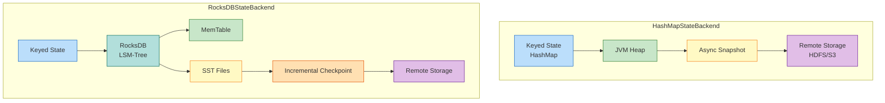
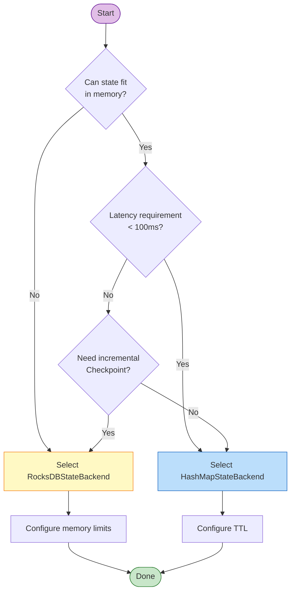

# Flink State Backend Selection Guide

> Stage: Flink/06-engineering | Prerequisites: [Consistency Hierarchy Document](../../../Struct/02-properties/02.02-consistency-hierarchy.md), [Checkpoint Mechanism Deep Dive](../../02-core/checkpoint-mechanism-deep-dive.md) | Formalization Level: L4

---

## Table of Contents

- [Flink State Backend Selection Guide](#flink-state-backend-selection-guide)
  - [Table of Contents](#table-of-contents)
  - [1. Definitions](#1-definitions)
    - [Def-F-06-01 (State Backend)](#def-f-06-01-state-backend)
    - [Def-F-06-02 (HeapStateBackend / MemoryStateBackend)](#def-f-06-02-heapstatebackend-memorystatebackend)
    - [Def-F-06-03 (RocksDBStateBackend)](#def-f-06-03-rocksdbstatebackend)
    - [Def-F-06-04 (HashMapStateBackend)](#def-f-06-04-hashmapstatebackend)
    - [Def-F-06-05 (EmbeddedRocksDBStateBackend)](#def-f-06-05-embeddedrocksdbstatebackend)
    - [Def-F-06-06 (Incremental Checkpointing)](#def-f-06-06-incremental-checkpointing)
  - [2. Properties](#2-properties)
    - [Lemma-F-06-01 (State Backend Independence from Consistency Semantics)](#lemma-f-06-01-state-backend-independence-from-consistency-semantics)
    - [Lemma-F-06-02 (RocksDB Memory-Disk Tiering Property)](#lemma-f-06-02-rocksdb-memory-disk-tiering-property)
    - [Lemma-F-06-03 (Incremental Checkpoint State Boundary Constraint)](#lemma-f-06-03-incremental-checkpoint-state-boundary-constraint)
    - [Prop-F-06-01 (State Backend Selection Multi-Objective Optimization)](#prop-f-06-01-state-backend-selection-multi-objective-optimization)
  - [3. Relations](#3-relations)
    - [Relation 1: State Backend to Consistency Hierarchy Mapping](#relation-1-state-backend-to-consistency-hierarchy-mapping)
    - [Relation 2: Checkpoint Mechanism and State Backend Coupling](#relation-2-checkpoint-mechanism-and-state-backend-coupling)
    - [Relation 3: State Backend Evolution Roadmap](#relation-3-state-backend-evolution-roadmap)
  - [4. Argumentation](#4-argumentation)
    - [Lemma 4.1 (RocksDB Serialization Overhead Sources)](#lemma-41-rocksdb-serialization-overhead-sources)
    - [Lemma 4.2 (Heap State GC Pressure Model)](#lemma-42-heap-state-gc-pressure-model)
    - [Counterexample 4.1 (Heap Backend OOM in Large State Scenarios)](#counterexample-41-heap-backend-oom-in-large-state-scenarios)
    - [Boundary Discussion 4.2 (RocksDB Disk I/O Bottleneck)](#boundary-discussion-42-rocksdb-disk-io-bottleneck)
  - [5. Engineering Argument](#5-engineering-argument)
    - [Thm-F-06-01 (State Backend Selection Completeness Theorem)](#thm-f-06-01-state-backend-selection-completeness-theorem)
    - [Thm-F-06-02 (Incremental Checkpoint Optimization Bound Theorem)](#thm-f-06-02-incremental-checkpoint-optimization-bound-theorem)
  - [6. Examples](#6-examples)
    - [Example 6.1: HashMapStateBackend Basic Configuration](#example-61-hashmapstatebackend-basic-configuration)
    - [Example 6.2: RocksDBStateBackend Production Configuration](#example-62-rocksdbstatebackend-production-configuration)
    - [Example 6.3: Incremental Checkpoint Configuration and Monitoring](#example-63-incremental-checkpoint-configuration-and-monitoring)
    - [Example 6.4: Dynamic State Backend Switching](#example-64-dynamic-state-backend-switching)
    - [Counterexample 6.5: Incorrect RocksDB Memory Configuration](#counterexample-65-incorrect-rocksdb-memory-configuration)
  - [7. Visualizations](#7-visualizations)
    - [State Backend Architecture Comparison Diagram](#state-backend-architecture-comparison-diagram)
    - [State Backend Selection Decision Tree](#state-backend-selection-decision-tree)
    - [State Backend × Feature Detailed Comparison Table](#state-backend-feature-detailed-comparison-table)
  - [8. References](#8-references)

## 1. Definitions

### Def-F-06-01 (State Backend)

**State Backend** is the abstraction layer in Flink responsible for managing operator state and keyed state persistence and access interfaces. Formally, a state backend $\mathcal{B}$ is a quadruple:

$$
\mathcal{B} = (S_{\text{storage}}, \Phi_{\text{access}}, \Psi_{\text{snapshot}}, \Omega_{\text{recovery}})
$$

Where $S_{\text{storage}}$ is the storage medium, $\Phi_{\text{access}}$ is the access interface, $\Psi_{\text{snapshot}}$ is the snapshot function, and $\Omega_{\text{recovery}}$ is the recovery function[^1][^3].

---

### Def-F-06-02 (HeapStateBackend / MemoryStateBackend)

**HeapStateBackend** (also known as MemoryStateBackend, Flink 1.x legacy naming) stores state data directly in JVM Heap memory:

$$
\mathcal{B}_{\text{heap}} = (S_{\text{heap}}, \Phi_{\text{obj}}, \Psi_{\text{sync}}, \Omega_{\text{deserialize}})
$$

**Characteristics**: State is stored as Java objects in JVM Heap, access requires no serialization.

**Constraints**: Limited by `-Xmx`, recommended single TM state upper bound is tens of MB.

**Status**: ⚠️ **Deprecated**. Flink 1.13+ recommends HashMapStateBackend.

---

### Def-F-06-03 (RocksDBStateBackend)

**RocksDBStateBackend** is based on the embedded RocksDB database, persisting state data to local disk:

$$
\mathcal{B}_{\text{rocksdb}} = (S_{\text{disk}}, \Phi_{\text{lsm}}, \Psi_{\text{async}}, \Omega_{\text{restore}})
$$

**Core Features**:

1. **Disk-Level Capacity**: Supports TB-level state;
2. **Incremental Checkpointing**: Only persists changed state data;
3. **Memory-Disk Tiering**: Active data cached in memory, cold data sunk to disk;
4. **Asynchronous Snapshot**: Checkpoint does not block data stream processing[^3][^5].

---

### Def-F-06-04 (HashMapStateBackend)

**HashMapStateBackend** is the new-generation in-memory state backend introduced in Flink 1.13:

$$
\mathcal{B}_{\text{hashmap}} = (S_{\text{heap}}, \Phi_{\text{obj}}, \Psi_{\text{async-fs}}, \Omega_{\text{deserialize}})
$$

Differences from HeapStateBackend:

- **Asynchronous Snapshot**: Supports async writes to HDFS/S3, does not block data streams;
- **Efficient Serialization**: Uses Flink TypeSerializer;
- **Managed Memory Integration**: Better integration with TaskManager memory model.

**Applicable Scenarios**: Jobs where state fits entirely in memory and extremely low access latency is desired.

---

### Def-F-06-05 (EmbeddedRocksDBStateBackend)

**EmbeddedRocksDBStateBackend** is the refactored implementation of RocksDBStateBackend in Flink 1.13+:

$$
\mathcal{B}_{\text{embedded-rocksdb}} = (S_{\text{disk}}, \Phi_{\text{lsm}}, \Psi_{\text{async-incremental}}, \Omega_{\text{restore}})
$$

**Improvements**: Native incremental checkpointing, fine-grained memory management, multi-column family support.

---

### Def-F-06-06 (Incremental Checkpointing)

**Incremental Checkpointing** only persists the changed portion (Delta) of state since the last Checkpoint:

$$
\Delta_n = S_n \ominus S_{n-1}, \quad |\text{Checkpoint}_n^{\text{incremental}}| = |\Delta_n| \ll |S_n|
$$

**Implementation Mechanism** (RocksDB):

1. **SST File-Level Incremental**: Only uploads newly produced SST files;
2. **Reference Count Sharing**: Unmodified SST files are shared across multiple Checkpoints;
3. **Garbage Collection**: Periodically cleans up SST files no longer referenced[^1][^5].

---

## 2. Properties

### Lemma-F-06-01 (State Backend Independence from Consistency Semantics)

**Statement**: The choice of state backend does not affect the consistency semantic level achievable by a Flink job.

**Proof**: Consistency semantics are determined by the Checkpoint mechanism (see [02.02-consistency-hierarchy.md](../../../Struct/02-properties/02.02-consistency-hierarchy.md)). Regardless of which backend is used, as long as the Source is replayable, Barriers are aligned, and the Sink is atomic, end-to-end Exactly-Once holds. The state backend only affects performance, not correctness. ∎

---

### Lemma-F-06-02 (RocksDB Memory-Disk Tiering Property)

**Statement**: RocksDBStateBackend access latency exhibits a bimodal distribution—sub-millisecond when cache hits, millisecond-level when misses.

**Proof**: Let Block Cache hit rate be $h$, then:

$$
E[t_{\text{access}}] = h \cdot t_{\text{mem}} + (1-h) \cdot t_{\text{disk}}
$$

Where $t_{\text{mem}} \approx 0.1\mu s$, $t_{\text{disk}} \approx 0.1-10ms$, forming a clear bimodal distribution. ∎

---

### Lemma-F-06-03 (Incremental Checkpoint State Boundary Constraint)

**Statement**: The effectiveness of incremental checkpointing depends on the temporal locality of state changes.

**Proof**: Let Checkpoint period be $T$, and change rate be $r(t)$, then incremental data volume $|\Delta_n| = \int_{(n-1)T}^{nT} r(t) dt$. If all states are updated every period, then $|\Delta_n| \approx |S|$, and incremental degenerates to full; if only 1% hot keys are updated, 99% storage can be saved. ∎

---

### Prop-F-06-01 (State Backend Selection Multi-Objective Optimization)

**Statement**: State backend selection is a Pareto optimization problem among **state capacity**, **access latency**, **checkpoint efficiency**, and **resource cost**.

**Pareto Frontier**:

| Backend | Capacity | Latency | Checkpoint | Cost |
|---------|----------|---------|------------|------|
| HashMap | LOW | LOW | MEDIUM | LOW |
| RocksDB | HIGH | MEDIUM | LOW* | MEDIUM |

*Note: RocksDB incremental mode checkpoint speed is LOW (fast), full mode is HIGH (slow). ∎

---

## 3. Relations

### Relation 1: State Backend to Consistency Hierarchy Mapping

According to [02.02-consistency-hierarchy.md](../../../Struct/02-properties/02.02-consistency-hierarchy.md), end-to-end Exactly-Once consists of three sub-properties:

$$
\text{End-to-End-EO}(J) \iff \text{Replayable}(Src) \land \text{ConsistentCheckpoint}(Ops) \land \text{AtomicOutput}(Snk)
$$

| Sub-Property | State Backend Role |
|--------------|--------------------|
| Source Replayable | **Irrelevant**. Provided by external system |
| Consistent Checkpoint | **Directly related**. Determines snapshot method |
| Sink Atomicity | **Irrelevant**. Provided by Sink implementation |

The state backend is the implementation carrier of Checkpoint; as long as `SnapshotStrategy` is correctly implemented, internal consistency is satisfied.

---

### Relation 2: Checkpoint Mechanism and State Backend Coupling

| Coupling Dimension | HashMapStateBackend | RocksDBStateBackend |
|--------------------|---------------------|---------------------|
| Sync Phase | Create HashMap snapshot view | Trigger RocksDB `checkpoint()` |
| Async Phase | Serialize to remote storage | Upload SST files to remote storage |
| Incremental Support | ❌ Not supported | ✅ Native support (SST reference) |
| Consistency Guarantee | Snapshot view guarantee | LSM-Tree immutability guarantee |

---

### Relation 3: State Backend Evolution Roadmap

| Version | State Backend | Characteristics |
|---------|---------------|-----------------|
| 1.0-1.12 | MemoryStateBackend | Heap + JobManager memory, < 5MB |
| 1.0-1.12 | FsStateBackend | Heap + remote filesystem |
| 1.0-1.12 | RocksDBStateBackend | Local disk + remote filesystem |
| 1.13+ | HashMapStateBackend | Unified replacement for Memory/Fs |
| 1.13+ | EmbeddedRocksDBStateBackend | New-generation RocksDB implementation |

**Evolution Motivation**: API simplification, unified async snapshot, reserving interfaces for compute-storage separation[^1][^4].

---

## 4. Argumentation

### Lemma 4.1 (RocksDB Serialization Overhead Sources)

**Statement**: RocksDB access latency is higher than HashMap, mainly due to serialization/deserialization and JNI call overhead.

**Analysis**:

$$
t_{\text{RocksDB}} = t_{\text{serialize}} + t_{\text{jni}} + t_{\text{rocksdb}} + t_{\text{deserialize}}
$$
$$
t_{\text{HashMap}} = t_{\text{hash}} + t_{\text{reference}}
$$

| Component | RocksDB | HashMap |
|-----------|---------|---------|
| Serialization | 1-10 μs | - |
| JNI | 0.5-2 μs | - |
| Internal Access | 1-100 μs | 10-100 ns |

RocksDB latency is typically 10-1000x that of HashMap. ∎

---

### Lemma 4.2 (Heap State GC Pressure Model)

**Statement**: Large states with HashMapStateBackend cause frequent GC; GC pressure is positively correlated with state object count, lifetime, and change frequency.

**Risk Threshold**: Heap state at 50% → GC time > 10%; at 70% → Full GC risk becomes significant.

---

### Counterexample 4.1 (Heap Backend OOM in Large State Scenarios)

**Scenario**: 100 million users × 200B = 20GB state, 10 TMs × 4GB heap.

**Calculation**: 2GB per TM + overhead ≈ 3GB (75% of heap memory).

**Result**: Frequent OOM, forced to switch to RocksDBStateBackend.

---

### Boundary Discussion 4.2 (RocksDB Disk I/O Bottleneck)

**Scenario**: RocksDB deployed in cloud containers (e.g., K8s Pod).

**Problems**:

1. Local disk may be network storage (e.g., EBS) with high I/O latency;
2. Multiple Pods share host disk, causing I/O contention;
3. Container disk quota limits writes.

**Mitigation**: Use SSD StorageClass, increase Block Cache.

---

## 5. Engineering Argument

### Thm-F-06-01 (State Backend Selection Completeness Theorem)

**Statement**: For any job $J$, there exists a unique optimal state backend selection strategy determined by the feature vector $F(J) = (S_{\text{size}}, L_{\text{sla}}, U_{\text{pattern}}, R_{\text{budget}})$.

**Decision Rule**:

$$
\mathcal{D}(F(J)) = \begin{cases}
\text{HashMap} & \text{if } S_{\text{size}} < M_{\text{max}} \land L_{\text{sla}} < T_{\text{strict}} \\
\text{RocksDB} & \text{if } S_{\text{size}} \geq M_{\text{max}} \lor L_{\text{sla}} \geq T_{\text{relaxed}}
\end{cases}
$$

**Typical Thresholds**:

- $M_{\text{max}}$: 30% of TM heap memory (e.g., 4GB heap → 1.2GB state upper bound)
- $T_{\text{strict}}$: < 100ms
- $T_{\text{relaxed}}$: > 500ms

**Proof**:

1. Capacity constraint: If $S_{\text{size}} \geq M_{\text{max}}$, HashMap GC pressure is unacceptable (Lemma 4.2), RocksDB is mandatory;
2. Latency constraint: If $L_{\text{sla}} < T_{\text{strict}}$, RocksDB serialization overhead (Lemma 4.1) may violate SLA, HashMap is preferred. ∎

---

### Thm-F-06-02 (Incremental Checkpoint Optimization Bound Theorem)

**Statement**: The storage savings rate $R_{\text{save}}$ upper bound of incremental checkpointing:

$$
R_{\text{save}} \leq 1 - \frac{r \cdot T}{|S|}
$$

**Optimal**: Only a proportion $p$ of state is updated, $R_{\text{save}} = 1 - p$.

**Worst**: All states are updated every period, $R_{\text{save}} = 0$, degenerating to full checkpoint.

**Conclusion**: Suitable for obvious hot spots; unsuitable for full aggregation; monitor savings rate via `checkpointed_bytes`. ∎

---

## 6. Examples

### Example 6.1: HashMapStateBackend Basic Configuration

```java

// [伪代码片段 - 不可直接运行] 仅展示核心逻辑
import org.apache.flink.streaming.api.environment.StreamExecutionEnvironment;
import org.apache.flink.streaming.api.windowing.time.Time;

StreamExecutionEnvironment env =
    StreamExecutionEnvironment.getExecutionEnvironment();

// Set HashMapStateBackend
env.setStateBackend(new HashMapStateBackend());

// Checkpoint configuration
env.enableCheckpointing(60000);
env.getCheckpointConfig().setCheckpointStorage("hdfs:///checkpoints");

// TTL configuration
StateTtlConfig ttlConfig = StateTtlConfig
    .newBuilder(Time.hours(24))
    .cleanupFullSnapshot()
    .build();
```

---

### Example 6.2: RocksDBStateBackend Production Configuration

```java
// [伪代码片段 - 不可直接运行] 仅展示核心逻辑
// Create EmbeddedRocksDBStateBackend (enable incremental Checkpoint)
EmbeddedRocksDBStateBackend backend =
    new EmbeddedRocksDBStateBackend(true);

env.setStateBackend(backend);
env.getCheckpointConfig().setCheckpointStorage("hdfs:///checkpoints");

// RocksDB memory configuration
DefaultConfigurableOptionsFactory optionsFactory =
    new DefaultConfigurableOptionsFactory();
optionsFactory.setRocksDBOptions(
    "state.backend.rocksdb.memory.managed", "true");
optionsFactory.setRocksDBOptions(
    "state.backend.rocksdb.memory.fixed-per-slot", "256mb");
```

---

### Example 6.3: Incremental Checkpoint Configuration and Monitoring

```java
// [伪代码片段 - 不可直接运行] 仅展示核心逻辑
// Enable incremental checkpointing
EmbeddedRocksDBStateBackend backend =
    new EmbeddedRocksDBStateBackend(true);

// Checkpoint parameters
env.enableCheckpointing(60000);
env.getCheckpointConfig().setMinPauseBetweenCheckpoints(30000);
env.getCheckpointConfig().setCheckpointTimeout(600000);
```

**Monitoring Metrics**:

| Metric | Meaning | Healthy Threshold |
|--------|---------|-------------------|
| `checkpointed_bytes` | Actual written bytes | Far less than total state size |
| `fullSizeBytes` | Full state size | Used to calculate savings rate |

**Savings Rate**: $1 - (\text{checkpointed\_bytes} / \text{fullSizeBytes})$

---

### Example 6.4: Dynamic State Backend Switching

```bash
# Create Savepoint
flink stop --savepointPath hdfs:///savepoints <job-id>

# Modify code to switch backend, then resume from Savepoint
flink run -s hdfs:///savepoints/savepoint-xxxxx \
  -c com.example.MyJob my-job.jar
```

**Note**: HashMap → RocksDB is automatic; RocksDB → HashMap requires ensuring state size < TM heap memory.

---

### Counterexample 6.5: Incorrect RocksDB Memory Configuration

**Incorrect Configuration**:

```java
// [伪代码片段 - 不可直接运行] 仅展示核心逻辑
conf.setString("taskmanager.memory.managed.size", "64mb");  // Too small!
```

**Problem**: Block Cache and MemTable compete for memory → hit rate drops → disk I/O surges → Write Stall → Backpressure.

**Correct Approach**:

```java
// [伪代码片段 - 不可直接运行] 仅展示核心逻辑
conf.setString("taskmanager.memory.managed.fraction", "0.4");
// Or
optionsFactory.setRocksDBOptions(
    "state.backend.rocksdb.memory.fixed-per-slot", "512mb");
```

---

## 7. Visualizations

### State Backend Architecture Comparison Diagram



---

### State Backend Selection Decision Tree



---

### State Backend × Feature Detailed Comparison Table

| Feature Dimension | HeapStateBackend<br/>(Legacy) | HashMapStateBackend | RocksDBStateBackend<br/>/ EmbeddedRocksDB |
|-------------------|:-----------------------------:|:-------------------:|:-----------------------------------------:|
| **Storage Location** | JVM Heap | JVM Heap | Local Disk (LSM-Tree) |
| **State Capacity** | Few MB - Tens of MB | Few MB - Several GB | TB-level |
| **Access Latency** | ~10-100 ns | ~10-100 ns | 1-100 μs (hit)<br/>0.1-10 ms (miss) |
| **Throughput** | Extremely High | Extremely High | Medium |
| **Serialization Overhead** | At Checkpoint time | At Checkpoint time | Every read/write |
| **Checkpoint Method** | Full sync/async | Full async | Incremental async |
| **Checkpoint Speed** | Medium | Medium | Fast (changes only) |
| **Recovery Speed** | Fast | Fast | Medium |
| **Memory Efficiency** | Low (GC pressure) | Low (GC pressure) | High (managed memory) |
| **Disk Dependency** | None | None | Strong |
| **Incremental Checkpoint** | ❌ | ❌ | ✅ |
| **Large State Support** | ❌ | ❌ (>50% Heap dangerous) | ✅ |
| **SSD Dependency** | None | None | Recommended |
| **TTL Support** | ✅ | ✅ | ✅ (Native) |
| **Applicable Scenarios** | Testing/Tiny state | Small state + Low latency | Large state + Incremental |
| **Flink Version** | 1.x (Deprecated) | 1.13+ | 1.13+ |

**Quick Selection Guide**: State < 100MB choose HashMap; state > 1GB or need incremental Checkpoint choose RocksDB; write-heavy choose HashMap, read-heavy with obvious hot spots choose RocksDB.

---

## 8. References

[^1]: Apache Flink Documentation, "State Backends", 2025. <https://nightlies.apache.org/flink/flink-docs-stable/docs/ops/state/state_backends/>


[^3]: P. Carbone et al., "Apache Flink: Stream and Batch Processing in a Single Engine," *IEEE Data Engineering Bulletin*, 38(4), 2015.

[^4]: Apache Flink Documentation, "Incremental Checkpoints", 2025. <https://nightlies.apache.org/flink/flink-docs-release-1.20/docs/ops/state/incremental-checkpoints/> <!-- 404 as of 2026-04 on stable -->

[^5]: RocksDB Wiki, "RocksDB Basics", Meta Open Source, 2025. <https://github.com/facebook/rocksdb/wiki/RocksDB-Basics>


---

*Document Version: v1.0 | Date: 2026-04-02 | Status: Completed*
