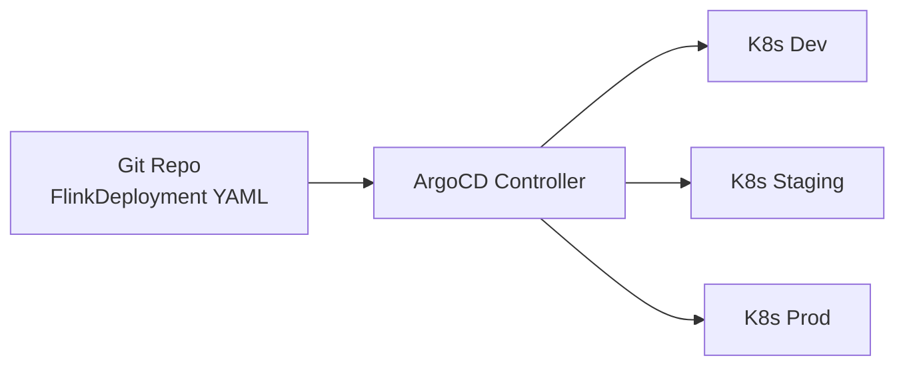
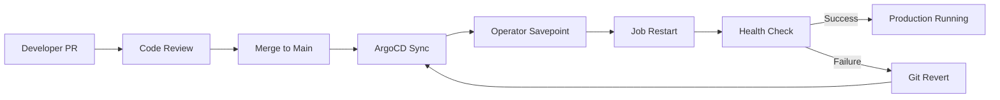

# Flink GitOps Deployment Mode

> **Stage**: Flink/09-practices/09.04-deployment/ | **Prerequisites**: [flink-kubernetes-operator-1.14-guide.md](./flink-kubernetes-operator-1.14-guide.md) | **Formality Level**: L4

---

## 1. Definitions

**Def-F-Dep-01: GitOps**
GitOps is an operations paradigm that uses a Git repository as the single source of truth. All infrastructure configurations and application deployment declarations are stored in Git, and an automated controller continuously synchronizes the Git state with the actual cluster state.

**Def-F-Dep-02: ArgoCD**
ArgoCD is a declarative GitOps continuous delivery tool designed for Kubernetes. It monitors changes to Kubernetes manifests in a Git repository and automatically or manually synchronizes those changes to the target cluster.

**Def-F-Dep-03: FlinkDeployment CRD**
A Custom Resource Definition provided by the Flink Kubernetes Operator, allowing users to describe the lifecycle and resource configuration of Flink jobs in declarative YAML.

---

## 2. Properties

**Lemma-F-Dep-01: Idempotent Sync of GitOps**
ArgoCD's synchronization operation on FlinkDeployment is idempotent: repeatedly applying the YAML corresponding to the same Git commit will not produce side effects unless the YAML content changes.

**Lemma-F-Dep-02: Atomic Boundary of Rollback**
By reverting to a historical commit in Git and triggering ArgoCD synchronization, the Flink configuration can be rolled back to a previous state. However, Checkpoint/Savepoint rollback requires additional storage-layer operations; GitOps itself does not manage state files.

**Prop-F-Dep-01: Multi-Environment Consistency**
In GitOps mode, differences in Flink configurations across dev, test, and production environments are only reflected in Git branches or Kustomize overlay layers; the underlying structure remains consistent.

---

## 3. Relations



### Toolchain Comparison

| Tool | Sync Strategy | Multi-Cluster Support | Recommended Scenario |
|------|---------------|----------------------|----------------------|
| ArgoCD | Pull-based | Excellent | Enterprise multi-environment deployment |
| Flux | Pull-based | Good | Deep integration with GitLab/GitHub |
| Tekton | Push-based | Moderate | Complex CI/CD pipeline scenarios |

---

## 4. Argumentation

Traditional imperative deployment suffers from configuration drift, difficult auditing, and complex rollback. GitOps solves these problems by making "Git the source of truth": all changes must go through PRs, naturally providing an audit trail; ArgoCD continuously monitors and corrects drift; `git revert` can trigger automatic rollback.

### Branch Strategy

| Branch | Purpose | ArgoCD Application |
|--------|---------|-------------------|
| `main` | Production | `flink-prod` |
| `release/*` | Pre-release/Canary | `flink-staging` |
| `develop` | Development integration | `flink-dev` |
| `feature/*` | Temporary experiments | On-demand creation |

---

## 5. Proof / Engineering Argument

**Theorem (Thm-F-Dep-01)**: In GitOps mode, if Flink job upgrades follow the pipeline of "update Git first → ArgoCD sync → verify state → delete old version", and the Savepoint path is explicitly declared in Git, then the upgrade process is atomic and recoverable.

**Proof Sketch**:

1. Git commit is an atomic operation
2. ArgoCD sync is based on declarative CRD updates, and the Operator is responsible for reconciling actual and desired states
3. When image or parallelism changes are detected, the Operator triggers a Savepoint and restarts the job
4. If the new version fails, reverting the Git commit causes ArgoCD to reapply the old configuration, and the Operator recovers from the Savepoint
5. Therefore, the upgrade-rollback loop is recoverable

---

## 6. Examples

### 6.1 FlinkDeployment GitOps Configuration

```yaml
apiVersion: flink.apache.org/v1beta1
kind: FlinkDeployment
metadata:
  name: realtime-analytics
  namespace: flink-apps
spec:
  image: flink:2.0.0
  flinkVersion: v2.0
  jobManager:
    resource:
      memory: "4Gi"
      cpu: 2
  taskManager:
    resource:
      memory: "8Gi"
      cpu: 4
    replicas: 4
  job:
    jarURI: local:///opt/flink/examples/streaming/StateMachineExample.jar
    parallelism: 16
    upgradeMode: savepoint
    state: running
```

### 6.2 ArgoCD Application Definition

```yaml
apiVersion: argoproj.io/v1alpha1
kind: Application
metadata:
  name: flink-prod
  namespace: argocd
spec:
  project: default
  source:
    repoURL: https://github.com/your-org/flink-gitops.git
    targetRevision: main
    path: overlays/prod
  destination:
    server: https://kubernetes.default.svc
    namespace: flink-apps
  syncPolicy:
    automated:
      prune: true
      selfHeal: true
```

### 6.3 Kustomize Multi-Environment Overlay

```yaml
# overlays/prod/kustomization.yaml
resources:
  - ../../base
patchesStrategicMerge:
  - resources-patch.yaml
```

```yaml
# overlays/prod/resources-patch.yaml
spec:
  taskManager:
    resource:
      memory: "16Gi"
      cpu: 8
    replicas: 12
```

---

## 7. Visualizations



---

## 8. References
