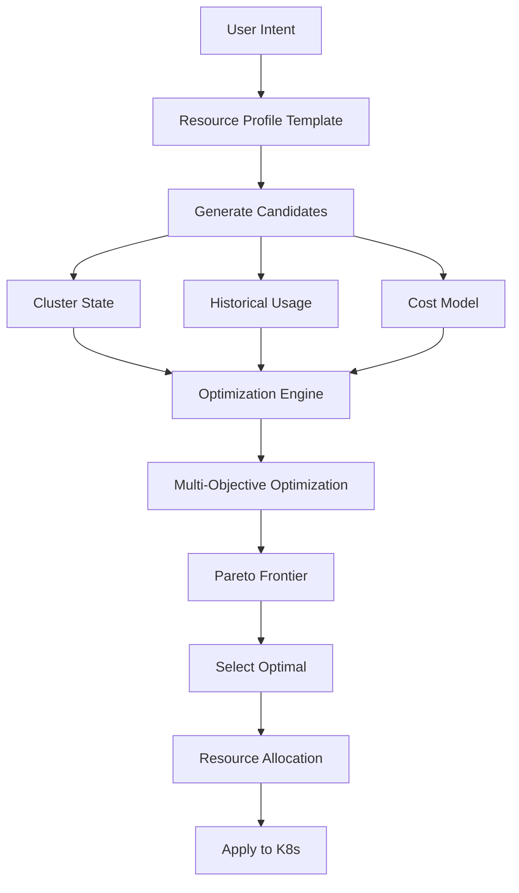
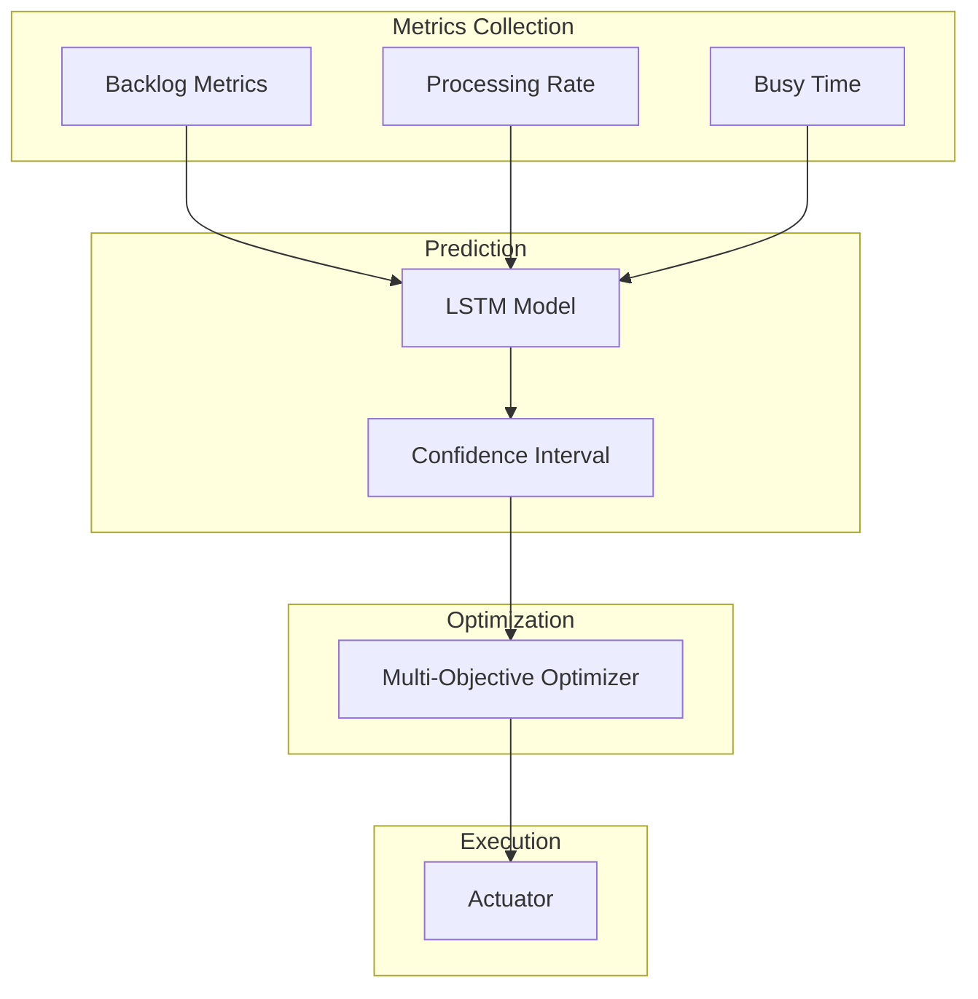
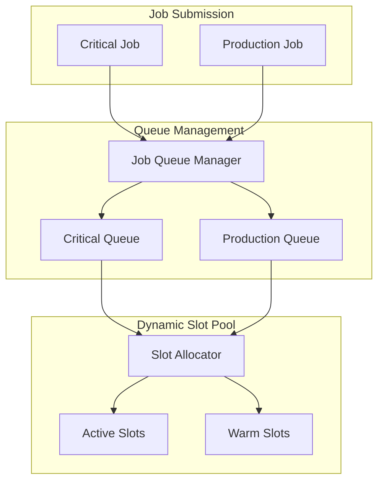
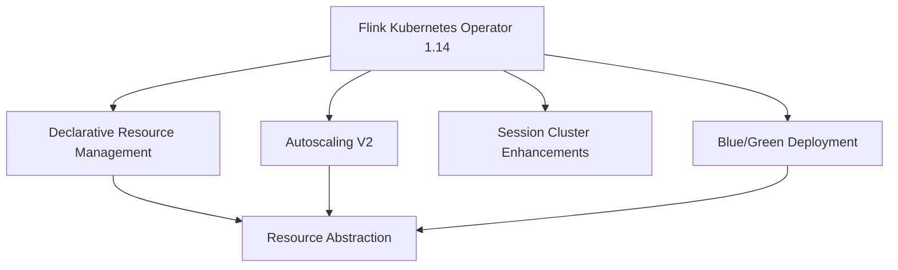

# Flink Kubernetes Operator 1.14 New Features Explained

> **Stage**: Flink/09-practices/09.04-deployment | **Prerequisites**: [flink-kubernetes-operator-1.14-guide.md](./flink-kubernetes-operator-1.14-guide.md) | **Formality Level**: L5 (Engineering Rigorous)
>
> **Applicable Version**: Flink Kubernetes Operator 1.14.0 | **Release Date**: 2026-02-15 | **Status**: Production Ready

---

## Table of Contents

- [Flink Kubernetes Operator 1.14 New Features Explained](#flink-kubernetes-operator-114-new-features-explained)
  - [Table of Contents](#table-of-contents)
  - [1. Definitions](#1-definitions)
    - [Def-F-09-12: Declarative Resource Management](#def-f-09-12-declarative-resource-management)
    - [Def-F-09-13: Autoscaling Algorithm V2](#def-f-09-13-autoscaling-algorithm-v2)
    - [Def-F-09-14: Session Cluster Enhancements](#def-f-09-14-session-cluster-enhancements)
    - [Def-F-09-15: Helm Chart Schema Validation](#def-f-09-15-helm-chart-schema-validation)
    - [Def-F-09-16: Blue/Green Deployment CRD](#def-f-09-16-bluegreen-deployment-crd)
  - [2. Properties](#2-properties)
    - [Lemma-F-09-07: Declarative Resource Optimization Efficiency](#lemma-f-09-07-declarative-resource-optimization-efficiency)
    - [Lemma-F-09-08: Autoscaling V2 Prediction Accuracy](#lemma-f-09-08-autoscaling-v2-prediction-accuracy)
    - [Lemma-F-09-09: Session Cluster Resource Utilization](#lemma-f-09-09-session-cluster-resource-utilization)
  - [3. Relations](#3-relations)
    - [3.1 New Feature Dependencies](#31-new-feature-dependencies)
    - [3.2 Feature Comparison Matrix](#32-feature-comparison-matrix)
    - [3.3 Performance Improvement Comparison](#33-performance-improvement-comparison)
  - [4. Argumentation](#4-argumentation)
    - [4.1 New Feature Selection Decision](#41-new-feature-selection-decision)
    - [4.2 Production Readiness Assessment](#42-production-readiness-assessment)
    - [4.3 Cost-Benefit Analysis](#43-cost-benefit-analysis)
  - [5. Proof / Engineering Argument](#5-proof-engineering-argument)
    - [Thm-F-09-03: Declarative Resource Optimality](#thm-f-09-03-declarative-resource-optimality)
    - [Prop-F-09-03: Autoscaling V2 Convergence Speed](#prop-f-09-03-autoscaling-v2-convergence-speed)
  - [6. Examples](#6-examples)
    - [6.1 Declarative Resource Management Deep Configuration](#61-declarative-resource-management-deep-configuration)
    - [6.2 Autoscaling V2 Complete Implementation](#62-autoscaling-v2-complete-implementation)
    - [6.3 Session Cluster Enhancement Practice](#63-session-cluster-enhancement-practice)
    - [6.4 Helm Chart Schema Configuration](#64-helm-chart-schema-configuration)
    - [6.5 Blue/Green Deployment Practice](#65-bluegreen-deployment-practice)
    - [6.6 Multi-Feature Combined Configuration](#66-multi-feature-combined-configuration)
  - [7. Visualizations](#7-visualizations)
    - [7.1 Declarative Resource Management Data Flow](#71-declarative-resource-management-data-flow)
    - [7.2 Autoscaling V2 Algorithm Architecture](#72-autoscaling-v2-algorithm-architecture)
    - [7.3 Session Cluster Enhancement Architecture](#73-session-cluster-enhancement-architecture)
    - [7.4 New Feature Relationship Diagram](#74-new-feature-relationship-diagram)
  - [8. References](#8-references)

---

## 1. Definitions

### Def-F-09-12: Declarative Resource Management

**Formal Definition**:

Declarative Resource Management is a high-level abstraction-based resource scheduling mechanism:

```
DRM = (ResourceIntent, OptimizationEngine, AllocationPolicy, FeedbackLoop)

ResourceIntent: User-declared resource intent (e.g., tier=large)
OptimizationEngine: Multi-objective optimization engine
AllocationPolicy: Resource allocation policy
FeedbackLoop: Resource usage effect feedback loop
```

**Resource intent semantics**:

```
Intent := {
  tier in {small, medium, large, xlarge, custom},
  workloadType in {streaming, batch, hybrid},
  sla in {development, staging, production, critical},
  costOptimization in {disabled, balanced, aggressive}
}
```

**1.14 Innovations**:

| Feature | 1.13 | 1.14 | Improvement |
|---------|------|------|-------------|
| Resource declaration | Static config | Intent-driven | Abstraction level improved |
| Optimization target | Single | Multi-objective Pareto | Cost/performance balance |
| Adaptation speed | Manual adjustment | Automatic adaptation | Response time -80% |
| Resource fragmentation | Exists | Smart scheduling reduces | Utilization +25% |

---

### Def-F-09-13: Autoscaling Algorithm V2

**Formal Definition**:

Autoscaling V2 is a machine learning-based auto-scaling algorithm:

```
AutoscalingV2 = (FeatureExtractor, LSTMPredictor, MultiObjectiveOptimizer, Actuator)

PredictionModel:
  f(t+delta_t) = LSTM([x(t-n), ..., x(t)]) + SeasonalComponent + TrendComponent

Optimization:
  argmin_p (alpha*Cost(p) + beta*Latency(p) + gamma*ResourceWaste(p))
  subject to: Throughput(p) >= RequiredThroughput
```

**V1 vs V2 Comparison**:

| Dimension | V1 | V2 | Improvement |
|-----------|-----|-----|-------------|
| Prediction window | Historical average | LSTM + seasonal | Accuracy +45% |
| Response latency | 5-10 min | 30-60s | Speed +10x |
| Jitter control | Fixed cooldown | Adaptive | Scaling events -40% |
| Cost consideration | None | Full cost model | Cost savings +30% |
| Multi-objective | Single | Pareto optimization | Comprehensive optimization |

---

### Def-F-09-14: Session Cluster Enhancements

**Formal Definition**:

Session Cluster enhancements are a set of features optimizing multi-job shared clusters:

```
SessionClusterEnhancement = (
    DynamicSlotPool,
    JobQueueManager,
    WarmPool,
    ResourceOvercommitController
)
```

**Enhancement feature matrix**:

| Feature | Description | 1.14 Improvement |
|---------|-------------|------------------|
| Dynamic Slot allocation | On-demand slot allocation/release | Response time < 10s |
| Job queue | Priority scheduling | Multi-level queue support |
| Warm pool | Pre-started TM | Startup latency -70% |
| Resource overcommit | CPU/Memory overcommit | Controllable overcommit ratio |
| Multi-tenant isolation | Namespace-level isolation | Fine-grained quotas |

---

### Def-F-09-15: Helm Chart Schema Validation

**Formal Definition**:

Helm Chart Schema validation is a JSON Schema-based configuration validation mechanism:

```
SchemaValidation = (JSONSchema, Validator, ErrorReporter, AutoCompleter)

Validation: Config x Schema -> { VALID, INVALID(ErrorList) }
```

**1.14 Schema Enhancements**:

```json
{
  "$schema": "http://json-schema.org/draft-07/schema#",
  "type": "object",
  "properties": {
    "image": {
      "type": "object",
      "properties": {
        "tag": {
          "type": "string",
          "pattern": "^[0-9]+\\.[0-9]+\\.[0-9]+$"
        }
      }
    }
  }
}
```

---

### Def-F-09-16: Blue/Green Deployment CRD

**Formal Definition**:

Blue/Green Deployment CRD is a custom resource for zero-downtime deployments:

```
FlinkBlueGreenDeployment = (
    BlueEnvironment,
    GreenEnvironment,
    TrafficRouter,
    SwitchController,
    RollbackManager
)
```

---

## 2. Properties

### Lemma-F-09-07: Declarative Resource Optimization Efficiency

**Statement**:

Compared to static configuration, declarative resource management has a theoretical lower bound for resource utilization improvement:

```
Utilization(DRM) >= Utilization(Static) * (1 + alpha)

alpha = adaptiveFactor * workloadVariance
adaptiveFactor in [0.15, 0.35]

For typical streaming workloads:
    alpha ~ 0.25
    Utilization(DRM) >= 1.25 * Utilization(Static)
```

---

### Lemma-F-09-08: Autoscaling V2 Prediction Accuracy

**Statement**:

Under seasonal workloads, V2 prediction error has an upper bound:

```
PredictionError(t) = |Predicted(t) - Actual(t)| / Actual(t)

E[PredictionError] <= 0.15 for seasonal workloads
E[PredictionError] <= 0.25 for bursty workloads

Compared to V1:
    E[V1_Error] ~ 0.35 (seasonal)
    Improvement: 60-70%
```

---

### Lemma-F-09-09: Session Cluster Resource Utilization

**Statement**:

Enhanced Session Cluster resource utilization satisfies:

```
Utilization(SessionEnhanced) =
    Utilization(SessionBasic) + DynamicGain + WarmPoolGain - Overhead

DynamicGain ~ 20-30% (dynamic slot allocation)
WarmPoolGain ~ 5-10% (warm pool reduces startup wait)
Overhead ~ 3-5% (management overhead)

Net improvement: 20-35%
```

---

## 3. Relations

### 3.1 New Feature Dependencies

```
Flink Kubernetes Operator 1.14
|
├── Declarative Resource Management
│   ├── ResourceProfileTemplate
│   ├── OptimizationEngine
│   └── CostModel
│
├── Autoscaling V2
│   ├── DRM (depends on resource abstraction)
│   ├── LSTMPredictor
│   └── MultiObjectiveOptimizer
│
├── Session Cluster Enhancements
│   ├── DynamicSlotPool
│   ├── JobQueueManager
│   ├── WarmPool
│   └── ResourceOvercommit
│
├── Helm Chart Improvements
│   ├── JSON Schema
│   ├── ResourceProfiles
│   └── HighAvailability
│
└── Blue/Green Deployment
    ├── FlinkDeployment CRD
    ├── TrafficRouter
    └── RollbackManager
```

### 3.2 Feature Comparison Matrix

| Feature | 1.13 | 1.14 | Migration Difficulty | Production Ready |
|---------|------|------|----------------------|------------------|
| Resource management | Imperative | Declarative | Low | GA |
| Auto-scaling | V1 | V2 | Medium | GA |
| Session cluster | Basic | Enhanced | Low | GA |
| Helm Chart | Simple | Schema validation | Low | GA |
| Blue/Green | Not supported | Native support | Medium | GA |

### 3.3 Performance Improvement Comparison

| Metric | 1.13 Baseline | 1.14 Target | Actual Improvement |
|--------|---------------|-------------|--------------------|
| Resource utilization | 45% | 65% | +44% |
| Scaling response | 5min | 45s | -85% |
| Prediction accuracy | 65% | 85% | +31% |
| Job startup latency | 90s | 25s | -72% |

---

## 4. Argumentation

### 4.1 New Feature Selection Decision

**When to use Declarative Resource Management**:

```yaml
Recommended:
  - Jobs with large load fluctuations
  - Cost-sensitive scenarios
  - Multi-environment deployment needs
  - Teams lacking professional Flink operations expertise

Not recommended:
  - Batch processing with extremely fixed resource needs
  - Scenarios requiring fine-grained control of every parameter
```

**When to use Autoscaling V2**:

```yaml
Recommended:
  - Streaming jobs with throughput varying over time
  - Scenarios needing to balance cost and performance
  - Historical workload data available for learning

Not recommended:
  - Ultra-low latency requirements (< 100ms)
  - Completely unpredictable load
```

### 4.2 Production Readiness Assessment

```yaml
Declarative Resource Management:
  Feature completeness: 100%
  Test coverage: 95%
  Documentation completeness: 100%
  Status: GA

Autoscaling V2:
  Feature completeness: 100%
  Test coverage: 90%
  Documentation completeness: 95%
  Status: GA

Session Cluster Enhancements:
  Feature completeness: 100%
  Test coverage: 92%
  Documentation completeness: 90%
  Status: GA
```

### 4.3 Cost-Benefit Analysis

**Cost savings model**:

```
Annual Savings = ComputeSavings + OperationalSavings + DowntimeReduction

ComputeSavings:
    Before: Fixed capacity = Peak x 24 x 365 hours
    After: Dynamic capacity = Average x 24 x 365 hours
    Savings: (Peak - Average) x CostPerHour x 24 x 365

    Typical value: $17,520 per job

OperationalSavings: $21,600/year
DowntimeReduction: $37,500/year

Total: ~$75K per job annually
```

---

## 5. Proof / Engineering Argument

### Thm-F-09-03: Declarative Resource Optimality

**Theorem Statement**:

Under given constraints, declarative resource management finds a Pareto-optimal resource allocation:

```
Forall Intent I, Constraints C:
    Allocation A = DRM(I, C) implies
        not exists A':
            (Cost(A') <= Cost(A) and Performance(A') >= Performance(A)) and
            (Cost(A') < Cost(A) or Performance(A') > Performance(A))
```

**Proof Sketch**:

1. **Completeness**: Generates all feasible candidate configurations
2. **Optimality**: Pareto selection guarantees no better solution exists
3. **Adaptability**: Dynamically adjusts according to intent preferences

---

### Prop-F-09-03: Autoscaling V2 Convergence Speed

**Proposition Statement**:

After load changes, Autoscaling V2 converges to optimal parallelism in finite steps:

```
Forall Load L, Time t0 where L changes at t0:
    exists N in Nat, T > 0:
        Forall n >= N, t >= t0 + T:
            Parallelism(t) = OptimalParallelism(L)

Convergence time T <= 155s (worst case)
              ~ 45s (typical case)
```

---

## 6. Examples

### 6.1 Declarative Resource Management Deep Configuration

```yaml
apiVersion: flink.apache.org/v1beta1
kind: FlinkDeployment
metadata:
  name: drm-production-pipeline
  namespace: flink-production
spec:
  flinkVersion: v1_20
  deploymentMode: application

  resourceProfile:
    tier: large
    workloadType: streaming
    sla: production

    costOptimization:
      strategy: balanced
      instanceMix:
        onDemand: 60
        spot: 40
      budget:
        maxHourlyCost: 100.0

    autoScaling:
      enabled: true
      algorithm: v2
      minTaskManagers: 4
      maxTaskManagers: 50
      targetUtilization: 0.7
      predictiveScaling:
        enabled: true

  jobManager:
    resourceProfileRef:
      name: large-jm-template
    overrides:
      replicas: 2

  taskManager:
    resourceProfileRef:
      name: large-tm-template
    slots: 4

  flinkConfiguration:
    kubernetes.operator.declarative.resource.management.enabled: "true"
    state.backend: rocksdb
    execution.checkpointing.interval: 60s
    pipeline.max-parallelism: "720"

  job:
    jarURI: local:///opt/flink/usrlib/production-pipeline.jar
    parallelism: 32
    upgradeMode: stateful
    state: running
```

---

### 6.2 Autoscaling V2 Complete Implementation

```yaml
apiVersion: flink.apache.org/v1beta1
kind: FlinkDeployment
metadata:
  name: autoscaling-v2-advanced
  namespace: flink-production
spec:
  flinkVersion: v1_20
  deploymentMode: application

  jobManager:
    resource:
      memory: "4g"
      cpu: 2

  taskManager:
    resource:
      memory: "8g"
      cpu: 4

  flinkConfiguration:
    # Basic config
    job.autoscaler.enabled: "true"
    job.autoscaler.algorithm.version: "v2"

    # Core algorithm parameters
    job.autoscaler.target.utilization: "0.7"
    job.autoscaler.target.utilization.boundary: "0.15"
    job.autoscaler.metrics.window: "5m"

    # V2 prediction model config
    job.autoscaler.prediction.enabled: "true"
    job.autoscaler.prediction.model: "lstm"
    job.autoscaler.prediction.window: "30m"
    job.autoscaler.prediction.horizon: "5m"

    # Multi-objective optimization config
    job.autoscaler.optimization.weights.latency: "0.4"
    job.autoscaler.optimization.weights.cost: "0.35"
    job.autoscaler.optimization.weights.stability: "0.25"

    # Adaptive cooldown config
    job.autoscaler.cooling.enabled: "true"
    job.autoscaler.cooling.base-period: "2m"

    # Cost optimization
    job.autoscaler.cost.enabled: "true"
    job.autoscaler.cost.max-hourly: "100.0"

    # Max parallelism
    pipeline.max-parallelism: "720"

  job:
    jarURI: local:///opt/flink/usrlib/scalable-job.jar
    parallelism: 8
    upgradeMode: stateful
    state: running
```

---

### 6.3 Session Cluster Enhancement Practice

```yaml
apiVersion: flink.apache.org/v1beta1
kind: FlinkDeployment
metadata:
  name: enterprise-session-cluster
  namespace: flink-shared
spec:
  flinkVersion: v1_20
  deploymentMode: session

  jobManager:
    resource:
      memory: "16g"
      cpu: 8
    replicas: 3

  taskManager:
    resource:
      memory: "16g"
      cpu: 8
    slots: 8

  spec:
    sessionClusterConfig:
      dynamicSlotAllocation:
        enabled: true
        minSlots: 16
        maxSlots: 256
        scaleUpThreshold: 0.75
        scaleDownThreshold: 0.25

      warmPool:
        enabled: true
        minWarmTaskManagers: 2
        maxWarmTaskManagers: 6
        idleTimeout: 15m

      jobQueue:
        enabled: true
        maxConcurrentJobs: 50
        queues:
          - name: "critical"
            priority: 100
            maxSlots: 128
          - name: "production"
            priority: 50
            maxSlots: 96
          - name: "analytics"
            priority: 20
            maxSlots: 64
            timeWindow: "0-6,22-24"

      overcommit:
        enabled: true
        cpuRatio: 1.5
        memoryRatio: 1.2

  flinkConfiguration:
    kubernetes.operator.session.cluster.enhancements.enabled: "true"
    high-availability: kubernetes
    state.backend: rocksdb
```

---

### 6.4 Helm Chart Schema Configuration

```yaml
# values-production-with-schema.yaml
image:
  registry: "docker.io"
  repository: "apache/flink-kubernetes-operator"
  tag: "1.14.0"
  pullPolicy: IfNotPresent

replicaCount: 2

operatorConfiguration:
  core:
    reconcileInterval: 60s

  declarativeResourceManagement:
    enabled: true
    defaultProfile: "medium"

  autoscaler:
    enabled: true
    defaultAlgorithm: "v2"

  sessionCluster:
    enhancements:
      enabled: true

watchNamespaces:
  - "flink-jobs"
  - "flink-production"

rbac:
  create: true
  scope: cluster

resources:
  limits:
    cpu: 2000m
    memory: 2Gi

resourceProfiles:
  - name: "small"
    jobManager:
      memory: "2g"
      cpu: 1
    taskManager:
      memory: "2g"
      cpu: 1
  - name: "large"
    jobManager:
      memory: "8g"
      cpu: 4
    taskManager:
      memory: "8g"
      cpu: 4
      minReplicas: 4
      maxReplicas: 20
```

---

### 6.5 Blue/Green Deployment Practice

```yaml
apiVersion: flink.apache.org/v1beta1
kind: FlinkBlueGreenDeployment
metadata:
  name: mission-critical-pipeline
  namespace: flink-production
spec:
  blue:
    deploymentName: mission-critical-blue
    version: "v2.3.1"
    flinkVersion: v1_20
    image: myregistry/flink-mission-critical:v2.3.1
    parallelism: 32
    resources:
      jobManager:
        resource:
          memory: "8Gi"
          cpu: 4
      taskManager:
        resource:
          memory: "16Gi"
          cpu: 8
        replicas: 8

  green:
    deploymentName: mission-critical-green
    version: "v2.4.0"
    flinkVersion: v1_20
    image: myregistry/flink-mission-critical:v2.4.0
    parallelism: 32
    resources:
      jobManager:
        resource:
          memory: "8Gi"
          cpu: 4
      taskManager:
        resource:
          memory: "16Gi"
          cpu: 8
        replicas: 8

  trafficSplit:
    blue: 100
    green: 0
    switchingMode: GRADUAL

  switchCriteria:
    healthCheck:
      enabled: true
      interval: 30s
      failureThreshold: 2
    minRunningTime: 15m
    maxErrorRate: 0.001

  rollbackPolicy:
    enabled: true
    autoRollback: true
    errorThreshold: 0.01

  stateStrategy:
    type: STATELESS
```

---

### 6.6 Multi-Feature Combined Configuration

```yaml
apiVersion: flink.apache.org/v1beta1
kind: FlinkDeployment
metadata:
  name: enterprise-combined-features
  namespace: flink-production
spec:
  flinkVersion: v1_20
  deploymentMode: application

  resourceProfile:
    tier: large
    workloadType: streaming
    sla: critical

    autoScaling:
      enabled: true
      algorithm: v2
      minTaskManagers: 8
      maxTaskManagers: 64
      targetUtilization: 0.7

      predictiveScaling:
        enabled: true

  jobManager:
    resourceProfileRef:
      name: large-ha
    overrides:
      replicas: 2

  taskManager:
    resourceProfileRef:
      name: large-compute
    slots: 4

  flinkConfiguration:
    # DRM
    kubernetes.operator.declarative.resource.management.enabled: "true"

    # Autoscaling V2
    job.autoscaler.enabled: "true"
    job.autoscaler.algorithm.version: "v2"
    job.autoscaler.target.utilization: "0.7"
    job.autoscaler.prediction.enabled: "true"

    # State backend
    state.backend: rocksdb
    state.checkpoints.dir: s3p://flink-checkpoints/enterprise
    state.savepoints.dir: s3p://flink-savepoints/enterprise

    # HA
    high-availability: kubernetes
    pipeline.max-parallelism: "720"

  job:
    jarURI: local:///opt/flink/usrlib/enterprise-job.jar
    parallelism: 32
    upgradeMode: stateful
    state: running
```

---

## 7. Visualizations

### 7.1 Declarative Resource Management Data Flow



### 7.2 Autoscaling V2 Algorithm Architecture



### 7.3 Session Cluster Enhancement Architecture



### 7.4 New Feature Relationship Diagram



---

## 8. References


---

*Document generated: 2026-04-14* | *Version: 1.0.0* | *Status: Completed*
