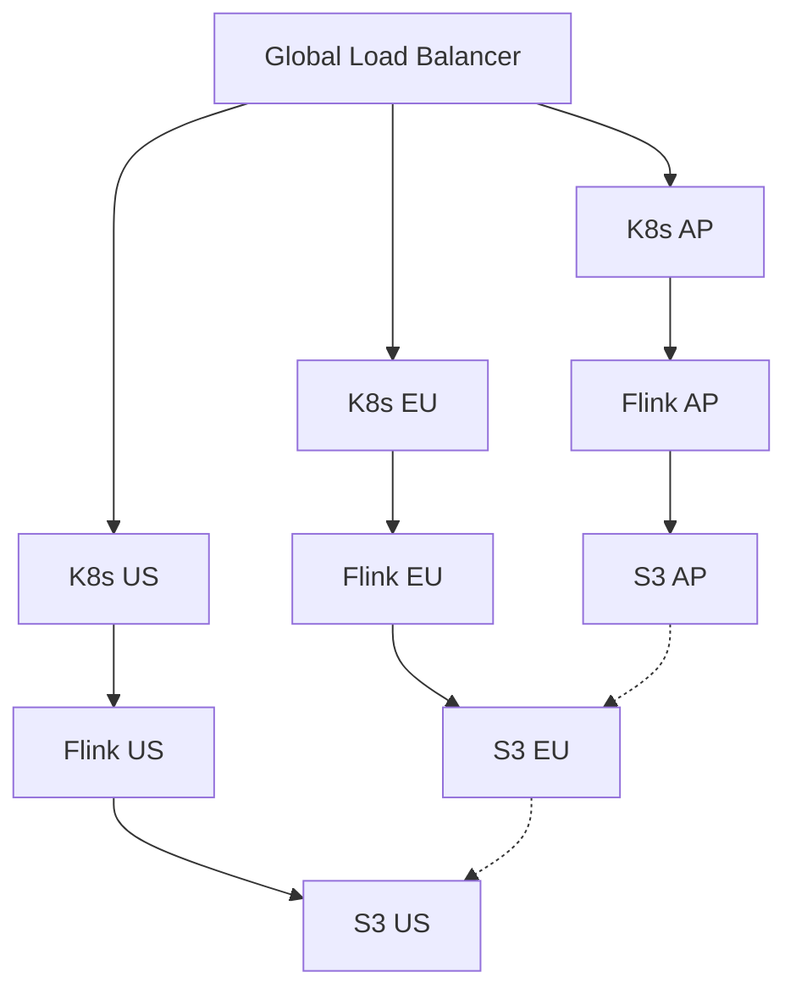
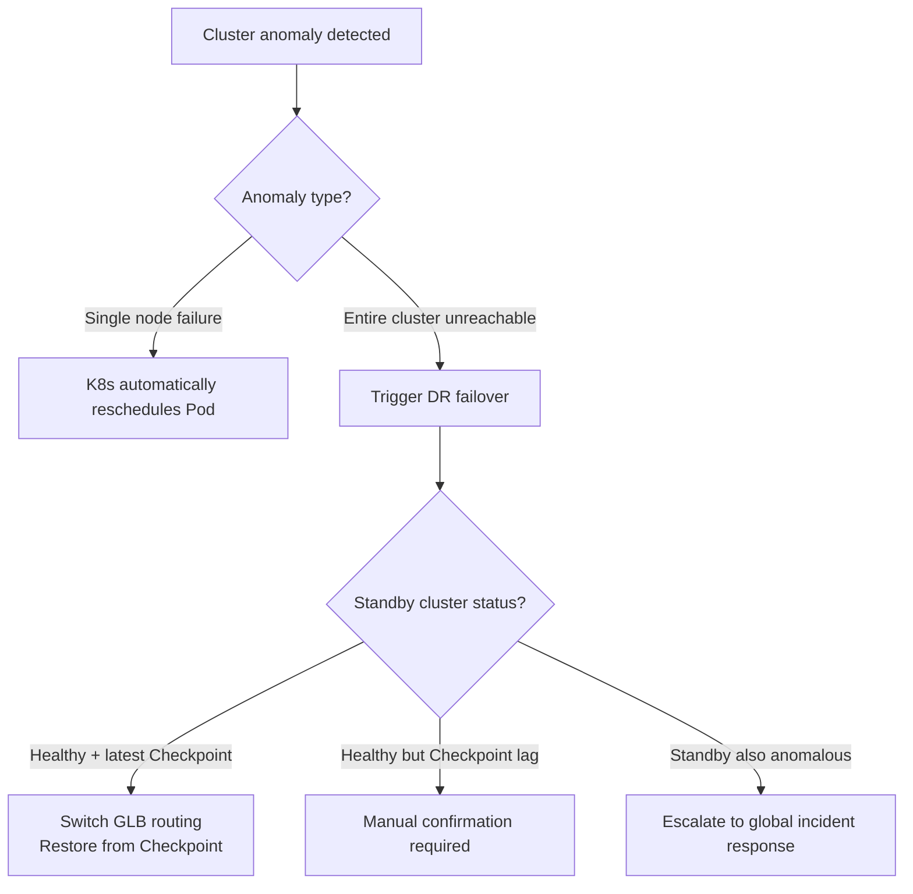

# Flink Multi-Cluster Federation Deployment

> **Stage**: Flink/09-practices/09.04-deployment/ | **Prerequisites**: [Flink GitOps Deployment Mode](./flink-gitops-deployment.md) | **Formalization Level**: L4

---

## 1. Concept Definitions (Definitions)

**Def-F-Dep-04: Cluster Federation**
The ability to manage multiple geographically distributed or functionally isolated Kubernetes clusters as a unified logical resource pool. For Flink, multi-cluster federation means the same set of jobs can be deployed, scheduled, monitored, and failed over across K8s clusters in different regions or availability zones.

**Def-F-Dep-05: Disaster Recovery (DR) Domain**
A geographically isolated set of compute, storage, and network resources whose failure does not affect other DR Domains. Typical design treats each region or availability zone as an independent DR Domain.

**Def-F-Dep-06: Global Load Balancer (GLB)**
A routing layer deployed in front of multiple clusters, distributing data streams or query requests to the optimal Flink cluster instance based on latency, capacity, health status, and other policies.

---

## 2. Property Derivation (Properties)

**Lemma-F-Dep-03: State Consistency Boundary under Federation Deployment**
In a multi-cluster federation, each Flink cluster maintains an independent state backend and Checkpoint storage. Unless cross-cluster state synchronization is explicitly configured (e.g., cross-region replication of object storage), state across different clusters is inconsistent at any given moment.

**Lemma-F-Dep-04: Failover Time and RPO/RTO Constraints**
For failover from cluster A to cluster B, RTO depends on Checkpoint recovery time + job startup time + DNS/GLB switch time. RPO depends on the timestamp of the last successful Checkpoint replicated to storage accessible by cluster B.

**Prop-F-Dep-02: Data Sovereignty Advantage of Local Processing**
Multi-cluster federation allows data to be processed near where it is generated, satisfying data sovereignty regulations such as GDPR while reducing cross-region network latency.

---

## 3. Relation Establishment (Relations)



### Federation Deployment Mode Comparison

| Mode | Data Sync | Complexity | Applicable Scenario |
|------|-----------|------------|---------------------|
| Active-Active | Bidirectional real-time sync | Extremely high | Global low-latency services |
| Active-Standby | Unidirectional async replication | Medium | Disaster recovery & compliance |
| Shard-by-Region | No cross-cluster sync | Low | Complete data isolation |

---

## 4. Argumentation Process (Argumentation)

The core value of multi-cluster federation lies in high availability, local processing, compliance requirements, and capacity expansion. Main challenges include:

- **State Synchronization**: Cross-cluster Checkpoint replication is costly
- **Network Partition**: Clear split-brain handling strategies are needed when inter-cluster communication is interrupted
- **Operational Complexity**: Unified views for multi-cluster monitoring, alerting, and log aggregation are difficult to build
- **Configuration Consistency**: Ensuring all clusters use compatible Flink versions and dependency versions

---

## 5. Formal Proof / Engineering Argument

**Theorem (Thm-F-Dep-02)**: In an Active-Standby multi-cluster federation, if the following hold:

1. Checkpoints are asynchronously replicated to shared storage accessible by the Standby cluster
2. The failure detection mechanism can confirm Active cluster failure within $T_{detect}$
3. The Standby cluster restores the job from the latest available Checkpoint

Then the system RTO $\leq T_{detect} + T_{restore} + T_{route}$, and RPO $\leq T_{checkpoint\_interval} + T_{replication\_delay}$.

**Proof Outline**:

1. Asynchronous replication does not affect Active cluster Checkpoint performance
2. Shared storage provides eventually consistent state access
3. Failure detection is implemented via health probes and Prometheus alerts
4. Recovery time mainly depends on Checkpoint size and Standby cluster resource readiness
5. Routing switch time depends on GLB TTL and DNS propagation speed

---

## 6. Example Verification

### 6.1 Cross-Region FlinkDeployment Template

```yaml
apiVersion: flink.apache.org/v1beta1
kind: FlinkDeployment
metadata:
  name: realtime-analytics-ap
  namespace: flink-apps
  annotations:
    region: ap-southeast-1
spec:
  image: flink:2.0.0
  flinkVersion: v2.0
  jobManager:
    resource:
      memory: "4Gi"
      cpu: 2
  taskManager:
    resource:
      memory: "8Gi"
      cpu: 4
    replicas: 6
  job:
    jarURI: local:///opt/flink/examples/streaming/StateMachineExample.jar
    parallelism: 24
    upgradeMode: savepoint
    state: running
```

### 6.2 S3 Cross-Region Replication Configuration

```json
{
  "Rules": [
    {
      "Status": "Enabled",
      "Priority": 1,
      "DeleteMarkerReplication": { "Status": "Disabled" },
      "Destination": {
        "Bucket": "arn:aws:s3:::flink-checkpoints-eu",
        "ReplicationTime": {
          "Status": "Enabled",
          "Time": { "Minutes": 15 }
        }
      },
      "Filter": { "Prefix": "checkpoints/" }
    }
  ]
}
```

### 6.3 Global Routing Configuration (Cloudflare Example)

```yaml
pools:
  - name: flink-ap-pool
    origins:
      - name: k8s-ap
        address: ap.flink.example.com
        weight: 1
    monitor: http-health-check
  - name: flink-eu-pool
    origins:
      - name: k8s-eu
        address: eu.flink.example.com
        weight: 1
```

---

## 7. Visualizations



---

## 8. References
