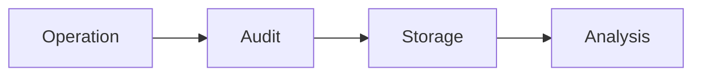

# Audit Mechanism Evolution Tracking

> Stage: Flink/security/evolution | Prerequisites: [Audit][^1] | Formalization Level: L3

## 1. Definitions

### Def-F-Audit-01: Audit Log

Audit log:
$$
\text{AuditLog} = \langle \text{Who}, \text{What}, \text{When}, \text{Result} \rangle
$$

### Def-F-Audit-02: Audit Trail

Audit trail:
$$
\text{Trail} = \{\text{Event}_1, \text{Event}_2, ..., \text{Event}_n\}
$$

## 2. Properties

### Prop-F-Audit-01: Immutability

Immutability:
$$
\text{AuditLog} = \text{AppendOnly}
$$

## 3. Relations

### Audit Evolution

| Version | Feature | Status |
|---------|---------|--------|
| 2.4 | Basic Logging | GA |
| 2.5 | Structured Audit | GA |
| 3.0 | Real-time Audit | In Design |

## 4. Argumentation

### 4.1 Audit Events

| Event | Level |
|-------|-------|
| Login | INFO |
| Permission Change | WARN |
| Sensitive Operation | ERROR |

## 5. Proof / Engineering Argument

### 5.1 Audit Configuration

```yaml
audit.enabled: true
audit.events: [login, permission_change, job_submit]
audit.sink: kafka
```

## 6. Examples

### 6.1 Audit Record

```java
// [伪代码片段 - 不可直接运行] 仅展示核心逻辑
auditLog.record(new AuditEvent()
    .setUser(user)
    .setAction("job.cancel")
    .setResource(jobId)
    .setResult("success"));
```

## 7. Visualizations



## 8. References

[^1]: Flink Audit Documentation

---

## Tracking Information

| Property | Value |
|----------|-------|
| Version | 2.4-3.0 |
| Current Status | Evolving |
