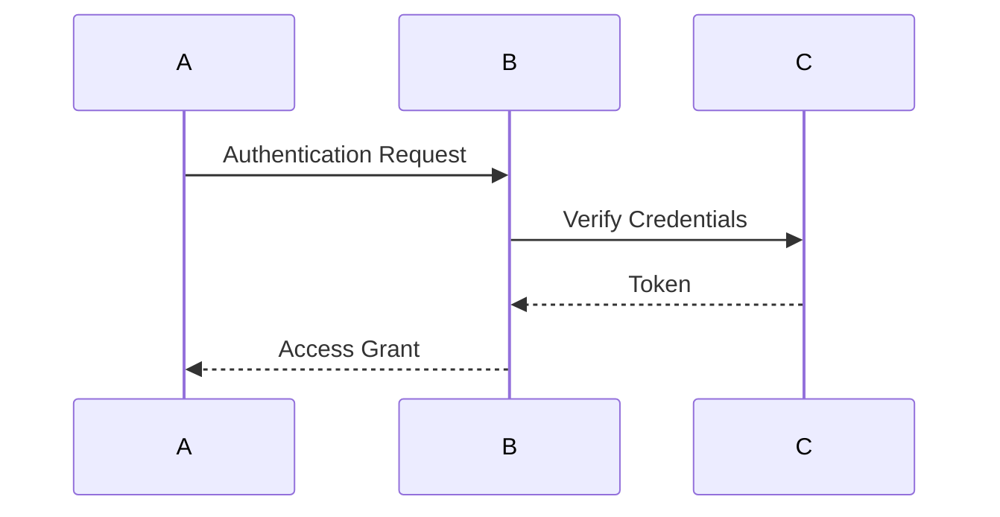

# Authentication Mechanism Evolution Tracking

> Stage: Flink/security/evolution | Prerequisites: [Authentication][^1] | Formalization Level: L3

## 1. Definitions

### Def-F-Auth-01: Authentication

Authentication:
$$
\text{AuthN} : \text{Credentials} \to \text{Identity} | \bot
$$

### Def-F-Auth-02: Multi-Factor Auth

Multi-factor authentication:
$$
\text{MFA} = \text{Password} + \text{Token} + \text{Biometric}
$$

## 2. Properties

### Prop-F-Auth-01: Token Expiry

Token expiry:
$$
T_{\text{token}} \leq 24h
$$

## 3. Relations

### Authentication Evolution

| Version | Feature | Status |
|---------|---------|--------|
| 2.4 | Kerberos | GA |
| 2.5 | OAuth2 | GA |
| 3.0 | Passwordless Auth | In Design |

## 4. Argumentation

### 4.1 Authentication Methods

| Method | Security Level |
|--------|----------------|
| Password | Low |
| Kerberos | High |
| OAuth2 | High |
| MFA | Highest |

## 5. Proof / Engineering Argument

### 5.1 Kerberos Configuration

```yaml
security.kerberos.login.use-ticket-cache: true
security.kerberos.login.keytab: /path/to/keytab
```

## 6. Examples

### 6.1 OAuth2 Integration

```java
OAuth2Client client = new OAuth2Client()
    .withClientId("flink")
    .withClientSecret("secret");
```

## 7. Visualizations



## 8. References

[^1]: Flink Security Documentation

---

## Tracking Information

| Property | Value |
|----------|-------|
| Version | 2.4-3.0 |
| Current Status | Evolving |
