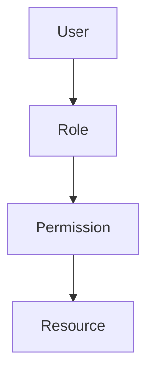

# Authorization Mechanism Evolution Tracking

> Stage: Flink/security/evolution | Prerequisites: [Authorization][^1] | Formalization Level: L3

## 1. Definitions

### Def-F-AuthZ-01: Authorization

Authorization:
$$
\text{AuthZ} : \langle \text{Identity}, \text{Resource}, \text{Action} \rangle \to \{\text{Allow}, \text{Deny}\}
$$

### Def-F-AuthZ-02: RBAC

Role-based access control:
$$
\text{RBAC} = \langle \text{User}, \text{Role}, \text{Permission} \rangle
$$

## 2. Properties

### Prop-F-AuthZ-01: Least Privilege

Least privilege:
$$
\text{Permissions} = \min(\text{Required})
$$

## 3. Relations

### Authorization Evolution

| Version | Feature | Status |
|---------|---------|--------|
| 2.4 | Basic RBAC | GA |
| 2.5 | ABAC | GA |
| 3.0 | Dynamic Authorization | In Design |

## 4. Argumentation

### 4.1 Permission Models

| Model | Granularity |
|-------|-------------|
| ACL | Resource-level |
| RBAC | Role-level |
| ABAC | Attribute-level |

## 5. Proof / Engineering Argument

### 5.1 RBAC Configuration

```yaml
roles: 
  - name: operator
    permissions: 
      - jobs:read
      - jobs:start
      - jobs:stop
```

## 6. Examples

### 6.1 Permission Check

```java
// [伪代码片段 - 不可直接运行] 仅展示核心逻辑
if (authorizer.hasPermission(user, "jobs:cancel", jobId)) {
    cancelJob(jobId);
}
```

## 7. Visualizations



## 8. References

[^1]: Flink Authorization Documentation

---

## Tracking Information

| Property | Value |
|----------|-------|
| Version | 2.4-3.0 |
| Current Status | Evolving |
